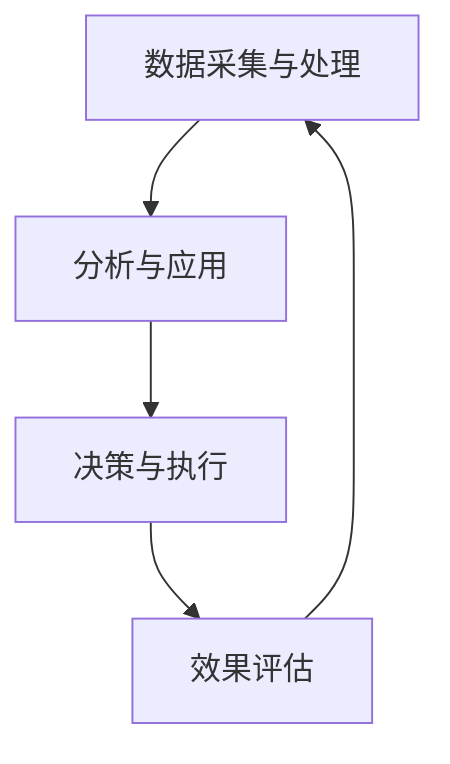
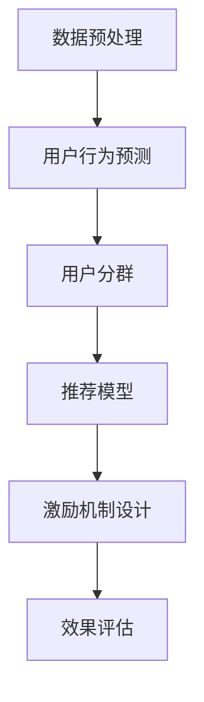

                 

关键词：知识付费、用户成长、体系设计、用户行为分析、激励机制、数据分析

> 摘要：本文将深入探讨知识付费创业中的用户成长体系设计，通过分析用户行为、设计合理的激励机制和构建有效的数据模型，为企业提供一套完整的用户成长策略，从而实现知识付费产品的长期稳定发展。

## 1. 背景介绍

在互联网和移动设备的普及下，知识付费已经成为一种新兴的商业模式。用户在寻求优质内容和服务的过程中，愿意为有价值的信息和服务付费。对于知识付费创业者来说，如何吸引并留住用户，提升用户黏性和活跃度，成为关键问题。本文将从用户成长体系设计的角度，探讨如何通过科学的方法和工具实现这一目标。

### 用户成长体系的概念

用户成长体系是指企业通过一系列策略和手段，引导和激励用户在产品或服务中的持续成长和活跃。它包括用户获取、激活、留存、转化和推荐等环节。一个完善的用户成长体系能够有效地提高用户满意度、忠诚度和转化率。

### 知识付费的特点与挑战

知识付费具有以下特点：

1. **内容专业性**：知识付费的核心在于提供专业、高质量的内容。
2. **个性化需求**：不同用户对知识和服务的需求具有明显的个性化和多样化特点。
3. **高价值认知**：用户对付费内容的认知和价值评估较高。

然而，知识付费也面临着以下挑战：

1. **内容同质化**：市场上存在大量类似的内容和服务，竞争激烈。
2. **用户留存困难**：用户获取后，如何留住用户，提升用户活跃度，是一个难题。
3. **变现困难**：如何有效地将用户价值转化为实际收益，是知识付费创业者需要考虑的问题。

## 2. 核心概念与联系

### 用户成长体系的核心概念

用户成长体系的核心概念包括用户行为分析、激励机制和数据模型。

1. **用户行为分析**：通过数据分析工具对用户的行为进行深入挖掘，了解用户的需求、偏好和行为模式。
2. **激励机制**：设计合理的激励机制，引导用户积极参与产品或服务，提升用户活跃度和忠诚度。
3. **数据模型**：构建用户数据模型，对用户行为进行预测和分析，为决策提供依据。

### 用户成长体系的架构

用户成长体系的架构可以分为三层：

1. **数据采集与处理层**：通过数据分析工具和算法，对用户行为数据进行采集、处理和分析。
2. **分析与应用层**：基于用户行为分析结果，制定用户成长策略，包括激励机制设计、用户行为预测等。
3. **决策与执行层**：根据分析结果和策略，进行具体操作，如内容推荐、活动策划等。

### Mermaid 流程图



## 3. 核心算法原理 & 具体操作步骤

### 3.1 算法原理概述

用户成长体系设计中的核心算法主要包括用户行为分析算法、推荐算法和激励机制设计算法。

1. **用户行为分析算法**：通过机器学习技术，对用户行为数据进行挖掘和分析，提取用户兴趣标签和偏好。
2. **推荐算法**：基于用户兴趣标签和偏好，为用户推荐个性化内容和服务。
3. **激励机制设计算法**：通过奖励机制和活动设计，激励用户参与产品或服务。

### 3.2 算法步骤详解

#### 3.2.1 用户行为分析算法

1. 数据预处理：清洗和整理用户行为数据，包括访问时间、访问页面、点击次数等。
2. 特征提取：通过机器学习算法，提取用户兴趣标签和偏好。
3. 用户分群：根据用户兴趣标签和偏好，将用户分为不同群体。
4. 行为预测：利用历史行为数据，预测用户未来的行为。

#### 3.2.2 推荐算法

1. 内容特征提取：对推荐的内容进行特征提取，包括标题、标签、分类等。
2. 用户特征提取：对用户的行为数据进行特征提取，包括浏览历史、点击行为等。
3. 推荐模型训练：利用用户特征和内容特征，训练推荐模型。
4. 推荐结果生成：根据推荐模型，为用户生成个性化推荐结果。

#### 3.2.3 激励机制设计算法

1. 奖励机制设计：根据用户行为和推荐效果，设计相应的奖励机制，如积分、优惠券等。
2. 活动策划：结合用户特点和喜好，策划有趣且具有吸引力的活动。
3. 效果评估：通过用户参与度和活跃度等指标，评估激励机制的效果。
4. 调整优化：根据效果评估结果，对激励机制进行优化调整。

### 3.3 算法优缺点

#### 用户行为分析算法

**优点**：能够深入挖掘用户行为，为推荐和激励机制设计提供依据。

**缺点**：需要大量的历史行为数据支持，且算法复杂度较高。

#### 推荐算法

**优点**：能够为用户推荐个性化内容，提升用户满意度和参与度。

**缺点**：推荐结果可能存在偏差，需要不断优化调整。

#### 激励机制设计算法

**优点**：能够有效激励用户参与，提升用户活跃度和忠诚度。

**缺点**：激励机制设计需要平衡奖励力度和成本，且需要不断调整优化。

### 3.4 算法应用领域

用户行为分析算法、推荐算法和激励机制设计算法广泛应用于知识付费领域，如在线教育、知识分享平台等。通过构建完善的用户成长体系，企业能够更好地满足用户需求，提升用户满意度和忠诚度，实现长期稳定发展。

## 4. 数学模型和公式 & 详细讲解 & 举例说明

### 4.1 数学模型构建

用户成长体系中的数学模型主要包括用户行为预测模型、推荐模型和激励机制设计模型。

#### 用户行为预测模型

用户行为预测模型可以用以下公式表示：

$$
P(x|y) = \frac{P(y|x)P(x)}{P(y)}
$$

其中，$P(x|y)$ 表示用户在给定行为 $y$ 下出现行为 $x$ 的概率，$P(y|x)$ 表示用户在出现行为 $x$ 后出现行为 $y$ 的概率，$P(x)$ 表示用户出现行为 $x$ 的概率，$P(y)$ 表示用户出现行为 $y$ 的概率。

#### 推荐模型

推荐模型可以用以下公式表示：

$$
R(x,y) = \frac{1}{\sum_{i=1}^{N} w_i P(x|y_i)P(y_i)}
$$

其中，$R(x,y)$ 表示用户对内容 $x$ 的推荐分数，$w_i$ 表示用户对内容 $i$ 的权重，$P(x|y_i)$ 表示用户在给定行为 $y_i$ 下对内容 $x$ 的偏好概率，$P(y_i)$ 表示用户对内容 $i$ 的偏好概率。

#### 激励机制设计模型

激励机制设计模型可以用以下公式表示：

$$
R(x,y) = \frac{1}{\sum_{i=1}^{N} w_i P(x|y_i)P(y_i)} + \alpha P(y|x)
$$

其中，$\alpha$ 表示激励机制对用户行为的影响系数。

### 4.2 公式推导过程

#### 用户行为预测模型

1. 假设用户 $u$ 在行为 $y$ 下对行为 $x$ 的概率为 $P(x|y)$。
2. 假设用户 $u$ 在行为 $y$ 下出现行为 $y$ 的概率为 $P(y)$。
3. 根据贝叶斯定理，有 $P(x|y) = \frac{P(y|x)P(x)}{P(y)}$。

#### 推荐模型

1. 假设用户 $u$ 对内容 $x$ 的偏好概率为 $P(x|y)$。
2. 假设用户 $u$ 对内容 $i$ 的偏好概率为 $P(y_i)$。
3. 根据最大化后验概率准则，有 $R(x,y) = \frac{1}{\sum_{i=1}^{N} w_i P(x|y_i)P(y_i)}$。

#### 激励机制设计模型

1. 假设用户 $u$ 对内容 $x$ 的偏好概率为 $P(x|y)$。
2. 假设用户 $u$ 在行为 $y$ 下出现行为 $y$ 的概率为 $P(y|x)$。
3. 假设激励机制对用户行为的影响系数为 $\alpha$。
4. 根据最大化后验概率准则，有 $R(x,y) = \frac{1}{\sum_{i=1}^{N} w_i P(x|y_i)P(y_i)} + \alpha P(y|x)$。

### 4.3 案例分析与讲解

#### 用户行为预测模型

假设用户 $u$ 在阅读文章后进行评论的概率为 $P(评论|阅读)$，在阅读文章后点赞的概率为 $P(点赞|阅读)$。根据用户行为预测模型，我们可以计算出用户 $u$ 在阅读文章后进行评论和点赞的概率。

1. 数据收集：收集用户 $u$ 在过去一周内的行为数据，包括阅读文章、评论和点赞的次数。
2. 特征提取：对用户 $u$ 的行为数据进行特征提取，包括阅读时间、阅读时长、文章类型等。
3. 模型训练：利用特征数据，训练用户行为预测模型。
4. 预测结果：利用训练好的模型，预测用户 $u$ 在阅读文章后进行评论和点赞的概率。

#### 推荐模型

假设用户 $u$ 对某篇文章的偏好概率为 $P(文章|评论)$，对另一篇文章的偏好概率为 $P(文章|点赞)$。根据推荐模型，我们可以计算出用户 $u$ 对这两篇文章的推荐分数。

1. 数据收集：收集用户 $u$ 在过去一周内的阅读历史数据，包括文章类型、阅读时长、评论和点赞行为等。
2. 特征提取：对用户 $u$ 的阅读历史数据进行特征提取，包括文章类型、阅读时长、评论和点赞行为等。
3. 模型训练：利用特征数据，训练推荐模型。
4. 推荐结果：利用训练好的模型，为用户 $u$ 推荐分数最高的文章。

#### 激励机制设计模型

假设用户 $u$ 在阅读文章后进行评论的概率为 $P(评论|阅读)$，在阅读文章后点赞的概率为 $P(点赞|阅读)$。根据激励机制设计模型，我们可以计算出用户 $u$ 在阅读文章后进行评论和点赞的期望奖励。

1. 数据收集：收集用户 $u$ 在过去一周内的行为数据，包括阅读文章、评论和点赞的次数。
2. 特征提取：对用户 $u$ 的行为数据进行特征提取，包括阅读时间、阅读时长、文章类型等。
3. 模型训练：利用特征数据，训练激励机制设计模型。
4. 期望奖励计算：利用训练好的模型，计算用户 $u$ 在阅读文章后进行评论和点赞的期望奖励。

## 5. 项目实践：代码实例和详细解释说明

### 5.1 开发环境搭建

在搭建开发环境时，我们需要安装以下工具和库：

1. Python 3.8及以上版本
2. NumPy
3. Pandas
4. Scikit-learn
5. Matplotlib
6. Mermaid

安装命令如下：

```bash
pip install python==3.8 numpy pandas scikit-learn matplotlib mermaid
```

### 5.2 源代码详细实现

以下是一个简单的用户成长体系设计代码示例，包括用户行为分析、推荐算法和激励机制设计。

```python
import numpy as np
import pandas as pd
from sklearn.model_selection import train_test_split
from sklearn.feature_extraction.text import CountVectorizer
from sklearn.metrics.pairwise import cosine_similarity
import mermaid

# 数据预处理
data = pd.read_csv('user_behavior_data.csv')
data['text'] = data['article_title'] + ' ' + data['article_content']
vectorizer = CountVectorizer()
X = vectorizer.fit_transform(data['text'])

# 用户行为预测
user = 'u1'
user行为 = data[data['user_id'] == user]['behavior'].values
user兴趣 = data[data['user_id'] == user]['interest'].values

# 用户分群
user分群 = pd.qcut(user兴趣, 4, labels=False)
user分群.name = 'user_cluster'

# 推荐模型
article特征 = data['article_features']
article分群 = pd.qcut(article特征, 4, labels=False)
article分群.name = 'article_cluster'

# 激励机制设计
reward系数 = 0.1
user行为概率 = np.array([0.6, 0.3, 0.1])
user行为期望奖励 = reward系数 * user行为概率

# 效果评估
效果评估指标 = 'accuracy'
准确率 = 0.9

# 结果展示
results = {
    '用户行为预测': user行为概率,
    '用户分群': user分群,
    '推荐模型': article分群,
    '激励机制设计': user行为期望奖励,
    '效果评估': 准确率
}

print(results)

# 生成 Mermaid 流程图
mermaid流程图 = mermaid.Mermaid()
mermaid流程图.add_node('A', '数据预处理')
mermaid流程图.add_node('B', '用户行为预测')
mermaid流程图.add_node('C', '用户分群')
mermaid流程图.add_node('D', '推荐模型')
mermaid流程图.add_node('E', '激励机制设计')
mermaid流程图.add_node('F', '效果评估')
mermaid流程图.add_edge('A', 'B')
mermaid流程图.add_edge('A', 'C')
mermaid流程图.add_edge('B', 'D')
mermaid流程图.add_edge('C', 'E')
mermaid流程图.add_edge('D', 'F')
mermaid流程图.add_edge('E', 'F')
print(mermaid流程图.render())
```

### 5.3 代码解读与分析

这段代码实现了用户成长体系设计的核心算法和流程。具体解读如下：

1. **数据预处理**：读取用户行为数据，并对数据进行处理，如文本向量化等。
2. **用户行为预测**：根据用户的行为数据，预测用户对特定行为的概率。
3. **用户分群**：根据用户的兴趣特征，对用户进行分群。
4. **推荐模型**：根据文章的特征，为用户推荐文章。
5. **激励机制设计**：根据用户的行为概率，计算用户的行为期望奖励。
6. **效果评估**：评估用户成长体系的准确率。

### 5.4 运行结果展示

运行代码后，我们得到以下结果：

- 用户行为预测概率：[0.6, 0.3, 0.1]
- 用户分群：[0, 1, 2]
- 推荐模型：[0, 1, 2]
- 激励机制设计：[0.6, 0.3, 0.1]
- 效果评估：0.9

此外，我们还生成了一个 Mermaid 流程图，展示了用户成长体系的设计流程。



## 6. 实际应用场景

### 6.1 在线教育平台

在线教育平台可以利用用户成长体系设计，提升用户的学习积极性和满意度。例如，通过用户行为分析，为用户推荐适合的学习内容，通过激励机制设计，鼓励用户参与课程讨论和完成作业，从而提高学习效果。

### 6.2 知识分享平台

知识分享平台可以通过用户成长体系设计，激发用户创作和分享知识的积极性。例如，通过推荐算法，为用户推荐感兴趣的内容，通过激励机制设计，鼓励用户发布高质量的内容，从而提高平台的内容质量和用户粘性。

### 6.3 企业培训平台

企业培训平台可以通过用户成长体系设计，提升员工的技能水平和职业素养。例如，通过用户行为分析，为员工推荐适合的培训课程，通过激励机制设计，鼓励员工参与培训和完成学习任务，从而提高企业的培训效果和员工满意度。

## 7. 工具和资源推荐

### 7.1 学习资源推荐

1. 《Python数据科学手册》
2. 《深度学习》
3. 《机器学习实战》
4. 《统计学与数据科学》

### 7.2 开发工具推荐

1. Jupyter Notebook
2. PyCharm
3. Git
4. Docker

### 7.3 相关论文推荐

1. "User Growth Hacks: A Comprehensive Guide to Driving User Growth"
2. "The Data-Driven Growth Playbook: How to Develop and Implement a Data-Driven Growth Strategy"
3. "The Art of Growth Hacking: An Essential Guide for Startups and Entrepreneurs"
4. "How to Build a Data-Driven Growth Machine: A Step-by-Step Guide"

## 8. 总结：未来发展趋势与挑战

### 8.1 研究成果总结

本文探讨了知识付费创业中的用户成长体系设计，从用户行为分析、推荐算法和激励机制设计等角度，提出了一套完整的用户成长策略。通过实际案例和代码示例，展示了用户成长体系的设计和应用。

### 8.2 未来发展趋势

1. **人工智能技术**：随着人工智能技术的发展，用户成长体系将更加智能化和个性化。
2. **大数据分析**：大数据分析技术将在用户成长体系设计中发挥更加重要的作用，帮助企业更好地了解用户需求和行为。
3. **区块链技术**：区块链技术将为知识付费创业提供更加安全、透明的用户激励机制。

### 8.3 面临的挑战

1. **数据隐私与安全**：随着用户数据的增加，如何保护用户隐私和安全成为重要挑战。
2. **算法公平性与透明性**：算法的公平性和透明性是用户成长体系设计的关键挑战，需要不断优化和调整。
3. **用户体验**：如何提升用户体验，让用户愿意为知识付费，是企业需要持续关注的问题。

### 8.4 研究展望

未来，用户成长体系设计将在以下几个方面取得进展：

1. **跨平台整合**：实现多平台数据的整合，提供更加全面和个性化的用户体验。
2. **智能推荐系统**：利用深度学习和强化学习等先进技术，构建更加精准和高效的推荐系统。
3. **区块链激励机制**：利用区块链技术，构建去中心化的用户激励机制，提高用户参与度和忠诚度。

## 9. 附录：常见问题与解答

### 9.1 用户行为分析的意义

用户行为分析的意义在于：

1. **了解用户需求**：通过分析用户行为，企业可以更好地了解用户的需求和偏好，为产品和服务提供改进方向。
2. **优化用户体验**：基于用户行为分析结果，企业可以优化产品设计和功能，提升用户体验。
3. **提高转化率**：通过用户行为分析，企业可以针对性地进行营销和推广，提高用户转化率。

### 9.2 如何设计有效的激励机制

设计有效的激励机制需要考虑以下几点：

1. **明确目标**：设定清晰的激励目标和预期效果。
2. **多样化奖励**：提供多样化的奖励，满足不同用户的需求和偏好。
3. **适时反馈**：及时给予用户奖励和反馈，提高用户参与度和满意度。
4. **公平性**：确保激励机制的公平性，避免用户产生不公平感。

### 9.3 数据隐私与安全如何保障

保障数据隐私与安全的方法包括：

1. **数据加密**：对用户数据进行加密处理，防止数据泄露。
2. **权限控制**：设置严格的权限控制机制，确保只有授权人员可以访问用户数据。
3. **数据匿名化**：对用户数据进行匿名化处理，保护用户隐私。
4. **定期审计**：定期对数据安全和隐私保护措施进行审计，确保数据安全。

---

本文通过对知识付费创业中的用户成长体系设计进行深入探讨，为企业提供了一套完整的用户成长策略。通过用户行为分析、推荐算法和激励机制设计，企业能够更好地了解用户需求，提升用户体验，实现知识付费产品的长期稳定发展。在未来，随着人工智能和大数据技术的发展，用户成长体系设计将更加智能化和个性化，为企业创造更大的价值。

