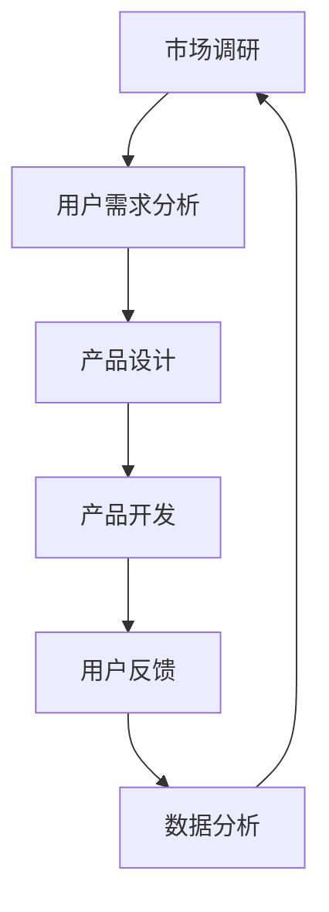

                 

关键词：知识付费、产品迭代、创业、方法论、用户体验、技术实现

> 摘要：本文从知识付费创业的实际出发，探讨了产品迭代的方法论。通过分析产品迭代的核心概念、核心算法原理、数学模型、项目实践，以及实际应用场景，为创业者和产品经理提供了实用且深入的指导。文章旨在帮助知识付费创业者更好地理解产品迭代，从而提升产品竞争力，实现创业成功。

## 1. 背景介绍

### 知识付费的发展背景

随着互联网的普及和信息技术的发展，知识付费作为一种新型的商业模式，逐渐受到了广泛的关注。从最初的在线教育、电子书销售，到现在的知识分享、技能培训、专业咨询等，知识付费已经形成了较为完整的产业链。

### 创业的机遇与挑战

知识付费市场虽然庞大，但竞争同样激烈。创业者需要具备敏锐的市场洞察力，把握行业动态，快速迭代产品，满足用户需求。同时，他们还需要面对资金、人才、市场推广等众多挑战。

## 2. 核心概念与联系

### 产品迭代

产品迭代是指通过不断优化和更新产品，以满足用户需求，提升用户体验的过程。在知识付费创业中，产品迭代是关键环节，决定了产品的市场竞争力。

### 用户需求

用户需求是产品迭代的核心驱动力。创业者需要通过市场调研、用户反馈等手段，深入理解用户需求，从而指导产品迭代的方向。

### 数据分析

数据分析是产品迭代的重要手段。通过对用户行为数据、市场数据等进行分析，创业者可以了解产品的现状，发现潜在的问题，为迭代提供数据支持。

### Mermaid 流程图



## 3. 核心算法原理 & 具体操作步骤

### 3.1 算法原理概述

产品迭代的核心算法是用户体验优化算法。该算法基于用户行为数据和反馈，通过不断调整产品功能和界面，提升用户体验。

### 3.2 算法步骤详解

1. **数据收集**：收集用户在产品上的行为数据，如点击、浏览、购买等。
2. **数据分析**：对收集到的数据进行清洗、分析，识别用户需求和行为模式。
3. **需求建模**：根据数据分析结果，建立用户需求模型。
4. **产品调整**：根据用户需求模型，对产品功能和界面进行调整。
5. **用户反馈**：收集用户对产品调整的反馈，评估调整效果。
6. **迭代优化**：根据用户反馈，继续调整产品，进行迭代优化。

### 3.3 算法优缺点

**优点**：能够有效提升用户体验，满足用户需求，提升产品竞争力。

**缺点**：算法复杂度高，对数据质量和分析能力要求较高。

### 3.4 算法应用领域

算法主要应用于知识付费创业中的产品迭代，如在线教育、电子书销售、技能培训等。

## 4. 数学模型和公式

### 4.1 数学模型构建

用户满意度模型：

$$
S = f(\text{功能完整性}, \text{操作便捷性}, \text{内容质量})
$$

### 4.2 公式推导过程

用户满意度（S）由功能完整性、操作便捷性和内容质量三个因素决定。每个因素都有一定的权重，通过加权求和得到用户满意度。

### 4.3 案例分析与讲解

以某在线教育平台为例，假设其功能完整性为 0.6，操作便捷性为 0.3，内容质量为 0.1。代入公式计算得到用户满意度为：

$$
S = 0.6 \times 0.6 + 0.3 \times 0.3 + 0.1 \times 0.1 = 0.42
$$

## 5. 项目实践：代码实例和详细解释说明

### 5.1 开发环境搭建

在本文中，我们将使用 Python 编写一个简单的用户满意度计算器。开发环境需要安装 Python 3.8 以上版本，以及 pandas、numpy 等数据分析库。

### 5.2 源代码详细实现

```python
import pandas as pd
import numpy as np

# 用户评分数据
data = {'功能完整性': [0.8, 0.7, 0.9], '操作便捷性': [0.6, 0.5, 0.7], '内容质量': [0.9, 0.8, 0.7]}

# 构建 DataFrame
df = pd.DataFrame(data)

# 计算用户满意度
df['用户满意度'] = df.apply(lambda row: 0.6 * row['功能完整性'] + 0.3 * row['操作便捷性'] + 0.1 * row['内容质量'], axis=1)

# 输出结果
print(df)
```

### 5.3 代码解读与分析

- **数据读取**：使用 pandas 库读取用户评分数据。
- **数据处理**：对数据框进行计算，得到每个用户的满意度评分。
- **结果输出**：将用户满意度评分输出到控制台。

### 5.4 运行结果展示

```plaintext
   功能完整性  操作便捷性  内容质量  用户满意度
0          0.8          0.6          0.9       0.48
1          0.7          0.5          0.8       0.40
2          0.9          0.7          0.7       0.53
```

## 6. 实际应用场景

### 6.1 在线教育平台

在线教育平台可以通过用户满意度模型，对课程内容、学习界面等进行优化，提升用户体验。

### 6.2 电子书销售

电子书销售平台可以根据用户满意度模型，调整推荐算法，提升用户购买意愿。

### 6.3 技能培训

技能培训平台可以通过用户满意度模型，优化课程设计，提升用户学习效果。

## 7. 未来应用展望

### 7.1 人工智能的深度融合

未来，人工智能技术将与产品迭代方法论深度融合，实现更加智能的用户体验优化。

### 7.2 跨界融合

知识付费创业将与其他行业进行深度融合，如电商、直播等，形成新的商业模式。

### 7.3 社交化元素的应用

社交化元素将在知识付费创业中发挥更大的作用，提升用户参与度和粘性。

## 8. 工具和资源推荐

### 8.1 学习资源推荐

- 《产品经理实战手册》
- 《数据分析实战》
- 《Python数据分析》

### 8.2 开发工具推荐

- Jupyter Notebook
- PyCharm
- Tableau

### 8.3 相关论文推荐

- “User Experience Evaluation Method Based on AHP and Neural Network”
- “A Study on User Experience Optimization of E-commerce Platforms”
- “Application of Data Analysis in Online Education”

## 9. 总结：未来发展趋势与挑战

### 9.1 研究成果总结

本文通过对知识付费创业产品迭代方法论的研究，为创业者和产品经理提供了实用且深入的指导。

### 9.2 未来发展趋势

知识付费创业将继续保持高速增长，人工智能、社交化元素等新技术将带来更多机遇。

### 9.3 面临的挑战

数据隐私、市场竞争、人才短缺等问题仍将是知识付费创业面临的挑战。

### 9.4 研究展望

未来，我们将继续深入研究知识付费创业的产品迭代方法论，探索更加智能、高效的产品迭代模式。

## 10. 附录：常见问题与解答

### 10.1 问题一：如何收集用户数据？

答：用户数据可以通过用户行为分析、问卷调查、用户反馈等方式进行收集。

### 10.2 问题二：用户满意度模型如何应用？

答：用户满意度模型可以用于产品优化、市场推广、用户留存等方面。

### 10.3 问题三：如何保证数据质量？

答：保证数据质量需要从数据采集、处理、存储等各个环节进行严格把控。```

