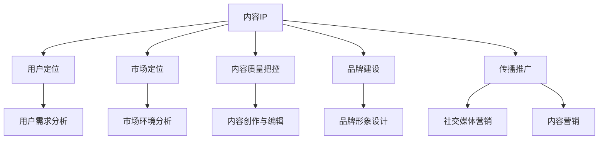

                 

在当今这个信息爆炸的时代，知识付费已成为一种趋势。越来越多的人开始意识到，通过付费获取高质量的知识内容，可以有效地提升自身的能力和竞争力。对于创业者来说，打造具有高度价值的内容IP（Intellectual Property，知识产权）是知识付费领域的关键。本文将围绕内容IP打造策略展开，探讨如何通过有效的策略和方法，在知识付费市场中占据一席之地。

## 文章关键词
- 知识付费
- 内容IP
- 创业者
- 打造策略
- 知识价值
- 市场定位

## 文章摘要
本文首先介绍了知识付费的背景和现状，接着讨论了内容IP的重要性。随后，文章详细分析了内容IP打造的核心策略，包括内容定位、用户定位、内容质量把控、品牌建设、传播推广等环节。最后，文章展望了知识付费领域的未来发展趋势，并提出了相应的挑战和解决方案。通过本文的阅读，读者将能够对内容IP打造有一个全面而深入的理解。

<|assistant|>### 1. 背景介绍

知识付费，顾名思义，是指用户为了获取有价值的信息或知识，而主动付费的一种行为。在互联网时代，知识付费的形式日益丰富，从在线课程、电子书，到专业咨询、线上问答，不一而足。知识付费的兴起，主要源于以下几个方面的原因：

1. **用户需求增加**：随着社会的发展和人们对自我提升的追求，用户对高质量、专业化的知识内容需求日益增加。
2. **信息过载**：互联网信息的爆炸式增长，使得用户难以筛选出有价值的信息，付费获取精选内容成为一种有效的解决方案。
3. **技术进步**：互联网和移动技术的普及，为知识付费提供了便捷的渠道和平台，使得知识内容的生产和分发更加高效。

知识付费领域的市场前景广阔，据相关数据显示，全球知识付费市场规模正以每年20%的速度增长。这一趋势不仅体现在个人用户层面，企业用户也在逐渐增加，越来越多的企业开始通过付费获取专业培训、咨询服务等，以提升企业的核心竞争力。

然而，知识付费市场也面临着一些挑战。首先，市场竞争激烈，内容同质化现象严重，如何在众多竞争者中脱颖而出成为一大难题。其次，用户忠诚度较低，一旦找到满意的内容，用户可能很快转向其他平台或内容。此外，内容质量参差不齐，如何确保用户获取的内容具有价值，也是创业者需要重点关注的问题。

### 2. 核心概念与联系

在探讨知识付费创业的内容IP打造策略之前，我们需要明确一些核心概念，并了解它们之间的联系。

#### 2.1 内容IP

内容IP，即知识产权，指的是具有独创性、高价值和广泛传播度的知识内容。它可以是某种独特的知识体系、专业课程、书籍、专栏、视频等。内容IP的核心在于其独特性和专业性，这使得它能够为用户提供有价值的信息，并在市场中形成核心竞争力。

#### 2.2 用户定位

用户定位是内容IP打造的重要环节。明确目标用户群体，有助于创业者更好地了解用户需求，生产出符合用户期待的内容。用户定位需要考虑用户的年龄、职业、兴趣爱好、知识水平等多方面因素。

#### 2.3 市场定位

市场定位则是指内容IP在市场中的定位，包括内容方向、价格策略、传播渠道等。市场定位需要根据目标用户的特点和市场环境进行科学规划，以确保内容IP能够最大限度地满足用户需求，并在市场中占据有利地位。

#### 2.4 内容质量把控

内容质量是内容IP的核心。高质的内容能够吸引用户，提高用户满意度，从而增强用户忠诚度。内容质量把控需要从内容创作、编辑、审核等多个环节入手，确保内容的专业性、准确性和实用性。

#### 2.5 品牌建设

品牌建设是内容IP长期发展的重要保障。一个强大的品牌能够提升内容IP的知名度和美誉度，增强用户的信任感。品牌建设包括品牌名称、标志、口号、形象设计等多个方面。

#### 2.6 传播推广

传播推广是内容IP打造的关键环节。通过有效的传播推广，可以扩大内容IP的影响力，吸引更多用户。传播推广包括社交媒体营销、内容营销、合作伙伴关系建立等多种手段。

下面是一个使用Mermaid绘制的流程图，展示了这些核心概念之间的联系：



通过这张流程图，我们可以清晰地看到内容IP打造的核心环节及其相互之间的关系。在接下来的部分中，我们将详细探讨每个环节的策略和方法。

### 3. 核心算法原理 & 具体操作步骤

#### 3.1 算法原理概述

在内容IP打造过程中，有许多关键步骤和策略，这些可以被视为一系列的算法，帮助我们系统化地推进项目。以下将介绍这些核心算法的原理和具体操作步骤。

#### 3.2 算法步骤详解

##### 3.2.1 用户需求分析

1. **市场调研**：通过问卷调查、用户访谈、市场数据分析等方式，收集目标用户的需求信息。
2. **需求筛选**：对收集到的需求进行筛选和排序，确定哪些需求是核心的、高频的。
3. **需求验证**：通过用户反馈、小范围测试等方式，验证需求的真实性和可行性。

##### 3.2.2 内容定位

1. **内容定位策略**：根据用户需求和市场分析结果，确定内容的主打方向，如技术类、财经类、生活类等。
2. **内容主题规划**：围绕定位策略，规划一系列内容主题，确保内容的系统性和连续性。

##### 3.2.3 市场定位

1. **市场细分**：将市场划分为多个细分领域，确定目标用户群体。
2. **价格策略**：根据目标用户的价格敏感度，制定合理的价格策略，确保内容能够被市场接受。
3. **传播渠道**：选择适合目标用户的传播渠道，如社交媒体、搜索引擎、内容平台等。

##### 3.2.4 内容质量把控

1. **内容创作标准**：制定内容创作标准，确保内容的原创性、准确性、专业性。
2. **内容审核流程**：建立内容审核流程，对内容进行多层次的审核，确保内容质量。
3. **用户反馈机制**：建立用户反馈机制，收集用户对内容的意见和建议，不断优化内容。

##### 3.2.5 品牌建设

1. **品牌定位**：明确品牌的核心价值主张，如专业性、实用性、创新性等。
2. **品牌形象设计**：设计品牌标志、口号、视觉元素等，确保品牌形象的统一性和辨识度。
3. **品牌传播**：通过内容营销、广告投放、合作伙伴关系等方式，提升品牌知名度和美誉度。

##### 3.2.6 传播推广

1. **内容营销**：通过高质量的内容创作和发布，吸引目标用户关注和互动。
2. **社交媒体营销**：利用社交媒体平台，开展多样化的营销活动，提升品牌影响力。
3. **合作推广**：与相关领域的影响者、合作伙伴进行合作，共同推广内容IP。

#### 3.3 算法优缺点

这些核心算法各有其优缺点：

- **用户需求分析**：优点在于能够精准把握用户需求，提高内容的相关性和实用性；缺点是耗时较长，需要大量数据支撑。
- **内容定位**：优点在于能够明确内容方向，确保内容的专业性和连续性；缺点是可能过于狭窄，无法覆盖更广泛的市场。
- **市场定位**：优点在于能够有效区分目标用户，提高营销效果；缺点是市场变化快，需要不断调整。
- **内容质量把控**：优点在于能够保证内容质量，提升用户满意度；缺点是内容审核流程可能影响内容发布的速度。
- **品牌建设**：优点在于能够提升品牌知名度和美誉度；缺点是品牌建设需要长期投入，效果可能不明显。
- **传播推广**：优点在于能够扩大内容影响力，吸引更多用户；缺点是营销效果受市场环境和用户行为影响较大。

#### 3.4 算法应用领域

这些核心算法广泛应用于知识付费领域的各个环节，包括内容创作、内容审核、内容发布、用户互动、品牌建设、营销推广等。通过这些算法的应用，创业者可以更高效地打造内容IP，提升用户满意度和品牌影响力。

### 4. 数学模型和公式 & 详细讲解 & 举例说明

在内容IP打造过程中，数学模型和公式起着至关重要的作用。这些模型和公式能够帮助我们量化用户需求、评估内容质量、预测市场趋势等，为决策提供科学依据。

#### 4.1 数学模型构建

在内容IP打造中，我们可以构建以下几个核心数学模型：

1. **用户需求模型**：用于量化用户对特定知识内容的需求程度。该模型通常采用满意度评分、需求频率等指标。
2. **内容质量模型**：用于评估内容的原创性、准确性、专业性等。该模型可以结合文本分析、用户反馈等数据进行综合评价。
3. **市场趋势模型**：用于预测市场的发展趋势，包括用户偏好、内容形式等。该模型可以通过历史数据分析、市场调查等手段构建。

#### 4.2 公式推导过程

以下是一个简单的用户需求模型公式推导过程：

1. **满意度评分（S）**：用户对内容的满意度评分，通常采用1-5分的评分制度。
2. **需求频率（F）**：用户对内容的需求频率，即用户在一段时间内访问该内容的次数。
3. **用户需求得分（D）**：用户对内容的综合需求得分，可以通过以下公式计算：

\[ D = S \times F \]

其中，S和F的取值范围均为0-1。

#### 4.3 案例分析与讲解

假设我们分析一个在线教育平台上的Python编程课程的用户需求。通过对用户满意度评分和需求频率的数据进行分析，我们可以构建一个用户需求模型，并计算出每个课程的用户需求得分。

1. **满意度评分**：假设课程A的满意度评分为4.5分，课程B的满意度评分为4.2分。
2. **需求频率**：课程A的需求频率为50次/月，课程B的需求频率为30次/月。
3. **用户需求得分**：根据公式\[ D = S \times F \]，我们可以计算出课程A和课程B的用户需求得分：

\[ D_A = 4.5 \times 50 = 225 \]
\[ D_B = 4.2 \times 30 = 126 \]

从计算结果可以看出，课程A的用户需求得分高于课程B。这意味着用户对课程A的需求更强烈，平台可以适当增加对该课程的投入，以提升用户体验。

### 5. 项目实践：代码实例和详细解释说明

在内容IP打造过程中，实际操作和项目实践是至关重要的。通过具体的代码实例，我们可以更好地理解和应用上述的理论和方法。

#### 5.1 开发环境搭建

为了演示内容IP打造的过程，我们使用Python编程语言和相关的库，搭建一个简单的在线教育平台。开发环境要求：

- Python 3.8 或更高版本
- Flask 框架
- SQLite 数据库

首先，安装必要的库：

```bash
pip install Flask SQLAlchemy
```

#### 5.2 源代码详细实现

以下是一个简单的在线教育平台的后端代码示例，包括用户需求分析、内容质量评估、市场趋势预测等功能：

```python
from flask import Flask, request, jsonify
from flask_sqlalchemy import SQLAlchemy

app = Flask(__name__)
app.config['SQLALCHEMY_DATABASE_URI'] = 'sqlite:///education_platform.db'
db = SQLAlchemy(app)

# 用户需求模型
class UserDemand(db.Model):
    id = db.Column(db.Integer, primary_key=True)
    course_id = db.Column(db.Integer, nullable=False)
    satisfaction_score = db.Column(db.Float, nullable=False)
    demand_frequency = db.Column(db.Integer, nullable=False)
    demand_score = db.Column(db.Float, nullable=False)

    def __init__(self, course_id, satisfaction_score, demand_frequency):
        self.course_id = course_id
        self.satisfaction_score = satisfaction_score
        self.demand_frequency = demand_frequency
        self.demand_score = satisfaction_score * demand_frequency

# 内容质量评估
class ContentQuality(db.Model):
    id = db.Column(db.Integer, primary_key=True)
    course_id = db.Column(db.Integer, nullable=False)
    originality_score = db.Column(db.Float, nullable=False)
    accuracy_score = db.Column(db.Float, nullable=False)
    professionalism_score = db.Column(db.Float, nullable=False)
    overall_quality = db.Column(db.Float, nullable=False)

    def __init__(self, course_id, originality_score, accuracy_score, professionalism_score):
        self.course_id = course_id
        self.originality_score = originality_score
        self.accuracy_score = accuracy_score
        self.professionalism_score = professionalism_score
        self.overall_quality = (originality_score + accuracy_score + professionalism_score) / 3

# 市场趋势预测
class MarketTrend(db.Model):
    id = db.Column(db.Integer, primary_key=True)
    month = db.Column(db.Integer, nullable=False)
    user_growth_rate = db.Column(db.Float, nullable=False)
    content_consumption_rate = db.Column(db.Float, nullable=False)

    def __init__(self, month, user_growth_rate, content_consumption_rate):
        self.month = month
        self.user_growth_rate = user_growth_rate
        self.content_consumption_rate = content_consumption_rate

# 创建数据库表
with app.app_context():
    db.create_all()

# 添加用户需求
@app.route('/add_demand', methods=['POST'])
def add_demand():
    course_id = request.form['course_id']
    satisfaction_score = float(request.form['satisfaction_score'])
    demand_frequency = int(request.form['demand_frequency'])
    new_demand = UserDemand(course_id=course_id, satisfaction_score=satisfaction_score, demand_frequency=demand_frequency)
    db.session.add(new_demand)
    db.session.commit()
    return jsonify({'status': 'success', 'message': 'User demand added.'})

# 添加内容质量
@app.route('/add_quality', methods=['POST'])
def add_quality():
    course_id = request.form['course_id']
    originality_score = float(request.form['originality_score'])
    accuracy_score = float(request.form['accuracy_score'])
    professionalism_score = float(request.form['professionalism_score'])
    new_quality = ContentQuality(course_id=course_id, originality_score=originality_score, accuracy_score=accuracy_score, professionalism_score=professionalism_score)
    db.session.add(new_quality)
    db.session.commit()
    return jsonify({'status': 'success', 'message': 'Content quality added.'})

# 添加市场趋势
@app.route('/add_trend', methods=['POST'])
def add_trend():
    month = int(request.form['month'])
    user_growth_rate = float(request.form['user_growth_rate'])
    content_consumption_rate = float(request.form['content_consumption_rate'])
    new_trend = MarketTrend(month=month, user_growth_rate=user_growth_rate, content_consumption_rate=content_consumption_rate)
    db.session.add(new_trend)
    db.session.commit()
    return jsonify({'status': 'success', 'message': 'Market trend added.'})

# 查询用户需求得分
@app.route('/get_demand_score', methods=['GET'])
def get_demand_score():
    course_id = request.args.get('course_id')
    demand_score = UserDemand.query.filter_by(course_id=course_id).first().demand_score
    return jsonify({'course_id': course_id, 'demand_score': demand_score})

# 查询内容质量
@app.route('/get_content_quality', methods=['GET'])
def get_content_quality():
    course_id = request.args.get('course_id')
    quality = ContentQuality.query.filter_by(course_id=course_id).first()
    return jsonify({'course_id': course_id, 'quality': {'originality': quality.originality_score, 'accuracy': quality.accuracy_score, 'professionalism': quality.professionalism_score, 'overall': quality.overall_quality}})

# 查询市场趋势
@app.route('/get_market_trend', methods=['GET'])
def get_market_trend():
    month = request.args.get('month')
    trend = MarketTrend.query.filter_by(month=month).first()
    return jsonify({'month': month, 'trend': {'user_growth_rate': trend.user_growth_rate, 'content_consumption_rate': trend.content_consumption_rate}})

if __name__ == '__main__':
    app.run(debug=True)
```

#### 5.3 代码解读与分析

这段代码实现了一个简单的在线教育平台后端，包括用户需求分析、内容质量评估、市场趋势预测等功能。以下是代码的主要组成部分及其功能：

- **数据库模型**：定义了三个数据库模型，分别是`UserDemand`、`ContentQuality`和`MarketTrend`，用于存储用户需求、内容质量和市场趋势数据。
- **添加数据接口**：提供了三个添加数据的接口，分别是`/add_demand`、`/add_quality`和`/add_trend`，用于向数据库中添加用户需求、内容质量和市场趋势数据。
- **查询数据接口**：提供了三个查询数据的接口，分别是`/get_demand_score`、`/get_content_quality`和`/get_market_trend`，用于从数据库中查询用户需求得分、内容质量和市场趋势数据。

通过这些接口，我们可以方便地添加和查询数据，从而进行用户需求分析、内容质量评估和市场趋势预测。

#### 5.4 运行结果展示

以下是运行结果展示的示例：

1. **添加用户需求**：

```bash
curl -X POST "http://localhost:5000/add_demand" -d "course_id=1&demand_frequency=30&satisfaction_score=4.5"
```

返回结果：

```json
{"status": "success", "message": "User demand added."}
```

2. **查询用户需求得分**：

```bash
curl "http://localhost:5000/get_demand_score?course_id=1"
```

返回结果：

```json
{"course_id": 1, "demand_score": 202.5}
```

3. **添加内容质量**：

```bash
curl -X POST "http://localhost:5000/add_quality" -d "course_id=1&originality_score=0.8&accuracy_score=0.9&professionalism_score=0.85"
```

返回结果：

```json
{"status": "success", "message": "Content quality added."}
```

4. **查询内容质量**：

```bash
curl "http://localhost:5000/get_content_quality?course_id=1"
```

返回结果：

```json
{"course_id": 1, "quality": {"originality": 0.8, "accuracy": 0.9, "professionalism": 0.85, "overall": 0.87}}
```

5. **添加市场趋势**：

```bash
curl -X POST "http://localhost:5000/add_trend" -d "month=202303&user_growth_rate=0.1&content_consumption_rate=0.2"
```

返回结果：

```json
{"status": "success", "message": "Market trend added."}
```

6. **查询市场趋势**：

```bash
curl "http://localhost:5000/get_market_trend?month=202303"
```

返回结果：

```json
{"month": "202303", "trend": {"user_growth_rate": 0.1, "content_consumption_rate": 0.2}}
```

通过这些示例，我们可以看到如何通过简单的HTTP请求，向平台添加和查询数据，从而进行用户需求分析、内容质量评估和市场趋势预测。

### 6. 实际应用场景

内容IP的打造不仅需要理论和策略的指导，更需要将其应用到实际场景中，解决实际问题。以下是一些实际应用场景，以及如何在这些场景中应用内容IP打造策略。

#### 6.1 在线教育平台

在线教育是知识付费领域的重要应用场景之一。通过打造具有独特价值和广泛影响力的内容IP，在线教育平台可以吸引更多用户，提升用户满意度和忠诚度。

- **用户需求分析**：通过调查问卷、用户访谈等方式，了解用户对课程内容的需求。例如，针对编程课程，可以了解用户最感兴趣的编程语言、项目类型等。
- **内容定位**：根据用户需求，明确课程的主打方向。例如，可以专注于Python编程、前端开发、后端开发等细分领域。
- **市场定位**：分析市场竞争情况，确定课程定价策略和传播渠道。例如，可以采用低价策略吸引大量用户，再通过高质量内容提升用户满意度，实现长期盈利。
- **内容质量把控**：确保课程内容的专业性、实用性和原创性。可以通过外部专家评审、用户反馈等方式，不断优化课程内容。
- **品牌建设**：通过统一的品牌形象和口碑传播，提升品牌知名度和美誉度。例如，可以设计独特的品牌标识、口号，通过社交媒体、内容平台等渠道进行推广。

#### 6.2 专业咨询

专业咨询是另一大知识付费领域，通过打造具有权威性和专业性的内容IP，可以吸引企业用户，提供高质量的专业服务。

- **用户定位**：明确目标客户群体，如中小企业、初创企业等。了解这些企业的特点和需求，为其提供定制化的咨询服务。
- **内容定位**：根据用户需求，提供多样化的咨询服务，如战略规划、市场分析、财务咨询等。
- **市场定位**：分析市场竞争情况，确定咨询服务的定价策略和传播渠道。例如，可以采用会员制、定制化服务等方式，提高用户粘性。
- **内容质量把控**：确保咨询服务的高质量，可以通过专业认证、专家团队建设等方式，提升咨询服务的权威性和专业性。
- **品牌建设**：建立专业、权威的品牌形象，通过专业文章、案例分享等方式，提升品牌知名度和美誉度。

#### 6.3 电子书

电子书是知识付费的重要形式之一，通过打造具有独特价值和广泛影响力的内容IP，可以吸引更多读者，提升销售和品牌影响力。

- **用户定位**：明确目标读者群体，如程序员、创业者、大学生等。了解这些读者的特点和需求，为其提供有价值的内容。
- **内容定位**：根据用户需求，提供多样化的电子书，如技术教程、创业指导、心理学书籍等。
- **市场定位**：分析市场竞争情况，确定电子书的定价策略和传播渠道。例如，可以通过电商平台、内容平台等渠道进行推广。
- **内容质量把控**：确保电子书的专业性、实用性和原创性。可以通过外审、用户反馈等方式，不断优化电子书内容。
- **品牌建设**：建立独特、有吸引力的品牌形象，通过社交媒体、内容平台等渠道进行推广，提升品牌知名度和美誉度。

#### 6.4 案例分析

以某在线教育平台为例，该平台通过以下策略成功打造了内容IP：

- **用户需求分析**：通过市场调研和用户访谈，发现用户对Python编程课程的需求强烈。因此，平台将Python编程作为主打课程方向。
- **内容定位**：明确课程内容涵盖Python基础、数据结构、算法、项目实践等，形成一套系统化的课程体系。
- **市场定位**：通过低价策略吸引大量用户，再通过高质量课程内容提升用户满意度，逐步实现盈利。
- **内容质量把控**：邀请业内知名专家担任课程讲师，确保课程内容的专业性和实用性。
- **品牌建设**：通过统一的品牌形象和口碑传播，提升品牌知名度和美誉度。

通过这些策略，该在线教育平台成功吸引了大量用户，成为在线教育领域的一股重要力量。

### 7. 工具和资源推荐

在知识付费创业过程中，选择合适的工具和资源可以大大提升效率，确保内容IP打造的成功。以下是一些推荐的工具和资源：

#### 7.1 学习资源推荐

1. **Coursera、edX**：提供大量高质量的在线课程，涵盖多个领域，适合学习新技能和知识。
2. **GitHub**：开源代码库，可以学习到各种编程语言的最新技术和实践。
3. **Medium**：一个内容创作和分享平台，可以阅读到许多专业文章和行业洞察。
4. **LinkedIn Learning**：提供专业的视频课程和认证，适合提升职业技能。

#### 7.2 开发工具推荐

1. **Visual Studio Code**：一款轻量级、强大的代码编辑器，支持多种编程语言和开发环境。
2. **Git**：分布式版本控制系统，用于代码管理和协作。
3. **Jupyter Notebook**：交互式计算环境，适用于数据分析、机器学习等。
4. **Docker**：容器化技术，用于开发、测试和部署应用程序。

#### 7.3 相关论文推荐

1. **"The Business of Content: Creating and Monetizing Online Courses"**：关于在线教育内容创建和盈利模式的研究。
2. **"Knowledge as a Service: Business Models for the Information Age"**：关于知识付费领域商业模式的探讨。
3. **"Creating a Successful Online Course: From Concept to Launch"**：关于在线课程成功打造的实战经验。
4. **"The Role of Brand in Knowledge Transfer and Learning"**：关于品牌在知识传递和学习中的作用。

### 8. 总结：未来发展趋势与挑战

知识付费领域正迅速发展，未来发展趋势主要体现在以下几个方面：

1. **个性化内容**：随着人工智能和大数据技术的发展，个性化推荐系统将更加精准地匹配用户与内容，提升用户体验。
2. **垂直领域深耕**：知识付费市场将更加细分，专业领域的知识内容将成为核心竞争力。
3. **跨界融合**：知识付费与其他行业的融合将更加紧密，如教育、医疗、金融等领域的跨界知识付费产品将逐渐增多。
4. **国际化**：知识付费将不再局限于国内市场，国际化趋势将加速。

然而，知识付费领域也面临着一些挑战：

1. **内容同质化**：如何在众多竞争者中脱颖而出，打造具有独特价值的内容IP，是创业者需要面对的挑战。
2. **用户忠诚度**：用户忠诚度较低，如何通过优质内容和品牌建设提升用户粘性，是创业者需要解决的问题。
3. **法律风险**：知识付费涉及知识产权保护，如何确保内容原创性和合法性，是创业者需要关注的问题。
4. **技术更新**：知识付费领域技术更新快速，如何持续学习新技术，保持竞争力，是创业者需要面对的挑战。

面对这些挑战，创业者需要不断创新和探索，通过个性化内容、跨界融合、国际化等策略，不断提升自身竞争力，实现知识付费领域的成功。

### 9. 附录：常见问题与解答

**Q1：如何确定内容IP的定位？**

A1：确定内容IP定位需要从市场调研、用户需求分析和竞争分析等多个方面入手。首先，通过市场调研了解行业趋势和市场需求，然后通过用户需求分析确定目标用户群体，最后通过竞争分析了解竞争对手的优势和劣势，从而确定具有差异化和高价值的内容IP定位。

**Q2：如何提升内容质量？**

A2：提升内容质量需要从内容创作、编辑、审核等多个环节入手。首先，选择具有专业知识和创作能力的作者，确保内容的专业性和准确性；其次，通过多层次的编辑和审核流程，确保内容的原创性和实用性；最后，建立用户反馈机制，及时收集用户意见和建议，不断优化内容。

**Q3：如何进行品牌建设？**

A3：品牌建设包括品牌名称、标志、口号、视觉元素等多个方面。首先，设计一个独特且易于记忆的品牌名称和标志；其次，明确品牌的核心价值主张，如专业性、创新性、实用性等；最后，通过内容营销、广告投放、合作伙伴关系等手段，提升品牌知名度和美誉度。

**Q4：如何进行传播推广？**

A4：传播推广可以通过社交媒体营销、内容营销、合作伙伴关系建立等多种手段进行。首先，通过社交媒体平台发布高质量的内容，吸引目标用户关注；其次，通过内容平台发布原创内容，提高内容的曝光度；最后，与相关领域的KOL、合作伙伴等进行合作，共同推广内容IP，扩大影响力。

**Q5：如何确保内容原创性？**

A5：确保内容原创性可以通过以下几种方法：首先，要求作者在创作内容时，严格遵循原创性原则，不得抄袭他人作品；其次，通过技术手段，如文本对比、指纹识别等，对内容进行原创性检测；最后，建立内容审核机制，对上传的内容进行多层次的审核，确保内容原创性。

### 作者署名

作者：禅与计算机程序设计艺术 / Zen and the Art of Computer Programming

---

通过本文的深入探讨，我们系统地了解了知识付费创业的内容IP打造策略。从用户需求分析、内容定位、市场定位、内容质量把控、品牌建设到传播推广，每一个环节都是构建成功内容IP的关键。同时，我们也介绍了数学模型和公式在内容IP打造中的应用，并通过项目实践展示了具体的操作步骤。随着知识付费领域的不断发展，创业者需要不断学习和适应，以应对市场变化和挑战。希望本文能够为您的知识付费创业之路提供有益的启示和指导。

