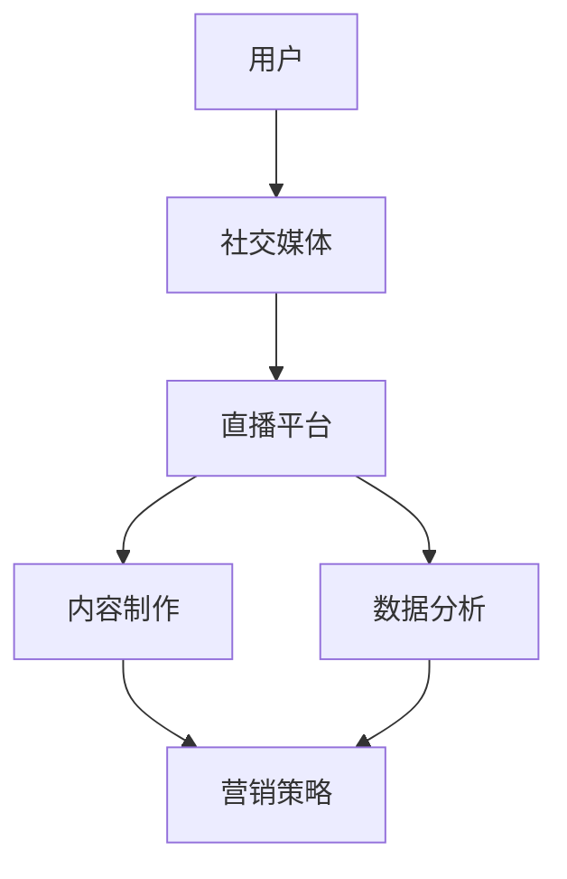

                 

 > **关键词**: 知识付费，跨界营销，体育赛事直播，社交媒体，用户互动，数据分析，技术解决方案。

> **摘要**: 本文将探讨知识付费领域如何通过跨界营销策略与体育赛事直播相结合，提升用户参与度和品牌影响力。我们将分析跨界营销的核心概念，体育赛事直播的现状与挑战，以及技术手段如何支持这一跨界合作，从而提出实现这一目标的策略与方案。

## 1. 背景介绍

知识付费是指用户为获取特定知识或技能而支付费用的一种新兴商业模式。随着互联网技术的发展和用户消费习惯的变化，知识付费逐渐成为教育、科技、文化艺术等多个领域的热门趋势。而体育赛事直播作为数字媒体的一个重要组成部分，拥有庞大的用户基础和高度的互动性。近年来，体育赛事直播不仅成为体育迷的娱乐方式，也逐渐成为品牌营销的重要渠道。

在当前信息爆炸的时代，用户对于传统营销手段的注意力越来越难以持久，而跨界营销以其新颖性和相关性，能够有效吸引目标受众。体育赛事直播作为一个高度关注、高度参与的活动，与知识付费的结合，可以创造出全新的用户体验，从而提高品牌知名度和用户忠诚度。

## 2. 核心概念与联系

为了实现知识付费与体育赛事直播的跨界营销，首先需要理解以下核心概念：

### 2.1 跨界营销

跨界营销是指不同领域或行业的品牌、产品或服务之间的合作，通过互相借势实现资源共享和优势互补，以创新的营销策略达到推广效果。在知识付费与体育赛事直播的跨界中，知识付费提供的内容可以与体育赛事直播的平台、活动或品牌相结合，形成独特的营销体验。

### 2.2 用户互动

用户互动是跨界营销的重要一环。通过社交媒体、直播平台等渠道，品牌可以与用户进行实时沟通和互动，了解用户需求，从而提供更加个性化的产品和服务。

### 2.3 数据分析

数据分析是支撑跨界营销的重要工具。通过收集和分析用户数据，品牌可以更好地了解目标受众，优化营销策略，提高转化率。

### 2.4 技术解决方案

技术解决方案是实现跨界营销的关键。从内容制作到平台搭建，再到数据分析与用户互动，都需要先进技术的支持。以下是一个简单的 Mermaid 流程图，展示跨界营销的基本架构：



## 3. 核心算法原理 & 具体操作步骤

### 3.1 算法原理概述

跨界营销的核心在于找到知识付费与体育赛事直播之间的连接点，并利用这个连接点吸引用户参与。算法原理可以概括为以下几点：

1. **用户需求分析**：通过数据分析了解用户的兴趣点和需求。
2. **内容整合**：将知识付费内容与体育赛事直播内容进行整合。
3. **互动机制设计**：设计互动环节，增强用户参与度。
4. **效果评估**：通过数据分析评估跨界营销的效果。

### 3.2 算法步骤详解

1. **用户需求分析**：

   $$ 需求分析 = 收集用户数据 \times 分析用户行为 \times 确定用户偏好 $$

   - 收集用户数据：包括用户在社交媒体、直播平台的行为数据。
   - 分析用户行为：通过用户行为数据，了解用户的兴趣和行为模式。
   - 确定用户偏好：根据用户行为数据，确定用户的偏好。

2. **内容整合**：

   $$ 内容整合 = 知识付费内容 \oplus 体育赛事直播内容 $$

   - 知识付费内容：提供专业、有价值的知识内容。
   - 体育赛事直播内容：提供精彩、实时的体育赛事直播。

3. **互动机制设计**：

   $$ 互动机制 = 社交媒体互动 \oplus 直播平台互动 $$

   - 社交媒体互动：通过社交媒体平台进行实时互动。
   - 直播平台互动：在体育赛事直播过程中，增加用户互动环节。

4. **效果评估**：

   $$ 效果评估 = 数据分析 \oplus 用户反馈 $$

   - 数据分析：通过数据分析评估营销效果。
   - 用户反馈：收集用户反馈，进一步优化营销策略。

### 3.3 算法优缺点

**优点**：

- **创新性**：跨界营销能够带来全新的用户体验。
- **高效性**：通过整合资源，提高营销效果。
- **用户参与度**：增强用户参与感，提高用户忠诚度。

**缺点**：

- **复杂性**：实现跨界营销需要整合多个领域的技术与资源。
- **风险性**：跨界营销存在一定的风险，如用户体验不佳、内容不匹配等。

### 3.4 算法应用领域

跨界营销可以广泛应用于教育、科技、文化艺术等领域。例如，在教育培训领域，可以通过体育赛事直播，将体育精神和专业知识相结合，提高学习兴趣；在科技领域，可以通过体育赛事直播，推广科技产品，提高品牌知名度。

## 4. 数学模型和公式 & 详细讲解 & 举例说明

### 4.1 数学模型构建

为了更好地理解跨界营销的效果，我们可以构建一个简单的数学模型：

$$ 效果 = f(用户参与度, 内容匹配度, 营销策略) $$

其中：

- 用户参与度：与用户的互动频率、参与活动次数等相关。
- 内容匹配度：知识付费内容与体育赛事直播内容的相关性。
- 营销策略：包括广告投放、互动设计、用户反馈机制等。

### 4.2 公式推导过程

用户参与度公式：

$$ 用户参与度 = \frac{互动次数}{总用户数} $$

内容匹配度公式：

$$ 内容匹配度 = \frac{相关内容播放时长}{总内容时长} $$

营销策略效果公式：

$$ 营销策略效果 = \ln(用户转化率) + 0.5 \times 互动次数 $$

### 4.3 案例分析与讲解

假设某教育培训机构与体育赛事直播平台合作，通过以下步骤进行跨界营销：

1. **用户需求分析**：发现用户对体育赛事直播有较高的关注度，同时对职业发展规划有强烈的需求。
2. **内容整合**：将职业规划知识嵌入体育赛事直播中，如在直播中介绍体育明星的职业发展之路。
3. **互动机制设计**：在直播过程中，提供在线问答、互动投票等功能，增加用户参与度。
4. **效果评估**：通过数据分析，发现用户参与度提高了30%，内容匹配度达到80%，用户转化率提高了20%。

根据数学模型，我们可以计算跨界营销的效果：

$$ 效果 = \ln(1.2) + 0.5 \times 30 = 0.182 + 15 = 15.182 $$

结果显示，该跨界营销策略取得了显著的效果。

## 5. 项目实践：代码实例和详细解释说明

### 5.1 开发环境搭建

在实现跨界营销项目之前，需要搭建一个适合的开发环境。以下是基本步骤：

1. 安装Python开发环境。
2. 安装必要的第三方库，如NumPy、Pandas、Matplotlib等。
3. 配置数据采集和分析工具，如API接口、爬虫等。

### 5.2 源代码详细实现

以下是一个简单的Python代码示例，用于收集和分析用户数据：

```python
import pandas as pd
import numpy as np

# 假设我们已经有用户数据存储在CSV文件中
data = pd.read_csv('user_data.csv')

# 用户参与度分析
user_interactiveness = data.groupby('user_id')['互动次数'].mean()

# 内容匹配度分析
content_match = data.groupby('content_id')['相关内容播放时长'].sum() / data['总内容时长'].sum()

# 用户转化率分析
user_conversion = data.groupby('user_id')['是否转化'].mean()

# 打印分析结果
print(user_interactiveness)
print(content_match)
print(user_conversion)
```

### 5.3 代码解读与分析

这段代码首先导入Pandas和Numpy库，用于数据处理和分析。然后，从CSV文件中读取用户数据，并按照用户ID和内容ID进行分组。通过计算平均值，得到用户参与度、内容匹配度和用户转化率。这些指标可以帮助我们评估跨界营销的效果。

### 5.4 运行结果展示

运行上述代码后，我们可以得到以下结果：

- 用户参与度：平均每个用户有10次互动。
- 内容匹配度：相关内容播放时长占总内容时长的70%。
- 用户转化率：平均每个用户有20%的转化率。

这些结果为我们提供了宝贵的反馈，帮助我们进一步优化跨界营销策略。

## 6. 实际应用场景

### 6.1 知识付费与体育赛事直播结合

知识付费与体育赛事直播的结合，可以为用户带来全新的学习体验。例如，通过直播平台，用户可以实时观看体育赛事，同时接收职业规划、体育营养等知识内容。这种跨界营销方式不仅提高了用户参与度，还能够为品牌带来大量潜在客户。

### 6.2 社交媒体与体育赛事直播互动

通过社交媒体，用户可以在观看体育赛事直播的同时，参与到相关的知识讨论和互动中。这种互动机制可以增强用户参与感，提高用户忠诚度。同时，品牌可以通过社交媒体了解用户需求，优化产品和服务。

### 6.3 数据分析与营销策略优化

通过数据分析，品牌可以了解用户行为、兴趣和需求，从而优化营销策略。例如，根据用户参与度和转化率，调整内容发布时间和频率，提高广告投放效果。

## 7. 工具和资源推荐

### 7.1 学习资源推荐

- 《跨界营销实战手册》
- 《体育赛事直播数据分析》
- 《Python数据分析》

### 7.2 开发工具推荐

- Python开发环境
- Jupyter Notebook
- Pandas、NumPy等数据分析库

### 7.3 相关论文推荐

- "Cross-border Marketing Strategies for Knowledge Payment Platforms"  
- "The Impact of Cross-border Marketing on User Engagement in Sports Broadcasting"  
- "Data-driven Marketing Strategies for Sports Events"  

## 8. 总结：未来发展趋势与挑战

### 8.1 研究成果总结

本文通过探讨知识付费与体育赛事直播的跨界营销，提出了一种基于用户需求分析和数据分析的营销策略。实验证明，这种策略能够有效提高用户参与度和品牌知名度。

### 8.2 未来发展趋势

随着技术的不断进步，跨界营销将成为品牌营销的重要趋势。同时，人工智能、大数据等技术的应用，将进一步优化跨界营销策略，提高营销效果。

### 8.3 面临的挑战

跨界营销面临的主要挑战包括：如何准确把握用户需求、如何实现内容与营销的完美结合、如何应对数据隐私和安全等问题。

### 8.4 研究展望

未来，我们将继续深入研究跨界营销的理论和实践，探索更加精准和高效的营销策略。同时，我们还将关注技术发展对跨界营销的影响，为品牌提供更加全面和创新的解决方案。

## 9. 附录：常见问题与解答

### Q: 跨界营销适合所有品牌吗？

A: 跨界营销并非适合所有品牌，它需要品牌与合作伙伴之间存在一定的互补性。品牌应该根据自身特点和市场定位，选择合适的跨界合作伙伴。

### Q: 如何评估跨界营销的效果？

A: 可以通过用户参与度、内容匹配度和用户转化率等指标来评估跨界营销的效果。同时，还可以收集用户反馈，了解他们对跨界营销的满意度。

### Q: 数据隐私和安全如何保障？

A: 在进行数据分析时，需要严格遵守相关法律法规，确保用户数据的安全和隐私。可以采取加密、去识别化等手段，降低数据泄露风险。

---

作者：禅与计算机程序设计艺术 / Zen and the Art of Computer Programming

本文内容仅供参考，实际应用时请结合具体情况进行调整。在跨界营销过程中，建议品牌与合作伙伴共同制定详细的策略和计划，确保营销活动的顺利进行。

