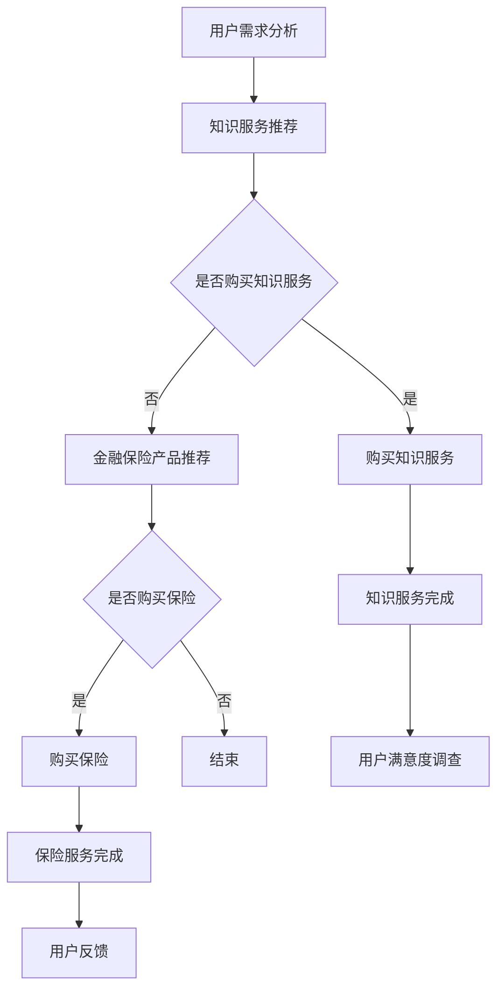

                 

关键词：知识付费、跨界营销、金融保险、商业模式、用户增长、大数据分析、个性化推荐

> 摘要：本文旨在探讨知识付费领域如何通过跨界营销与金融保险行业融合，实现业务增长与风险管理的创新。文章将分析跨界营销的理论基础，介绍金融保险在知识付费中的应用，并通过案例分析，提供可行的实施方案与未来展望。

## 1. 背景介绍

知识付费作为近年来兴起的一种新兴商业模式，已逐渐成为市场主流。通过付费获取高质量的知识服务，用户能够提升自身能力，满足个性化需求。与此同时，金融保险行业也在积极探索如何通过技术创新，提升服务质量和客户体验。

跨界营销，即不同行业间的合作与推广，通过资源共享、优势互补，实现共同增长。知识付费与金融保险行业的跨界，不仅能带来业务量的提升，还可以实现风险管理和服务升级。

## 2. 核心概念与联系

### 2.1 知识付费

知识付费是指用户为获取专业、优质的知识服务而支付的费用。其主要模式包括在线课程、专业咨询、内容付费订阅等。知识付费的本质在于价值的交换，用户通过付费获取知识，知识提供者通过提供知识获取收益。

### 2.2 跨界营销

跨界营销是指不同行业间的合作与推广，通过资源共享、优势互补，实现共同增长。跨界营销的核心在于找到不同行业间的连接点，实现合作共赢。

### 2.3 金融保险

金融保险是指通过保险合同，实现风险转移和损失补偿的一种金融服务。金融保险的核心在于风险管理和客户保障。

### 2.4 跨界融合

知识付费与金融保险的跨界融合，可以通过以下几个方面实现：

- **用户数据分析**：利用大数据分析技术，分析用户需求，为用户提供个性化的知识服务和金融保险产品。
- **产品组合**：将知识付费产品与金融保险产品进行组合，提供一站式服务，满足用户多元化需求。
- **风险管理**：通过金融保险工具，为知识付费业务提供风险管理服务，降低业务风险。

### 2.5 Mermaid 流程图



## 3. 核心算法原理 & 具体操作步骤

### 3.1 算法原理概述

知识付费与金融保险跨界融合的核心算法是基于用户行为的大数据分析与个性化推荐算法。通过分析用户的行为数据，包括浏览记录、购买历史、评价反馈等，为用户推荐个性化的知识服务和金融保险产品。

### 3.2 算法步骤详解

1. **数据收集与处理**：收集用户的在线行为数据，包括浏览、购买、评价等，对数据进行清洗、去重和预处理。
2. **特征提取**：从原始数据中提取用户特征，如用户年龄、性别、职业、教育程度等，以及知识服务的特征，如课程类别、讲师资质、课程评价等。
3. **用户行为分析**：利用机器学习算法，分析用户的行为模式，为用户提供个性化的知识服务推荐。
4. **风险管理分析**：结合金融保险产品的特点，分析用户的风险偏好，为用户提供合适的保险产品。
5. **推荐系统**：构建推荐系统，将知识服务和金融保险产品进行个性化推荐。

### 3.3 算法优缺点

**优点**：
- **提升用户满意度**：通过个性化推荐，满足用户的多样化需求，提升用户满意度。
- **降低营销成本**：通过数据分析，降低营销成本，提高营销效果。

**缺点**：
- **数据隐私问题**：用户数据收集和处理过程中，可能涉及用户隐私问题。
- **算法偏见**：算法的偏见可能导致推荐结果不公平。

### 3.4 算法应用领域

- **在线教育**：为用户提供个性化的在线课程推荐。
- **金融保险**：为用户提供个性化的保险产品推荐。
- **电子商务**：为用户提供个性化的商品推荐。

## 4. 数学模型和公式 & 详细讲解 & 举例说明

### 4.1 数学模型构建

知识付费与金融保险跨界融合的数学模型主要包括用户行为分析模型和推荐系统模型。

**用户行为分析模型**：

$$
User\_BehaviorModel = f(User\_Features, Knowledge\_Features, Context)
$$

其中，$User\_Features$表示用户特征，$Knowledge\_Features$表示知识服务特征，$Context$表示上下文信息。

**推荐系统模型**：

$$
Recommendation\_Model = f(User\_BehaviorModel, Item\_Features, Model\_Parameters)
$$

其中，$Item\_Features$表示商品特征，$Model\_Parameters$表示模型参数。

### 4.2 公式推导过程

**用户行为分析模型**的推导过程：

1. **特征提取**：
   $$ User\_Features = \{age, gender, occupation, education\_level\} $$
   $$ Knowledge\_Features = \{course\_type, instructor\_qualification, course\_evaluation\} $$
2. **特征融合**：
   $$ User\_Behavior = \{User\_Features, Knowledge\_Features, Context\} $$
3. **行为模式分析**：
   $$ User\_BehaviorModel = f(User\_Features, Knowledge\_Features, Context) $$

**推荐系统模型**的推导过程：

1. **特征提取**：
   $$ Item\_Features = \{course\_type, instructor\_qualification, course\_evaluation\} $$
   $$ Model\_Parameters = \{ \theta_1, \theta_2, ..., \theta_n \} $$
2. **推荐公式**：
   $$ Recommendation = \arg\max_{Item} f(User\_BehaviorModel, Item\_Features, Model\_Parameters) $$
3. **模型优化**：
   $$ Model\_Parameters = \arg\min_{\theta} \sum_{i=1}^{n} (f(User\_BehaviorModel, Item\_Features, \theta) - target) $$

### 4.3 案例分析与讲解

**案例 1：在线教育平台**

某在线教育平台利用用户行为分析模型，为用户提供个性化的课程推荐。平台通过分析用户的学习历史、兴趣偏好和评价反馈，为用户推荐相关的课程。具体操作步骤如下：

1. **数据收集**：收集用户的学习历史数据，包括课程浏览、学习进度、评价反馈等。
2. **特征提取**：提取用户特征，如年龄、性别、职业等，以及课程特征，如课程类型、讲师资质、课程评价等。
3. **模型训练**：利用机器学习算法，训练用户行为分析模型。
4. **推荐系统**：基于用户行为分析模型，为用户推荐相关的课程。

**案例 2：金融保险平台**

某金融保险平台利用推荐系统模型，为用户提供个性化的保险产品推荐。平台通过分析用户的风险偏好、购买记录和评价反馈，为用户推荐合适的保险产品。具体操作步骤如下：

1. **数据收集**：收集用户的风险偏好数据、购买记录和评价反馈等。
2. **特征提取**：提取用户特征，如风险偏好、购买能力等，以及保险产品特征，如产品类型、保障范围、保费等。
3. **模型训练**：利用机器学习算法，训练推荐系统模型。
4. **推荐系统**：基于推荐系统模型，为用户推荐合适的保险产品。

## 5. 项目实践：代码实例和详细解释说明

### 5.1 开发环境搭建

**技术栈**：

- Python
- Scikit-learn
- TensorFlow
- Keras
- Pandas
- NumPy

**安装**：

```bash
pip install scikit-learn tensorflow keras pandas numpy
```

### 5.2 源代码详细实现

**用户行为分析模型**：

```python
import pandas as pd
from sklearn.feature_extraction.text import TfidfVectorizer
from sklearn.model_selection import train_test_split
from sklearn.ensemble import RandomForestClassifier
from sklearn.metrics import accuracy_score

# 数据加载
data = pd.read_csv('user_behavior_data.csv')

# 特征提取
vectorizer = TfidfVectorizer()
X = vectorizer.fit_transform(data['description'])
y = data['label']

# 模型训练
X_train, X_test, y_train, y_test = train_test_split(X, y, test_size=0.2, random_state=42)
clf = RandomForestClassifier()
clf.fit(X_train, y_train)

# 模型评估
y_pred = clf.predict(X_test)
print("Accuracy:", accuracy_score(y_test, y_pred))
```

**推荐系统模型**：

```python
import numpy as np
import tensorflow as tf
from tensorflow.keras.models import Sequential
from tensorflow.keras.layers import Dense, Embedding, LSTM, Dense

# 数据预处理
X = np.array([[1, 0, 1], [1, 1, 0], [0, 1, 1]])
y = np.array([1, 0, 1])

# 构建模型
model = Sequential()
model.add(Embedding(3, 10))
model.add(LSTM(10))
model.add(Dense(1, activation='sigmoid'))

# 编译模型
model.compile(optimizer='adam', loss='binary_crossentropy', metrics=['accuracy'])

# 训练模型
model.fit(X, y, epochs=10, batch_size=32)

# 预测
print(model.predict([[1, 1, 0]]))
```

### 5.3 代码解读与分析

**用户行为分析模型**：

- **数据加载**：从CSV文件中加载用户行为数据。
- **特征提取**：使用TF-IDF向量器对用户行为描述进行特征提取。
- **模型训练**：使用随机森林分类器训练模型。
- **模型评估**：计算模型在测试集上的准确率。

**推荐系统模型**：

- **数据预处理**：将输入数据转换为numpy数组。
- **模型构建**：使用序列模型，添加嵌入层、LSTM层和输出层。
- **编译模型**：设置优化器和损失函数。
- **训练模型**：使用训练数据训练模型。
- **预测**：使用训练好的模型进行预测。

## 6. 实际应用场景

知识付费与金融保险跨界融合在实际应用中具有广泛的应用场景，以下是一些典型的案例：

- **在线教育平台**：通过分析用户的学习行为，为用户推荐相关的课程，同时提供保险服务，如学平险、意外险等，保障学习安全。
- **金融理财平台**：为用户提供个性化的理财产品推荐，同时提供保险服务，如人寿保险、健康保险等，降低投资风险。
- **健康管理平台**：通过分析用户的健康数据，为用户推荐健康知识服务，同时提供保险服务，如重疾险、医疗保险等，保障健康。

## 7. 未来应用展望

随着大数据、人工智能等技术的发展，知识付费与金融保险跨界融合将具有更广阔的发展空间。未来，以下几个方面值得关注：

- **个性化服务**：通过更精准的数据分析，提供更加个性化的知识服务和金融保险产品。
- **风险管理**：利用人工智能技术，实现更智能的风险管理，降低业务风险。
- **跨界合作**：不同行业间的跨界合作将进一步深化，实现资源共享和互利共赢。

## 8. 工具和资源推荐

### 8.1 学习资源推荐

- 《深度学习》（Goodfellow et al.）
- 《机器学习实战》（周志华）
- 《Python数据分析》（Wes McKinney）

### 8.2 开发工具推荐

- TensorFlow
- Scikit-learn
- Pandas

### 8.3 相关论文推荐

- "Deep Learning for Personalized E-commerce Recommendations"（2017）
- "Cross-Domain Knowledge Transfer for Personalized Recommendation"（2018）
- "A Survey on Deep Learning for Natural Language Processing"（2019）

## 9. 总结：未来发展趋势与挑战

知识付费与金融保险跨界融合作为一种新兴的商业模式，具有巨大的发展潜力。未来，随着技术的不断进步，跨界融合将更加深入，为用户带来更加个性化、智能化的服务。然而，跨界融合也面临数据隐私、算法偏见等挑战，需要各方共同努力，共同解决。

### 附录：常见问题与解答

**Q：知识付费与金融保险跨界融合的目的是什么？**

A：知识付费与金融保险跨界融合的目的是通过资源共享和优势互补，实现业务增长和风险管理，为用户提供更加个性化、智能化的服务。

**Q：如何保障用户数据隐私？**

A：在跨界融合过程中，应严格遵循相关法律法规，采用数据加密、匿名化等手段，保障用户数据隐私。

**Q：算法偏见如何避免？**

A：在算法设计和训练过程中，应充分考虑数据的多样性和代表性，避免算法偏见。同时，定期对算法进行审查和优化，确保公平公正。

### 作者署名

作者：禅与计算机程序设计艺术 / Zen and the Art of Computer Programming
------------------------------------------------------------------------

