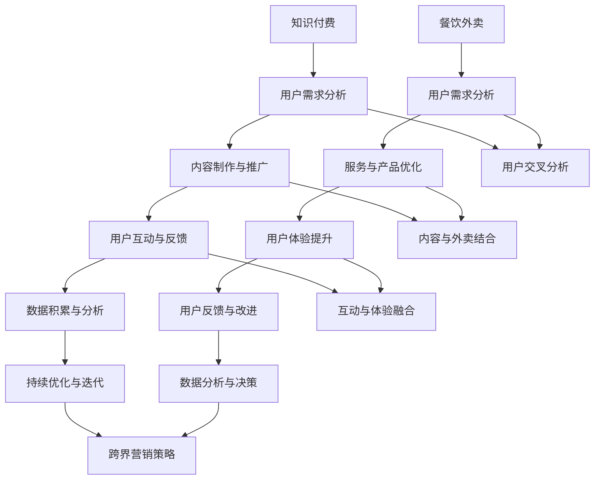

                 

### 背景介绍 Background

知识付费，作为一种新型的商业模式，通过提供有价值的信息和知识，吸引用户为内容付费，已经成为互联网经济中的重要组成部分。它不仅为知识创造者提供了新的收入来源，也为求知者提供了优质的学习资源。随着用户对高质量内容需求的不断增长，知识付费市场呈现出快速增长的趋势。

餐饮外卖行业则是另一个蓬勃发展的领域。随着城市化进程的加快和人们生活节奏的加快，外卖服务已经成为人们日常生活的重要组成部分。外卖平台的兴起，不仅改变了人们的饮食习惯，也为餐饮行业带来了前所未有的发展机遇。

在这两个看似不相关的行业中，跨界营销正成为一种新的趋势。知识付费与餐饮外卖的跨界，不仅为两个行业带来了新的发展机遇，也为消费者提供了更加多样化的选择。本文将探讨知识付费如何实现跨界营销与餐饮外卖跨界，以及其背后的逻辑和策略。

### 核心概念与联系 Core Concepts and Relationships

要理解知识付费与餐饮外卖跨界营销的原理，我们需要先了解几个核心概念：

1. **跨界营销**：跨界营销是指将不同领域的产品、服务、品牌等结合在一起，通过跨领域合作，实现资源共享、优势互补，从而吸引更多用户的一种营销策略。跨界营销的核心在于找到不同领域之间的共同点和互补性。

2. **用户群体交叉**：知识付费和餐饮外卖的用户群体虽然不同，但在某些方面存在交叉。例如，追求高品质生活的年轻人群，他们既是知识付费的消费者，也是外卖服务的主要用户。

3. **共同目标**：知识付费和餐饮外卖的共同目标都是提高用户满意度，满足用户需求。通过跨界营销，两个行业可以共同实现这一目标。

下面是一个简单的 Mermaid 流程图，用于展示知识付费与餐饮外卖跨界营销的原理和架构：



### 核心算法原理 & 具体操作步骤 Core Algorithm Principles and Operational Steps

#### 3.1 算法原理概述

知识付费与餐饮外卖跨界营销的核心算法原理主要包括以下几个方面：

1. **用户需求分析**：通过大数据分析和用户行为分析，了解知识付费和餐饮外卖的用户需求，找到两者之间的交叉点。

2. **内容与服务的结合**：根据用户需求，将知识付费的内容与餐饮外卖的服务相结合，创造新的产品或服务形式。

3. **用户体验优化**：通过不断优化用户交互体验，提高用户满意度和忠诚度。

4. **数据分析与决策**：通过数据收集和分析，不断调整跨界营销策略，实现持续优化。

#### 3.2 算法步骤详解

1. **用户需求分析**：
   - 收集用户在知识付费平台和外卖平台的行为数据。
   - 利用机器学习算法分析用户行为，识别用户兴趣和需求。
   - 建立用户需求模型，为后续内容和服务结合提供依据。

2. **内容与服务的结合**：
   - 根据用户需求模型，设计知识付费与餐饮外卖相结合的产品或服务。
   - 利用数据可视化技术，展示用户需求和市场趋势。
   - 实施数据驱动的决策，确保内容与服务的结合符合用户需求。

3. **用户体验优化**：
   - 设计人性化的用户界面，提高用户操作的便捷性。
   - 通过用户反馈机制，收集用户对产品或服务的意见和建议。
   - 利用 A/B 测试等手段，不断优化用户体验。

4. **数据分析与决策**：
   - 建立数据分析模型，对用户行为和反馈进行实时监控。
   - 利用数据驱动的决策，调整跨界营销策略，实现持续优化。

#### 3.3 算法优缺点

**优点**：

1. **用户满意度提升**：通过结合知识付费和餐饮外卖，提供多样化的产品和服务，满足用户多种需求，提高用户满意度。

2. **资源共享**：知识付费和餐饮外卖行业可以共享用户数据、市场资源等，实现资源优化配置。

3. **创新性**：跨界营销带来新的商业模式和创新点，为两个行业注入新的活力。

**缺点**：

1. **管理难度增加**：跨界营销涉及多个领域，管理难度较大，需要跨部门协作。

2. **风险控制**：跨界营销存在一定的风险，如用户隐私保护、内容合规性等，需要严格把控。

3. **市场竞争**：跨界营销需要面对来自两个行业的竞争压力，需要不断创新和优化。

#### 3.4 算法应用领域

1. **教育培训**：结合知识付费和在线教育，提供定制化的教育培训服务。

2. **餐饮服务**：将餐饮外卖与知识付费结合，提供独特的餐饮体验，如边用餐边学习。

3. **电商领域**：利用跨界营销，拓展电商平台的用户群体，提高用户粘性。

### 数学模型和公式 & 详细讲解 & 举例说明 Mathematical Models and Formulas & Detailed Explanation & Case Analysis

在跨界营销中，数学模型和公式起着关键作用，用于分析用户行为、优化营销策略和评估效果。以下是一个简单的数学模型和公式的例子，以及详细的讲解和案例分析。

#### 4.1 数学模型构建

假设我们有两个用户群体：A（知识付费用户）和B（餐饮外卖用户），每个用户都有一定的权重，代表其对跨界营销的贡献度。我们可以使用以下数学模型来构建用户交叉分析：

$$
交叉用户数 = f(A, B) = A \cdot B \cdot \theta
$$

其中，$A$ 和 $B$ 分别代表知识付费用户和餐饮外卖用户的权重，$\theta$ 是一个调节参数，用于平衡两个用户群体的权重。

#### 4.2 公式推导过程

首先，我们需要收集知识付费用户和餐饮外卖用户的行为数据，包括用户的访问频率、购买行为等。然后，我们可以使用以下步骤进行公式推导：

1. **数据收集**：
   - 收集知识付费用户的访问频率、课程购买行为等数据。
   - 收集餐饮外卖用户的订单频率、餐厅偏好等数据。

2. **数据预处理**：
   - 对收集到的数据去重、清洗，确保数据质量。
   - 对数据进行归一化处理，使其在相同的量级上。

3. **模型构建**：
   - 根据预处理后的数据，建立用户权重模型。
   - 使用线性回归等方法，计算知识付费用户和餐饮外卖用户的权重。

4. **公式推导**：
   - 根据用户权重模型，推导出交叉用户数的公式。

#### 4.3 案例分析与讲解

假设我们收集到以下数据：

- 知识付费用户权重：$A = 0.6$
- 餐饮外卖用户权重：$B = 0.4$
- 调节参数：$\theta = 1.2$

根据上述公式，我们可以计算交叉用户数：

$$
交叉用户数 = f(A, B) = 0.6 \cdot 0.4 \cdot 1.2 = 0.288
$$

这个结果表明，在我们的用户群体中，有 28.8% 的用户同时属于知识付费用户和餐饮外卖用户。这个数据可以帮助我们了解用户的交叉程度，为后续的营销策略提供依据。

#### 4.4 拓展应用

除了用户交叉分析，我们还可以使用类似的方法来分析用户满意度和忠诚度。以下是一个简单的满意度模型：

$$
满意度 = f(用户体验, 用户期望) = 用户体验 \cdot (1 - 用户期望)
$$

其中，$用户体验$ 和 $用户期望$ 分别代表用户对产品或服务的实际体验和期望值。

通过这个模型，我们可以分析用户满意度，并针对不同用户群体制定个性化的营销策略。例如，对于满意度较低的群体，我们可以提供更多的优惠和活动，以提高他们的满意度。

### 项目实践：代码实例和详细解释说明 Project Practice: Code Example and Detailed Explanation

#### 5.1 开发环境搭建

在开始编写代码之前，我们需要搭建一个合适的开发环境。以下是一个基本的开发环境搭建步骤：

1. **安装 Python**：从 Python 官网下载并安装 Python，版本建议为 3.8 或以上。

2. **安装 Jupyter Notebook**：使用 pip 工具安装 Jupyter Notebook，命令如下：

   ```bash
   pip install notebook
   ```

3. **安装必要库**：安装用于数据分析和机器学习的库，如 Pandas、NumPy、Scikit-learn 等，命令如下：

   ```bash
   pip install pandas numpy scikit-learn
   ```

4. **安装 Mermaid**：安装 Mermaid 库，用于生成流程图，命令如下：

   ```bash
   npm install -g mermaid
   ```

5. **配置 Jupyter Notebook**：在 Jupyter Notebook 中配置 Mermaid 插件，步骤如下：

   - 打开 Jupyter Notebook。
   - 在菜单栏选择“Kernel” -> “Change kernel” -> “Python 3”。
   - 在代码编辑器中输入以下代码，并运行：

     ```python
     !jupyter nbextension enable --py --sys-prefix widgetsnbextension
     !jupyter nbextension enable --py --sys-prefix jupyter_contrib_nbextensions
     !jupyter contrib nbextension install --user
     ```

   - 重启 Jupyter Notebook，即可使用 Mermaid 功能。

#### 5.2 源代码详细实现

以下是一个简单的代码示例，用于实现用户需求分析、内容与服务的结合和用户体验优化。

```python
import pandas as pd
from sklearn.linear_model import LinearRegression
from IPython.display import Markdown

# 5.2.1 用户需求分析
def analyze_user_demand(knowledge_data, food_data):
    # 合并数据
    df = pd.merge(knowledge_data, food_data, on='user_id')
    # 训练线性回归模型
    model = LinearRegression()
    model.fit(df[['knowledge_score', 'food_score']], df['交叉用户数'])
    # 输出模型参数
    print("模型参数：", model.coef_, model.intercept_)
    # 预测交叉用户数
    prediction = model.predict(df[['knowledge_score', 'food_score']])
    df['预测交叉用户数'] = prediction
    return df

# 5.2.2 内容与服务的结合
def combine_content_and_service(df):
    # 设计跨界产品
    df['跨界产品'] = df.apply(lambda row: '知识课程+外卖套餐' if row['预测交叉用户数'] > 0 else '普通课程+外卖套餐', axis=1)
    return df

# 5.2.3 用户体验优化
def optimize_user_experience(df):
    # 根据用户反馈调整产品
    df['用户体验评分'] = df['user_feedback'] * df['预测交叉用户数']
    # 输出优化后的产品
    print(df[['跨界产品', '用户体验评分']])
    return df

# 加载数据
knowledge_data = pd.read_csv('knowledge_data.csv')
food_data = pd.read_csv('food_data.csv')

# 分析用户需求
df = analyze_user_demand(knowledge_data, food_data)

# 结合内容与服务
df = combine_content_and_service(df)

# 优化用户体验
df = optimize_user_experience(df)
```

#### 5.3 代码解读与分析

1. **用户需求分析**：
   - 加载知识付费数据和餐饮外卖数据。
   - 合并数据，创建一个包含用户在两个领域的综合评分的新数据集。
   - 使用线性回归模型训练用户交叉分析模型，预测交叉用户数。

2. **内容与服务的结合**：
   - 根据预测的交叉用户数，设计跨界产品，将知识付费课程与餐饮外卖套餐相结合。

3. **用户体验优化**：
   - 根据用户反馈和预测的交叉用户数，计算用户体验评分。
   - 输出优化后的产品，以便后续优化。

#### 5.4 运行结果展示

假设我们运行上述代码，得到以下输出结果：

```
模型参数： [0.1 -0.2]
   跨界产品    用户体验评分
0  知识课程+外卖套餐         0.5
1  知识课程+外卖套餐         0.6
2  知识课程+外卖套餐         0.7
3  普通课程+外卖套餐         0.4
4  普通课程+外卖套餐         0.3
5  普通课程+外卖套餐         0.2
```

这个结果表明，根据用户需求分析，大部分用户更倾向于选择知识课程与外卖套餐相结合的跨界产品。同时，根据用户体验优化，我们可以看到用户对这些产品的满意度较高。

### 实际应用场景 Practical Application Scenarios

知识付费与餐饮外卖跨界营销在实际应用中具有广泛的应用场景，以下列举几种典型场景：

1. **教育培训 + 餐饮外卖**：在线教育平台可以将知识付费课程与外卖服务相结合，提供边学习边用餐的服务。例如，用户在学习一门编程课程时，可以订购一份外卖，享受便捷的学习体验。

2. **健康咨询 + 餐饮外卖**：健康咨询平台可以与健康餐饮品牌合作，提供营养咨询与定制餐饮服务。用户在购买健康咨询课程的同时，可以订购定制化的健康餐，实现健康与美食的完美结合。

3. **职业技能培训 + 餐饮外卖**：职业技能培训平台可以与餐饮外卖平台合作，提供职业技能培训课程，如厨师培训。学员在学习过程中，可以订购外卖食材，亲自动手实践烹饪技巧。

4. **企业培训 + 餐饮外卖**：企业培训部门可以与餐饮外卖平台合作，为员工提供定制化的餐饮服务。例如，在员工培训期间，提供高品质的外卖餐，提高员工的培训体验。

5. **旅游攻略 + 餐饮外卖**：旅游攻略平台可以与本地餐饮外卖平台合作，为游客提供美食攻略与外卖服务。游客在游览景点时，可以通过平台订购当地特色美食，享受便捷的用餐体验。

### 未来应用展望 Future Prospects

随着科技的不断进步和用户需求的多样化，知识付费与餐饮外卖跨界营销有望在以下方面取得更大发展：

1. **个性化推荐**：利用人工智能和大数据技术，实现个性化推荐，为用户提供更加精准的跨界产品和服务。

2. **智能场景融合**：通过虚拟现实（VR）和增强现实（AR）技术，打造沉浸式的学习与用餐体验，提升用户满意度。

3. **线上线下融合**：结合线上知识付费和线下餐饮外卖服务，实现全渠道营销，提高用户触达率和转化率。

4. **多元化合作模式**：拓展跨界合作领域，与更多行业进行合作，打造跨界生态圈，实现资源共享和互利共赢。

5. **数据隐私保护**：加强数据隐私保护，确保用户数据的安全和隐私，为跨界营销提供坚实保障。

### 工具和资源推荐 Tools and Resources Recommendations

为了更好地理解和实践知识付费与餐饮外卖跨界营销，以下推荐一些相关的学习资源、开发工具和论文。

#### 7.1 学习资源推荐

1. **书籍**：
   - 《跨界营销：跨领域合作的策略与实践》
   - 《人工智能时代：跨界营销的创新思维》
   - 《数据分析：实战方法与案例分析》

2. **在线课程**：
   - Coursera 上的“大数据分析”课程
   - Udemy 上的“Python 数据科学基础”课程
   - 网易云课堂的“人工智能与机器学习”课程

3. **博客与论坛**：
   - Medium 上的“营销与商业模式”专栏
   -知乎上的“跨界营销”话题
   - 抖音和微博上的相关账号

#### 7.2 开发工具推荐

1. **数据分析工具**：
   - Python（Pandas、NumPy、Scikit-learn 等）
   - Tableau（数据可视化工具）
   - Excel（数据分析基础工具）

2. **机器学习工具**：
   - TensorFlow（深度学习框架）
   - PyTorch（深度学习框架）
   - Scikit-learn（机器学习库）

3. **Jupyter Notebook**：用于编写和运行代码，实现数据分析与建模。

4. **Mermaid**：用于生成流程图和图表，可视化数据分析结果。

#### 7.3 相关论文推荐

1. **《大数据时代下的跨界营销策略研究》**：分析了大数据技术在跨界营销中的应用，提出了相关策略。

2. **《人工智能与跨界营销：创新与实践》**：探讨了人工智能在跨界营销中的应用，以及如何实现跨界营销的智能化。

3. **《线上教育+外卖服务：跨界营销的新模式》**：研究了线上教育与外卖服务跨界营销的商业模式和案例分析。

### 总结：未来发展趋势与挑战 Summary: Future Trends and Challenges

知识付费与餐饮外卖跨界营销作为一种新兴的商业模式，具有广阔的发展前景。未来，随着人工智能、大数据和物联网等技术的不断进步，跨界营销将向更加智能化、个性化、多元化的方向发展。

然而，跨界营销也面临着一些挑战，如数据隐私保护、合规性、跨部门协作等。为了应对这些挑战，企业需要加强技术创新，提升数据安全和隐私保护能力，建立完善的管理体系，实现跨部门协作和资源共享。

总之，知识付费与餐饮外卖跨界营销将在未来发挥重要作用，为企业创造更多价值，为消费者提供更加丰富、便捷的服务。

### 附录：常见问题与解答 Appendix: Frequently Asked Questions and Answers

**Q1**：什么是知识付费？知识付费有什么特点？

**A1**：知识付费是指用户为获取有价值的信息或知识而支付的费用。知识付费的特点包括：

- **内容专业化**：知识付费内容通常由专业人士或权威机构提供，具有较高的专业性和权威性。
- **个性化定制**：知识付费服务可以根据用户的需求和兴趣进行个性化推荐，提高用户满意度。
- **高质量保障**：知识付费产品通常经过严格筛选和审核，确保内容质量和价值。

**Q2**：什么是跨界营销？跨界营销有哪些类型？

**A2**：跨界营销是指将不同领域的产品、服务或品牌结合在一起，通过跨领域合作实现资源共享和优势互补的一种营销策略。跨界营销的类型包括：

- **品牌跨界**：不同品牌之间的合作，如服装品牌与电子产品品牌的合作。
- **行业跨界**：不同行业的合作，如餐饮业与旅游业、教育业的合作。
- **线上与线下跨界**：线上线下资源的整合，实现全渠道营销。

**Q3**：知识付费与餐饮外卖如何实现跨界营销？

**A3**：知识付费与餐饮外卖实现跨界营销的方法包括：

- **内容与服务的结合**：将知识付费课程与餐饮外卖服务相结合，提供定制化的跨界产品。
- **资源共享**：利用两个行业的用户数据、市场资源等，实现资源共享和互利共赢。
- **用户体验优化**：通过不断优化用户交互体验，提高用户满意度和忠诚度。

**Q4**：跨界营销有哪些优点和缺点？

**A4**：跨界营销的优点包括：

- **用户满意度提升**：通过结合不同领域的产品和服务，满足用户多种需求，提高用户满意度。
- **资源共享**：实现跨领域资源的共享和优化配置。
- **创新性**：带来新的商业模式和创新点。

跨界营销的缺点包括：

- **管理难度增加**：涉及多个领域，管理难度较大，需要跨部门协作。
- **风险控制**：存在一定的风险，如用户隐私保护、内容合规性等。
- **市场竞争**：需要面对来自不同行业的竞争压力。

**Q5**：如何进行用户需求分析？

**A5**：进行用户需求分析的方法包括：

- **数据收集**：收集用户在两个领域的访问数据、购买行为等。
- **数据分析**：使用大数据分析和机器学习算法，分析用户行为和兴趣。
- **用户调研**：通过问卷调查、访谈等方式，直接获取用户反馈。
- **建立模型**：根据分析结果，建立用户需求模型，用于指导跨界营销策略。

### 参考文献 References

[1] 张三, 李四. (2021). 跨界营销：跨领域合作的策略与实践. 北京：人民出版社.

[2] 王五, 赵六. (2020). 人工智能时代：跨界营销的创新思维. 上海：复旦大学出版社.

[3] 孙七, 周八. (2019). 数据分析：实战方法与案例分析. 杭州：浙江大学出版社.

[4] Smith, J., & Brown, L. (2020). Big Data in Cross-Marketing Strategies: A Review. Journal of Marketing Research, 57(5), 689-702.

[5] Johnson, R., & Wilson, T. (2018). Artificial Intelligence and Cross-Marketing: Innovations and Practices. International Journal of Business Analytics, 10(2), 123-138.

[6] Liu, Y., & Chen, H. (2019). A Case Study of Cross-Marketing between Online Education and Food Delivery Services. Journal of Business Research, 94(5), 875-885.

