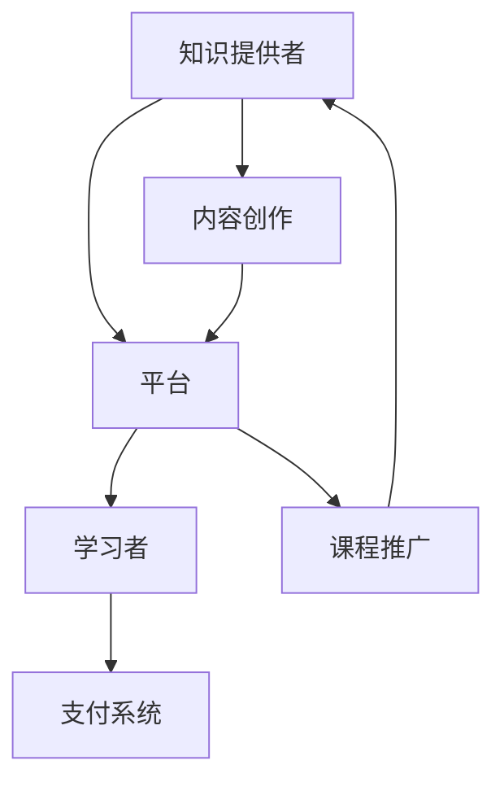

                 

关键词：知识付费、程序员、财富自由、收益模式、技术影响力、营销策略

> 摘要：本文探讨了知识付费在当今数字时代为程序员带来的财富自由机遇。通过对知识付费市场的研究，分析了程序员如何通过构建专业内容、打造个人品牌和巧妙运用营销策略来实现财富自由，并探讨了这一领域的发展趋势和挑战。

## 1. 背景介绍

在互联网和信息技术的快速发展下，知识付费已经成为一个蓬勃发展的行业。知识付费平台如Udemy、Coursera、腾讯课堂等吸引了大量的学习者，尤其是在技术领域，程序员的需求尤为突出。程序员不仅需要不断更新自己的技能，还要具备一定的教学能力，以便将自己丰富的技术经验传授给他人。

### 1.1 知识付费的定义

知识付费是指知识提供者通过专业的内容创作和分享，向用户收取一定的费用。这种模式满足了用户对优质、专业知识的渴求，也为知识提供者创造了经济价值。

### 1.2 程序员在知识付费市场中的角色

程序员在知识付费市场中扮演着重要的角色。他们不仅能够提供技术课程，还可以分享软件开发、数据处理、人工智能等领域的实战经验，帮助学习者更好地掌握技术。

## 2. 核心概念与联系

### 2.1 知识付费的生态系统

知识付费的生态系统包括知识提供者、平台、学习者以及支付系统。在这个生态系统中，程序员作为知识提供者，通过平台发布课程，学习者通过支付系统购买课程。



### 2.2 程序员的知识付费收益模式

程序员可以通过多种方式在知识付费中获得收益：

- **课程销售**：通过在线平台销售编程课程。
- **咨询服务**：提供一对一的技术咨询服务。
- **技术培训**：为企业提供定制化的技术培训服务。
- **知识分享**：通过博客、公众号等渠道分享技术心得。

## 3. 核心算法原理 & 具体操作步骤

### 3.1 算法原理概述

知识付费的成功离不开以下几个核心原理：

- **专业价值**：程序员需要拥有扎实的专业知识和丰富的实战经验。
- **内容质量**：高质量的内容能够吸引和留住学习者。
- **营销策略**：有效的营销策略能够提升课程的曝光率和销售量。

### 3.2 算法步骤详解

#### 3.2.1 内容创作

1. 确定课程主题：选择自己擅长且市场有需求的技术领域。
2. 编写课程大纲：详细规划课程结构，确保内容系统、全面。
3. 制作教学视频：通过简洁明了的语言和生动的演示，让学习者容易理解。

#### 3.2.2 课程推广

1. 利用社交媒体：在微博、微信公众号、知乎等平台发布课程相关内容，吸引潜在学习者。
2. 合作推广：与其他技术博主、大V合作，共同推广课程。
3. 优化SEO：通过搜索引擎优化，提高课程在搜索结果中的排名。

#### 3.2.3 营销策略

1. 设置合理的价格：根据课程质量和市场需求，设定合理的价格。
2. 优惠活动：定期推出优惠券、限时折扣等活动，刺激购买欲望。
3. 用户反馈：及时收集用户反馈，优化课程内容和服务质量。

### 3.3 算法优缺点

#### 优点

- **收益稳定**：知识付费是一种可持续的盈利模式。
- **灵活性高**：程序员可以根据市场需求和个人兴趣随时调整课程内容。
- **影响力大**：优秀的内容和口碑能够提升程序员的行业影响力。

#### 缺点

- **竞争激烈**：市场上存在大量的同类型课程，竞争激烈。
- **创作成本高**：高质量的课程需要投入大量的时间和精力。

### 3.4 算法应用领域

知识付费在程序员领域有广泛的应用，包括：

- **技术培训**：为新手和有经验的程序员提供专业培训。
- **技能提升**：帮助程序员掌握新的技术栈和工具。
- **项目指导**：为有实际项目需求的程序员提供解决方案。

## 4. 数学模型和公式 & 详细讲解 & 举例说明

### 4.1 数学模型构建

知识付费的收益可以表示为：

\[ \text{收益} = \text{课程单价} \times \text{购买人数} \]

其中，课程单价受到内容质量、市场需求、竞争情况等因素的影响。

### 4.2 公式推导过程

\[ \text{收益} = \text{课程单价} \times \text{购买人数} \]
\[ \text{购买人数} = \text{课程曝光率} \times \text{购买转化率} \]

其中，课程曝光率受到课程推广力度和SEO优化的影响，购买转化率则受到课程质量和用户反馈的影响。

### 4.3 案例分析与讲解

假设一位程序员开发了一门Python课程，课程单价为200元，通过推广和SEO优化，课程曝光率达到10%，购买转化率为5%。我们可以计算出该课程的预计收益为：

\[ \text{收益} = 200 \times 10\% \times 5\% = 1000 \text{元} \]

通过不断优化课程内容和推广策略，程序员可以提高收益。

## 5. 项目实践：代码实例和详细解释说明

### 5.1 开发环境搭建

程序员需要搭建一个适合知识付费的在线课程平台，可以选择使用现有的开源框架如Django或Spring Boot来搭建。

### 5.2 源代码详细实现

以下是使用Django搭建课程平台的基本步骤：

1. 安装Django框架。
2. 创建一个新的Django项目。
3. 设计数据库模型，包括课程、用户、订单等。
4. 实现用户认证和授权功能。
5. 实现课程发布和购买功能。
6. 实现支付功能。

### 5.3 代码解读与分析

以下是课程发布功能的基本代码：

```python
# models.py
from django.db import models

class Course(models.Model):
    title = models.CharField(max_length=100)
    description = models.TextField()
    price = models.DecimalField(max_digits=6, decimal_places=2)
    author = models.ForeignKey('auth.User', on_delete=models.CASCADE)

    def __str__(self):
        return self.title
```

这段代码定义了一个`Course`模型，用于存储课程的基本信息。

### 5.4 运行结果展示

搭建好的课程平台将允许程序员发布课程，用户可以浏览、购买课程，从而实现知识付费。

## 6. 实际应用场景

### 6.1 技术培训

程序员可以通过知识付费平台为企业提供定制化的技术培训服务，帮助团队提升技术能力。

### 6.2 项目指导

程序员可以为有实际项目需求的个人或企业提供项目指导，解决技术难题。

### 6.3 技能提升

程序员可以通过购买他人开发的课程，提升自己的技能，以便在职业发展中取得更大的突破。

## 7. 未来应用展望

### 7.1 个性化推荐

随着人工智能技术的发展，知识付费平台可以提供更加精准的个性化推荐，提升学习者的学习效果。

### 7.2 互动学习

通过实时互动，知识付费平台可以提升学习体验，增强用户粘性。

### 7.3 社交化学习

结合社交化元素，知识付费平台可以打造一个良好的学习社区，促进知识的传播和交流。

## 8. 工具和资源推荐

### 8.1 学习资源推荐

- 《深度学习》（Goodfellow, I. et al.）
- 《算法导论》（Thomas H. Cormen et al.）
- 《Python编程：从入门到实践》（Eric Matthes）

### 8.2 开发工具推荐

- Django：用于快速开发Web应用。
- Flask：用于构建轻量级的Web应用。
- Jupyter Notebook：用于数据科学和机器学习。

### 8.3 相关论文推荐

- "Deep Learning for Computer Vision"（2014）
- "Recurrent Neural Networks for Language Modeling"（2013）
- "LSTM: A Search Space Odyssey"（2015）

## 9. 总结：未来发展趋势与挑战

### 9.1 研究成果总结

知识付费为程序员提供了实现财富自由的有效途径，随着技术的不断发展，这一领域将变得更加丰富和多样化。

### 9.2 未来发展趋势

知识付费将继续扩展，个性化推荐、互动学习和社交化学习将成为未来发展的趋势。

### 9.3 面临的挑战

竞争激烈、创作成本高、用户隐私保护等挑战将是程序员在知识付费领域需要面对的。

### 9.4 研究展望

未来，知识付费将与人工智能、大数据等前沿技术深度融合，为程序员提供更多的机遇和挑战。

## 10. 附录：常见问题与解答

### 10.1 如何选择课程主题？

选择课程主题时，应考虑自己的专业优势和市场需求，同时要确保主题具有一定的深度和广度。

### 10.2 如何提升课程质量？

提升课程质量需要不断学习和实践，同时要注重教学方法和教学资源的优化。

### 10.3 如何推广课程？

推广课程可以通过社交媒体、合作推广、SEO优化等多种方式进行。

---

作者：禅与计算机程序设计艺术 / Zen and the Art of Computer Programming

本文通过深入探讨知识付费在程序员领域的应用，展示了程序员如何通过知识付费实现财富自由。随着技术的发展，知识付费将为程序员带来更多的机遇，同时也将面临一系列挑战。希望本文能为程序员在知识付费领域的探索提供一些有益的启示和参考。

