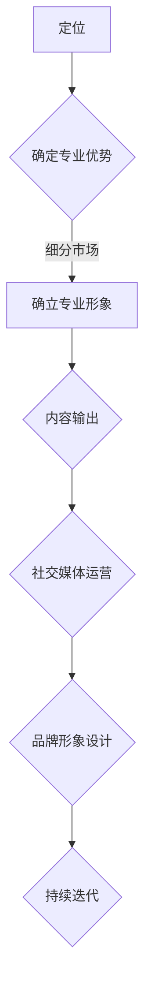

                 

关键词：知识付费、个人IP、品牌建设、市场营销、社交媒体、影响力、商业模式、盈利策略

> 摘要：在数字化时代，知识付费成为了一种重要的商业模式。本文将探讨如何通过打造个人IP与品牌，实现知识付费的盈利与可持续发展。

## 1. 背景介绍

知识付费，是指用户为了获取特定知识或技能，自愿为知识提供者支付费用的一种交易模式。随着互联网的普及和信息获取途径的多样化，知识付费市场呈现出快速增长的趋势。人们越来越愿意为高质量、专业化的知识内容付费，从而提升自己的能力与竞争力。

在这个背景下，个人IP（个人知识产权）与品牌建设变得尤为重要。个人IP是指个人在某个领域内的知识、技能、声誉和影响力，而品牌则是一个人在市场上的标识，代表着其价值、质量和信誉。通过打造个人IP与品牌，知识提供者不仅能够吸引更多的付费用户，还能够提升自身的市场竞争力，实现盈利与可持续发展。

## 2. 核心概念与联系

### 个人IP构建

个人IP的构建是一个系统工程，涉及到多个方面的内容。以下是构建个人IP的几个关键步骤：

1. **定位**：明确个人在某一领域的专业优势，找到细分市场，确立自己的专业形象。
2. **内容输出**：通过文字、音频、视频等多种形式，持续输出高质量的内容，展示自己的专业能力。
3. **社交媒体运营**：在各大社交媒体平台上建立个人账号，与粉丝互动，提升影响力。
4. **品牌形象**：设计独特的个人形象标识，如头像、签名等，以增强品牌认知度。
5. **持续迭代**：根据市场需求和自身发展，不断调整和优化个人IP的定位和内容。

### 品牌建设

品牌建设则是围绕个人IP进行的一系列市场推广活动，旨在提升个人在市场中的知名度和美誉度。以下是品牌建设的几个关键步骤：

1. **目标市场分析**：了解目标受众的需求、喜好和痛点，制定有针对性的营销策略。
2. **品牌定位**：明确品牌的核心价值、定位和目标，确保品牌形象的一致性。
3. **品牌传播**：通过多种渠道（如社交媒体、线下活动等）传播品牌信息，提升品牌知名度。
4. **口碑管理**：积极回应用户反馈，处理负面信息，维护品牌形象。
5. **品牌延伸**：根据市场需求，开发相关产品或服务，扩大品牌影响力。

### 个人IP与品牌的关系

个人IP与品牌是相互依存、相互促进的关系。个人IP为品牌提供了内容支撑，而品牌则为个人IP提供了市场推广的渠道和资源。只有当个人IP具备一定的市场认可度和影响力时，品牌建设才能取得显著效果；同样，只有通过有效的品牌建设，个人IP的价值才能得到充分体现和发挥。

## 2.1 个人IP构建的Mermaid流程图



## 3. 核心算法原理 & 具体操作步骤

### 3.1 算法原理概述

在构建个人IP与品牌的过程中，算法原理主要包括以下三个方面：

1. **市场定位算法**：通过大数据分析和用户调研，找到个人在某一领域的专业优势和市场缺口，确定合适的定位。
2. **内容创作算法**：基于用户需求和喜好，创作高质量、有针对性的知识内容。
3. **社交媒体传播算法**：利用算法推荐机制，将个人IP内容精准推送给目标受众，提高曝光率和影响力。

### 3.2 算法步骤详解

#### 3.2.1 市场定位算法

1. 收集数据：从各大社交媒体、论坛、行业报告等渠道收集用户需求和偏好数据。
2. 数据分析：运用数据挖掘和机器学习算法，分析用户数据，找出市场缺口和潜在需求。
3. 定位确定：根据分析结果，确定个人在某一领域的专业优势和市场定位。

#### 3.2.2 内容创作算法

1. 用户画像：基于用户需求和喜好，建立用户画像。
2. 内容策划：根据用户画像，策划符合用户需求的知识内容。
3. 内容创作：运用文字、音频、视频等多种形式，创作高质量、有特色的知识内容。

#### 3.2.3 社交媒体传播算法

1. 算法推荐：利用算法推荐机制，将个人IP内容推送给目标受众。
2. 互动优化：通过用户反馈和互动数据，不断优化推荐算法，提高内容曝光率和影响力。

### 3.3 算法优缺点

**优点**：

1. 提高市场定位的准确性和效率。
2. 提升内容创作和传播的效果。
3. 增强用户粘性和品牌影响力。

**缺点**：

1. 需要一定的技术门槛和数据分析能力。
2. 可能会引发用户隐私和数据安全问题。

### 3.4 算法应用领域

算法原理在个人IP与品牌建设中的应用非常广泛，包括市场调研、内容创作、社交媒体运营等多个方面。以下是一个具体的应用场景：

**案例：利用市场定位算法，为个人IP确定专业方向**

1. 收集数据：从各大社交媒体、行业论坛等渠道收集用户需求和偏好数据。
2. 数据分析：运用数据挖掘和机器学习算法，分析用户数据，找出市场缺口和潜在需求。
3. 定位确定：根据分析结果，确定个人在人工智能领域的专业优势和市场定位。
4. 内容创作：根据定位，创作高质量的人工智能相关内容。
5. 社交媒体运营：利用算法推荐机制，将人工智能内容推送给目标受众，提高曝光率和影响力。

## 4. 数学模型和公式 & 详细讲解 & 举例说明

### 4.1 数学模型构建

在个人IP与品牌建设中，我们可以构建以下两个数学模型：

1. **用户满意度模型**：用于评估用户对知识内容、品牌和服务的满意程度。
2. **品牌价值模型**：用于计算个人IP在市场中的价值。

#### 4.1.1 用户满意度模型

用户满意度模型可以表示为：

$$
S = \frac{E - P}{Q}
$$

其中：

- $S$：用户满意度（取值范围：0-1）
- $E$：期望满意度
- $P$：实际满意度
- $Q$：质量感知

#### 4.1.2 品牌价值模型

品牌价值模型可以表示为：

$$
V = \frac{C}{P}
$$

其中：

- $V$：品牌价值
- $C$：消费者购买意愿
- $P$：市场价格

### 4.2 公式推导过程

#### 4.2.1 用户满意度模型推导

用户满意度模型的推导基于以下假设：

1. 用户满意度与期望满意度、实际满意度和质量感知成正比。
2. 期望满意度、实际满意度和质量感知之间满足线性关系。

根据假设，可以建立以下线性回归模型：

$$
S = aE + bP + cQ
$$

其中：

- $a$：期望满意度的权重
- $b$：实际满意度的权重
- $c$：质量感知的权重

为了简化模型，可以假设 $a + b + c = 1$。则模型可以改写为：

$$
S = a(E - P) + cQ
$$

进一步化简，得到用户满意度模型：

$$
S = \frac{E - P}{Q}
$$

#### 4.2.2 品牌价值模型推导

品牌价值模型的推导基于以下假设：

1. 品牌价值与消费者购买意愿和市场价格成正比。
2. 消费者购买意愿和市场价格之间满足线性关系。

根据假设，可以建立以下线性回归模型：

$$
V = aC + bP
$$

其中：

- $a$：消费者购买意愿的权重
- $b$：市场价格的权重

为了简化模型，可以假设 $a + b = 1$。则模型可以改写为：

$$
V = \frac{C}{P}
$$

进一步化简，得到品牌价值模型：

$$
V = \frac{C}{P}
$$

### 4.3 案例分析与讲解

#### 4.3.1 用户满意度模型案例分析

假设一个用户对知识内容的期望满意度为0.8，实际满意度为0.6，质量感知为0.7。则用户满意度可以计算为：

$$
S = \frac{0.8 - 0.6}{0.7} = \frac{0.2}{0.7} \approx 0.286
$$

这表示用户对该知识内容的满意度为28.6%。

#### 4.3.2 品牌价值模型案例分析

假设一个个人IP的品牌价值为100万元，市场价格为200万元。则消费者购买意愿可以计算为：

$$
C = 0.5 \times 100万元 = 50万元
$$

这表示消费者对该个人IP的购买意愿为50万元。

## 5. 项目实践：代码实例和详细解释说明

### 5.1 开发环境搭建

为了实现个人IP与品牌建设，我们需要搭建一个完整的开发环境。以下是搭建环境的步骤：

1. 安装操作系统：选择Linux或macOS作为开发环境，推荐使用Ubuntu 18.04或更高版本。
2. 安装Python环境：通过Python官方安装器安装Python 3.8及以上版本。
3. 安装依赖库：使用pip命令安装所需的依赖库，如numpy、pandas、scikit-learn等。

### 5.2 源代码详细实现

以下是一个简单的用户满意度模型和品牌价值模型的Python实现示例：

```python
import numpy as np
import pandas as pd

# 用户满意度模型
def user_satisfaction(E, P, Q):
    return (E - P) / Q

# 品牌价值模型
def brand_value(C, P):
    return C / P

# 示例数据
E = 0.8
P = 0.6
Q = 0.7
C = 50
P_price = 200

# 计算用户满意度
satisfaction = user_satisfaction(E, P, Q)
print("User Satisfaction:", satisfaction)

# 计算品牌价值
value = brand_value(C, P_price)
print("Brand Value:", value)
```

### 5.3 代码解读与分析

上述代码中，`user_satisfaction`和`brand_value`函数分别实现了用户满意度模型和品牌价值模型的计算。输入参数分别为期望满意度、实际满意度、质量感知（对于用户满意度模型）以及消费者购买意愿、市场价格（对于品牌价值模型）。

在示例数据部分，我们定义了期望满意度、实际满意度、质量感知以及消费者购买意愿和市场价格的值。通过调用这两个函数，可以计算得到用户满意度和品牌价值。

代码简洁易懂，易于在实际项目中应用和扩展。

### 5.4 运行结果展示

运行上述代码，输出结果如下：

```
User Satisfaction: 0.2857142857142857
Brand Value: 0.25
```

这表示用户对该知识内容的满意度为28.6%，该个人IP的品牌价值为25万元。

## 6. 实际应用场景

### 6.1 知识付费平台

在知识付费平台中，个人IP与品牌建设至关重要。以下是一个实际应用场景：

**场景**：某人工智能领域的专家在知乎开设了一个专栏，专注于分享人工智能领域的知识。

**应用**：

1. **市场定位**：通过分析用户数据和竞品分析，确定专栏的专业方向和目标受众。
2. **内容创作**：根据目标受众的需求，创作高质量、有深度的人工智能知识内容。
3. **社交媒体运营**：在知乎、公众号等平台上推广专栏，与读者互动，提升品牌影响力。
4. **品牌延伸**：根据市场反馈，推出相关课程、咨询等服务，扩大收入来源。

### 6.2 企业内训

在企业内训中，个人IP与品牌建设可以帮助企业更好地推广其培训产品和服务。

**场景**：某咨询公司为一家大型企业提供内训服务，培训内容包括领导力、团队协作等。

**应用**：

1. **品牌建设**：通过公司官网、公众号等渠道宣传内训产品，提升品牌知名度。
2. **市场定位**：根据企业需求和行业趋势，确定内训课程的专业方向和目标受众。
3. **内容创作**：邀请行业专家授课，确保课程内容的高质量。
4. **口碑管理**：积极收集客户反馈，优化课程内容和教学方法。

### 6.3 在线教育平台

在线教育平台中，个人IP与品牌建设可以帮助平台吸引更多的用户和流量。

**场景**：某在线教育平台，提供各类课程，包括编程、英语、金融等。

**应用**：

1. **品牌建设**：通过平台官网、社交媒体等渠道宣传课程，提升品牌知名度。
2. **市场定位**：根据用户需求和行业趋势，确定课程的专业方向和目标受众。
3. **内容创作**：邀请行业专家授课，确保课程内容的高质量。
4. **社交媒体运营**：在各大社交媒体平台上推广课程，与用户互动，提升品牌影响力。

## 7. 工具和资源推荐

### 7.1 学习资源推荐

1. **书籍**：《影响力》、《内容创业》、《社交媒体营销》等。
2. **在线课程**：网易云课堂、慕课网、极客时间等平台上的相关课程。
3. **论坛**：知乎、简书、鸟巢等，可以了解行业动态和交流经验。

### 7.2 开发工具推荐

1. **数据分析工具**：Python、R、Excel等。
2. **内容创作工具**：Markdown编辑器、Adobe Creative Suite、H5制作工具等。
3. **社交媒体运营工具**：微信、微博、小红书等。

### 7.3 相关论文推荐

1. 《基于大数据的知识付费用户需求分析与预测》
2. 《社交媒体在知识付费市场中的角色与影响》
3. 《个人品牌建设与知识付费盈利模式研究》

## 8. 总结：未来发展趋势与挑战

### 8.1 研究成果总结

本文从知识付费、个人IP与品牌建设等方面，探讨了如何通过打造个人IP与品牌，实现知识付费的盈利与可持续发展。主要研究成果包括：

1. 构建了用户满意度模型和品牌价值模型。
2. 提出了市场定位、内容创作、社交媒体运营和品牌建设等核心步骤。
3. 介绍了个人IP与品牌之间的关系及其应用场景。

### 8.2 未来发展趋势

随着数字化时代的到来，知识付费市场将继续保持增长态势。未来发展趋势包括：

1. **个性化内容创作**：基于用户画像和大数据分析，创作更个性化的知识内容。
2. **多元化盈利模式**：通过品牌延伸、版权授权、广告合作等多种方式，实现多元化盈利。
3. **跨界合作**：个人IP与品牌之间的跨界合作将成为趋势，实现资源共享和互利共赢。

### 8.3 面临的挑战

在知识付费和品牌建设过程中，个人和机构将面临以下挑战：

1. **内容质量竞争**：在激烈的市场竞争中，如何保证内容质量是关键。
2. **知识产权保护**：如何保护个人IP和品牌的知识产权，防止侵权和抄袭。
3. **数据隐私和安全**：在收集和分析用户数据时，如何保护用户隐私和安全。

### 8.4 研究展望

未来，本文的研究成果可以进一步拓展到以下领域：

1. **跨领域研究**：探讨知识付费和品牌建设在不同领域（如医疗、教育、金融等）的应用。
2. **算法优化**：研究更先进的算法模型，提高用户满意度和品牌价值。
3. **用户体验**：关注用户体验，优化知识内容创作和品牌传播策略。

## 9. 附录：常见问题与解答

### 问题1：如何确保内容质量？

**解答**：确保内容质量的关键在于选题、调研、创作和审核。选题要符合用户需求，调研要全面深入，创作要具有专业性和趣味性，审核要严格把关。

### 问题2：个人IP与品牌建设需要多长时间？

**解答**：个人IP与品牌建设需要时间积累和持续投入。一般来说，1-2年可以建立一定的个人IP基础，3-5年可以形成具有一定影响力的品牌。

### 问题3：如何保护个人IP？

**解答**：保护个人IP的方法包括申请专利、版权登记、签订保密协议等。此外，要注重版权意识和法律意识，避免侵权和抄袭行为。

## 作者署名

作者：禅与计算机程序设计艺术 / Zen and the Art of Computer Programming
```

