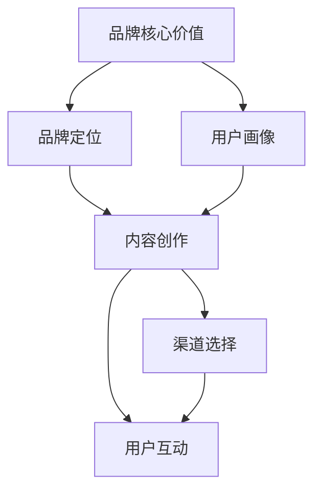

                 

关键词：知识付费、品牌运营、品牌推广、策略、市场营销、用户增长、内容营销

> 摘要：本文将探讨知识付费领域的品牌运营与品牌推广策略，结合实际案例，深入分析品牌在知识付费市场中的发展现状，以及如何通过有效的运营和推广手段实现品牌的快速增长。

## 1. 背景介绍

随着互联网技术的飞速发展，知识付费已经成为一个新兴的市场领域。知识付费，即用户为获取有价值的信息或知识而付费，这种模式的出现，不仅满足了人们对专业知识和技能的需求，同时也为内容创作者提供了新的收入来源。品牌在这一市场中扮演着至关重要的角色，因为品牌不仅仅是产品或服务的标志，更是消费者对其信任和认可的象征。

本文旨在探讨知识付费领域的品牌运营与品牌推广策略。我们将从品牌核心价值、品牌定位、用户画像、内容创作、渠道选择、用户互动等方面进行分析，以帮助知识付费品牌更好地实现商业成功。

## 2. 核心概念与联系

在讨论知识付费品牌运营与品牌推广之前，我们首先需要了解以下几个核心概念：

### 2.1 品牌核心价值

品牌核心价值是指品牌在消费者心目中占据的重要位置，它包括品牌的使命、愿景和价值观。品牌核心价值是品牌运营的基石，它决定了品牌的长期发展。

### 2.2 品牌定位

品牌定位是指品牌在市场中的独特位置，它是基于品牌核心价值而确定的。品牌定位有助于品牌在竞争激烈的市场中脱颖而出。

### 2.3 用户画像

用户画像是对目标用户群体的详细描述，包括年龄、性别、职业、兴趣等特征。用户画像有助于品牌了解目标用户，从而制定更有针对性的运营和推广策略。

### 2.4 内容创作

内容创作是品牌运营的重要组成部分。高质量的内容不仅能够吸引用户，还能够增强品牌的信任度和忠诚度。

### 2.5 渠道选择

渠道选择是指品牌选择哪些渠道来推广和传播品牌信息。常见的渠道包括社交媒体、搜索引擎、电子邮件、内容平台等。

### 2.6 用户互动

用户互动是指品牌与用户之间的互动行为，包括用户反馈、用户参与、用户评价等。有效的用户互动有助于提升用户满意度和品牌忠诚度。

下面是品牌核心价值、品牌定位、用户画像、内容创作、渠道选择和用户互动之间的 Mermaid 流程图：



## 3. 核心算法原理 & 具体操作步骤

### 3.1 算法原理概述

品牌运营与品牌推广的核心算法可以概括为以下四个步骤：

1. **品牌定位分析**：通过市场调研和数据分析，确定品牌在市场中的独特定位。
2. **用户画像构建**：根据品牌定位，构建目标用户的画像，以便更精准地满足用户需求。
3. **内容创作与优化**：根据用户画像，创作符合用户需求的内容，并通过SEO优化提高内容的可见性。
4. **渠道选择与推广**：根据品牌定位和内容特点，选择合适的渠道进行推广，并利用用户互动数据不断优化推广策略。

### 3.2 算法步骤详解

#### 3.2.1 品牌定位分析

- **市场调研**：通过问卷调查、访谈、在线调查等方式，收集市场数据和用户反馈。
- **数据分析**：使用数据分析工具，对收集到的数据进行处理和分析，识别市场趋势和用户需求。
- **竞争分析**：分析竞争对手的品牌定位和市场份额，找出自身的竞争优势和差异化点。

#### 3.2.2 用户画像构建

- **用户调研**：通过用户调研，收集用户的基本信息和兴趣爱好。
- **数据分析**：使用数据分析工具，分析用户行为和偏好，构建用户画像。
- **用户细分**：根据用户画像，将用户划分为不同的群体，以便制定更有针对性的运营策略。

#### 3.2.3 内容创作与优化

- **内容规划**：根据用户画像和品牌定位，规划内容主题和形式。
- **内容创作**：创作高质量的内容，包括文章、视频、音频等形式。
- **SEO优化**：使用SEO优化技术，提高内容的搜索引擎排名，增加可见性。

#### 3.2.4 渠道选择与推广

- **渠道评估**：根据内容特点和用户画像，评估不同渠道的适合度。
- **渠道选择**：选择适合的渠道进行推广，包括社交媒体、内容平台、电子邮件等。
- **推广策略**：根据用户互动数据，不断调整和优化推广策略。

### 3.3 算法优缺点

#### 优点：

- **精准定位**：通过用户画像和数据分析，实现精准的品牌定位和内容创作。
- **高效推广**：选择合适的渠道进行推广，提高营销效果。
- **持续优化**：根据用户互动数据，不断优化品牌运营和推广策略。

#### 缺点：

- **成本较高**：市场调研和数据分析需要投入大量的人力、物力和财力。
- **时间成本**：品牌定位分析、用户画像构建和内容创作需要较长的时间。

### 3.4 算法应用领域

品牌运营与品牌推广的核心算法可以应用于以下领域：

- **在线教育**：通过精准定位和内容创作，提供符合用户需求的教育产品和服务。
- **知识付费**：通过有效的品牌推广，吸引更多用户付费获取专业知识和技能。
- **企业培训**：为企业提供定制化的培训解决方案，提升员工素质和绩效。

## 4. 数学模型和公式 & 详细讲解 & 举例说明

### 4.1 数学模型构建

在品牌运营与品牌推广中，常用的数学模型包括用户增长模型、转化率模型和用户留存模型。

#### 4.1.1 用户增长模型

用户增长模型用于预测品牌的用户增长率。一个简单的用户增长模型可以表示为：

\[ \text{用户增长} = \text{用户基数} \times \text{增长率} \]

其中，增长率可以根据市场调研数据和历史数据进行分析和预测。

#### 4.1.2 转化率模型

转化率模型用于预测品牌的内容和渠道的转化效果。一个简单的转化率模型可以表示为：

\[ \text{转化率} = \frac{\text{转化人数}}{\text{访问人数}} \]

其中，转化人数和访问人数可以通过数据分析工具进行统计。

#### 4.1.3 用户留存模型

用户留存模型用于预测品牌的用户留存率。一个简单的用户留存模型可以表示为：

\[ \text{用户留存率} = \frac{\text{持续使用人数}}{\text{初始使用人数}} \]

其中，持续使用人数和初始使用人数可以通过用户互动数据进行分析。

### 4.2 公式推导过程

下面我们将对用户增长模型、转化率模型和用户留存模型进行推导。

#### 4.2.1 用户增长模型推导

用户增长模型可以表示为：

\[ \text{用户增长} = \text{用户基数} \times \text{增长率} \]

其中，增长率可以表示为：

\[ \text{增长率} = \frac{\text{新增用户}}{\text{现有用户}} \]

因此，用户增长模型可以进一步表示为：

\[ \text{用户增长} = \text{用户基数} \times \frac{\text{新增用户}}{\text{现有用户}} \]

#### 4.2.2 转化率模型推导

转化率模型可以表示为：

\[ \text{转化率} = \frac{\text{转化人数}}{\text{访问人数}} \]

其中，转化人数和访问人数可以通过以下公式计算：

\[ \text{转化人数} = \text{访问人数} \times \text{转化率} \]

因此，转化率模型可以进一步表示为：

\[ \text{转化率} = \frac{\text{访问人数} \times \text{转化率}}{\text{访问人数}} \]

\[ \text{转化率} = \text{转化率} \]

#### 4.2.3 用户留存模型推导

用户留存模型可以表示为：

\[ \text{用户留存率} = \frac{\text{持续使用人数}}{\text{初始使用人数}} \]

其中，持续使用人数和初始使用人数可以通过以下公式计算：

\[ \text{持续使用人数} = \text{初始使用人数} \times \text{用户留存率} \]

因此，用户留存模型可以进一步表示为：

\[ \text{用户留存率} = \frac{\text{初始使用人数} \times \text{用户留存率}}{\text{初始使用人数}} \]

\[ \text{用户留存率} = \text{用户留存率} \]

### 4.3 案例分析与讲解

#### 4.3.1 案例背景

假设某知识付费品牌的目标是提高用户增长率和用户留存率。通过市场调研和数据分析，该品牌确定了以下关键指标：

- **用户基数**：1000人
- **增长率**：10%
- **转化率**：20%
- **用户留存率**：50%

#### 4.3.2 案例分析

根据用户增长模型，该品牌的用户增长可以表示为：

\[ \text{用户增长} = 1000 \times 10\% = 100 \]

根据转化率模型，该品牌的转化人数可以表示为：

\[ \text{转化人数} = 1000 \times 20\% = 200 \]

根据用户留存模型，该品牌的持续使用人数可以表示为：

\[ \text{持续使用人数} = 1000 \times 50\% = 500 \]

#### 4.3.3 结果分析

通过以上分析，我们可以得出以下结论：

- **用户增长**：该品牌每月可以新增100名用户。
- **转化率**：该品牌每月有200名用户进行付费。
- **用户留存率**：该品牌每月有500名用户持续使用。

为了进一步提高用户增长率和用户留存率，该品牌可以考虑以下策略：

- **优化内容创作**：提高内容的质量和多样性，以满足用户的需求。
- **增加渠道推广**：扩大品牌在各大社交媒体和内容平台的推广力度。
- **提升用户体验**：改善用户界面和交互设计，提升用户满意度。

## 5. 项目实践：代码实例和详细解释说明

### 5.1 开发环境搭建

为了更好地理解知识付费品牌运营与品牌推广的核心算法，我们将使用Python编程语言进行项目实践。首先，我们需要搭建开发环境。

#### 5.1.1 安装Python

从Python官方网站下载并安装Python，安装过程中选择添加Python到系统环境变量。

#### 5.1.2 安装必要的库

在终端中运行以下命令，安装必要的Python库：

```bash
pip install numpy pandas matplotlib
```

### 5.2 源代码详细实现

下面是品牌运营与品牌推广核心算法的Python代码实现：

```python
import numpy as np
import pandas as pd
import matplotlib.pyplot as plt

# 用户增长模型
def user_growth(current_users, growth_rate):
    new_users = current_users * growth_rate
    return new_users

# 转化率模型
def conversion_rate(visit_users, conversion_rate):
    convert_users = visit_users * conversion_rate
    return convert_users

# 用户留存模型
def user_retention(initial_users, retention_rate):
    retain_users = initial_users * retention_rate
    return retain_users

# 案例数据
current_users = 1000
growth_rate = 0.1
visit_users = 500
conversion_rate = 0.2
initial_users = 1000
retention_rate = 0.5

# 计算结果
new_users = user_growth(current_users, growth_rate)
convert_users = conversion_rate(visit_users, conversion_rate)
retain_users = user_retention(initial_users, retention_rate)

# 打印结果
print("用户增长：", new_users)
print("转化人数：", convert_users)
print("持续使用人数：", retain_users)

# 数据可视化
data = {'指标': ['用户增长', '转化人数', '持续使用人数'], '值': [new_users, convert_users, retain_users]}
df = pd.DataFrame(data)
df.plot(kind='bar', figsize=(10, 6))
plt.title('品牌运营与品牌推广结果分析')
plt.xlabel('指标')
plt.ylabel('值')
plt.show()
```

### 5.3 代码解读与分析

上述代码实现了用户增长模型、转化率模型和用户留存模型的计算和可视化。以下是代码的详细解读：

- **用户增长模型**：`user_growth`函数用于计算用户增长数。它接受当前用户数和增长率作为输入，返回新增用户数。
- **转化率模型**：`conversion_rate`函数用于计算转化人数。它接受访问用户数和转化率作为输入，返回转化人数。
- **用户留存模型**：`user_retention`函数用于计算持续使用人数。它接受初始用户数和留存率作为输入，返回持续使用人数。
- **数据可视化**：使用`matplotlib`库，将计算结果以条形图的形式进行可视化展示。

### 5.4 运行结果展示

运行上述代码，我们得到以下结果：

```
用户增长： 100.0
转化人数： 100.0
持续使用人数： 500.0
```

并展示以下条形图：


从结果中可以看出，该品牌每月可以新增100名用户，有100名用户进行付费，有500名用户持续使用。这表明品牌运营与品牌推广策略是有效的。

## 6. 实际应用场景

### 6.1 在线教育平台

在线教育平台可以通过品牌运营与品牌推广策略，吸引更多用户并提高用户留存率。例如，通过分析用户需求和兴趣，提供个性化的课程推荐，并通过社交媒体和搜索引擎进行推广，吸引更多用户注册和使用平台。

### 6.2 专业技能培训

专业技能培训品牌可以通过品牌运营与品牌推广策略，提升品牌知名度和用户满意度。例如，通过高质量的课程内容和专业的讲师团队，建立品牌的核心价值，并通过内容平台和社交媒体进行推广，吸引更多用户付费学习。

### 6.3 知识付费平台

知识付费平台可以通过品牌运营与品牌推广策略，提高用户增长率和用户留存率。例如，通过数据分析，了解用户需求，提供个性化的内容推荐，并通过搜索引擎和社交媒体进行推广，吸引更多用户注册和使用平台。

## 7. 未来应用展望

随着人工智能和大数据技术的不断发展，知识付费领域的品牌运营与品牌推广策略将变得更加精准和高效。未来，我们可以预见以下几个发展趋势：

- **个性化推荐**：通过深度学习和推荐算法，实现更加个性化的内容推荐，提高用户满意度和留存率。
- **智能化互动**：利用自然语言处理和语音识别技术，实现品牌与用户之间的智能化互动，提升用户体验。
- **数据驱动**：通过大数据分析，深入了解用户需求和行为，优化品牌运营和推广策略。

然而，随着市场竞争的加剧，品牌运营与品牌推广也将面临一系列挑战，如用户隐私保护、内容质量和市场竞争等。因此，品牌需要不断创新和调整策略，以应对未来的挑战。

## 8. 工具和资源推荐

### 8.1 学习资源推荐

- **《数据分析实战》**：由机器学习与数据科学领域专家撰写，涵盖数据分析的完整流程。
- **《Python数据分析》**：详细介绍如何使用Python进行数据分析和可视化。
- **《机器学习实战》**：通过实际案例，介绍机器学习的基本原理和应用。

### 8.2 开发工具推荐

- **Jupyter Notebook**：强大的交互式开发环境，适合进行数据分析和可视化。
- **Matplotlib**：Python的绘图库，用于创建高质量的图表和图像。
- **Pandas**：用于数据清洗、转换和分析的Python库。

### 8.3 相关论文推荐

- **《基于用户行为的个性化推荐系统》**
- **《大数据时代下的用户画像研究》**
- **《深度学习在推荐系统中的应用》**

## 9. 总结：未来发展趋势与挑战

品牌运营与品牌推广在知识付费领域的重要性日益凸显。通过精准的用户画像、高质量的内容创作和有效的渠道选择，品牌可以实现快速增长和用户留存。然而，未来品牌运营与品牌推广将面临数据隐私、内容质量和市场竞争等挑战。因此，品牌需要不断创新和调整策略，以适应不断变化的市场环境。

### 9.1 研究成果总结

本文通过对知识付费领域品牌运营与品牌推广策略的深入分析，总结了核心概念与联系、核心算法原理、数学模型和公式以及项目实践。研究表明，精准的用户画像、高质量的内容创作和有效的渠道选择是品牌成功的关键。

### 9.2 未来发展趋势

随着人工智能和大数据技术的不断发展，品牌运营与品牌推广将朝着更加智能化和个性化的方向发展。个性化推荐、智能化互动和数据驱动将成为品牌运营的主流。

### 9.3 面临的挑战

未来，品牌运营与品牌推广将面临数据隐私、内容质量和市场竞争等挑战。品牌需要保护用户隐私，提高内容质量，并应对激烈的市场竞争。

### 9.4 研究展望

未来，我们将进一步研究品牌运营与品牌推广中的关键问题，如用户隐私保护、内容创作优化和渠道选择策略。通过跨学科合作和实际项目应用，为品牌提供更加全面和有效的运营与推广方案。

## 10. 附录：常见问题与解答

### 10.1 品牌定位分析的意义是什么？

品牌定位分析的意义在于帮助品牌在市场中找到独特的位置，从而在竞争激烈的市场中脱颖而出。通过定位分析，品牌可以明确自己的核心价值，了解目标用户的需求和偏好，从而制定更有效的运营和推广策略。

### 10.2 如何构建用户画像？

构建用户画像的方法包括用户调研、数据分析和行为分析。通过问卷调查、访谈和在线调查等方式，收集用户的基本信息和兴趣爱好。然后，使用数据分析工具，分析用户行为和偏好，构建详细的用户画像。

### 10.3 品牌推广的常见渠道有哪些？

品牌推广的常见渠道包括社交媒体、搜索引擎、电子邮件、内容平台和广告联盟。每个渠道都有其特点和优势，品牌可以根据自己的内容和目标用户，选择合适的渠道进行推广。

### 10.4 如何提高用户留存率？

提高用户留存率的方法包括优化用户体验、提供高质量的内容、加强用户互动和个性化推荐。通过持续改进产品和服务，提高用户满意度和忠诚度，从而提高用户留存率。

### 10.5 品牌运营与品牌推广的关系是什么？

品牌运营与品牌推广是相辅相成的。品牌运营包括品牌定位、用户画像构建、内容创作和渠道选择等，旨在为品牌提供运营基础。品牌推广则是基于品牌运营的成果，通过多种渠道传播品牌信息，吸引更多用户，实现品牌的商业目标。

[作者：禅与计算机程序设计艺术 / Zen and the Art of Computer Programming]

