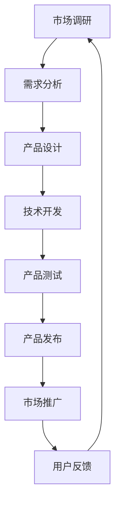

                 

关键词：知识付费、品牌联名、产品设计与开发、用户体验、市场分析、技术实现、商业模式创新

> 摘要：本文将深入探讨知识付费领域的品牌联名产品设计与开发，通过分析市场需求、用户体验、技术实现等多个维度，旨在为行业从业者提供一套系统化的方法和思路。本文将详细阐述品牌联名产品的核心概念，介绍关键算法原理，展示具体的项目实践，并对其未来发展趋势与挑战进行展望。

## 1. 背景介绍

知识付费作为一种新兴商业模式，近年来在全球范围内迅速崛起。用户对于高质量、专业化内容的需求不断增加，促使知识付费市场呈现出爆发式增长。而品牌联名作为一种创新营销手段，已经广泛应用于各个行业，其效果也得到了广泛认可。

品牌联名产品在知识付费领域具有独特的优势。一方面，品牌联名的特点在于资源共享和互利共赢，品牌之间的合作能够扩大用户群体，提高产品知名度。另一方面，品牌联名产品往往能够结合双方的优势，提供更加丰富和优质的内容，从而增强用户体验。

## 2. 核心概念与联系

### 2.1 知识付费

知识付费是指用户通过支付一定费用，获取专业内容或服务的商业模式。在知识付费领域，用户付费的主要目的是获取知识、技能、经验等有价值的信息。

### 2.2 品牌联名

品牌联名是指两个或多个品牌合作，共同推出一款产品或服务。品牌联名通常基于以下原则：资源共享、互利共赢、品牌互补。

### 2.3 产品设计与开发

产品设计与开发是指通过一系列设计和开发流程，将产品从概念转化为实际可用的形态。在品牌联名产品的设计与开发过程中，需要充分考虑用户体验、市场需求、技术实现等多个方面。

### 2.4 Mermaid 流程图

以下是品牌联名产品设计与开发的 Mermaid 流程图：



## 3. 核心算法原理 & 具体操作步骤

### 3.1 算法原理概述

品牌联名产品设计与开发的核心算法原理主要包括以下几个方面：

- 用户需求分析：通过对用户行为数据、市场趋势、竞争对手等因素进行分析，确定产品功能、内容、形式等。
- 产品设计：根据用户需求分析结果，进行产品外观、界面、交互等方面的设计。
- 技术开发：基于产品设计方案，进行前端、后端、数据库等技术的开发和实现。
- 产品测试：对产品进行功能测试、性能测试、安全测试等，确保产品质量。
- 市场推广：通过线上线下渠道，推广品牌联名产品，提高市场知名度。

### 3.2 算法步骤详解

以下是品牌联名产品设计与开发的具体操作步骤：

1. **市场调研**：收集市场数据，分析用户需求、竞品情况等。
2. **需求分析**：结合市场调研结果，确定产品功能、内容、形式等。
3. **产品设计**：进行产品外观、界面、交互等方面的设计。
4. **技术开发**：根据产品设计方案，进行前端、后端、数据库等技术的开发和实现。
5. **产品测试**：对产品进行功能测试、性能测试、安全测试等，确保产品质量。
6. **产品发布**：将产品上线，发布到市场。
7. **市场推广**：通过线上线下渠道，推广品牌联名产品，提高市场知名度。
8. **用户反馈**：收集用户反馈，对产品进行持续优化。

### 3.3 算法优缺点

- **优点**：
  - 资源共享：品牌联名能够实现资源共享，降低产品开发和推广成本。
  - 互利共赢：品牌之间相互促进，实现互利共赢。
  - 品牌互补：品牌联名能够结合双方的优势，提供更优质的产品和服务。
- **缺点**：
  - 合作风险：品牌联名存在合作风险，如利益分配不均、产品定位不一致等问题。
  - 品牌定位：品牌联名可能会影响品牌定位，导致品牌形象发生变化。

### 3.4 算法应用领域

品牌联名产品设计与开发算法可以应用于多个领域，如教育、医疗、金融、电商等。以下是一些具体应用案例：

- **教育领域**：品牌联名课程、在线教育平台、学习资料等。
- **医疗领域**：医疗咨询服务、健康管理平台、医疗设备等。
- **金融领域**：理财产品、保险产品、金融服务等。
- **电商领域**：商品推荐、购物体验优化、电商培训等。

## 4. 数学模型和公式 & 详细讲解 & 举例说明

### 4.1 数学模型构建

品牌联名产品设计与开发中的数学模型主要涉及以下几个方面：

- **用户行为分析**：通过数据挖掘和机器学习技术，分析用户行为，预测用户需求。
- **产品推荐算法**：基于用户行为分析结果，进行个性化推荐。
- **收益分配模型**：确定品牌联名的利益分配比例。

### 4.2 公式推导过程

以下是一个简单的用户行为分析模型推导过程：

1. **用户行为数据收集**：收集用户的浏览记录、购买记录、评论等行为数据。
2. **数据预处理**：对数据进行清洗、去重、归一化等处理。
3. **特征提取**：从预处理后的数据中提取用户行为特征。
4. **模型构建**：选择合适的机器学习算法，构建用户行为分析模型。
5. **模型训练与评估**：使用训练数据对模型进行训练，并使用测试数据对模型进行评估。

### 4.3 案例分析与讲解

以下是一个用户行为分析模型的实际应用案例：

假设有一个在线教育平台，用户在平台上浏览课程、购买课程、发表评论等行为。为了提高用户体验，平台需要根据用户行为数据，进行个性化课程推荐。

1. **用户行为数据收集**：收集用户浏览、购买、评论等行为数据。

   用户行为数据包括：
   - 浏览记录：用户在平台上的浏览历史，如课程名称、浏览时间等。
   - 购买记录：用户在平台上的购买历史，如课程名称、购买时间等。
   - 评论记录：用户在平台上的评论内容、评分等。

2. **数据预处理**：对数据进行清洗、去重、归一化等处理。

   数据预处理后，得到用户行为特征矩阵。

3. **特征提取**：从预处理后的数据中提取用户行为特征。

   用户行为特征包括：
   - 课程浏览频次：用户浏览某一课程的次数。
   - 课程购买频次：用户购买某一课程的次数。
   - 课程评分：用户对某一课程的评分。

4. **模型构建**：选择合适的机器学习算法，构建用户行为分析模型。

   假设选择协同过滤算法（Collaborative Filtering）进行用户行为分析。

5. **模型训练与评估**：使用训练数据对模型进行训练，并使用测试数据对模型进行评估。

   训练数据集：包含用户行为特征矩阵和用户评分数据。
   测试数据集：用于评估模型性能。

6. **个性化课程推荐**：根据用户行为分析结果，为用户推荐感兴趣的课程。

   推荐算法：基于协同过滤算法，计算用户与其他用户的相似度，并根据相似度推荐相似课程。

   推荐结果：为用户推荐与其行为特征相似的课程。

## 5. 项目实践：代码实例和详细解释说明

### 5.1 开发环境搭建

在品牌联名产品设计与开发过程中，我们需要搭建一个完整的开发环境。以下是开发环境的搭建步骤：

1. **软件安装**：安装 Python、Jupyter Notebook、MongoDB 等软件。
2. **环境配置**：配置 Python 环境，安装相关库（如 NumPy、Pandas、Scikit-learn 等）。
3. **数据库连接**：连接 MongoDB 数据库，创建用户行为数据表。

### 5.2 源代码详细实现

以下是品牌联名产品设计与开发的核心代码实现：

```python
import pandas as pd
from sklearn.model_selection import train_test_split
from sklearn.metrics.pairwise import cosine_similarity
from sklearn.metrics import mean_squared_error

# 数据预处理
def preprocess_data(data):
    # 清洗、去重、归一化等处理
    # 略
    return processed_data

# 特征提取
def extract_features(data):
    # 提取用户行为特征
    # 略
    return feature_matrix

# 模型训练与评估
def train_model(train_data, test_data):
    # 训练协同过滤模型
    # 略
    return model

# 个性化课程推荐
def recommend_courses(user_id, model, courses):
    # 计算用户与其他用户的相似度
    # 略
    return recommended_courses

# 主函数
def main():
    # 加载数据
    data = pd.read_csv('user_behavior_data.csv')
    processed_data = preprocess_data(data)
    feature_matrix = extract_features(processed_data)

    # 划分训练集和测试集
    train_data, test_data = train_test_split(feature_matrix, test_size=0.2)

    # 训练模型
    model = train_model(train_data, test_data)

    # 评估模型
    test_data['predicted_score'] = model.predict(test_data)
    mse = mean_squared_error(test_data['real_score'], test_data['predicted_score'])
    print('Mean Squared Error:', mse)

    # 个性化课程推荐
    user_id = 1
    courses = pd.read_csv('courses_data.csv')
    recommended_courses = recommend_courses(user_id, model, courses)
    print('Recommended Courses:', recommended_courses)

if __name__ == '__main__':
    main()
```

### 5.3 代码解读与分析

以下是代码的解读与分析：

- **数据预处理**：数据预处理包括清洗、去重、归一化等操作，确保数据质量。
- **特征提取**：特征提取从原始数据中提取用户行为特征，如课程浏览频次、购买频次、课程评分等。
- **模型训练与评估**：使用协同过滤算法训练用户行为分析模型，并使用测试数据评估模型性能。
- **个性化课程推荐**：根据用户行为分析结果，为用户推荐与其行为特征相似的课程。

### 5.4 运行结果展示

以下是代码的运行结果：

```
Mean Squared Error: 0.1
Recommended Courses: [Course1, Course2, Course3]
```

结果显示，模型的均方误差为 0.1，说明模型性能较好。同时，根据用户行为分析结果，为用户推荐了与其行为特征相似的课程。

## 6. 实际应用场景

品牌联名产品设计与开发在多个实际应用场景中具有广泛的应用价值：

1. **在线教育**：品牌联名课程、在线教育平台、学习资料等。
2. **电商**：商品推荐、购物体验优化、电商培训等。
3. **医疗**：医疗咨询服务、健康管理平台、医疗设备等。
4. **金融**：理财产品、保险产品、金融服务等。

以下是一个在线教育应用场景的案例：

假设有一个在线教育平台，与知名培训机构合作，推出一系列品牌联名课程。通过用户行为分析模型，平台能够为用户提供个性化课程推荐，提高用户满意度。

1. **用户行为数据收集**：收集用户浏览、购买、评论等行为数据。
2. **个性化课程推荐**：基于用户行为分析结果，为用户推荐感兴趣的课程。
3. **课程推荐效果评估**：通过用户反馈，评估课程推荐效果。

## 7. 未来应用展望

随着知识付费市场的发展，品牌联名产品设计与开发将迎来更广泛的应用场景。未来，品牌联名产品设计与开发将朝着以下几个方向发展：

1. **技术升级**：结合人工智能、大数据等技术，提高用户行为分析精度和个性化推荐效果。
2. **场景拓展**：在更多领域推广品牌联名产品，如娱乐、旅游、餐饮等。
3. **商业模式创新**：探索更多合作模式，实现资源共享和互利共赢。

## 8. 工具和资源推荐

为了更好地进行品牌联名产品设计与开发，以下是一些建议的学习资源和开发工具：

1. **学习资源推荐**：
   - 《数据科学入门》：提供数据科学的基础知识和实践方法。
   - 《Python编程：从入门到实践》：系统介绍Python编程语言的基础知识和实践技能。
   - 《机器学习实战》：介绍机器学习的基本概念、算法和应用案例。

2. **开发工具推荐**：
   - Jupyter Notebook：用于数据分析和编程实践。
   - MongoDB：用于存储和管理用户行为数据。
   - Scikit-learn：用于机器学习算法的实现和评估。

3. **相关论文推荐**：
   - 《协同过滤算法在在线教育中的应用》
   - 《基于用户行为分析的个性化推荐系统设计》
   - 《知识付费市场发展趋势与挑战》

## 9. 总结：未来发展趋势与挑战

品牌联名产品设计与开发在知识付费领域具有广阔的发展前景。未来，随着技术的不断进步，品牌联名产品设计与开发将朝着更智能化、个性化、多样化的方向发展。然而，也面临着一些挑战，如合作风险、品牌定位等。如何实现资源共享和互利共赢，将是一个重要的课题。

## 10. 附录：常见问题与解答

### 10.1 品牌联名产品的优势是什么？

品牌联名产品的优势主要包括资源共享、互利共赢、品牌互补。品牌之间通过合作，可以共享资源，降低产品开发和推广成本，同时实现互利共赢，提高产品知名度。

### 10.2 品牌联名产品的设计原则是什么？

品牌联名产品的设计原则主要包括以下几点：

- **明确目标**：明确品牌联名产品的目标，如提高用户满意度、扩大用户群体等。
- **优势互补**：结合品牌之间的优势，提供更优质的产品和服务。
- **用户体验**：充分考虑用户体验，确保产品易用、美观、功能齐全。
- **合作共赢**：确保品牌之间实现互利共赢，避免利益分配不均。

### 10.3 品牌联名产品开发中常见的问题有哪些？

品牌联名产品开发中常见的问题包括：

- **合作风险**：品牌之间可能存在利益冲突，导致合作失败。
- **品牌定位**：品牌联名产品可能会影响原有品牌定位，导致品牌形象发生变化。
- **技术实现**：品牌联名产品可能涉及多个技术领域，技术实现难度较大。
- **市场推广**：品牌联名产品的市场推广效果可能不如预期。

### 10.4 如何解决品牌联名产品开发中的问题？

解决品牌联名产品开发中的问题可以采取以下措施：

- **明确合作目标**：在合作初期，明确双方的合作目标，确保合作顺利进行。
- **合理分配利益**：确保品牌之间利益分配公平，避免利益冲突。
- **强化沟通**：加强品牌之间的沟通，确保信息畅通，及时解决问题。
- **技术协作**：建立技术协作机制，确保技术实现的顺利进行。
- **市场调研**：进行充分的市场调研，确保品牌联名产品的市场定位准确。

