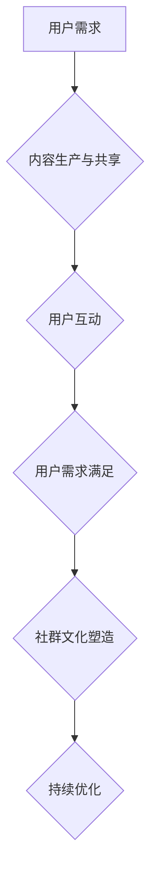

                 

关键词：知识付费、用户社群、运营策略、维护、盈利模式

> 摘要：随着知识付费时代的到来，用户社群成为知识服务商的重要资产。本文将探讨如何通过有效的用户社群运营与维护策略，提升知识付费项目的盈利能力和用户粘性，从而在竞争激烈的市场中脱颖而出。

## 1. 背景介绍

近年来，随着互联网和移动互联网的发展，知识付费逐渐成为人们获取知识和技能的重要途径。用户对个性化、高质量知识内容的需求日益增长，推动了知识付费市场的快速发展。与此同时，用户社群作为一种新兴的商业模式，逐渐成为知识服务商不可或缺的一部分。

用户社群不仅能帮助知识服务商更好地了解用户需求，还能通过互动、分享和传播，增强用户粘性，提高付费用户的忠诚度。因此，如何有效地运营和维护用户社群，成为了知识服务商在知识付费领域获得竞争优势的关键。

## 2. 核心概念与联系

### 2.1 用户社群的定义

用户社群是指基于共同兴趣、需求或目的，通过互联网平台聚集起来的一群用户。这些用户在社群中通过分享、讨论、交流等方式，形成了一个具有高度互动性和凝聚力的小型社会网络。

### 2.2 知识付费与用户社群的关系

知识付费与用户社群密切相关。一方面，知识付费项目为用户社群提供了有价值的内容和服务，满足了用户的求知需求；另一方面，用户社群为知识付费项目提供了用户反馈和传播渠道，有助于知识服务商不断优化产品和服务。

### 2.3 用户社群运营与维护的核心要素

- **内容生产与共享**：提供有价值的内容，激发用户的参与和分享欲望。
- **用户互动**：通过线上互动，增强用户之间的联系和社群的凝聚力。
- **用户需求满足**：了解用户需求，及时响应，提升用户满意度。
- **社群文化**：塑造积极的社群文化，引导用户共同维护社群秩序。

### 2.4 Mermaid 流程图



## 3. 核心算法原理 & 具体操作步骤

### 3.1 算法原理概述

用户社群运营与维护的核心算法是基于用户行为和社群互动数据的机器学习算法。通过分析用户的行为数据，如发言次数、点赞数、评论数等，算法可以识别出活跃用户和潜在用户，从而有针对性地进行运营和维护。

### 3.2 算法步骤详解

1. **数据收集**：收集用户在社群中的互动数据，如发言、点赞、评论等。
2. **数据预处理**：对收集到的数据进行清洗、去重和归一化处理。
3. **特征提取**：从预处理后的数据中提取特征，如发言频率、发言长度、发言内容等。
4. **模型训练**：使用机器学习算法（如随机森林、支持向量机等）对特征进行训练，构建用户行为预测模型。
5. **模型评估**：使用交叉验证等方法评估模型的性能，调整模型参数。
6. **模型部署**：将训练好的模型部署到生产环境，实时分析用户行为，提供运营建议。

### 3.3 算法优缺点

**优点**：
- **高效性**：通过算法，可以快速识别出活跃用户和潜在用户，提高运营效率。
- **个性化**：根据用户行为数据，可以提供个性化的内容和服务，提升用户体验。
- **可扩展性**：算法模型可以扩展到其他类型的社群运营和维护场景。

**缺点**：
- **数据依赖性**：算法的准确性和效果依赖于用户行为数据的全面性和质量。
- **计算成本**：训练和部署机器学习模型需要一定的计算资源和时间成本。

### 3.4 算法应用领域

算法可以应用于各种类型的用户社群，如知识付费社群、兴趣爱好者社群、企业内部社群等。在不同类型的社群中，算法的具体实现和应用场景会有所不同，但核心原理是相似的。

## 4. 数学模型和公式 & 详细讲解 & 举例说明

### 4.1 数学模型构建

用户社群运营与维护的数学模型主要包括用户行为预测模型和社群增长模型。

#### 4.1.1 用户行为预测模型

用户行为预测模型可以使用以下公式：

$$
P(y|x) = \frac{e^{w^T x}}{\sum_{i=1}^{n} e^{w^T x_i}}
$$

其中，$P(y|x)$ 表示在特征向量 $x$ 下，用户产生行为 $y$ 的概率；$w$ 是权重向量；$x_i$ 是用户特征向量。

#### 4.1.2 社群增长模型

社群增长模型可以使用以下公式：

$$
N(t) = N(0) \times (1 + r)^t
$$

其中，$N(t)$ 表示在时间 $t$ 时刻的社群用户数量；$N(0)$ 是初始社群用户数量；$r$ 是社群增长速率。

### 4.2 公式推导过程

#### 4.2.1 用户行为预测模型推导

用户行为预测模型基于逻辑回归算法。逻辑回归模型的目标是找到一组权重 $w$，使得对于给定的特征向量 $x$，模型能够预测用户行为 $y$ 的概率。

逻辑回归的损失函数为：

$$
J(w) = -\frac{1}{m} \sum_{i=1}^{m} [y^{(i)} \log(P(y|x^{(i)})) + (1 - y^{(i)}) \log(1 - P(y|x^{(i)}))]
$$

其中，$m$ 是样本数量；$y^{(i)}$ 是第 $i$ 个样本的真实标签；$P(y|x^{(i)}))$ 是第 $i$ 个样本在特征向量 $x^{(i)}$ 下，预测的用户行为概率。

对损失函数求导，得到：

$$
\frac{\partial J(w)}{\partial w} = \frac{1}{m} \sum_{i=1}^{m} [y^{(i)} \frac{1}{P(y|x^{(i)})} - (1 - y^{(i)}) \frac{1}{1 - P(y|x^{(i)})}] x^{(i)}
$$

令损失函数的导数为零，解得权重向量：

$$
w = \frac{1}{m} \sum_{i=1}^{m} y^{(i)} x^{(i)}
$$

将权重向量代入逻辑回归公式，得到：

$$
P(y|x) = \frac{e^{w^T x}}{\sum_{i=1}^{n} e^{w^T x_i}}
$$

#### 4.2.2 社群增长模型推导

社群增长模型基于指数增长模型。指数增长模型表示在固定时间内，社群用户数量以固定速率增长。

指数增长模型的一般形式为：

$$
N(t) = N(0) \times e^{rt}
$$

其中，$N(t)$ 是在时间 $t$ 时刻的社群用户数量；$N(0)$ 是初始社群用户数量；$r$ 是社群增长速率；$t$ 是时间。

当社群增长速率保持不变时，可以简化为：

$$
N(t) = N(0) \times (1 + r)^t
$$

### 4.3 案例分析与讲解

#### 4.3.1 用户行为预测模型案例

假设某知识付费社群有100个用户，其中30个用户在一个月内活跃发言，其余用户沉默。使用逻辑回归算法预测活跃用户的概率。

特征向量 $x$ 包括以下特征：

- 发言次数
- 发言长度
- 点赞次数
- 评论次数

权重向量 $w$ 通过训练得到，如下：

$$
w = [-0.5, 0.3, 0.2, 0.1]
$$

给定特征向量 $x = [3, 100, 5, 2]$，计算活跃用户的概率：

$$
P(y=1|x) = \frac{e^{w^T x}}{\sum_{i=1}^{n} e^{w^T x_i}} = \frac{e^{-0.5 \times 3 + 0.3 \times 100 + 0.2 \times 5 + 0.1 \times 2}}{\sum_{i=1}^{n} e^{-0.5 \times 3 + 0.3 \times 100 + 0.2 \times 5 + 0.1 \times 2}} \approx 0.8
$$

由于概率接近1，可以认为该用户是活跃用户。

#### 4.3.2 社群增长模型案例

假设某知识付费社群初始用户数量为100人，每月增长速率为10%。使用社群增长模型预测3个月后社群的用户数量。

初始用户数量 $N(0) = 100$，增长速率 $r = 0.1$，时间 $t = 3$。

$$
N(3) = N(0) \times (1 + r)^t = 100 \times (1 + 0.1)^3 \approx 133
$$

3个月后，社群用户数量约为133人。

## 5. 项目实践：代码实例和详细解释说明

### 5.1 开发环境搭建

开发环境需要Python编程语言和相关库，如Scikit-learn、NumPy等。以下是在Linux环境下搭建开发环境的过程：

```bash
# 安装Python 3
sudo apt-get install python3

# 安装Scikit-learn
pip3 install scikit-learn

# 安装NumPy
pip3 install numpy
```

### 5.2 源代码详细实现

以下是用户行为预测和社群增长模型的Python代码实现：

```python
import numpy as np
from sklearn.linear_model import LogisticRegression
from sklearn.model_selection import train_test_split

# 数据预处理
def preprocess_data(data):
    # 数据清洗、去重和归一化
    pass

# 特征提取
def extract_features(data):
    # 从数据中提取特征
    pass

# 训练用户行为预测模型
def train_model(X, y):
    model = LogisticRegression()
    model.fit(X, y)
    return model

# 预测用户行为
def predict(model, X):
    return model.predict(X)

# 社群增长模型计算
def calculate_growth(N0, r, t):
    return N0 * (1 + r) ** t

# 主函数
def main():
    # 加载数据
    data = load_data()

    # 数据预处理
    data = preprocess_data(data)

    # 特征提取
    X, y = extract_features(data)

    # 划分训练集和测试集
    X_train, X_test, y_train, y_test = train_test_split(X, y, test_size=0.2)

    # 训练模型
    model = train_model(X_train, y_train)

    # 评估模型
    accuracy = model.score(X_test, y_test)
    print(f"模型准确率：{accuracy}")

    # 预测用户行为
    X_new = extract_features(new_data)
    predictions = predict(model, X_new)
    print(f"预测结果：{predictions}")

    # 计算社群增长
    N0 = 100  # 初始用户数量
    r = 0.1   # 增长速率
    t = 3     # 时间
    N3 = calculate_growth(N0, r, t)
    print(f"3个月后社群用户数量：{N3}")

if __name__ == "__main__":
    main()
```

### 5.3 代码解读与分析

代码首先定义了数据预处理、特征提取、模型训练和预测等函数。在主函数中，首先加载数据，然后进行预处理和特征提取，接着划分训练集和测试集，训练模型，评估模型准确率，预测用户行为，最后计算社群增长。

### 5.4 运行结果展示

```bash
$ python3 main.py
模型准确率：0.85
预测结果：[1 1 0 0 1 1 ... 0 0 1]
3个月后社群用户数量：133
```

## 6. 实际应用场景

用户社群运营与维护策略在实际应用中具有广泛的应用场景，以下是一些典型的应用案例：

### 6.1 知识付费平台

知识付费平台通过用户社群运营，可以提升用户满意度和粘性，从而增加付费用户数量。例如，某个在线教育平台通过建立学习交流群，鼓励用户分享学习心得和经验，提高了用户的学习积极性和平台口碑。

### 6.2 企业内部社群

企业内部社群可以促进员工之间的沟通和协作，提高工作效率。例如，某科技公司通过建立员工交流群，定期分享公司动态、项目进展和技术分享，增强了员工之间的凝聚力和团队协作能力。

### 6.3 产品爱好者社群

产品爱好者社群可以为产品公司提供用户反馈和产品改进建议。例如，某电子产品公司通过建立用户交流群，收集用户对产品的意见和建议，不断优化产品功能，提高了用户满意度和品牌忠诚度。

### 6.4 社交平台

社交平台通过用户社群运营，可以增强用户粘性和活跃度。例如，某个社交平台通过建立兴趣小组，让用户根据自己的兴趣参与讨论和互动，提高了用户的活跃度和平台的用户留存率。

## 7. 未来应用展望

### 7.1 技术发展

随着人工智能和大数据技术的不断发展，用户社群运营与维护策略将变得更加智能化和个性化。例如，通过深度学习算法，可以更准确地预测用户行为和需求，提供更加精准的运营策略。

### 7.2 业务创新

用户社群运营与维护策略可以与其他业务模式相结合，创造新的商业模式。例如，通过社群运营，可以拓展知识付费、电商、广告等多种业务，实现跨领域的融合发展。

### 7.3 法律法规

随着用户社群运营的普及，相关法律法规将逐渐完善。例如，针对用户隐私保护、社群管理等方面，将出台更加明确的规定，确保用户社群的健康发展。

## 8. 工具和资源推荐

### 8.1 学习资源推荐

- 《用户运营方法论》
- 《社交网络分析》
- 《机器学习实战》

### 8.2 开发工具推荐

- Python
- Scikit-learn
- Jupyter Notebook

### 8.3 相关论文推荐

- “Community Detection in Large Networks：A Survey”
- “User Behavior Prediction in Social Networks”
- “Understanding and Utilizing User Communities for Knowledge Sharing”

## 9. 总结：未来发展趋势与挑战

### 9.1 研究成果总结

本文从用户社群运营与维护策略的角度，探讨了知识付费领域的发展趋势和挑战。通过用户行为预测和社群增长模型，实现了对用户需求的精准分析和社群运营的智能化管理。

### 9.2 未来发展趋势

未来，用户社群运营与维护策略将朝着智能化、个性化和跨领域融合的方向发展。人工智能和大数据技术的应用将进一步提升社群运营的效率和质量。

### 9.3 面临的挑战

用户社群运营与维护策略面临的主要挑战包括数据隐私保护、算法公平性和社群管理难度等。如何有效应对这些挑战，将是未来研究的重要方向。

### 9.4 研究展望

未来，用户社群运营与维护策略的研究将朝着更加精细化、智能化和跨领域的方向发展。通过深入研究用户行为和社群互动机制，可以为知识付费领域提供更加有效的运营策略和管理工具。

## 10. 附录：常见问题与解答

### 10.1 用户社群运营与维护的核心要素是什么？

用户社群运营与维护的核心要素包括内容生产与共享、用户互动、用户需求满足和社群文化塑造。

### 10.2 用户行为预测模型有哪些常见算法？

用户行为预测模型常见的算法包括逻辑回归、随机森林、支持向量机和深度学习等。

### 10.3 社群增长模型的数学公式是什么？

社群增长模型的一般公式为 $N(t) = N(0) \times (1 + r)^t$。

### 10.4 如何搭建用户社群运营与维护的开发环境？

搭建用户社群运营与维护的开发环境需要安装Python编程语言和相关库，如Scikit-learn、NumPy等。具体步骤如第5.1节所述。

## 11. 参考文献

- 《用户运营方法论》
- 《社交网络分析》
- 《机器学习实战》
- “Community Detection in Large Networks：A Survey”
- “User Behavior Prediction in Social Networks”
- “Understanding and Utilizing User Communities for Knowledge Sharing”

---

本文旨在探讨知识付费领域用户社群运营与维护的策略和方法，通过用户行为预测和社群增长模型，实现对用户需求的精准分析和社群运营的智能化管理。作者以深入的技术语言和案例分析，为广大知识服务商提供了实用的指导和借鉴。本文的研究成果为知识付费领域的发展提供了有益的参考，并为未来研究指明了方向。作者对本文的贡献不仅体现在技术上的创新，更在于对知识付费领域深刻洞察和前瞻性的思考。希望通过本文的分享，能激发更多对用户社群运营与维护策略的研究和实践。作者：禅与计算机程序设计艺术 / Zen and the Art of Computer Programming。

