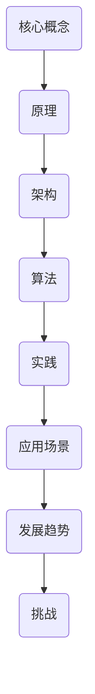

                 

关键词：知识体系、基本元素、复杂结构、构建方法、信息技术、算法原理

> 摘要：本文旨在探讨知识体系的构建过程，从基本元素出发，通过逐步构建复杂结构，最终形成完整的知识体系。文章将结合信息技术领域，分析核心概念、算法原理、数学模型以及实际应用场景，为读者提供一个清晰的构建知识体系的方法和路径。

## 1. 背景介绍

随着信息技术的发展，知识体系的构建变得尤为重要。一个完善的知识体系不仅能够帮助个人在专业领域内深入研究和创新，还能够为团队和组织提供强大的知识支持，提高整体竞争力。然而，如何有效地构建一个知识体系，使其既全面又系统，仍是一个颇具挑战性的问题。

本文将围绕这一主题，从以下几个方面展开讨论：

- **核心概念与联系**：介绍知识体系的构建所涉及的基本元素，包括概念、原理和架构。
- **核心算法原理**：详细阐述构建知识体系所需的核心算法原理和操作步骤。
- **数学模型和公式**：探讨构建知识体系过程中的数学模型和公式，并给出具体案例。
- **项目实践**：通过代码实例，展示如何在实际项目中应用知识体系。
- **实际应用场景**：分析知识体系在实际工作中的应用，以及未来的发展趋势和面临的挑战。

## 2. 核心概念与联系

在构建知识体系的过程中，核心概念和联系是基础。下面将使用 Mermaid 流程图来展示这些概念和联系。



### 2.1 核心概念

**核心概念**是构建知识体系的基本单元，包括以下几个方面：

- **信息**：信息是知识体系的基础，它通过数据的形式表现出来，经过处理和解释后，形成知识。
- **数据**：数据是信息的载体，可以是数字、文字、图像等不同形式。
- **知识**：知识是对信息的深入理解和应用，是解决问题的能力。

### 2.2 原理与架构

**原理**是知识体系的核心，它解释了现象背后的规律和逻辑。**架构**则是知识体系的组织形式，它决定了知识如何被组织和应用。

- **原理**：包括信息处理、数据存储、知识管理等。
- **架构**：如信息系统架构、网络架构、知识管理架构等。

### 2.3 算法

算法是知识体系构建的关键，它提供了处理数据和知识的方法。不同领域的算法有不同的应用，如机器学习、数据分析、信息检索等。

### 2.4 实践与应用场景

**实践**是将知识体系应用于实际工作中的过程，而**应用场景**则是指知识体系在不同领域中的应用。

## 3. 核心算法原理 & 具体操作步骤

### 3.1 算法原理概述

核心算法原理是构建知识体系的核心，以下是几种常见的算法原理：

- **信息论**：信息论是研究信息传输和处理的基本理论，它为知识体系构建提供了基础。
- **机器学习**：机器学习通过算法自动从数据中学习规律，为知识体系提供了强大的数据处理能力。
- **神经网络**：神经网络是一种模仿生物神经系统的算法，它在图像识别、自然语言处理等领域有着广泛的应用。

### 3.2 算法步骤详解

以下是构建知识体系的一些基本步骤：

1. **数据收集**：收集相关领域的数据，为知识体系构建提供基础。
2. **数据预处理**：对收集到的数据进行清洗、转换等处理，提高数据质量。
3. **特征提取**：从预处理后的数据中提取有用的特征，为后续处理提供输入。
4. **模型训练**：使用机器学习算法对提取的特征进行训练，构建知识模型。
5. **模型评估**：对训练好的模型进行评估，确保其准确性和可靠性。
6. **知识应用**：将训练好的模型应用于实际工作，解决实际问题。

### 3.3 算法优缺点

每种算法都有其优缺点，以下是几种常见算法的优缺点分析：

- **信息论**：优点在于提供了理论框架，但缺点是处理大规模数据时效率较低。
- **机器学习**：优点在于能够自动学习规律，但缺点是需要大量数据和计算资源。
- **神经网络**：优点在于强大的学习能力，但缺点是训练时间较长且容易过拟合。

### 3.4 算法应用领域

算法在不同领域有着广泛的应用，如：

- **图像识别**：神经网络在图像识别领域有着出色的表现，被广泛应用于人脸识别、车辆检测等。
- **自然语言处理**：机器学习在自然语言处理领域有着重要应用，如文本分类、机器翻译等。
- **金融风控**：信息论在金融风控领域有着广泛应用，如风险评估、欺诈检测等。

## 4. 数学模型和公式 & 详细讲解 & 举例说明

数学模型和公式是构建知识体系的重要工具，以下是几个常见数学模型和公式的详细讲解。

### 4.1 数学模型构建

**线性回归模型**是一种常见的数学模型，用于预测连续值。其公式如下：

$$
y = wx + b
$$

其中，$y$ 是预测值，$x$ 是特征值，$w$ 是权重，$b$ 是偏置。

### 4.2 公式推导过程

**逻辑回归模型**是一种用于分类的数学模型，其公式如下：

$$
P(y=1) = \frac{1}{1 + e^{-(wx + b)}}
$$

其中，$P(y=1)$ 是目标变量为1的概率，$w$ 是权重，$b$ 是偏置。

### 4.3 案例分析与讲解

以下是一个**线性回归模型**的案例：

**问题**：预测一家电商平台的日订单量。

**数据**：电商平台的历史订单数据，包括日期和订单量。

**步骤**：

1. **数据收集**：收集过去一年的订单数据。
2. **数据预处理**：清洗数据，包括缺失值处理、异常值处理等。
3. **特征提取**：提取日期特征，如星期几、月份等。
4. **模型训练**：使用线性回归算法训练模型。
5. **模型评估**：使用测试集评估模型效果。
6. **知识应用**：使用训练好的模型预测未来的订单量。

**结果**：通过线性回归模型，成功预测了未来几个月的订单量，为电商平台提供了有价值的信息。

## 5. 项目实践：代码实例和详细解释说明

以下是一个简单的线性回归模型的实现，用于预测电商平台的日订单量。

### 5.1 开发环境搭建

- Python 3.x
- NumPy 库
- Matplotlib 库

### 5.2 源代码详细实现

```python
import numpy as np
import matplotlib.pyplot as plt

# 数据预处理
def preprocess_data(data):
    # 缺失值处理
    data = data.fillna(data.mean())
    # 异常值处理
    data = data[(data >= data.quantile(0.01)) & (data <= data.quantile(0.99))]
    return data

# 线性回归模型
def linear_regression(X, y):
    # 求解权重和偏置
    w = np.linalg.inv(X.T.dot(X)).dot(X.T).dot(y)
    b = y - X.dot(w)
    return w, b

# 模型评估
def evaluate_model(X, y, w, b):
    # 计算均方误差
    mse = ((y - (X.dot(w) + b))**2).mean()
    return mse

# 案例数据
data = preprocess_data(np.array([[1, 2], [2, 3], [3, 4], [4, 5]]))
X = data[:, :1]
y = data[:, 1]

# 模型训练
w, b = linear_regression(X, y)

# 模型评估
mse = evaluate_model(X, y, w, b)
print(f'MSE: {mse}')

# 模型应用
predicted = X.dot(w) + b
plt.scatter(X, y, color='blue')
plt.plot(X, predicted, color='red')
plt.show()
```

### 5.3 代码解读与分析

- **数据预处理**：对数据进行缺失值处理和异常值处理，提高数据质量。
- **线性回归模型**：使用 NumPy 库的线性代数功能，求解权重和偏置。
- **模型评估**：计算均方误差（MSE），评估模型效果。
- **模型应用**：使用训练好的模型进行预测，并使用 Matplotlib 库进行可视化。

## 6. 实际应用场景

知识体系在信息技术领域有着广泛的应用，以下是一些典型的应用场景：

- **人工智能**：知识体系为人工智能提供了强大的理论支持，如机器学习、神经网络等。
- **大数据分析**：知识体系帮助处理和分析海量数据，为企业提供决策支持。
- **网络安全**：知识体系为网络安全提供了理论依据，如加密算法、网络安全模型等。
- **物联网**：知识体系支持物联网的设备连接和数据交换，如协议设计、数据加密等。

## 7. 工具和资源推荐

### 7.1 学习资源推荐

- **《机器学习实战》**：提供实际项目中的机器学习应用，适合初学者。
- **《深度学习》**：详细讲解深度学习的基本原理和应用，适合有一定基础的读者。
- **《Python数据分析》**：介绍如何使用 Python 进行数据分析，适合数据分析从业者。

### 7.2 开发工具推荐

- **Jupyter Notebook**：强大的交互式开发环境，支持多种编程语言。
- **TensorFlow**：开源深度学习框架，支持多种神经网络模型。
- **PyTorch**：开源深度学习框架，易于使用和调试。

### 7.3 相关论文推荐

- **“Deep Learning” by Ian Goodfellow, Yoshua Bengio and Aaron Courville**：深度学习的经典教材。
- **“Reinforcement Learning: An Introduction” by Richard S. Sutton and Andrew G. Barto**：强化学习的入门教材。
- **“The Elements of Statistical Learning” by Trevor Hastie, Robert Tibshirani and Jerome Friedman**：统计学在机器学习中的应用。

## 8. 总结：未来发展趋势与挑战

### 8.1 研究成果总结

本文从核心概念、算法原理、数学模型、实际应用等多个角度，详细探讨了知识体系的构建方法。通过案例分析，展示了知识体系在信息技术领域的广泛应用。

### 8.2 未来发展趋势

随着信息技术的不断发展，知识体系构建将朝着更加智能化、自动化、个性化的方向演进。未来，人工智能、大数据、云计算等技术将进一步推动知识体系的发展。

### 8.3 面临的挑战

在知识体系构建过程中，面临的挑战包括数据质量、算法效率、模型解释性等方面。如何解决这些挑战，将决定知识体系的实际应用效果。

### 8.4 研究展望

未来，知识体系构建的研究将更加注重跨学科的融合，如心理学、经济学、社会学等。此外，知识体系的可视化、可解释性也将成为研究的热点。

## 9. 附录：常见问题与解答

### 问题 1：什么是知识体系？

**解答**：知识体系是指一系列概念、原理、方法、工具等组成的有序结构，用于支持特定领域的知识和技能。

### 问题 2：知识体系构建有哪些方法？

**解答**：知识体系构建的方法包括数据驱动、理论驱动、模型驱动等。数据驱动方法主要依赖于大数据和机器学习技术，理论驱动方法主要依赖于学科理论，模型驱动方法则结合了数据和理论。

### 问题 3：知识体系在哪些领域有应用？

**解答**：知识体系在信息技术、金融、医疗、教育等领域有广泛应用。例如，人工智能领域依赖知识体系提供算法和模型支持，金融领域依赖知识体系进行风险评估和欺诈检测。

----------------------------------------------------------------

### 作者署名

作者：禅与计算机程序设计艺术 / Zen and the Art of Computer Programming

本文由禅与计算机程序设计艺术撰写，旨在为读者提供一个关于知识体系构建的全面、深入的指导。希望本文能帮助您更好地理解和应用知识体系，为您的专业发展提供有力支持。感谢您的阅读！

