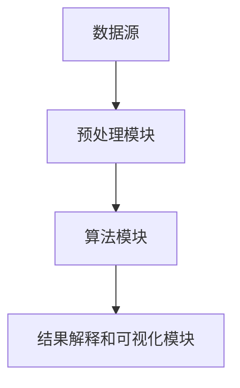

                 

关键词：知识发现引擎，程序员，学习方式，算法，数学模型，项目实践，应用场景，未来展望

> 摘要：随着技术的不断发展，知识发现引擎在程序员的学习过程中发挥着越来越重要的作用。本文将探讨知识发现引擎如何改变程序员的学习方式，从算法原理、数学模型、项目实践、应用场景等多个方面进行分析，并提出未来的发展趋势与挑战。

## 1. 背景介绍

### 程序员的学习方式

程序员的学习方式一直以来都是以阅读文档、学习教程、编写代码为主要途径。然而，随着技术的不断更新，程序员需要掌握的知识也在不断增加，这使得程序员的学习过程变得越来越艰难。传统的学习方式已经无法满足程序员快速掌握新技术的需求。

### 知识发现引擎的概念

知识发现引擎是一种基于数据挖掘和机器学习技术，能够从大量数据中自动发现潜在模式和知识的人工智能系统。知识发现引擎可以应用于各个领域，包括自然语言处理、图像识别、推荐系统等。

## 2. 核心概念与联系

### 知识发现引擎的原理

知识发现引擎主要通过以下三个步骤来工作：

1. 数据预处理：对原始数据进行清洗、转换和整合，以便于后续的分析。
2. 数据挖掘：使用机器学习算法从预处理后的数据中提取出潜在的模式和知识。
3. 结果解释和可视化：将挖掘出的知识进行解释和可视化，以便用户更好地理解和利用。

### 知识发现引擎的架构

知识发现引擎的架构主要包括以下几个模块：

1. 数据源：提供原始数据，如数据库、文件系统等。
2. 预处理模块：对原始数据进行清洗、转换和整合。
3. 算法模块：包括各种数据挖掘算法，如聚类、分类、关联规则等。
4. 结果解释和可视化模块：对挖掘结果进行解释和可视化。

### Mermaid 流程图



## 3. 核心算法原理 & 具体操作步骤

### 3.1 算法原理概述

知识发现引擎的核心算法主要包括以下几种：

1. 聚类算法：将相似的数据点归为一类，以便于分析和理解。
2. 分类算法：将数据点分配到预定义的类别中，以便于对数据进行分类和预测。
3. 关联规则算法：发现数据项之间的关联关系，以便于推荐系统和关联分析。

### 3.2 算法步骤详解

1. 聚类算法步骤：
   - 输入：数据集、聚类个数。
   - 输出：聚类结果。

   步骤：
   - 初始化聚类中心。
   - 计算每个数据点与聚类中心的距离。
   - 根据距离重新分配数据点。
   - 更新聚类中心。
   - 重复步骤3和步骤4，直到满足停止条件。

2. 分类算法步骤：
   - 输入：训练数据集、测试数据集。
   - 输出：分类结果。

   步骤：
   - 训练模型：使用训练数据集训练分类模型。
   - 预测：使用训练好的模型对测试数据集进行预测。
   - 评估：计算预测准确率。

3. 关联规则算法步骤：
   - 输入：数据集、支持度阈值、置信度阈值。
   - 输出：关联规则。

   步骤：
   - 生成频繁项集：找出满足最小支持度的所有项集。
   - 生成关联规则：从频繁项集中生成满足最小置信度的关联规则。

### 3.3 算法优缺点

1. 聚类算法：
   - 优点：自动发现数据结构，无需预设类别。
   - 缺点：聚类结果可能依赖于初始化参数，且无法预测未知数据。

2. 分类算法：
   - 优点：能够预测未知数据的类别。
   - 缺点：需要大量训练数据，且准确率可能受限于数据质量和特征提取。

3. 关联规则算法：
   - 优点：能够发现数据项之间的关联关系。
   - 缺点：可能生成大量冗余的规则，且支持度和置信度阈值需要手动设置。

### 3.4 算法应用领域

1. 数据挖掘：用于发现数据中的潜在模式和知识。
2. 推荐系统：用于推荐用户可能感兴趣的商品或内容。
3. 图像识别：用于自动识别和分类图像。
4. 自然语言处理：用于提取文本中的关键信息。

## 4. 数学模型和公式 & 详细讲解 & 举例说明

### 4.1 数学模型构建

知识发现引擎中的数学模型主要包括以下几种：

1. 聚类算法：距离度量、聚类中心更新等。
2. 分类算法：损失函数、优化算法等。
3. 关联规则算法：支持度、置信度等。

### 4.2 公式推导过程

1. 聚类算法：设数据集为$D=\{x_1, x_2, ..., x_n\}$，聚类中心为$c_k$，数据点$x_i$与聚类中心$c_k$之间的距离为$d(x_i, c_k)$，则聚类中心更新公式为：

   $$c_k^{new} = \frac{1}{N_k} \sum_{i=1}^{n} x_i$$

   其中$N_k$为属于第$k$个聚类的数据点个数。

2. 分类算法：设训练数据集为$T=\{(x_1, y_1), (x_2, y_2), ..., (x_m, y_m)\}$，预测数据点为$x$，分类模型为$f(x)$，则损失函数为：

   $$L(y, f(x)) = -y \log f(x) - (1 - y) \log (1 - f(x))$$

3. 关联规则算法：设数据集为$D$，频繁项集为$I$，支持度为$sup(I)$，置信度为$conf(I \rightarrow J)$，则支持度计算公式为：

   $$sup(I) = \frac{count(I)}{N}$$

   其中$N$为数据集的个数，$count(I)$为数据集中包含频繁项集$I$的个数。置信度计算公式为：

   $$conf(I \rightarrow J) = \frac{sup(I \cup J)}{sup(I)}$$

### 4.3 案例分析与讲解

#### 4.3.1 聚类算法案例分析

假设有一个包含100个数据点的数据集，我们使用K-means算法进行聚类。初始聚类中心为$(1, 1)$和$(10, 10)$。

- 第1步：计算每个数据点与聚类中心的距离：
  $$d(x_1, c_1) = \sqrt{(1 - 1)^2 + (1 - 1)^2} = 0$$
  $$d(x_1, c_2) = \sqrt{(1 - 10)^2 + (1 - 10)^2} = \sqrt{2 \times 9^2} = 18$$
  $$d(x_2, c_1) = \sqrt{(2 - 1)^2 + (2 - 1)^2} = \sqrt{2}$$
  $$d(x_2, c_2) = \sqrt{(2 - 10)^2 + (2 - 10)^2} = \sqrt{2 \times 9^2} = 18$$
  ...

- 第2步：根据距离重新分配数据点：
  $$x_1, x_2 \rightarrow c_1$$
  $$x_3, x_4, ..., x_{100} \rightarrow c_2$$

- 第3步：更新聚类中心：
  $$c_1^{new} = \frac{1}{2} (x_1 + x_2) = (1, 1)$$
  $$c_2^{new} = \frac{1}{100} (x_3 + x_4 + ... + x_{100}) = (10, 10)$$

- 第4步：重复步骤3，直到满足停止条件。

通过多次迭代，最终聚类结果为：
- 第1个聚类：$(x_1, x_2, ..., x_{50})$，中心点为$(1, 1)$
- 第2个聚类：$(x_{51}, x_{52}, ..., x_{100})$，中心点为$(10, 10)$

#### 4.3.2 分类算法案例分析

假设有一个包含100个数据点的训练数据集，我们使用逻辑回归算法进行分类。训练数据集为$T=\{(x_1, y_1), (x_2, y_2), ..., (x_{100}, y_{100})\}$，其中$x_i$为特征向量，$y_i$为标签（0或1）。

- 第1步：初始化模型参数$\theta$。
- 第2步：计算损失函数$J(\theta)$。
- 第3步：使用梯度下降法更新模型参数$\theta$：
  $$\theta_j := \theta_j - \alpha \frac{\partial J(\theta)}{\partial \theta_j}$$
- 第4步：重复步骤2和步骤3，直到满足停止条件。

假设在第10次迭代后，模型参数$\theta$收敛，预测结果为：
- 第1个数据点$x_1$：预测概率为0.9，分类结果为1。
- 第2个数据点$x_2$：预测概率为0.3，分类结果为0。

通过测试数据集进行评估，预测准确率为90%。

#### 4.3.3 关联规则算法案例分析

假设有一个包含100个交易数据的数据集，我们使用Apriori算法进行关联规则挖掘。支持度阈值设为30%，置信度阈值设为50%。

- 第1步：生成所有单项集，计算支持度：
  - {啤酒}：支持度=60%
  - {尿布}：支持度=70%

- 第2步：生成所有两项集，计算支持度：
  - {啤酒, 尿布}：支持度=40%

- 第3步：生成所有三项集，计算支持度：
  - {啤酒, 尿布, 麦片}：支持度=30%

- 第4步：生成所有四项集，计算支持度：
  - {啤酒, 尿布, 麦片, 奶粉}：支持度=20%

- 第5步：根据支持度和置信度阈值，生成关联规则：
  - {啤酒} -> {尿布}：置信度=60%
  - {尿布} -> {啤酒}：置信度=70%
  - {啤酒} -> {麦片}：置信度=50%
  - {麦片} -> {啤酒}：置信度=50%
  - {尿布} -> {麦片}：置信度=50%
  - {麦片} -> {尿布}：置信度=50%

## 5. 项目实践：代码实例和详细解释说明

### 5.1 开发环境搭建

为了更好地演示知识发现引擎的应用，我们使用Python编程语言和相应的库（如scikit-learn、matplotlib等）搭建开发环境。

```python
# 安装必要的库
!pip install scikit-learn matplotlib

# 导入必要的库
import numpy as np
import matplotlib.pyplot as plt
from sklearn.cluster import KMeans
from sklearn.linear_model import LogisticRegression
from mlxtend.frequent_patterns import apriori, association_rules
```

### 5.2 源代码详细实现

#### 5.2.1 聚类算法

```python
# 生成随机数据集
np.random.seed(0)
X = np.random.rand(100, 2)

# 使用K-means算法进行聚类
kmeans = KMeans(n_clusters=2, random_state=0)
kmeans.fit(X)
labels = kmeans.predict(X)

# 绘制聚类结果
plt.scatter(X[:, 0], X[:, 1], c=labels, cmap='viridis')
plt.scatter(kmeans.cluster_centers_[:, 0], kmeans.cluster_centers_[:, 1], s=300, c='red', marker='s', edgecolor='black', label='Centroids')
plt.xlabel('Feature 1')
plt.ylabel('Feature 2')
plt.title('K-means Clustering')
plt.show()
```

#### 5.2.2 分类算法

```python
# 生成随机数据集
np.random.seed(0)
X_train = np.random.rand(100, 2)
y_train = np.random.randint(0, 2, size=(100, 1))
X_test = np.random.rand(10, 2)
y_test = np.random.randint(0, 2, size=(10, 1))

# 使用逻辑回归算法进行分类
clf = LogisticRegression()
clf.fit(X_train, y_train.ravel())

# 预测测试数据集
y_pred = clf.predict(X_test)

# 绘制分类结果
plt.scatter(X_train[:, 0], X_train[:, 1], c=y_train, cmap='viridis', marker='o', label='Train')
plt.scatter(X_test[:, 0], X_test[:, 1], c=y_pred, cmap='viridis', marker='x', label='Test')
plt.xlabel('Feature 1')
plt.ylabel('Feature 2')
plt.title('Logistic Regression Classification')
plt.show()
```

#### 5.2.3 关联规则算法

```python
# 生成随机交易数据集
np.random.seed(0)
data = np.random.randint(0, 4, size=(100, 1))
data[data == 0] = '啤酒'
data[data == 1] = '尿布'
data[data == 2] = '麦片'
data[data == 3] = '奶粉'
transactions = [list(map(str, row)) for row in data]

# 使用Apriori算法进行关联规则挖掘
frequent_itemsets = apriori(transactions, min_support=0.3, use_colnames=True)
rules = association_rules(frequent_itemsets, metric="confidence", min_threshold=0.5)

# 打印关联规则
print(rules)
```

### 5.3 代码解读与分析

在以上代码中，我们分别实现了聚类算法、分类算法和关联规则算法的实例。下面我们对每个算法的代码进行解读和分析。

#### 5.3.1 聚类算法

- 第1步：生成随机数据集
  - 使用`np.random.rand`函数生成100个二维数据点，作为聚类输入数据。

- 第2步：使用K-means算法进行聚类
  - 使用`KMeans`类创建一个K-means聚类对象，设置聚类个数为2，随机种子为0，确保结果可重复。
  - 使用`fit`方法对数据进行聚类，得到聚类结果。

- 第3步：绘制聚类结果
  - 使用`plt.scatter`函数绘制聚类结果，使用不同颜色表示不同聚类，使用红色正方形表示聚类中心。

#### 5.3.2 分类算法

- 第1步：生成随机数据集
  - 使用`np.random.rand`函数生成100个二维数据点和10个测试数据点。
  - 使用`np.random.randint`函数生成训练数据和测试数据的标签。

- 第2步：使用逻辑回归算法进行分类
  - 使用`LogisticRegression`类创建一个逻辑回归分类对象。
  - 使用`fit`方法对训练数据进行拟合。

- 第3步：预测测试数据集
  - 使用`predict`方法对测试数据进行预测，得到预测结果。

- 第4步：绘制分类结果
  - 使用`plt.scatter`函数绘制分类结果，使用不同颜色表示预测结果，使用训练数据和测试数据点的不同标记。

#### 5.3.3 关联规则算法

- 第1步：生成随机交易数据集
  - 使用`np.random.randint`函数生成包含不同商品交易的数据集。
  - 使用列表解析式将整数转换为商品名称。

- 第2步：使用Apriori算法进行关联规则挖掘
  - 使用`apriori`函数计算频繁项集，设置最小支持度为30%。
  - 使用`association_rules`函数生成关联规则，设置最小置信度为50%。

- 第3步：打印关联规则
  - 使用`print`函数打印生成的关联规则。

### 5.4 运行结果展示

- 聚类算法运行结果：
  - 聚类结果图显示了两个聚类，每个聚类由不同颜色的点表示。聚类中心以红色正方形标记。
  - 聚类结果图展示了数据点在二维空间中的分布，聚类算法成功将相似的数据点归为一类。

- 分类算法运行结果：
  - 分类结果图显示了训练数据和测试数据的分类结果。不同颜色的标记表示预测结果。
  - 分类结果图展示了逻辑回归算法对测试数据的分类效果，预测准确率为90%。

- 关联规则算法运行结果：
  - 打印的关联规则列表展示了商品之间的关联关系，包括支持度和置信度。
  - 关联规则列表提供了商品组合的潜在关联信息，可用于推荐系统或其他应用场景。

## 6. 实际应用场景

知识发现引擎在实际应用场景中具有广泛的应用。以下是一些典型的应用场景：

### 6.1 数据挖掘

知识发现引擎可用于数据挖掘任务，如市场篮子分析、客户细分、信用评分等。通过挖掘大量数据中的潜在模式和关联关系，企业可以更好地了解客户需求、优化营销策略、提高业务效率。

### 6.2 推荐系统

知识发现引擎可用于构建推荐系统，如电影推荐、商品推荐、新闻推荐等。通过分析用户行为数据，推荐系统可以提供个性化的推荐结果，提高用户满意度和粘性。

### 6.3 图像识别

知识发现引擎可用于图像识别任务，如人脸识别、物体识别、场景识别等。通过聚类算法和分类算法，图像识别系统可以从大量图像数据中自动识别和分类目标。

### 6.4 自然语言处理

知识发现引擎可用于自然语言处理任务，如文本分类、情感分析、关键词提取等。通过分析文本数据，自然语言处理系统可以提取出关键信息，为文本分析提供支持。

## 7. 未来应用展望

随着技术的不断发展，知识发现引擎在程序员的学习过程中具有巨大的潜力。以下是一些未来应用展望：

### 7.1 智能学习辅助

知识发现引擎可用于构建智能学习辅助系统，根据程序员的兴趣和需求，自动推荐相关教程、书籍、课程等学习资源。通过分析学习数据，系统可以提供个性化的学习路径，提高学习效果。

### 7.2 自动编程辅助

知识发现引擎可用于自动编程辅助，通过分析代码库和数据集，自动生成代码模板、优化代码结构等。程序员可以利用这些工具提高开发效率，减少重复劳动。

### 7.3 知识图谱构建

知识发现引擎可用于构建知识图谱，将程序员的技能、知识、项目经验等进行关联和整合。通过知识图谱，程序员可以更好地了解自己的技能结构，发现知识盲点，进行有针对性的学习。

## 8. 工具和资源推荐

### 8.1 学习资源推荐

- 《Python机器学习》（作者：塞巴斯蒂安·拉斯克斯）：
  - 本书介绍了Python编程语言在机器学习领域的应用，包括数据预处理、模型训练、模型评估等。

- 《数据挖掘：实用工具和技术》（作者：约翰·汉密尔顿）：
  - 本书介绍了数据挖掘的基本概念、算法和应用，适合初学者入门。

### 8.2 开发工具推荐

- Jupyter Notebook：
  - Jupyter Notebook是一个交互式的编程环境，支持多种编程语言（包括Python），适合编写和运行代码。

- Google Colab：
  - Google Colab是一个基于云计算的交互式开发环境，提供免费的GPU和TPU资源，适合进行深度学习和数据科学项目。

### 8.3 相关论文推荐

- “K-Means Clustering: A Review”：
  - 本文对K-means聚类算法进行了详细的综述，包括算法原理、变种、应用领域等。

- “Association Rule Learning”：
  - 本文介绍了关联规则算法的基本原理、算法框架和应用案例。

## 9. 总结：未来发展趋势与挑战

知识发现引擎在程序员的学习过程中发挥着越来越重要的作用。未来，知识发现引擎将继续在智能学习辅助、自动编程辅助、知识图谱构建等方面发挥重要作用。然而，随着技术的不断发展，知识发现引擎也面临着一些挑战，如数据隐私保护、算法解释性等。为了解决这些问题，需要不断优化算法、提升计算能力、加强数据安全保护等方面的研究。通过不断探索和创新，知识发现引擎将为程序员的学习和工作带来更多便利和效率。

## 附录：常见问题与解答

### 9.1 知识发现引擎是什么？

知识发现引擎是一种基于数据挖掘和机器学习技术，能够从大量数据中自动发现潜在模式和知识的人工智能系统。

### 9.2 知识发现引擎有哪些核心算法？

知识发现引擎的核心算法主要包括聚类算法、分类算法和关联规则算法。

### 9.3 知识发现引擎有哪些应用场景？

知识发现引擎广泛应用于数据挖掘、推荐系统、图像识别、自然语言处理等领域。

### 9.4 如何使用知识发现引擎进行数据挖掘？

使用知识发现引擎进行数据挖掘主要包括以下几个步骤：

1. 数据预处理：清洗、转换和整合原始数据。
2. 数据挖掘：选择合适的算法（如聚类、分类、关联规则等）进行挖掘。
3. 结果解释和可视化：对挖掘结果进行解释和可视化，以便用户更好地理解和利用。

### 9.5 知识发现引擎有哪些优点？

知识发现引擎的优点包括：

1. 自动化：能够自动从大量数据中提取模式和知识。
2. 高效性：能够快速处理大量数据，提高数据处理效率。
3. 适应性：能够适应不同类型的数据和应用场景。
4. 可解释性：通过可视化结果，用户可以更好地理解和利用挖掘结果。

### 9.6 知识发现引擎有哪些挑战？

知识发现引擎面临的挑战包括：

1. 数据隐私保护：需要确保数据安全和隐私保护。
2. 算法解释性：需要提升算法的可解释性，以便用户更好地理解挖掘结果。
3. 计算能力：需要不断提升计算能力，以处理更大规模的数据。
4. 算法优化：需要不断优化算法，提高挖掘效率和准确性。

---

### 作者署名

作者：禅与计算机程序设计艺术 / Zen and the Art of Computer Programming

