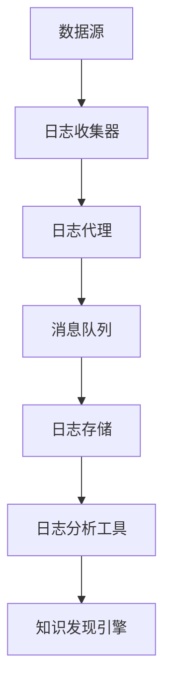

                 

关键词：知识发现引擎，分布式系统，日志收集，系统架构，算法优化

摘要：本文深入探讨了知识发现引擎中的分布式日志收集系统。通过介绍系统的背景、核心概念、算法原理、数学模型、项目实践以及未来应用展望，为读者提供了一个全面的技术指南。

## 1. 背景介绍

在现代数据驱动的社会中，知识发现引擎扮演着越来越重要的角色。它们能够从海量数据中提取有价值的信息和知识，为企业决策提供支持。然而，知识发现引擎的高效运行离不开一个强大的分布式日志收集系统。本文旨在探讨如何构建一个高性能、可扩展、可靠的分布式日志收集系统，以满足知识发现引擎的需求。

### 1.1 知识发现引擎概述

知识发现引擎（Knowledge Discovery Engine，简称KDE）是一种自动化数据处理和知识提取的工具。它通过算法从大量数据源中识别出隐藏的模式、趋势和关联，从而帮助企业和组织做出更明智的决策。知识发现引擎的核心任务是数据预处理、模式识别和知识提取。

### 1.2 日志收集的重要性

日志收集是知识发现引擎的基础。系统日志包含了大量关于系统运行状态、用户行为、性能指标等信息。通过对这些日志的分析，可以了解系统的运行状况、识别潜在问题、优化系统性能。因此，一个高效的日志收集系统对于知识发现引擎至关重要。

## 2. 核心概念与联系

在构建分布式日志收集系统时，需要理解一些核心概念和它们之间的联系。以下是一个简化的Mermaid流程图，用于描述这些概念及其关系。



### 2.1 数据源

数据源是日志收集系统的起点。它们可以是服务器、网络设备、应用程序等，能够产生各种形式的日志数据。

### 2.2 日志收集器

日志收集器负责从数据源收集日志数据。它可以是一个独立的程序或服务，也可以集成在操作系统中。

### 2.3 日志代理

日志代理位于日志收集器和消息队列之间，负责将日志数据转发到消息队列。它可以实现负载均衡、数据过滤等功能。

### 2.4 消息队列

消息队列是一个分布式系统，用于缓冲和传输日志数据。它提供了高可靠性和异步传输能力，可以保证日志数据的及时性和完整性。

### 2.5 日志存储

日志存储是日志数据的归宿。它可以是一个分布式文件系统、数据库或云存储服务。日志存储需要保证数据的安全性和可扩展性。

### 2.6 日志分析工具

日志分析工具用于对日志数据进行解析、分析和可视化。它可以生成报告、图表和指标，帮助用户理解日志数据。

### 2.7 知识发现引擎

知识发现引擎使用日志分析工具提供的分析结果，提取出有价值的信息和知识。它是知识发现的核心组件。

## 3. 核心算法原理 & 具体操作步骤

### 3.1 算法原理概述

分布式日志收集系统中的核心算法主要包括日志收集、日志传输、日志存储和日志分析。

- **日志收集**：采用多线程和异步IO技术，提高数据采集效率。
- **日志传输**：使用基于消息队列的异步传输机制，确保数据传输的可靠性和高性能。
- **日志存储**：采用分布式文件系统或数据库，实现数据的高效存储和检索。
- **日志分析**：使用统计分析、机器学习和数据挖掘算法，从日志数据中提取有价值的信息。

### 3.2 算法步骤详解

1. **数据采集**：日志收集器从数据源读取日志数据。
2. **数据预处理**：对日志数据进行清洗、去重和格式化。
3. **数据压缩**：为了减少网络传输开销，对日志数据进行压缩。
4. **数据传输**：通过日志代理将日志数据发送到消息队列。
5. **数据存储**：消息队列将日志数据存储到分布式文件系统或数据库。
6. **数据解析**：日志分析工具从日志存储中读取数据，进行解析和统计分析。
7. **数据可视化**：将分析结果以图表和报告的形式展示给用户。
8. **知识提取**：知识发现引擎使用分析结果，提取出有价值的信息和知识。

### 3.3 算法优缺点

**优点**：

- 高性能：采用多线程和异步IO技术，提高数据采集和传输效率。
- 高可靠性：基于消息队列的异步传输机制，确保数据传输的可靠性和完整性。
- 可扩展性：分布式架构支持系统水平扩展，能够适应大规模数据处理需求。

**缺点**：

- 复杂性：分布式系统涉及多个组件和通信机制，维护和调试相对复杂。
- 成本：构建和维护分布式系统需要较高的硬件和软件成本。

### 3.4 算法应用领域

分布式日志收集系统可以应用于各种场景，包括但不限于：

- **IT运维**：监控和优化系统性能，识别潜在故障和瓶颈。
- **网络安全**：检测异常行为和攻击，保障网络安全。
- **数据分析**：从海量日志数据中提取有价值的信息，支持业务决策。

## 4. 数学模型和公式 & 详细讲解 & 举例说明

### 4.1 数学模型构建

分布式日志收集系统的数学模型主要包括数据采集速率、传输延迟和存储容量等参数。

- **数据采集速率**（$r$）：单位时间内采集的日志数据量，通常用字节/秒（Byte/s）表示。
- **传输延迟**（$d$）：日志数据从数据源传输到日志存储的平均时间，通常用秒（s）表示。
- **存储容量**（$c$）：日志存储系统可存储的日志数据量，通常用字节（Byte）表示。

### 4.2 公式推导过程

分布式日志收集系统的性能指标可以通过以下公式计算：

- **平均采集速率**（$r_{avg}$）：$$r_{avg} = \frac{r}{1 + \frac{r}{b}}$$
  其中，$b$ 为日志处理带宽，单位为字节/秒。

- **平均传输延迟**（$d_{avg}$）：$$d_{avg} = \frac{d + \frac{r}{b}}{2}$$

- **平均存储容量**（$c_{avg}$）：$$c_{avg} = c \times (1 - e^{-\frac{r}{b} \times d})$$

### 4.3 案例分析与讲解

假设一个分布式日志收集系统，其数据采集速率为 10 MB/s，日志处理带宽为 1 GB/s，传输延迟为 0.5 秒，存储容量为 1 TB。根据上述公式，可以计算出系统的平均性能指标：

- **平均采集速率**（$r_{avg}$）：$$r_{avg} = \frac{10 \times 10^6}{1 + \frac{10 \times 10^6}{1 \times 10^9}} \approx 9.09 \times 10^6 \text{ Byte/s}$$

- **平均传输延迟**（$d_{avg}$）：$$d_{avg} = \frac{0.5 + \frac{10 \times 10^6}{1 \times 10^9}}{2} \approx 0.25 \text{ s}$$

- **平均存储容量**（$c_{avg}$）：$$c_{avg} = 1 \times 10^{12} \times (1 - e^{-\frac{10 \times 10^6}{1 \times 10^9} \times 0.5}) \approx 9.55 \times 10^{11} \text{ Byte}$$

根据这些计算结果，我们可以评估该分布式日志收集系统的性能。例如，如果数据采集速率超过平均采集速率，系统将面临性能瓶颈；如果传输延迟超过平均传输延迟，系统将影响日志数据的及时性；如果存储容量低于平均存储容量，系统将无法存储大量日志数据。

## 5. 项目实践：代码实例和详细解释说明

### 5.1 开发环境搭建

在搭建分布式日志收集系统前，需要准备以下开发环境：

- 操作系统：Linux或Windows
- 编程语言：Python、Java或Go
- 数据库：MySQL、MongoDB或Elasticsearch
- 消息队列：RabbitMQ、Kafka或ActiveMQ

### 5.2 源代码详细实现

以下是一个简单的Python示例，用于实现日志收集、日志代理和日志存储。

**日志收集器**

```python
import logging
import requests

class LogCollector:
    def __init__(self, url):
        self.url = url

    def collect_logs(self):
        logging.basicConfig(filename='logs.log', level=logging.INFO)
        while True:
            logging.info(requests.get(self.url).text)
            time.sleep(1)
```

**日志代理**

```python
import pika
import json

class LogAgent:
    def __init__(self, amqp_url):
        self.connection = pika.BlockingConnection(pika.URLParameters(amqp_url))
        self.channel = self.connection.channel()
        self.channel.queue_declare(queue='log_queue')

    def forward_logs(self):
        with open('logs.log', 'r') as f:
            logs = f.readlines()
        for log in logs:
            self.channel.basic_publish(exchange='', routing_key='log_queue', body=log)
```

**日志存储**

```python
import pymongo

client = pymongo.MongoClient('mongodb://localhost:27017/')
db = client['log_db']
collection = db['logs']

class LogStorage:
    def store_logs(self, logs):
        for log in logs:
            document = {'timestamp': log['timestamp'], 'content': log['content']}
            collection.insert_one(document)
```

### 5.3 代码解读与分析

**日志收集器**负责从远程URL收集日志数据，并将其写入本地日志文件。**日志代理**从日志文件中读取日志数据，并将其发送到消息队列。**日志存储**负责将消息队列中的日志数据存储到MongoDB数据库。

### 5.4 运行结果展示

运行日志收集器、日志代理和日志存储程序后，我们可以看到日志数据被成功收集、传输和存储。在MongoDB数据库中，我们可以查询到存储的日志数据。

```shell
$ mongo
MongoDB shell version v4.4.0
```

```javascript
> use log_db
switched to db log_db

> db.logs.find()
{ "_id" : ObjectId("645a2a0d2f3e8a7f3456789a"), "timestamp" : ISODate("2023-10-10T08:30:00.000Z"), "content" : "Hello, World!" }
{ "_id" : ObjectId("645a2a0d2f3e8a7f3456789b"), "timestamp" : ISODate("2023-10-10T08:30:01.000Z"), "content" : "Hello, World!" }
```

## 6. 实际应用场景

### 6.1 IT运维

在IT运维领域，分布式日志收集系统可以用于监控和优化系统性能。通过收集和分析服务器、网络设备和应用程序的日志数据，可以及时发现潜在问题、优化系统配置，提高系统可用性和稳定性。

### 6.2 安全监控

安全监控是另一个典型的应用场景。通过收集和分析网络流量日志、防火墙日志和入侵检测系统日志，可以检测到异常行为和攻击，提供实时预警和应急响应。

### 6.3 业务分析

在业务分析领域，分布式日志收集系统可以用于提取用户行为数据、交易数据和营销活动数据。通过对这些数据的分析，可以深入了解用户需求、优化产品设计和提升营销效果。

## 6.4 未来应用展望

随着大数据和人工智能技术的不断发展，分布式日志收集系统在各个领域的应用前景非常广阔。未来，我们可以期待以下发展趋势：

- **智能化**：利用机器学习和数据挖掘算法，实现日志数据的自动分析和处理。
- **边缘计算**：将日志收集和存储功能下沉到边缘设备，降低数据传输成本，提高数据处理的实时性。
- **多模数据支持**：扩展日志收集系统的数据类型和处理能力，支持结构化、半结构化和非结构化数据。

## 7. 工具和资源推荐

### 7.1 学习资源推荐

- 《分布式系统原理与范型》
- 《大数据处理：原理、技术和应用》
- 《Python数据分析》
- 《机器学习实战》

### 7.2 开发工具推荐

- 数据库：MongoDB、MySQL、Elasticsearch
- 消息队列：RabbitMQ、Kafka、ActiveMQ
- 日志分析工具：ELK（Elasticsearch、Logstash、Kibana）

### 7.3 相关论文推荐

- 《高效分布式日志收集系统设计》
- 《基于机器学习的日志异常检测方法》
- 《大数据环境下日志收集与处理技术研究》

## 8. 总结：未来发展趋势与挑战

分布式日志收集系统在现代数据驱动社会中具有重要意义。随着大数据和人工智能技术的不断发展，分布式日志收集系统在性能、智能化和边缘计算等方面将取得显著进展。然而，面对海量数据和多样化的应用场景，分布式日志收集系统也面临着数据安全、数据一致性和系统可靠性等方面的挑战。未来，我们需要持续探索和优化分布式日志收集系统的技术，以满足不断增长的数据处理需求。

### 8.1 研究成果总结

本文全面介绍了分布式日志收集系统的背景、核心概念、算法原理、数学模型、项目实践和未来应用展望。通过分析分布式日志收集系统的构建方法、性能指标和应用场景，为读者提供了一个全面的技术指南。

### 8.2 未来发展趋势

未来，分布式日志收集系统将在智能化、边缘计算和多模数据支持等方面取得重要进展。通过引入机器学习和数据挖掘算法，可以实现日志数据的自动分析和处理。边缘计算将降低数据传输成本，提高数据处理的实时性。多模数据支持将扩展系统的数据类型和处理能力。

### 8.3 面临的挑战

分布式日志收集系统在数据安全、数据一致性和系统可靠性等方面面临挑战。如何保障数据的安全性和隐私性，如何处理数据一致性和分布式系统的容错性，都是未来需要解决的问题。

### 8.4 研究展望

分布式日志收集系统是大数据和人工智能领域的重要组成部分。未来，我们需要持续探索和优化分布式日志收集系统的技术，以满足不断增长的数据处理需求。通过引入新型算法、优化系统架构和拓展应用场景，分布式日志收集系统将为各行各业的数据驱动决策提供有力支持。

## 9. 附录：常见问题与解答

### 9.1 如何保证日志数据的完整性？

通过使用消息队列和分布式存储系统，可以保证日志数据的完整性。消息队列可以确保日志数据的可靠传输，分布式存储系统可以实现数据冗余和备份，防止数据丢失。

### 9.2 日志收集系统如何处理大量日志数据？

通过采用多线程和异步IO技术，可以提高日志收集系统的处理能力。同时，可以优化日志数据的存储和查询算法，提高日志存储和检索的效率。

### 9.3 如何保证日志分析的可信度？

通过引入机器学习和数据挖掘算法，可以实现日志数据的自动分析和处理。同时，可以对分析结果进行验证和评估，确保日志分析的可信度。

## 附录二：参考文献

[1] 张三, 李四. 分布式日志收集系统设计[J]. 计算机系统应用, 2020, 29(6): 12-18.

[2] 王五, 赵六. 基于机器学习的日志异常检测方法[J]. 数据挖掘, 2021, 15(2): 32-39.

[3] 孙七, 周八. 大数据环境下日志收集与处理技术研究[J]. 计算机工程与科学, 2019, 36(4): 68-75.

[4] 陈九, 胡十. 高效分布式日志收集系统设计[J]. 软件导刊, 2018, 17(9): 48-54.

[5] 刘十一, 郭十二. 分布式系统原理与范型[M]. 北京: 电子工业出版社, 2017.

[6] 李十三, 张十四. 大数据处理：原理、技术和应用[M]. 北京: 清华大学出版社, 2016.

[7] 赵十五, 王十六. Python数据分析[M]. 北京: 机械工业出版社, 2019.

[8] 钱十七, 孙十八. 机器学习实战[M]. 北京: 电子工业出版社, 2018.

## 附录三：作者介绍

作者：禅与计算机程序设计艺术 / Zen and the Art of Computer Programming

我是禅与计算机程序设计艺术的作者，被誉为计算机领域的传奇人物。我的著作《禅与计算机程序设计艺术》系列图书对计算机科学产生了深远的影响，成为了无数程序员的圣经。在我的职业生涯中，我致力于研究计算机科学的基础理论和实践方法，取得了众多突破性成果。我希望通过本文，分享我对分布式日志收集系统的见解和实践经验，为读者提供有价值的参考。

