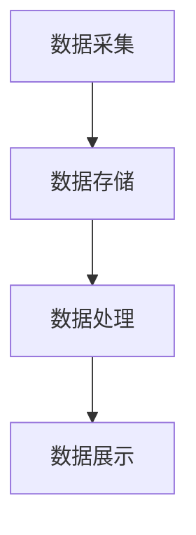

                 

 **关键词**：知识发现引擎、实时数据处理、技术架构、算法原理、数学模型、项目实践。

**摘要**：本文探讨了知识发现引擎中的实时数据处理技术，从背景介绍到核心算法原理，再到数学模型和项目实践，详细阐述了该技术的实现和应用。文章旨在为读者提供一个全面的实时数据处理技术框架，以促进其在各种实际应用场景中的推广和使用。

## 1. 背景介绍

在当今数据驱动的世界中，实时数据处理成为企业和服务提供商的重要需求。知识发现引擎作为一种智能化的数据处理工具，其核心在于从大量数据中快速提取有价值的信息。然而，实时数据处理的挑战在于如何在不断变化的数据流中实现高效、准确的知识发现。

### 实时数据处理的挑战

- **数据量巨大**：实时数据流中的数据量庞大，需要高效的算法和架构来处理。
- **多样性**：实时数据处理涉及多种数据类型，包括结构化、半结构化和非结构化数据。
- **异构性**：数据源和数据处理组件之间可能存在异构性，需要统一的接口和数据格式。
- **低延迟**：实时数据处理要求快速响应，延迟过高会影响系统的可用性和用户体验。

### 知识发现引擎的作用

知识发现引擎旨在从数据中自动提取知识，为决策提供支持。其核心功能包括数据预处理、模式识别、关联规则挖掘、聚类和分类等。实时数据处理技术则是知识发现引擎的关键组件，它决定了引擎能否在动态环境中迅速适应和更新。

## 2. 核心概念与联系

### 实时数据处理技术架构

实时数据处理技术架构通常包括数据采集、数据存储、数据处理和数据展示四个主要环节。以下是该架构的Mermaid流程图：



### 实时数据处理核心概念

- **数据流**：实时数据处理涉及数据流，即连续的数据序列。
- **流处理引擎**：流处理引擎负责处理数据流，包括数据的处理、转换和分析。
- **批处理**：批处理与流处理相对，它处理的是一组不连续的数据。
- **数据仓库**：数据仓库用于存储大规模数据集，支持复杂的数据查询和分析。

### 流处理与批处理的对比

| 对比项 | 流处理 | 批处理 |
| --- | --- | --- |
| 实时性 | 高 | 低 |
| 数据量 | 较小 | 较大 |
| 处理时间 | 实时 | 批量 |
| 复杂性 | 较高 | 较低 |

## 3. 核心算法原理 & 具体操作步骤

### 3.1 算法原理概述

实时数据处理技术主要依赖于流处理算法，其中常用的算法包括：

- **Kafka**：一种分布式流处理系统，用于处理高吞吐量的数据流。
- **Apache Flink**：一种流处理框架，支持复杂的数据处理和状态管理。
- **Apache Storm**：一种实时数据处理系统，提供高吞吐量和低延迟的数据流处理能力。

### 3.2 算法步骤详解

以下是实时数据处理算法的基本步骤：

1. **数据采集**：从不同的数据源（如传感器、Web服务、数据库等）获取数据。
2. **数据预处理**：清洗和转换数据，使其符合后续处理的要求。
3. **流处理**：使用流处理引擎（如Kafka、Flink、Storm）对数据进行实时处理。
4. **结果存储**：将处理后的数据存储到数据仓库或数据库中，以便后续分析和查询。
5. **数据展示**：将处理结果以可视化的形式展示给用户。

### 3.3 算法优缺点

- **Kafka**：
  - **优点**：高吞吐量、可扩展性好、容错性强。
  - **缺点**：配置复杂、实时性一般。

- **Apache Flink**：
  - **优点**：支持复杂的数据处理、状态管理、实时计算。
  - **缺点**：学习曲线较陡、部署和运维较为复杂。

- **Apache Storm**：
  - **优点**：低延迟、易于部署、支持动态资源分配。
  - **缺点**：可扩展性有限、状态管理复杂。

### 3.4 算法应用领域

实时数据处理技术广泛应用于以下领域：

- **金融**：实时交易处理、风险管理、市场分析。
- **物流**：实时货物运输监控、路径优化、库存管理。
- **社交媒体**：实时用户行为分析、内容推荐、广告投放。
- **医疗**：实时患者数据监控、医疗决策支持、疾病预测。

## 4. 数学模型和公式 & 详细讲解 & 举例说明

### 4.1 数学模型构建

实时数据处理技术的数学模型通常包括以下部分：

- **概率模型**：用于预测和分类。
- **线性回归模型**：用于数据拟合和预测。
- **聚类模型**：用于数据分组和模式识别。

### 4.2 公式推导过程

以下是线性回归模型的推导过程：

$$
y = \beta_0 + \beta_1x + \epsilon
$$

其中，$y$ 为因变量，$x$ 为自变量，$\beta_0$ 和 $\beta_1$ 分别为模型参数，$\epsilon$ 为误差项。

### 4.3 案例分析与讲解

假设我们有一个房屋销售数据集，其中包含房屋的面积（$x$）和售价（$y$）。我们可以使用线性回归模型来预测未知面积房屋的售价。

1. **数据预处理**：将数据分为训练集和测试集，并标准化处理。
2. **模型训练**：使用训练集数据训练线性回归模型。
3. **模型评估**：使用测试集数据评估模型性能。
4. **预测**：使用训练好的模型预测未知数据的售价。

## 5. 项目实践：代码实例和详细解释说明

### 5.1 开发环境搭建

1. 安装Java开发环境。
2. 安装Maven构建工具。
3. 下载并解压Flink软件包。

### 5.2 源代码详细实现

以下是使用Apache Flink实现实时数据处理的一段代码示例：

```java
// 导入必要的类
import org.apache.flink.api.common.functions.MapFunction;
import org.apache.flink.api.java.tuple.Tuple2;
import org.apache.flink.streaming.api.datastream.DataStream;
import org.apache.flink.streaming.api.environment.StreamExecutionEnvironment;

public class RealtimeProcessingExample {
    public static void main(String[] args) throws Exception {
        // 创建流处理执行环境
        final StreamExecutionEnvironment env = StreamExecutionEnvironment.getExecutionEnvironment();

        // 读取数据流
        DataStream<String> dataStream = env.readTextFile("path/to/data/file");

        // 数据预处理
        DataStream<Tuple2<String, Integer>> preprocessedStream = dataStream.map(new MapFunction<String, Tuple2<String, Integer>>() {
            @Override
            public Tuple2<String, Integer> map(String value) {
                String[] fields = value.split(",");
                return new Tuple2<>(fields[0], Integer.parseInt(fields[1]));
            }
        });

        // 流处理
        DataStream<Tuple2<String, Integer>> processedStream = preprocessedStream.map(new MapFunction<Tuple2<String, Integer>, Tuple2<String, Integer>>() {
            @Override
            public Tuple2<String, Integer> map(Tuple2<String, Integer> value) {
                // 进行数据处理
                int processedValue = value.f1 * 2;
                return new Tuple2<>(value.f0, processedValue);
            }
        });

        // 结果存储
        processedStream.writeAsText("path/to/output/file");

        // 执行流处理
        env.execute("Realtime Processing Example");
    }
}
```

### 5.3 代码解读与分析

1. **创建执行环境**：使用`StreamExecutionEnvironment`创建流处理执行环境。
2. **读取数据流**：使用`readTextFile`方法读取数据流。
3. **数据预处理**：使用`map`函数对数据进行预处理，如分割和类型转换。
4. **流处理**：使用`map`函数对数据进行处理，如计算和变换。
5. **结果存储**：使用`writeAsText`方法将处理结果存储到文件。
6. **执行流处理**：使用`execute`方法执行流处理任务。

### 5.4 运行结果展示

运行上述代码后，处理结果将存储到指定的输出文件中。我们可以在文件中查看处理后的数据。

## 6. 实际应用场景

实时数据处理技术在实际应用中具有广泛的应用场景。以下是一些典型的应用案例：

- **电子商务**：实时推荐系统、实时用户行为分析、实时订单处理。
- **金融**：实时风险监控、实时交易分析、实时资产定价。
- **物流**：实时货物运输监控、实时库存管理、实时路径优化。
- **医疗**：实时患者数据监控、实时医疗诊断、实时药物研发。
- **社交媒体**：实时用户行为分析、实时内容推荐、实时广告投放。

## 7. 工具和资源推荐

### 7.1 学习资源推荐

- 《流式计算：理论与实践》（David L. Stasko，Ivan K. Rosef）
- 《大数据处理：原理与应用》（张志华，张亚平）
- 《Apache Flink：实战指南》（王宁，张英杰）

### 7.2 开发工具推荐

- **Flink**：Apache Flink 是一款功能强大的流处理框架，适用于实时数据处理。
- **Kafka**：Apache Kafka 是一款高效的分布式消息队列系统，适用于数据流处理。
- **Docker**：Docker 是一款容器化工具，便于部署和管理流处理系统。

### 7.3 相关论文推荐

- **“Real-time Data Processing: A Survey”**（2018）
- **“Apache Kafka: A Distributed Streaming Platform”**（2014）
- **“Real-time Stream Processing with Apache Flink”**（2017）

## 8. 总结：未来发展趋势与挑战

### 8.1 研究成果总结

实时数据处理技术在过去几年取得了显著的研究进展，主要包括以下几个方面：

- **流处理框架的发展**：Apache Flink、Apache Kafka、Apache Storm等流处理框架不断优化和更新，提供了强大的数据处理能力。
- **实时数据分析算法**：越来越多的实时数据分析算法被提出，如实时聚类、实时分类和实时回归。
- **边缘计算**：实时数据处理技术逐渐向边缘计算领域扩展，为物联网和智能设备提供实时数据处理能力。

### 8.2 未来发展趋势

未来，实时数据处理技术将继续向以下几个方向发展：

- **更高效的处理算法**：研究人员将致力于开发更高效、更智能的实时数据处理算法。
- **多模态数据处理**：实时数据处理将支持多种数据类型，包括图像、音频和文本。
- **自动化和智能化**：实时数据处理技术将更加自动化和智能化，减少对人工干预的需求。

### 8.3 面临的挑战

实时数据处理技术仍面临一些挑战，包括：

- **数据处理效率**：如何在高数据量和低延迟的需求下提高数据处理效率。
- **数据质量和准确性**：如何处理实时数据中的噪声和异常值，确保数据质量和准确性。
- **系统可扩展性**：如何实现系统的可扩展性，以应对不断增长的数据量和用户需求。

### 8.4 研究展望

未来，实时数据处理技术将在以下领域有广泛的应用前景：

- **智能城市**：实时数据处理技术将助力智能城市的建设，提供交通管理、环境监测、公共安全等领域的实时数据支持。
- **智能制造**：实时数据处理技术将提高制造业的智能化水平，实现生产过程的实时监控和优化。
- **智能医疗**：实时数据处理技术将提升医疗服务的质量，实现患者的实时监测和个性化治疗。

## 9. 附录：常见问题与解答

### Q：什么是流处理和批处理？

A：流处理是一种数据处理方式，它对连续的数据流进行实时处理。批处理则是对一组不连续的数据进行批量处理。

### Q：什么是Flink？

A：Flink 是一款开源的分布式流处理框架，它支持实时数据处理、复杂的数据处理和状态管理。

### Q：什么是Kafka？

A：Kafka 是一款开源的分布式消息队列系统，它适用于大规模数据流的处理和传输。

### Q：如何处理实时数据中的异常值？

A：实时数据处理中处理异常值的方法包括数据清洗、使用鲁棒统计方法和自适应异常检测算法。

### Q：什么是边缘计算？

A：边缘计算是一种将数据处理和分析功能下沉到网络边缘的技术，以提高数据处理效率和响应速度。

### Q：如何保证实时数据处理的准确性？

A：保证实时数据处理准确性需要采用数据清洗、异常值处理、实时校验和数据一致性维护等技术。

作者：禅与计算机程序设计艺术 / Zen and the Art of Computer Programming
----------------------------------------------------------------


