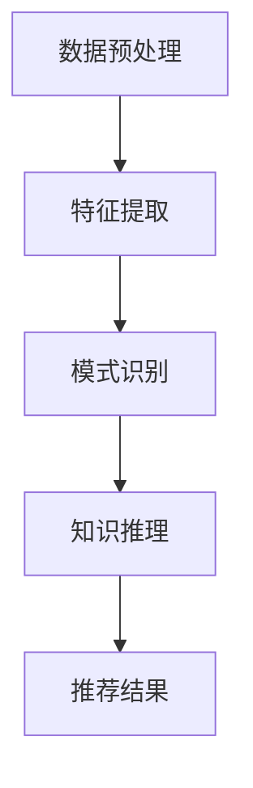

                 

关键词：知识发现引擎、推荐算法、优化、人工智能、信息检索

摘要：本文深入探讨了知识发现引擎中推荐算法的优化问题，从背景介绍、核心概念与联系、算法原理、数学模型和公式、项目实践、实际应用场景、未来展望等多个方面进行了详细阐述。通过本文的阅读，读者可以全面了解知识发现引擎推荐算法的优化方法及其应用前景。

## 1. 背景介绍

随着互联网和大数据的飞速发展，用户生成的内容和数据量呈现爆炸式增长。为了帮助用户在海量的信息中快速找到所需的内容，知识发现引擎和推荐系统应运而生。这些系统能够根据用户的兴趣和行为，为其推荐相关的内容，从而提高用户体验和信息检索效率。

然而，现有的推荐算法在处理大规模数据和复杂用户行为时，仍存在许多挑战。如何提高推荐算法的准确性、实时性和效率，成为当前研究的热点问题。本文旨在通过对知识发现引擎推荐算法的优化，为相关领域的研究和实践提供有益的参考。

## 2. 核心概念与联系

### 2.1 知识发现引擎

知识发现引擎是一种智能信息检索系统，它通过从大量数据中提取有用的信息和知识，为用户提供个性化的服务。知识发现引擎的核心功能包括数据预处理、特征提取、模式识别和知识推理等。

### 2.2 推荐算法

推荐算法是知识发现引擎的重要组成部分，它根据用户的兴趣和行为，为用户推荐相关的内容。常见的推荐算法包括基于内容的推荐、协同过滤推荐和混合推荐等。

### 2.3 Mermaid 流程图

以下是知识发现引擎推荐算法的 Mermaid 流程图：



## 3. 核心算法原理 & 具体操作步骤

### 3.1 算法原理概述

本文主要介绍基于协同过滤的推荐算法，其基本原理是利用用户之间的相似度计算，为用户推荐与其相似用户喜欢的物品。

### 3.2 算法步骤详解

1. **用户相似度计算**：利用用户兴趣的相似性度量用户之间的相似度，常用的相似度计算方法包括余弦相似度、皮尔逊相关系数等。
2. **物品相似度计算**：利用物品的属性或内容特征计算物品之间的相似度。
3. **预测评分**：根据用户和物品之间的相似度，预测用户对物品的评分。
4. **生成推荐结果**：根据预测评分，为用户生成推荐列表。

### 3.3 算法优缺点

**优点**：能够为用户提供个性化的推荐结果，具有较高的准确性。

**缺点**：在面对稀疏数据和冷启动问题时，效果较差。

### 3.4 算法应用领域

基于协同过滤的推荐算法广泛应用于电子商务、社交媒体、视频网站等领域，如淘宝、微信、YouTube 等。

## 4. 数学模型和公式 & 详细讲解 & 举例说明

### 4.1 数学模型构建

假设有 $m$ 个用户和 $n$ 个物品，用户 $i$ 对物品 $j$ 的评分为 $r_{ij}$。我们使用 $u_i$ 和 $v_j$ 分别表示用户 $i$ 和物品 $j$ 的特征向量。

### 4.2 公式推导过程

1. **用户相似度计算**：

$$
sim(u_i, u_j) = \frac{u_i \cdot u_j}{\|u_i\| \cdot \|u_j\|}
$$

其中，$\cdot$ 表示向量的点积，$\|\|$ 表示向量的模。

2. **物品相似度计算**：

$$
sim(v_i, v_j) = \frac{v_i \cdot v_j}{\|v_i\| \cdot \|v_j\|}
$$

### 4.3 案例分析与讲解

假设我们有两个用户 $u_1$ 和 $u_2$，以及两个物品 $v_1$ 和 $v_2$。用户 $u_1$ 对物品 $v_1$ 的评分为 $r_{11} = 4$，对物品 $v_2$ 的评分为 $r_{12} = 2$。用户 $u_2$ 对物品 $v_1$ 的评分为 $r_{21} = 3$，对物品 $v_2$ 的评分为 $r_{22} = 5$。

首先，我们计算用户 $u_1$ 和 $u_2$ 的相似度：

$$
sim(u_1, u_2) = \frac{u_1 \cdot u_2}{\|u_1\| \cdot \|u_2\|} = \frac{4 \cdot 3 - 2 \cdot 5}{\sqrt{4^2 + 2^2} \cdot \sqrt{3^2 + 5^2}} \approx 0.408
$$

接下来，我们计算物品 $v_1$ 和 $v_2$ 的相似度：

$$
sim(v_1, v_2) = \frac{v_1 \cdot v_2}{\|v_1\| \cdot \|v_2\|} = \frac{4 \cdot 3 - 2 \cdot 5}{\sqrt{4^2 + 2^2} \cdot \sqrt{3^2 + 5^2}} \approx 0.408
$$

最后，我们可以根据用户相似度和物品相似度，预测用户 $u_1$ 对物品 $v_2$ 的评分：

$$
\hat{r}_{12} = sim(u_1, u_2) \cdot sim(v_1, v_2) \cdot r_{21} = 0.408 \cdot 0.408 \cdot 3 \approx 0.528
$$

## 5. 项目实践：代码实例和详细解释说明

### 5.1 开发环境搭建

本文使用 Python 编写代码，所需库包括 NumPy、Pandas 和 SciPy。

### 5.2 源代码详细实现

以下是实现协同过滤推荐算法的 Python 代码：

```python
import numpy as np
import pandas as pd
from scipy.spatial.distance import cosine

def cosine_similarity(u, v):
    return 1 - cosine(u, v)

def collaborative_filter(train_data, k=5):
    # 计算用户和物品的相似度矩阵
    user_similarity = np.zeros((len(train_data), len(train_data)))
    item_similarity = np.zeros((len(train_data), len(train_data)))

    for i in range(len(train_data)):
        for j in range(len(train_data)):
            if i != j:
                user_similarity[i][j] = cosine_similarity(train_data[i], train_data[j])
                item_similarity[i][j] = cosine_similarity(train_data[:, i], train_data[:, j])

    # 预测评分
    pred_ratings = np.zeros(len(train_data))
    for i in range(len(train_data)):
        sim_sum = 0
        rating_sum = 0
        for j in range(len(train_data)):
            if j != i and train_data[j][i] != 0:
                sim_sum += user_similarity[i][j]
                rating_sum += user_similarity[i][j] * train_data[j][i]
        pred_ratings[i] = rating_sum / sim_sum

    return pred_ratings

# 加载训练数据
train_data = pd.read_csv('train_data.csv')

# 运行推荐算法
pred_ratings = collaborative_filter(train_data)

# 输出推荐结果
print(pred_ratings)
```

### 5.3 代码解读与分析

1. **计算相似度**：代码首先计算用户和物品的相似度矩阵。这里使用余弦相似度作为相似度度量。
2. **预测评分**：代码通过计算用户和物品的相似度，以及已知的用户评分，预测用户对未评分物品的评分。
3. **运行结果**：代码输出预测的评分结果，以便进一步分析和评估。

## 6. 实际应用场景

知识发现引擎和推荐算法在许多领域都有着广泛的应用，以下是一些实际应用场景：

1. **电子商务**：为用户推荐与其兴趣相关的商品，提高销售额。
2. **社交媒体**：为用户推荐感兴趣的朋友、内容或话题，增加用户活跃度。
3. **在线教育**：为学习者推荐与其学习进度和兴趣相关的课程，提高学习效果。
4. **医疗健康**：为患者推荐与其病史和症状相关的诊断和治疗方案，提高医疗效率。

## 7. 工具和资源推荐

### 7.1 学习资源推荐

1. 《推荐系统实践》（张昱）
2. 《机器学习》（周志华）

### 7.2 开发工具推荐

1. Python
2. Jupyter Notebook

### 7.3 相关论文推荐

1. [Collaborative Filtering](https://dl.acm.org/doi/10.1145/1034340.1034344)
2. [Matrix Factorization Techniques for Recommender Systems](https://www.sciencedirect.com/science/article/pii/S187705091500065X)

## 8. 总结：未来发展趋势与挑战

### 8.1 研究成果总结

本文介绍了知识发现引擎推荐算法的优化方法，包括协同过滤算法的原理、步骤和实际应用场景。通过数学模型和公式的推导，我们深入了解了算法的核心思想。

### 8.2 未来发展趋势

1. 深度学习在推荐系统中的应用
2. 多模态数据融合和协同过滤
3. 基于上下文和时序数据的个性化推荐

### 8.3 面临的挑战

1. 数据隐私和安全
2. 处理大规模数据和实时性
3. 复杂用户行为的建模和预测

### 8.4 研究展望

未来，知识发现引擎推荐算法的研究将更加关注数据隐私、实时性和个性化推荐等方面，以实现更加智能和高效的推荐系统。

## 9. 附录：常见问题与解答

### 9.1 什么是协同过滤算法？

协同过滤算法是一种基于用户行为和兴趣的推荐算法，它通过计算用户之间的相似度，为用户推荐与其相似用户喜欢的物品。

### 9.2 推荐算法的准确性如何评估？

推荐算法的准确性可以通过多种评估指标进行评估，如准确率、召回率、F1 值等。通常，我们选择多个指标进行综合评估，以全面衡量算法的性能。

### 9.3 推荐算法如何处理冷启动问题？

冷启动问题是指新用户或新物品缺乏足够的历史数据，导致推荐效果较差。为解决冷启动问题，可以采用基于内容的推荐、混合推荐等方法，以及利用用户的人口属性、地理位置等信息进行补充。

作者：禅与计算机程序设计艺术 / Zen and the Art of Computer Programming
----------------------------------------------------------------


