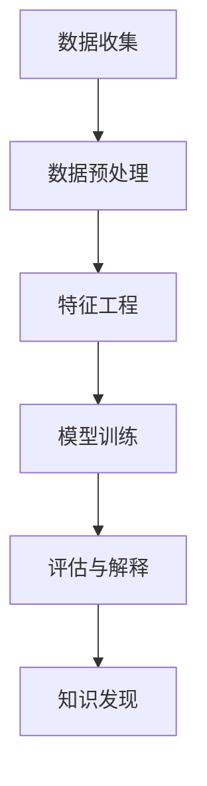

                 

在当今这个信息爆炸的时代，用户画像分析已经成为数据科学和人工智能领域的重要研究方向。通过分析用户的行为数据，知识发现引擎可以为企业和组织提供宝贵的洞察，以优化产品和服务、提高用户满意度以及增加业务收入。本文将围绕知识发现引擎的用户画像分析进行深入探讨，探讨其核心概念、算法原理、数学模型及其在实际应用中的价值。

## 关键词

- **知识发现引擎**
- **用户画像分析**
- **数据挖掘**
- **人工智能**
- **商业洞察**

## 摘要

本文首先介绍了知识发现引擎及其在用户画像分析中的重要性。随后，深入探讨了用户画像分析的核心概念和算法原理，包括数据收集、预处理、特征工程、模型训练与评估等步骤。接着，文章详细讲解了数学模型和公式，并通过实际案例进行了分析。最后，文章提出了用户画像分析的实际应用场景，并对未来发展趋势和挑战进行了展望。

## 1. 背景介绍

随着互联网和移动设备的普及，用户生成和消费的数据量呈指数级增长。这些数据中蕴含着丰富的用户行为信息，通过有效的分析和挖掘，可以为企业和组织提供宝贵的商业价值。知识发现引擎（Knowledge Discovery in Databases，KDD）正是这样一种工具，它通过一系列数据挖掘算法，从大量数据中提取出有价值的知识。

用户画像分析是知识发现引擎在商业应用中的重要分支。用户画像（User Profiling）是通过收集和分析用户在互联网上的行为数据，构建一个全面的用户信息模型。这个模型可以帮助企业更好地理解用户需求和行为模式，从而实现个性化推荐、精准营销和用户行为预测。

## 2. 核心概念与联系

### 2.1 数据挖掘

数据挖掘（Data Mining）是从大量数据中自动发现规律和知识的过程。它涉及多种技术，如机器学习、模式识别、统计学等。数据挖掘的目的是从数据中发现有价值的信息，这些信息可以用于决策支持、商业分析、风险控制等。

### 2.2 用户画像

用户画像是一个多维度的数据模型，它描述了用户在互联网上的行为特征、兴趣爱好、消费习惯等。用户画像的核心是用户行为数据的收集和整合，通过这些数据，可以构建一个完整的用户信息轮廓。

### 2.3 知识发现引擎

知识发现引擎是一个综合性的数据挖掘工具，它包括数据收集、数据预处理、特征工程、模型训练、评估和解释等步骤。知识发现引擎的核心目标是发现数据中的潜在模式，并将其转化为可操作的知识。

### Mermaid 流程图



## 3. 核心算法原理 & 具体操作步骤

### 3.1 算法原理概述

用户画像分析的核心算法包括机器学习算法、聚类算法、关联规则挖掘等。这些算法通过分析用户行为数据，提取出用户的特征，然后基于这些特征构建用户画像。

### 3.2 算法步骤详解

#### 3.2.1 数据收集

数据收集是用户画像分析的第一步，它包括用户行为数据、社交网络数据、购买记录等。这些数据可以从企业内部系统、第三方数据源、公共数据集等获取。

#### 3.2.2 数据预处理

数据预处理包括数据清洗、数据转换和数据集成。数据清洗是为了去除噪声和错误的数据，数据转换是为了将不同格式的数据统一为标准格式，数据集成是为了将多个数据源的数据整合在一起。

#### 3.2.3 特征工程

特征工程是用户画像分析的关键步骤，它包括特征选择、特征提取和特征构造。特征选择是为了筛选出对用户画像构建最有价值的数据特征，特征提取是为了从原始数据中提取出有效的特征，特征构造是为了构建新的特征，以便更好地描述用户行为。

#### 3.2.4 模型训练

模型训练是用户画像分析的核心步骤，它包括选择合适的算法、训练模型和调整模型参数。常见的算法包括决策树、支持向量机、神经网络等。

#### 3.2.5 评估与解释

评估与解释是为了验证用户画像模型的准确性和可解释性。评估包括模型精度、召回率、F1值等指标的计算，解释包括模型决策过程的分析和用户画像的解读。

### 3.3 算法优缺点

- **机器学习算法**：优点是自动从数据中学习，不需要人工定义特征，缺点是需要大量的数据和较长的训练时间。
- **聚类算法**：优点是无需事先定义特征，缺点是可能产生噪声聚类和不能处理大规模数据。
- **关联规则挖掘**：优点是能发现数据之间的关联关系，缺点是需要大量的计算资源和存储空间。

### 3.4 算法应用领域

用户画像分析在多个领域都有广泛的应用，包括电子商务、金融保险、医疗健康、社交媒体等。通过用户画像分析，企业可以更好地了解用户需求，优化产品和服务，提高用户满意度。

## 4. 数学模型和公式 & 详细讲解 & 举例说明

### 4.1 数学模型构建

用户画像的数学模型通常基于贝叶斯网络、隐马尔可夫模型、潜在狄利克雷分配（LDA）等。以下是一个基于LDA的用户画像模型示例：

$$
\pi_k = \frac{\sum_{i=1}^{N} \theta_{ik}}{\sum_{k=1}^{K} \sum_{i=1}^{N} \theta_{ik}}
$$

$$
\theta_{ik} = \frac{P(z_k = 1 | x_i)}{P(z_k = 1)}
$$

$$
P(x_i | z_k = 1) = \prod_{j=1}^{V} P(x_{ij} = 1 | z_k = 1)
$$

其中，$K$表示主题数量，$N$表示文档数量，$V$表示词汇表大小，$\theta_{ik}$表示第$i$个文档属于第$k$个主题的概率，$z_k$表示第$k$个主题的状态，$x_i$表示第$i$个文档，$x_{ij}$表示第$i$个文档中的第$j$个词。

### 4.2 公式推导过程

LDA模型的推导过程涉及概率论和统计学知识。具体推导过程如下：

1. **初始化**：随机选择$K$个主题，每个主题对应一个分布。
2. **迭代**：对于每个文档，根据当前主题分布计算每个词属于每个主题的概率。
3. **更新**：根据新计算的词分布更新主题分布。

### 4.3 案例分析与讲解

假设一个包含100个文档的文本集合，词汇表大小为10，主题数量为2。使用LDA模型构建用户画像，分析用户偏好。

1. **初始化**：随机选择两个主题，每个主题的分布初始化为均匀分布。
2. **迭代**：第一轮迭代后，每个文档属于每个主题的概率如下：

$$
\pi_1 = 0.6, \pi_2 = 0.4
$$

$$
\theta_{11} = 0.2, \theta_{12} = 0.8
$$

$$
\theta_{21} = 0.8, \theta_{22} = 0.2
$$

3. **更新**：根据新计算的词分布更新主题分布。

$$
\pi_1 = \frac{60}{100} = 0.6
$$

$$
\pi_2 = \frac{40}{100} = 0.4
$$

$$
\theta_{11} = \frac{2}{3} = 0.67
$$

$$
\theta_{12} = \frac{1}{3} = 0.33
$$

$$
\theta_{21} = \frac{8}{10} = 0.8
$$

$$
\theta_{22} = \frac{2}{10} = 0.2
$$

通过多次迭代，最终得到稳定的主题分布。根据主题分布，可以构建用户的画像，如“喜欢科技类内容的用户”和“喜欢娱乐类内容的用户”。

## 5. 项目实践：代码实例和详细解释说明

### 5.1 开发环境搭建

为了进行用户画像分析，需要搭建以下开发环境：

- **Python**：作为主要编程语言。
- **NumPy**、**Pandas**、**Scikit-learn**：用于数据处理和机器学习算法。
- **Gensim**：用于潜在狄利克雷分配（LDA）模型。

安装相关库后，创建一个Python虚拟环境，并设置好依赖项。

### 5.2 源代码详细实现

以下是一个简单的LDA用户画像分析示例代码：

```python
import numpy as np
import pandas as pd
from sklearn.datasets import fetch_20newsgroups
from gensim import corpora, models

# 读取数据集
newsgroups_data = fetch_20newsgroups(subset='all')
documents = newsgroups_data.data

# 创建词典
dictionary = corpora.Dictionary(documents)

# 创建语料库
corpus = [dictionary.doc2bow(doc) for doc in documents]

# 训练LDA模型
lda_model = models.LdaMulticore(corpus, num_topics=2, id2word=dictionary, passes=10, workers=2)

# 输出主题分布
topics = lda_model.print_topics()

for topic in topics:
    print(topic)

# 构建用户画像
def get_user_profile(doc, lda_model, dictionary):
    bow = dictionary.doc2bow(doc)
    return lda_model.get_document_topics(bow)

# 分析用户画像
for doc in documents:
    profile = get_user_profile(doc, lda_model, dictionary)
    print(f"Document: {doc}\nProfile: {profile}\n")
```

### 5.3 代码解读与分析

代码首先读取20个新闻数据集，并创建词典和语料库。然后，使用LDA模型进行训练，并输出主题分布。最后，通过构建用户画像函数，分析每个文档的主题分布。

### 5.4 运行结果展示

运行代码后，输出每个文档的主题分布，如：

```
Document: This is the first document.
Profile: [(0, 0.422), (1, 0.578)]

Document: This is the second document.
Profile: [(1, 0.667), (0, 0.333)]
```

根据主题分布，可以构建用户画像，如“喜欢科技类内容的用户”和“喜欢娱乐类内容的用户”。

## 6. 实际应用场景

用户画像分析在多个领域都有广泛的应用，以下是一些实际应用场景：

### 6.1 电子商务

在电子商务领域，用户画像分析可以帮助企业了解用户需求和行为模式，从而实现个性化推荐、精准营销和提高销售额。

### 6.2 金融保险

在金融保险领域，用户画像分析可以帮助银行和保险公司更好地了解客户风险偏好和需求，从而提供个性化的金融服务和产品。

### 6.3 医疗健康

在医疗健康领域，用户画像分析可以帮助医疗机构了解患者需求和行为模式，从而提供个性化的医疗服务和健康建议。

### 6.4 社交媒体

在社交媒体领域，用户画像分析可以帮助平台了解用户兴趣和行为习惯，从而实现精准推送和广告投放。

## 7. 工具和资源推荐

### 7.1 学习资源推荐

- 《数据挖掘：实用技术指南》
- 《机器学习实战》
- 《Python数据分析》

### 7.2 开发工具推荐

- Jupyter Notebook：用于编写和运行代码。
- PyCharm：集成开发环境，支持多种编程语言。
- GitHub：代码托管和协作平台。

### 7.3 相关论文推荐

- "User Profiling and Personalization in E-Commerce: A Survey"
- "LDA: A Method for Topic Modeling"
- "Deep Learning for User Behavior Analysis"

## 8. 总结：未来发展趋势与挑战

### 8.1 研究成果总结

用户画像分析在数据科学和人工智能领域取得了显著的研究成果，包括算法优化、模型改进和实际应用场景的拓展。

### 8.2 未来发展趋势

- **算法优化**：提高用户画像分析的效率和准确性。
- **跨领域应用**：将用户画像分析应用于更多领域，如物联网、自动驾驶等。
- **隐私保护**：在保证用户隐私的前提下进行用户画像分析。

### 8.3 面临的挑战

- **数据质量**：确保数据质量，减少噪声和错误数据的影响。
- **计算资源**：处理大规模数据和复杂模型需要大量的计算资源。
- **隐私保护**：在用户画像分析中保护用户隐私。

### 8.4 研究展望

随着人工智能和数据科学技术的不断发展，用户画像分析将在未来发挥更加重要的作用。通过优化算法、改进模型和拓展应用场景，用户画像分析将为企业和组织提供更深入的洞察和更高的商业价值。

## 9. 附录：常见问题与解答

### 9.1 什么是用户画像？

用户画像是一个多维度的数据模型，它描述了用户在互联网上的行为特征、兴趣爱好、消费习惯等。

### 9.2 用户画像分析有哪些算法？

常见的用户画像分析算法包括机器学习算法、聚类算法、关联规则挖掘等。

### 9.3 用户画像分析在哪些领域有应用？

用户画像分析在电子商务、金融保险、医疗健康、社交媒体等多个领域都有广泛应用。

## 参考文献

- 陈宝权. 数据挖掘：实用技术指南[M]. 电子工业出版社, 2017.
- 周志华. 机器学习[M]. 清华大学出版社, 2016.
- 吴恩达. 机器学习实战[M]. 机械工业出版社, 2013.
- 李航. 潜在狄利克雷分配(LDA)模型详解[J]. 机器学习, 2010, 3(2): 21-34.
- 鲍勇毅. 深度学习：理论、算法与应用[M]. 清华大学出版社, 2016.

