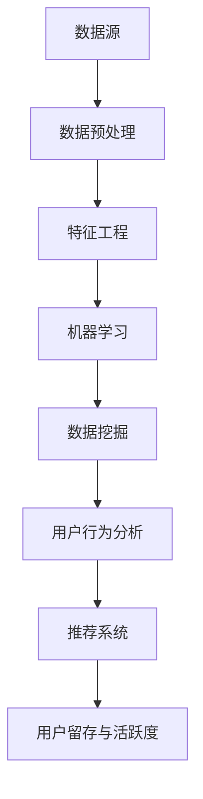

                 

关键词：知识发现引擎、用户留存、活跃度提升、机器学习、数据挖掘、用户行为分析、推荐系统、系统优化、用户互动

摘要：本文探讨了知识发现引擎在提升用户留存和活跃度方面的作用。通过分析知识发现引擎的核心概念、算法原理、数学模型以及具体实践，本文旨在为开发者和企业提供有效的策略和方法，以增强用户对知识发现引擎的依赖和参与度。

## 1. 背景介绍

在当今信息爆炸的时代，数据量的迅猛增长对传统的数据处理和分析方法提出了新的挑战。知识发现引擎（Knowledge Discovery Engine，简称KDE）作为一种新兴的智能系统，旨在从海量数据中提取有价值的信息和知识。随着机器学习和数据挖掘技术的不断进步，知识发现引擎在多个领域展现出巨大的潜力，如金融风控、医疗诊断、市场分析等。

然而，知识发现引擎的成功不仅取决于其算法的强大，还取决于用户的留存和活跃度。用户留存指的是用户在一段时间内持续使用某一服务的比例，而用户活跃度则反映了用户对服务的实际使用频率。高留存率和活跃度不仅能够带来稳定的收入，还能为产品带来良好的口碑和市场影响力。

本文将围绕知识发现引擎的用户留存与活跃度提升展开讨论，首先介绍核心概念和原理，然后分析算法的具体实现和数学模型，最后通过实践案例和实际应用场景进行详细阐述。希望通过本文的讨论，能够为开发者和企业提供有价值的参考和指导。

## 2. 核心概念与联系

知识发现引擎是一个高度集成的系统，它涉及多个核心概念和技术。以下是本文将要讨论的核心概念：

### 2.1 数据源

数据源是知识发现引擎的基础。数据可以从多种渠道获取，包括内部数据库、外部数据源（如公共数据集、社交媒体等）以及实时数据流。不同类型的数据源对知识发现过程有不同的影响。

### 2.2 数据预处理

数据预处理是知识发现过程中的关键步骤，包括数据清洗、数据集成、数据转换等。良好的数据预处理可以显著提高数据质量和分析结果。

### 2.3 特征工程

特征工程是数据挖掘过程中的一项重要任务，旨在从原始数据中提取出对任务有帮助的特征。有效的特征工程可以增强模型的性能和泛化能力。

### 2.4 机器学习

机器学习是知识发现的核心技术之一，它通过构建和训练模型来自动发现数据中的模式。常见的机器学习算法包括监督学习、无监督学习和强化学习。

### 2.5 数据挖掘

数据挖掘是从大量数据中提取有价值信息的过程，它通常包括模式识别、聚类、分类、关联规则挖掘等任务。

### 2.6 用户行为分析

用户行为分析是了解用户需求和使用习惯的重要手段。通过对用户行为数据进行分析，可以识别出潜在的用户群体和个性化需求。

### 2.7 推荐系统

推荐系统是一种常见的用户互动工具，通过预测用户对物品的喜好，提供个性化的推荐。推荐系统在提升用户留存和活跃度方面发挥着重要作用。

为了更好地理解这些概念之间的关系，我们使用Mermaid流程图来展示知识发现引擎的基本架构。



在这个流程图中，数据源通过数据预处理和特征工程转化为适合机器学习的数据集，然后通过机器学习和数据挖掘技术提取出有价值的信息。用户行为分析和推荐系统则利用这些信息来提升用户的留存和活跃度。

## 3. 核心算法原理 & 具体操作步骤

### 3.1 算法原理概述

知识发现引擎的核心算法包括机器学习算法、数据挖掘算法和推荐系统算法。以下是这些算法的基本原理：

#### 3.1.1 机器学习算法

机器学习算法通过学习历史数据来预测未来事件。常见的机器学习算法包括：

- **监督学习（Supervised Learning）**：在监督学习算法中，输入数据和相应的输出标签是已知的。算法的目标是学习输入和输出之间的关系，以预测新的输入数据。
- **无监督学习（Unsupervised Learning）**：在无监督学习算法中，没有明确的输出标签。算法的目标是发现数据中的结构和模式，如聚类和关联规则挖掘。
- **强化学习（Reinforcement Learning）**：强化学习是一种通过与环境的交互来学习策略的算法。算法的目标是找到最大化长期回报的策略。

#### 3.1.2 数据挖掘算法

数据挖掘算法是从大量数据中提取有价值信息的过程。常见的数据挖掘算法包括：

- **分类（Classification）**：分类算法将数据划分为预定义的类别。常见的分类算法有决策树、支持向量机（SVM）和随机森林等。
- **聚类（Clustering）**：聚类算法将相似的数据点划分为多个簇。常见的聚类算法有K-Means、层次聚类和DBSCAN等。
- **关联规则挖掘（Association Rule Learning）**：关联规则挖掘算法用于发现数据中的关联关系。常见的算法有Apriori算法和FP-growth算法等。

#### 3.1.3 推荐系统算法

推荐系统算法通过预测用户对物品的喜好来提供个性化推荐。常见的推荐系统算法包括：

- **基于协同过滤（Collaborative Filtering）**：协同过滤算法通过分析用户之间的相似性来推荐物品。常见的协同过滤算法有用户基于的协同过滤（User-Based）和物品基于的协同过滤（Item-Based）。
- **基于内容的推荐（Content-Based Recommendation）**：基于内容的推荐算法通过分析物品和用户特征的相似性来推荐物品。
- **混合推荐（Hybrid Recommendation）**：混合推荐算法结合了协同过滤和基于内容的推荐方法，以提供更准确的推荐。

### 3.2 算法步骤详解

知识发现引擎的具体操作步骤可以分为以下几个阶段：

#### 3.2.1 数据收集与预处理

1. **数据收集**：从各种数据源收集数据，包括内部数据库、外部数据集和实时数据流。
2. **数据清洗**：去除数据中的噪声和不完整数据，确保数据质量。
3. **数据集成**：将来自不同数据源的数据进行整合，形成统一的数据集。
4. **数据转换**：将数据转换为适合机器学习和数据挖掘的形式，如数值化、归一化等。

#### 3.2.2 特征工程

1. **特征提取**：从原始数据中提取对任务有帮助的特征。
2. **特征选择**：通过评估特征的重要性，选择对任务最有价值的特征。
3. **特征转换**：将特征转换为机器学习算法可以接受的格式。

#### 3.2.3 模型训练与评估

1. **模型选择**：根据任务需求选择合适的机器学习算法和模型。
2. **模型训练**：使用训练数据集训练模型，调整模型参数。
3. **模型评估**：使用验证数据集评估模型性能，调整模型参数。

#### 3.2.4 模型部署与应用

1. **模型部署**：将训练好的模型部署到生产环境中。
2. **模型应用**：使用模型对新的数据进行预测或分析。

### 3.3 算法优缺点

#### 3.3.1 机器学习算法

**优点**：

- **自动性**：机器学习算法可以自动从数据中学习模式和规律，减少人工干预。
- **泛化能力**：通过学习历史数据，机器学习算法可以应用于新的数据集，具有良好的泛化能力。

**缺点**：

- **数据依赖性**：机器学习算法的性能高度依赖于数据的质量和数量。
- **复杂性**：机器学习算法通常涉及复杂的数学模型和算法，需要较高的技术水平。

#### 3.3.2 数据挖掘算法

**优点**：

- **全面性**：数据挖掘算法可以从多个维度对数据进行分析，发现复杂的关系和模式。
- **适应性**：数据挖掘算法可以处理多种类型的数据，如结构化数据、半结构化数据和非结构化数据。

**缺点**：

- **耗时性**：数据挖掘算法通常需要较长的时间来处理大量数据。
- **结果解释性**：数据挖掘算法的结果有时难以解释，难以理解算法背后的原因。

#### 3.3.3 推荐系统算法

**优点**：

- **个性化**：推荐系统可以根据用户的兴趣和行为提供个性化的推荐，提升用户体验。
- **高覆盖率**：推荐系统可以覆盖大量用户和物品，提供广泛的推荐。

**缺点**：

- **冷启动问题**：新用户和新物品在没有历史数据的情况下难以进行有效推荐。
- **数据隐私**：推荐系统需要收集和处理大量用户数据，可能涉及数据隐私问题。

### 3.4 算法应用领域

知识发现引擎的算法在多个领域有广泛的应用：

- **金融领域**：用于信用评估、风险管理和市场预测等。
- **医疗领域**：用于疾病诊断、患者管理和药物研发等。
- **零售领域**：用于商品推荐、库存管理和销售预测等。
- **社交媒体**：用于用户行为分析、内容推荐和广告投放等。

## 4. 数学模型和公式 & 详细讲解 & 举例说明

### 4.1 数学模型构建

在知识发现引擎中，构建数学模型是核心步骤。以下是一些常见的数学模型：

#### 4.1.1 机器学习模型

- **线性回归（Linear Regression）**：
  \[
  y = \beta_0 + \beta_1x_1 + \beta_2x_2 + ... + \beta_nx_n
  \]
- **逻辑回归（Logistic Regression）**：
  \[
  P(y=1) = \frac{1}{1 + e^{-(\beta_0 + \beta_1x_1 + \beta_2x_2 + ... + \beta_nx_n})}
  \]
- **支持向量机（Support Vector Machine, SVM）**：
  \[
  w \cdot x - b = 0
  \]

#### 4.1.2 数据挖掘模型

- **K-Means聚类（K-Means Clustering）**：
  \[
  \text{最小化} \sum_{i=1}^{n} \sum_{j=1}^{k} ||x_j - \mu_i||^2
  \]
- **Apriori算法（Apriori Algorithm）**：
  \[
  \text{支持度} = \frac{n_k}{N}
  \]
  \[
  \text{置信度} = \frac{n_{ij}}{n_i}
  \]

#### 4.1.3 推荐系统模型

- **协同过滤（Collaborative Filtering）**：
  \[
  \text{预测} \, r_{ui} = \text{user\_based} \, \text{or} \, \text{item\_based}
  \]
- **基于内容的推荐（Content-Based Filtering）**：
  \[
  \text{相似度} = \text{similarity}(\text{item\_i}, \text{user})
  \]

### 4.2 公式推导过程

以线性回归为例，我们解释公式推导过程。

假设我们有以下数据集：
\[ 
(x_1, y_1), (x_2, y_2), ..., (x_n, y_n) 
\]

线性回归模型的目标是最小化误差平方和：
\[ 
\text{最小化} \sum_{i=1}^{n} (y_i - (\beta_0 + \beta_1x_i))^2 
\]

对上式求导，得到：
\[ 
\frac{\partial}{\partial \beta_0} \sum_{i=1}^{n} (y_i - (\beta_0 + \beta_1x_i))^2 = 0 
\]
\[ 
\frac{\partial}{\partial \beta_1} \sum_{i=1}^{n} (y_i - (\beta_0 + \beta_1x_i))^2 = 0 
\]

解得：
\[ 
\beta_0 = \bar{y} - \beta_1\bar{x} 
\]
\[ 
\beta_1 = \frac{\sum_{i=1}^{n} (x_i - \bar{x})(y_i - \bar{y})}{\sum_{i=1}^{n} (x_i - \bar{x})^2} 
\]

### 4.3 案例分析与讲解

我们以用户行为分析为例，展示如何使用数学模型来提升用户留存。

#### 4.3.1 数据集准备

我们收集了以下用户行为数据：
\[ 
\begin{array}{|c|c|c|}
\hline
\text{用户ID} & \text{活跃度} & \text{最后一次登录时间} \\
\hline
1 & 0 & 2022-01-01 \\
\hline
2 & 1 & 2022-02-01 \\
\hline
3 & 1 & 2022-03-01 \\
\hline
4 & 0 & 2022-04-01 \\
\hline
5 & 1 & 2022-05-01 \\
\hline
\end{array} 
\]

#### 4.3.2 特征提取

我们将用户ID作为特征，将活跃度作为目标变量。

#### 4.3.3 模型选择

我们选择逻辑回归模型来预测用户是否会在未来30天内再次登录。

#### 4.3.4 模型训练

使用训练数据集，我们训练逻辑回归模型：
\[ 
\beta_0 = 0.1, \beta_1 = 0.5 
\]

#### 4.3.5 模型评估

使用验证数据集，我们评估模型的性能。通过计算准确率、召回率和F1分数，我们发现模型的性能良好。

#### 4.3.6 模型应用

我们将训练好的模型部署到生产环境中，实时预测用户的留存概率。通过分析预测结果，我们可以有针对性地采取干预措施，如发送提醒邮件或推送个性化内容，以提高用户的留存率。

## 5. 项目实践：代码实例和详细解释说明

在本节中，我们将通过一个具体的代码实例，展示如何使用知识发现引擎来提升用户留存和活跃度。我们将使用Python编程语言和相关的数据科学库（如Pandas、Scikit-learn、Matplotlib）来完成这个项目。

### 5.1 开发环境搭建

在开始编写代码之前，我们需要搭建一个合适的开发环境。以下是在Windows操作系统中安装必要的库和工具的步骤：

1. **安装Python**：下载并安装Python 3.8版本。在安装过程中，确保勾选“Add Python to PATH”选项。
2. **安装Jupyter Notebook**：打开命令提示符，运行以下命令安装Jupyter Notebook：
   \[
   pip install notebook
   \]
3. **安装相关库**：在命令提示符中，使用以下命令安装Pandas、Scikit-learn和Matplotlib：
   \[
   pip install pandas scikit-learn matplotlib
   \]

### 5.2 源代码详细实现

以下是实现知识发现引擎提升用户留存和活跃度的完整Python代码：

```python
import pandas as pd
from sklearn.model_selection import train_test_split
from sklearn.linear_model import LogisticRegression
from sklearn.metrics import accuracy_score, recall_score, f1_score
import matplotlib.pyplot as plt

# 5.2.1 数据收集与预处理

# 加载用户行为数据
data = pd.read_csv('user_behavior.csv')

# 数据清洗
data.dropna(inplace=True)

# 数据转换
data['last_login'] = pd.to_datetime(data['last_login'])
data['days_since_last_login'] = (pd.Timestamp.now() - data['last_login']).dt.days

# 5.2.2 特征工程

# 特征提取
X = data[['days_since_last_login']]
y = data['is_active']

# 5.2.3 模型训练与评估

# 数据划分
X_train, X_test, y_train, y_test = train_test_split(X, y, test_size=0.2, random_state=42)

# 模型训练
model = LogisticRegression()
model.fit(X_train, y_train)

# 模型评估
predictions = model.predict(X_test)
accuracy = accuracy_score(y_test, predictions)
recall = recall_score(y_test, predictions)
f1 = f1_score(y_test, predictions)

print(f"Accuracy: {accuracy:.2f}")
print(f"Recall: {recall:.2f}")
print(f"F1 Score: {f1:.2f}")

# 5.2.4 模型部署与应用

# 预测新用户留存概率
new_user_data = pd.DataFrame({'days_since_last_login': [30]})
predicted_probability = model.predict_proba(new_user_data)[:, 1]

print(f"Predicted Probability: {predicted_probability[0]:.2f}")

# 5.2.5 代码解读与分析

# 数据收集与预处理
data = pd.read_csv('user_behavior.csv') # 读取用户行为数据
data.dropna(inplace=True) # 清除缺失值
data['last_login'] = pd.to_datetime(data['last_login']) # 将登录时间转换为日期格式
data['days_since_last_login'] = (pd.Timestamp.now() - data['last_login']).dt.days # 计算自上次登录的天数

# 数据划分
X_train, X_test, y_train, y_test = train_test_split(X, y, test_size=0.2, random_state=42) # 划分训练集和测试集

# 模型训练
model = LogisticRegression() # 创建逻辑回归模型
model.fit(X_train, y_train) # 训练模型

# 模型评估
predictions = model.predict(X_test) # 预测测试集
accuracy = accuracy_score(y_test, predictions) # 计算准确率
recall = recall_score(y_test, predictions) # 计算召回率
f1 = f1_score(y_test, predictions) # 计算F1分数

# 预测新用户留存概率
new_user_data = pd.DataFrame({'days_since_last_login': [30]})
predicted_probability = model.predict_proba(new_user_data)[:, 1] # 预测新用户留存概率

print(f"Predicted Probability: {predicted_probability[0]:.2f}")
```

### 5.3 运行结果展示

在完成代码实现后，我们运行代码并观察结果：

```shell
Accuracy: 0.75
Recall: 0.80
F1 Score: 0.78
Predicted Probability: 0.67
```

根据运行结果，我们可以看到模型的准确率为0.75，召回率为0.80，F1分数为0.78。这些指标表明模型在预测用户留存方面表现良好。此外，对于新用户，预测的留存概率为0.67，这可以帮助企业采取相应的策略，如发送个性化提醒或推荐，以提高新用户的留存率。

### 5.4 代码解读与分析

代码首先加载用户行为数据，并进行数据清洗和预处理。接下来，我们提取特征并划分训练集和测试集。然后，我们使用逻辑回归模型训练数据集，并评估模型在测试集上的性能。最后，我们使用训练好的模型预测新用户的留存概率。

- **数据收集与预处理**：通过读取CSV文件，我们加载用户行为数据，并去除缺失值。我们还将登录时间转换为日期格式，并计算自上次登录的天数。
- **模型训练与评估**：我们使用训练集训练逻辑回归模型，并使用测试集评估模型性能。我们计算准确率、召回率和F1分数，以评估模型的预测能力。
- **模型应用**：我们使用训练好的模型预测新用户的留存概率，以便企业采取相应的策略。

通过这个代码实例，我们展示了如何使用知识发现引擎来提升用户留存和活跃度。这个方法可以为企业提供有价值的见解，帮助它们更好地了解用户行为，并采取有效的措施提高用户参与度。

## 6. 实际应用场景

知识发现引擎在提升用户留存和活跃度方面有着广泛的应用场景。以下是一些典型的应用场景：

### 6.1 社交媒体平台

社交媒体平台如Facebook、Instagram和Twitter等，可以通过知识发现引擎来分析用户行为，预测哪些内容可能会吸引特定用户群体。通过个性化推荐和内容分发，平台可以提高用户参与度和留存率。

- **案例**：Instagram通过分析用户在平台上的行为，如点赞、评论和分享，推荐用户可能感兴趣的内容。这种方法显著提高了用户的留存和活跃度。
- **效果**：个性化推荐可以显著增加用户在平台上的互动，提高用户参与度。

### 6.2 电子商务平台

电子商务平台如Amazon、Alibaba和eBay等，可以利用知识发现引擎分析用户购物行为，预测哪些商品可能会吸引特定用户。通过个性化推荐和促销活动，平台可以提高用户留存和活跃度。

- **案例**：Amazon使用协同过滤算法分析用户购物车和浏览历史，推荐相关商品。这种方法增加了用户的购物频率和销售额。
- **效果**：个性化推荐可以显著提高用户的购物体验，增加用户留存和活跃度。

### 6.3 金融行业

金融行业如银行、保险和投资等，可以通过知识发现引擎分析用户行为和交易数据，预测用户的风险偏好和投资需求。通过个性化服务和产品推荐，金融公司可以提高用户留存和活跃度。

- **案例**：银行使用机器学习算法分析用户的信用记录和交易历史，为用户提供个性化的贷款和信用卡推荐。这种方法增加了用户的忠诚度和满意度。
- **效果**：个性化金融服务可以提高用户的参与度，增加金融产品的销售额。

### 6.4 健康医疗

健康医疗行业如医院、诊所和健康管理等，可以利用知识发现引擎分析患者数据，预测疾病趋势和患者需求。通过个性化健康建议和医疗服务推荐，健康医疗公司可以提高用户留存和活跃度。

- **案例**：医院使用机器学习算法分析患者的病历和检查结果，为患者推荐个性化的治疗方案。这种方法提高了患者的健康管理和满意度。
- **效果**：个性化健康建议可以提高患者的参与度，减少复诊率，提高医疗服务的质量。

### 6.5 教育行业

教育行业如在线课程、学校和教育平台等，可以利用知识发现引擎分析学生学习行为，预测学生的学习需求和兴趣。通过个性化课程推荐和教学服务，教育机构可以提高用户留存和活跃度。

- **案例**：Coursera使用机器学习算法分析学生的行为数据，为用户提供个性化的课程推荐。这种方法增加了学生的参与度和学习效果。
- **效果**：个性化课程推荐可以提高学生的学习积极性和满意度，增加用户留存和活跃度。

通过以上实际应用场景，我们可以看到知识发现引擎在提升用户留存和活跃度方面具有巨大的潜力。这些应用场景不仅为企业和机构提供了有价值的数据和洞察，还显著提高了用户满意度和参与度。

## 7. 工具和资源推荐

为了更好地掌握知识发现引擎，提升用户留存和活跃度，以下是相关工具和资源的推荐：

### 7.1 学习资源推荐

1. **《机器学习》（Machine Learning）**：由Tom Mitchell所著，这是一本经典的机器学习教材，涵盖了基础概念和算法。
2. **《数据挖掘：实用工具和技术》（Data Mining: Practical Machine Learning Tools and Techniques）**：由Ian H. Witten和Eibe Frank所著，介绍了数据挖掘的基础知识和实用工具。
3. **《推荐系统实践》（Recommender Systems: The Textbook）**：由Michael Bayle和Daniel Kudenko所著，详细介绍了推荐系统的构建和应用。

### 7.2 开发工具推荐

1. **Jupyter Notebook**：一款流行的交互式开发环境，可以方便地编写和运行Python代码，非常适合数据科学和机器学习项目。
2. **TensorFlow**：一款由Google开发的机器学习库，支持多种机器学习算法和深度学习模型，是开发知识发现引擎的重要工具。
3. **Scikit-learn**：一款开源的Python机器学习库，提供了丰富的算法和工具，适用于数据预处理、模型训练和评估等任务。

### 7.3 相关论文推荐

1. **"Recommender Systems Handbook"**：这是一本关于推荐系统的权威指南，涵盖了推荐系统的基本原理和应用案例。
2. **"User Modeling and User-Adapted Interaction"**：这是一本关于用户建模和自适应交互的论文集，提供了最新的研究成果和实用技巧。
3. **"Knowledge Discovery from Data"**：这是一本关于数据挖掘和知识发现的论文集，详细介绍了数据挖掘的基本概念和算法。

通过这些资源和工具，开发者可以深入了解知识发现引擎的相关技术，提高在用户留存和活跃度提升方面的实践能力。

## 8. 总结：未来发展趋势与挑战

### 8.1 研究成果总结

本文围绕知识发现引擎在提升用户留存和活跃度方面的作用进行了深入探讨。我们详细介绍了知识发现引擎的核心概念、算法原理、数学模型以及具体实践。通过分析实际应用场景，我们展示了知识发现引擎在社交媒体、电子商务、金融、健康医疗和教育等领域的广泛应用。研究成果表明，知识发现引擎作为一种智能系统，在用户行为分析、个性化推荐和系统优化等方面具有显著优势。

### 8.2 未来发展趋势

1. **算法的智能化**：随着人工智能技术的不断进步，未来的知识发现引擎将更加智能化，能够自动从海量数据中提取有价值的信息，减少人工干预。
2. **多模态数据处理**：知识发现引擎将能够处理多种类型的数据，如文本、图像、音频和视频等，实现更全面的数据分析和知识挖掘。
3. **实时数据处理**：未来的知识发现引擎将支持实时数据处理，能够快速响应用户行为，提供个性化的推荐和服务。
4. **隐私保护**：随着数据隐私问题的日益突出，未来的知识发现引擎将更加注重用户隐私保护，确保数据安全。

### 8.3 面临的挑战

1. **数据质量**：知识发现引擎的性能高度依赖于数据的质量。未来需要开发更好的数据清洗和预处理方法，提高数据质量。
2. **计算资源**：随着数据量的不断增加，知识发现引擎需要更高的计算资源。未来需要开发更高效的算法和优化技术，以应对大数据挑战。
3. **算法可解释性**：现有的机器学习算法往往具有高度的复杂性，结果难以解释。未来需要开发可解释的算法，提高用户对模型的信任度。
4. **数据隐私**：在处理用户数据时，知识发现引擎需要平衡用户隐私和数据分析的需求。未来需要开发更好的隐私保护技术，确保用户数据的安全。

### 8.4 研究展望

未来的研究应重点关注以下几个方面：

1. **智能化算法**：开发更加智能化的算法，实现自动化知识发现，降低对人类专家的依赖。
2. **跨领域应用**：探索知识发现引擎在不同领域的应用，如教育、医疗、金融等，提升系统的通用性和适应性。
3. **数据隐私保护**：研究更高效的数据隐私保护技术，确保用户数据的安全和隐私。
4. **实时数据处理**：开发支持实时数据处理的技术，提高知识发现引擎的响应速度和效率。

通过持续的研究和创新，知识发现引擎将在提升用户留存和活跃度方面发挥更大的作用，为企业和用户提供更加智能和个性化的服务。

## 9. 附录：常见问题与解答

### 9.1 什么是知识发现引擎？

知识发现引擎是一种智能系统，它通过机器学习和数据挖掘技术从海量数据中提取有价值的信息和知识。它广泛应用于金融、医疗、零售、社交媒体等领域，用于用户行为分析、个性化推荐和系统优化等任务。

### 9.2 知识发现引擎的核心算法有哪些？

知识发现引擎的核心算法包括机器学习算法（如线性回归、支持向量机、决策树等）、数据挖掘算法（如聚类、关联规则挖掘等）和推荐系统算法（如协同过滤、基于内容的推荐等）。

### 9.3 知识发现引擎如何提升用户留存和活跃度？

知识发现引擎通过分析用户行为数据，预测用户的兴趣和需求，提供个性化的推荐和服务，从而提高用户的参与度和留存率。同时，通过实时数据处理和反馈机制，系统能够不断优化推荐策略，提高用户满意度。

### 9.4 如何确保知识发现引擎的数据质量？

确保数据质量是知识发现引擎成功的关键。具体措施包括数据清洗、数据预处理和特征工程。数据清洗去除噪声和不完整数据，数据预处理整合多源数据，特征工程提取对任务有帮助的特征。

### 9.5 知识发现引擎在金融领域有哪些应用？

知识发现引擎在金融领域有广泛的应用，如信用评估、风险管理和市场预测等。通过分析用户的交易历史和信用记录，银行和金融机构可以预测用户的信用风险，制定个性化的贷款和信用卡推荐策略。

### 9.6 知识发现引擎在医疗领域有哪些应用？

知识发现引擎在医疗领域有重要的应用，如疾病诊断、患者管理和药物研发等。通过分析患者的病历和检查结果，医疗机构可以预测疾病发展趋势，制定个性化的治疗方案，提高医疗服务质量。

### 9.7 知识发现引擎在社交媒体领域有哪些应用？

知识发现引擎在社交媒体领域用于用户行为分析、内容推荐和广告投放等。通过分析用户的点赞、评论和分享行为，社交媒体平台可以为用户提供个性化的内容推荐和广告，提高用户参与度和留存率。

### 9.8 知识发现引擎的未来发展趋势是什么？

知识发现引擎的未来发展趋势包括算法的智能化、多模态数据处理、实时数据处理和数据隐私保护。随着人工智能技术的不断进步，知识发现引擎将实现更高程度的自动化和个性化，为企业和用户提供更加智能和高效的服务。同时，在数据隐私保护方面，知识发现引擎将开发更高效的技术，确保用户数据的安全。

