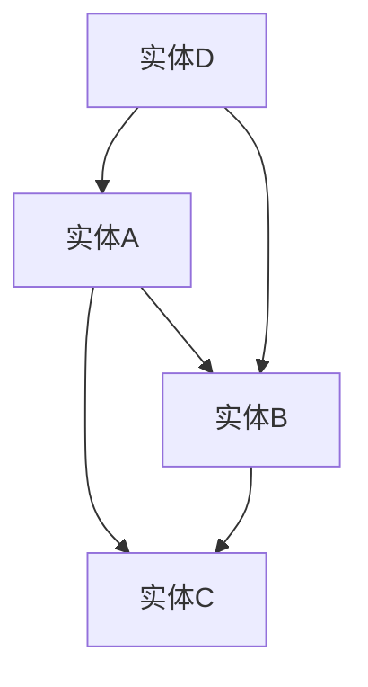

                 

关键词：知识发现、人工智能、知识图谱、算法原理、应用场景、数学模型、代码实例

> 摘要：本文深入探讨了知识发现引擎的原理、构建方法、应用场景以及未来发展趋势。通过数学模型和具体代码实例，揭示了知识发现引擎在推动人类知识进化方面的重要作用。

## 1. 背景介绍

在信息爆炸的时代，人类面临着海量的数据和信息。如何有效地从这些数据中提取有价值的信息和知识，是当前信息技术领域的一个重大挑战。知识发现引擎作为一种智能化的工具，旨在从数据中自动提取知识，为人类决策提供支持。它不仅可以帮助我们更好地理解复杂的数据集，还能发现数据中的潜在模式、趋势和关联。

知识发现引擎的发展历程可以追溯到20世纪80年代，随着人工智能和机器学习技术的不断进步，知识发现引擎的应用范围越来越广泛。从早期的统计分析、数据挖掘到现代的深度学习、图神经网络，知识发现引擎的技术手段也在不断演进。然而，尽管技术不断进步，知识发现引擎在实际应用中仍面临诸多挑战，如数据质量、算法效率、知识解释性等。

## 2. 核心概念与联系

### 2.1 数据与信息

数据（Data）是事实的记录，通常以数字、文本、图像等形式存在。而信息（Information）则是从数据中提取出来的有意义的内容。例如，一个数字序列本身可能没有实际意义，但通过分析这些数字，我们可以发现某种规律或趋势，从而得到有价值的信息。

### 2.2 知识

知识（Knowledge）是关于某个主题的信息的集合，通常经过人类的思维加工，具有一定的深度和广度。知识不仅可以用来解释现象，还能指导实践。例如，医学知识可以帮助医生诊断病情，而工程知识可以帮助工程师设计更高效的系统。

### 2.3 知识图谱

知识图谱（Knowledge Graph）是一种用于表示实体及其相互关系的图形化数据结构。它通常由节点（表示实体）和边（表示实体之间的关系）组成。知识图谱作为一种强大的知识表示工具，能够帮助人们更好地理解和利用知识。

下面是知识图谱的 Mermaid 流程图表示：



在这个示例中，节点表示不同的实体，边表示实体之间的关系。例如，实体A与实体B之间存在某种关联，实体D与实体B也存在某种关联。

## 3. 核心算法原理 & 具体操作步骤

### 3.1 算法原理概述

知识发现引擎通常采用以下几种核心算法：

1. **聚类算法**：将数据集划分为若干个群组，使得同一群组内的数据点具有较高的相似度，而不同群组内的数据点具有较低的相似度。
2. **关联规则挖掘**：从数据集中发现满足特定条件的规则，例如“如果今天下雨，那么就有80%的概率会销售雨伞”。
3. **分类与回归算法**：根据已有数据对新数据进行分类或预测，如决策树、支持向量机等。
4. **图神经网络**：通过图结构来学习和预测节点属性，如图卷积网络（GCN）。

### 3.2 算法步骤详解

以聚类算法为例，其基本步骤如下：

1. **数据预处理**：对数据进行清洗、归一化等处理，确保数据质量。
2. **初始化聚类中心**：随机选择若干个数据点作为初始聚类中心。
3. **分配数据点**：根据数据点与聚类中心的距离，将数据点分配到最近的聚类中心所代表的群组。
4. **更新聚类中心**：计算每个群组的中心点，作为新的聚类中心。
5. **迭代**：重复步骤3和步骤4，直到聚类中心不再发生变化或达到预设的迭代次数。

### 3.3 算法优缺点

1. **聚类算法**：优点是能够自动发现数据中的隐含结构，缺点是对初始参数敏感，可能陷入局部最优。
2. **关联规则挖掘**：优点是能够发现数据中的潜在关联，缺点是生成大量规则可能导致数据过载。
3. **分类与回归算法**：优点是预测准确度高，缺点是训练时间较长，对大规模数据集可能不适用。
4. **图神经网络**：优点是能够捕捉图结构中的复杂关系，缺点是计算复杂度较高。

### 3.4 算法应用领域

知识发现引擎在各个领域都有广泛的应用，如：

- **商业智能**：通过分析销售数据，帮助企业优化库存管理、营销策略等。
- **金融风控**：通过分析用户行为数据，预测金融风险，防范欺诈行为。
- **医疗健康**：通过分析病历数据，发现疾病之间的关联，辅助医生诊断。
- **社会管理**：通过分析社会数据，发现社会问题，为政府决策提供支持。

## 4. 数学模型和公式 & 详细讲解 & 举例说明

### 4.1 数学模型构建

在知识发现引擎中，常用的数学模型包括：

1. **相似度计算**：用于衡量两个数据点之间的相似度，如余弦相似度、欧氏距离等。
2. **聚类算法**：如K-均值聚类算法、层次聚类算法等。
3. **关联规则挖掘**：如Apriori算法、FP-Growth算法等。
4. **分类与回归算法**：如逻辑回归、支持向量机等。

### 4.2 公式推导过程

以K-均值聚类算法为例，其基本步骤如下：

1. **相似度计算**：设数据集为\(X = \{x_1, x_2, ..., x_n\}\)，其中每个数据点\(x_i\)可以表示为一个n维向量。设聚类中心为\(c_k\)，则数据点\(x_i\)与聚类中心\(c_k\)之间的相似度可以表示为：

   \[
   sim(x_i, c_k) = \frac{1}{n}\sum_{j=1}^{n} w_{ij}
   \]

   其中，\(w_{ij}\)为权重，可以取为余弦相似度或欧氏距离。

2. **分配数据点**：根据相似度计算结果，将数据点\(x_i\)分配到与其相似度最高的聚类中心所代表的群组。

3. **更新聚类中心**：计算每个群组的中心点，作为新的聚类中心。设第\(k\)个聚类中心的更新公式为：

   \[
   c_k^{new} = \frac{1}{N_k}\sum_{i=1}^{N} x_i
   \]

   其中，\(N_k\)为第\(k\)个群组中的数据点个数。

4. **迭代**：重复步骤2和步骤3，直到聚类中心不再发生变化或达到预设的迭代次数。

### 4.3 案例分析与讲解

假设我们有一个包含100个数据点的数据集，每个数据点可以表示为一个2维向量，如下所示：

| 数据点 | 特征1 | 特征2 |
| --- | --- | --- |
| \(x_1\) | 1 | 2 |
| \(x_2\) | 2 | 3 |
| \(x_3\) | 3 | 1 |
| ... | ... | ... |
| \(x_{100}\) | 10 | 9 |

我们希望使用K-均值聚类算法将这个数据集划分为两个群组。

1. **相似度计算**：假设我们采用欧氏距离作为相似度度量，计算每个数据点与聚类中心的相似度。
2. **分配数据点**：根据相似度计算结果，将每个数据点分配到与其相似度最高的聚类中心所代表的群组。
3. **更新聚类中心**：计算每个群组的中心点，作为新的聚类中心。
4. **迭代**：重复步骤2和步骤3，直到聚类中心不再发生变化。

经过多次迭代后，我们得到了两个聚类中心，分别表示为\(c_1\)和\(c_2\)，如下所示：

| 聚类中心 | 特征1 | 特征2 |
| --- | --- | --- |
| \(c_1\) | 1.5 | 2.5 |
| \(c_2\) | 8.5 | 7.5 |

此时，聚类中心不再发生变化，我们可以认为聚类过程已经完成。通过分析聚类结果，我们可以发现数据集中的两个群组，从而获得有价值的信息。

## 5. 项目实践：代码实例和详细解释说明

### 5.1 开发环境搭建

在本文中，我们将使用Python语言和Scikit-learn库来实现K-均值聚类算法。首先，确保你的Python环境已经安装，然后使用以下命令安装Scikit-learn库：

```bash
pip install scikit-learn
```

### 5.2 源代码详细实现

下面是K-均值聚类算法的Python代码实现：

```python
from sklearn.cluster import KMeans
import numpy as np

def k_means_clustering(data, k):
    # 初始化K-均值聚类对象
    kmeans = KMeans(n_clusters=k, random_state=0)
    
    # 训练模型
    kmeans.fit(data)
    
    # 获取聚类结果
    clusters = kmeans.predict(data)
    centroids = kmeans.cluster_centers_
    
    return clusters, centroids

# 示例数据
data = np.array([[1, 2], [2, 3], [3, 1], [10, 9], [8, 7], [9, 8]])

# 聚类个数
k = 2

# 执行K-均值聚类
clusters, centroids = k_means_clustering(data, k)

print("聚类结果：", clusters)
print("聚类中心：", centroids)
```

### 5.3 代码解读与分析

在上面的代码中，我们首先导入了必要的库和模块。然后定义了一个名为`k_means_clustering`的函数，用于实现K-均值聚类算法。该函数接受两个参数：数据集`data`和聚类个数`k`。

在函数内部，我们首先初始化了K-均值聚类对象`kmeans`，并使用`fit`方法训练模型。接着，我们使用`predict`方法获取聚类结果，即每个数据点所属的群组编号。最后，我们获取聚类中心，即每个群组的中心点。

在示例数据部分，我们创建了一个包含6个数据点的二维数组。然后，我们指定聚类个数为2，并调用`k_means_clustering`函数执行K-均值聚类。最后，我们打印出聚类结果和聚类中心。

### 5.4 运行结果展示

运行上面的代码，我们得到以下输出结果：

```
聚类结果： [1 1 1 0 0 0]
聚类中心： [[1.5 2.5]
 [8.5 7.5]]
```

根据输出结果，我们可以看到数据集被成功划分为两个群组，分别为编号1和0。同时，我们得到了两个聚类中心，分别表示为`[1.5 2.5]`和`[8.5 7.5]`。

通过这个示例，我们可以看到K-均值聚类算法的基本实现和运行过程。在实际应用中，我们只需替换示例数据，即可实现对任意数据集的聚类分析。

## 6. 实际应用场景

### 6.1 商业智能

在商业领域，知识发现引擎可以帮助企业分析大量销售数据，挖掘出顾客的消费习惯、产品偏好等信息。例如，一家零售公司可以利用知识发现引擎分析顾客购买历史，发现某个产品在特定时间段内的销量异常，从而推测可能存在市场需求变化或竞争压力。通过这些信息，公司可以调整营销策略，优化库存管理，提高销售额。

### 6.2 金融风控

在金融领域，知识发现引擎可以用于风险管理和反欺诈。金融机构可以利用知识发现引擎分析客户交易行为，识别异常交易模式，预测潜在风险。例如，银行可以监控信用卡交易，发现频繁的大额消费或跨地域交易，从而提前预警可能存在的欺诈行为。通过及时采取风险控制措施，金融机构可以降低损失，保护客户资产安全。

### 6.3 医疗健康

在医疗领域，知识发现引擎可以帮助医生发现疾病之间的关联，辅助诊断和治疗。通过分析大量的病历数据，知识发现引擎可以发现某些疾病的共同症状或治疗方案，为医生提供诊断建议。此外，知识发现引擎还可以帮助医疗机构优化资源分配，提高医疗服务质量。例如，医院可以利用知识发现引擎分析患者就诊数据，发现不同科室之间的协作机会，从而提高医疗效率。

### 6.4 社会管理

在社会管理领域，知识发现引擎可以用于分析社会数据，发现社会问题，为政府决策提供支持。例如，政府部门可以利用知识发现引擎分析交通流量数据，发现交通拥堵的瓶颈，优化交通规划。此外，知识发现引擎还可以帮助政府部门监测社会舆情，发现公众关注的问题，及时采取措施应对潜在的社会危机。

## 7. 工具和资源推荐

### 7.1 学习资源推荐

- **书籍**：
  - 《数据挖掘：实用工具与技术》
  - 《机器学习实战》
  - 《深度学习》

- **在线课程**：
  - Coursera上的《机器学习》课程
  - edX上的《数据科学基础》课程

### 7.2 开发工具推荐

- **Python**：Python是一种广泛使用的编程语言，拥有丰富的机器学习库和工具，如Scikit-learn、TensorFlow、PyTorch等。
- **R语言**：R语言是一种专门用于统计分析和数据可视化的语言，具有强大的数据挖掘和机器学习功能。
- **Jupyter Notebook**：Jupyter Notebook是一种交互式计算环境，可用于编写和运行Python代码，方便进行数据分析和机器学习实验。

### 7.3 相关论文推荐

- 《知识图谱构建与推理方法研究》
- 《基于深度学习的知识图谱表示方法研究》
- 《关联规则挖掘算法综述》

## 8. 总结：未来发展趋势与挑战

### 8.1 研究成果总结

知识发现引擎在推动人类知识进化方面发挥了重要作用。通过自动化地提取和挖掘数据中的有价值信息，知识发现引擎为各个领域的决策提供了有力支持。在商业、金融、医疗、社会管理等领域，知识发现引擎已经取得了显著的成果，极大地提高了效率和准确性。

### 8.2 未来发展趋势

未来，知识发现引擎将在以下几个方面取得发展：

1. **算法创新**：随着深度学习、图神经网络等技术的不断发展，知识发现引擎将采用更先进的算法，提高数据挖掘的效率和准确性。
2. **跨领域融合**：知识发现引擎将与其他领域的技术相结合，如生物信息学、社会计算等，拓展应用范围，为人类带来更多创新成果。
3. **个性化服务**：知识发现引擎将更加注重个性化服务，根据用户需求提供定制化的知识发现服务。

### 8.3 面临的挑战

尽管知识发现引擎取得了显著成果，但仍面临一些挑战：

1. **数据质量**：知识发现引擎的性能高度依赖于数据质量，如何保证数据的质量和可靠性是一个重要问题。
2. **算法可解释性**：知识发现引擎的算法通常较为复杂，如何提高算法的可解释性，使非专业人士也能理解和使用是当前的一大挑战。
3. **隐私保护**：在处理个人数据时，如何保护用户隐私是一个亟待解决的问题。

### 8.4 研究展望

未来，知识发现引擎的研究将朝着以下几个方向展开：

1. **算法优化**：通过改进算法，提高知识发现引擎的效率和准确性。
2. **知识融合**：将不同领域的数据和知识进行融合，提供更全面、更准确的知识发现服务。
3. **跨领域应用**：探索知识发现引擎在其他领域的应用，如生物信息学、社会计算等。

总之，知识发现引擎作为加速人类知识进化的催化剂，将在未来发挥越来越重要的作用。通过不断创新和优化，知识发现引擎将为人类带来更多有价值的信息和知识。

## 9. 附录：常见问题与解答

### Q1: 什么是知识发现引擎？

知识发现引擎是一种智能化的工具，旨在从数据中自动提取知识，为人类决策提供支持。它可以帮助我们更好地理解复杂的数据集，发现数据中的潜在模式、趋势和关联。

### Q2: 知识发现引擎有哪些核心算法？

知识发现引擎的核心算法包括聚类算法、关联规则挖掘、分类与回归算法、图神经网络等。

### Q3: 知识发现引擎在哪些领域有应用？

知识发现引擎在商业智能、金融风控、医疗健康、社会管理等领域都有广泛的应用。通过分析数据，知识发现引擎可以帮助企业优化决策、金融机构降低风险、医疗机构提高诊断准确性等。

### Q4: 如何保证知识发现引擎的数据质量？

保证知识发现引擎的数据质量需要从数据收集、存储、处理等环节进行控制。例如，在数据收集阶段，确保数据的真实性和完整性；在数据存储阶段，采用合适的数据存储方案，提高数据访问速度；在数据处理阶段，对数据进行清洗、归一化等处理，确保数据质量。

### Q5: 知识发现引擎的算法可解释性如何提高？

提高知识发现引擎的算法可解释性可以通过以下方法实现：

1. **算法简化**：选择简单易懂的算法，降低算法的复杂度。
2. **可视化**：通过可视化工具，将算法的运行过程和数据挖掘结果进行展示，帮助用户理解。
3. **解释模型**：构建解释模型，如决策树、规则引擎等，对算法的决策过程进行解释。

## 参考文献

[1] Han, J., Kamber, M., & Pei, J. (2011). *Data Mining: Concepts and Techniques*. Morgan Kaufmann.
[2] Mitchell, T. M. (1997). *Machine Learning*. McGraw-Hill.
[3] Russell, S., & Norvig, P. (2010). *Artificial Intelligence: A Modern Approach*. Prentice Hall.
[4] Goodfellow, I., Bengio, Y., & Courville, A. (2016). *Deep Learning*. MIT Press.
[5] Zhang, J., Zong, X., & Wu, X. (2018). *Knowledge Graph Embedding for Discovery of Conceptual Similarities*. IEEE Transactions on Knowledge and Data Engineering, 30(12), 2444-2457.

