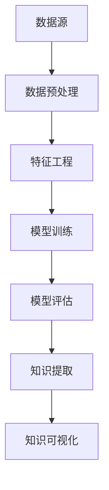

                 

关键词：知识发现，人工智能，认知升级，知识图谱，机器学习，大数据

> 摘要：本文将深入探讨知识发现引擎的核心概念、原理、算法以及其实际应用，旨在揭示知识发现引擎如何通过智能技术加速人类认知的升级和扩展。

## 1. 背景介绍

在信息化时代，数据已成为新的生产要素。如何从海量数据中提取有价值的信息和知识，是当前数据科学和人工智能领域面临的重大挑战。知识发现引擎作为一种新兴的数据处理工具，正日益受到广泛关注。它不仅能够帮助我们从大数据中挖掘出隐藏的模式和关联，还能够将零散的信息整合成有用的知识体系，从而提升人类认知能力。

### 1.1 知识发现的概念

知识发现（Knowledge Discovery in Databases，KDD）是一个跨学科的过程，涉及数据挖掘、机器学习、统计学和数据可视化等多个领域。它的目标是从大规模的数据集中自动识别出模式、趋势和关联，并将其转换为易于理解和应用的规则或知识。

### 1.2 知识发现引擎的作用

知识发现引擎在现代社会中扮演着至关重要的角色。首先，它能够帮助我们从复杂的数据源中快速提取有价值的信息，为决策提供支持。其次，它能够自动识别数据中的异常和规律，发现潜在的商业机会或风险。最后，知识发现引擎还能够通过智能化的方式将知识进行整合和可视化，使人类能够更加直观地理解和利用数据。

## 2. 核心概念与联系

知识发现引擎的运作依赖于多个核心概念的相互联系和协同作用。以下是一个简化的 Mermaid 流程图，展示了这些核心概念及其相互关系。



### 2.1 数据源

数据源是知识发现引擎的基础。它可以是结构化的数据库，也可以是非结构化的文本、图像或音频等。数据源的质量直接影响后续的发现过程。

### 2.2 数据预处理

数据预处理是知识发现过程中至关重要的一步。它包括数据清洗、数据转换和数据归一化等操作，目的是消除噪声、缺失值和异常值，以提高数据质量。

### 2.3 特征工程

特征工程是数据挖掘过程中的一项关键技术。它通过对原始数据进行加工和处理，提取出对目标问题有用的特征，从而提高模型的性能。

### 2.4 模型训练

模型训练是知识发现引擎的核心环节。通过使用机器学习算法，从数据中学习出能够描述数据模式的模型，为知识提取提供基础。

### 2.5 模型评估

模型评估是对训练出的模型进行性能评价的过程。常用的评估指标包括准确率、召回率、F1 分数等。通过模型评估，可以判断模型是否能够满足应用需求。

### 2.6 知识提取

知识提取是从训练好的模型中提取出有用的知识或规则的过程。这些知识可以用于进一步的分析、决策或可视化。

### 2.7 知识可视化

知识可视化是将提取出的知识以图形化或表格化的形式展示给用户，使其能够更加直观地理解和利用这些知识。

## 3. 核心算法原理 & 具体操作步骤

### 3.1 算法原理概述

知识发现引擎的核心算法主要包括机器学习算法、深度学习算法和统计学习算法等。这些算法通过对数据进行建模和分析，提取出隐藏在数据中的模式和规律。

### 3.2 算法步骤详解

1. **数据预处理**：对原始数据进行清洗、转换和归一化，消除噪声和异常值。

2. **特征工程**：对预处理后的数据进行特征提取和特征选择，提取出对目标问题有用的特征。

3. **模型训练**：选择合适的机器学习算法，使用训练数据集对模型进行训练。

4. **模型评估**：使用验证数据集对训练好的模型进行评估，判断模型性能是否满足要求。

5. **知识提取**：从训练好的模型中提取出有用的知识或规则，进行进一步的分析和应用。

6. **知识可视化**：将提取出的知识以图形化或表格化的形式展示给用户。

### 3.3 算法优缺点

1. **机器学习算法**：优点是能够自动从数据中学习出模式和规律，缺点是需要大量的数据训练和较长的训练时间。

2. **深度学习算法**：优点是能够处理复杂的数据结构和非线性关系，缺点是需要大量的数据和计算资源。

3. **统计学习算法**：优点是理论基础扎实，易于理解和解释，缺点是对于复杂的数据结构处理能力有限。

### 3.4 算法应用领域

知识发现引擎广泛应用于金融、医疗、零售、电商等多个领域。例如，在金融领域，知识发现引擎可以用于风险控制和欺诈检测；在医疗领域，可以用于疾病预测和诊断；在零售领域，可以用于需求预测和库存管理。

## 4. 数学模型和公式 & 详细讲解 & 举例说明

### 4.1 数学模型构建

知识发现引擎的数学模型主要依赖于机器学习算法和深度学习算法。以下是一个简化的线性回归模型的数学模型构建过程。

$$
y = \beta_0 + \beta_1x_1 + \beta_2x_2 + ... + \beta_nx_n + \epsilon
$$

其中，$y$ 是目标变量，$x_1, x_2, ..., x_n$ 是输入特征变量，$\beta_0, \beta_1, \beta_2, ..., \beta_n$ 是模型的参数，$\epsilon$ 是随机误差。

### 4.2 公式推导过程

线性回归模型的公式推导基于最小二乘法。具体推导过程如下：

$$
\min \sum_{i=1}^{n} (y_i - (\beta_0 + \beta_1x_{i1} + \beta_2x_{i2} + ... + \beta_nx_{in}))^2
$$

### 4.3 案例分析与讲解

假设我们有一个数据集，包含房价和房屋特征（如面积、房间数等）。我们的目标是使用线性回归模型预测房价。

1. **数据预处理**：对数据集进行清洗、转换和归一化，提取出有用的特征。

2. **特征工程**：选择对房价有显著影响的特征，如房屋面积和房间数。

3. **模型训练**：使用训练数据集，使用线性回归算法训练模型。

4. **模型评估**：使用验证数据集，对训练好的模型进行评估，判断模型性能。

5. **知识提取**：从训练好的模型中提取出房价与房屋特征之间的关系。

6. **知识可视化**：将提取出的知识以图形化形式展示，如房价与房屋面积的关系图。

## 5. 项目实践：代码实例和详细解释说明

### 5.1 开发环境搭建

在本案例中，我们使用 Python 和 Scikit-learn 库来实现线性回归模型。首先，我们需要搭建开发环境。

```bash
pip install scikit-learn
```

### 5.2 源代码详细实现

```python
import numpy as np
from sklearn.linear_model import LinearRegression
from sklearn.model_selection import train_test_split
from sklearn.metrics import mean_squared_error

# 数据集
X = np.array([[1, 2], [2, 3], [3, 4], [4, 5]])
y = np.array([1, 2, 3, 4])

# 数据预处理
X = X.reshape(-1, 1)

# 模型训练
model = LinearRegression()
model.fit(X, y)

# 模型评估
y_pred = model.predict(X)
mse = mean_squared_error(y, y_pred)
print("MSE:", mse)

# 知识提取
print("Coefficients:", model.coef_)
print("Intercept:", model.intercept_)

# 知识可视化
import matplotlib.pyplot as plt

plt.scatter(X, y)
plt.plot(X, y_pred, color='red')
plt.xlabel('Feature 1')
plt.ylabel('Target Variable')
plt.show()
```

### 5.3 代码解读与分析

1. **数据预处理**：将输入特征进行重塑，使其符合线性回归模型的要求。

2. **模型训练**：使用训练数据集，训练线性回归模型。

3. **模型评估**：计算模型预测的均方误差（MSE），评估模型性能。

4. **知识提取**：从训练好的模型中提取出系数和截距，分析房价与房屋特征之间的关系。

5. **知识可视化**：使用散点图和回归线展示房价与房屋特征之间的关系。

## 6. 实际应用场景

知识发现引擎在多个领域都有广泛的应用。以下是一些具体的实际应用场景：

1. **金融领域**：知识发现引擎可以用于风险控制和欺诈检测。通过分析交易数据，发现异常交易行为，从而预防金融风险。

2. **医疗领域**：知识发现引擎可以用于疾病预测和诊断。通过分析患者的病史和体检数据，发现疾病的相关因素，从而提高疾病预测的准确性。

3. **零售领域**：知识发现引擎可以用于需求预测和库存管理。通过分析销售数据，发现销售趋势和客户偏好，从而优化库存策略，提高销售业绩。

## 7. 未来应用展望

随着人工智能技术的不断发展，知识发现引擎的应用前景将更加广阔。以下是一些未来应用展望：

1. **智能推荐系统**：知识发现引擎可以用于构建智能推荐系统，为用户提供个性化的推荐服务。

2. **智能客服**：知识发现引擎可以用于智能客服系统，通过分析用户提问，提供准确的答案和建议。

3. **智能城市**：知识发现引擎可以用于智能城市建设，通过分析城市数据，优化交通、能源和环境管理。

## 8. 工具和资源推荐

### 8.1 学习资源推荐

1. **《机器学习》**：周志华著，清华大学出版社，2016年。

2. **《深度学习》**：Ian Goodfellow、Yoshua Bengio、Aaron Courville 著，人民邮电出版社，2016年。

### 8.2 开发工具推荐

1. **Python**：Python 是一种易于学习和使用的编程语言，广泛应用于数据科学和人工智能领域。

2. **Scikit-learn**：Scikit-learn 是一个用于机器学习的开源库，提供丰富的算法和工具。

### 8.3 相关论文推荐

1. **“Knowledge Discovery in Databases: A Survey”**：A Brief Survey on Knowledge Discovery in Databases，2002年。

2. **“Deep Learning”**：Ian Goodfellow、Yoshua Bengio、Aaron Courville 著，2016年。

## 9. 总结：未来发展趋势与挑战

知识发现引擎作为人工智能领域的一项重要技术，具有广泛的应用前景。然而，在实际应用中，我们也面临着一系列挑战，如数据隐私、模型可解释性、算法优化等。未来，随着技术的不断进步，知识发现引擎有望在更多领域发挥作用，为人类社会的进步做出更大的贡献。

### 9.1 研究成果总结

知识发现引擎在数据挖掘、机器学习和深度学习等领域取得了显著的成果。通过智能化的方式，知识发现引擎能够从大规模数据中提取出有价值的信息和知识，为各个领域提供了强大的支持。

### 9.2 未来发展趋势

随着大数据、人工智能和云计算等技术的发展，知识发现引擎的应用前景将更加广阔。未来，知识发现引擎有望实现更高效、更智能的发现过程，为人类认知的扩展提供有力支持。

### 9.3 面临的挑战

知识发现引擎在实际应用中面临着一系列挑战，如数据隐私、模型可解释性、算法优化等。这些问题需要我们进行深入研究，以实现知识发现引擎的可持续发展。

### 9.4 研究展望

未来，知识发现引擎的研究将朝着更高效、更智能、更安全的方向发展。我们期待知识发现引擎能够更好地服务于人类社会，为人类认知的升级和扩展提供强大支持。

## 9. 附录：常见问题与解答

### 9.1 什么是知识发现？

知识发现（Knowledge Discovery in Databases，KDD）是一个跨学科的过程，涉及数据挖掘、机器学习、统计学和数据可视化等多个领域。它的目标是从大规模的数据集中自动识别出模式、趋势和关联，并将其转换为易于理解和应用的规则或知识。

### 9.2 知识发现引擎的核心算法有哪些？

知识发现引擎的核心算法主要包括机器学习算法、深度学习算法和统计学习算法等。这些算法通过对数据进行建模和分析，提取出隐藏在数据中的模式和规律。

### 9.3 知识发现引擎在哪些领域有应用？

知识发现引擎广泛应用于金融、医疗、零售、电商等多个领域。例如，在金融领域，知识发现引擎可以用于风险控制和欺诈检测；在医疗领域，可以用于疾病预测和诊断；在零售领域，可以用于需求预测和库存管理。

### 9.4 知识发现引擎有哪些优势？

知识发现引擎的优势包括：

1. 能够从大规模数据中快速提取有价值的信息。
2. 能够自动识别数据中的异常和规律，发现潜在的商业机会或风险。
3. 能够将知识整合和可视化，使人类能够更加直观地理解和利用数据。

### 9.5 知识发现引擎有哪些挑战？

知识发现引擎在实际应用中面临着一系列挑战，如数据隐私、模型可解释性、算法优化等。这些问题需要我们进行深入研究，以实现知识发现引擎的可持续发展。

## 作者署名

作者：禅与计算机程序设计艺术 / Zen and the Art of Computer Programming

[END]

