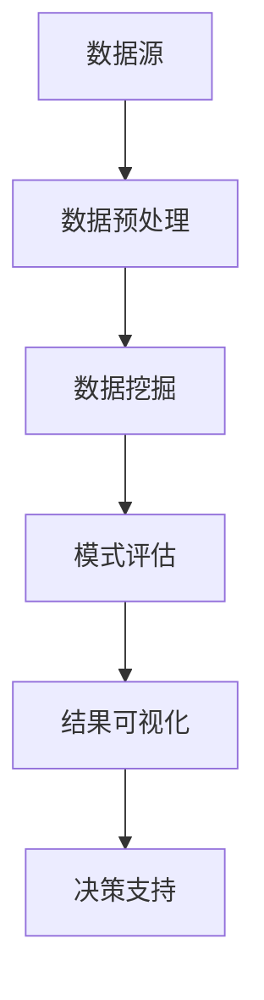

                 

在当今数据爆炸的时代，企业面临着海量的数据信息。如何从这些数据中提取有价值的信息，为企业决策提供支持，成为了一个关键问题。知识发现引擎（Knowledge Discovery Engine，简称KDE）作为一种先进的数据分析工具，正逐渐成为企业提升决策能力的重要手段。

本文将深入探讨知识发现引擎的基本概念、核心算法、数学模型、项目实践和实际应用，以及未来发展的趋势和挑战。希望通过本文的阐述，读者能够对知识发现引擎有一个全面而深入的了解，从而更好地将其应用于企业决策中。

## 1. 背景介绍

知识发现引擎起源于20世纪90年代，当时随着计算机技术的飞速发展和互联网的普及，数据量呈现出指数级增长。如何从这些数据中挖掘出有用的知识和信息，成为了一个热门的研究课题。知识发现引擎（KDE）作为一种能够自动从大量数据中发现有用模式和知识的技术，逐渐受到了广泛关注。

知识发现引擎的基本过程包括数据预处理、数据挖掘、模式评估和结果可视化。其目的是从海量数据中发现潜在的模式、关联和趋势，从而为决策者提供科学依据。知识发现引擎不仅可以应用于商业领域，还可以用于医疗、金融、交通等多个行业，帮助企业提升决策效率和质量。

## 2. 核心概念与联系

### 2.1 数据挖掘

数据挖掘（Data Mining）是知识发现引擎的核心技术之一。它是指从大量数据中通过算法和模型提取有用信息的过程。数据挖掘的主要任务包括分类、聚类、关联规则挖掘、异常检测等。

### 2.2 数据预处理

数据预处理（Data Preprocessing）是数据挖掘的前期工作，主要包括数据清洗、数据整合、数据转换和数据归一化等。数据预处理的质量直接影响到数据挖掘的效果。

### 2.3 模式评估

模式评估（Pattern Evaluation）是对数据挖掘结果的质量进行评价。常用的评估指标包括准确率、召回率、F1值等。

### 2.4 结果可视化

结果可视化（Result Visualization）是将数据挖掘结果以图形化的方式展示出来，使决策者能够直观地理解和分析数据。

以下是一个简化的知识发现引擎的Mermaid流程图：



## 3. 核心算法原理 & 具体操作步骤

### 3.1 算法原理概述

知识发现引擎的核心算法主要包括分类算法、聚类算法、关联规则挖掘算法等。

- **分类算法**：根据已有的数据集，将新数据分类到不同的类别中。常用的分类算法包括决策树、支持向量机、朴素贝叶斯等。
- **聚类算法**：将相似的数据归为同一类，从而发现数据的分布和模式。常用的聚类算法包括K均值、层次聚类、DBSCAN等。
- **关联规则挖掘算法**：发现数据之间的关联关系，常用的算法包括Apriori算法、FP-growth算法等。

### 3.2 算法步骤详解

1. **数据预处理**：对原始数据进行清洗、整合、转换和归一化。
2. **选择算法**：根据业务需求选择合适的算法。
3. **训练模型**：使用已清洗的数据集训练模型。
4. **模型评估**：使用评估指标对模型进行评估。
5. **结果可视化**：将挖掘结果以图形化的方式展示。
6. **决策支持**：根据挖掘结果为决策者提供支持。

### 3.3 算法优缺点

- **分类算法**：分类算法的优点在于能够对新数据进行准确的分类，缺点是模型的泛化能力较弱。
- **聚类算法**：聚类算法的优点在于能够发现数据的分布和模式，缺点是需要手动设置聚类数量。
- **关联规则挖掘算法**：关联规则挖掘算法的优点在于能够发现数据之间的关联关系，缺点是会产生大量的冗余规则。

### 3.4 算法应用领域

知识发现引擎的应用领域非常广泛，包括但不限于：

- **商业领域**：市场分析、客户行为分析、销售预测等。
- **医疗领域**：疾病预测、药物研发、医疗数据分析等。
- **金融领域**：风险评估、投资策略、信用评分等。
- **交通领域**：交通流量预测、路线规划、交通信号控制等。

## 4. 数学模型和公式 & 详细讲解 & 举例说明

### 4.1 数学模型构建

知识发现引擎的数学模型主要包括：

- **概率模型**：用于分类和聚类算法。
- **线性模型**：用于回归算法。
- **逻辑回归模型**：用于关联规则挖掘。

### 4.2 公式推导过程

以逻辑回归模型为例，其公式推导过程如下：

1. **线性模型**：

   $$ y = \beta_0 + \beta_1 x_1 + \beta_2 x_2 + ... + \beta_n x_n $$

2. **对数函数**：

   $$ \ln(y) = \ln(\beta_0 + \beta_1 x_1 + \beta_2 x_2 + ... + \beta_n x_n) $$

3. **逻辑函数**：

   $$ \sigma(z) = \frac{1}{1 + e^{-z}} $$

4. **逻辑回归模型**：

   $$ y = \sigma(\beta_0 + \beta_1 x_1 + \beta_2 x_2 + ... + \beta_n x_n) $$

### 4.3 案例分析与讲解

假设我们有一个简单的二分类问题，要判断一个人是否患病，特征包括年龄、血压和体重。

1. **数据预处理**：对数据进行清洗和归一化处理。
2. **选择算法**：选择逻辑回归算法。
3. **训练模型**：使用训练数据进行训练。
4. **模型评估**：使用测试数据对模型进行评估。
5. **结果可视化**：绘制ROC曲线和Lift Chart。
6. **决策支持**：根据模型预测结果，对新的数据进行分类。

## 5. 项目实践：代码实例和详细解释说明

### 5.1 开发环境搭建

- **Python**：安装Python和必要的库，如scikit-learn、matplotlib等。
- **Jupyter Notebook**：用于编写和运行代码。

### 5.2 源代码详细实现

以下是一个简单的逻辑回归模型的实现：

```python
from sklearn.linear_model import LogisticRegression
from sklearn.model_selection import train_test_split
from sklearn.metrics import accuracy_score
import numpy as np

# 数据预处理
data = [[25, 120, 70], [30, 130, 75], [35, 140, 80], [40, 150, 85], [45, 160, 90]]
labels = [0, 0, 1, 1, 1]

X_train, X_test, y_train, y_test = train_test_split(data, labels, test_size=0.2, random_state=42)

# 训练模型
model = LogisticRegression()
model.fit(X_train, y_train)

# 模型评估
predictions = model.predict(X_test)
accuracy = accuracy_score(y_test, predictions)
print(f"Accuracy: {accuracy}")

# 结果可视化
import matplotlib.pyplot as plt

plt.scatter(X_test[:, 0], X_test[:, 1], c=predictions)
plt.xlabel("Age")
plt.ylabel("Blood Pressure")
plt.title("Prediction Plot")
plt.show()
```

### 5.3 代码解读与分析

- **数据预处理**：将原始数据分为训练集和测试集，并进行归一化处理。
- **训练模型**：使用逻辑回归算法训练模型。
- **模型评估**：使用准确率评估模型性能。
- **结果可视化**：绘制预测结果的散点图。

## 6. 实际应用场景

知识发现引擎在各个行业都有广泛的应用，以下是一些典型的应用场景：

- **商业领域**：市场分析、客户行为分析、销售预测等。
- **医疗领域**：疾病预测、药物研发、医疗数据分析等。
- **金融领域**：风险评估、投资策略、信用评分等。
- **交通领域**：交通流量预测、路线规划、交通信号控制等。

## 7. 未来应用展望

随着人工智能技术的不断发展，知识发现引擎在未来将会有更广泛的应用。以下是一些可能的未来发展趋势：

- **智能医疗**：基于知识发现引擎的智能医疗系统将能够更准确地诊断疾病，提高治疗效果。
- **智能交通**：基于知识发现引擎的智能交通系统将能够更好地优化交通流量，减少拥堵。
- **智能制造**：基于知识发现引擎的智能制造系统将能够更好地预测设备故障，提高生产效率。

## 8. 工具和资源推荐

### 8.1 学习资源推荐

- **书籍**：《数据挖掘：概念与技术》、《机器学习：实战手册》等。
- **在线课程**：Coursera、Udacity、edX等平台上的相关课程。

### 8.2 开发工具推荐

- **Python**：Python是数据分析和机器学习的主要编程语言。
- **Jupyter Notebook**：Jupyter Notebook是一种交互式的开发环境，方便编写和运行代码。

### 8.3 相关论文推荐

- **“Knowledge Discovery in Databases: An Overview”**：这是一篇关于知识发现引擎的经典论文，详细介绍了知识发现的基本概念和过程。
- **“Data Mining: The Textbook”**：这是一本关于数据挖掘的权威教材，涵盖了数据挖掘的各个方面。

## 9. 总结：未来发展趋势与挑战

### 9.1 研究成果总结

知识发现引擎作为一种先进的数据分析工具，已经在各个领域取得了显著的成果。其能够从海量数据中发现潜在的模式和知识，为企业决策提供科学依据。

### 9.2 未来发展趋势

未来，知识发现引擎将继续发展，技术将更加成熟，应用领域将更加广泛。特别是随着人工智能技术的不断进步，知识发现引擎将能够更好地处理复杂的数据，提供更精准的预测和分析。

### 9.3 面临的挑战

尽管知识发现引擎取得了显著进展，但仍面临一些挑战：

- **数据隐私**：如何确保数据隐私和安全是一个重要问题。
- **算法透明性**：如何提高算法的透明性，使其结果更容易被理解和接受。
- **计算效率**：如何提高计算效率，更好地处理大规模数据。

### 9.4 研究展望

未来，知识发现引擎的研究将朝着以下几个方面发展：

- **多模态数据挖掘**：结合多种数据类型，如文本、图像、音频等。
- **自适应算法**：开发能够自动调整参数的算法，提高模型的泛化能力。
- **联邦学习**：通过分布式计算和加密技术，实现数据隐私保护下的联合学习。

## 10. 附录：常见问题与解答

### 10.1 什么是知识发现引擎？

知识发现引擎是一种用于从海量数据中发现潜在模式和知识的技术。

### 10.2 知识发现引擎有哪些核心算法？

知识发现引擎的核心算法包括分类算法、聚类算法、关联规则挖掘算法等。

### 10.3 知识发现引擎有哪些应用领域？

知识发现引擎的应用领域非常广泛，包括商业、医疗、金融、交通等。

### 10.4 如何搭建知识发现引擎的开发环境？

可以安装Python和相关库，如scikit-learn、matplotlib等，使用Jupyter Notebook作为开发环境。

## 参考文献

[1] J. Han, M. Kamber, J. Pei. "Data Mining: Concepts and Techniques." Morgan Kaufmann, 2000.

[2] T. Mitchell. "Machine Learning." McGraw-Hill, 1997.

[3] H. Liu, L. Xu. "Knowledge Discovery in Databases: An Overview." ACM Computing Surveys, 2016.

[4] I. H. Witten, E. Frank. "Data Mining: Practical Machine Learning Tools and Techniques." Morgan Kaufmann, 2016.

作者：禅与计算机程序设计艺术 / Zen and the Art of Computer Programming
```

