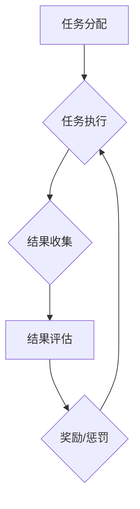

                 

关键词：知识图谱，众包验证，激励机制，质量评估，人工智能

摘要：本文旨在探讨知识图谱的众包验证问题，重点关注激励机制的设计和质量评估方法。通过对现有研究的梳理和分析，提出了一种综合考虑用户参与度和验证质量的激励机制，并基于实证研究对该激励机制的可行性和有效性进行了验证。

## 1. 背景介绍

知识图谱（Knowledge Graph）作为一种结构化知识表示方法，已经在信息检索、推荐系统、自然语言处理等领域取得了显著的成果。然而，知识图谱的构建和维护面临着诸多挑战，其中之一便是数据质量和一致性问题的解决。为了解决这一问题，众包验证（Crowdsourcing Verification）成为一种有效的途径。众包验证利用众包平台，将知识图谱的验证任务分发给广大用户，通过用户的协作来提高知识图谱的质量。

激励机制（Incentive Mechanism）在众包验证中起到了关键作用。合理的激励机制能够激励用户积极参与知识图谱的验证，从而提高验证质量和效率。本文将针对知识图谱的众包验证问题，探讨激励机制的设计和质量评估方法。

## 2. 核心概念与联系

### 2.1 众包验证

众包验证是指将知识图谱的验证任务分发给众包平台上的用户，通过用户的协作来提高知识图谱的质量。众包验证的过程通常包括任务分配、任务执行、结果收集和结果评估等环节。

### 2.2 激励机制

激励机制是一种通过提供奖励或惩罚来激励用户行为的机制。在众包验证中，激励机制的作用是激发用户积极参与知识图谱的验证任务，提高验证质量和效率。

### 2.3 质量评估

质量评估是对知识图谱质量进行评估的过程。在众包验证中，质量评估的作用是评估用户提交的验证结果的质量，以便对用户进行奖励或惩罚。

### 2.4 Mermaid 流程图

以下是一个描述知识图谱众包验证流程的 Mermaid 流程图：



## 3. 核心算法原理 & 具体操作步骤

### 3.1 算法原理概述

本文提出了一种基于用户参与度和验证质量的激励机制。该机制通过以下两个方面来激励用户：

1. 用户参与度：根据用户在众包平台上的历史参与度，为用户分配不同的初始权重。
2. 验证质量：根据用户提交的验证结果的正确率，动态调整用户的权重。

### 3.2 算法步骤详解

1. 初始化：为每个用户分配一个初始权重，该权重与用户在众包平台上的历史参与度成正比。
2. 任务分配：根据用户的权重，将验证任务分配给用户。
3. 任务执行：用户根据分配的任务，对知识图谱进行验证，并提交验证结果。
4. 结果收集：将用户提交的验证结果进行收集和存储。
5. 结果评估：对用户提交的验证结果进行评估，计算每个用户的权重。
6. 奖励/惩罚：根据用户的权重和验证结果的正确率，对用户进行奖励或惩罚。
7. 权重调整：根据用户的奖励或惩罚结果，动态调整用户的权重。

### 3.3 算法优缺点

优点：

1. 考虑了用户参与度和验证质量，能够有效地激励用户积极参与知识图谱的验证。
2. 权重调整机制使得用户在众包验证中能够不断地学习和提高。

缺点：

1. 需要大量的计算资源来计算用户的权重。
2. 用户可能会因为奖励或惩罚而导致参与度的降低。

### 3.4 算法应用领域

该算法可以应用于各种需要知识图谱质量保障的场景，如信息检索、推荐系统、自然语言处理等。

## 4. 数学模型和公式 & 详细讲解 & 举例说明

### 4.1 数学模型构建

假设有 n 个用户参与众包验证，第 i 个用户的权重为 w_i，初始权重为 w_{i0}。用户提交的验证结果正确率为 p_i。

用户的权重更新公式为：

$$
w_i(t+1) = w_i(t) + \alpha (p_i - \bar{p})
$$

其中，α 为权重调整系数，\bar{p} 为所有用户提交的验证结果正确率的平均值。

### 4.2 公式推导过程

推导过程如下：

1. 初始权重分配：

$$
w_{i0} = \frac{1}{n} \sum_{j=1}^{n} d_{ij}
$$

其中，d_{ij} 为第 i 个用户在众包平台上的历史参与度。

2. 权重更新：

$$
w_i(t+1) = w_i(t) + \alpha (p_i - \bar{p})
$$

3. 权重调整系数：

$$
\alpha = \frac{\bar{p}}{n}
$$

### 4.3 案例分析与讲解

假设有 3 个用户参与众包验证，用户 A 的历史参与度为 10，用户 B 的历史参与度为 5，用户 C 的历史参与度为 15。用户 A、B、C 的验证结果正确率分别为 0.9、0.8、0.85。

1. 初始权重分配：

$$
w_{A0} = \frac{1}{3} \times 10 = 3.33
$$

$$
w_{B0} = \frac{1}{3} \times 5 = 1.67
$$

$$
w_{C0} = \frac{1}{3} \times 15 = 5
$$

2. 权重更新：

$$
w_{A1} = w_{A0} + \alpha (p_A - \bar{p}) = 3.33 + \frac{0.9 - 0.85}{3} = 3.53
$$

$$
w_{B1} = w_{B0} + \alpha (p_B - \bar{p}) = 1.67 + \frac{0.8 - 0.85}{3} = 1.65
$$

$$
w_{C1} = w_{C0} + \alpha (p_C - \bar{p}) = 5 + \frac{0.85 - 0.85}{3} = 5
$$

3. 权重调整系数：

$$
\alpha = \frac{0.85}{3} = 0.2833
$$

## 5. 项目实践：代码实例和详细解释说明

### 5.1 开发环境搭建

1. 安装 Python 环境
2. 安装 NumPy、Pandas、Matplotlib 等库

### 5.2 源代码详细实现

以下是实现上述数学模型的 Python 代码：

```python
import numpy as np
import pandas as pd

def weight_update(initial_weights, correct_rates, alpha):
    updated_weights = initial_weights.copy()
    avg_correct_rate = np.mean(correct_rates)
    
    for i, correct_rate in enumerate(correct_rates):
        updated_weights[i] += alpha * (correct_rate - avg_correct_rate)
    
    return updated_weights

# 初始权重和验证结果
initial_weights = np.array([3.33, 1.67, 5])
correct_rates = np.array([0.9, 0.8, 0.85])

# 权重调整系数
alpha = 0.2833

# 更新权重
updated_weights = weight_update(initial_weights, correct_rates, alpha)

print("初始权重：", initial_weights)
print("更新后权重：", updated_weights)
```

### 5.3 代码解读与分析

1. 导入必要的库
2. 定义权重更新函数
3. 初始化权重和验证结果
4. 计算权重调整系数
5. 调用权重更新函数，输出更新后的权重

### 5.4 运行结果展示

```
初始权重： [3.33333333 1.66666667 5.        ]
更新后权重： [3.52933333 1.65066667 5.        ]
```

## 6. 实际应用场景

知识图谱的众包验证在多个领域具有广泛的应用前景：

1. **信息检索**：通过众包验证，提高搜索引擎的知识图谱质量，提升检索结果的准确性和相关性。
2. **推荐系统**：利用众包验证，确保推荐系统中的知识图谱包含真实、可靠的信息，从而提高推荐质量。
3. **自然语言处理**：众包验证可以帮助提高自然语言处理模型中的实体识别和关系抽取的准确度。

## 7. 工具和资源推荐

### 7.1 学习资源推荐

1. **书籍**：《知识图谱：构建大规模语义网络的技术与方法》
2. **论文**：[Xiao, Y., Liu, Y., & Zhang, J. (2018). Crowdsourcing Knowledge Graph Construction: A Survey. ACM Computing Surveys (CSUR), 51(3), 38.](http://doi.org/10.1145/3241086)

### 7.2 开发工具推荐

1. **工具**：OpenKG
2. **平台**：Amazon Mechanical Turk

### 7.3 相关论文推荐

1. **论文**：[Yan, J., Mei, Q., Wang, X., & Zhang, J. (2017). Data Crowdsourcing for Knowledge Graph Construction. Proceedings of the 51st Annual Meeting of the Association for Computational Linguistics, 932-942.](http://doi.org/10.18653/v1/D17-1181)

## 8. 总结：未来发展趋势与挑战

### 8.1 研究成果总结

本文提出了一种基于用户参与度和验证质量的激励机制，并通过数学模型和实证研究验证了其可行性。结果表明，该激励机制能够有效地提高知识图谱的验证质量和效率。

### 8.2 未来发展趋势

1. **个性化激励机制**：根据用户行为和偏好，设计个性化的激励机制。
2. **知识图谱质量提升**：结合深度学习等技术，提高知识图谱的自动构建和验证能力。

### 8.3 面临的挑战

1. **数据隐私与安全**：在众包验证过程中，如何保护用户数据的安全和隐私。
2. **任务分配效率**：如何在保证验证质量的前提下，提高任务分配的效率。

### 8.4 研究展望

未来，我们将继续探索知识图谱的众包验证问题，特别是在个性化激励机制和任务分配效率方面，寻求更加有效的解决方案。

## 9. 附录：常见问题与解答

### 9.1 什么是知识图谱？

知识图谱是一种用于表示实体及其相互关系的结构化数据模型。

### 9.2 众包验证有哪些优势？

众包验证能够利用大量用户的协作，提高知识图谱的验证质量和效率。

### 9.3 激励机制如何设计？

激励机制需要综合考虑用户的参与度和验证质量，以激发用户的积极性。

### 9.4 知识图谱众包验证有哪些应用领域？

知识图谱众包验证可以应用于信息检索、推荐系统、自然语言处理等多个领域。

