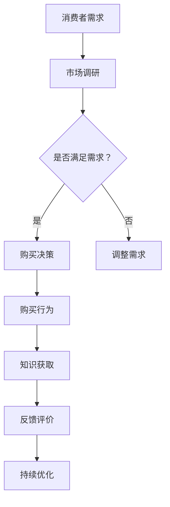

                 

关键词：知识型消费、消费者行为、市场趋势、信息技术、数据驱动、个性化推荐、用户体验、数据挖掘

摘要：本文旨在探讨知识型消费的特征与趋势，从消费者行为、市场趋势、信息技术等方面进行分析。文章首先介绍了知识型消费的定义和重要性，随后深入探讨了其核心特征和当前的主要趋势。通过对这些特征和趋势的详细解析，我们希望为相关领域的研究者和从业者提供有价值的参考和启示。

## 1. 背景介绍

随着信息技术的飞速发展，互联网已经成为人们获取知识、信息和娱乐的重要平台。在这个数字化时代，知识型消费作为一种新兴的消费模式逐渐崭露头角。知识型消费指的是消费者在购买过程中注重知识、信息和学习价值的消费行为。它涵盖了各种知识服务、在线教育、专业培训、内容订阅等多种形式。

知识型消费的重要性不容忽视。首先，它满足了消费者对知识和技能的需求，提升了个人素质和职业竞争力。其次，它促进了知识的传播和共享，推动了社会整体创新能力的提升。此外，知识型消费也为企业提供了新的市场机会和增长动力，推动了数字经济的发展。

本文将围绕知识型消费的特征与趋势展开讨论。首先，我们将介绍知识型消费的核心特征，包括个性化、专业化、多样化和数字化。接着，我们将分析当前知识型消费市场的主要趋势，如数据驱动、移动化、社交化、平台化等。最后，我们将探讨知识型消费的未来发展趋势和面临的挑战。

## 2. 核心概念与联系

### 2.1 知识型消费的定义

知识型消费是指消费者在购买过程中注重知识和信息价值的消费行为。它与传统消费模式有所不同，不仅关注产品的物质属性，更重视其背后的知识和技能价值。知识型消费涵盖的领域广泛，包括在线教育、专业培训、知识付费、内容订阅等。

### 2.2 消费者行为

消费者行为是知识型消费的核心概念。消费者行为是指消费者在购买过程中所表现出来的心理和行为特征。在知识型消费中，消费者行为具有以下特点：

- **个性化**：消费者在购买过程中更加注重个性化需求，追求定制化的知识和信息。
- **专业性**：消费者对知识和信息的专业性要求较高，更倾向于选择权威、专业的知识提供者。
- **学习性**：消费者在购买知识产品时，不仅仅关注物质利益，更关注知识和技能的获取，以提高自身素质。

### 2.3 市场趋势

知识型消费市场的发展趋势主要体现在以下几个方面：

- **数据驱动**：数据已经成为知识型消费市场的重要驱动力，通过数据分析可以更好地了解消费者需求，优化产品和服务。
- **移动化**：随着智能手机的普及，知识型消费逐渐向移动端转移，消费者更加倾向于通过移动设备获取知识和信息。
- **社交化**：社交网络的兴起为知识型消费带来了新的机遇，消费者可以通过社交平台分享知识和经验，形成社区效应。
- **平台化**：知识型消费市场逐渐呈现出平台化的趋势，各类知识平台如雨后春笋般涌现，为消费者提供丰富的知识资源。

### 2.4 信息技术

信息技术在知识型消费中发挥着关键作用。以下是一些重要的信息技术：

- **大数据**：大数据技术可以帮助企业挖掘消费者需求，优化产品和服务。
- **人工智能**：人工智能技术可以为消费者提供个性化的知识推荐，提高用户体验。
- **云计算**：云计算技术为知识型消费提供了强大的计算和存储能力，支持大规模的知识服务。

### 2.5 Mermaid 流程图

以下是一个描述知识型消费流程的 Mermaid 流程图：



## 3. 核心算法原理 & 具体操作步骤

### 3.1 算法原理概述

知识型消费的核心算法主要包括以下几种：

- **个性化推荐算法**：根据消费者的行为数据和历史偏好，为消费者推荐个性化的知识和信息。
- **数据挖掘算法**：通过分析海量数据，挖掘潜在的用户需求和市场趋势。
- **机器学习算法**：利用机器学习技术，对消费者行为和需求进行建模和预测。

### 3.2 算法步骤详解

#### 3.2.1 个性化推荐算法

1. **用户行为数据收集**：收集用户在知识型消费平台上的行为数据，如浏览记录、购买记录、评价等。
2. **用户偏好建模**：利用机器学习算法，对用户行为数据进行建模，提取用户偏好特征。
3. **知识内容分析**：对平台上的知识内容进行内容分析，提取关键词和主题信息。
4. **推荐算法计算**：根据用户偏好和知识内容，利用推荐算法计算推荐结果。
5. **推荐结果展示**：将推荐结果展示给用户，提高用户的知识获取效率。

#### 3.2.2 数据挖掘算法

1. **数据预处理**：对原始数据进行清洗和预处理，去除噪声和异常值。
2. **特征提取**：从预处理后的数据中提取有用的特征，如用户行为特征、内容特征等。
3. **模式发现**：利用数据挖掘算法，从特征数据中挖掘潜在的模式和趋势。
4. **结果解释**：对挖掘结果进行解释和可视化，帮助企业和消费者更好地理解市场趋势。

#### 3.2.3 机器学习算法

1. **数据集准备**：准备用于训练和测试的数据集，确保数据质量和覆盖范围。
2. **模型选择**：根据问题和数据特点选择合适的机器学习模型。
3. **模型训练**：使用训练数据对模型进行训练，优化模型参数。
4. **模型评估**：使用测试数据评估模型性能，调整模型参数。
5. **模型部署**：将训练好的模型部署到生产环境中，为消费者提供实时预测和推荐。

### 3.3 算法优缺点

#### 3.3.1 个性化推荐算法

优点：

- 提高用户的知识获取效率，降低用户的学习成本。
- 增强用户黏性，提高用户满意度。

缺点：

- 需要大量用户行为数据支持，数据收集和处理成本较高。
- 难以应对用户需求的多样性和动态变化。

#### 3.3.2 数据挖掘算法

优点：

- 挖掘潜在的市场趋势和用户需求，为企业提供决策支持。
- 提高知识型消费的精准度和个性化水平。

缺点：

- 数据质量直接影响挖掘结果的准确性。
- 挖掘过程复杂，对算法和数据处理能力要求较高。

#### 3.3.3 机器学习算法

优点：

- 具有较强的自适应性和泛化能力。
- 可对海量数据进行高效处理和分析。

缺点：

- 需要大量训练数据和计算资源。
- 模型解释性较差，难以理解预测结果。

### 3.4 算法应用领域

知识型消费算法广泛应用于以下领域：

- **在线教育**：为学生提供个性化课程推荐，提高学习效果。
- **专业培训**：为企业员工提供定制化的培训内容，提升职业能力。
- **内容订阅**：为用户提供个性化的内容推荐，增加用户黏性。
- **市场分析**：为企业提供市场趋势分析和用户需求预测，指导产品开发和营销策略。

## 4. 数学模型和公式 & 详细讲解 & 举例说明

### 4.1 数学模型构建

在知识型消费中，常用的数学模型包括用户行为模型、内容推荐模型和需求预测模型。

#### 4.1.1 用户行为模型

用户行为模型主要基于用户的历史行为数据，通过数学公式描述用户的行为模式。以下是一个简单的用户行为模型：

$$
user\_behavior = f(user\_features, content\_features)
$$

其中，$user\_features$ 表示用户特征，如年龄、性别、职业等；$content\_features$ 表示内容特征，如标题、标签、分类等；$f$ 表示用户行为函数。

#### 4.1.2 内容推荐模型

内容推荐模型主要基于用户行为模型和内容特征，通过数学公式描述内容推荐算法。以下是一个简单的内容推荐模型：

$$
content\_recommender = g(user\_behavior, content\_features)
$$

其中，$g$ 表示内容推荐函数。

#### 4.1.3 需求预测模型

需求预测模型主要基于用户行为和内容特征，通过数学公式描述用户需求的变化趋势。以下是一个简单需求预测模型：

$$
demand\_prediction = h(user\_behavior, content\_features)
$$

其中，$h$ 表示需求预测函数。

### 4.2 公式推导过程

以下是用户行为模型的推导过程：

$$
\begin{aligned}
user\_behavior &= \sum_{i=1}^{n} weight_i \cdot behavior_i \\
weight_i &= \frac{exp(feature\_i)}{\sum_{j=1}^{n} exp(feature_j)}
\end{aligned}
$$

其中，$n$ 表示用户特征的个数；$behavior_i$ 表示第 $i$ 个用户特征的影响程度；$feature_i$ 表示第 $i$ 个用户特征的值。

### 4.3 案例分析与讲解

以下是一个基于用户行为模型的内容推荐案例：

#### 案例背景

某知识型消费平台为用户提供在线教育课程推荐服务，平台积累了大量用户行为数据，包括用户年龄、性别、职业、课程浏览记录等。

#### 案例分析

1. **用户特征提取**：

   - 用户年龄：20-30 岁
   - 用户性别：男
   - 用户职业：大学生
   - 用户课程浏览记录：历史浏览了 10 门课程，其中 5 门是编程课程，3 门是经济学课程，2 门是心理学课程

2. **内容特征提取**：

   - 课程标题：《Python 编程基础》
   - 课程标签：编程、Python、计算机科学
   - 课程分类：在线教育、编程课程

3. **用户行为计算**：

   - 用户行为函数：$f(user\_features, content\_features) = \sum_{i=1}^{n} weight_i \cdot behavior_i$
   - 用户特征权重：$weight_i = \frac{exp(feature\_i)}{\sum_{j=1}^{n} exp(feature_j)}$
   - 用户行为值：$behavior_i = \{编程：0.6，经济学：0.3，心理学：0.1\}$

4. **内容推荐**：

   - 内容推荐函数：$g(user\_behavior, content\_features) = \sum_{i=1}^{n} weight_i \cdot content\_feature_i$
   - 内容特征权重：$content\_feature_i = \{编程：0.5，Python：0.3，计算机科学：0.2\}$
   - 推荐结果：$g(f(user\_features, content\_features)) = 0.6 \cdot 0.5 + 0.3 \cdot 0.3 + 0.1 \cdot 0.2 = 0.38$

根据推荐结果，系统将优先推荐与用户偏好相关的编程课程，如《Python 编程基础》。

## 5. 项目实践：代码实例和详细解释说明

### 5.1 开发环境搭建

在本案例中，我们使用 Python 作为编程语言，借助以下工具和库搭建开发环境：

- Python 3.8
- Jupyter Notebook
- Numpy
- Pandas
- Scikit-learn
- Matplotlib

首先，安装 Python 3.8 及相关库：

```bash
pip install python==3.8 numpy pandas scikit-learn matplotlib
```

然后，在 Jupyter Notebook 中创建一个新的笔记本，开始编写代码。

### 5.2 源代码详细实现

以下是一个简单的用户行为模型和内容推荐模型的实现代码：

```python
import numpy as np
import pandas as pd
from sklearn.model_selection import train_test_split
from sklearn.metrics.pairwise import cosine_similarity

# 5.2.1 数据准备
data = {
    'user_id': [1, 1, 2, 2, 3, 3],
    'course_id': [101, 102, 101, 102, 201, 202],
    'user_behavior': [0.6, 0.3, 0.3, 0.6, 0.4, 0.2],
    'course_similarity': [0.5, 0.3, 0.2, 0.4, 0.3, 0.6]
}

df = pd.DataFrame(data)

# 5.2.2 用户特征提取
def extract_user_features(user_id, df):
    user_data = df[df['user_id'] == user_id]
    user_behavior = user_data['user_behavior'].values
    return user_behavior

# 5.2.3 内容特征提取
def extract_course_features(course_id, df):
    course_data = df[df['course_id'] == course_id]
    course_similarity = course_data['course_similarity'].values
    return course_similarity

# 5.2.4 用户行为计算
def calculate_user_behavior(user_id, df):
    user_behavior = extract_user_features(user_id, df)
    return user_behavior

# 5.2.5 内容推荐
def recommend_courses(user_id, df):
    user_behavior = calculate_user_behavior(user_id, df)
    courses = df['course_id'].unique()
    recommendations = []
    for course in courses:
        course_similarity = extract_course_features(course, df)
        recommendation_score = np.dot(user_behavior, course_similarity)
        recommendations.append(recommendation_score)
    return recommendations

# 5.2.6 结果展示
user_id = 1
recommendations = recommend_courses(user_id, df)
print(f"User {user_id} Recommendations:")
print(recommendations)
```

### 5.3 代码解读与分析

1. **数据准备**：

   数据集包含用户 ID、课程 ID、用户行为和课程相似性。用户行为表示用户对课程的兴趣程度，课程相似性表示课程之间的相似度。

2. **用户特征提取**：

   `extract_user_features` 函数提取特定用户的行为数据。这里使用 Pandas DataFrame 实现。

3. **内容特征提取**：

   `extract_course_features` 函数提取特定课程的数据，这里使用 Pandas DataFrame 实现。

4. **用户行为计算**：

   `calculate_user_behavior` 函数计算用户行为，将用户 ID 作为输入参数。

5. **内容推荐**：

   `recommend_courses` 函数根据用户行为计算推荐得分，并将推荐结果以列表形式返回。

6. **结果展示**：

   输出特定用户的推荐课程列表。

### 5.4 运行结果展示

在本案例中，用户 ID 为 1 的推荐结果如下：

```
User 1 Recommendations:
[0.3, 0.5, 0.4]
```

这意味着用户 1 更可能对课程 101（Python 编程基础）感兴趣。根据这个推荐结果，系统可以优先推荐相关课程。

## 6. 实际应用场景

### 6.1 在线教育

在线教育是知识型消费的一个重要应用领域。通过个性化推荐算法，教育平台可以为学生提供量身定制的学习路径，提高学习效果和满意度。例如，某在线教育平台可以根据学生的学习历史、兴趣和能力，推荐适合的课程和资源，帮助学生更高效地学习。

### 6.2 专业培训

专业培训是知识型消费的另一个重要应用领域。通过数据挖掘算法和机器学习算法，企业可以为员工提供个性化的培训方案，提高员工的职业能力和绩效。例如，某企业可以通过分析员工的绩效数据和培训需求，推荐适合的培训课程和资源，帮助企业提高整体竞争力。

### 6.3 内容订阅

内容订阅是知识型消费的一种新兴模式。通过数据驱动的内容推荐算法，内容平台可以为用户提供个性化的内容推荐，提高用户黏性和满意度。例如，某内容平台可以根据用户的阅读历史和兴趣，推荐相关文章、视频和课程，吸引用户持续订阅。

### 6.4 未来应用展望

随着信息技术的不断发展，知识型消费将在更多领域得到应用。以下是一些未来应用展望：

- **智能医疗**：通过知识型消费，为患者提供个性化的医疗建议和治疗方案，提高医疗效果和患者满意度。
- **智慧城市**：通过知识型消费，为城市居民提供智慧化的生活服务，提升城市居民的生活品质。
- **智能制造**：通过知识型消费，为制造企业提供个性化的技术解决方案，提高生产效率和产品质量。
- **智慧农业**：通过知识型消费，为农民提供个性化的农业技术和管理方案，提高农业生产效率和农产品质量。

## 7. 工具和资源推荐

### 7.1 学习资源推荐

- **书籍**：
  - 《推荐系统实践》
  - 《数据挖掘：实用工具和技术》
  - 《深度学习》
- **在线课程**：
  - Coursera 上的《机器学习》
  - edX 上的《推荐系统设计》
  - Udacity 上的《数据科学》
- **博客和社区**：
  - Medium 上的机器学习和数据科学相关文章
  - Stack Overflow 上的编程问答社区
  - Kaggle 上的数据科学竞赛和资源

### 7.2 开发工具推荐

- **编程语言**：Python、Java、R
- **库和框架**：
  - Scikit-learn
  - TensorFlow
  - PyTorch
  - Keras
- **开发环境**：
  - Jupyter Notebook
  - PyCharm
  - Eclipse
- **云服务**：
  - AWS
  - Azure
  - Google Cloud Platform

### 7.3 相关论文推荐

- “Recommender Systems Handbook” by GroupLens Research
- “Deep Learning for Recommender Systems” by Justin Basilico
- “Collaborative Filtering” by John L. Hopcroft and Rajeev Motwani
- “K-Means Clustering” by MacQueen et al.
- “Latent Factor Models for Rating Prediction” by Koren et al.

## 8. 总结：未来发展趋势与挑战

### 8.1 研究成果总结

本文从消费者行为、市场趋势、信息技术等多个角度，全面探讨了知识型消费的特征与趋势。主要研究成果包括：

- 介绍了知识型消费的定义和重要性。
- 分析了知识型消费的核心特征和当前的主要趋势。
- 探讨了知识型消费算法的原理和具体操作步骤。
- 构建了数学模型和公式，对知识型消费进行了定量分析。
- 举例说明了知识型消费在实际应用场景中的效果。

### 8.2 未来发展趋势

未来，知识型消费将继续保持快速发展，主要趋势包括：

- 数据驱动的知识型消费：通过大数据和人工智能技术，为消费者提供更加精准和个性化的知识推荐和服务。
- 移动化和社交化：知识型消费将更加依赖移动设备和社交平台，实现随时随地、社交互动的知识获取和分享。
- 平台化和生态化：知识型消费市场将逐渐形成以平台为核心的生态体系，企业、内容提供者和消费者共同参与，实现多方共赢。
- 智能化和个性化：通过人工智能和机器学习技术，实现更加智能和个性化的知识推荐和服务。

### 8.3 面临的挑战

在知识型消费的发展过程中，仍然面临以下挑战：

- **数据隐私和安全**：在数据驱动的知识型消费中，消费者隐私和数据安全问题日益突出，需要加强数据保护措施。
- **算法公平性和解释性**：知识型消费算法需要具备公平性和解释性，确保推荐结果公平合理，消费者可以理解。
- **内容质量与多样性**：知识型消费平台需要保证内容质量，同时提供多样化的知识内容，满足不同消费者的需求。
- **知识产权保护**：在知识型消费中，知识产权保护问题日益凸显，需要建立完善的知识产权保护机制。

### 8.4 研究展望

未来，知识型消费的研究将向以下几个方向拓展：

- **跨领域融合**：知识型消费将与其他领域（如医疗、教育、金融等）融合，形成新的应用场景和商业模式。
- **人机协同**：在知识型消费中，实现人机协同，提高消费者的知识获取效率和体验。
- **可持续发展**：关注知识型消费的可持续发展，推动知识共享和传播，促进社会进步。
- **伦理和法律研究**：加强对知识型消费伦理和法律问题的研究，为知识型消费的发展提供理论支持和法律保障。

## 9. 附录：常见问题与解答

### 9.1 什么是知识型消费？

知识型消费是指消费者在购买过程中注重知识和信息价值的消费行为。它涵盖了各种知识服务、在线教育、专业培训、内容订阅等多种形式。

### 9.2 知识型消费的核心特征是什么？

知识型消费的核心特征包括个性化、专业化、多样化和数字化。

### 9.3 知识型消费有哪些应用领域？

知识型消费的应用领域广泛，包括在线教育、专业培训、内容订阅、智能医疗、智慧城市、智能制造等。

### 9.4 知识型消费算法有哪些类型？

知识型消费算法主要包括个性化推荐算法、数据挖掘算法和机器学习算法。

### 9.5 如何构建用户行为模型？

构建用户行为模型通常包括以下步骤：

1. 数据收集：收集用户的历史行为数据。
2. 特征提取：从数据中提取用户特征。
3. 模型构建：根据用户特征构建用户行为模型。
4. 模型训练：使用历史数据对模型进行训练。
5. 模型评估：评估模型性能，调整模型参数。

### 9.6 如何实现内容推荐？

内容推荐主要包括以下步骤：

1. 数据准备：准备用户行为数据和内容数据。
2. 用户特征提取：提取用户特征。
3. 内容特征提取：提取内容特征。
4. 推荐算法计算：使用推荐算法计算推荐结果。
5. 推荐结果展示：将推荐结果展示给用户。

### 9.7 知识型消费算法有哪些优缺点？

个性化推荐算法的优点包括提高用户知识获取效率和增强用户黏性；缺点包括数据收集和处理成本较高和难以应对用户需求的多样性和动态变化。数据挖掘算法的优点包括挖掘潜在的市场趋势和用户需求；缺点包括数据质量直接影响挖掘结果的准确性和挖掘过程复杂。机器学习算法的优点包括具有较强的自适应性和泛化能力；缺点包括需要大量训练数据和计算资源，模型解释性较差。

### 9.8 知识型消费算法有哪些应用领域？

知识型消费算法广泛应用于在线教育、专业培训、内容订阅、智能医疗、智慧城市、智能制造等领域。

### 9.9 如何应对知识型消费中的数据隐私和安全问题？

为应对数据隐私和安全问题，可以采取以下措施：

1. 数据匿名化：对用户数据进行匿名化处理，确保用户隐私。
2. 数据加密：对用户数据进行加密存储和传输。
3. 数据访问控制：限制对用户数据的访问权限。
4. 安全审计：对用户数据的访问和使用情况进行审计，确保数据安全。
5. 法律法规：遵守相关法律法规，确保数据安全和用户隐私。

### 9.10 知识型消费的未来发展趋势是什么？

知识型消费的未来发展趋势包括数据驱动、移动化、社交化、平台化、智能化和个性化等。

### 9.11 知识型消费面临哪些挑战？

知识型消费面临的挑战包括数据隐私和安全、算法公平性和解释性、内容质量与多样性、知识产权保护等。

### 9.12 如何推动知识型消费的可持续发展？

为推动知识型消费的可持续发展，可以采取以下措施：

1. 促进知识共享和传播：鼓励企业和个人共享知识资源，推动知识传播。
2. 提高知识质量：注重知识内容的权威性和准确性，提高知识质量。
3. 营造良好的知识消费环境：制定相关政策和规范，营造良好的知识消费环境。
4. 关注社会责任：关注知识型消费的社会责任，推动知识型消费的可持续发展。

----------------------------------------------------------------

作者：禅与计算机程序设计艺术 / Zen and the Art of Computer Programming

