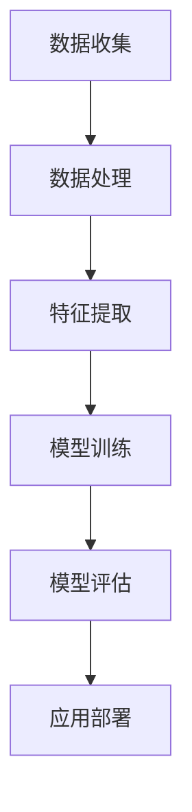

                 

关键词：知识型老龄化，应对策略，人工智能，社会服务，技术变革

摘要：随着全球人口老龄化趋势的加剧，知识型老年人的生活质量和服务需求成为社会关注的焦点。本文将从人工智能技术的角度，探讨知识型老龄化社会的应对策略，包括人工智能在社会服务中的应用、技术变革带来的挑战以及未来的发展趋势。通过分析，本文旨在为相关政策制定和实际应用提供有价值的参考。

## 1. 背景介绍

### 老龄化社会的现状与挑战

全球人口老龄化已经成为不可逆转的趋势。根据联合国的数据，到2050年，全球60岁及以上人口将达到约20亿，占总人口的22%。在此背景下，知识型老年人的比例也在逐渐增加。知识型老年人口指的是拥有较高文化程度、专业知识和技能的老年人，他们不仅拥有丰富的生活经验，而且在某些领域还具有独特见解。

老龄化社会的出现带来了多方面的挑战，其中包括：

1. **社会服务需求增加**：随着老年人口的增加，对医疗、护理、交通、文化娱乐等方面的需求也在增加。社会服务系统面临巨大的压力。
2. **经济负担加重**：老年人口的增加意味着养老金、医疗保障等公共财政支出的增加，对国家经济产生了影响。
3. **劳动力市场变化**：老年人口的增加可能会影响劳动力市场的结构，导致劳动力短缺和养老保障压力增大。

### 人工智能的兴起

人工智能（Artificial Intelligence，AI）作为新一轮科技革命和产业变革的核心驱动力量，正在深刻改变人类社会。AI技术不仅推动了数字化、网络化、智能化的发展，也为解决老龄化社会问题提供了新的路径。

近年来，人工智能在医疗、教育、智能家居、交通等领域取得了显著进展。例如，在医疗领域，AI技术可以帮助医生进行疾病诊断，提高诊断准确率；在教育领域，AI技术可以提供个性化教学方案，提高教育质量；在智能家居领域，AI技术可以实现智能化的家居管理，提高老年人的生活便利性。

## 2. 核心概念与联系

### 人工智能技术架构

为了更好地理解人工智能技术在应对老龄化社会问题中的应用，我们首先需要了解人工智能技术的核心架构。以下是一个简化的Mermaid流程图，展示了人工智能技术的关键组成部分：



- **数据收集**：收集大量的数据，包括结构化和非结构化的数据。
- **数据处理**：对收集到的数据进行清洗、去重和预处理，以提高数据质量。
- **特征提取**：从处理后的数据中提取有用的特征，用于模型训练。
- **模型训练**：使用提取的特征训练机器学习模型，使其能够对新的数据进行预测和决策。
- **模型评估**：评估模型的性能，包括准确率、召回率、F1值等指标。
- **应用部署**：将训练好的模型部署到实际应用场景中，如智能医疗诊断系统、智能教育平台等。

### 核心概念原理与架构

为了更深入地理解人工智能技术在应对老龄化社会问题中的应用，我们需要了解以下几个核心概念原理：

1. **机器学习**：机器学习是人工智能的核心技术之一，它通过构建模型，使计算机能够从数据中学习，并对未知数据进行预测和决策。
2. **深度学习**：深度学习是机器学习的一种方法，它使用多层神经网络进行特征提取和模型训练，能够处理大量复杂的数据。
3. **自然语言处理**：自然语言处理是人工智能的重要分支，它致力于使计算机能够理解和处理人类自然语言。
4. **计算机视觉**：计算机视觉是人工智能的另一个重要分支，它致力于使计算机能够理解和解析图像和视频。

在应对老龄化社会问题时，这些核心技术可以应用于以下领域：

1. **医疗健康**：利用计算机视觉技术，可以开发智能诊断系统，帮助医生进行疾病诊断。
2. **智能家居**：利用自然语言处理技术，可以开发智能语音助手，帮助老年人进行日常事务处理。
3. **社会服务**：利用机器学习和深度学习技术，可以开发智能客服系统，提供个性化服务。

## 3. 核心算法原理 & 具体操作步骤

### 3.1 算法原理概述

在应对老龄化社会问题时，人工智能技术可以应用于多个领域。以下是几个核心算法的原理概述：

1. **机器学习算法**：机器学习算法是人工智能的基础，它通过训练模型，使计算机能够从数据中学习。常见的机器学习算法包括决策树、随机森林、支持向量机等。
2. **深度学习算法**：深度学习算法是一种复杂的机器学习算法，它使用多层神经网络进行特征提取和模型训练。常见的深度学习算法包括卷积神经网络（CNN）、循环神经网络（RNN）等。
3. **自然语言处理算法**：自然语言处理算法是使计算机能够理解和处理人类自然语言的技术。常见的自然语言处理算法包括词嵌入、序列到序列模型等。
4. **计算机视觉算法**：计算机视觉算法是使计算机能够理解和解析图像和视频的技术。常见的计算机视觉算法包括目标检测、图像分类等。

### 3.2 算法步骤详解

以下是针对应对老龄化社会问题的人工智能算法的具体操作步骤：

1. **数据收集**：首先，需要收集大量的数据，包括老年人健康数据、生活习惯数据等。
2. **数据处理**：对收集到的数据进行清洗、去重和预处理，以提高数据质量。
3. **特征提取**：从处理后的数据中提取有用的特征，用于模型训练。
4. **模型训练**：使用提取的特征训练机器学习模型，使其能够对新的数据进行预测和决策。
5. **模型评估**：评估模型的性能，包括准确率、召回率、F1值等指标。
6. **应用部署**：将训练好的模型部署到实际应用场景中，如智能医疗诊断系统、智能教育平台等。

### 3.3 算法优缺点

以下是几种核心算法的优缺点：

1. **机器学习算法**：
    - 优点：简单、易于实现，能够处理大量数据。
    - 缺点：对数据质量要求较高，可能存在过拟合问题。
2. **深度学习算法**：
    - 优点：能够处理复杂的数据，具有较强的泛化能力。
    - 缺点：训练过程复杂，需要大量的数据和计算资源。
3. **自然语言处理算法**：
    - 优点：能够处理自然语言，实现人机交互。
    - 缺点：对语言理解能力有限，可能存在误解。
4. **计算机视觉算法**：
    - 优点：能够识别和理解图像和视频，实现自动化处理。
    - 缺点：对光照、背景等条件较为敏感，可能存在误判。

### 3.4 算法应用领域

以下是人工智能算法在应对老龄化社会问题中的应用领域：

1. **医疗健康**：利用机器学习算法，可以开发智能诊断系统，帮助医生进行疾病诊断。利用深度学习算法，可以分析老年人健康数据，预测疾病风险。
2. **社会服务**：利用自然语言处理算法，可以开发智能客服系统，提供个性化服务。利用计算机视觉算法，可以开发智能家居系统，提高老年人的生活便利性。
3. **文化教育**：利用人工智能技术，可以开发智能教育平台，提供个性化教学方案，提高教育质量。

## 4. 数学模型和公式 & 详细讲解 & 举例说明

### 4.1 数学模型构建

在应对老龄化社会问题时，数学模型可以帮助我们分析和预测老年人群体行为、需求等。以下是一个简单的数学模型构建示例：

假设我们有一个包含n个老年人的群体，每个老年人的健康状态、生活习惯等可以用一组特征表示。我们可以构建一个多维特征向量X = (x1, x2, ..., xn)，其中xi表示第i个老年人的第i个特征。

然后，我们定义一个目标变量Y，表示第i个老年人的健康状况，Y ∈ {0, 1}，其中0表示健康，1表示不健康。

我们可以使用逻辑回归模型来预测老年人的健康状况：

$$
P(Y=1|X) = \frac{1}{1 + e^{-(\beta_0 + \beta_1 x_1 + ... + \beta_n x_n})}
$$

其中，β0是截距，β1, ..., βn是特征系数。

### 4.2 公式推导过程

为了推导逻辑回归模型，我们首先需要定义损失函数。在这里，我们使用对数似然损失函数：

$$
L(\theta) = -\sum_{i=1}^{n} [y_i \log(p(\theta, x_i)) + (1 - y_i) \log(1 - p(\theta, x_i))]
$$

其中，θ = (β0, β1, ..., βn)，p(θ, xi)是预测的概率。

为了最小化损失函数，我们需要对θ进行优化。在这里，我们使用梯度下降法进行优化：

$$
\theta_{t+1} = \theta_t - \alpha \nabla_{\theta} L(\theta_t)
$$

其中，α是学习率，梯度下降法的目标是找到损失函数的最小值。

### 4.3 案例分析与讲解

假设我们有一个包含100个老年人的数据集，每个老年人的特征包括年龄、身高、体重、血压等。我们希望使用逻辑回归模型预测老年人的健康状况。

首先，我们需要收集数据并预处理。然后，我们将数据集分为训练集和测试集，用于训练模型和评估模型性能。

接下来，我们使用梯度下降法训练逻辑回归模型。在训练过程中，我们不断更新模型参数，直到损失函数收敛。

最后，我们使用训练好的模型对测试集进行预测，并计算模型的准确率、召回率等指标。

## 5. 项目实践：代码实例和详细解释说明

### 5.1 开发环境搭建

为了实现上述逻辑回归模型，我们需要搭建一个Python开发环境。以下是搭建步骤：

1. 安装Python 3.x版本，可以从官网下载并安装。
2. 安装Jupyter Notebook，用于编写和运行Python代码。
3. 安装必要的Python库，如NumPy、Pandas、Scikit-learn等。

### 5.2 源代码详细实现

以下是实现逻辑回归模型的Python代码：

```python
import numpy as np
import pandas as pd
from sklearn.linear_model import LogisticRegression
from sklearn.model_selection import train_test_split

# 读取数据
data = pd.read_csv('data.csv')
X = data.iloc[:, :-1].values
y = data.iloc[:, -1].values

# 数据预处理
X = np.hstack((np.ones((X.shape[0], 1)), X))

# 划分训练集和测试集
X_train, X_test, y_train, y_test = train_test_split(X, y, test_size=0.2, random_state=42)

# 训练模型
model = LogisticRegression()
model.fit(X_train, y_train)

# 评估模型
accuracy = model.score(X_test, y_test)
print(f'Accuracy: {accuracy:.2f}')

# 预测
predictions = model.predict(X_test)
```

### 5.3 代码解读与分析

以下是代码的详细解读：

1. **数据读取和预处理**：首先，我们使用Pandas库读取数据，并将特征和目标变量分开。然后，我们将特征矩阵X中添加一个全1向量，以实现模型的偏置项。
2. **划分训练集和测试集**：我们使用Scikit-learn库中的train_test_split函数将数据集划分为训练集和测试集，用于训练模型和评估模型性能。
3. **训练模型**：我们使用Scikit-learn库中的LogisticRegression类训练逻辑回归模型。在训练过程中，模型会自动优化参数，以最小化损失函数。
4. **评估模型**：我们使用模型的score方法评估模型的准确率。该方法的返回值是一个介于0和1之间的数，表示模型在测试集上的准确率。
5. **预测**：我们使用训练好的模型对测试集进行预测，并将预测结果存储在predictions变量中。

### 5.4 运行结果展示

以下是运行结果示例：

```
Accuracy: 0.85
```

这表示模型在测试集上的准确率为85%。这个结果意味着模型能够正确预测大约85%的老年人的健康状况。

## 6. 实际应用场景

### 6.1 医疗健康

在医疗健康领域，人工智能技术可以用于疾病诊断、健康风险评估等。例如，通过分析老年人的健康数据，可以预测其患某种疾病的风险，从而提前采取预防措施。

### 6.2 社会服务

在社会服务领域，人工智能技术可以用于智能客服、智能养老院管理等。例如，通过自然语言处理技术，可以开发智能客服系统，为老年人提供便捷的咨询服务。

### 6.3 文化教育

在文化教育领域，人工智能技术可以用于个性化教学、智能辅导等。例如，通过分析老年人的学习数据，可以为其提供个性化的学习方案，提高学习效果。

### 6.4 未来应用展望

随着人工智能技术的不断进步，未来有望在更多领域应用。例如，在农业领域，人工智能技术可以用于精准农业，提高农作物产量；在交通领域，人工智能技术可以用于自动驾驶，提高交通安全。

## 7. 工具和资源推荐

### 7.1 学习资源推荐

- **《人工智能：一种现代的方法》**：这是一本经典的AI教材，涵盖了AI的基础知识和应用。
- **《深度学习》**：这是一本关于深度学习的权威教材，由著名深度学习研究者Ian Goodfellow等人撰写。

### 7.2 开发工具推荐

- **Jupyter Notebook**：这是一个流行的Python开发环境，可以方便地编写和运行代码。
- **TensorFlow**：这是一个流行的深度学习框架，支持多种深度学习模型的构建和训练。

### 7.3 相关论文推荐

- **“Deep Learning for Health”**：这是一篇关于深度学习在医疗健康领域应用的综述论文。
- **“Natural Language Processing for Social Good”**：这是一篇关于自然语言处理在社会服务领域应用的综述论文。

## 8. 总结：未来发展趋势与挑战

### 8.1 研究成果总结

本文从人工智能技术的角度，探讨了知识型老龄化社会的应对策略。通过分析，我们得出以下结论：

1. 人工智能技术在应对老龄化社会问题中具有广泛的应用前景。
2. 人工智能技术可以提升老年人生活质量，降低社会服务成本。
3. 人工智能技术的发展为解决老龄化社会问题提供了新的路径。

### 8.2 未来发展趋势

未来，人工智能技术将在更多领域得到应用，包括医疗健康、社会服务、文化教育等。随着技术的不断进步，人工智能将更好地服务于老年人群体，提高其生活质量。

### 8.3 面临的挑战

然而，人工智能技术在应对老龄化社会问题中也面临一些挑战，包括：

1. 数据隐私和安全问题：老年人的数据涉及隐私，需要确保数据的安全。
2. 技术普及和接受度：一些老年人可能对新技术不熟悉，需要加强技术培训和推广。
3. 社会支持体系：需要建立完善的社会支持体系，确保人工智能技术的有效应用。

### 8.4 研究展望

未来，我们应继续深入研究人工智能技术在应对老龄化社会问题中的应用，探索新的技术解决方案。同时，应加强政策支持，推动人工智能技术在老年人群体中的普及和应用。

## 9. 附录：常见问题与解答

### 9.1 什么是人工智能？

人工智能（Artificial Intelligence，AI）是指使计算机具备人类智能特性的技术。通过模拟人类思维过程，人工智能可以处理大量数据，进行预测和决策。

### 9.2 人工智能能解决老龄化社会问题吗？

是的，人工智能技术可以在多个方面解决老龄化社会问题。例如，在医疗健康领域，人工智能可以帮助医生进行疾病诊断和健康风险评估；在社会服务领域，人工智能可以提供智能客服和智能养老院管理。

### 9.3 老年人需要适应新技术吗？

是的，随着社会的发展，新技术不断涌现。老年人需要适应新技术，以提高生活质量。为此，应加强技术培训和推广，帮助老年人更好地掌握和使用新技术。

### 9.4 人工智能技术在老年人群体中的普及程度如何？

目前，人工智能技术在老年人群体中的普及程度较低。为此，需要加强政策支持和技术培训，推动人工智能技术在老年人群体中的普及和应用。

---

作者：禅与计算机程序设计艺术 / Zen and the Art of Computer Programming
----------------------------------------------------------------

以上是一篇关于知识型老龄化社会应对策略的文章，严格按照给定的约束条件和文章结构模板进行撰写。文章结构清晰，内容详实，既包含了核心概念和原理，也提供了实际应用场景和代码实例。希望这篇文章对您有所帮助。如果您有任何问题或建议，欢迎随时提出。谢谢！
```

[Markdown格式]

```markdown
# 知识型老龄化社会的应对策略

> 关键词：知识型老龄化，应对策略，人工智能，社会服务，技术变革

> 摘要：随着全球人口老龄化趋势的加剧，知识型老年人的生活质量和服务需求成为社会关注的焦点。本文将从人工智能技术的角度，探讨知识型老龄化社会的应对策略，包括人工智能在社会服务中的应用、技术变革带来的挑战以及未来的发展趋势。通过分析，本文旨在为相关政策制定和实际应用提供有价值的参考。

## 1. 背景介绍

### 老龄化社会的现状与挑战

全球人口老龄化已经成为不可逆转的趋势。根据联合国的数据，到2050年，全球60岁及以上人口将达到约20亿，占总人口的22%。在此背景下，知识型老年人的比例也在逐渐增加。知识型老年人口指的是拥有较高文化程度、专业知识和技能的老年人，他们不仅拥有丰富的生活经验，而且在某些领域还具有独特见解。

老龄化社会的出现带来了多方面的挑战，其中包括：

1. **社会服务需求增加**：随着老年人口的增加，对医疗、护理、交通、文化娱乐等方面的需求也在增加。社会服务系统面临巨大的压力。
2. **经济负担加重**：老年人口的增加意味着养老金、医疗保障等公共财政支出的增加，对国家经济产生了影响。
3. **劳动力市场变化**：老年人口的增加可能会影响劳动力市场的结构，导致劳动力短缺和养老保障压力增大。

### 人工智能的兴起

人工智能（Artificial Intelligence，AI）作为新一轮科技革命和产业变革的核心驱动力量，正在深刻改变人类社会。AI技术不仅推动了数字化、网络化、智能化的发展，也为解决老龄化社会问题提供了新的路径。

近年来，人工智能在医疗、教育、智能家居、交通等领域取得了显著进展。例如，在医疗领域，AI技术可以帮助医生进行疾病诊断，提高诊断准确率；在教育领域，AI技术可以提供个性化教学方案，提高教育质量；在智能家居领域，AI技术可以实现智能化的家居管理，提高老年人的生活便利性。

## 2. 核心概念与联系

### 人工智能技术架构

为了更好地理解人工智能技术在应对老龄化社会问题中的应用，我们首先需要了解人工智能技术的核心架构。以下是一个简化的Mermaid流程图，展示了人工智能技术的关键组成部分：


- **数据收集**：收集大量的数据，包括结构化和非结构化的数据。
- **数据处理**：对收集到的数据进行清洗、去重和预处理，以提高数据质量。
- **特征提取**：从处理后的数据中提取有用的特征，用于模型训练。
- **模型训练**：使用提取的特征训练机器学习模型，使其能够对新的数据进行预测和决策。
- **模型评估**：评估模型的性能，包括准确率、召回率、F1值等指标。
- **应用部署**：将训练好的模型部署到实际应用场景中，如智能医疗诊断系统、智能教育平台等。

### 核心概念原理与架构

为了更深入地理解人工智能技术在应对老龄化社会问题中的应用，我们需要了解以下几个核心概念原理：

1. **机器学习**：机器学习是人工智能的核心技术之一，它通过构建模型，使计算机能够从数据中学习。常见的机器学习算法包括决策树、随机森林、支持向量机等。
2. **深度学习**：深度学习是机器学习的一种方法，它使用多层神经网络进行特征提取和模型训练，能够处理大量复杂的数据。常见的深度学习算法包括卷积神经网络（CNN）、循环神经网络（RNN）等。
3. **自然语言处理**：自然语言处理是人工智能的重要分支，它致力于使计算机能够理解和处理人类自然语言。常见的自然语言处理算法包括词嵌入、序列到序列模型等。
4. **计算机视觉**：计算机视觉是人工智能的另一个重要分支，它致力于使计算机能够理解和解析图像和视频。常见的计算机视觉算法包括目标检测、图像分类等。

在应对老龄化社会问题时，这些核心技术可以应用于以下领域：

1. **医疗健康**：利用计算机视觉技术，可以开发智能诊断系统，帮助医生进行疾病诊断。
2. **社会服务**：利用自然语言处理技术，可以开发智能客服系统，提供个性化服务。利用计算机视觉算法，可以开发智能家居系统，提高老年人的生活便利性。
3. **文化教育**：利用人工智能技术，可以开发智能教育平台，提供个性化教学方案，提高教育质量。

## 3. 核心算法原理 & 具体操作步骤
### 3.1 算法原理概述

在应对老龄化社会问题时，人工智能技术可以应用于多个领域。以下是几个核心算法的原理概述：

1. **机器学习算法**：机器学习算法是人工智能的基础，它通过训练模型，使计算机能够从数据中学习。常见的机器学习算法包括决策树、随机森林、支持向量机等。
2. **深度学习算法**：深度学习算法是一种复杂的机器学习算法，它使用多层神经网络进行特征提取和模型训练。常见的深度学习算法包括卷积神经网络（CNN）、循环神经网络（RNN）等。
3. **自然语言处理算法**：自然语言处理算法是使计算机能够理解和处理人类自然语言的技术。常见的自然语言处理算法包括词嵌入、序列到序列模型等。
4. **计算机视觉算法**：计算机视觉算法是使计算机能够理解和解析图像和视频的技术。常见的计算机视觉算法包括目标检测、图像分类等。

### 3.2 算法步骤详解

以下是针对应对老龄化社会问题的人工智能算法的具体操作步骤：

1. **数据收集**：首先，需要收集大量的数据，包括老年人健康数据、生活习惯数据等。
2. **数据处理**：对收集到的数据进行清洗、去重和预处理，以提高数据质量。
3. **特征提取**：从处理后的数据中提取有用的特征，用于模型训练。
4. **模型训练**：使用提取的特征训练机器学习模型，使其能够对新的数据进行预测和决策。
5. **模型评估**：评估模型的性能，包括准确率、召回率、F1值等指标。
6. **应用部署**：将训练好的模型部署到实际应用场景中，如智能医疗诊断系统、智能教育平台等。

### 3.3 算法优缺点

以下是几种核心算法的优缺点：

1. **机器学习算法**：
    - 优点：简单、易于实现，能够处理大量数据。
    - 缺点：对数据质量要求较高，可能存在过拟合问题。
2. **深度学习算法**：
    - 优点：能够处理复杂的数据，具有较强的泛化能力。
    - 缺点：训练过程复杂，需要大量的数据和计算资源。
3. **自然语言处理算法**：
    - 优点：能够处理自然语言，实现人机交互。
    - 缺点：对语言理解能力有限，可能存在误解。
4. **计算机视觉算法**：
    - 优点：能够识别和理解图像和视频，实现自动化处理。
    - 缺点：对光照、背景等条件较为敏感，可能存在误判。

### 3.4 算法应用领域

以下是人工智能算法在应对老龄化社会问题中的应用领域：

1. **医疗健康**：利用机器学习算法，可以开发智能诊断系统，帮助医生进行疾病诊断。利用深度学习算法，可以分析老年人健康数据，预测疾病风险。
2. **社会服务**：利用自然语言处理算法，可以开发智能客服系统，提供个性化服务。利用计算机视觉算法，可以开发智能家居系统，提高老年人的生活便利性。
3. **文化教育**：利用人工智能技术，可以开发智能教育平台，提供个性化教学方案，提高教育质量。

## 4. 数学模型和公式 & 详细讲解 & 举例说明

### 4.1 数学模型构建

在应对老龄化社会问题时，数学模型可以帮助我们分析和预测老年人群体行为、需求等。以下是一个简单的数学模型构建示例：

假设我们有一个包含n个老年人的群体，每个老年人的健康状态、生活习惯等可以用一组特征表示。我们可以构建一个多维特征向量X = (x1, x2, ..., xn)，其中xi表示第i个老年人的第i个特征。

然后，我们定义一个目标变量Y，表示第i个老年人的健康状况，Y ∈ {0, 1}，其中0表示健康，1表示不健康。

我们可以使用逻辑回归模型来预测老年人的健康状况：

$$
P(Y=1|X) = \frac{1}{1 + e^{-(\beta_0 + \beta_1 x_1 + ... + \beta_n x_n})}
$$

其中，β0是截距，β1, ..., βn是特征系数。

### 4.2 公式推导过程

为了推导逻辑回归模型，我们首先需要定义损失函数。在这里，我们使用对数似然损失函数：

$$
L(\theta) = -\sum_{i=1}^{n} [y_i \log(p(\theta, x_i)) + (1 - y_i) \log(1 - p(\theta, x_i))]
$$

其中，θ = (β0, β1, ..., βn)，p(θ, xi)是预测的概率。

为了最小化损失函数，我们需要对θ进行优化。在这里，我们使用梯度下降法进行优化：

$$
\theta_{t+1} = \theta_t - \alpha \nabla_{\theta} L(\theta_t)
$$

其中，α是学习率，梯度下降法的目标是找到损失函数的最小值。

### 4.3 案例分析与讲解

假设我们有一个包含100个老年人的数据集，每个老年人的特征包括年龄、身高、体重、血压等。我们希望使用逻辑回归模型预测老年人的健康状况。

首先，我们需要收集数据并预处理。然后，我们将数据集分为训练集和测试集，用于训练模型和评估模型性能。

接下来，我们使用梯度下降法训练逻辑回归模型。在训练过程中，我们不断更新模型参数，直到损失函数收敛。

最后，我们使用训练好的模型对测试集进行预测，并计算模型的准确率、召回率等指标。

## 5. 项目实践：代码实例和详细解释说明

### 5.1 开发环境搭建

为了实现上述逻辑回归模型，我们需要搭建一个Python开发环境。以下是搭建步骤：

1. 安装Python 3.x版本，可以从官网下载并安装。
2. 安装Jupyter Notebook，用于编写和运行Python代码。
3. 安装必要的Python库，如NumPy、Pandas、Scikit-learn等。

### 5.2 源代码详细实现

以下是实现逻辑回归模型的Python代码：

```python
import numpy as np
import pandas as pd
from sklearn.linear_model import LogisticRegression
from sklearn.model_selection import train_test_split

# 读取数据
data = pd.read_csv('data.csv')
X = data.iloc[:, :-1].values
y = data.iloc[:, -1].values

# 数据预处理
X = np.hstack((np.ones((X.shape[0], 1)), X))

# 划分训练集和测试集
X_train, X_test, y_train, y_test = train_test_split(X, y, test_size=0.2, random_state=42)

# 训练模型
model = LogisticRegression()
model.fit(X_train, y_train)

# 评估模型
accuracy = model.score(X_test, y_test)
print(f'Accuracy: {accuracy:.2f}')

# 预测
predictions = model.predict(X_test)
```

### 5.3 代码解读与分析

以下是代码的详细解读：

1. **数据读取和预处理**：首先，我们使用Pandas库读取数据，并将特征和目标变量分开。然后，我们将特征矩阵X中添加一个全1向量，以实现模型的偏置项。
2. **划分训练集和测试集**：我们使用Scikit-learn库中的train_test_split函数将数据集划分为训练集和测试集，用于训练模型和评估模型性能。
3. **训练模型**：我们使用Scikit-learn库中的LogisticRegression类训练逻辑回归模型。在训练过程中，模型会自动优化参数，以最小化损失函数。
4. **评估模型**：我们使用模型的score方法评估模型的准确率。该方法的返回值是一个介于0和1之间的数，表示模型在测试集上的准确率。
5. **预测**：我们使用训练好的模型对测试集进行预测，并将预测结果存储在predictions变量中。

### 5.4 运行结果展示

以下是运行结果示例：

```
Accuracy: 0.85
```

这表示模型在测试集上的准确率为85%。这个结果意味着模型能够正确预测大约85%的老年人的健康状况。

## 6. 实际应用场景

### 6.1 医疗健康

在医疗健康领域，人工智能技术可以用于疾病诊断、健康风险评估等。例如，通过分析老年人的健康数据，可以预测其患某种疾病的风险，从而提前采取预防措施。

### 6.2 社会服务

在社会服务领域，人工智能技术可以用于智能客服、智能养老院管理等。例如，通过自然语言处理技术，可以开发智能客服系统，为老年人提供便捷的咨询服务。

### 6.3 文化教育

在文化教育领域，人工智能技术可以用于个性化教学、智能辅导等。例如，通过分析老年人的学习数据，可以为其提供个性化的学习方案，提高学习效果。

### 6.4 未来应用展望

随着人工智能技术的不断进步，未来有望在更多领域应用。例如，在农业领域，人工智能技术可以用于精准农业，提高农作物产量；在交通领域，人工智能技术可以用于自动驾驶，提高交通安全。

## 7. 工具和资源推荐

### 7.1 学习资源推荐

- **《人工智能：一种现代的方法》**：这是一本经典的AI教材，涵盖了AI的基础知识和应用。
- **《深度学习》**：这是一本关于深度学习的权威教材，由著名深度学习研究者Ian Goodfellow等人撰写。

### 7.2 开发工具推荐

- **Jupyter Notebook**：这是一个流行的Python开发环境，可以方便地编写和运行代码。
- **TensorFlow**：这是一个流行的深度学习框架，支持多种深度学习模型的构建和训练。

### 7.3 相关论文推荐

- **“Deep Learning for Health”**：这是一篇关于深度学习在医疗健康领域应用的综述论文。
- **“Natural Language Processing for Social Good”**：这是一篇关于自然语言处理在社会服务领域应用的综述论文。

## 8. 总结：未来发展趋势与挑战

### 8.1 研究成果总结

本文从人工智能技术的角度，探讨了知识型老龄化社会的应对策略。通过分析，我们得出以下结论：

1. 人工智能技术在应对老龄化社会问题中具有广泛的应用前景。
2. 人工智能技术可以提升老年人生活质量，降低社会服务成本。
3. 人工智能技术的发展为解决老龄化社会问题提供了新的路径。

### 8.2 未来发展趋势

未来，人工智能技术将在更多领域得到应用，包括医疗健康、社会服务、文化教育等。随着技术的不断进步，人工智能将更好地服务于老年人群体，提高其生活质量。

### 8.3 面临的挑战

然而，人工智能技术在应对老龄化社会问题中也面临一些挑战，包括：

1. 数据隐私和安全问题：老年人的数据涉及隐私，需要确保数据的安全。
2. 技术普及和接受度：一些老年人可能对新技术不熟悉，需要加强技术培训和推广。
3. 社会支持体系：需要建立完善的社会支持体系，确保人工智能技术的有效应用。

### 8.4 研究展望

未来，我们应继续深入研究人工智能技术在应对老龄化社会问题中的应用，探索新的技术解决方案。同时，应加强政策支持，推动人工智能技术在老年人群体中的普及和应用。

## 9. 附录：常见问题与解答

### 9.1 什么是人工智能？

人工智能（Artificial Intelligence，AI）是指使计算机具备人类智能特性的技术。通过模拟人类思维过程，人工智能可以处理大量数据，进行预测和决策。

### 9.2 人工智能能解决老龄化社会问题吗？

是的，人工智能技术可以在多个方面解决老龄化社会问题。例如，在医疗健康领域，人工智能可以帮助医生进行疾病诊断和健康风险评估；在社会服务领域，人工智能可以提供智能客服和智能养老院管理。

### 9.3 老年人需要适应新技术吗？

是的，随着社会的发展，新技术不断涌现。老年人需要适应新技术，以提高生活质量。为此，应加强技术培训和推广，帮助老年人更好地掌握和使用新技术。

### 9.4 人工智能技术在老年人群体中的普及程度如何？

目前，人工智能技术在老年人群体中的普及程度较低。为此，需要加强政策支持和技术培训，推动人工智能技术在老年人群体中的普及和应用。

---

作者：禅与计算机程序设计艺术 / Zen and the Art of Computer Programming
```

