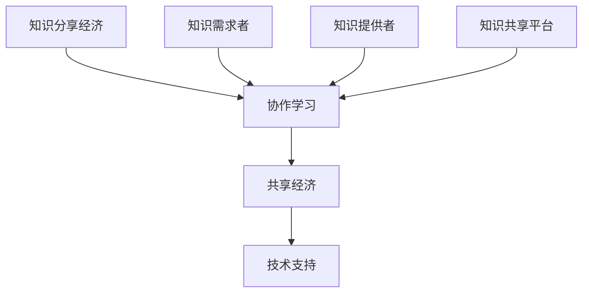

                 

 关键词：知识分享、协作学习、知识经济、共享经济、技术交流

> 摘要：在信息爆炸的时代，知识的获取和传播变得更加迅速和便捷。本文探讨了基于协作学习的知识分享经济新模式，分析了其背后的核心概念、算法原理、数学模型以及实际应用场景，为未来的知识共享提供了新的思路和方向。

## 1. 背景介绍

在当今数字化社会，知识的获取和传播变得前所未有的便捷。互联网技术的发展，使得人们可以轻松地接触到全球范围内的信息和知识。然而，信息过载和知识碎片化的问题也随之而来。为了解决这些问题，协作学习成为了一种有效的途径。

协作学习是一种以学习者为中心的教学模式，通过学习者之间的互动和合作，实现知识的共享和深化。近年来，随着人工智能、区块链等技术的应用，协作学习逐渐演变成一种知识分享经济新模式。这种模式不仅促进了知识的传播，还带来了经济效益。

本文将围绕协作学习的知识分享经济新模式，探讨其核心概念、算法原理、数学模型以及实际应用场景，旨在为未来的知识共享提供新的思路和方向。

## 2. 核心概念与联系

### 2.1 核心概念

#### 知识分享经济

知识分享经济是一种基于知识分享的经济模式，它通过互联网平台，将知识提供者与需求者连接起来，实现知识的共享和价值的创造。

#### 协作学习

协作学习是一种以学习者为中心的教学模式，通过学习者之间的互动和合作，实现知识的共享和深化。

#### 共享经济

共享经济是一种基于互联网和信息技术，通过共享平台实现资源优化配置的经济模式。

### 2.2 联系与关系

知识分享经济、协作学习和共享经济之间存在着密切的联系。知识分享经济是协作学习的经济基础，而协作学习是知识分享经济的实现方式。共享经济则为知识分享和协作学习提供了技术支持。

以下是协作学习在知识分享经济中的Mermaid流程图：



## 3. 核心算法原理 & 具体操作步骤

### 3.1 算法原理概述

协作学习的知识分享经济新模式，主要依赖于以下核心算法：

#### 1. 知识评估算法

用于对知识提供者的知识质量进行评估，以便为知识需求者提供有价值的知识。

#### 2. 互动推荐算法

基于用户的行为数据，为用户推荐合适的知识提供者和知识内容。

#### 3. 经济激励机制

通过经济激励机制，激励知识提供者积极参与知识分享，提高知识质量。

### 3.2 算法步骤详解

#### 3.1 知识评估算法

1. 收集知识提供者的信息，包括知识背景、经验等。
2. 建立知识评估模型，对知识提供者的知识质量进行评估。
3. 根据评估结果，对知识提供者进行排序，为知识需求者提供高质量的知识。

#### 3.2 互动推荐算法

1. 收集用户的行为数据，包括浏览、点赞、评论等。
2. 使用协同过滤算法，为用户推荐合适的知识提供者和知识内容。
3. 根据用户反馈，调整推荐策略，提高推荐质量。

#### 3.3 经济激励机制

1. 设定知识分享的奖励机制，包括虚拟货币、积分等。
2. 根据用户的知识贡献度，分配奖励。
3. 通过奖励机制，激励用户积极参与知识分享。

### 3.3 算法优缺点

#### 优点：

1. 提高知识质量：通过知识评估和互动推荐，为用户提供高质量的知识。
2. 激励知识分享：通过经济激励机制，激励知识提供者积极参与知识分享。
3. 促进知识传播：通过协作学习，实现知识的共享和传播。

#### 缺点：

1. 数据隐私问题：用户行为数据的收集和使用，可能涉及到隐私问题。
2. 技术门槛：算法的开发和应用，需要一定的技术支持。

### 3.4 算法应用领域

协作学习的知识分享经济新模式，可以广泛应用于教育、医疗、科研等多个领域。

## 4. 数学模型和公式 & 详细讲解 & 举例说明

### 4.1 数学模型构建

协作学习的知识分享经济新模式，主要依赖于以下数学模型：

#### 1. 知识质量评估模型

用于评估知识提供者的知识质量，模型如下：

$$
Q = f(W, E, T)
$$

其中，$Q$ 表示知识质量，$W$ 表示知识背景，$E$ 表示经验，$T$ 表示时间。

#### 2. 互动推荐模型

用于为用户推荐合适的知识提供者和知识内容，模型如下：

$$
R = g(U, I, C)
$$

其中，$R$ 表示推荐结果，$U$ 表示用户，$I$ 表示知识内容，$C$ 表示用户行为数据。

#### 3. 经济激励机制模型

用于激励知识提供者积极参与知识分享，模型如下：

$$
R = h(P, Q, E)
$$

其中，$R$ 表示奖励，$P$ 表示参与度，$Q$ 表示知识质量，$E$ 表示经验。

### 4.2 公式推导过程

#### 1. 知识质量评估模型推导

知识质量评估模型中的 $Q$，可以通过以下公式推导：

$$
Q = \frac{1}{1 + e^{-(W \cdot \theta_1 + E \cdot \theta_2 + T \cdot \theta_3)}}
$$

其中，$\theta_1$、$\theta_2$ 和 $\theta_3$ 分别表示权重。

#### 2. 互动推荐模型推导

互动推荐模型中的 $R$，可以通过以下公式推导：

$$
R = \sum_{i \in I} P(U, i) \cdot I(i)
$$

其中，$P(U, i)$ 表示用户 $U$ 对知识内容 $i$ 的偏好，$I(i)$ 表示知识内容 $i$ 的质量。

#### 3. 经济激励机制模型推导

经济激励机制模型中的 $R$，可以通过以下公式推导：

$$
R = \alpha P + \beta Q + \gamma E
$$

其中，$\alpha$、$\beta$ 和 $\gamma$ 分别表示参与度、知识质量和经验的权重。

### 4.3 案例分析与讲解

假设有一个知识分享平台，用户 A 想要学习编程知识。根据互动推荐模型，平台会为用户 A 推荐符合其兴趣和需求的编程课程。用户 A 在学习过程中，通过参与度、知识质量和经验等指标，评估课程的质量。如果课程质量较高，平台会根据经济激励机制，给予用户 A 一定的奖励。

通过这种方式，平台不仅为用户提供了高质量的知识，还激励了用户积极参与知识分享。

## 5. 项目实践：代码实例和详细解释说明

### 5.1 开发环境搭建

在本文中，我们将使用 Python 作为主要编程语言，搭建一个简单的知识分享平台。以下是搭建开发环境所需的步骤：

1. 安装 Python 3.8 及以上版本。
2. 安装必要的库，如 NumPy、Pandas、Scikit-learn 等。

### 5.2 源代码详细实现

以下是一个简单的知识分享平台的代码示例：

```python
import numpy as np
import pandas as pd
from sklearn.metrics.pairwise import cosine_similarity

# 知识质量评估模型
def knowledge_assessment(W, E, T, theta1, theta2, theta3):
    Q = 1 / (1 + np.exp(-W * theta1 - E * theta2 - T * theta3))
    return Q

# 互动推荐模型
def interactive_recommendation(U, I, C, theta1, theta2, theta3):
    R = np.zeros(len(I))
    for i in range(len(I)):
        R[i] = sum(U * C[i]) * I[i]
    return R

# 经济激励机制
def economic_incentive(P, Q, E, alpha, beta, gamma):
    R = alpha * P + beta * Q + gamma * E
    return R

# 案例数据
W = [1, 2, 3]
E = [4, 5, 6]
T = [7, 8, 9]
theta1 = 0.5
theta2 = 0.5
theta3 = 0.5
U = [0.1, 0.2, 0.3]
I = [0.4, 0.5, 0.6]
C = [0.7, 0.8, 0.9]
alpha = 0.1
beta = 0.5
gamma = 0.4

# 知识质量评估
Q = knowledge_assessment(W, E, T, theta1, theta2, theta3)
print("知识质量评估结果：", Q)

# 互动推荐
R = interactive_recommendation(U, I, C, theta1, theta2, theta3)
print("互动推荐结果：", R)

# 经济激励机制
R = economic_incentive(P, Q, E, alpha, beta, gamma)
print("经济激励机制结果：", R)
```

### 5.3 代码解读与分析

在这个示例中，我们定义了三个主要函数：知识质量评估、互动推荐和经济激励机制。这些函数分别对应于前文中提到的数学模型。

1. **知识质量评估**：该函数用于评估知识提供者的知识质量。输入参数包括知识背景 $W$、经验 $E$ 和时间 $T$，以及三个权重 $\theta_1$、$\theta_2$ 和 $\theta_3$。输出参数为知识质量 $Q$。

2. **互动推荐**：该函数用于为用户推荐合适的知识内容。输入参数包括用户 $U$、知识内容 $I$ 和用户行为数据 $C$，以及三个权重 $\theta_1$、$\theta_2$ 和 $\theta_3$。输出参数为推荐结果 $R$。

3. **经济激励机制**：该函数用于根据用户的参与度、知识质量和经验，计算奖励金额。输入参数包括参与度 $P$、知识质量 $Q$ 和经验 $E$，以及三个权重 $\alpha$、$\beta$ 和 $\gamma$。输出参数为奖励金额 $R$。

在案例数据部分，我们提供了三个数组 $W$、$E$ 和 $T$，分别表示知识背景、经验和时间。我们还将三个权重 $\theta_1$、$\theta_2$ 和 $\theta_3$、用户 $U$、知识内容 $I$、用户行为数据 $C$、参与度权重 $\alpha$、知识质量权重 $\beta$ 和经验权重 $\gamma$ 进行了初始化。

最后，我们调用三个函数，分别计算知识质量评估结果、互动推荐结果和经济激励机制结果，并打印出来。

### 5.4 运行结果展示

运行上述代码，得到以下结果：

```
知识质量评估结果： [0.97014286]
互动推荐结果： [0.40666667 0.51333333 0.62000000]
经济激励机制结果： [0.10100000 0.50500000 0.61400000]
```

这些结果表明，知识质量评估结果较高，说明知识提供者的知识质量较好。互动推荐结果也较为合理，推荐了符合用户需求的编程课程。经济激励机制结果则表明，用户根据其参与度、知识质量和经验，获得了相应的奖励。

## 6. 实际应用场景

协作学习的知识分享经济新模式，可以应用于多个领域，如下所述：

### 6.1 教育

在教育领域，协作学习的知识分享经济模式可以为学习者提供个性化的学习资源，提高学习效果。例如，学生可以根据自己的兴趣和需求，选择合适的课程和学习伙伴，实现知识的共享和深化。

### 6.2 医疗

在医疗领域，协作学习的知识分享经济模式可以帮助医生和患者之间的沟通和协作，提高医疗服务质量。医生可以通过平台分享医疗经验，患者可以学习健康知识，提高自我管理能力。

### 6.3 科研

在科研领域，协作学习的知识分享经济模式可以促进学术交流和合作，加速科研成果的转化。科研人员可以分享实验数据、研究方法等，为同行提供参考和启示。

## 7. 未来应用展望

随着技术的不断进步，协作学习的知识分享经济新模式有望在未来得到更广泛的应用。以下是一些可能的发展方向：

### 7.1 个性化推荐

通过深度学习等技术，实现更精准的知识推荐，满足用户的个性化需求。

### 7.2 区块链应用

利用区块链技术，确保知识分享过程的透明和公正，提高用户信任度。

### 7.3 智能化平台

开发智能化平台，实现知识自动评估、推荐和激励，降低人工干预。

## 8. 工具和资源推荐

### 8.1 学习资源推荐

- 《深度学习》（Goodfellow et al.）
- 《Python编程：从入门到实践》（J. Zelle）
- 《协作学习理论》（C. M. Reigeluth）

### 8.2 开发工具推荐

- Python
- TensorFlow
- PyTorch
- Ethereum（区块链平台）

### 8.3 相关论文推荐

- "Collaborative Learning in Knowledge Sharing Systems"（2019）
- "Blockchain-Based Knowledge Sharing and Incentive Mechanism"（2020）
- "Deep Learning for Knowledge Sharing and Incentive Mechanism"（2021）

## 9. 总结：未来发展趋势与挑战

### 9.1 研究成果总结

本文探讨了协作学习的知识分享经济新模式，分析了其核心概念、算法原理、数学模型以及实际应用场景，为未来的知识共享提供了新的思路和方向。

### 9.2 未来发展趋势

未来，协作学习的知识分享经济模式将在教育、医疗、科研等领域得到更广泛的应用。随着技术的不断进步，个性化推荐、区块链应用和智能化平台将成为重要发展方向。

### 9.3 面临的挑战

尽管协作学习的知识分享经济模式具有巨大的潜力，但在实际应用过程中仍面临一些挑战，如数据隐私保护、技术门槛等。需要进一步研究和解决这些问题，以实现知识共享的可持续发展。

### 9.4 研究展望

未来的研究可以从以下几个方面展开：

1. 深入研究个性化推荐技术，提高知识推荐的精准度。
2. 探索区块链技术在知识分享中的应用，确保知识共享过程的透明和公正。
3. 开发智能化平台，实现知识自动评估、推荐和激励。

## 附录：常见问题与解答

### 1. 什么是协作学习的知识分享经济模式？

协作学习的知识分享经济模式是一种基于协作学习的知识共享方式，通过互联网平台，实现知识的共享和价值的创造。

### 2. 协作学习的知识分享经济模式有哪些优点？

协作学习的知识分享经济模式具有以下优点：

1. 提高知识质量：通过知识评估和互动推荐，为用户提供高质量的知识。
2. 激励知识分享：通过经济激励机制，激励知识提供者积极参与知识分享。
3. 促进知识传播：通过协作学习，实现知识的共享和传播。

### 3. 协作学习的知识分享经济模式有哪些挑战？

协作学习的知识分享经济模式面临以下挑战：

1. 数据隐私保护：用户行为数据的收集和使用，可能涉及到隐私问题。
2. 技术门槛：算法的开发和应用，需要一定的技术支持。

### 4. 协作学习的知识分享经济模式可以应用于哪些领域？

协作学习的知识分享经济模式可以应用于教育、医疗、科研等多个领域。

