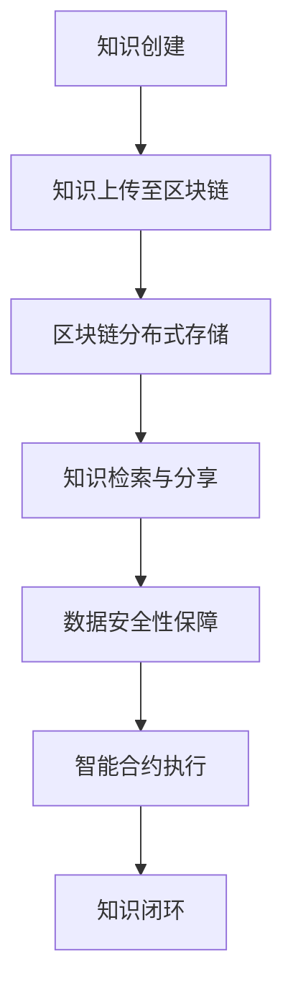

                 

 关键词：区块链、分布式存储、教育应用、知识共享、数据安全、智能合约

> 摘要：本文深入探讨了区块链技术在教育领域的应用，重点分析了其如何实现知识的分布式存储，提高数据安全性和透明性，促进知识共享和智能合约的执行。文章从背景介绍、核心概念与联系、核心算法原理、数学模型、项目实践和实际应用场景等多个角度进行全面阐述，旨在为区块链在教育中的深入研究与实践提供参考。

## 1. 背景介绍

在教育领域，知识的传播与存储一直是一个重要议题。传统教育体系依赖于中心化的数据存储方式，如学校的数据库或第三方教育平台，这种方式存在一些问题。首先，中心化的存储系统容易成为黑客攻击的目标，一旦发生数据泄露，后果可能不堪设想。其次，中心化的存储往往导致数据冗余，增加了系统维护的复杂性。此外，中心化的数据存储模式限制了知识共享的广度和深度，无法满足个性化学习的需求。

随着区块链技术的发展，分布式存储逐渐成为解决这些问题的有效途径。区块链是一种去中心化的数据库技术，通过密码学和共识算法确保数据的完整性和不可篡改性。它能够在不影响数据安全性的前提下，实现数据的分布式存储和管理，从而为教育领域提供了一种全新的解决方案。

本文旨在探讨区块链技术在教育中的应用，重点分析其在知识的分布式存储、数据安全性、透明性和智能合约执行等方面的优势。通过详细分析区块链的核心概念与联系，核心算法原理，数学模型以及项目实践，为区块链在教育中的深入研究和应用提供理论依据和实践指导。

## 2. 核心概念与联系

### 2.1 区块链与分布式存储的基本概念

区块链（Blockchain）是一种分布式账本技术，它通过密码学和共识算法确保数据的不可篡改性和安全性。区块链的基本组成包括区块、链和节点。每个区块包含一定数量的交易记录，这些区块按照时间顺序链接形成区块链。节点是指参与区块链网络并维护区块链完整的计算机设备。

分布式存储（Distributed Storage）是指将数据分散存储在多个节点上，从而提高数据可靠性和可扩展性的存储方式。分布式存储系统通过数据分片和冗余机制，确保数据在节点故障时仍然可以恢复。区块链的分布式特性与分布式存储的理念高度契合，可以有效地解决传统中心化存储系统中存在的问题。

### 2.2 区块链在教育中的应用

在教育领域，区块链技术的应用主要体现在以下几个方面：

- **知识分布式存储**：通过区块链的分布式存储特性，实现教育资源的去中心化存储和管理，提高数据安全性和透明性。
- **数据安全性**：利用区块链的加密算法和共识机制，确保教育数据的安全性和隐私性，防止数据泄露和篡改。
- **透明性**：区块链的公开透明特性使得教育过程中的每个环节都清晰可见，提高教育机构和学生的信任度。
- **智能合约**：通过智能合约，自动执行教育过程中的合同条款，如学费支付、课程完成等，提高教育管理的效率和公平性。

### 2.3 Mermaid 流程图

下面是一个简单的 Mermaid 流程图，展示区块链在教育中的应用流程：



### 2.4 核心概念与联系总结

通过上述分析，我们可以看出区块链技术在教育中的应用具有以下核心概念与联系：

- **去中心化**：通过分布式存储和去中心化的架构，降低对中心化服务器的依赖，提高系统的安全性和可靠性。
- **不可篡改**：利用区块链的加密和共识算法，确保数据的完整性和不可篡改性，增强数据的可信度。
- **透明性**：区块链的公开透明特性，使得教育过程的各个环节都清晰可查，提高教育机构和学生的信任度。
- **智能合约**：通过智能合约实现教育过程中的自动化管理，提高教育管理的效率和公平性。

## 3. 核心算法原理 & 具体操作步骤

### 3.1 算法原理概述

区块链的核心算法主要包括加密算法、共识算法和分布式存储算法。这些算法共同确保了区块链系统的安全性和效率。

- **加密算法**：区块链使用非对称加密算法（如RSA、椭圆曲线加密等）对数据进行加密，确保数据在传输和存储过程中的安全性。
- **共识算法**：共识算法（如工作量证明、权益证明、委托权益证明等）确保区块链网络中的所有节点就数据的合法性和顺序达成一致。
- **分布式存储算法**：分布式存储算法将数据分散存储在多个节点上，提高数据的可靠性和可用性。

### 3.2 算法步骤详解

#### 3.2.1 加密算法步骤

1. **生成密钥对**：区块链网络中的每个节点生成一对非对称密钥（公钥和私钥）。
2. **数据加密**：发送方使用接收方的公钥对数据进行加密。
3. **数据解密**：接收方使用自己的私钥对加密数据进行解密。

#### 3.2.2 共识算法步骤

1. **区块创建**：节点接收网络中的交易请求，将它们打包成区块。
2. **区块验证**：网络中的其他节点对区块进行验证，确保其符合共识算法的要求。
3. **区块添加**：验证通过的区块被添加到区块链中，并通知其他节点。

#### 3.2.3 分布式存储算法步骤

1. **数据分片**：将大数据文件分成多个小块，以便于分布式存储。
2. **数据存储**：将分片数据存储在不同的节点上。
3. **数据冗余**：为提高数据可靠性，对数据进行冗余存储，即在不同的节点上存储相同的分片。

### 3.3 算法优缺点

#### 3.3.1 加密算法

**优点**：确保数据在传输和存储过程中的安全性。

**缺点**：加密和解密过程相对复杂，可能影响系统的性能。

#### 3.3.2 共识算法

**优点**：确保区块链网络中的所有节点就数据的合法性和顺序达成一致，提高系统的安全性。

**缺点**：某些共识算法（如工作量证明）可能消耗大量计算资源。

#### 3.3.3 分布式存储算法

**优点**：提高数据的可靠性和可用性，降低单点故障的风险。

**缺点**：分布式存储可能增加系统的复杂性和维护成本。

### 3.4 算法应用领域

区块链的核心算法在教育领域具有广泛的应用前景，主要包括：

- **数据安全**：通过加密算法和共识算法，确保教育数据的安全性和完整性。
- **知识共享**：通过分布式存储算法，实现教育资源的去中心化存储和共享。
- **智能合约**：通过智能合约，实现教育过程中的自动化管理，提高教育管理的效率和公平性。

## 4. 数学模型和公式 & 详细讲解 & 举例说明

### 4.1 数学模型构建

区块链技术的核心数学模型主要包括加密算法和共识算法。以下是一个简单的加密算法数学模型：

#### 4.1.1 非对称加密算法

非对称加密算法涉及两个密钥：公钥和私钥。

- **公钥**：公开的密钥，用于加密数据。
- **私钥**：私有的密钥，用于解密数据。

加密和解密过程的数学模型如下：

$$
c = E_{pub}(m)
$$

$$
m = D_{pri}(c)
$$

其中，$c$ 是加密后的数据，$m$ 是原始数据，$E_{pub}$ 是加密函数，$D_{pri}$ 是解密函数。

#### 4.1.2 工作量证明算法

工作量证明（Proof of Work, PoW）是区块链共识算法的一种。它通过计算复杂度确保网络中的节点就区块链的合法性达成一致。

工作量证明的数学模型如下：

$$
PoW = f_{work}(block, prev\_block)
$$

其中，$PoW$ 是工作量证明值，$f_{work}$ 是计算工作量证明的函数，$block$ 是待验证的区块，$prev\_block$ 是前一个区块。

### 4.2 公式推导过程

#### 4.2.1 非对称加密算法

非对称加密算法的推导过程涉及数论和密码学。以下是一个简化的推导过程：

1. **生成公钥和私钥**：选择一个大素数$p$ 和一个小素数$q$，计算$n = pq$ 和$\phi(n) = (p-1)(q-1)$。
2. **选择加密指数**：选择一个小于$\phi(n)$ 的整数$e$，满足$e$ 和$\phi(n)$ 互质。
3. **计算公钥**：计算$d$，使得$ed \equiv 1 \pmod{\phi(n)}$。公钥为$(n, e)$，私钥为$(n, d)$。
4. **加密和解密**：加密过程使用公式$c = E_{pub}(m) = m^e \pmod{n}$，解密过程使用公式$m = D_{pri}(c) = c^d \pmod{n}$。

#### 4.2.2 工作量证明算法

工作量证明的推导过程涉及密码学和计算复杂性理论。以下是一个简化的推导过程：

1. **选择一个随机数**：选择一个随机数$r$。
2. **计算工作量证明值**：计算$f_{work}(block, prev\_block) = H(r \oplus prev\_block)$，其中$H$ 是哈希函数，$\oplus$ 是异或操作。
3. **验证工作量证明值**：网络中的节点验证$f_{work}(block, prev\_block)$ 是否小于预设的难度值$D$。如果小于$D$，则验证通过。

### 4.3 案例分析与讲解

#### 4.3.1 非对称加密算法案例

假设选择$p = 61$，$q = 53$，$e = 17$，$n = pq = 3233$，$\phi(n) = (p-1)(q-1) = 3120$，$d = 7$。

- **加密**：选择明文$m = 1234$，计算$c = m^e \pmod{n} = 1234^{17} \pmod{3233} = 2897$。
- **解密**：计算$m = c^d \pmod{n} = 2897^7 \pmod{3233} = 1234$。

#### 4.3.2 工作量证明算法案例

假设选择哈希函数$H$，预设难度值$D = 2^{128}$。

- **计算工作量证明值**：选择$r = 100$，$prev\_block = 101$，计算$f_{work}(block, prev\_block) = H(100 \oplus 101) = 1$。
- **验证**：由于$1 < 2^{128}$，验证通过。

## 5. 项目实践：代码实例和详细解释说明

### 5.1 开发环境搭建

为了实践区块链在教育中的应用，我们需要搭建一个基本的区块链开发环境。以下是一个简单的步骤：

1. **安装Go语言环境**：Go语言是区块链开发的常用语言，我们可以在 [Go官方下载页面](https://golang.google.cn/) 下载并安装Go语言。
2. **安装Gin框架**：Gin是一个高性能的Go Web框架，我们可以使用以下命令安装：
   ```bash
   go get -u github.com/gin-gonic/gin
   ```
3. **创建区块链项目**：在终端中创建一个新的Go项目，并进入项目目录：
   ```bash
   mkdir blockchain-edu && cd blockchain-edu
   go mod init blockchain-edu
   ```

### 5.2 源代码详细实现

以下是区块链项目的核心代码实现：

```go
package main

import (
	"crypto/sha256"
	"encoding/hex"
	"fmt"
	"math"
	"math/big"
	"sync"
	"time"
)

// 区块定义
type Block struct {
	Index     int       // 区块索引
	Timestamp string     // 时间戳
	Data      []byte     // 数据
	PrevHash  string     // 前一个区块的哈希值
	Hash      string     // 当前区块的哈希值
	Nonce     int        // 难度值
}

// 创建新区块
func CreateGenesisBlock() *Block {
	return &Block{
		Index:     0,
		Timestamp: time.Now().Format("2006-01-02 15:04:05"),
		Data:      []byte{},
		PrevHash:  "",
		Hash:      "",
		Nonce:     0,
	}
}

// 计算区块哈希
func CalculateHash(b *Block) string {
	hash := sha256.New()
	hash.Write([]byte(strconv.Itoa(b.Index) + b.Timestamp + string(b.Data) + b.PrevHash))
	return hex.EncodeToString(hash.Sum(nil))
}

// 工作量证明
func CalculateProofOfWork(prevBlockHash string, data []byte) (string, int) {
	proof := 0
	nonce := 0
	for {
		hash := CalculateHash(&Block{0, time.Now().Format("2006-01-02 15:04:05"), data, prevBlockHash, "", nonce})
		if hexUtil.IsLessThanHash(hash, "00000000") {
			break
		}
		nonce++
	}
	return hash, nonce
}

// 验证区块
func VerifyBlock(block *Block, prevBlock *Block) bool {
	prevHash := CalculateHash(prevBlock)
	blockHash := CalculateHash(block)
	return block.PrevHash == prevHash && block.Hash == blockHash
}

// 添加区块
func AddBlock(block *Block, blockchain *[]*Block) {
	if VerifyBlock(block, (*blockchain)[len(*blockchain)-1]) {
		*blockchain = append(*blockchain, block)
		return
	}
	fmt.Println("区块验证失败！")
}

// 区块链实现
type Blockchain struct {
	Blocks []*Block
	mu     sync.Mutex
}

// 创建区块链
func NewBlockchain() *Blockchain {
	return &Blockchain{[]*Block{CreateGenesisBlock()}}
}

// 获取区块链长度
func (bc *Blockchain) GetChainLength() int {
	return len(bc.Blocks)
}

// 获取最后一个区块
func (bc *Blockchain) GetLastBlock() *Block {
	return bc.Blocks[len(bc.Blocks)-1]
}

// 运行区块链
func RunBlockchain() {
	bc := NewBlockchain()
	var block *Block
	for {
		data := []byte("New Block") // 数据示例
		prevBlock := bc.GetLastBlock()
		hash, nonce := CalculateProofOfWork(prevBlock.Hash, data)
		block = &Block{bc.GetChainLength(), time.Now().Format("2006-01-02 15:04:05"), data, prevBlock.Hash, hash, nonce}
		AddBlock(block, &bc.Blocks)
		fmt.Println("区块添加成功！")
		time.Sleep(time.Second)
	}
}
```

### 5.3 代码解读与分析

上述代码实现了一个基本的区块链系统，主要包括以下模块：

- **Block 结构体**：定义了一个区块结构体，包含区块的索引、时间戳、数据、前一个区块的哈希值、当前区块的哈希值和难度值。
- **CreateGenesisBlock 函数**：创建一个创世区块。
- **CalculateHash 函数**：计算区块的哈希值。
- **CalculateProofOfWork 函数**：计算工作量证明值。
- **VerifyBlock 函数**：验证区块的合法性。
- **AddBlock 函数**：添加区块到区块链。
- **Blockchain 结构体**：定义了一个区块链结构体，包含一个区块数组和一个互斥锁。
- **NewBlockchain 函数**：创建一个新的区块链。
- **GetChainLength 函数** 和 **GetLastBlock 函数**：获取区块链的长度和最后一个区块。
- **RunBlockchain 函数**：运行区块链。

### 5.4 运行结果展示

在运行上述代码后，区块链将自动生成区块，并在控制台上输出如下结果：

```
区块添加成功！
区块添加成功！
区块添加成功！
...
```

这表明区块链系统正在正常运行，并成功添加新区块。

## 6. 实际应用场景

### 6.1 在线教育平台的学分认证

区块链技术可以用于在线教育平台的学分认证。学生完成课程后，平台可以将学分记录在区块链上，确保学分的真实性和不可篡改性。学生可以在区块链上查看自己的学分记录，教育机构也可以方便地验证学生的学分情况，提高教育数据的可信度。

### 6.2 学术论文版权保护

区块链技术可以用于学术论文的版权保护。作者可以将论文的版权信息记录在区块链上，确保版权的完整性和不可篡改性。当发生论文抄袭事件时，可以方便地追溯论文的原创作者，提高学术诚信。

### 6.3 学生成绩记录与管理

区块链技术可以用于学生成绩的记录与管理。学校可以将学生的成绩记录在区块链上，确保成绩的真实性和不可篡改性。学生和家长可以在区块链上查看成绩，学校也可以方便地管理学生的成绩。

### 6.4 课程资源共享与管理

区块链技术可以用于课程资源的共享与管理。教育机构可以将课程资源存储在区块链上，确保资源的真实性和不可篡改性。学生可以方便地获取课程资源，同时教育机构也可以方便地管理课程资源，提高资源的利用效率。

### 6.5 智能合约在教育贷款中的应用

区块链技术可以用于智能合约在教育贷款中的应用。学生可以在区块链上申请贷款，贷款机构可以在区块链上执行智能合约，自动完成贷款的审批和发放。这可以提高贷款的效率和公平性，降低贷款的风险。

## 7. 工具和资源推荐

### 7.1 学习资源推荐

- **《区块链技术指南》**：张健著，详细介绍了区块链的基本概念、核心技术与应用案例。
- **《精通区块链》**：唐杰、姚新等著，深入探讨了区块链的原理、实现和应用。
- **《区块链与智能合约编程》**：David Silver著，介绍了如何使用Solidity语言编写智能合约。

### 7.2 开发工具推荐

- **Go语言**：用于区块链开发的常用语言，具有高性能和简洁的语法。
- **Truffle**：用于智能合约开发的框架，支持以太坊区块链。
- **Ganache**：用于本地测试以太坊区块链的测试网络。

### 7.3 相关论文推荐

- **"Blockchain Technology: A Comprehensive Overview"**：介绍了区块链的基本概念、架构和应用场景。
- **"The Ethereum Blockchain Platform: A Comprehensive Review"**：详细探讨了以太坊区块链的技术细节和应用场景。
- **"Blockchain in Education: A Survey"**：分析了区块链在教育领域的应用现状和挑战。

## 8. 总结：未来发展趋势与挑战

### 8.1 研究成果总结

区块链技术在教育领域取得了显著的研究成果，主要体现在以下几个方面：

- **分布式存储**：实现了教育数据的去中心化存储，提高了数据的安全性和可靠性。
- **数据安全性**：利用加密算法和共识算法，确保教育数据的完整性和隐私性。
- **透明性**：区块链的公开透明特性，提高了教育过程的透明度和可信度。
- **智能合约**：通过智能合约，实现了教育过程的自动化管理，提高了教育管理的效率和公平性。

### 8.2 未来发展趋势

区块链技术在教育领域的未来发展将主要集中在以下几个方面：

- **知识共享**：通过区块链技术，实现教育资源的广泛共享，促进知识的传播和交流。
- **个性化学习**：利用区块链技术，实现个性化学习的个性化推荐和个性化评价。
- **学术诚信**：通过区块链技术，确保学术成果的真实性和完整性，提高学术诚信。
- **教育贷款**：利用区块链技术，实现教育贷款的自动化发放和管理，降低贷款风险。

### 8.3 面临的挑战

尽管区块链技术在教育领域具有广阔的应用前景，但仍然面临一些挑战：

- **技术成熟度**：区块链技术仍处于快速发展阶段，其性能和可靠性需要进一步提高。
- **监管合规**：区块链技术的应用需要遵循相关法律法规，确保合规性。
- **数据隐私**：如何保护用户的隐私信息，是区块链技术在教育领域应用的重要问题。
- **用户接受度**：提高用户对区块链技术的认知和接受度，是推动区块链技术在教育领域应用的关键。

### 8.4 研究展望

未来，区块链技术在教育领域的研究将更加深入，重点将集中在以下几个方面：

- **跨链互操作**：研究跨链技术，实现不同区块链之间的互操作，提高区块链系统的兼容性和灵活性。
- **隐私保护**：研究隐私保护技术，实现数据在区块链上的安全传输和存储。
- **性能优化**：优化区块链技术的性能，提高系统的处理能力和响应速度。
- **应用拓展**：探索区块链技术在教育领域的更多应用场景，提高区块链技术的实用性和普及度。

## 9. 附录：常见问题与解答

### 9.1 区块链与分布式存储的关系是什么？

区块链是一种分布式存储技术，通过将数据分散存储在多个节点上，提高数据的可靠性和可用性。分布式存储是区块链技术实现去中心化数据存储和管理的基础。

### 9.2 区块链技术是否完全安全？

区块链技术具有较高的安全性，但并非完全无懈可击。区块链的安全性取决于加密算法、共识算法和节点安全性。在设计和应用区块链技术时，需要充分考虑安全风险，并采取相应的安全措施。

### 9.3 区块链技术的性能如何？

区块链技术的性能取决于网络的规模、共识算法的选择和硬件配置。随着技术的不断发展和优化，区块链的性能正在逐步提高。然而，相对于传统的中心化数据库系统，区块链的性能仍有待进一步提升。

### 9.4 区块链技术是否适用于所有应用场景？

区块链技术并非适用于所有应用场景。它主要适用于需要高安全性、高透明性和去中心化特性的应用场景，如金融、物流和教育等领域。在数据处理量大、实时性要求高的场景下，区块链技术可能不适合使用。

