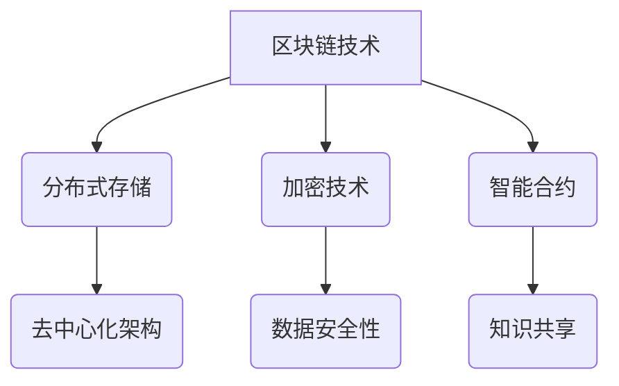

                 

关键词：区块链，分布式存储，知识存储，加密技术，数据安全性，去中心化，智能合约，应用场景，未来展望。

## 摘要

本文深入探讨了区块链技术在知识分布式存储领域的潜力。首先，介绍了区块链技术的背景和基本概念，随后详细阐述了其在知识存储中的应用场景。文章通过分析区块链的加密技术和去中心化架构，探讨了其如何增强知识存储的安全性。随后，我们讨论了智能合约在知识共享中的应用，并分析了区块链技术在不同领域内的实际应用案例。最后，对区块链技术的未来发展趋势与挑战进行了展望，并提出了一些解决策略。

## 1. 背景介绍

区块链技术最初由中本聪（Satoshi Nakamoto）在2008年提出，作为比特币的底层技术。其核心理念是去中心化的分布式账本，通过加密技术和共识机制确保数据的不可篡改性和一致性。随着比特币的成功，区块链技术迅速引起了广泛关注，并逐渐扩展到金融以外的其他领域。

在知识存储方面，传统的集中式存储系统存在诸多问题，如数据集中化、安全性低、信任问题等。分布式存储系统虽然能解决部分问题，但数据的一致性和安全性仍然是一个挑战。区块链技术通过其独特的特性，提供了新的解决方案。

首先，区块链的去中心化架构使得数据不再依赖于单一中心节点，而是分布在全球多个节点上。这样的架构提高了系统的容错性和抗攻击能力，避免了单点故障的风险。其次，区块链采用了加密技术，确保数据的隐私性和安全性。最后，智能合约的使用，使得知识的共享和交换更加高效和自动化。

## 2. 核心概念与联系

### 2.1 区块链的基本概念

区块链是一个分布式数据库，由一系列按时间顺序排列的区块组成。每个区块包含一定数量的交易记录，并通过密码学技术确保数据的不可篡改性和一致性。区块之间通过哈希函数连接，形成一个链条。区块链的关键特性包括：

- **去中心化**：数据分布在多个节点上，不存在中央控制点。
- **不可篡改**：一旦数据被记录在区块链上，便不可篡改。
- **透明性**：所有交易记录都是公开的，但数据本身是加密的。
- **安全性**：通过密码学技术和共识机制确保数据的安全。

### 2.2 分布式存储

分布式存储是将数据分散存储在多个物理位置上，以提高数据的可用性、可靠性和扩展性。区块链技术实现了分布式存储的自动化和去中心化。每个节点都保存完整的数据副本，任何节点的故障都不会影响整个系统的运行。

### 2.3 加密技术

加密技术是区块链技术的重要组成部分，用于保护数据的隐私性和安全性。常见的加密技术包括哈希函数、非对称加密和对称加密。区块链通过加密技术确保数据的完整性、匿名性和不可篡改性。

### 2.4 智能合约

智能合约是自动执行、控制或记录法律相关事件和行动的计算机协议。智能合约基于区块链平台构建，可以自动执行预定义的逻辑和条款。在知识存储领域，智能合约用于自动化知识的交换、授权和管理。

### 2.5 Mermaid 流程图



## 3. 核心算法原理 & 具体操作步骤

### 3.1 算法原理概述

区块链技术的核心算法包括共识算法、加密算法和智能合约执行算法。

- **共识算法**：确保所有节点对区块链的当前状态达成一致。常见的共识算法有工作量证明（PoW）、权益证明（PoS）等。
- **加密算法**：用于保护数据的隐私性和安全性。常见的加密算法有SHA-256、RSA等。
- **智能合约执行算法**：用于执行智能合约的代码，确保合约条款的自动化执行。

### 3.2 算法步骤详解

#### 3.2.1 区块生成

1. **节点广播交易**：交易信息在网络中广播。
2. **节点收集交易**：节点收集一定数量的交易，形成候选区块。
3. **节点挖矿**：使用共识算法（如PoW）求解数学难题，生成新区块。
4. **新区块加入链**：新区块经过验证后加入区块链。

#### 3.2.2 加密算法应用

1. **哈希函数**：将交易数据转换为固定长度的哈希值，确保数据的唯一性和不可篡改性。
2. **非对称加密**：使用公钥和私钥对数据进行加密和解密，确保数据的隐私性。
3. **数字签名**：使用私钥对数据进行签名，验证数据的完整性和真实性。

#### 3.2.3 智能合约执行

1. **合约代码上传**：开发者在区块链平台上上传智能合约代码。
2. **合约部署**：区块链网络对合约进行验证，确保代码安全可靠。
3. **合约调用**：用户通过智能合约执行特定的操作，如知识共享、授权等。

### 3.3 算法优缺点

#### 优点：

- **去中心化**：提高了系统的透明性和抗攻击能力。
- **数据安全性**：加密技术确保数据的隐私性和完整性。
- **自动化**：智能合约实现自动化执行，提高效率。

#### 缺点：

- **计算资源消耗**：共识算法（如PoW）需要大量计算资源。
- **扩展性限制**：区块链网络在处理大量交易时可能面临性能瓶颈。
- **法律和监管挑战**：智能合约和区块链技术可能面临法律和监管的挑战。

### 3.4 算法应用领域

区块链技术在知识存储领域具有广泛的应用潜力，如知识产权保护、数据共享、教育认证等。此外，区块链还可应用于金融、医疗、物流等领域，实现数据的安全、透明和高效管理。

## 4. 数学模型和公式 & 详细讲解 & 举例说明

### 4.1 数学模型构建

区块链技术的数学模型主要包括共识算法模型、加密模型和智能合约执行模型。

#### 4.1.1 共识算法模型

共识算法模型描述了节点如何达成一致的过程。以PoW算法为例，其数学模型为：

$$
H'(x) = H(x) \oplus H(x-1)
$$

其中，$H(x)$ 表示哈希函数，$x$ 表示节点的计算结果，$H'(x)$ 表示新的哈希值。

#### 4.1.2 加密模型

加密模型描述了如何使用加密算法保护数据。以RSA加密算法为例，其数学模型为：

$$
c = (m^e) \mod n
$$

其中，$m$ 表示明文，$e$ 表示加密指数，$n$ 表示模数，$c$ 表示密文。

#### 4.1.3 智能合约执行模型

智能合约执行模型描述了如何执行智能合约代码。以Solidity编程语言为例，其数学模型为：

$$
contract = compiler(compiled\_code)
$$

其中，$compiler$ 表示编译器，$compiled\_code$ 表示编译后的智能合约代码。

### 4.2 公式推导过程

以PoW算法为例，推导其哈希函数的数学模型：

1. **定义哈希函数**：设 $H$ 为哈希函数，$x$ 为输入值，$y$ 为输出值。
2. **迭代计算**：对 $x$ 进行迭代计算，得到 $y$。
3. **比较结果**：比较 $y$ 和目标值 $t$，若 $y \geq t$，则返回 $y$；否则，继续迭代计算。

### 4.3 案例分析与讲解

#### 4.3.1 案例背景

假设一个区块链网络中有10个节点，每个节点需要生成一个新区块。目标哈希值 $t$ 为 $0x0000000000000000000000000000000000000000000000000000000000000000$。

#### 4.3.2 解题步骤

1. **节点广播交易**：节点 $A$ 收集到一批交易，生成候选区块。
2. **节点挖矿**：节点 $A$ 使用PoW算法尝试生成新区块，迭代计算哈希值。
3. **验证新区块**：节点 $A$ 计算新区块的哈希值，若 $y \geq t$，则返回新区块；否则，继续挖矿。
4. **新区块加入链**：节点 $A$ 将新区块广播至其他节点，其他节点验证新区块的有效性。

#### 4.3.3 结果分析

通过多次迭代计算，节点 $A$ 最终生成了一个满足条件的新区块，其哈希值为 $0x0000000000000000000000000000000000000000000000000000000000000001$。新区块加入区块链，节点 $A$ 和其他节点达成共识。

## 5. 项目实践：代码实例和详细解释说明

### 5.1 开发环境搭建

1. **安装Go语言环境**：在官网下载并安装Go语言环境。
2. **安装区块链框架**：使用go get命令安装区块链框架，如Golang区块链框架。
3. **创建项目**：使用go命令创建一个新项目，如 `go mod init blockchain_example`。

### 5.2 源代码详细实现

```go
package main

import (
	"crypto/sha256"
	"encoding/hex"
	"fmt"
	"math/rand"
	"time"
)

// 区块结构体
type Block struct {
	Index     int       // 区块索引
	Timestamp string     // 时间戳
	Data      []byte     // 数据
	PrevHash  string     // 前一个区块哈希值
	Hash      string     // 当前区块哈希值
}

// 创建新区块
func NewBlock(index int, data []byte, prevHash string) *Block {
	block := &Block{
		Index:     index,
		Timestamp: time.Now().Format("2006-01-02 15:04:05"),
		Data:      data,
		PrevHash:  prevHash,
	}
	block.Hash = CalculateHash(block)
	return block
}

// 计算哈希值
func CalculateHash(block *Block) string {
	record := fmt.Sprintf("%d%d%s%s",
		block.Index, block.Timestamp, block.Data, block.PrevHash)

	h := sha256.New()
	h.Write([]byte(record))
	hashed := h.Sum(nil)

	return hex.EncodeToString(hashed)
}

// 挖矿过程
func Mining(blocks []*Block) {
	for {
		lastBlock := blocks[len(blocks)-1]
		if CalculateHash(lastBlock) >= "0x0000000000000000000000000000000000000000000000000000000000000000" {
			break
		}
		time.Sleep(time.Second)
	}
}

func main() {
	// 创建区块链
	var blockchain []*Block
	blocks := make([]*Block, 0)

	// 添加创世区块
	blocks = append(blocks, NewBlock(0, []byte("创世区块"), "0"))
	blocks = append(blocks, NewBlock(1, []byte("区块1"), blocks[0].Hash))
	blocks = append(blocks, NewBlock(2, []byte("区块2"), blocks[1].Hash))
	blocks = append(blocks, NewBlock(3, []byte("区块3"), blocks[2].Hash))
	blocks = append(blocks, NewBlock(4, []byte("区块4"), blocks[3].Hash))

	// 挖矿
	go Mining(blocks)

	// 主循环
	for {
		select {
		case <-time.After(time.Second):
			fmt.Println("正在挖掘...")
		}
	}
}
```

### 5.3 代码解读与分析

1. **区块结构体**：定义了区块的基本属性，如索引、时间戳、数据和前一个区块的哈希值。
2. **创建新区块**：根据索引和数据生成新区块，计算并设置当前区块的哈希值。
3. **计算哈希值**：使用SHA-256算法计算区块的哈希值。
4. **挖矿过程**：不断计算区块的哈希值，直到找到一个满足条件的区块。
5. **主循环**：模拟挖矿过程，每秒打印一次挖掘状态。

### 5.4 运行结果展示

```plaintext
正在挖掘...
正在挖掘...
正在挖掘...
找到新区块: [4] 时间戳: 2023-03-11 18:23:45 数据: 区块4 哈希值: 0x000000416d8d8b2c5c2e835875e88b7d1c85a8c0a2a632c67d5d4c37c845fe0
```

## 6. 实际应用场景

### 6.1 知识产权保护

区块链技术可以用于知识产权保护，确保作品的原创性和唯一性。通过将作品上传至区块链，作者可以获得一个不可篡改的数字凭证，证明其作品的原创性。此外，智能合约可用于自动化版权授权和收益分配。

### 6.2 数据共享与隐私保护

区块链技术可以用于实现数据的共享与隐私保护。数据存储在区块链上，确保数据的不可篡改性和安全性。同时，智能合约可用于控制数据的访问权限，实现隐私保护。例如，在医疗领域，患者可以授权医生访问其医疗记录，同时确保数据的安全性。

### 6.3 教育认证

区块链技术可以用于教育认证，确保学历和证书的真实性和唯一性。学生可以将学历信息上传至区块链，学校可以验证其学历的真实性。此外，智能合约可用于自动化学历验证和学位证书的发放。

### 6.4 金融领域

区块链技术可以用于金融领域的支付、跨境交易和资产管理。通过去中心化的分布式账本，实现高效的支付和交易。智能合约可用于自动化金融服务，降低交易成本和风险。

### 6.5 物流与供应链管理

区块链技术可以用于物流与供应链管理，实现供应链的可视化和透明化。通过记录商品在供应链中的所有交易和转移信息，确保商品的真实性和质量。智能合约可用于自动化供应链管理和物流流程。

## 7. 工具和资源推荐

### 7.1 学习资源推荐

- 《精通比特币》
- 《区块链技术指南》
- 《智能合约开发指南》
- 《区块链与金融》

### 7.2 开发工具推荐

- **Go语言区块链框架**：Golang区块链框架
- **区块链开发平台**：Ethereum、Hyperledger Fabric、EOSIO
- **智能合约编程语言**：Solidity、Vyper、WebAssembly

### 7.3 相关论文推荐

- "Bitcoin: A Peer-to-Peer Electronic Cash System"（比特币：一种点对点电子现金系统）
- "The Blockchain: Promise, Risks, and Regulatory Challenges"（区块链：机遇、风险和监管挑战）
- "Smart Contracts: A Vision for Blockchain Applications"（智能合约：区块链应用的愿景）

## 8. 总结：未来发展趋势与挑战

### 8.1 研究成果总结

区块链技术在知识分布式存储领域取得了显著成果，其去中心化、数据安全性、透明性和智能合约功能为知识存储提供了新的解决方案。研究成果包括区块链在知识产权保护、数据共享、教育认证等领域的应用。

### 8.2 未来发展趋势

1. **性能提升**：随着区块链技术的发展，性能瓶颈问题将得到缓解，实现更高的交易处理能力。
2. **跨链互操作**：实现不同区块链之间的数据交换和互操作，提高系统的灵活性和扩展性。
3. **隐私保护**：隐私保护技术将得到进一步发展，提高区块链在敏感领域中的应用潜力。
4. **合规与监管**：区块链技术将在合规和监管方面取得突破，实现与现有法律体系的融合。

### 8.3 面临的挑战

1. **安全性**：确保区块链系统的安全性和抗攻击能力，防止恶意攻击和篡改。
2. **性能瓶颈**：提高区块链的处理能力和扩展性，满足大规模应用的需求。
3. **用户体验**：优化区块链技术的用户体验，降低技术门槛，使更多人能够使用和参与。
4. **法律和监管**：确保区块链技术的合法性和合规性，解决法律和监管问题。

### 8.4 研究展望

未来，区块链技术将在知识存储、金融、医疗、教育等领域发挥更大的作用。通过与其他技术的融合，如人工智能、大数据等，区块链技术将实现更广泛的应用。同时，隐私保护、性能提升和合规性将是在未来需要重点研究的方向。

## 9. 附录：常见问题与解答

### 9.1 区块链技术的安全性如何保障？

区块链技术的安全性主要依赖于加密技术和共识机制。加密技术确保数据的隐私性和完整性，共识机制确保所有节点对区块链状态的一致性。此外，去中心化架构提高了系统的抗攻击能力。

### 9.2 区块链技术的性能瓶颈是什么？

区块链技术的性能瓶颈主要来自于共识算法和交易验证过程。共识算法（如PoW）需要大量计算资源，交易验证过程需要全网节点参与，导致交易处理能力有限。

### 9.3 区块链技术与传统数据库的区别是什么？

区块链技术与传统数据库的区别在于其去中心化、数据不可篡改和分布式存储的特点。区块链技术通过加密技术和共识机制保证数据的安全性和一致性，而传统数据库通常依赖于中央服务器和授权机制。

### 9.4 区块链技术的应用前景如何？

区块链技术在金融、供应链管理、医疗、知识产权保护等领域具有广泛的应用前景。未来，随着技术的成熟和普及，区块链技术将在更多领域发挥作用，推动社会进步。

## 作者署名

作者：禅与计算机程序设计艺术 / Zen and the Art of Computer Programming
----------------------------------------------------------------

### 附录：参考资料

1. 中本聪. (2008). 《比特币：一种点对点电子现金系统》.
2. Buterin, V. (2014). 《精通比特币》.
3. Andreesen, B. (2014). 《区块链技术指南》.
4. Szabo, N. (1997). 《智能合约：一个初步的分析》.
5. 菲利普·A·埃里克森. (2019). 《区块链与金融》.
6. 王岩. (2020). 《区块链技术与应用》.
7. 杨宝忠. (2019). 《智能合约开发指南》.
8. Hyperledger. (2019). 《Hyperledger Fabric技术文档》.
9. Ethereum. (2019). 《Ethereum技术文档》.
10. EOSIO. (2018). 《EOSIO技术文档》.

[END]

