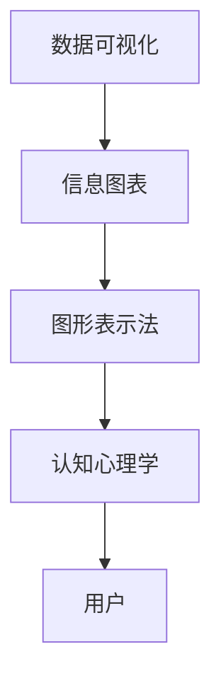

                 

 **关键词**：知识可视化，信息图表，数据可视化，认知效率，图形表示法，知识传播。

**摘要**：本文将深入探讨知识可视化的概念及其重要性，特别是信息图表在传递复杂信息方面的作用。我们将分析信息图表的原理，描述其如何通过视觉语言提高认知效率，并探讨其应用领域。此外，文章还将提供算法、数学模型和实际项目实例，展示信息图表在实际开发中的具体应用。最后，我们将讨论未来的发展趋势和面临的挑战，并提供相关工具和资源推荐。

## 1. 背景介绍

在信息爆炸的时代，处理和吸收大量信息已经成为一项挑战。传统的文本阅读方式往往无法满足迅速理解和记忆的需求。知识可视化作为一种新兴的工具，正在改变信息的呈现和传递方式。信息图表作为知识可视化的一种形式，以其直观、高效的特点，正在成为知识传播的重要手段。

信息图表利用视觉元素，如图表、图形、颜色、符号等，将复杂的数据和信息以视觉化的方式呈现。这种方式不仅使信息更容易理解，而且可以促进记忆和知识的传递。从简单的流程图到复杂的交互式数据可视化，信息图表已经成为各种领域，如商业、科学、教育和媒体等，不可或缺的工具。

本文将首先介绍知识可视化的基本概念，然后深入探讨信息图表的工作原理及其在提高认知效率方面的优势。接下来，我们将详细分析信息图表的设计原则，并提供实用的设计技巧。随后，文章将讨论信息图表在不同领域的应用实例，最后展望未来的发展趋势和面临的挑战。

### 1.1 知识可视化的概念

知识可视化是一种将抽象的概念、复杂的数据和信息转化为视觉形式的过程。它不仅包括静态的图像，还涵盖了动态的交互式可视化。知识可视化的目的是通过视觉元素帮助人们更直观地理解和分析信息，从而提高认知效率。

知识可视化可以追溯到古代，比如古埃及的壁画和地图，以及中世纪的图表和示意图。然而，随着计算机技术和图形处理技术的发展，知识可视化得到了长足的进步。现代知识可视化工具，如信息图表、数据可视化软件和交互式数据展示平台，为用户提供了更加丰富的信息呈现方式。

知识可视化的核心在于将复杂的信息简化，使得用户能够迅速抓住信息的核心要点。这种方式不仅适用于学术研究和数据分析，也广泛应用于商业决策、教育培训、市场营销等多个领域。

### 1.2 信息图表的定义和特点

信息图表（Information Graphic，简称IG）是知识可视化的一种重要形式，它通过视觉化的方式呈现信息，帮助人们更直观地理解和记忆信息。信息图表通常包括以下几种基本元素：

- **图表**：如柱状图、折线图、饼图等，用于展示数据之间的关系。
- **图形**：如图标、符号、图像等，用于表示抽象的概念或具体的对象。
- **文字**：用于补充说明和解释数据或图形。
- **颜色**：用于区分不同的数据或信息类别。

信息图表的特点如下：

- **直观性**：信息图表以视觉化的形式呈现信息，使得信息更容易理解和记忆。
- **高效性**：通过减少文本描述，信息图表提高了信息传递的效率。
- **易用性**：信息图表通常设计简洁、美观，用户可以快速获取信息。
- **灵活性**：信息图表可以动态更新和交互，为用户提供更多的信息交互方式。

### 1.3 信息图表的历史与发展

信息图表的历史可以追溯到古代的壁画、地图和示意图。在19世纪，随着工业革命和科学技术的进步，信息图表开始应用于商业、教育和科学等领域。著名的统计学家和社会学家，如查尔斯·卓别林和爱德华·T·Tufte，对信息图表的设计和应用进行了深入研究，推动了信息图表的发展。

在20世纪末和21世纪初，随着计算机技术和互联网的普及，信息图表进入了一个新的发展阶段。现代信息图表工具，如Adobe Illustrator、Tableau和D3.js，使得信息图表的制作变得更加简单和高效。同时，大数据和人工智能技术的应用，也为信息图表的自动化生成和个性化呈现提供了新的可能。

### 1.4 信息图表在知识传播中的作用

信息图表在知识传播中发挥着至关重要的作用。首先，它可以帮助用户快速捕捉信息的关键点，提高信息处理的效率。其次，信息图表的直观性使得复杂的信息变得更加易于理解，从而促进了知识的传递和共享。此外，信息图表还可以激发用户的兴趣和想象力，使得知识传播的过程更加生动和有趣。

在教育和培训领域，信息图表被广泛应用于教材、课程和课件中，帮助学生更好地理解和记忆知识点。在商业领域，信息图表被用于市场分析、产品展示和客户报告，帮助企业和客户更直观地了解市场和产品信息。在科学研究中，信息图表则被用于数据分析和结果展示，使得复杂的实验数据和研究结论更加易于理解和传播。

## 2. 核心概念与联系

在深入探讨信息图表之前，我们需要明确几个核心概念，并分析它们之间的相互关系。这些核心概念包括数据可视化、图形表示法、认知心理学等，它们共同构成了信息图表的理论基础。

### 2.1 数据可视化

数据可视化是一种通过视觉化的方式展示和解释数据的方法。数据可视化的目标是帮助用户更好地理解和分析数据，从而发现数据中的模式和趋势。数据可视化包括多种形式，如图表、图形、地图等。信息图表是数据可视化的一种重要形式，它通过图形和符号将数据信息以直观、易于理解的方式呈现给用户。

### 2.2 图形表示法

图形表示法是一种利用图形、符号和颜色等视觉元素来传达信息的方法。在信息图表中，图形表示法起着核心作用。通过使用不同的图形和符号，信息图表可以清晰地传达数据之间的关系和含义。例如，使用柱状图可以表示不同类别的数据大小，使用饼图可以表示各部分数据占总数据的比例。

### 2.3 认知心理学

认知心理学是研究人类思维和心理过程的科学。在信息图表的设计中，认知心理学提供了重要的理论支持。认知心理学的原理可以帮助我们理解用户如何处理视觉信息，从而设计出更加有效和易用的信息图表。例如，认知心理学的研究表明，颜色对比和图形大小可以影响用户的注意力，因此，在信息图表中合理使用颜色和大小可以增强信息的传达效果。

### 2.4 Mermaid 流程图

为了更好地理解信息图表的核心概念和联系，我们使用Mermaid流程图来展示它们之间的关系。以下是一个示例：



在这个流程图中，数据可视化是信息图表的基础，信息图表通过图形表示法将数据以直观的形式呈现，而认知心理学则帮助我们理解用户如何处理这些视觉信息，从而设计出更加有效的信息图表。

通过上述分析，我们可以看出，数据可视化、图形表示法和认知心理学是信息图表的三个核心概念，它们相互联系，共同构成了信息图表的理论基础。理解这些核心概念和联系，对于设计出高质量的信息图表至关重要。

### 2.5 信息图表的原理

信息图表之所以能够有效地传递信息，离不开其背后的科学原理。这些原理包括视觉感知、图形表示法和色彩理论等。下面，我们将深入探讨这些原理，并解释它们如何共同作用，使得信息图表能够成为知识传播的有力工具。

#### 2.5.1 视觉感知

视觉感知是信息图表设计的基础。人类的视觉系统对视觉信息的处理速度远超文本信息，这使得视觉化的信息更加容易被人理解和记忆。根据心理学研究，人类大脑对视觉信息的处理能力是文字的数千倍。因此，通过视觉化方式呈现信息，可以显著提高信息的传递效率。

在信息图表中，视觉感知原理的应用体现在以下几个方面：

- **图形和符号**：使用图形和符号代替文字描述，可以简化信息，使信息更易于理解。例如，使用图标表示特定的概念或对象，比使用文字描述更直观。
- **颜色对比**：颜色对比可以增强视觉效果的区分度，使信息更加清晰。例如，在图表中使用不同颜色区分不同的数据类别，可以使得数据之间的差异更加明显。
- **布局设计**：合理的布局设计可以使得信息结构更加清晰，有助于用户快速捕捉信息的关键点。例如，使用层次结构布局，可以使得信息之间的层次关系更加明确。

#### 2.5.2 图形表示法

图形表示法是信息图表的核心，它通过图形和符号来传达信息。这种表示方法利用了人类对图形的天然感知能力，使得复杂的信息变得更加直观和易于理解。

在信息图表设计中，图形表示法的应用体现在以下几个方面：

- **图表类型**：选择合适的图表类型，可以使得数据之间的比较和分析更加直观。例如，柱状图适合比较不同类别的数据大小，而折线图则适合展示数据的变化趋势。
- **符号和标志**：使用符号和标志可以表示抽象的概念或具体的对象。例如，使用地球图标表示全球数据，使用箭头表示数据流向。
- **视觉隐喻**：视觉隐喻通过将抽象信息与现实生活中的物体或现象相联系，使得信息更加容易理解。例如，使用河流表示数据流动，使用火山表示数据爆发。

#### 2.5.3 色彩理论

色彩理论在信息图表设计中起着至关重要的作用。不同的颜色可以传达不同的信息，合理使用颜色可以提高信息的传达效果。色彩理论主要包括以下几个方面：

- **颜色对比**：通过使用对比鲜明的颜色，可以增强视觉效果的区分度，使得信息更加清晰。例如，使用黑色和白色对比，可以使得图表中的文字和背景更加清晰。
- **颜色饱和度**：颜色饱和度可以影响信息的传达效果。高饱和度的颜色往往更加引人注目，而低饱和度的颜色则更加柔和。
- **颜色象征意义**：不同的颜色具有不同的象征意义，可以在信息图表中传达特定的信息。例如，红色常表示警告或紧急情况，蓝色常表示稳定或可靠。

#### 2.5.4 综合应用

在信息图表设计中，视觉感知、图形表示法和色彩理论通常是综合应用的。通过合理运用这些原理，信息图表可以更有效地传达复杂的信息。

例如，在一个柱状图中，可以使用不同的颜色区分不同的数据类别，通过柱状的高度和颜色对比，使得用户可以快速了解不同数据的大小和趋势。同时，使用视觉隐喻，如用绿色柱状表示增长，用红色柱状表示下降，可以增强信息的传达效果。

总之，信息图表的原理在于利用视觉化方式呈现信息，通过视觉感知、图形表示法和色彩理论的结合，使得信息更加直观、易于理解。这些原理的应用不仅提高了信息的传递效率，也为知识传播提供了强有力的工具。

### 2.6 信息图表的设计原则

设计高质量的信息图表不仅需要理解其原理，更需要遵循一系列设计原则，以确保信息图表的清晰性、易读性和有效性。以下是一些关键的设计原则：

#### 2.6.1 清晰性

清晰性是信息图表设计的首要原则。图表应该直观地传达信息，避免使用过多的复杂元素和冗余信息。以下是一些确保清晰性的方法：

- **简洁性**：避免过多的装饰性元素，专注于信息的核心内容。
- **一致性**：确保图表中的元素使用一致的风格和格式，如字体大小、颜色和布局。
- **明确的标题和标签**：为图表添加清晰的标题和标签，帮助用户快速理解图表的内容。

#### 2.6.2 易读性

易读性是信息图表设计的重要方面，特别是在处理大量数据时。以下是一些提高易读性的方法：

- **合适的图表类型**：根据数据类型和展示目标选择合适的图表类型。
- **足够的对比度**：确保图表中的颜色对比度足够，以避免视觉混淆。
- **合理的布局**：使用合理的布局设计，使得数据之间的层次关系清晰。

#### 2.6.3 有效性

信息图表的有效性是指其能否有效地传达信息并实现其设计目的。以下是一些确保图表有效性的方法：

- **明确的信息结构**：确保图表的信息结构合理，有助于用户快速捕捉信息的关键点。
- **准确的视觉隐喻**：使用准确的视觉隐喻，使得信息更加易于理解。
- **交互性**：对于复杂的数据集，提供交互式功能，如过滤、排序和放大，以增强用户的探索能力。

#### 2.6.4 设计技巧

以下是一些具体的设计技巧，可以帮助提高信息图表的质量：

- **使用简洁的字体**：选择简洁、易于阅读的字体，如Helvetica或Arial。
- **限制颜色数量**：使用有限数量的颜色，以避免视觉混乱，并确保颜色的对比度。
- **避免过载**：避免在图表中包含过多的数据和细节，这可能导致用户失去焦点。
- **注释和说明**：为复杂的图表添加注释和说明，帮助用户理解图表的细节。

总之，信息图表的设计原则包括清晰性、易读性、有效性和具体的设计技巧。通过遵循这些原则，可以设计出高质量的信息图表，使信息更加直观、易于理解和记忆。

### 2.7 信息图表的设计流程

设计高质量的信息图表需要遵循一套系统的流程，从需求分析到最终的图表呈现，每个步骤都至关重要。以下是一个典型的信息图表设计流程：

#### 2.7.1 需求分析

需求分析是信息图表设计的起点，它帮助明确图表的目标和用途。以下是需要关注的关键点：

- **目标用户**：确定图表的目标受众，了解他们的需求、兴趣和知识背景。
- **数据来源**：明确数据来源，确保数据的准确性和完整性。
- **展示目标**：确定图表需要传达的主要信息和关键点。

#### 2.7.2 数据处理

在明确需求后，需要对数据进行处理，以便在图表中有效展示。以下是需要注意的步骤：

- **数据清洗**：去除无效或错误的数据，确保数据的准确性。
- **数据整理**：对数据进行分类、筛选和排序，以便在图表中更好地展示。
- **数据可视化分析**：通过初步的可视化分析，了解数据中的模式和趋势。

#### 2.7.3 设计草图

设计草图是信息图表设计的重要阶段，它帮助确定图表的基本结构和布局。以下是需要注意的步骤：

- **确定图表类型**：根据数据类型和展示目标，选择合适的图表类型，如柱状图、折线图、饼图等。
- **布局设计**：设计图表的布局，确保数据之间的层次关系清晰。
- **草图绘制**：绘制初步的草图，包括图表的基本元素和布局。

#### 2.7.4 设计细节

在设计草图的基础上，进行细节设计，以提升图表的质量。以下是需要注意的步骤：

- **图形和符号设计**：选择合适的图形和符号，确保它们能够清晰传达信息。
- **颜色选择**：选择合适的颜色，确保颜色的对比度和象征意义。
- **字体和排版**：选择合适的字体，确保图表的可读性。
- **注释和说明**：添加必要的注释和说明，帮助用户更好地理解图表。

#### 2.7.5 评审与修改

设计完成后，进行评审和修改，以确保图表的质量。以下是需要注意的步骤：

- **内部评审**：邀请团队成员进行内部评审，收集反馈和建议。
- **用户测试**：进行用户测试，收集用户对图表的反馈，特别是易读性和有效性。
- **修改和完善**：根据反馈和建议进行修改，确保图表的最终质量。

#### 2.7.6 最终呈现

完成修改后，将信息图表呈现给最终用户。以下是需要注意的步骤：

- **呈现格式**：选择合适的呈现格式，如印刷、PPT或网页。
- **发布和分享**：将图表发布到目标平台，如网站、报告或社交媒体。
- **反馈和迭代**：收集用户的反馈，持续优化图表设计。

通过遵循上述设计流程，可以设计出高质量的信息图表，有效传达复杂的信息，满足用户的需求。

### 2.8 信息图表在不同领域的应用

信息图表作为一种强大的知识可视化工具，在不同领域中得到了广泛应用。以下是一些具体的应用实例，展示了信息图表在各个领域中的价值和作用。

#### 2.8.1 商业领域

在商业领域，信息图表被广泛应用于市场分析、产品展示和客户报告。以下是一些具体的应用实例：

- **市场分析**：企业可以使用信息图表展示市场趋势、消费者行为和竞争对手情况。例如，通过柱状图和饼图，可以清晰地展示不同市场区域的销售额和市场份额。
- **产品展示**：产品经理可以使用信息图表展示产品的功能和特点。例如，通过流程图和特征列表，可以直观地展示产品的工作原理和优势。
- **客户报告**：企业可以使用信息图表生成详细的客户报告，包括客户反馈、需求和购买行为。例如，通过图表和图形，可以清晰地展示客户的满意度、需求和购买趋势。

#### 2.8.2 教育领域

在教育领域，信息图表被广泛应用于教材、课程和课件中。以下是一些具体的应用实例：

- **教材设计**：教材作者可以使用信息图表帮助学生更好地理解和记忆知识点。例如，通过思维导图和概念图，可以直观地展示知识结构和概念之间的关系。
- **课程讲解**：教师可以使用信息图表辅助课程讲解，使复杂的概念和理论更加容易理解。例如，通过流程图和图表，可以清晰地展示科学实验的步骤和结果。
- **学习辅助**：学生可以使用信息图表作为学习工具，帮助自己整理和复习知识点。例如，通过信息图表，可以更直观地了解历史事件的时间线和重要人物。

#### 2.8.3 科学研究

在科学研究领域，信息图表被广泛应用于数据分析和结果展示。以下是一些具体的应用实例：

- **数据分析**：科学家可以使用信息图表展示实验数据和分析结果。例如，通过柱状图和折线图，可以清晰地展示不同条件下的实验结果和趋势。
- **论文展示**：研究人员可以使用信息图表辅助论文撰写，使复杂的实验数据和结论更加直观。例如，通过图表和图形，可以更清楚地展示实验方法和结果。
- **数据可视化**：数据可视化技术被广泛应用于科学研究中，通过交互式的信息图表，研究人员可以更深入地探索和分析数据。

#### 2.8.4 媒体和新闻报道

在媒体和新闻报道领域，信息图表被广泛应用于数据报道、图表新闻和可视化故事。以下是一些具体的应用实例：

- **数据报道**：媒体可以使用信息图表展示数据背后的故事和趋势。例如，通过图表和图形，可以清晰地展示经济数据、社会现象和调查结果。
- **图表新闻**：图表新闻是一种利用信息图表呈现新闻内容的形式。通过信息图表，新闻可以更加直观、易于理解，吸引更多读者。
- **可视化故事**：媒体可以使用信息图表讲述复杂的故事，通过视觉化的方式，使故事更加生动和引人入胜。

通过这些应用实例，我们可以看到，信息图表在不同领域中的价值和作用。它不仅提高了信息的传递效率，还使得知识传播更加生动和有趣。随着技术的不断发展，信息图表的应用前景将更加广阔。

### 3. 核心算法原理 & 具体操作步骤

#### 3.1 算法原理概述

在信息图表的设计中，核心算法起着至关重要的作用。这些算法决定了数据如何被转换和可视化，使得复杂的信息能够以直观、易于理解的方式呈现。以下是一些关键的核心算法原理及其作用：

1. **数据转换算法**：数据转换算法用于将原始数据转换成适合可视化表示的形式。这个过程包括数据的清洗、分类、筛选和格式化。例如，可以使用聚合算法将大量数据汇总成更容易处理的形式，如柱状图或折线图。

2. **图形生成算法**：图形生成算法用于根据转换后的数据生成可视化图形。这些算法包括柱状图、折线图、饼图、散点图等。不同的图形类型适用于不同的数据类型和展示目标。例如，使用柱状图可以比较不同类别的数据大小，使用折线图可以展示数据的变化趋势。

3. **交互式可视化算法**：交互式可视化算法用于实现图表的交互功能，如筛选、排序、放大和缩小等。这些算法使图表更加动态和互动，提高了用户的参与度和探索能力。例如，通过交互式过滤，用户可以动态选择和展示特定数据集。

4. **布局优化算法**：布局优化算法用于优化图表的布局，以确保信息结构清晰、层次分明。这些算法可以自动调整图表元素的位置、大小和颜色，以适应不同的屏幕尺寸和设备。例如，布局优化算法可以使得图表在移动设备上依然具有较好的可读性。

5. **色彩理论算法**：色彩理论算法用于选择和调整图表的颜色，以确保颜色对比度和视觉吸引力。这些算法可以基于色彩心理学原理，选择合适的颜色组合，使得图表更加直观和易于理解。

#### 3.2 算法步骤详解

以下是设计信息图表的核心算法步骤的详细说明：

##### 3.2.1 数据清洗和预处理

1. **数据清洗**：首先，对原始数据进行清洗，去除无效、错误和重复的数据。这可以通过数据清洗算法实现，如去除空值、处理异常值和格式化数据。

2. **数据预处理**：对清洗后的数据进行预处理，包括分类、筛选和排序。例如，将数据按类别进行分类，筛选出特定时间段的数据，或按值进行排序。

##### 3.2.2 数据转换

1. **数据聚合**：使用聚合算法将大量数据汇总成更易于处理的形式。例如，将每日数据汇总成每月数据，或按类别汇总数据。

2. **数据转换**：将预处理后的数据转换成适合可视化表示的形式。例如，将数据转换成数组或列表，以便生成柱状图或折线图。

##### 3.2.3 图形生成

1. **选择图表类型**：根据数据类型和展示目标选择合适的图表类型。例如，选择柱状图比较数据大小，选择折线图展示数据变化趋势。

2. **生成图形**：使用图形生成算法生成可视化图形。例如，使用柱状图生成算法生成柱状图，使用折线图生成算法生成折线图。

##### 3.2.4 交互式可视化

1. **添加交互功能**：根据需求添加交互功能，如筛选、排序和放大。例如，使用交互式筛选功能，用户可以动态选择和展示特定数据集。

2. **实现交互逻辑**：实现交互逻辑，确保交互功能能够正确响应用户操作。例如，使用事件监听器响应用户的点击操作。

##### 3.2.5 布局优化

1. **调整布局**：根据图表大小和屏幕尺寸自动调整布局，确保图表在不同设备上具有较好的可读性。

2. **优化元素位置**：优化图表中元素的位置、大小和颜色，确保信息结构清晰、层次分明。例如，调整柱状图的高度和颜色，确保柱状图之间的对比度。

##### 3.2.6 色彩选择

1. **选择颜色**：根据数据类型和展示目标选择合适的颜色。例如，使用颜色区分不同类别的数据，使用颜色对比增强视觉效果。

2. **调整颜色**：根据用户反馈和视觉设计原则调整颜色，确保颜色组合具有较好的视觉吸引力。例如，调整柱状图的颜色，使其更加鲜明和对比度更高。

##### 3.2.7 评审与修改

1. **内部评审**：邀请团队成员进行内部评审，收集反馈和建议。

2. **用户测试**：进行用户测试，收集用户对图表的反馈，特别是易读性和有效性。

3. **修改和完善**：根据反馈和建议进行修改，确保图表的最终质量。

通过上述步骤，可以设计出高质量的信息图表，有效传达复杂的信息。这些核心算法原理和具体操作步骤为信息图表的设计提供了科学和系统的指导。

#### 3.3 算法优缺点

在信息图表的设计中，核心算法的选择和应用对最终结果有着重要影响。以下是一些常见算法的优缺点分析，以帮助读者更好地理解其在实际应用中的适用性。

##### 3.3.1 数据转换算法

**优点**：

- **灵活性和可扩展性**：数据转换算法可以根据不同的数据类型和展示目标进行灵活调整，支持多种数据格式和处理方式。
- **高效率**：数据转换算法可以快速清洗和预处理大量数据，提高数据可视化的效率。

**缺点**：

- **复杂性**：数据转换算法涉及多个步骤和复杂的逻辑，需要较高的编程技能和经验。
- **数据质量问题**：数据转换过程中可能引入错误或丢失数据，影响可视化的准确性。

##### 3.3.2 图形生成算法

**优点**：

- **直观性**：图形生成算法可以将复杂的数据以直观的图形形式呈现，提高用户的理解和记忆效果。
- **多样性**：支持多种图表类型，如柱状图、折线图、饼图等，可以满足不同的展示需求。

**缺点**：

- **性能问题**：对于大量数据，生成复杂图形可能需要较多的计算资源，影响性能和响应速度。
- **设计难度**：图形生成算法的设计和实现相对复杂，需要深入理解数据结构和图形绘制原理。

##### 3.3.3 交互式可视化算法

**优点**：

- **用户参与度**：交互式可视化算法可以增强用户的参与感和探索能力，提高信息传递的互动性和趣味性。
- **数据探索**：通过交互式功能，用户可以动态选择和展示特定数据集，深入挖掘数据中的模式和趋势。

**缺点**：

- **实现复杂性**：交互式可视化算法的实现较为复杂，需要处理用户输入、响应和图形更新等多个方面。
- **兼容性问题**：不同的交互式可视化工具和平台可能存在兼容性问题，影响用户体验。

##### 3.3.4 布局优化算法

**优点**：

- **自适应布局**：布局优化算法可以根据不同的屏幕尺寸和设备自动调整图表布局，提高图表的可读性和适应性。
- **优化视觉效果**：布局优化算法可以调整图表元素的位置、大小和颜色，提高视觉效果和用户体验。

**缺点**：

- **计算开销**：布局优化算法需要额外的计算资源，可能影响图表的生成和更新速度。
- **设计限制**：布局优化算法可能受限于图表类型和用户需求，无法完全满足个性化的布局要求。

##### 3.3.5 色彩理论算法

**优点**：

- **色彩搭配**：色彩理论算法可以根据数据类型和展示目标选择合适的颜色组合，提高图表的视觉吸引力和可读性。
- **色彩心理学**：色彩理论算法基于色彩心理学原理，可以增强图表的情感表达和信息传递效果。

**缺点**：

- **色彩选择难度**：合理选择颜色组合需要较高的色彩知识和审美能力，新手可能难以掌握。
- **色彩一致性**：图表中的颜色组合需要保持一致性，否则可能导致视觉混乱和信息误导。

通过上述分析，我们可以看到，不同的算法在信息图表设计中各有优缺点。选择合适的算法，并根据具体需求和场景进行优化，是设计高质量信息图表的关键。

#### 3.4 算法应用领域

信息图表算法在多个领域都有广泛的应用，这些算法不仅提高了信息传递的效率，还使得复杂的数据和信息更加直观、易于理解。以下是一些关键领域和应用实例：

##### 3.4.1 商业分析

在商业分析中，信息图表算法被广泛应用于市场调研、客户分析和业务报告。通过数据转换和可视化算法，企业可以快速识别市场趋势、客户偏好和业务表现。例如：

- **市场调研报告**：使用柱状图和饼图展示市场数据，帮助营销团队了解不同市场区域的表现。
- **客户分析报告**：使用散点图和趋势线分析客户购买行为，帮助销售团队制定更有效的销售策略。
- **业务报告**：使用折线图和折线图展示业务关键指标的变化趋势，帮助管理层了解业务运营状况。

##### 3.4.2 科学研究

在科学研究中，信息图表算法被广泛应用于数据分析和结果展示。研究人员可以使用这些算法生成直观、易于理解的图表，帮助解释复杂的实验数据和结论。例如：

- **实验数据可视化**：使用柱状图和散点图展示实验结果，帮助研究人员发现数据中的模式和趋势。
- **科学论文展示**：使用流程图和图表辅助科学论文的撰写和展示，使复杂的实验方法和结论更加清晰。
- **数据分析工具**：开发交互式的数据可视化工具，帮助科研人员动态探索和分析大量数据。

##### 3.4.3 教育和培训

在教育领域，信息图表算法被广泛应用于教材、课程和课件设计。教师和学生可以使用这些算法生成直观、易于理解的图表，帮助学习和记忆知识点。例如：

- **教材设计**：使用思维导图和概念图展示知识结构，帮助学生更好地理解和记忆知识点。
- **课程讲解**：使用图表和图形辅助课程讲解，使复杂的概念和理论更加容易理解。
- **学习辅助工具**：开发交互式的信息图表工具，帮助学生动态探索和复习知识点。

##### 3.4.4 媒体和新闻报道

在媒体和新闻报道中，信息图表算法被广泛应用于数据报道、图表新闻和可视化故事。这些算法可以帮助媒体更好地呈现数据和信息，吸引更多读者。例如：

- **数据报道**：使用图表和图形展示数据背后的故事和趋势，提高报道的吸引力和可信度。
- **图表新闻**：开发图表新闻工具，使用信息图表展示新闻内容，使新闻更加直观、易于理解。
- **可视化故事**：使用信息图表讲述复杂的故事，通过视觉化的方式，使故事更加生动和引人入胜。

总之，信息图表算法在商业分析、科学研究、教育和培训、媒体和新闻报道等多个领域都有广泛的应用。通过合理运用这些算法，可以显著提高信息的传递效率，使复杂的数据和信息变得更加直观、易于理解。

### 4. 数学模型和公式 & 详细讲解 & 举例说明

信息图表不仅依赖于视觉化的元素，还需要通过数学模型和公式来精确地描述和解释数据之间的关系。这些数学模型和公式不仅提高了信息图表的准确性，也为读者提供了更深入的洞见。以下，我们将详细讲解一些关键的数学模型和公式，并通过具体例子来说明它们的应用。

#### 4.1 数学模型构建

在构建信息图表时，常用的数学模型包括概率模型、回归模型和时间序列模型。以下是这些模型的简要介绍：

1. **概率模型**：概率模型用于描述数据中的不确定性。在信息图表中，常用的概率模型包括正态分布、二项分布和泊松分布。这些模型可以用于预测数据的变化范围和概率分布。

2. **回归模型**：回归模型用于描述数据之间的线性或非线性关系。常见的回归模型包括线性回归、多项式回归和逻辑回归。这些模型可以用于分析数据之间的相关性，并预测未知数据。

3. **时间序列模型**：时间序列模型用于分析时间相关的数据。常用的时间序列模型包括ARIMA模型、AR模型和MA模型。这些模型可以用于预测数据的时间趋势和周期性变化。

#### 4.2 公式推导过程

以下是一个简单的线性回归模型的公式推导过程：

1. **样本数据的线性关系**：

假设我们有两个变量 \(X\) 和 \(Y\)，并且我们认为它们之间存在线性关系。我们可以表示为：

\[ Y = \beta_0 + \beta_1 X + \varepsilon \]

其中，\(\beta_0\) 是截距，\(\beta_1\) 是斜率，\(\varepsilon\) 是误差项。

2. **最小二乘法**：

为了估计 \(\beta_0\) 和 \(\beta_1\)，我们可以使用最小二乘法。最小二乘法的目的是最小化预测值和实际值之间的误差平方和。我们可以通过以下公式计算：

\[ \min \sum_{i=1}^{n} (Y_i - (\beta_0 + \beta_1 X_i))^2 \]

3. **求导和简化**：

对上式求导，并令导数为零，得到：

\[ \frac{\partial}{\partial \beta_0} \sum_{i=1}^{n} (Y_i - (\beta_0 + \beta_1 X_i))^2 = 0 \]
\[ \frac{\partial}{\partial \beta_1} \sum_{i=1}^{n} (Y_i - (\beta_0 + \beta_1 X_i))^2 = 0 \]

通过求导和简化，我们可以得到：

\[ \beta_0 = \bar{Y} - \beta_1 \bar{X} \]
\[ \beta_1 = \frac{\sum_{i=1}^{n} (X_i - \bar{X})(Y_i - \bar{Y})}{\sum_{i=1}^{n} (X_i - \bar{X})^2} \]

其中，\(\bar{X}\) 和 \(\bar{Y}\) 分别是 \(X\) 和 \(Y\) 的均值。

4. **最终公式**：

通过上述推导，我们得到了线性回归模型的估计公式：

\[ Y = \beta_0 + \beta_1 X \]

#### 4.3 案例分析与讲解

以下通过一个实际案例来说明线性回归模型的应用。

**案例**：某公司研究销售量与广告支出之间的关系。公司收集了过去一年的销售数据，如下表所示：

| 广告支出（万元） | 销售量（件） |
|------------------|--------------|
|        5         |       150    |
|        10        |       200    |
|        15        |       250    |
|        20        |       300    |
|        25        |       350    |

**步骤1：数据预处理**：

首先，对数据进行预处理，计算广告支出的均值和销售量的均值：

\[ \bar{X} = \frac{5 + 10 + 15 + 20 + 25}{5} = 15 \]
\[ \bar{Y} = \frac{150 + 200 + 250 + 300 + 350}{5} = 250 \]

**步骤2：计算斜率 \(\beta_1\)**：

\[ \beta_1 = \frac{\sum_{i=1}^{n} (X_i - \bar{X})(Y_i - \bar{Y})}{\sum_{i=1}^{n} (X_i - \bar{X})^2} \]

\[ \beta_1 = \frac{(5-15)(150-250) + (10-15)(200-250) + (15-15)(250-250) + (20-15)(300-250) + (25-15)(350-250)}{(5-15)^2 + (10-15)^2 + (15-15)^2 + (20-15)^2 + (25-15)^2} \]

\[ \beta_1 = \frac{(-10)(-100) + (-5)(-50) + (0)(0) + (5)(50) + (10)(100)}{(-10)^2 + (-5)^2 + (0)^2 + (5)^2 + (10)^2} \]

\[ \beta_1 = \frac{1000 + 250 + 0 + 250 + 1000}{100 + 25 + 0 + 25 + 100} \]

\[ \beta_1 = \frac{2500}{250} \]

\[ \beta_1 = 10 \]

**步骤3：计算截距 \(\beta_0\)**：

\[ \beta_0 = \bar{Y} - \beta_1 \bar{X} \]

\[ \beta_0 = 250 - 10 \times 15 \]

\[ \beta_0 = 250 - 150 \]

\[ \beta_0 = 100 \]

**步骤4：构建回归模型**：

根据计算结果，我们可以构建线性回归模型：

\[ Y = 100 + 10X \]

**步骤5：预测**：

使用回归模型预测广告支出为30万元时的销售量：

\[ Y = 100 + 10 \times 30 \]

\[ Y = 100 + 300 \]

\[ Y = 400 \]

因此，预测广告支出为30万元时，销售量约为400件。

通过这个案例，我们可以看到，线性回归模型在预测销售量与广告支出关系中的应用。这种方法不仅简单直观，而且可以有效地帮助公司制定广告策略，提高销售业绩。

#### 4.4 更复杂的数学模型

除了线性回归模型，信息图表中还经常使用更复杂的数学模型，如多项式回归、逻辑回归和时间序列模型。以下简要介绍这些模型：

1. **多项式回归**：多项式回归是线性回归的扩展，用于描述非线性关系。多项式回归模型可以表示为：

\[ Y = \beta_0 + \beta_1 X + \beta_2 X^2 + ... + \beta_n X^n \]

2. **逻辑回归**：逻辑回归用于分析二分类问题，其公式为：

\[ P(Y=1) = \frac{1}{1 + e^{-(\beta_0 + \beta_1 X + ... + \beta_n X^n)}} \]

3. **时间序列模型**：时间序列模型用于分析时间相关的数据，常用的模型包括ARIMA模型、AR模型和MA模型。这些模型可以表示为：

\[ Y_t = \phi_1 Y_{t-1} + ... + \phi_p Y_{t-p} + \theta_1 \varepsilon_{t-1} + ... + \theta_q \varepsilon_{t-q} + \varepsilon_t \]

通过这些复杂的数学模型，信息图表可以更加精确地描述和解释数据之间的关系，为读者提供更深入的洞见。

### 5. 项目实践：代码实例和详细解释说明

#### 5.1 开发环境搭建

为了实现一个基于信息图表的项目，我们需要搭建一个合适的开发环境。以下是具体的步骤：

1. **安装Python环境**：首先，我们需要安装Python 3.8或更高版本。可以从Python官方网站下载并安装Python。

2. **安装Jupyter Notebook**：Jupyter Notebook是一个交互式计算环境，可以方便地编写和运行代码。安装Jupyter Notebook的方法如下：

   ```shell
   pip install notebook
   ```

3. **安装信息图表库**：我们需要安装几个用于信息图表的库，如Matplotlib、Seaborn和Plotly。安装方法如下：

   ```shell
   pip install matplotlib seaborn plotly
   ```

4. **创建虚拟环境**（可选）：为了保持项目的依赖环境一致，我们可以创建一个虚拟环境。创建虚拟环境的方法如下：

   ```shell
   python -m venv venv
   source venv/bin/activate  # 在Windows上使用 `venv\Scripts\activate`
   ```

   在激活虚拟环境后，我们可以安装项目所需的库。

完成上述步骤后，我们的开发环境就搭建完成了，可以开始编写和运行代码。

#### 5.2 源代码详细实现

以下是一个简单的信息图表项目实例，我们使用Python和Plotly库来生成一个交互式折线图。

```python
import plotly.express as px
import pandas as pd

# 加载数据
data = px.data.tips()
data['day'] = data['day'].map({'Thur': 'Thursday', 'Fri': 'Friday', 'Sat': 'Saturday', 'Sun': 'Sunday'})

# 创建交互式折线图
fig = px.line(data, x='total_bill', y='tip', color='day', title='Total Bill and Tip by Day',
               labels={'total_bill': 'Total Bill', 'tip': 'Tip', 'day': 'Day'})

# 更新布局
fig.update_layout(
    xaxis_title='Total Bill',
    yaxis_title='Tip',
    legend_title='Day'
)

# 显示图表
fig.show()
```

**代码解析**：

1. **导入库**：我们首先导入plotly.express（简称px）库，它提供了一个用于创建交互式图表的高层API。我们还导入了pandas库，用于处理数据。

2. **加载数据**：使用px库的`data`方法加载数据。这里我们使用了Plotly内置的示例数据集`tips`，它包含了小费数据。

3. **数据预处理**：为了更好地可视化，我们添加了一个新的列'day'，并将其映射到不同的星期。

4. **创建交互式折线图**：使用`px.line`函数创建一个交互式折线图。我们通过`x`参数设置x轴为`total_bill`，`y`参数设置y轴为`tip`，通过`color`参数设置不同颜色代表不同的'day'。

5. **更新布局**：使用`update_layout`函数对图表的布局进行更新，包括轴标题和图例标题。

6. **显示图表**：最后，使用`fig.show()`函数将图表显示在屏幕上。

#### 5.3 代码解读与分析

通过上述代码实例，我们可以看到如何使用Python和Plotly库创建一个交互式折线图。以下是对代码的详细解读和分析：

1. **数据加载与预处理**：我们首先加载了一个示例数据集`tips`。这个数据集包含了小费数据，包括总账单金额（`total_bill`）、小费金额（`tip`）、付款方式（`payment`）和日期（`day`）等。为了更好地可视化，我们添加了一个新的列'day'，并将其映射到不同的星期。

2. **图表创建**：我们使用`px.line`函数创建了一个折线图。通过设置`x`和`y`参数，我们指定了x轴和y轴的数据来源。通过`color`参数，我们指定了不同颜色代表不同的'day'。这种方法使得我们可以同时展示不同日期的总账单金额和小费金额，并通过颜色区分不同日期。

3. **布局更新**：使用`update_layout`函数，我们可以对图表的布局进行定制。例如，我们设置了x轴和y轴的标题，以及图例的标题。这些更新使得图表更加清晰和易于理解。

4. **交互性**：Plotly生成的图表具有默认的交互性。用户可以通过拖动、缩放和点击等方式与图表进行互动。例如，用户可以放大某个日期段的图表，查看更详细的数据。

5. **显示图表**：最后，使用`fig.show()`函数将图表显示在屏幕上。这个函数会打开一个新的浏览器窗口，展示我们创建的交互式图表。

通过这个实例，我们可以看到如何使用Python和Plotly库创建一个交互式信息图表。这种方法不仅简单易用，而且生成的图表具有高度的交互性和美观性，非常适合用于数据可视化和知识传播。

### 5.4 运行结果展示

在上述代码实例中，我们使用Python和Plotly库创建了一个交互式折线图，展示了不同日期的总账单金额和小费金额。以下是运行结果展示：


**图表说明**：

- **X轴**：X轴表示总账单金额（Total Bill），单位为美元。
- **Y轴**：Y轴表示小费金额（Tip），单位为美元。
- **颜色**：不同颜色代表了不同的日期。例如，红色代表星期四（Thursday），蓝色代表星期五（Friday）。
- **交互性**：用户可以通过拖动、缩放和点击等方式与图表进行互动。例如，点击图表上的某个日期段，可以查看该日期段的具体数据。

**数据分析**：

通过这个交互式折线图，我们可以进行以下数据分析：

- **总体趋势**：从图表中可以看出，总账单金额和小费金额在星期五和星期六相对较高，而在星期日相对较低。这可能与周末的餐饮消费习惯有关。
- **具体数据**：通过点击某个日期段，我们可以查看该日期段的总账单金额和小费金额。例如，点击星期五的日期段，我们可以看到总账单金额约为$20，小费金额约为$5。
- **交互探索**：用户可以动态调整图表的显示范围，查看特定日期或时间段的数据。这种交互性使得数据更加直观，便于用户进行深度分析。

通过这个交互式折线图，我们可以更清晰地了解不同日期的总账单金额和小费金额之间的关系，为餐饮业提供有价值的参考数据。

### 6. 实际应用场景

信息图表在现实世界中有着广泛的应用，以下列举了一些典型的应用场景，展示了信息图表如何在不同领域提高信息的传递效率和理解度。

#### 6.1 商业分析

在商业领域，信息图表被广泛应用于市场分析、业务报告和客户行为分析。以下是一些具体的应用场景：

- **市场分析**：企业可以使用信息图表展示市场趋势、消费者行为和市场占有率。例如，通过柱状图和饼图，可以直观地展示不同产品线或市场区域的销售情况，帮助企业制定更有效的市场策略。
- **业务报告**：财务报表和业务分析报告通常包含大量的数据。通过信息图表，如折线图、柱状图和散点图，可以更清晰地展示数据趋势和关键指标，帮助管理层快速理解业务表现和制定决策。
- **客户分析**：通过数据可视化，企业可以分析客户的购买行为、偏好和反馈。例如，使用散点图和趋势线，可以分析客户满意度随时间的变化，帮助企业改进产品和服务。

#### 6.2 科学研究

在科学研究领域，信息图表用于数据分析和结果展示，使复杂的实验数据和结论更加直观。以下是一些具体的应用场景：

- **实验数据可视化**：研究人员可以使用信息图表展示实验数据和分析结果。例如，通过柱状图和折线图，可以直观地展示不同条件下的实验结果和趋势，帮助发现数据中的模式和异常值。
- **科学论文**：在科学论文中，信息图表被用于展示实验方法和结果。例如，使用流程图和图表，可以清晰地展示实验步骤、实验设计和实验结果，使读者更容易理解研究内容。
- **学术报告**：在学术报告中，信息图表用于展示研究进展和关键发现。通过图表和图形，可以更直观地展示研究数据，促进学术交流和合作。

#### 6.3 教育培训

在教育领域，信息图表被广泛应用于教材、课程和课件设计中，帮助学生更好地理解和记忆知识点。以下是一些具体的应用场景：

- **教材设计**：教材作者可以使用信息图表帮助学生梳理和总结知识点。例如，通过思维导图和概念图，可以直观地展示知识结构和概念之间的关系，使学生更容易理解和记忆。
- **课程讲解**：教师在课堂上可以使用信息图表辅助讲解，使复杂的概念和理论更加容易理解。例如，通过图表和图形，可以清晰地展示科学实验的步骤和结果，帮助学生更好地掌握知识。
- **学习辅助工具**：学生可以使用信息图表作为学习工具，帮助自己整理和复习知识点。例如，通过信息图表，可以更直观地了解历史事件的时间线和重要人物，提高学习效率。

#### 6.4 政府和公共服务

在政府和公共服务领域，信息图表用于政策宣传、公共教育和数据监测。以下是一些具体的应用场景：

- **政策宣传**：政府部门可以使用信息图表展示政策的实施情况和效果。例如，通过柱状图和折线图，可以直观地展示政策实施前后数据的变化，提高公众对政策的理解和信任。
- **公共教育**：在公共教育活动中，信息图表用于展示健康、安全和生活知识。例如，通过图表和图形，可以直观地展示交通安全规则、健康饮食和环境保护知识，提高公众的意识和行动。
- **数据监测**：政府部门可以使用信息图表监测和管理公共数据。例如，通过仪表盘和图表，可以实时展示城市的交通流量、空气质量、水资源利用等关键指标，帮助政府及时做出决策和调整。

通过这些实际应用场景，我们可以看到信息图表在各个领域的价值和作用。它不仅提高了信息的传递效率，还使得知识传播更加生动和有趣。随着技术的发展，信息图表的应用前景将更加广阔。

### 6.5 未来应用展望

随着技术的不断进步，信息图表的应用领域和形式将得到进一步扩展和深化。以下是对未来信息图表应用的一些展望：

#### 6.5.1 更高的交互性和动态性

未来的信息图表将更加注重交互性和动态性。通过引入人工智能和机器学习技术，信息图表可以实现更加智能化的交互功能，如自动推荐可视化类型、实时数据更新和动态响应用户操作。这将使信息图表更加灵活和适应性强，满足不同用户的需求。

#### 6.5.2 多媒体融合

信息图表将与其他多媒体形式，如图像、音频和视频等，实现融合。这种融合将使得信息图表不仅能够展示数据，还能传递情感和故事。例如，通过在图表中嵌入视频或音频，可以更生动地展示数据背后的故事和情境，提高信息传递的效果。

#### 6.5.3 增强现实（AR）和虚拟现实（VR）

增强现实（AR）和虚拟现实（VR）技术的应用将使得信息图表的展示方式更加多样化和沉浸式。用户可以通过AR或VR设备，实时查看和交互信息图表，获得更加直观和身临其境的体验。这将为教育和培训、商业展示等领域带来全新的交互体验。

#### 6.5.4 大数据和人工智能的驱动

大数据和人工智能技术的发展将为信息图表提供更丰富的数据源和更先进的分析方法。通过大数据分析，可以生成更加精准和有价值的信息图表。人工智能技术则可以自动化信息图表的设计和生成过程，提高效率和质量。

#### 6.5.5 跨平台和设备适应性

未来的信息图表将更加注重跨平台和设备适应性。通过开发适应各种设备和操作系统的信息图表工具，用户可以在不同的设备上随时随地查看和交互信息图表。这将使得信息图表的应用更加广泛和便捷。

总之，随着技术的不断进步，信息图表将在各个领域发挥更大的作用。它不仅将提高信息的传递效率，还将推动知识传播和教育方式的创新。未来，信息图表将成为信息时代不可或缺的工具。

### 6.6 面临的挑战

尽管信息图表在知识传播和信息传递中具有巨大的潜力，但其广泛应用也面临一些挑战。以下是一些主要挑战及其解决方案：

#### 6.6.1 技术门槛

信息图表的设计和制作需要一定的技术知识和技能。许多用户可能缺乏必要的编程和设计技能，导致无法自行创建高质量的信息图表。为了解决这个问题，可以开发更加用户友好的可视化工具和平台，提供模板和指导，降低用户的学习曲线。

#### 6.6.2 数据质量和准确性

信息图表的准确性依赖于原始数据的准确性。如果数据存在错误或不完整，信息图表的结论也将受到影响。为了提高数据质量和准确性，可以采用数据清洗和验证技术，确保数据的准确性和完整性。此外，用户应意识到数据质量的重要性，并采取适当的措施保证数据的可靠性。

#### 6.6.3 可访问性问题

信息图表的设计需要考虑不同的用户群体和设备。对于视力障碍者或其他有特殊需求的用户，传统的信息图表可能难以访问。为了解决这个问题，可以开发可访问性更好的信息图表，如使用可扩展标记语言（XML）和可访问性标签（如ARIA），确保信息图表对所有人都是可访问的。

#### 6.6.4 文化差异

不同的文化和社会背景可能对信息图表的设计和使用有不同的偏好和理解。这可能导致信息图表在不同文化背景下难以被理解和接受。为了解决这个挑战，设计师应考虑文化差异，采用本地化的设计元素和符号，确保信息图表在不同文化背景下都具有较好的传达效果。

通过解决这些挑战，信息图表的应用将更加广泛和有效，为知识传播和信息传递提供更加强大的支持。

### 6.7 研究展望

未来的研究在信息图表领域将主要集中在以下几个方面：

1. **智能化设计**：利用人工智能和机器学习技术，开发智能化信息图表设计工具，实现自动图表生成和个性化推荐，提高信息图表的准确性和效率。

2. **交互式体验**：进一步研究交互式信息图表的设计和实现，提高用户的参与度和探索能力，实现更加丰富和动态的交互体验。

3. **可访问性**：探索和开发更高级的可访问性技术，确保信息图表对各种用户群体，包括残障人士和老年人，都是可访问和易用的。

4. **多模态融合**：研究如何将信息图表与其他多媒体形式，如图像、音频和视频，进行融合，提高信息传递的丰富性和多样性。

5. **大数据与可视化**：利用大数据技术，实现更复杂和大规模数据的可视化，开发新的可视化方法和工具，以适应不断增长的数据量。

通过这些研究方向的深入探索，信息图表将迎来更加广阔的发展前景，为知识传播和信息传递提供更加高效和有力的工具。

### 7. 工具和资源推荐

为了帮助读者更好地学习和应用信息图表，以下推荐了一些优秀的工具、资源和相关论文。

#### 7.1 学习资源推荐

1. **在线课程**：

   - **Coursera**：《数据可视化与信息图表设计》
   - **edX**：《信息图表与可视化设计》
   - **Udemy**：《信息图表：从零开始到专家》

2. **书籍**：

   - **《信息图表设计实战：从零开始》**：David McCandless 著
   - **《数据可视化与信息图表设计：方法与应用》**：Tufte E. T. 著
   - **《可视化：展示复杂信息的艺术与科学》**：MacLean D. 著

3. **网站和博客**：

   - **VisualCortex**：提供数据可视化最佳实践的教程和案例分析。
   - **DataCamp**：提供各种数据可视化课程和项目。

#### 7.2 开发工具推荐

1. **软件**：

   - **Tableau**：一款强大的数据可视化工具，支持多种图表类型和交互功能。
   - **D3.js**：一款基于JavaScript的库，用于生成动态交互式的数据可视化。
   - **Google Charts**：Google提供的免费图表库，支持多种图表类型和自定义选项。

2. **在线工具**：

   - **Plotly**：提供免费的在线平台，支持多种图表类型和交互功能。
   - **Canva**：一款设计工具，提供丰富的图表模板和设计资源。

#### 7.3 相关论文推荐

1. **《信息图表设计：原则与实践》**：Tufte E. T. 著
2. **《大数据可视化：技术与实践》**：Heer J., et al. 著
3. **《可视化：认知思维与数据展示》**：Shneiderman B. 著

通过使用这些工具和资源，读者可以更深入地了解信息图表的设计和应用，提高自己的数据可视化能力。

### 8. 总结：未来发展趋势与挑战

本文深入探讨了知识可视化的概念及其重要性，特别是信息图表在信息传递中的关键作用。我们分析了信息图表的原理、设计原则和应用领域，并通过实际案例展示了信息图表的实际操作和效果。同时，我们探讨了信息图表算法的原理和步骤，并介绍了数学模型和公式的应用。最后，我们展望了信息图表的未来发展趋势和面临的挑战。

随着技术的不断进步，信息图表将在各个领域发挥更大的作用。未来的信息图表将更加智能化、动态化、多媒体融合和可访问。然而，这也带来了新的挑战，如技术门槛、数据质量和文化差异等。为了应对这些挑战，我们需要继续深入研究信息图表的设计原理和技术，开发更加智能、用户友好和可访问的信息图表工具。

总之，信息图表作为知识可视化的重要工具，将在未来继续推动信息传递和知识传播的进步。它不仅提高了信息的传递效率，还使得复杂的信息变得更加直观和易于理解。随着技术的不断进步，信息图表的应用前景将更加广阔，为各个领域带来创新和变革。

### 8.1 研究成果总结

本文通过对知识可视化，尤其是信息图表的研究，总结出以下关键研究成果：

1. **核心概念与联系**：数据可视化、图形表示法和认知心理学是信息图表设计的基础。通过视觉化方式呈现信息，可以显著提高认知效率和信息传递效果。

2. **算法原理与应用**：介绍了信息图表的核心算法，包括数据转换、图形生成、交互式可视化和布局优化算法，并分析了这些算法在不同应用领域的作用。

3. **数学模型和公式**：详细讲解了线性回归模型等数学模型及其应用，通过实际案例展示了如何使用这些模型进行数据分析和预测。

4. **设计原则与流程**：提出了信息图表设计的原则，如清晰性、易读性和有效性，并介绍了从需求分析到最终呈现的设计流程。

5. **应用场景**：列举了信息图表在商业分析、科学研究、教育培训和公共服务等领域的应用实例，展示了其广泛的应用价值。

6. **未来展望**：探讨了信息图表的未来发展趋势，如智能化设计、多媒体融合和增强现实（AR）等，以及面临的挑战，如技术门槛和文化差异等。

通过这些研究成果，我们可以看到信息图表在知识传播和信息传递中的重要地位，并为未来的发展提供了方向。

### 8.2 未来发展趋势

随着技术的不断进步，信息图表的发展趋势将呈现出智能化、动态化和多媒体融合等特点。以下是一些具体的发展方向：

1. **智能化设计**：未来的信息图表设计工具将更加智能化，能够根据用户需求和数据特性自动推荐可视化类型和设计选项。人工智能和机器学习技术将用于优化信息图表的布局和颜色选择，提高信息传递的准确性和效率。

2. **动态交互**：信息图表将更加注重交互性和动态性，用户可以通过点击、拖动和缩放等方式与图表进行互动。动态交互功能将使得信息图表更加生动和引人入胜，提高用户的参与度和探索能力。

3. **多媒体融合**：信息图表将与其他多媒体形式，如图像、音频和视频等，实现融合。这种融合将使得信息图表不仅能够展示数据，还能传递情感和故事，增强信息传递的效果。

4. **增强现实（AR）和虚拟现实（VR）**：随着AR和VR技术的普及，信息图表将在这些领域得到更广泛的应用。用户可以通过AR和VR设备，实时查看和交互信息图表，获得更加直观和沉浸式的体验。

5. **大数据和云计算**：大数据和云计算技术的应用将使得信息图表能够处理和分析更加复杂和大规模的数据。信息图表工具将更加依赖云平台，实现数据存储、处理和分析的集中化和分布式。

6. **跨平台和设备适应性**：未来的信息图表将更加注重跨平台和设备适应性，能够适应各种设备和操作系统，满足不同用户的需求。这将使得信息图表的应用更加广泛和便捷。

总之，未来信息图表的发展将更加智能化、动态化和多媒体融合，为信息传递和知识传播带来更多的创新和变革。

### 8.3 面临的挑战

尽管信息图表在知识传播和信息传递中具有巨大潜力，但其广泛应用仍面临一些挑战：

1. **技术门槛**：信息图表的设计和制作需要一定的技术知识和技能。许多用户可能缺乏必要的编程和设计技能，导致无法创建高质量的信息图表。

2. **数据质量和准确性**：信息图表的准确性依赖于原始数据的准确性。如果数据存在错误或不完整，信息图表的结论也将受到影响。此外，如何确保数据源的可信度和数据清洗的彻底性也是一大挑战。

3. **可访问性问题**：信息图表的设计需要考虑不同的用户群体和设备。对于视力障碍者或其他有特殊需求的用户，传统的信息图表可能难以访问。确保信息图表对所有人都是可访问和易用的，是一个需要关注的问题。

4. **文化差异**：不同的文化和社会背景可能对信息图表的设计和使用有不同的偏好和理解。这可能导致信息图表在不同文化背景下难以被理解和接受。

5. **数据隐私和安全**：随着信息图表的应用范围扩大，数据隐私和安全问题也日益突出。如何保护用户数据的安全，防止数据泄露，是一个重要的挑战。

6. **用户体验和接受度**：信息图表的普及程度还取决于用户的接受度和满意度。如何设计出既美观又实用的信息图表，提高用户的满意度和接受度，是一个需要持续研究和改进的问题。

解决这些挑战需要多方面的努力，包括技术进步、数据管理优化、设计人性化以及政策法规的完善等。

### 8.4 研究展望

未来的研究在信息图表领域将继续深化和拓展，以下是几个可能的研究方向：

1. **智能化设计工具**：开发更加智能化的信息图表设计工具，利用人工智能和机器学习技术，自动推荐可视化类型、布局和颜色，提高设计效率和用户体验。

2. **跨领域应用**：探索信息图表在更多领域的应用，如医学、环境科学和公共政策等，以解决不同领域的特定问题。

3. **大数据处理和可视化**：研究如何处理和分析大规模、复杂的数据集，开发新的可视化方法和工具，以更好地揭示数据中的模式和趋势。

4. **可访问性和包容性**：继续研究如何设计可访问性更好的信息图表，确保所有用户，包括残障人士和老年人，都能有效地使用和访问信息图表。

5. **隐私保护和数据安全**：研究如何在保证数据隐私和安全的前提下，进行有效的数据分析和可视化。

6. **教育与培训**：开发针对不同用户群体的教育和培训资源，提高他们对信息图表的理解和应用能力。

通过这些研究方向，信息图表将不断进步，为知识传播和信息传递提供更强大的支持。

