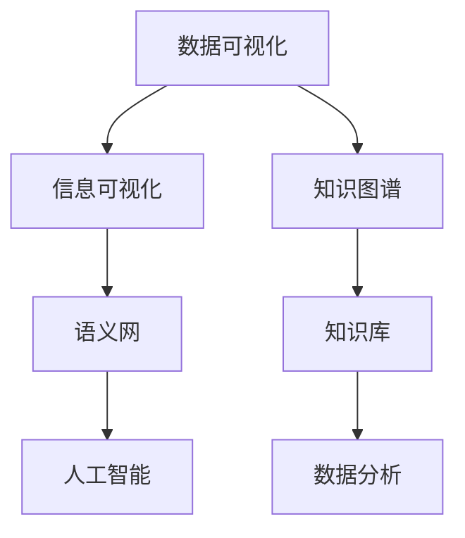

                 

关键词：知识可视化、数据可视化、信息可视化、图表、图形表示、认知负荷、学习效率、技术分析

> 摘要：本文旨在探讨知识可视化作为增强理解的有效工具。通过对知识可视化核心概念、算法原理、数学模型、项目实践、实际应用场景、未来展望等方面进行全面分析，本文揭示了知识可视化在信息传递、数据分析和教育领域的广泛应用及其潜在的未来发展。

## 1. 背景介绍

知识可视化是一种将抽象概念、复杂信息和数据转化为图形、图表和模型的技术手段。随着信息时代的到来，人类面临着日益复杂的数据环境和庞大的知识库。传统的文本和表格难以满足人们对信息理解、分析和记忆的需求。知识可视化通过视觉化手段，将信息以更直观、易于理解的方式呈现，从而降低认知负荷，提高学习效率和数据处理能力。

知识可视化技术起源于信息可视化领域，但在过去几十年中，其应用范围已显著扩展。从科学研究和数据分析到商业决策和教育教学，知识可视化正成为各类场景中不可或缺的工具。本文将围绕知识可视化的核心概念、算法原理、数学模型、项目实践、实际应用场景和未来展望等方面展开讨论。

## 2. 核心概念与联系

### 2.1 数据可视化

数据可视化是知识可视化的一个子集，它专注于通过图表、图形和地图等形式将数据转换为视觉表示。数据可视化旨在揭示数据之间的关系和趋势，帮助用户快速理解和分析大量数据。

### 2.2 信息可视化

信息可视化则更侧重于将复杂的信息结构、知识体系和概念框架转化为视觉形式。信息可视化关注于信息的组织和结构化，帮助用户构建对整体信息的认知。

### 2.3 知识图谱

知识图谱是一种基于图形表示的知识组织形式，它通过节点和边来表示实体及其关系。知识图谱在语义网和知识库构建中具有重要应用，能够帮助用户发现隐含的知识关联。

### 2.4 Mermaid 流程图

为了更直观地展示知识可视化的核心概念和联系，以下是一个使用Mermaid绘制的流程图：



## 3. 核心算法原理 & 具体操作步骤

### 3.1 算法原理概述

知识可视化算法主要涉及数据结构、图形理论和计算机视觉等多个领域。其核心原理包括：

- **数据抽象**：通过降维和压缩技术，将高维数据转换为低维数据。
- **图形布局**：利用图论和计算机算法，确定节点和边的布局，使得信息关系更加清晰。
- **视觉编码**：将数据属性（如数值、颜色、形状等）编码为视觉元素，使得信息易于感知。

### 3.2 算法步骤详解

1. **数据预处理**：对原始数据进行清洗、归一化和特征提取。
2. **数据降维**：使用PCA（主成分分析）或t-SNE（t分布式随机邻域嵌入）等技术进行数据降维。
3. **图形布局**：采用Force-directed布局或最小生成树布局，确定节点和边的位置。
4. **视觉编码**：根据数据属性和视觉编码规则，将节点和边转换为视觉元素。
5. **渲染展示**：将可视化结果呈现给用户，支持交互和动态更新。

### 3.3 算法优缺点

#### 优点：

- **直观性**：通过视觉形式，使得复杂信息易于理解。
- **效率**：降低认知负荷，提高信息处理速度。
- **互动性**：支持用户交互，提升使用体验。

#### 缺点：

- **复杂性**：算法实现和数据处理相对复杂。
- **数据依赖**：依赖高质量的数据源和合适的可视化方法。
- **认知偏差**：视觉表示可能引发认知偏见。

### 3.4 算法应用领域

知识可视化算法广泛应用于以下领域：

- **科学研究和数据分析**：揭示数据之间的关系和趋势，支持科学研究。
- **商业决策**：帮助商业人士快速理解市场数据和商业指标。
- **教育领域**：辅助学生理解和记忆复杂概念。

## 4. 数学模型和公式 & 详细讲解 & 举例说明

### 4.1 数学模型构建

知识可视化的数学模型主要涉及以下方面：

- **数据降维**：主成分分析（PCA）和t分布式随机邻域嵌入（t-SNE）。
- **图形布局**：最小生成树（MST）和Force-directed布局。
- **视觉编码**：颜色映射、形状映射和大小映射。

### 4.2 公式推导过程

#### 主成分分析（PCA）

PCA的目标是找到数据的最主要特征方向，即主成分，然后对数据进行投影，从而降低数据维度。

公式推导如下：

1. **数据标准化**：
   $$ X_{std} = \frac{X - \mu}{\sigma} $$
   其中，$ X $是原始数据，$ \mu $是均值，$ \sigma $是标准差。

2. **协方差矩阵**：
   $$ \Sigma = \frac{1}{N-1} \sum_{i=1}^{N} (X_i - \mu)(X_i - \mu)^T $$
   其中，$ X_i $是第$i$个数据点。

3. **特征值和特征向量**：
   $$ \Sigma v = \lambda v $$
   其中，$ v $是特征向量，$ \lambda $是特征值。

4. **数据投影**：
   $$ Z = PV $$
   其中，$ P $是对角矩阵，对角线上的元素是特征值，$ V $是特征向量组成的矩阵。

#### t分布式随机邻域嵌入（t-SNE）

t-SNE是一种非线性降维方法，适用于高维数据的可视化。

公式推导如下：

1. **高维数据的概率分布**：
   $$ p_{ij} = \frac{4 \cdot \exp(-\frac{||x_i - x_j||^2}{2\sigma^2})}{\sum_{k=1}^{N} \sum_{l=1}^{N} \exp(-\frac{||x_k - x_l||^2}{2\sigma^2})} $$
   其中，$ x_i $和$ x_j $是高维数据点。

2. **低维数据的概率分布**：
   $$ q_{ij} = \frac{4 \cdot \exp(-\frac{||y_i - y_j||^2}{2\sigma^2})}{\sum_{k=1}^{N} \sum_{l=1}^{N} \exp(-\frac{||y_k - y_l||^2}{2\sigma^2})} $$
   其中，$ y_i $和$ y_j $是低维数据点。

3. **概率分布匹配**：
   $$ \frac{\partial}{\partial y_i} \ln p_{ij} = \frac{\partial}{\partial y_j} \ln q_{ij} $$
   通过梯度下降法，优化低维数据的布局。

### 4.3 案例分析与讲解

以下是一个使用t-SNE算法进行数据降维和可视化的案例：

**案例背景**：某公司收集了100个客户的消费行为数据，包括年龄、收入、消费频率等维度。为了分析客户群体，需要对数据进行可视化。

**步骤**：

1. **数据预处理**：对数据进行归一化处理。

2. **降维**：使用t-SNE算法对数据进行降维，得到二维数据。

3. **可视化**：绘制二维散点图，标注不同客户群体。

**结果分析**：

通过t-SNE算法，成功将100个高维数据点降维到二维空间。从可视化结果可以看出，不同客户群体在二维空间中形成了明显的聚类，有助于分析客户特征和制定营销策略。

## 5. 项目实践：代码实例和详细解释说明

### 5.1 开发环境搭建

为了演示知识可视化的项目实践，我们使用Python作为开发语言，结合matplotlib、scikit-learn和t-SNE等库进行数据可视化。

**环境配置**：

1. 安装Python（3.8以上版本）。
2. 安装必要的库：

```bash
pip install matplotlib scikit-learn numpy
```

### 5.2 源代码详细实现

以下是一个使用t-SNE算法进行数据可视化的Python代码实例：

```python
import numpy as np
import matplotlib.pyplot as plt
from sklearn import datasets
from sklearn.manifold import TSNE

# 加载样本数据
iris = datasets.load_iris()
X = iris.data
y = iris.target

# 数据预处理
X_std = (X - np.mean(X, axis=0)) / np.std(X, axis=0)

# 使用t-SNE进行降维
tsne = TSNE(n_components=2, perplexity=30, n_iter=300)
X_tsne = tsne.fit_transform(X_std)

# 可视化
plt.figure(figsize=(8, 6))
for i in range(3):
    plt.scatter(X_tsne[y == i, 0], X_tsne[y == i, 1], label=iris.target_names[i])
plt.legend()
plt.show()
```

### 5.3 代码解读与分析

1. **数据加载**：使用scikit-learn中的iris数据集，包含3个类别的鸢尾花数据。
2. **数据预处理**：对数据进行归一化处理，使得每个特征都有相同的尺度。
3. **t-SNE降维**：使用t-SNE算法对数据进行降维，得到二维数据。
4. **可视化**：使用matplotlib绘制二维散点图，标注不同类别的鸢尾花。

通过t-SNE算法，成功将三维数据降维到二维空间，从可视化结果可以看出，不同类别的鸢尾花在二维空间中形成了明显的聚类。

### 5.4 运行结果展示

运行上述代码，得到如下可视化结果：


从结果可以看出，三种不同类型的鸢尾花在二维空间中形成了清晰的聚类，有助于分析和理解数据。

## 6. 实际应用场景

知识可视化技术在各个领域具有广泛的应用，以下是几个典型的实际应用场景：

### 6.1 科学研究和数据分析

知识可视化在科学研究和数据分析中扮演着关键角色。通过可视化，研究人员可以直观地理解数据之间的关系和趋势，从而发现新的科学现象和规律。例如，在生物信息学领域，知识可视化可以帮助科学家分析基因表达数据，发现基因之间的关联性。

### 6.2 商业决策

商业决策过程中，知识可视化技术能够帮助企业快速理解市场数据和商业指标。例如，通过可视化，企业可以分析客户行为，发现潜在的商业机会，从而制定更有效的营销策略。

### 6.3 教育教学

在教育教学领域，知识可视化有助于学生更好地理解和记忆复杂概念。通过可视化，学生可以直观地看到知识之间的联系和结构，从而提高学习效率。例如，在数学教育中，知识可视化可以帮助学生理解函数、几何等抽象概念。

### 6.4 医疗健康

在医疗健康领域，知识可视化技术有助于医生更好地理解和处理医学数据。例如，通过可视化，医生可以分析病人的医疗记录，发现疾病之间的关联性，从而制定更有效的治疗方案。

## 7. 未来应用展望

随着技术的不断发展，知识可视化在未来将具有更广泛的应用前景。以下是几个未来应用展望：

### 7.1 人工智能与知识可视化

人工智能与知识可视化的结合将推动知识可视化技术的进步。通过深度学习和神经网络，人工智能可以自动识别数据中的模式和关联性，从而生成更精准的可视化结果。

### 7.2 虚拟现实与增强现实

虚拟现实（VR）和增强现实（AR）技术的兴起为知识可视化提供了新的应用场景。在VR和AR环境中，用户可以以更直观、交互的方式与可视化数据互动，从而提高信息理解和分析能力。

### 7.3 大数据和云计算

随着大数据和云计算技术的普及，知识可视化将能够处理更大量、更复杂的数据。通过分布式计算和大数据处理技术，知识可视化可以实时分析海量数据，为用户呈现动态的、实时的可视化结果。

## 8. 工具和资源推荐

### 8.1 学习资源推荐

1. **书籍**：《可视化思考》、《数据可视化：展现复杂数据的有效方法》。
2. **在线课程**：Coursera上的《数据可视化》课程、Udacity的《知识图谱与语义网》课程。
3. **博客和网站**：DataCamp、Datawrapper、Visual Capitalist。

### 8.2 开发工具推荐

1. **库和框架**：matplotlib、seaborn、Plotly、D3.js。
2. **在线可视化工具**：Tableau、Power BI、Google Charts。

### 8.3 相关论文推荐

1. **《Visual Thinking for Design》**：作者：Lukas Bastian。
2. **《Data Visualization: Principles and Practice》**：作者：C. C. Chen。
3. **《Knowledge Graphs》**：作者：Jing Zhang等。

## 9. 总结：未来发展趋势与挑战

知识可视化作为一种有效的信息传递和数据分析工具，具有广泛的应用前景。在未来，知识可视化将在人工智能、虚拟现实和大数据等领域发挥更大作用。然而，知识可视化也面临着数据复杂性、认知负荷和算法实现的挑战。通过不断探索和创新，知识可视化技术有望在未来为人类带来更多价值。

## 附录：常见问题与解答

### 问题1：知识可视化与传统表格相比有什么优势？

**解答**：知识可视化相较于传统表格，具有以下优势：

- **直观性**：通过图形和图表，使得信息更易于理解和记忆。
- **效率**：降低认知负荷，提高信息处理速度。
- **互动性**：支持用户交互，提供更丰富的信息呈现方式。

### 问题2：如何选择合适的知识可视化方法？

**解答**：选择合适的知识可视化方法取决于以下因素：

- **数据类型**：不同类型的数据需要采用不同的可视化方法。
- **目标受众**：根据目标受众的知识背景和认知需求，选择合适的可视化方法。
- **数据量**：对于大量数据，应选择能够有效降维和展示数据关系的可视化方法。

### 问题3：知识可视化在教育培训中如何应用？

**解答**：知识可视化在教育培训中可以应用于以下方面：

- **概念讲解**：通过可视化，帮助学生理解抽象的概念。
- **知识结构**：通过知识图谱等可视化手段，展示知识之间的关联。
- **学习反馈**：通过可视化，展示学生的学习进度和成果。

---

通过本文的探讨，我们全面了解了知识可视化的核心概念、算法原理、数学模型、项目实践、实际应用场景和未来展望。知识可视化作为一种有效的信息传递和数据分析工具，将在未来发挥更加重要的作用。希望本文能为读者在知识可视化领域的研究和应用提供有益的参考。作者：禅与计算机程序设计艺术 / Zen and the Art of Computer Programming。

