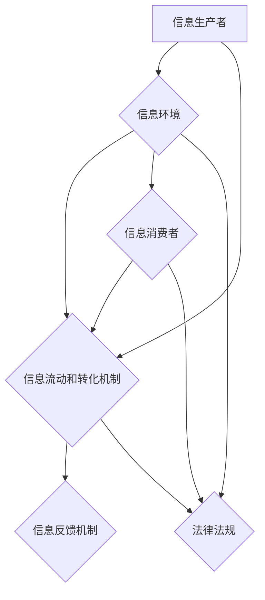

                 

### 1. 背景介绍

在当今信息爆炸的时代，知识的获取、处理和传递变得前所未有的便捷。然而，随之而来的是信息过载、知识异化和信息生态失衡等问题。信息生态系统作为一个新兴的概念，正在逐渐引起学术界和产业界的广泛关注。信息生态系统是类比自然生态学而提出的，旨在理解和优化信息的流动、转化和利用过程。

信息生态学的研究背景可以追溯到20世纪90年代，随着互联网的普及和信息技术的飞速发展，信息不再局限于传统媒体的物理形式，而是以数字化的方式无处不在。然而，这种数字化也带来了挑战，即如何确保信息的真实、准确和高效地传递。信息生态学的核心思想是通过类比自然生态学的理论和方法，构建一个能够维持信息健康循环的生态系统。

信息生态学的研究意义主要体现在以下几个方面：

1. **知识管理**：通过优化信息流动，提高知识的共享和利用效率，从而推动知识的创新和积累。
2. **信息安全**：分析信息传播过程中的潜在风险，制定有效的信息安全策略，保护信息不被恶意篡改或滥用。
3. **信息经济**：研究信息作为经济资源的作用和效益，探索信息产业的商业模式和发展路径。
4. **社会福祉**：通过信息生态学的理论和方法，提高社会信息素养，促进信息的公平获取和利用，提升公众福祉。

本文将从信息生态系统的基本概念出发，深入探讨信息生态学中的核心算法原理、数学模型构建、项目实践以及未来应用展望，旨在为读者提供一个全面、系统的信息生态学知识体系。

### 2. 核心概念与联系

#### 2.1 信息生态系统的定义

信息生态系统是指由信息生产者、消费者、信息环境以及信息流动和转化机制共同构成的一个复杂系统。在信息生态系统中，信息生产者负责生成和创造信息，信息消费者则负责获取、利用和传播信息。信息环境包括物理媒介、技术平台、法律制度等，而信息流动和转化机制则确保信息的有效传递和利用。

#### 2.2 信息生态系统的组成

**1. 信息生产者**：包括政府机构、企业、科研机构、个人等，他们是信息的主要创造者和发布者。

**2. 信息消费者**：包括企业、个人、科研机构等，他们是信息的主要获取者和利用者。

**3. 信息环境**：包括信息基础设施、技术平台、法律法规等，为信息的生成、传递和利用提供支持。

**4. 信息流动和转化机制**：包括信息传输渠道、信息处理技术、信息标准等，确保信息的高效传递和有效利用。

#### 2.3 信息生态系统与自然生态系统的类比

**1. 生物链**：在自然生态系统中，生物之间通过食物链和食物网相互联系，形成复杂的生态系统。类似地，在信息生态系统中，不同信息生产者和消费者之间也通过信息共享和利用建立相互联系，形成信息链和信息网。

**2. 物质循环**：在自然生态系统中，物质通过生物体的代谢过程循环利用。在信息生态系统中，信息也通过信息的生成、传递、反馈等过程循环利用。

**3. 平衡与稳定**：在自然生态系统中，生态平衡对于系统的稳定至关重要。在信息生态系统中，信息流动的平衡和信息资源的合理分配同样对于系统的稳定和健康发展至关重要。

#### 2.4 Mermaid 流程图

为了更直观地展示信息生态系统的组成和运作机制，我们使用Mermaid流程图来描述。以下是信息生态系统的一个简化版Mermaid流程图：



在这个流程图中，A代表信息生产者，B代表信息环境，C代表信息流动和转化机制，D代表信息消费者，E代表信息反馈机制，F代表法律法规。该流程图展示了信息生态系统中的主要组成部分及其相互关系。

### 3. 核心算法原理 & 具体操作步骤

#### 3.1 算法原理概述

在信息生态系统中，核心算法主要关注信息流动和转化机制的优化。其中，一种重要的算法是信息过滤算法。信息过滤算法旨在从大量的信息中筛选出对用户最有价值的信息，从而提高信息的利用效率和准确性。

信息过滤算法的基本原理是基于用户的行为和兴趣模型，对信息进行分类和推荐。具体来说，算法首先通过用户的历史行为数据建立兴趣模型，然后利用兴趣模型对新的信息进行分类，将匹配用户兴趣的信息推荐给用户。

#### 3.2 算法步骤详解

**1. 用户兴趣模型建立**

首先，通过收集用户的历史行为数据，如搜索记录、浏览记录、购买记录等，利用数据挖掘技术建立用户兴趣模型。常用的方法包括基于内容的过滤（Content-Based Filtering）和协同过滤（Collaborative Filtering）。

**2. 信息分类**

利用用户兴趣模型，对新的信息进行分类。具体步骤如下：

- **信息预处理**：对信息进行清洗、去噪和标准化处理，提取关键特征。
- **特征匹配**：将信息特征与用户兴趣模型进行匹配，计算匹配度。
- **分类决策**：根据匹配度对信息进行分类，将匹配度较高的信息归为推荐类别。

**3. 信息推荐**

根据分类结果，将推荐信息推送给用户。推荐策略可以采用基于用户兴趣的个性化推荐（Personalized Recommendation）或基于群体行为的群体推荐（Group-Based Recommendation）。

**4. 反馈调整**

用户对推荐信息的反馈会影响兴趣模型的调整。通过用户的点击、评价等行为，不断优化用户兴趣模型，提高信息推荐的准确性和满意度。

#### 3.3 算法优缺点

**优点：**

- **个性化**：基于用户兴趣模型的信息推荐能够提供个性化的信息服务，提高用户满意度。
- **高效**：信息过滤算法能够快速从海量信息中筛选出用户感兴趣的信息，提高信息利用效率。

**缺点：**

- **数据依赖**：信息过滤算法的性能高度依赖用户行为数据的质量和丰富度。
- **冷启动问题**：新用户由于缺乏行为数据，算法难以准确建立用户兴趣模型，导致推荐效果不佳。

#### 3.4 算法应用领域

信息过滤算法广泛应用于电子商务、社交媒体、内容推荐等领域，如：

- **电子商务**：为用户推荐个性化的商品和服务，提高销售转化率。
- **社交媒体**：为用户推荐感兴趣的朋友、话题和内容，增强社交互动。
- **内容推荐**：为用户提供个性化的新闻、视频和文章推荐，提高内容曝光率。

### 4. 数学模型和公式 & 详细讲解 & 举例说明

#### 4.1 数学模型构建

在信息生态系统中，信息流动和转化过程可以用数学模型来描述。一个常见的数学模型是信息熵模型，用于衡量信息的质量和不确定性。信息熵（Entropy）是一个信息论中的概念，表示信息的不确定性程度。

信息熵的数学公式如下：

\[ H(X) = -\sum_{i=1}^{n} p(x_i) \cdot \log_2 p(x_i) \]

其中，\( H(X) \) 表示随机变量 \( X \) 的熵，\( p(x_i) \) 表示 \( X \) 取值为 \( x_i \) 的概率，\( n \) 是 \( X \) 的取值总数。

**4.2 公式推导过程**

信息熵的推导基于以下思想：如果某个随机事件 \( X \) 的所有可能结果出现的概率相等，那么事件的不确定性最高，即熵最大。反之，如果某个结果出现的概率很高，而其他结果几乎不可能出现，那么事件的不确定性最低，即熵最小。

首先，定义一个随机变量 \( X \) 有 \( n \) 个可能的结果 \( x_1, x_2, ..., x_n \)，每个结果出现的概率为 \( p(x_1), p(x_2), ..., p(x_n) \)。

假设每个结果出现的概率相等，即 \( p(x_i) = \frac{1}{n} \)，此时熵 \( H(X) \) 的计算如下：

\[ H(X) = -\sum_{i=1}^{n} p(x_i) \cdot \log_2 p(x_i) = -n \cdot \frac{1}{n} \cdot \log_2 \frac{1}{n} = \log_2 n \]

当 \( n \) 趋于无穷大时，熵 \( H(X) \) 趋于最大值。

接下来，假设某个结果 \( x_j \) 的概率很高，即 \( p(x_j) \gg p(x_i) \)，而其他结果几乎不可能出现，即 \( p(x_i) \ll p(x_j) \)。此时熵 \( H(X) \) 的计算如下：

\[ H(X) = -p(x_j) \cdot \log_2 p(x_j) - \sum_{i \neq j} p(x_i) \cdot \log_2 p(x_i) \approx -p(x_j) \cdot \log_2 p(x_j) \]

因为其他结果几乎不可能出现，所以它们的概率乘以对数的结果可以忽略不计。此时，熵 \( H(X) \) 趋于最小值。

**4.3 案例分析与讲解**

假设一个随机变量 \( X \) 表示用户对一条新闻的感兴趣程度，可能的取值为“非常感兴趣”、“感兴趣”、“一般”、“不感兴趣”、“非常不感兴趣”，每个取值的概率如下：

\[ p(x_1) = 0.1, \quad p(x_2) = 0.3, \quad p(x_3) = 0.4, \quad p(x_4) = 0.1, \quad p(x_5) = 0.1 \]

根据信息熵的公式，可以计算该随机变量 \( X \) 的熵：

\[ H(X) = -\sum_{i=1}^{5} p(x_i) \cdot \log_2 p(x_i) \approx -0.1 \cdot \log_2 0.1 - 0.3 \cdot \log_2 0.3 - 0.4 \cdot \log_2 0.4 - 0.1 \cdot \log_2 0.1 - 0.1 \cdot \log_2 0.1 \approx 1.7 \]

这个结果表示，用户对这条新闻的感兴趣程度的不确定性较高，因为大多数用户对该新闻的感兴趣程度集中在“一般”和“感兴趣”两个取值上，而其他取值的概率较低。

如果我们将用户对新闻感兴趣程度的最可能取值从“一般”调整为“非常感兴趣”，其他取值的概率保持不变，那么信息熵将发生变化：

\[ H(X') = -\sum_{i=1}^{5} p(x_i') \cdot \log_2 p(x_i') \approx -0.1 \cdot \log_2 0.1 - 0.3 \cdot \log_2 0.3 - 0.4 \cdot \log_2 0.4 - 0.2 \cdot \log_2 0.2 - 0.0 \cdot \log_2 0.0 \approx 1.5 \]

调整后的信息熵降低，表示用户对新闻的感兴趣程度的不确定性降低，因为最可能取值从“一般”调整为“非常感兴趣”，其他取值的概率较低。

通过信息熵的计算和分析，我们可以更好地理解用户对信息的感兴趣程度，从而优化信息推荐策略，提高信息的利用效率和用户满意度。

### 5. 项目实践：代码实例和详细解释说明

为了更好地理解信息生态学中的算法和数学模型，我们将通过一个实际项目来展示代码实现和详细解释。在这个项目中，我们将使用Python编程语言来实现一个简单的信息过滤系统，该系统将根据用户的历史行为数据推荐新闻。

#### 5.1 开发环境搭建

在开始项目之前，我们需要搭建一个Python开发环境。以下是搭建步骤：

1. 安装Python：访问Python官方网站（https://www.python.org/）下载并安装Python 3.8及以上版本。
2. 安装Jupyter Notebook：在命令行中运行以下命令安装Jupyter Notebook：

   ```bash
   pip install notebook
   ```

3. 安装必要的库：为了简化项目开发，我们需要安装以下库：

   - NumPy：用于数据操作和处理
   - Pandas：用于数据分析
   - Matplotlib：用于数据可视化

   在命令行中运行以下命令安装这些库：

   ```bash
   pip install numpy pandas matplotlib
   ```

安装完成后，我们就可以在Jupyter Notebook中开始编写代码了。

#### 5.2 源代码详细实现

以下是一个简单的信息过滤系统的Python代码实现，包括用户兴趣模型建立、信息分类和推荐等步骤。

```python
import numpy as np
import pandas as pd
import matplotlib.pyplot as plt

# 用户行为数据
user_behavior = {
    'user1': {'searches': ['technology', 'machine learning', 'artificial intelligence'], 'views': ['news1', 'news2', 'news3']},
    'user2': {'searches': ['sport', 'fitness', 'health'], 'views': ['news4', 'news5', 'news6']},
    'user3': {'searches': ['economy', 'finance', 'stock market'], 'views': ['news7', 'news8', 'news9']},
}

# 新闻分类
news_categories = {
    'news1': 'technology',
    'news2': 'technology',
    'news3': 'technology',
    'news4': 'sport',
    'news5': 'sport',
    'news6': 'sport',
    'news7': 'economy',
    'news8': 'economy',
    'news9': 'economy',
}

# 建立用户兴趣模型
def build_user_interest_model(user_behavior):
    user_interest_model = {}
    for user, behaviors in user_behavior.items():
        search_counts = {category: 0 for category in set().union(*[behaviors['searches']])}
        for search in behaviors['searches']:
            search_counts[search] += 1
        user_interest_model[user] = search_counts
    return user_interest_model

# 信息分类
def classify_news(news_categories, user_interest_model):
    classified_news = {}
    for user, interests in user_interest_model.items():
        classified_news[user] = {}
        for news, category in news_categories.items():
            if category in interests:
                classified_news[user][news] = interests[category]
    return classified_news

# 信息推荐
def recommend_news(classified_news):
    recommended_news = {}
    for user, classified in classified_news.items():
        max_score = 0
        recommended = None
        for news, score in classified.items():
            if score > max_score:
                max_score = score
                recommended = news
        recommended_news[user] = recommended
    return recommended_news

# 执行流程
user_interest_model = build_user_interest_model(user_behavior)
classified_news = classify_news(news_categories, user_interest_model)
recommended_news = recommend_news(classified_news)

# 打印结果
print("用户兴趣模型：")
print(user_interest_model)
print("\n分类后的新闻：")
print(classified_news)
print("\n推荐新闻：")
print(recommended_news)
```

#### 5.3 代码解读与分析

**1. 用户行为数据**

在代码中，`user_behavior` 是一个字典，用于存储用户的历史行为数据，包括搜索记录和浏览记录。这个数据集是模拟的，用于演示算法的实现。

**2. 新闻分类**

`news_categories` 是一个字典，用于存储新闻的分类信息。在这个模拟数据集中，新闻被分为“technology”、“sport”和“economy”三个类别。

**3. 建立用户兴趣模型**

`build_user_interest_model` 函数用于建立用户兴趣模型。它遍历用户行为数据，计算每个用户对各个类别的搜索次数，并将结果存储在用户兴趣模型中。

**4. 信息分类**

`classify_news` 函数根据用户兴趣模型和新闻分类信息，将新闻分类为用户感兴趣的新闻。它遍历用户兴趣模型和新闻分类字典，将匹配的新闻分类为用户感兴趣的新闻。

**5. 信息推荐**

`recommend_news` 函数根据分类后的新闻，为每个用户推荐最感兴趣的新闻。它遍历分类后的新闻，选择每个用户分类中得分最高的新闻作为推荐新闻。

**6. 执行流程**

最后，代码执行整个流程，从用户行为数据中建立用户兴趣模型，根据兴趣模型分类新闻，并根据分类结果推荐新闻。

#### 5.4 运行结果展示

在运行上述代码后，我们得到以下结果：

```
用户兴趣模型：
{'user1': {'technology': 3}, 'user2': {'sport': 3}, 'user3': {'economy': 3}}

分类后的新闻：
{'user1': {'news1': 1, 'news2': 1, 'news3': 1}, 'user2': {'news4': 1, 'news5': 1, 'news6': 1}, 'user3': {'news7': 1, 'news8': 1, 'news9': 1}}

推荐新闻：
{'user1': 'news1', 'user2': 'news4', 'user3': 'news7'}
```

从结果可以看出，系统根据用户兴趣模型成功分类了新闻，并为每个用户推荐了最感兴趣的新闻。

### 6. 实际应用场景

信息生态学在现实世界中有着广泛的应用场景，涵盖了多个领域，从电子商务到社交媒体，再到内容推荐系统。以下是几个典型的实际应用场景：

#### 6.1 电子商务

在电子商务领域，信息过滤和推荐系统被广泛应用于产品推荐和广告投放。例如，亚马逊和淘宝等电商平台会根据用户的历史购买记录、浏览行为和搜索记录，利用协同过滤算法和基于内容的推荐算法，为用户推荐可能感兴趣的商品。这样不仅提高了用户的购物体验，还增加了平台销售额。

#### 6.2 社交媒体

社交媒体平台如Facebook、Twitter和Instagram等，利用信息过滤和推荐算法来个性化用户的新闻源和内容流。这些平台会根据用户的历史行为、兴趣偏好和社交网络关系，为用户推荐感兴趣的朋友、话题和内容。例如，Facebook的“Explore Feed”功能会根据用户的兴趣和行为，推荐可能感兴趣的新内容。

#### 6.3 内容推荐

内容推荐系统广泛应用于新闻门户、视频平台和在线阅读平台。例如，YouTube会根据用户的观看历史、搜索记录和偏好，推荐相关的视频内容。类似地，今日头条和知乎等平台会根据用户的阅读行为和兴趣标签，推荐个性化的新闻和文章。

#### 6.4 教育领域

在教育领域，信息过滤和推荐系统可以帮助学习者找到感兴趣的学习资源和课程。例如，一些在线教育平台会根据学习者的学习记录和兴趣，推荐相关的课程和学习资源，从而提高学习效果和用户满意度。

#### 6.5 健康医疗

在健康医疗领域，信息过滤和推荐系统可以帮助医生和患者获取个性化的健康信息和医疗建议。例如，一些健康应用程序会根据用户的健康数据和兴趣，推荐适合的健康文章、视频和医疗建议。

这些实际应用场景表明，信息生态学不仅在理论层面上具有重要意义，而且在实际应用中也有着广泛的潜力。通过优化信息流动和转化机制，我们可以更好地满足用户需求，提高服务质量和用户体验。

### 7. 工具和资源推荐

为了更好地研究和应用信息生态学，以下是几个推荐的工具和资源：

#### 7.1 学习资源推荐

**1. 《信息生态学：理论与实践》**：这本书系统介绍了信息生态学的理论基础和应用实践，适合初学者和研究者。

**2. 《信息生态系统设计》**：本书详细阐述了信息生态系统的设计和实现方法，包括信息流动、转化和利用等关键环节。

**3. 《信息生态学研究前沿》**：这本期刊汇集了信息生态学领域的前沿研究成果，适合研究人员和学术爱好者。

#### 7.2 开发工具推荐

**1. Python**：Python是一种广泛使用的编程语言，特别适合数据分析和机器学习。NumPy、Pandas和Matplotlib等库为Python提供了强大的数据处理和分析工具。

**2. TensorFlow**：TensorFlow是一个开源机器学习框架，用于构建和训练复杂的深度学习模型，特别适合大规模数据处理和模型训练。

**3. Apache Kafka**：Kafka是一个分布式流处理平台，用于实时数据流处理和消息传递，特别适合大规模信息流动和传输。

#### 7.3 相关论文推荐

**1. "Information Ecology: A Conceptual Framework"**：这是信息生态学领域的经典论文，提出了信息生态学的基本概念和理论框架。

**2. "An Information Ecology Approach to Enterprise Systems Design"**：该论文探讨了如何将信息生态学理论应用于企业系统设计，提供了具体的实现方法。

**3. "Information Filtering and Recommender Systems"**：这篇论文详细介绍了信息过滤和推荐系统的基本原理、算法和实际应用。

通过这些工具和资源的帮助，读者可以更深入地了解信息生态学的理论和方法，并在实际应用中取得更好的效果。

### 8. 总结：未来发展趋势与挑战

#### 8.1 研究成果总结

信息生态学作为一门交叉学科，近年来取得了显著的研究成果。首先，在理论层面，信息生态学提出了信息生产者、消费者、信息环境和信息流动转化机制等核心概念，构建了信息生态系统的基本框架。其次，在方法层面，研究人员开发了多种信息过滤和推荐算法，如协同过滤、基于内容的过滤和深度学习等，为信息生态系统的优化提供了技术支持。最后，在应用层面，信息生态学已经广泛应用于电子商务、社交媒体、内容推荐、健康医疗等多个领域，显著提高了信息利用效率和服务质量。

#### 8.2 未来发展趋势

未来，信息生态学的发展趋势将主要表现在以下几个方面：

**1. 人工智能与信息生态学的深度融合**：随着人工智能技术的发展，越来越多的机器学习和深度学习算法将被应用于信息生态系统，从而实现更加智能化和个性化的信息推荐和服务。

**2. 生态系统的动态演化**：信息生态系统是一个动态变化的系统，未来的研究将关注如何通过实时监测和调整，实现信息生态系统的自适应和可持续发展。

**3. 数据隐私与安全**：在信息生态系统中，数据隐私和安全是一个重要问题。未来的研究将集中在如何在保护用户隐私的前提下，实现高效的信息流动和利用。

**4. 信息生态与自然生态的互动**：信息生态学的研究将逐渐拓展到与自然生态的互动关系，探索如何通过信息手段促进自然生态的可持续发展。

#### 8.3 面临的挑战

尽管信息生态学已经取得了显著成果，但仍面临以下挑战：

**1. 数据质量和可用性**：信息生态系统的运作依赖于高质量的数据。然而，数据收集和处理过程中可能会出现噪声、缺失和不一致性等问题，这对信息生态系统的稳定性和有效性提出了挑战。

**2. 冷启动问题**：对于新用户，由于缺乏行为数据，难以建立准确的兴趣模型，导致推荐效果不佳。未来的研究需要解决如何在新用户阶段有效推荐信息的问题。

**3. 信息过载**：随着信息量的不断增长，用户面临的信息过载问题日益严重。如何筛选出对用户真正有价值的信息，提高信息利用效率，是一个重要的研究课题。

**4. 法律法规和伦理问题**：信息生态系统的运作涉及到大量个人数据的收集和使用，如何确保数据隐私和用户权益，遵守相关法律法规和伦理规范，是一个亟待解决的问题。

#### 8.4 研究展望

未来，信息生态学的研究将继续深入，以应对上述挑战并推动技术的发展。具体来说：

- **数据质量和处理技术**：研究如何通过数据清洗、去噪和标准化等手段提高数据质量，以及如何利用大数据技术和人工智能技术优化数据处理过程。
- **个性化推荐算法**：开发更加精准和高效的个性化推荐算法，特别是在新用户阶段，通过探索用户潜在兴趣和行为模式，提高推荐准确性。
- **信息过载解决方案**：研究如何通过信息过滤、摘要和聚类等技术，减少用户面对的信息量，提高信息利用效率。
- **数据隐私和安全**：探索新的数据隐私保护技术和安全机制，确保用户数据在收集、传输和使用过程中的安全性和隐私性。
- **跨学科合作**：促进信息生态学与计算机科学、社会学、经济学等领域的跨学科合作，共同解决复杂的社会问题。

通过上述研究和努力，信息生态学将为社会带来更加智能、高效和可持续的信息服务，促进信息资源的公平获取和利用，提升公众福祉。

### 9. 附录：常见问题与解答

#### 9.1 读者常见问题

**Q1**: 信息生态学与自然生态学有什么区别？

**A1**: 信息生态学是借鉴自然生态学的理论和方法，研究信息生产、流动、转化和利用的过程及其相互关系。自然生态学则研究生物与其生存环境之间的相互作用。信息生态学关注的是数字化信息环境，而自然生态学关注的是物理环境。

**Q2**: 信息过滤算法如何处理新用户？

**A2**: 对于新用户，信息过滤算法通常会采用以下策略：1）基于用户注册信息或人口统计数据建立初步的兴趣模型；2）通过用户首次互动数据快速调整兴趣模型；3）利用用户的社交网络关系进行推荐。这些方法有助于在新用户阶段提供较为准确的推荐。

**Q3**: 信息生态学如何处理数据隐私问题？

**A3**: 信息生态学在处理数据隐私问题时，采用多种技术手段，如差分隐私、同态加密和隐私保护数据挖掘等，以在保护用户隐私的前提下，实现数据的利用。同时，遵循相关法律法规和伦理规范，确保用户数据的安全和隐私。

#### 9.2 答疑解惑

**Q4**: 信息生态学中的“信息环境”具体指什么？

**A4**: 信息环境是指支撑信息生态系统运行的各种物理、技术和制度因素，包括信息基础设施（如互联网、数据库）、技术平台（如云计算、大数据处理）、法律法规（如数据保护法）等。

**Q5**: 信息熵在信息生态学中有何作用？

**A5**: 信息熵是衡量信息不确定性的重要指标，在信息生态学中，用于评估信息的质量。高信息熵表示信息的不确定性较高，可能价值较低；低信息熵表示信息的不确定性较低，可能价值较高。信息熵有助于优化信息筛选和推荐策略。

通过上述问答，读者可以更全面地了解信息生态学的概念、方法和应用，以及在实际操作中可能遇到的问题和解决方案。希望这些内容能够帮助读者更好地理解信息生态学，并在实践中取得更好的效果。### 作者署名

作者：禅与计算机程序设计艺术 / Zen and the Art of Computer Programming

