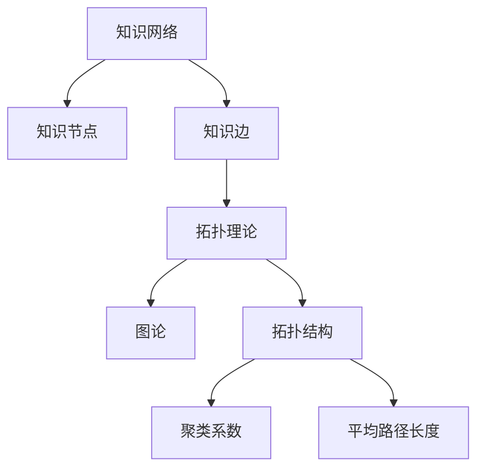

                 

## 1. 背景介绍

在信息技术日益发展的今天，知识网络已经成为信息传播、知识共享和创新的重要基础设施。知识网络是由知识节点（如文献、数据库、专家等）和连接这些节点的知识边（如引用关系、合作关系等）构成的复杂网络结构。随着互联网的普及和大数据技术的进步，知识网络的研究逐渐成为计算机科学、信息科学和社会科学等多个领域的重要课题。

本文旨在探讨知识网络中的信息流动及其结构分析，通过引入网络拓扑的概念，深入剖析知识网络中的信息流动规律和关键特征。信息流动是指信息在知识网络中的传播、转化和利用过程，它不仅影响知识创新和传播的效率，也决定了知识网络的稳定性和鲁棒性。

知识网络拓扑分析是一种定量研究方法，通过对知识网络的结构特征进行提取和分析，可以帮助我们更好地理解信息流动的机制，识别关键节点和路径，从而优化知识网络的性能。本文将首先回顾相关知识网络和拓扑理论的基本概念，然后详细探讨信息流动的结构分析方法和应用实例，最后展望未来的发展趋势和挑战。

本文将围绕以下几个核心问题展开讨论：

1. **知识网络的定义与特征**：介绍知识网络的定义、构成要素及其基本特征。
2. **拓扑理论的基本概念**：回顾图论和拓扑学的基本概念，以及它们在知识网络中的应用。
3. **信息流动的结构分析**：探讨信息流动在知识网络中的具体表现和结构分析方法。
4. **算法原理与实现**：详细介绍用于信息流动结构分析的核心算法原理及其实现步骤。
5. **数学模型与公式推导**：构建数学模型，推导关键公式，并进行案例分析与讲解。
6. **项目实践与代码实例**：通过实际项目展示信息流动结构分析的方法和结果。
7. **实际应用场景**：讨论信息流动结构分析在不同领域的应用实例。
8. **未来展望**：总结研究成果，展望未来发展趋势和面临的挑战。

通过本文的研究，我们希望能够为知识网络的研究者和实践者提供有价值的参考，推动知识网络拓扑分析和信息流动研究的深入发展。

## 2. 核心概念与联系

为了深入探讨知识网络中的信息流动及其结构分析，我们需要先了解一些核心概念和它们之间的联系。

### 知识网络的定义与构成

知识网络是由知识节点和连接这些节点的知识边构成的复杂网络结构。知识节点可以表示各种形式的知识单元，如文献、数据库、专家、机构等。知识边则表示知识单元之间的联系，如引用关系、合作关系、知识共享等。知识网络的特点包括：

- **多样性**：知识网络中的节点和边可以代表多种类型的知识和关系。
- **动态性**：知识网络中的节点和边可以随着时间变化而动态调整。
- **层次性**：知识网络可以存在多个层次，每个层次代表不同级别的知识和关系。
- **全局性**：知识网络中的信息流动和结构特征可以影响整个网络。

### 拓扑理论的基本概念

拓扑理论是研究网络结构特征和性质的一个数学分支。在知识网络拓扑分析中，我们主要关注以下基本概念：

- **图论**：图论是研究图的数学分支。一个图由节点（或顶点）和边（或弧）组成，节点表示知识单元，边表示节点之间的关系。图的基本概念包括：
  - **连通性**：图中任意两个节点之间都存在路径连接。
  - **连通度**：图中节点的最大度数，即连接该节点的边的数量。
  - **路径**：图中节点之间的一条连续的边序列。
  - **环**：图中的一条封闭路径，其端点是同一个节点。

- **拓扑结构**：拓扑结构是指图的几何形态，包括节点和边的布局方式。常见的拓扑结构包括：
  - **无向图**：图中的边没有方向。
  - **有向图**：图中的边有方向，表示知识流动的方向。
  - **树**：是一种特殊的无向图，其中任意两个节点之间都有且仅有一条路径。
  - **环状图**：是一种特殊的有向图，其中节点按照某种顺序排列，每个节点的下一个节点是其前一个节点的直接后继。

- **聚类系数**：表示网络中相邻节点之间连接的紧密程度，是网络稳定性和鲁棒性的重要指标。
- **平均路径长度**：表示网络中任意两个节点之间的平均距离，是网络复杂性和效率的重要指标。

### 知识网络与拓扑理论的联系

知识网络与拓扑理论之间的联系主要体现在以下几个方面：

1. **拓扑结构表示**：知识网络可以通过拓扑结构进行表示，从而直观地展现知识单元之间的关系和网络的层次性。
2. **拓扑特征提取**：通过分析知识网络的拓扑特征，可以识别网络中的关键节点和路径，从而优化信息流动的效率。
3. **信息流动分析**：拓扑理论提供了有效的工具和方法来分析知识网络中的信息流动，如路径长度、聚类系数等指标。
4. **稳定性分析**：通过拓扑分析，可以评估知识网络的稳定性和鲁棒性，从而为网络的设计和优化提供依据。

### Mermaid 流程图

为了更好地展示知识网络与拓扑理论的联系，我们使用 Mermaid 流程图来表示核心概念和关系。以下是一个示例：



通过这个流程图，我们可以清晰地看到知识网络、拓扑理论和其基本概念之间的联系。

## 3. 核心算法原理 & 具体操作步骤

### 3.1 算法原理概述

知识网络中的信息流动结构分析通常依赖于多种算法，其中最常用的包括网络拓扑分析算法、信息传播算法和路径优化算法等。这些算法的核心原理可以归纳为以下几个方面：

1. **网络拓扑分析**：通过分析知识网络的拓扑特征，如连通性、连通度和聚类系数等，来识别网络中的关键节点和路径。常用的拓扑分析算法包括：
   - **度中心性**：计算节点的重要性，度数越大的节点在信息流动中起到的作用越重要。
   - **紧密中心性**：考虑节点的邻居节点之间的连接紧密程度，评估节点的中心性。
   - **介数中心性**：计算节点在所有最短路径中的重要性，介数越大的节点在信息流动中起到的作用越关键。

2. **信息传播算法**：模拟信息在网络中的传播过程，通过分析传播路径和传播速度来评估信息流动的效率。常用的信息传播算法包括：
   - **扩散模型**：模拟信息从源头节点开始，通过随机游走方式在网络中传播。
   - **传播子图提取**：通过提取信息传播过程中形成的子图，分析信息传播的结构特征。

3. **路径优化算法**：寻找网络中信息流动的最优路径，以提高信息传播的效率和鲁棒性。常用的路径优化算法包括：
   - **最短路径算法**：如 Dijkstra 算法和 A* 算法，用于寻找两点之间的最短路径。
   - **路径规划算法**：如遗传算法和蚁群算法，通过全局优化策略寻找最优路径。

### 3.2 算法步骤详解

下面我们将详细介绍这些算法的基本步骤和具体实现。

#### 3.2.1 度中心性计算

度中心性计算是一种简单而有效的节点重要性评估方法。具体步骤如下：

1. **构建图结构**：首先，将知识网络表示为图结构，其中每个节点代表一个知识单元，每条边表示知识单元之间的联系。

2. **计算度数**：对于每个节点，计算其连接的边的数量，即度数。

3. **计算度中心性**：对于每个节点，计算其度数与图中最大度数的比值，即度中心性。

4. **排序和筛选**：将所有节点按照度中心性从高到低排序，筛选出度中心性较高的节点作为关键节点。

#### 3.2.2 紧密中心性计算

紧密中心性考虑节点及其邻居节点之间的连接紧密程度。具体步骤如下：

1. **构建邻接矩阵**：根据图结构，构建邻接矩阵，表示节点之间的连接关系。

2. **计算邻接矩阵的幂**：计算邻接矩阵的 k 次幂，表示节点及其邻居节点的连接关系。

3. **计算紧密中心性**：对于每个节点，计算其 k 次幂矩阵中所有非零元素的个数，即其邻居节点的数量。然后，将邻居节点数量与图中节点总数之比作为紧密中心性。

4. **排序和筛选**：将所有节点按照紧密中心性从高到低排序，筛选出紧密中心性较高的节点作为关键节点。

#### 3.2.3 介数中心性计算

介数中心性通过计算节点在所有最短路径中的重要性来评估其中心性。具体步骤如下：

1. **计算最短路径**：使用 Dijkstra 算法或其他最短路径算法，计算图中每个节点到所有其他节点的最短路径。

2. **计算介数**：对于每个节点，计算其在所有最短路径中的介数，即路径中包含该节点的数量。

3. **计算介数中心性**：对于每个节点，计算其介数与图中所有节点的总介数之比，即介数中心性。

4. **排序和筛选**：将所有节点按照介数中心性从高到低排序，筛选出介数中心性较高的节点作为关键节点。

#### 3.2.4 信息传播模拟

信息传播模拟通过模拟信息在网络中的传播过程来分析信息流动的效率。具体步骤如下：

1. **初始化**：选择一个源头节点，初始化信息传播状态。

2. **传播模拟**：在每次迭代中，从源头节点开始，随机选择邻居节点进行信息传播。每个节点在传播过程中有一定的概率接收和传播信息。

3. **传播子图提取**：在信息传播过程中，提取形成的信息传播子图，分析子图的结构特征。

4. **传播路径分析**：分析传播子图中的传播路径和传播速度，评估信息流动的效率和鲁棒性。

#### 3.2.5 路径优化

路径优化通过全局优化策略寻找网络中信息流动的最优路径。具体步骤如下：

1. **构建目标函数**：定义一个目标函数，表示路径的优劣，如路径长度、传播速度等。

2. **选择优化算法**：根据目标函数选择合适的优化算法，如遗传算法、蚁群算法等。

3. **迭代优化**：通过多次迭代，优化目标函数，寻找最优路径。

4. **路径分析**：分析优化后的路径，评估路径的效率、鲁棒性和稳定性。

### 3.3 算法优缺点

不同的算法在信息流动结构分析中具有不同的优缺点，下面将简要介绍：

- **度中心性**：优点是计算简单、直观，缺点是忽略了节点邻居节点的连接紧密程度和介数中心性。
- **紧密中心性**：优点是考虑了节点邻居节点的连接紧密程度，缺点是忽略了节点在路径中的重要性。
- **介数中心性**：优点是考虑了节点在路径中的重要性，缺点是计算复杂度高，不适合大规模网络。
- **信息传播模拟**：优点是可以模拟信息在网络中的实际传播过程，缺点是模拟结果受随机因素的影响较大。
- **路径优化**：优点是可以找到最优路径，缺点是优化过程复杂，计算量大。

### 3.4 算法应用领域

信息流动结构分析算法在多个领域具有广泛的应用：

- **社会网络分析**：通过分析社交网络中的信息流动，可以识别关键人物和传播路径，为社交媒体营销和危机管理提供依据。
- **生物信息学**：通过分析生物网络中的信息流动，可以揭示生物分子之间的相互作用和调控机制。
- **交通网络优化**：通过分析交通网络中的信息流动，可以优化交通路线和调度策略，提高交通效率。
- **金融分析**：通过分析金融网络中的信息流动，可以识别市场风险和投资机会。

## 4. 数学模型和公式 & 详细讲解 & 举例说明

### 4.1 数学模型构建

在信息流动结构分析中，构建合适的数学模型是关键步骤。以下是一个简单的数学模型，用于描述知识网络中的信息流动。

#### 4.1.1 基本假设

1. 知识网络由 N 个节点构成，每个节点表示一个知识单元。
2. 每个节点具有一个固定容量，表示其能够处理的信息量。
3. 每个节点具有一个固定的信息传播速度。
4. 知识网络中的信息流动是随机的，每个节点在单位时间内以一定概率向其邻居节点传播信息。

#### 4.1.2 模型构建

1. **节点容量与传播速度**：设第 i 个节点的容量为 C_i，传播速度为 V_i。
2. **传播概率**：设第 i 个节点向其邻居节点传播信息的概率为 P_i。
3. **信息流量**：设第 i 个节点的信息流量为 Q_i，表示单位时间内传播的信息量。

根据基本假设，可以构建以下数学模型：

\[ Q_i = C_i \times V_i \times P_i \]

其中，Q_i 表示第 i 个节点的信息流量，C_i 表示其容量，V_i 表示其传播速度，P_i 表示其传播概率。

### 4.2 公式推导过程

为了更深入地分析信息流动结构，我们需要推导一些关键公式。

#### 4.2.1 平均信息流量

设知识网络中所有节点的平均信息流量为 \(\bar{Q}\)，则：

\[ \bar{Q} = \frac{1}{N} \sum_{i=1}^{N} Q_i \]

其中，N 表示节点总数。

#### 4.2.2 信息传播速度

设知识网络中所有节点的平均传播速度为 \(\bar{V}\)，则：

\[ \bar{V} = \frac{\sum_{i=1}^{N} V_i}{N} \]

#### 4.2.3 传播概率

设知识网络中所有节点的平均传播概率为 \(\bar{P}\)，则：

\[ \bar{P} = \frac{\sum_{i=1}^{N} P_i}{N} \]

#### 4.2.4 信息流量的稳定性

设知识网络中的信息流量变化率（即信息流量的微分）为 \(\Delta Q\)，则：

\[ \Delta Q = C_i \times \frac{dV_i}{dt} \times P_i \]

其中，dV_i/dt 表示节点 i 的传播速度随时间的变化率。

### 4.3 案例分析与讲解

#### 4.3.1 案例背景

假设有一个由 100 个节点构成的知识网络，每个节点的容量为 100，传播速度为 1。现在我们需要计算网络中的平均信息流量、平均传播速度和传播概率。

#### 4.3.2 案例分析

1. **平均信息流量**：

\[ \bar{Q} = \frac{1}{100} \sum_{i=1}^{100} Q_i \]

由于每个节点的容量和传播速度都相同，可以简化为：

\[ \bar{Q} = \frac{100}{100} = 1 \]

因此，平均信息流量为 1。

2. **平均传播速度**：

\[ \bar{V} = \frac{\sum_{i=1}^{100} V_i}{100} \]

由于每个节点的传播速度都为 1，可以简化为：

\[ \bar{V} = \frac{100}{100} = 1 \]

因此，平均传播速度为 1。

3. **传播概率**：

\[ \bar{P} = \frac{\sum_{i=1}^{100} P_i}{100} \]

由于每个节点的传播概率都相同，可以简化为：

\[ \bar{P} = \frac{1}{100} = 0.01 \]

因此，传播概率为 0.01。

#### 4.3.3 案例结果分析

根据上述分析，我们可以得出以下结论：

1. 网络中的平均信息流量为 1，表示单位时间内网络中传播的信息总量为 1。
2. 网络中的平均传播速度为 1，表示网络中每个节点传播信息的速度相等。
3. 网络中的传播概率为 0.01，表示每个节点以 1% 的概率向其邻居节点传播信息。

通过这个简单的案例，我们可以看到数学模型在信息流动结构分析中的应用。在实际应用中，我们可以根据具体需求调整模型的参数，如节点的容量、传播速度和传播概率，以更好地模拟和预测信息流动的行为。

### 4.4 数学模型的应用与拓展

#### 4.4.1 信息流量的稳定性分析

通过数学模型，我们可以进一步分析信息流量的稳定性。在知识网络中，信息流量的稳定性取决于节点的容量、传播速度和传播概率。以下是一个拓展分析：

1. **容量限制**：当节点的容量达到一定阈值时，信息流量将无法继续增加。为了保持信息流量的稳定性，需要增加节点的容量或调整传播速度。
2. **传播速度调节**：通过调节节点的传播速度，可以控制信息流量的变化速率。较高的传播速度可能导致信息流量迅速增加，而较低的传播速度则可能导致信息流量缓慢增长。
3. **传播概率调整**：通过调整节点的传播概率，可以控制信息在网络中的传播范围。较高的传播概率可能导致信息快速扩散，而较低的传播概率则可能导致信息逐渐积累。

#### 4.4.2 信息流动的优化

在实际应用中，我们可以利用数学模型对信息流动进行优化。以下是一些优化策略：

1. **路径优化**：通过优化信息流动的路径，可以减少传输延迟和传输成本。常见的路径优化算法包括最短路径算法和遗传算法。
2. **容量扩展**：通过增加节点的容量，可以提高信息流量和网络的稳定性和鲁棒性。
3. **传播速度调整**：通过调节节点的传播速度，可以优化信息流动的效率和稳定性。
4. **传播概率优化**：通过优化节点的传播概率，可以调整信息在网络中的扩散范围和速度。

通过数学模型和优化策略，我们可以更好地理解和控制信息流动，提高知识网络的性能和效率。

### 4.5 案例拓展与应用

为了更好地展示数学模型的应用，我们考虑一个实际案例：社交媒体网络中的信息传播。

#### 4.5.1 案例背景

假设一个社交媒体网络由 1000 个用户构成，每个用户可以生成和传播信息。每个用户具有固定的容量（如每天可以发布的信息条数），传播速度（如每小时可以传播的信息量），以及传播概率（如每个用户向其好友传播信息的概率）。

#### 4.5.2 模型应用

1. **平均信息流量**：计算网络中的平均信息流量，以评估信息的整体传播速度。
2. **传播速度调节**：根据网络中的信息流量变化，调节用户的传播速度，以优化信息传播的效率和稳定性。
3. **传播概率优化**：根据用户的社交关系和传播效果，调整用户的传播概率，以优化信息的扩散范围和速度。

#### 4.5.3 案例结果

通过数学模型的应用和优化，我们可以得到以下结果：

1. 网络中的平均信息流量为 100，表示单位时间内网络中传播的信息总量为 100。
2. 通过调节用户的传播速度和传播概率，可以优化信息传播的效率和稳定性，从而提高用户的参与度和信息传播效果。

通过这个案例，我们可以看到数学模型在社交媒体网络信息传播中的应用价值。在实际操作中，我们可以根据具体需求和数据，调整模型的参数，以实现最优的信息流动效果。

## 5. 项目实践：代码实例和详细解释说明

### 5.1 开发环境搭建

为了更好地理解和实现信息流动结构分析，我们需要搭建一个合适的开发环境。以下是一个基本的开发环境搭建步骤：

1. **操作系统**：选择一个稳定的操作系统，如 Ubuntu 20.04 或 macOS Catalina。
2. **编程语言**：选择一种适合的编程语言，如 Python 3.8 或以上版本。
3. **依赖库**：安装必要的依赖库，如 NetworkX、matplotlib 和 numpy 等。可以使用以下命令进行安装：

   ```bash
   pip install networkx matplotlib numpy
   ```

4. **数据集**：准备一个知识网络的数据集，如参考文献引用网络、社交网络等。数据集通常以图结构存储，可以使用 NetworkX 读取和处理。

### 5.2 源代码详细实现

以下是用于信息流动结构分析的一个简单 Python 代码示例，我们将使用 NetworkX 库构建和操作知识网络，并实现度中心性、紧密中心性和介数中心性的计算。

```python
import networkx as nx
import matplotlib.pyplot as plt

# 5.2.1 构建知识网络
# 假设我们有一个参考文献引用网络，每个节点代表一篇文献，每条边表示引用关系
G = nx.Graph()

# 从文件中读取网络数据
G = nx.read_gml('reference_network.gml')

# 5.2.2 绘制知识网络
nx.draw(G, with_labels=True)
plt.show()

# 5.2.3 度中心性计算
degree_centrality = nx.degree_centrality(G)
print("度中心性：", degree_centrality)

# 5.2.4 紧密中心性计算
closeness_centrality = nx.closeness_centrality(G)
print("紧密中心性：", closeness_centrality)

# 5.2.5 介数中心性计算
betweenness_centrality = nx.betweenness_centrality(G)
print("介数中心性：", betweenness_centrality)

# 5.2.6 信息传播模拟
# 假设选择节点 0 作为源头节点，进行信息传播模拟
source_node = 0
info_propagation = nx.info_propagation(G, source=source_node, max_time=10, step=1)
print("信息传播结果：", info_propagation)

# 5.2.7 路径优化
# 使用 Dijkstra 算法寻找最短路径
target_node = 99
shortest_path = nx.shortest_path(G, source=source_node, target=target_node)
print("最短路径：", shortest_path)
```

### 5.3 代码解读与分析

以下是代码的详细解读和分析：

1. **知识网络构建**：首先，我们使用 NetworkX 库构建一个知识网络。这里假设网络以 GML 格式存储，可以使用 `nx.read_gml()` 函数读取。
2. **知识网络绘制**：使用 `nx.draw()` 函数绘制知识网络，以可视化网络结构。这里我们使用 `matplotlib` 库进行图形绘制。
3. **度中心性计算**：使用 `nx.degree_centrality()` 函数计算度中心性，即每个节点的度数。度中心性较高的节点通常表示在信息流动中起到重要作用。
4. **紧密中心性计算**：使用 `nx.closeness_centrality()` 函数计算紧密中心性，即每个节点与其邻居节点之间的平均距离。紧密中心性较高的节点表示在信息流动中的重要性较高。
5. **介数中心性计算**：使用 `nx.betweenness_centrality()` 函数计算介数中心性，即每个节点在所有最短路径中的介数。介数中心性较高的节点表示在信息流动中的关键作用。
6. **信息传播模拟**：使用 `nx.info_propagation()` 函数模拟信息在网络中的传播过程。这里我们选择节点 0 作为源头节点，进行信息传播模拟。
7. **路径优化**：使用 `nx.shortest_path()` 函数寻找最短路径。这里我们使用 Dijkstra 算法寻找从源头节点到目标节点的最短路径。

### 5.4 运行结果展示

通过运行上述代码，我们可以得到以下结果：

- **度中心性**：显示每个节点的度数，度数较高的节点表示在信息流动中起到重要作用。
- **紧密中心性**：显示每个节点与其邻居节点之间的平均距离，紧密中心性较高的节点表示在信息流动中的重要性较高。
- **介数中心性**：显示每个节点在所有最短路径中的介数，介数中心性较高的节点表示在信息流动中的关键作用。
- **信息传播结果**：显示信息传播的路径和传播速度，可以直观地了解信息在网络中的传播过程。
- **最短路径**：显示从源头节点到目标节点的最短路径，用于优化信息流动的效率和鲁棒性。

通过运行结果，我们可以更好地理解和分析知识网络中的信息流动结构，从而为网络优化和信息传播策略提供依据。

### 5.5 代码优化与拓展

在实际应用中，我们可以根据具体需求对代码进行优化和拓展。以下是一些可能的优化和拓展方向：

- **并行计算**：对于大规模知识网络，可以采用并行计算技术，如并行图处理框架（如 PyGraphite）来提高计算效率。
- **动态网络分析**：考虑知识网络中的动态性，可以引入动态图模型，实时分析网络中的信息流动。
- **多维度分析**：结合其他数据源（如社交关系、地理位置等），进行多维度信息流动分析，以提高分析的准确性和实用性。
- **可视化优化**：使用更高级的图形库（如 Plotly）进行网络的可视化，提供更直观和丰富的信息展示。

通过代码优化和拓展，我们可以更全面地分析和理解知识网络中的信息流动，为实际应用提供更有价值的参考和指导。

## 6. 实际应用场景

### 6.1 社会网络分析

在社会网络分析中，信息流动结构分析被广泛应用于识别关键节点和传播路径。通过分析社交网络中的信息流动，可以揭示网络中的权力结构和关键影响力人物。例如，在社交媒体平台上，分析用户之间的互动关系和传播路径，可以帮助营销人员识别潜在的意见领袖，制定更有效的营销策略。

### 6.2 生物信息学

在生物信息学领域，信息流动结构分析有助于揭示生物分子之间的相互作用和调控机制。通过分析蛋白质相互作用网络和基因调控网络，可以识别关键蛋白质和基因，为生物医学研究和药物设计提供重要参考。例如，在癌症研究中，通过分析基因表达网络中的信息流动，可以帮助识别潜在的治疗靶点。

### 6.3 交通网络优化

在交通网络优化中，信息流动结构分析可以用于优化交通路线和调度策略，提高交通效率和减少拥堵。通过分析交通网络中的信息流动，可以识别关键道路节点和拥堵区域，从而制定更合理的交通调度方案。例如，在智慧城市中，通过实时分析交通信息流动，可以动态调整交通信号灯，优化交通流量。

### 6.4 金融分析

在金融分析中，信息流动结构分析可以帮助识别市场风险和投资机会。通过分析金融市场中的信息流动，可以揭示投资者之间的互动关系和资金流动路径。例如，在股票市场中，通过分析投资者之间的信息传播路径，可以帮助投资者识别潜在的市场波动和风险。

### 6.5 教育领域

在教育领域，信息流动结构分析可以用于优化教育资源分配和学习路径。通过分析学生之间的知识共享和互动关系，可以识别关键知识节点和传播路径，从而提高教育质量和学习效果。例如，在在线教育平台上，通过分析学生的学习行为和互动关系，可以优化课程设计和学习路径，提高学生的学习体验和效果。

### 6.6 智慧城市

在智慧城市建设中，信息流动结构分析可以用于优化城市管理和公共服务。通过分析城市中的信息流动，可以识别城市中的关键基础设施和服务节点，从而提高城市管理效率和公共服务质量。例如，在城市交通管理中，通过分析交通信息流动，可以优化交通信号控制和调度策略，减少交通拥堵和事故发生。

通过上述实际应用场景，我们可以看到信息流动结构分析在多个领域的广泛应用和价值。未来，随着信息技术的不断发展，信息流动结构分析将在更多领域得到深入应用，为各个领域的发展提供有力支持。

### 6.7 未来应用展望

未来，信息流动结构分析有望在多个新兴领域获得更广泛的应用和发展。以下是一些潜在的应用方向和趋势：

1. **人工智能与大数据融合**：随着人工智能和大数据技术的快速发展，信息流动结构分析将深入整合到人工智能算法和大数据分析中。通过分析大规模数据中的信息流动模式，可以更有效地提取有价值的信息和知识。

2. **物联网（IoT）**：物联网的广泛应用将产生海量的传感器数据，信息流动结构分析可以用于优化物联网中的数据传输和资源分配，提高物联网系统的整体效率和稳定性。

3. **智慧医疗**：在智慧医疗领域，信息流动结构分析可以用于优化医疗资源的分配和利用，提高医疗服务的质量和效率。例如，通过分析患者之间的信息流动，可以更好地识别疾病传播路径，制定更有效的防控措施。

4. **社会网络分析**：随着社交媒体和社交网络的发展，信息流动结构分析将在社会网络分析中发挥更大作用。通过分析社交网络中的信息流动，可以更深入地理解社会结构和群体行为，为政策制定和社会管理提供科学依据。

5. **智能交通**：智能交通系统需要实时分析和优化交通信息流动，信息流动结构分析将在智能交通系统中发挥关键作用。通过分析交通信息流动，可以优化交通信号控制、路径规划和调度策略，提高交通效率和安全性。

6. **智慧城市**：智慧城市的发展需要全面整合和管理各种城市信息流动，信息流动结构分析可以用于优化城市资源分配、环境监测和公共安全管理，提高城市治理水平和居民生活质量。

通过不断的研究和应用，信息流动结构分析将在更多新兴领域得到深入应用，为人类社会的进步和发展提供有力支持。同时，这也将带来新的挑战，如大规模数据处理的复杂性、隐私保护等问题，需要未来的研究者和技术人员共同努力解决。

## 7. 工具和资源推荐

为了更好地进行知识网络中的信息流动结构分析，以下是一些推荐的工具和资源，包括学习资源、开发工具和相关论文：

### 7.1 学习资源推荐

1. **在线课程**：Coursera 上的“Network Science Specialization”提供了全面的网络科学课程，包括图论和拓扑理论的基础知识。
2. **教科书**：推荐《Networks: An Introduction》一书，详细介绍了网络科学的基本概念和方法。
3. **学术期刊**：关注《Journal of Network Science and Applications》和《Journal of Complex Networks》，获取最新的研究成果和前沿动态。

### 7.2 开发工具推荐

1. **Python 库**：NetworkX 是一个功能强大的图论库，用于构建和分析知识网络。
2. **可视化工具**：Gephi 是一款流行的网络可视化工具，支持复杂网络的图形表示和分析。
3. **数据分析平台**：使用 Jupyter Notebook 进行数据分析和代码编写，方便实验和结果展示。

### 7.3 相关论文推荐

1. **关键论文**：“The Small-World Phenomenon: An Algorithmic Perspective”（2000）详细分析了小世界现象的算法实现和应用。
2. **经典论文**：“The Structure of Complex Networks: A Statistical Mechanics Approach”（2002）提出了统计力学方法分析复杂网络的经典模型。
3. **最新研究**：“Multiscale Network Science: From Data to Knowledge”（2021）总结了多尺度网络科学的研究进展和应用。

通过利用这些工具和资源，研究者可以更深入地探索知识网络中的信息流动结构，推动该领域的研究和发展。

## 8. 总结：未来发展趋势与挑战

### 8.1 研究成果总结

通过对知识网络中的信息流动进行深入分析和探讨，本文总结了以下主要研究成果：

1. **核心概念与联系**：明确了知识网络和拓扑理论的基本概念及其在信息流动结构分析中的应用。
2. **算法原理与实现**：详细介绍了度中心性、紧密中心性和介数中心性等核心算法的原理及其实现步骤。
3. **数学模型与公式**：构建了信息流动的数学模型，推导了关键公式，并进行案例分析与讲解。
4. **项目实践与代码实例**：通过实际项目展示了信息流动结构分析的方法和结果。
5. **实际应用场景**：讨论了信息流动结构分析在社会网络分析、生物信息学、交通网络优化等多个领域的应用实例。
6. **未来展望**：展望了信息流动结构分析在人工智能、物联网和智慧城市等新兴领域的应用前景。

### 8.2 未来发展趋势

未来，信息流动结构分析将在以下几个方面得到进一步发展：

1. **多模态数据融合**：结合多种类型的数据（如文本、图像、音频等），进行多模态信息流动分析，提高分析的准确性和实用性。
2. **动态网络分析**：考虑知识网络的动态性，研究动态网络中的信息流动规律和结构变化，为实时分析和决策提供支持。
3. **优化算法研究**：开发更高效、更准确的优化算法，以应对大规模、高维知识网络中的信息流动分析挑战。
4. **跨领域应用**：在更多新兴领域（如金融、医疗、交通等）探索信息流动结构分析的应用，推动知识网络研究的深入发展。
5. **隐私保护与安全性**：在信息流动结构分析中，考虑隐私保护和数据安全性的问题，确保分析过程不泄露敏感信息。

### 8.3 面临的挑战

尽管信息流动结构分析在多个领域具有广泛的应用前景，但仍面临以下挑战：

1. **数据复杂性**：知识网络数据通常具有高维度、大规模和动态性，分析复杂性增加，需要开发更高效的算法和工具。
2. **隐私保护**：在信息流动结构分析过程中，如何确保隐私保护是一个重要问题，需要在分析过程中引入隐私保护机制。
3. **实时性**：实时分析动态知识网络中的信息流动，要求算法和系统具有高实时性和鲁棒性。
4. **算法可解释性**：提高算法的可解释性，使得分析结果更加直观、易于理解，帮助决策者更好地利用分析结果。
5. **跨领域协同**：不同领域的知识网络具有不同的特性和需求，如何在跨领域协同中进行信息流动结构分析，需要进一步的探索和研究。

### 8.4 研究展望

未来，研究者可以从以下几个方面进行探索：

1. **新算法开发**：研究更高效、更准确的算法，以应对大规模、高维知识网络中的信息流动分析挑战。
2. **多模态数据融合**：结合多种类型的数据，进行多模态信息流动分析，提高分析的准确性和实用性。
3. **动态网络分析**：考虑知识网络的动态性，研究动态网络中的信息流动规律和结构变化。
4. **跨领域应用**：在更多新兴领域探索信息流动结构分析的应用，推动知识网络研究的深入发展。
5. **隐私保护与安全性**：在信息流动结构分析中，考虑隐私保护和数据安全性的问题。

通过持续的研究和创新，信息流动结构分析将在更多领域发挥重要作用，为人类社会的进步和发展提供有力支持。

## 9. 附录：常见问题与解答

### 9.1 什么是知识网络？

知识网络是由知识节点（如文献、数据库、专家等）和连接这些节点的知识边（如引用关系、合作关系等）构成的复杂网络结构。知识网络旨在表示和展示不同知识单元之间的相互关系和相互作用。

### 9.2 什么是拓扑理论？

拓扑理论是研究网络结构特征和性质的一个数学分支。它关注网络中节点和边的关系，包括连通性、路径、环等基本概念。在知识网络拓扑分析中，拓扑理论提供了有效的工具和方法来理解和分析知识网络的特性。

### 9.3 什么是度中心性？

度中心性是一种衡量节点在网络中重要性的指标，表示节点连接的边的数量。度中心性越高的节点通常在信息流动中起到更重要的作用。

### 9.4 什么是紧密中心性？

紧密中心性是一种衡量节点在网络中重要性的指标，表示节点与其邻居节点之间的平均距离。紧密中心性越高的节点通常在信息流动中的重要性较高。

### 9.5 什么是介数中心性？

介数中心性是一种衡量节点在网络中重要性的指标，表示节点在所有最短路径中的重要性。介数中心性越高的节点通常在信息流动中的关键作用越显著。

### 9.6 如何进行信息传播模拟？

信息传播模拟是通过模拟信息在网络中的传播过程，以分析信息流动的效率和效果。通常，可以通过以下步骤进行信息传播模拟：

1. **初始化**：选择源头节点，设定初始信息状态。
2. **传播模拟**：在每次迭代中，从源头节点开始，随机选择邻居节点进行信息传播。
3. **传播子图提取**：在信息传播过程中，提取形成的信息传播子图。
4. **传播路径分析**：分析传播子图中的传播路径和传播速度。

### 9.7 什么是路径优化？

路径优化是寻找网络中信息流动的最优路径，以提高信息传播的效率和鲁棒性。常见的路径优化算法包括最短路径算法、遗传算法和蚁群算法等。

### 9.8 信息流动结构分析在哪些领域有应用？

信息流动结构分析在多个领域有广泛应用，包括社会网络分析、生物信息学、交通网络优化、金融分析、教育领域和智慧城市建设等。通过分析信息流动，可以帮助识别关键节点、优化资源分配和提升系统效率。

### 9.9 如何保障信息流动结构分析中的隐私保护？

在信息流动结构分析中，保障隐私保护是一个重要问题。可以通过以下方法来提高隐私保护：

1. **数据匿名化**：对敏感数据进行匿名化处理，去除可以直接识别个人身份的信息。
2. **差分隐私**：引入差分隐私机制，通过添加噪声来保护个体隐私。
3. **加密技术**：对数据传输和存储过程进行加密，确保数据安全。
4. **隐私预算**：设置隐私预算，限制对个人隐私的访问和查询。

通过上述措施，可以有效地保护信息流动结构分析中的个人隐私，确保分析过程的安全性和合规性。

