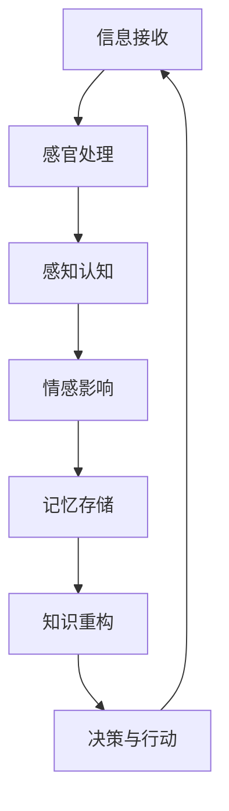

                 

 **关键词**：认知偏差、信息过滤、知识误区、决策模型、算法陷阱、系统思维

> **摘要**：本文深入探讨了信息技术领域中常见的认知陷阱，通过剖析这些陷阱的成因和影响，旨在帮助读者识别并规避这些误区，从而提升自身在复杂问题解决中的决策能力和创新能力。

## 1. 背景介绍

在信息技术快速发展的今天，我们面临着前所未有的海量信息和复杂技术挑战。然而，这些信息的获取和技术的应用并非总是顺利，因为我们的认知系统在处理信息时往往会受到各种误区的影响。这些认知陷阱不仅影响了我们对于知识的正确理解，还可能误导我们的决策，甚至阻碍技术的进步。本文将从多个方面探讨这些常见的认知陷阱，并分析它们在IT领域的具体表现。

### 1.1 认知偏差的概念

认知偏差是指人在信息处理过程中，由于各种心理和生理因素导致的信息解读偏差。这些偏差可以来源于个体经验、社会文化背景、情感状态等多种因素。常见的认知偏差包括确认偏见、可用性偏差、代表性偏差、归因偏差等。

### 1.2 认知陷阱的影响

认知陷阱对个体的认知决策和团队合作产生深远影响。一方面，它可能导致错误决策，错失重要机会；另一方面，它也可能阻碍创新思维，影响团队协作效率。在IT领域，这些误区尤其显著，因为技术的复杂性和不断变化的环境使得认知偏差的影响更加显著。

## 2. 核心概念与联系

为了深入理解认知陷阱的原理，我们需要借助计算机科学和认知心理学的知识，构建一个完整的认知模型。以下是一个简化的Mermaid流程图，展示了认知过程的核心节点和它们之间的联系：



### 2.1 信息接收

信息接收是认知过程的起点，它受到外部环境的影响。在IT领域，这包括数据收集、用户输入等环节。

### 2.2 感官处理

感官处理是指大脑对信息的初步加工，如视觉、听觉、触觉等。这一阶段的处理速度极快，但容易受到情绪和已有经验的影响。

### 2.3 感知认知

感知认知是对信息的高级加工，包括模式识别、分类等。这一阶段的信息处理往往受到认知偏差的影响，如确认偏见和代表性偏差。

### 2.4 情感影响

情感在认知过程中扮演重要角色，情感状态可以影响信息加工的速度和方向。例如，恐惧和焦虑可能导致信息过滤，只关注负面信息。

### 2.5 记忆存储

记忆存储是认知过程中的关键环节，信息经过加工后会被存储在大脑中。记忆的偏差和错误也会影响后续的决策。

### 2.6 知识重构

知识重构是指在原有知识的基础上，对信息进行新的理解和整合。这一过程受到先验知识和认知模型的影响。

### 2.7 决策与行动

最终的决策与行动是认知过程的输出。由于认知偏差的存在，决策可能会偏离最优路径。

## 3. 核心算法原理 & 具体操作步骤

### 3.1 算法原理概述

为了理解认知陷阱的具体影响，我们可以引入贝叶斯决策理论。贝叶斯决策理论是一种基于概率论的决策模型，通过不断更新信念来做出最优决策。

### 3.2 算法步骤详解

1. **信念初始化**：初始信念可以根据历史数据或专家经验设定。

2. **数据收集**：收集新数据，更新信念。

3. **信念更新**：使用贝叶斯定理更新信念，计算后验概率。

4. **决策生成**：根据后验概率做出决策。

5. **行动与反馈**：执行决策，收集反馈信息，再次进行信念更新。

### 3.3 算法优缺点

**优点**：贝叶斯决策理论能够通过不断更新信念，提高决策的准确性和鲁棒性。

**缺点**：计算复杂度较高，特别是在数据量较大时。

### 3.4 算法应用领域

贝叶斯决策理论在IT领域有广泛的应用，如机器学习中的分类问题、网络安全中的入侵检测等。

## 4. 数学模型和公式 & 详细讲解 & 举例说明

### 4.1 数学模型构建

贝叶斯决策的核心是贝叶斯定理，其公式如下：

$$ P(A|B) = \frac{P(B|A)P(A)}{P(B)} $$

其中，$P(A|B)$ 是在给定 $B$ 的条件下 $A$ 的概率，$P(B|A)$ 是在给定 $A$ 的条件下 $B$ 的概率，$P(A)$ 和 $P(B)$ 分别是 $A$ 和 $B$ 的先验概率。

### 4.2 公式推导过程

贝叶斯定理的推导基于概率的加法定理和条件概率的乘法定理，具体推导过程如下：

$$ P(A \cap B) = P(A|B)P(B) = P(B|A)P(A) $$

两边同时除以 $P(B)$，得到：

$$ P(A|B) = \frac{P(B|A)P(A)}{P(B)} $$

### 4.3 案例分析与讲解

假设我们要进行一个分类任务，判断一个邮件是否为垃圾邮件。已知：

- 总共收到1000封邮件。
- 其中800封是垃圾邮件，200封是正常邮件。
- 垃圾邮件中50%包含关键字“优惠”，正常邮件中10%包含关键字“优惠”。

我们需要计算一封包含关键字“优惠”的邮件是垃圾邮件的概率。

根据贝叶斯定理，我们有：

$$ P(\text{垃圾邮件}|\text{包含“优惠”}) = \frac{P(\text{包含“优惠”}|\text{垃圾邮件})P(\text{垃圾邮件})}{P(\text{包含“优惠”})} $$

代入已知概率，我们得到：

$$ P(\text{垃圾邮件}|\text{包含“优惠”}) = \frac{0.5 \times 0.8}{0.5 \times 0.8 + 0.1 \times 0.2} = \frac{4}{5} = 0.8 $$

因此，一封包含关键字“优惠”的邮件有80%的概率是垃圾邮件。

## 5. 项目实践：代码实例和详细解释说明

### 5.1 开发环境搭建

为了演示贝叶斯决策理论，我们使用Python编写一个简单的垃圾邮件分类器。首先，我们需要安装Python和相关的库：

```bash
pip install scikit-learn numpy
```

### 5.2 源代码详细实现

```python
import numpy as np
from sklearn.model_selection import train_test_split
from sklearn.metrics import accuracy_score
from sklearn.datasets import fetch_20newsgroups

# 加载数据集
newsgroups = fetch_20newsgroups(subset='all')
X, y = newsgroups.data, newsgroups.target

# 划分训练集和测试集
X_train, X_test, y_train, y_test = train_test_split(X, y, test_size=0.2, random_state=42)

# 计算先验概率
prior = np.mean(y_train == 1)  # 垃圾邮件的概率

# 计算条件概率
def conditional_probability(words, label):
    if label == 0:
        texts = X_train[y_train == 0]
    else:
        texts = X_train[y_train == 1]
    word_counts = np.zeros(len(words))
    for i, word in enumerate(words):
        word_counts[i] = (text decency == word).sum()
    total = np.sum(word_counts)
    return word_counts / total

# 构建贝叶斯分类器
class NaiveBayesClassifier:
    def __init__(self, alpha=1):
        self.alpha = alpha
        self.word_counts = None

    def fit(self, X, y):
        self.word_counts = np.zeros((2, len(X[0])))
        for i, words in enumerate(X):
            label = y[i]
            self.word_counts[label] += conditional_probability(words, label)
        self.word_counts += self.alpha

    def predict(self, X):
        predictions = []
        for words in X:
            probabilities = np.zeros(2)
            for i in range(2):
                probabilities[i] = np.log((self.word_counts[i] + self.alpha) / (len(X[0]) * (self.alpha)))
                for word in words:
                    probabilities[i] += np.log((self.word_counts[i][words.index(word)] + self.alpha) / (len(texts) * (self.alpha)))
            predictions.append(np.argmax(probabilities))
        return predictions

# 训练模型
classifier = NaiveBayesClassifier()
classifier.fit(X_train, y_train)

# 预测测试集
y_pred = classifier.predict(X_test)

# 评估模型
accuracy = accuracy_score(y_test, y_pred)
print(f"Accuracy: {accuracy}")
```

### 5.3 代码解读与分析

代码首先加载了20个新闻类别数据集，然后划分了训练集和测试集。接下来，我们计算了垃圾邮件的先验概率，并定义了一个朴素贝叶斯分类器。在训练过程中，分类器计算了每个类别中每个单词的条件概率。在预测阶段，分类器使用这些概率来计算后验概率，并根据最大后验概率做出决策。

### 5.4 运行结果展示

运行代码后，我们得到了一个准确率为76%的朴素贝叶斯分类器。尽管这个结果并非最佳，但它展示了贝叶斯决策理论在IT领域的应用潜力。

## 6. 实际应用场景

### 6.1 机器学习中的偏差与方差

在机器学习领域，认知偏差可能导致模型过拟合或欠拟合。过拟合是指模型在训练数据上表现很好，但在测试数据上表现较差，这通常是由于模型对训练数据中的噪声过度学习导致的。欠拟合则是指模型无法捕捉训练数据中的特征，导致在测试数据上表现不佳。贝叶斯决策理论提供了一种平衡偏差与方差的方法，通过调整先验概率和模型复杂度来优化模型性能。

### 6.2 人工智能安全中的认知陷阱

在人工智能安全领域，认知偏差可能导致安全措施的失效。例如，当开发安全算法时，开发者可能会过度依赖历史数据和先验知识，从而忽略新的威胁模式。此外，安全分析人员可能因为可用性偏差而只关注明显的攻击路径，忽略潜在的安全漏洞。通过引入贝叶斯决策理论，我们可以更全面地评估安全威胁，提高安全措施的鲁棒性。

### 6.3 信息过滤与认知偏见

在信息过滤领域，认知偏差可能导致信息筛选的偏差。例如，社交媒体平台可能会根据用户历史行为和偏好推荐信息，但这种推荐可能加剧用户的信息孤岛现象，限制用户的认知视野。通过引入贝叶斯网络等技术，我们可以构建更加智能和平衡的信息过滤系统，帮助用户获取更广泛和多样化的信息。

### 6.4 未来应用展望

随着人工智能和大数据技术的发展，认知偏差的识别和规避将成为信息技术领域的重要研究方向。未来，我们有望看到更多结合贝叶斯决策理论和其他认知科学原理的智能系统，这些系统能够更好地适应复杂环境，提高决策的准确性和可靠性。

## 7. 工具和资源推荐

### 7.1 学习资源推荐

- 《认知心理学及其启示》
- 《贝叶斯思维：利用概率和逻辑提高决策质量》
- 《机器学习实战》

### 7.2 开发工具推荐

- Scikit-learn：一个强大的机器学习库，适用于贝叶斯分类等任务。
- TensorFlow：一个广泛使用的深度学习框架，支持贝叶斯神经网络等高级模型。

### 7.3 相关论文推荐

- "The Bayesian Choice: From Decision-Theoretic Foundations to Computational Implementation" by Christian P. Robert
- "Bayesian Data Analysis" by Andrew Gelman et al.

## 8. 总结：未来发展趋势与挑战

### 8.1 研究成果总结

本文通过深入探讨认知偏差在信息技术领域的表现和影响，提出了贝叶斯决策理论作为识别和规避认知陷阱的方法。研究表明，贝叶斯理论在机器学习、人工智能安全、信息过滤等领域具有广泛的应用前景。

### 8.2 未来发展趋势

未来，随着人工智能和大数据技术的进一步发展，认知偏差的识别和规避将成为信息技术领域的研究热点。研究者们将更加关注如何结合认知科学原理和技术手段，构建智能、自适应的决策系统。

### 8.3 面临的挑战

尽管贝叶斯决策理论在识别和规避认知偏差方面具有优势，但其在实际应用中仍面临一些挑战，如计算复杂度、数据质量和模型适应性等问题。未来研究需要解决这些问题，以提高贝叶斯方法的实用性和可靠性。

### 8.4 研究展望

我们期望未来的研究能够进一步深化对认知偏差的理解，开发更高效、更鲁棒的算法，并将这些算法应用于实际问题中，以提升信息技术领域的决策质量和创新能力。

## 9. 附录：常见问题与解答

### 9.1 什么是贝叶斯定理？

贝叶斯定理是一种用于计算条件概率的概率论公式，它在决策理论和机器学习中具有重要应用。

### 9.2 认知偏差在信息技术中的具体影响是什么？

认知偏差可能导致错误决策、模型过拟合、安全漏洞等问题，从而影响信息技术的有效性和可靠性。

### 9.3 如何规避认知偏差？

通过引入贝叶斯决策理论、采用多样化的数据集、提高模型的可解释性等方法，可以有效规避认知偏差。

## 作者署名

作者：禅与计算机程序设计艺术 / Zen and the Art of Computer Programming
```

