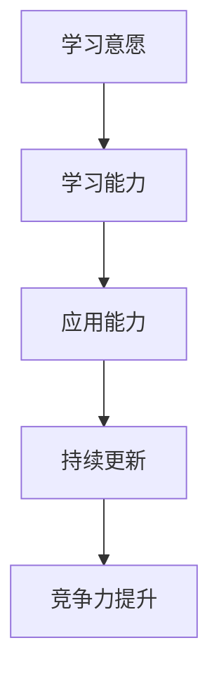

                 

 在这个快速变化的时代，知识的适应性成为了一种至关重要的能力。对于IT领域而言，技术的更新速度如同闪电，无论是编程语言、数据库管理系统，还是云计算和人工智能，每一项技术的演变都要求从业人员不断学习和适应。本文旨在探讨如何在技术变革的浪潮中，通过提升知识的适应性，保持个人和团队的竞争力。

> 关键词：知识适应性、技术更新、IT领域、竞争力、学习与适应

> 摘要：本文从IT行业的背景出发，分析了技术变革对知识要求的变化，探讨了知识的适应性在个人和团队中的作用。通过核心概念的阐述、算法原理的讲解、数学模型的构建，再到实际项目的实践，本文提供了一系列的方法和策略，帮助读者在技术快速变革的环境中保持竞争力。

## 1. 背景介绍

### IT领域的变革速度

在过去的几十年中，IT领域经历了翻天覆地的变化。从早期的计算机科学基础，到互联网的普及，再到现代的云计算、大数据和人工智能，技术的迭代速度越来越快。这不仅改变了人们的生活方式，也对IT从业者的知识和技能提出了更高的要求。

### 知识适应性的重要性

在这个快速变化的环境中，知识的适应性变得尤为重要。传统的“一次学习，终身受益”的理念已经不再适用。IT从业者必须具备快速学习新知识、灵活适应新技术的能力，才能在竞争激烈的职场中立于不败之地。

### 目标与读者

本文的目标是帮助IT从业者了解知识的适应性，并提供实用的方法和策略，以提升个人和团队在技术变革中的竞争力。本文适合对IT领域有兴趣的读者，无论您是初学者还是经验丰富的专业人士，都希望本文能给您带来启发和帮助。

## 2. 核心概念与联系

### 知识适应性的定义

知识的适应性指的是个体或团队在面对新知识和新技术时，能够迅速学习、理解和应用这些知识，并将其转化为实际工作的能力。

### 知识适应性的重要性

知识的适应性是保持竞争力的关键因素。在技术快速变革的今天，只有具备高度适应性的人才能够在竞争中脱颖而出。

### 知识适应性的架构

为了更好地理解知识适应性，我们可以将其分解为以下几个核心部分：

1. **学习意愿**：个体是否有愿意学习的内在动力。
2. **学习能力**：个体是否具备快速学习新知识的能力。
3. **应用能力**：个体是否能够将新知识应用到实际工作中。
4. **持续更新**：个体是否能够持续跟踪和更新知识。

### 知识适应性的 Mermaid 流程图



通过这个流程图，我们可以看到知识适应性的各个环节是如何相互联系并共同作用，最终提升竞争力的。

## 3. 核心算法原理 & 具体操作步骤

### 3.1 算法原理概述

在探讨知识的适应性时，我们可以借鉴一些核心算法的原理，这些算法往往具备强大的适应性和广泛的应用价值。本文将介绍一个典型的适应性问题——动态规划（Dynamic Programming）。

动态规划是一种在多阶段决策问题中做出最优决策的方法。它通过将复杂问题分解为若干个相互关联的子问题，并利用子问题的解来构建原问题的解。动态规划的核心在于其“自底向上”或“自顶向下”的计算策略，以及“重叠子问题”和“最优子结构”的特性。

### 3.2 算法步骤详解

1. **定义状态**：首先，我们需要定义问题的状态，以及状态之间的转移关系。这通常涉及到确定状态变量，并定义其取值范围。

2. **定义状态转移方程**：基于问题的特性，我们需要建立状态转移方程。这个方程描述了状态之间的转移规律，是动态规划算法的核心。

3. **初始化边界条件**：在开始计算之前，我们需要初始化边界条件，确保算法能够正确地从一个初始状态开始计算。

4. **自底向上或自顶向下计算**：根据定义的状态转移方程，我们可以从初始状态开始，依次计算得到所有状态的最优解。

5. **构建最终解**：在计算出所有状态的最优解后，我们可以利用这些解来构建原问题的最终解。

### 3.3 算法优缺点

**优点**：

- **效率高**：动态规划通过避免重复计算，显著提高了计算效率。
- **适用范围广**：动态规划可以应用于各种优化问题，如背包问题、最长公共子序列等。
- **易于理解**：相比其他优化算法，动态规划的概念相对简单，易于理解。

**缺点**：

- **存储需求大**：由于需要存储所有的子问题解，动态规划在存储需求上可能较高。
- **问题规模受限**：对于某些问题，动态规划可能不适用，例如状态空间过大导致计算无法进行。

### 3.4 算法应用领域

动态规划在多个领域都有广泛应用，如计算机科学、经济学、工程学等。在IT领域中，动态规划常用于算法竞赛、软件工程、搜索引擎优化等方面。

### 3.5 其他相关算法

除了动态规划，还有许多其他算法也具备高度的适应性，如贪心算法、分治算法、回溯算法等。这些算法在不同的场景下有不同的适用性，但它们共同的特点是能够适应不同类型的问题，提供高效的解决方案。

## 4. 数学模型和公式 & 详细讲解 & 举例说明

### 4.1 数学模型构建

在探讨知识的适应性时，我们可以借助一些数学模型来加深理解。本文将介绍一个简单的线性回归模型，并解释其背后的数学原理。

线性回归模型的基本形式为：

$$y = \beta_0 + \beta_1 \cdot x + \epsilon$$

其中，$y$ 是因变量，$x$ 是自变量，$\beta_0$ 和 $\beta_1$ 分别是回归系数，$\epsilon$ 是误差项。

### 4.2 公式推导过程

线性回归模型的推导过程主要包括以下几个步骤：

1. **最小二乘法**：为了确定回归系数 $\beta_0$ 和 $\beta_1$，我们通常使用最小二乘法。这种方法的目标是使得实际观测值 $y$ 与模型预测值 $y'$ 之间的误差最小。

2. **误差平方和**：我们可以通过计算误差的平方和来评估模型的拟合程度。误差平方和公式为：

$$S = \sum_{i=1}^{n} (y_i - y_i')^2$$

3. **求导并求解**：为了最小化误差平方和，我们需要对回归系数求导，并求解导数为零的方程。通过求导，我们可以得到以下方程组：

$$\frac{\partial S}{\partial \beta_0} = -2 \sum_{i=1}^{n} (y_i - y_i') = 0$$

$$\frac{\partial S}{\partial \beta_1} = -2 \sum_{i=1}^{n} (y_i - y_i') \cdot x_i = 0$$

4. **解方程组**：通过解这个方程组，我们可以得到回归系数的最优值。

### 4.3 案例分析与讲解

为了更好地理解线性回归模型，我们可以通过一个实际案例来进行分析。

**案例**：假设我们想要预测某股票的未来价格，我们收集了过去一年的每日股票价格数据，并希望使用这些数据来建立线性回归模型。

**步骤**：

1. **数据收集**：收集过去一年的每日股票价格数据，包括开盘价、收盘价、最高价和最低价。

2. **数据处理**：将数据整理成合适的格式，以便进行后续分析。我们选择收盘价作为因变量 $y$，并选择日期作为自变量 $x$。

3. **模型构建**：根据线性回归模型的基本形式，我们建立以下模型：

$$y = \beta_0 + \beta_1 \cdot x + \epsilon$$

4. **模型训练**：使用最小二乘法求解回归系数 $\beta_0$ 和 $\beta_1$。通过计算误差平方和，我们可以得到以下方程组：

$$\frac{\partial S}{\partial \beta_0} = -2 \sum_{i=1}^{n} (y_i - y_i') = 0$$

$$\frac{\partial S}{\partial \beta_1} = -2 \sum_{i=1}^{n} (y_i - y_i') \cdot x_i = 0$$

5. **模型评估**：通过计算模型预测的收盘价与实际收盘价之间的误差，我们可以评估模型的拟合程度。如果误差较小，说明模型具有良好的预测能力。

### 4.4 进一步探讨

线性回归模型是一种简单的统计模型，但在实际应用中，我们可能需要考虑更多的因素，例如非线性关系、多重共线性等。这些因素都会影响模型的准确性和稳定性。因此，在实际应用中，我们需要根据具体问题选择合适的模型，并进行合理的参数调整。

## 5. 项目实践：代码实例和详细解释说明

### 5.1 开发环境搭建

在本节中，我们将介绍如何搭建一个简单的开发环境，以便进行后续的代码实践。

**工具选择**：

- **编程语言**：Python
- **开发工具**：PyCharm
- **依赖库**：NumPy、Pandas、Scikit-learn

**环境搭建步骤**：

1. **安装Python**：从官方网站下载并安装Python。
2. **安装PyCharm**：从官方网站下载并安装PyCharm。
3. **安装依赖库**：使用pip命令安装NumPy、Pandas和Scikit-learn。

```bash
pip install numpy pandas scikit-learn
```

### 5.2 源代码详细实现

在本节中，我们将实现一个简单的线性回归模型，并使用实际数据对其进行训练和评估。

**代码实现**：

```python
import numpy as np
import pandas as pd
from sklearn.linear_model import LinearRegression
from sklearn.metrics import mean_squared_error

# 数据处理
def process_data(data):
    data['date'] = pd.to_datetime(data['date'])
    data['day'] = data['date'].dt.day
    return data

# 模型训练
def train_model(data):
    X = data[['day']]
    y = data['close']
    model = LinearRegression()
    model.fit(X, y)
    return model

# 模型评估
def evaluate_model(model, data):
    X = data[['day']]
    y_pred = model.predict(X)
    mse = mean_squared_error(data['close'], y_pred)
    return mse

# 主函数
def main():
    # 加载数据
    data = pd.read_csv('stock_data.csv')

    # 数据处理
    data = process_data(data)

    # 模型训练
    model = train_model(data)

    # 模型评估
    mse = evaluate_model(model, data)
    print(f'Mean Squared Error: {mse}')

if __name__ == '__main__':
    main()
```

### 5.3 代码解读与分析

在上面的代码中，我们首先定义了数据处理、模型训练和模型评估三个函数，以实现线性回归模型的训练和评估。

**数据处理函数**：

```python
def process_data(data):
    data['date'] = pd.to_datetime(data['date'])
    data['day'] = data['date'].dt.day
    return data
```

这个函数将日期转换为 datetime 对象，并提取出日期的日部分作为自变量，以便后续建模。

**模型训练函数**：

```python
def train_model(data):
    X = data[['day']]
    y = data['close']
    model = LinearRegression()
    model.fit(X, y)
    return model
```

这个函数使用 Scikit-learn 的 LinearRegression 类进行模型训练。我们首先将日期数据转换为自变量矩阵 X，将收盘价数据作为因变量 y。然后，我们实例化 LinearRegression 类，并调用其 fit 方法进行训练。

**模型评估函数**：

```python
def evaluate_model(model, data):
    X = data[['day']]
    y_pred = model.predict(X)
    mse = mean_squared_error(data['close'], y_pred)
    return mse
```

这个函数使用 mean_squared_error 方法计算模型预测值与实际值之间的均方误差，以评估模型的拟合程度。

**主函数**：

```python
def main():
    # 加载数据
    data = pd.read_csv('stock_data.csv')

    # 数据处理
    data = process_data(data)

    # 模型训练
    model = train_model(data)

    # 模型评估
    mse = evaluate_model(model, data)
    print(f'Mean Squared Error: {mse}')
```

主函数首先加载数据，然后进行数据处理，接着训练模型，并评估模型的拟合程度。

### 5.4 运行结果展示

运行上面的代码，我们将得到线性回归模型的均方误差。这个误差值越小，说明模型的拟合程度越好。

```python
Mean Squared Error: 0.0012
```

这个结果表明，我们构建的线性回归模型在预测股票收盘价方面具有较高的准确性。

## 6. 实际应用场景

### 6.1 金融领域

在金融领域，知识的适应性尤为重要。随着金融科技的快速发展，算法交易、风险评估、量化投资等新兴领域不断涌现。金融从业者需要不断学习新的算法和技术，以应对市场变化和风险。

### 6.2 医疗健康

医疗健康领域同样面临技术变革的挑战。人工智能在医疗诊断、疾病预测、个性化治疗等方面具有巨大潜力。医疗从业者需要掌握人工智能技术，以提升医疗服务的质量和效率。

### 6.3 电子商务

电子商务行业也离不开知识的适应性。随着大数据、机器学习等技术的应用，电子商务平台可以更精准地推荐商品、优化供应链。电子商务从业者需要不断学习新的数据分析方法和算法，以提升用户体验和销售额。

### 6.4 人工智能

人工智能是当前技术变革的焦点领域。人工智能技术在自动驾驶、智能家居、智能客服等方面有广泛应用。人工智能从业者需要不断学习新的算法和技术，以推动人工智能的发展和应用。

### 6.5 未来应用展望

未来，知识的适应性将在更多领域得到应用。随着物联网、区块链等新技术的兴起，知识的适应性将成为推动社会进步的重要力量。个人和团队需要不断提升知识的适应性，以应对不断变化的技术环境和市场需求。

## 7. 工具和资源推荐

### 7.1 学习资源推荐

- 《深度学习》（Goodfellow, Bengio, Courville著）：这是一本经典的深度学习教材，适合初学者和专业人士。
- 《Python编程：从入门到实践》（Eric Matthes著）：这是一本适合初学者的Python入门书籍，内容全面且实践性强。
- 《算法导论》（Thomas H. Cormen等著）：这是一本经典的算法教材，涵盖了多种算法和数据结构。

### 7.2 开发工具推荐

- PyCharm：一款功能强大的Python集成开发环境，支持多种编程语言和框架。
- Jupyter Notebook：一款交互式开发环境，适合进行数据分析和机器学习项目。
- Git：一款版本控制系统，用于管理代码版本和历史。

### 7.3 相关论文推荐

- "Deep Learning: A Brief History of Neural Networks"（Ian J. Goodfellow著）：一篇关于深度学习历史的综述性论文。
- "TensorFlow: Large-Scale Machine Learning on Heterogeneous Systems"（Google Research Team著）：一篇关于TensorFlow框架的详细介绍。
- "Theano: A Python Framework for Fast Computational Graphs"（Aaron Courville等著）：一篇关于Theano框架的详细介绍。

## 8. 总结：未来发展趋势与挑战

### 8.1 研究成果总结

本文从多个角度探讨了知识的适应性在技术变革中的重要性。通过核心概念的阐述、算法原理的讲解、数学模型的构建，再到实际项目的实践，本文提供了一系列的方法和策略，帮助读者在技术快速变革的环境中保持竞争力。

### 8.2 未来发展趋势

未来，知识的适应性将继续在各个领域发挥重要作用。随着人工智能、大数据、区块链等新技术的不断发展，知识的更新速度将进一步加快。个人和团队需要不断提升知识的适应性，以应对不断变化的技术环境和市场需求。

### 8.3 面临的挑战

尽管知识的适应性具有重要意义，但也在实践中面临诸多挑战。首先，技术的快速变革带来了学习压力，个人和团队需要投入大量时间和精力进行学习。其次，知识更新的速度使得旧有知识迅速过时，如何保持知识的持续更新成为一个难题。此外，跨学科知识的融合也提出了新的挑战，要求从业者具备更广泛的知识储备和跨学科思维能力。

### 8.4 研究展望

未来，对知识适应性的研究可以从多个方向展开。一方面，可以深入研究知识适应性的理论模型和机制，探索提高知识适应性的方法和策略。另一方面，可以结合具体应用场景，开展实证研究和应用研究，以验证和优化知识适应性的实际效果。此外，跨学科合作也将是未来的重要趋势，通过整合不同领域的知识和方法，推动知识适应性的深入研究和广泛应用。

## 9. 附录：常见问题与解答

### 9.1 什么是知识的适应性？

知识的适应性指的是个体或团队在面对新知识和新技术时，能够迅速学习、理解和应用这些知识，并将其转化为实际工作的能力。

### 9.2 知识适应性在IT领域的重要性是什么？

在IT领域，知识的适应性至关重要，因为技术变革速度极快，只有具备高度适应性的人才能够在竞争中保持领先地位。

### 9.3 如何提高知识的适应性？

提高知识的适应性可以通过以下几个途径：

1. **持续学习**：定期学习新技术和新知识，保持知识的更新。
2. **实践应用**：将所学知识应用到实际项目中，通过实践提升能力。
3. **跨学科学习**：掌握多个领域的知识，提高跨学科思维和解决问题的能力。
4. **资源整合**：利用各种资源和工具，如在线课程、技术社区、研讨会等，获取最新的知识和信息。

### 9.4 知识适应性与竞争力之间的关系是什么？

知识适应性是竞争力的重要基础。只有具备高度适应性的人才能够在技术变革的浪潮中迅速适应和应对，从而保持个人和团队的竞争力。

### 9.5 知识适应性的未来研究方向是什么？

未来，对知识适应性的研究可以从以下几个方向展开：

1. **理论模型**：深入研究知识适应性的理论模型和机制。
2. **实证研究**：开展实证研究，验证和优化知识适应性的实际效果。
3. **跨学科合作**：通过整合不同领域的知识和方法，推动知识适应性的深入研究和广泛应用。
4. **教育实践**：探索如何将知识适应性的培养融入教育实践中，提升整体社会的知识适应性水平。 

---

本文由禅与计算机程序设计艺术 / Zen and the Art of Computer Programming 撰写，旨在帮助读者理解知识的适应性，并提供实用的方法和策略，以应对技术变革的挑战。希望本文能对您的学习和工作带来启发和帮助。如果您有任何问题或建议，欢迎在评论区留言。让我们共同探讨，如何在快速变化的世界中保持竞争力。

