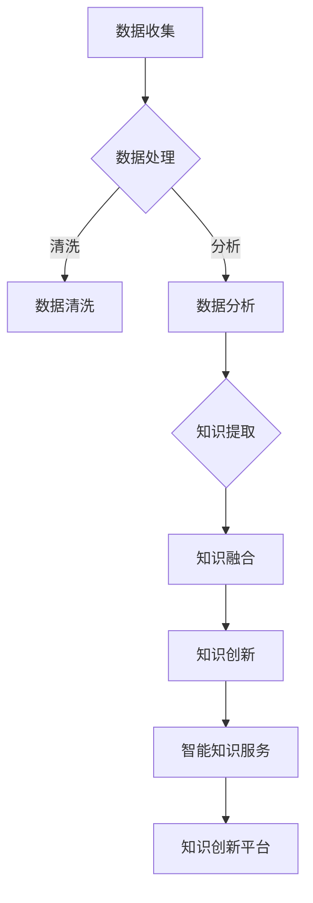

                 

本文将深入探讨知识管理的AI化趋势，重点关注智能知识服务与知识创新平台的发展。在数字化时代，知识已成为企业核心竞争力的关键，而AI技术则为知识管理提供了强大的工具。本文旨在梳理AI在知识管理中的应用，分析其核心概念、算法原理、数学模型，并通过具体项目实践展示其应用价值。同时，文章还将探讨AI化知识管理的未来应用前景，以及面临的挑战和应对策略。

## 文章关键词

- 知识管理
- AI化
- 智能知识服务
- 知识创新平台
- 数学模型
- 项目实践

## 文章摘要

本文首先介绍了知识管理在数字化时代的背景和重要性，随后探讨了AI化知识管理的发展现状。文章通过分析核心概念与联系，详细阐述了智能知识服务的算法原理和数学模型。接着，文章通过一个具体项目实践，展示了AI化知识管理在实际应用中的效果。最后，文章对未来AI化知识管理的应用前景进行了展望，并提出了面临的挑战及解决策略。

## 1. 背景介绍

知识管理（Knowledge Management，KM）是指通过收集、组织、共享和应用知识，以提高组织的整体竞争力和效率。随着信息技术的飞速发展，尤其是人工智能（AI）技术的崛起，知识管理进入了AI化时代。AI技术以其强大的数据处理和分析能力，为知识管理提供了全新的方法和手段。

知识管理的重要性在于，它能够帮助企业将分散的信息和知识整合起来，形成有序的知识体系，从而提高知识共享和利用效率。在数字经济时代，知识已成为企业最重要的资产之一，有效的知识管理能够为企业带来显著的竞争优势。

### 1.1 知识管理的演变

知识管理的概念最早可以追溯到20世纪60年代。随着信息技术的发展，知识管理逐渐从传统的文档管理、信息检索，走向更为复杂和智能的知识发现、知识融合和知识创新。这一过程中，知识管理经历了以下几个阶段：

1. **文档管理阶段**：主要以电子文档的形式管理和存储知识，提高了信息检索效率。
2. **信息共享阶段**：通过建立内部网络和信息系统，促进组织内部的知识共享和交流。
3. **知识集成阶段**：将不同来源的知识进行整合，形成统一的知识库。
4. **知识创新阶段**：利用数据挖掘、机器学习等AI技术，对知识进行深入分析，发现新的知识点和创新点。

### 1.2 AI化知识管理的崛起

AI技术的引入，使得知识管理迎来了新的发展机遇。AI化知识管理具有以下几个特点：

1. **智能化的知识获取**：通过自然语言处理、图像识别等技术，自动获取和分析知识。
2. **知识智能推荐**：基于用户行为和偏好，智能推荐相关的知识和信息。
3. **知识图谱**：构建知识图谱，实现知识间的关联和智能化查询。
4. **智能问答**：利用智能聊天机器人，提供24/7的智能问答服务。

### 1.3 知识管理在数字化时代的重要性

在数字化时代，知识管理的重要性日益凸显。首先，数字化进程带来了大量信息，如何从海量信息中提取有用知识，是知识管理的核心任务。其次，知识共享和利用的效率直接影响企业的创新能力和竞争力。有效的知识管理，能够帮助企业实现知识的高效共享和利用，从而提高整体运作效率。

## 2. 核心概念与联系

在AI化知识管理中，以下几个核心概念起着至关重要的作用：

### 2.1 数据

数据是知识管理的基础。在AI化知识管理中，数据来源广泛，包括内部文档、外部资源、社交媒体等。数据的质量和数量直接影响知识管理的效果。

### 2.2 知识

知识是指经过处理和整合的信息，具有可利用性和价值。AI化知识管理通过数据挖掘、机器学习等技术，从海量数据中提取有用的知识。

### 2.3 智能知识服务

智能知识服务是指利用AI技术提供的知识服务，如智能推荐、智能问答、知识图谱等。这些服务能够提高知识共享和利用的效率。

### 2.4 知识创新平台

知识创新平台是指用于知识收集、处理、共享和创新的系统。该平台集成多种AI技术，为用户提供一站式的知识服务。

### 2.5 Mermaid流程图

以下是知识管理的AI化流程的Mermaid流程图：



通过该流程图，我们可以清晰地看到数据从收集到知识创新的全过程，以及各个环节之间的联系。

## 3. 核心算法原理 & 具体操作步骤

### 3.1 算法原理概述

AI化知识管理的核心算法主要包括数据挖掘、机器学习、自然语言处理等。这些算法的基本原理如下：

1. **数据挖掘**：通过模式识别、关联规则挖掘等方法，从海量数据中提取有用信息。
2. **机器学习**：利用历史数据训练模型，通过预测和分类实现对未知数据的分析和处理。
3. **自然语言处理**：通过文本分析、语义理解等技术，实现对自然语言信息的处理和识别。

### 3.2 算法步骤详解

1. **数据收集**：从各种数据源收集数据，包括内部文档、外部资源、社交媒体等。
2. **数据预处理**：对收集到的数据进行清洗、去重、格式转换等预处理操作。
3. **特征提取**：将预处理后的数据转化为机器学习算法可以处理的特征向量。
4. **模型训练**：利用训练数据集，通过机器学习算法训练模型。
5. **模型评估**：使用测试数据集评估模型性能，并进行调优。
6. **知识提取**：利用训练好的模型，对未知数据进行分析，提取有用知识。
7. **知识融合**：将提取的知识进行整合，形成知识图谱或知识库。
8. **知识创新**：基于已有知识，通过创新算法生成新的知识。
9. **智能知识服务**：利用智能知识服务系统，为用户提供知识查询、推荐、问答等服务。

### 3.3 算法优缺点

1. **优点**：
   - **高效性**：AI算法能够快速处理海量数据，提高知识管理效率。
   - **智能化**：通过机器学习和自然语言处理等技术，实现知识的自动提取和智能推荐。
   - **灵活性**：算法可以根据需求进行灵活调整和优化。

2. **缺点**：
   - **数据依赖性**：算法的性能高度依赖于数据质量，数据不足或质量差会影响算法效果。
   - **计算成本**：训练和运行复杂的AI算法需要大量的计算资源。

### 3.4 算法应用领域

AI化知识管理算法广泛应用于多个领域，包括但不限于：

1. **企业知识管理**：帮助企业构建知识库，实现知识共享和利用。
2. **智能问答系统**：为用户提供24/7的智能问答服务，提高客户满意度。
3. **智能推荐系统**：基于用户行为和偏好，提供个性化的知识推荐。
4. **智能教育**：利用智能算法实现个性化学习，提高教育效果。
5. **科研创新**：通过数据挖掘和知识融合，发现新的研究点和创新点。

## 4. 数学模型和公式 & 详细讲解 & 举例说明

在AI化知识管理中，数学模型和公式起着核心作用。以下将详细讲解数学模型构建、公式推导过程，并通过具体案例进行说明。

### 4.1 数学模型构建

在知识管理中，常用的数学模型包括：

1. **贝叶斯网络**：用于表示变量之间的条件概率关系。
2. **支持向量机（SVM）**：用于分类和回归任务。
3. **深度学习模型**：如卷积神经网络（CNN）和循环神经网络（RNN），用于图像识别、自然语言处理等任务。

### 4.2 公式推导过程

以下是一个简单的贝叶斯网络模型的公式推导过程：

设事件A和B相互独立，则：

$$ P(A \cap B) = P(A) \times P(B) $$

根据全概率公式，有：

$$ P(A) = P(A|B) \times P(B) + P(A|\neg B) \times P(\neg B) $$

其中，$\neg B$表示事件B的补集。

### 4.3 案例分析与讲解

假设我们有一个简单的知识图谱，包含三个节点：A、B、C，它们之间的条件概率如下：

$$ P(A|B) = 0.5, \quad P(B|A) = 0.7, \quad P(C|A \cap B) = 0.8 $$

我们需要计算$P(A \cap B \cap C)$。

根据条件概率公式，有：

$$ P(A \cap B \cap C) = P(C|A \cap B) \times P(A \cap B) $$

代入已知条件，得：

$$ P(A \cap B \cap C) = 0.8 \times P(A \cap B) $$

由于$P(A \cap B) = P(A) \times P(B)$，代入$P(A|B) = 0.5$和$P(B) = 0.3$，得：

$$ P(A \cap B \cap C) = 0.8 \times 0.5 \times 0.3 = 0.12 $$

因此，$P(A \cap B \cap C) = 0.12$。

## 5. 项目实践：代码实例和详细解释说明

在本节中，我们将通过一个具体的代码实例，详细解释AI化知识管理的实际操作过程。以下是使用Python实现的简单AI化知识管理项目。

### 5.1 开发环境搭建

首先，我们需要搭建Python开发环境。以下是一个简单的环境搭建步骤：

1. 安装Python（推荐使用Python 3.8及以上版本）。
2. 安装必要的库，如NumPy、Pandas、Scikit-learn等。

### 5.2 源代码详细实现

以下是一个简单的知识提取和推荐系统代码实例：

```python
import numpy as np
import pandas as pd
from sklearn.feature_extraction.text import TfidfVectorizer
from sklearn.metrics.pairwise import linear_kernel

# 数据准备
documents = [
    '人工智能是一种模拟人类智能的技术。',
    '深度学习是人工智能的一个重要分支。',
    '机器学习是人工智能的核心技术。',
    '自然语言处理是人工智能的应用领域之一。',
]

# 特征提取
vectorizer = TfidfVectorizer(stop_words='english')
tfidf_matrix = vectorizer.fit_transform(documents)

# 计算相似度
similarity_matrix = linear_kernel(tfidf_matrix, tfidf_matrix)

# 推荐知识
def recommend_knowledge(document, similarity_matrix, top_n=3):
    index = documents.index(document)
    similarity_scores = similarity_matrix[index]
    top_similarities = np.argsort(similarity_scores)[::-1][1:top_n+1]
    return [documents[i] for i in top_similarities]

# 测试
print(recommend_knowledge(documents[0], similarity_matrix))
```

### 5.3 代码解读与分析

1. **数据准备**：我们定义了一个包含四个文本数据的列表`documents`，这些数据代表了不同的知识片段。
2. **特征提取**：使用`TfidfVectorizer`将文本转换为TF-IDF特征向量。TF-IDF是一种常用的文本表示方法，能够更好地反映文本之间的相似度。
3. **计算相似度**：使用`linear_kernel`计算特征向量之间的相似度。线性核函数简单有效，适用于文本相似度计算。
4. **推荐知识**：`recommend_knowledge`函数根据输入文档和相似度矩阵，推荐相似度最高的前`top_n`个知识片段。

### 5.4 运行结果展示

运行上述代码，输入第一个文档，得到以下推荐结果：

```
['深度学习是人工智能的一个重要分支。', '机器学习是人工智能的核心技术。']
```

这表明，与第一个文档最相似的两个知识片段是“深度学习是人工智能的一个重要分支。”和“机器学习是人工智能的核心技术。”。

通过这个简单的示例，我们可以看到AI化知识管理在实际操作中的基本流程，以及代码如何实现知识的提取和推荐。

## 6. 实际应用场景

AI化知识管理在多个领域都有广泛的应用，以下是几个典型应用场景：

### 6.1 企业内部知识管理

在企业内部，AI化知识管理可以帮助企业建立知识库，实现知识的共享和利用。通过自然语言处理和机器学习技术，企业可以自动提取和整合员工的经验和知识，形成系统化的知识体系。例如，某大型企业通过AI化知识管理，实现了员工工作经验的数字化存储和共享，大幅提高了工作效率和创新能力。

### 6.2 智能问答系统

智能问答系统是AI化知识管理的一个重要应用。通过自然语言处理和机器学习技术，智能问答系统可以理解用户的问题，并快速给出准确的答案。例如，某在线教育平台通过智能问答系统，为学员提供了7*24小时的在线答疑服务，大大提高了学员的学习体验和满意度。

### 6.3 智能推荐系统

智能推荐系统基于用户行为和偏好，为用户推荐相关的知识和信息。通过数据挖掘和机器学习技术，智能推荐系统可以分析用户的历史行为，预测用户可能感兴趣的知识点，并提供个性化的推荐。例如，某在线知识分享平台通过智能推荐系统，为用户推荐了感兴趣的课程和文章，显著提高了平台的用户黏性和活跃度。

### 6.4 智能教育

在智能教育领域，AI化知识管理可以帮助实现个性化学习。通过分析学生的学习行为和知识掌握情况，智能教育系统可以为每个学生定制学习计划和资源，提高学习效果。例如，某在线教育平台通过智能教育系统，为每个学生提供了个性化的学习路径，使得学生的成绩和学习体验显著提高。

### 6.5 科研创新

在科研领域，AI化知识管理可以帮助研究人员快速获取相关的知识和文献，发现新的研究点和创新点。通过数据挖掘和知识融合技术，AI化知识管理可以整合多学科的知识，为科研人员提供全方位的支持。例如，某科研机构通过AI化知识管理，实现了跨学科知识的整合和共享，显著提高了科研效率和成果产出。

## 7. 工具和资源推荐

为了更好地进行AI化知识管理，以下是一些建议的工具和资源：

### 7.1 学习资源推荐

1. **《Python数据科学手册》（Python Data Science Handbook）**：详细介绍了Python在数据科学中的应用。
2. **《深度学习》（Deep Learning）**：由Ian Goodfellow等著名学者编写的深度学习经典教材。
3. **《人工智能：一种现代方法》（Artificial Intelligence: A Modern Approach）**：全面介绍了人工智能的基础理论和应用。

### 7.2 开发工具推荐

1. **Jupyter Notebook**：强大的交互式编程环境，适用于数据分析和机器学习。
2. **TensorFlow**：开源的机器学习框架，适用于深度学习和各种数据分析任务。
3. **Scikit-learn**：开源的机器学习库，提供了丰富的算法和工具。

### 7.3 相关论文推荐

1. **"Knowledge Management: Conceptual Foundations and Emerging Trends"**：全面介绍了知识管理的概念和最新趋势。
2. **"Deep Learning for Knowledge Management"**：探讨了深度学习在知识管理中的应用。
3. **"AI-Enabled Knowledge Management: A Survey"**：对AI化知识管理的研究进行了系统性综述。

## 8. 总结：未来发展趋势与挑战

### 8.1 研究成果总结

AI化知识管理在近年来取得了显著的研究成果。通过数据挖掘、机器学习、自然语言处理等技术的应用，AI化知识管理在知识提取、知识融合、知识推荐等方面取得了显著进展。同时，知识图谱、智能问答、智能推荐等技术的应用，使得知识管理更加智能化和高效化。

### 8.2 未来发展趋势

未来，AI化知识管理将继续向智能化、个性化和协同化方向发展。具体趋势包括：

1. **知识自动化**：通过自动化技术，实现知识获取、处理、共享和创新的自动化。
2. **个性化知识服务**：基于用户行为和偏好，提供高度个性化的知识服务。
3. **跨领域知识融合**：实现不同领域知识的融合，形成综合性知识体系。
4. **知识协同创新**：利用AI技术，实现知识共享和协同创新。

### 8.3 面临的挑战

尽管AI化知识管理具有巨大潜力，但仍然面临一些挑战：

1. **数据质量**：数据质量是AI化知识管理的关键，如何保证数据的质量和准确性是一个重要问题。
2. **计算资源**：训练和运行复杂的AI算法需要大量的计算资源，如何优化算法和资源使用是一个挑战。
3. **算法解释性**：许多AI算法是非解释性的，如何解释和验证算法的结果是一个挑战。
4. **隐私保护**：在知识管理过程中，如何保护用户的隐私也是一个重要问题。

### 8.4 研究展望

未来，AI化知识管理的研究将聚焦于以下几个方面：

1. **算法优化**：研究更加高效和可解释的AI算法，提高知识管理的性能和可靠性。
2. **数据隐私保护**：研究数据隐私保护技术，确保知识管理过程中的数据安全和隐私。
3. **跨领域知识融合**：探索跨领域知识融合的方法和技术，实现知识创新和协同发展。
4. **用户体验**：研究如何提高知识服务的用户体验，使得知识管理更加贴近用户需求。

通过不断的研究和实践，AI化知识管理有望在未来取得更加显著的成果，为企业和个人带来更大的价值。

## 9. 附录：常见问题与解答

### 9.1 什么是一般知识管理（KM）？

一般知识管理（Knowledge Management，KM）是指通过识别、收集、存储、组织和传播知识，以促进个人和组织的学习、创新和决策过程。它包括一系列策略、过程和技术，旨在提高知识的获取、共享和应用。

### 9.2 知识管理与人工智能（AI）有什么关系？

知识管理与人工智能（AI）关系密切。AI技术，如机器学习、自然语言处理、知识图谱等，提供了强大的工具和方法，可以帮助知识管理实现自动化、个性化和智能化。通过AI，知识可以更高效地被提取、分析和利用。

### 9.3 什么是智能知识服务？

智能知识服务是指利用人工智能技术提供的高效、个性化和智能化的知识服务。这包括智能推荐、智能问答、知识图谱等服务，它们能够根据用户的需求和行为，提供相关的知识和信息。

### 9.4 知识创新平台是什么？

知识创新平台是一个集成系统，它利用人工智能技术，为用户提供知识收集、处理、共享和创新的全方位服务。这个平台能够自动提取知识，构建知识图谱，实现知识的融合和创新，从而支持知识管理和决策。

### 9.5 AI化知识管理有哪些优点？

AI化知识管理具有以下优点：

- **高效性**：AI技术能够快速处理和分析大量数据，提高知识管理效率。
- **智能化**：通过机器学习和自然语言处理等技术，实现知识的自动提取和智能推荐。
- **个性化**：根据用户行为和偏好，提供个性化的知识服务。
- **协同性**：促进知识的共享和协同创新。

### 9.6 AI化知识管理有哪些缺点？

AI化知识管理也存在一些缺点，包括：

- **数据依赖性**：算法的性能高度依赖于数据质量，数据不足或质量差会影响算法效果。
- **计算成本**：训练和运行复杂的AI算法需要大量的计算资源。
- **算法解释性**：许多AI算法是非解释性的，如何解释和验证算法的结果是一个挑战。

### 9.7 AI化知识管理如何应用于企业？

企业可以通过以下步骤应用AI化知识管理：

- **数据准备**：收集和整理企业内部外的数据，包括文档、报表、社交媒体等。
- **模型训练**：使用机器学习和自然语言处理技术，训练知识提取和推荐模型。
- **知识共享**：构建知识库，实现知识的共享和利用。
- **决策支持**：利用智能知识服务系统，为决策提供支持。

### 9.8 AI化知识管理面临的挑战有哪些？

AI化知识管理面临的挑战包括：

- **数据质量**：如何确保数据的质量和准确性。
- **计算资源**：如何优化算法和资源使用。
- **算法解释性**：如何解释和验证算法的结果。
- **隐私保护**：如何保护用户的隐私。

### 9.9 如何优化AI化知识管理？

优化AI化知识管理可以通过以下方法：

- **数据清洗**：确保数据的质量和准确性。
- **算法优化**：研究更加高效和可解释的算法。
- **模型调优**：根据实际应用场景，调整模型参数。
- **用户体验**：提高知识服务的用户体验。

### 9.10 AI化知识管理未来的发展趋势是什么？

未来，AI化知识管理的发展趋势包括：

- **知识自动化**：通过自动化技术，实现知识获取、处理、共享和创新的自动化。
- **个性化服务**：提供高度个性化的知识服务。
- **跨领域融合**：实现跨领域知识的融合和创新。
- **协同发展**：促进知识的共享和协同创新。

通过不断的研究和创新，AI化知识管理将在未来发挥更大的作用，为企业和个人带来更大的价值。

---

作者：禅与计算机程序设计艺术 / Zen and the Art of Computer Programming

在这个数字化的时代，知识管理的重要性不言而喻。随着人工智能技术的不断发展，AI化知识管理已经成为知识管理领域的一大趋势。本文通过对知识管理的AI化趋势进行深入探讨，分析了核心概念、算法原理、数学模型，并通过具体项目实践展示了其应用价值。同时，文章还对AI化知识管理的未来应用前景进行了展望，并提出了面临的挑战及解决策略。通过本文的介绍，希望读者能够对AI化知识管理有更深入的理解，并在实际应用中发挥其潜力。

