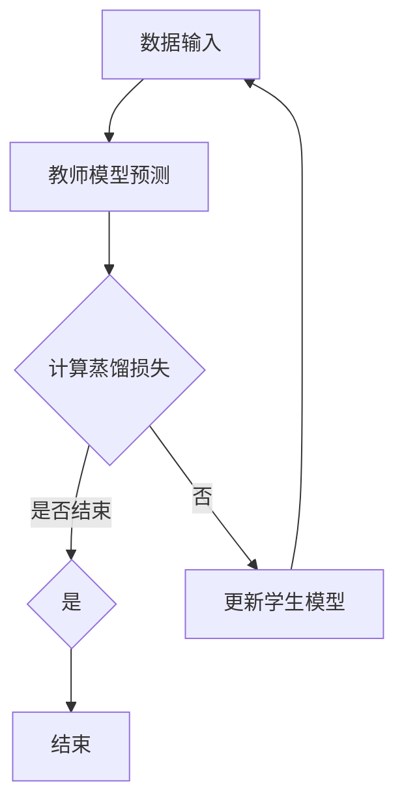

                 

### 关键词 Keywords ###
- 知识蒸馏
- 模型压缩
- 深度学习
- 训练时间效率
- 模型解释性

### 摘要 Abstract ###
知识蒸馏（Knowledge Distillation）是一种用于加速深度学习模型训练并提高其性能的技术。本文将详细介绍知识蒸馏的原理、算法、数学模型，并给出一个详细的代码实例。文章还将探讨知识蒸馏在不同应用场景中的优势，以及其在未来可能的发展趋势。

## 1. 背景介绍

随着深度学习技术的迅猛发展，大型神经网络模型在图像识别、自然语言处理等领域取得了显著的成果。然而，这些大型模型通常需要大量的计算资源和时间进行训练，且在部署时也面临模型大小和能耗的限制。为了解决这些问题，研究者们提出了知识蒸馏（Knowledge Distillation）技术。

知识蒸馏的核心思想是将一个复杂的大模型（称为教师模型）的知识传递给一个小模型（称为学生模型）。通过这种方式，学生模型可以快速地学习到教师模型的内在知识，从而在保持较高准确率的同时减少模型的大小和训练时间。

## 2. 核心概念与联系

### 2.1 教师模型与学生模型

知识蒸馏涉及两个模型：教师模型和学生模型。教师模型通常是一个训练好的大型神经网络，具有较高的准确率。学生模型则是一个较小的网络，用于在知识蒸馏过程中学习教师模型的知识。

### 2.2 蒸馏损失函数

知识蒸馏的关键在于设计一个损失函数，以衡量学生模型对教师模型知识的理解程度。常用的损失函数包括Softmax Loss、Cross-Entropy Loss等。这些损失函数通过比较学生模型的预测分布与教师模型的预测分布之间的差异来计算损失。

### 2.3 Mermaid 流程图

下面是一个简化的知识蒸馏流程图的 Mermaid 表达式：



## 3. 核心算法原理 & 具体操作步骤

### 3.1 算法原理概述

知识蒸馏的基本原理是利用教师模型的全局信息和细节知识来指导学生模型的学习。在训练过程中，学生模型不仅要最小化原始的预测误差，还要最小化与教师模型预测分布的差异。

### 3.2 算法步骤详解

1. **初始化**：设置教师模型和学生模型的参数。
2. **数据输入**：输入训练数据，教师模型和学生模型分别对其进行预测。
3. **计算蒸馏损失**：使用Softmax Loss或Cross-Entropy Loss等损失函数计算学生模型的预测分布与教师模型预测分布之间的差异。
4. **更新学生模型**：根据蒸馏损失函数更新学生模型的参数。
5. **迭代训练**：重复步骤2-4，直到满足停止条件。

### 3.3 算法优缺点

**优点**：
- 可以快速训练出与教师模型相似的学生模型。
- 减少了模型的大小和训练时间。

**缺点**：
- 需要一个高质量的教师模型。
- 在某些情况下，学生模型可能无法完全学习到教师模型的所有知识。

### 3.4 算法应用领域

知识蒸馏技术广泛应用于图像识别、自然语言处理和语音识别等领域。例如，在图像识别任务中，可以使用知识蒸馏技术将一个复杂的大型卷积神经网络训练成一个小型的神经网络，从而提高部署的效率和效果。

## 4. 数学模型和公式 & 详细讲解 & 举例说明

### 4.1 数学模型构建

在知识蒸馏中，常用的数学模型包括Softmax Loss和Cross-Entropy Loss。

### 4.2 公式推导过程

以Softmax Loss为例，其公式推导如下：

假设输入数据为 $x$，教师模型的预测概率分布为 $p^t$，学生模型的预测概率分布为 $p^s$，则Softmax Loss可以表示为：

$$
L_{softmax} = -\sum_{i} p^t_i \log(p^s_i)
$$

其中，$p^t_i$ 和 $p^s_i$ 分别表示教师模型和学生模型在类别 $i$ 上的预测概率。

### 4.3 案例分析与讲解

假设我们有一个简单的分类问题，有两个类别A和B。教师模型的预测概率分布为 $p^t = [0.6, 0.4]$，学生模型的预测概率分布为 $p^s = [0.55, 0.45]$。则Softmax Loss为：

$$
L_{softmax} = -0.6 \log(0.55) - 0.4 \log(0.45) \approx 0.126
$$

这表示学生模型在类别A上的预测概率偏低，需要调整。

## 5. 项目实践：代码实例和详细解释说明

### 5.1 开发环境搭建

为了实践知识蒸馏，我们需要安装Python环境，并安装深度学习库如TensorFlow或PyTorch。以下是一个简单的安装步骤：

```bash
pip install tensorflow
```

### 5.2 源代码详细实现

以下是使用TensorFlow实现知识蒸馏的一个简单示例：

```python
import tensorflow as tf
from tensorflow.keras.models import Model
from tensorflow.keras.layers import Dense, Flatten

# 构建教师模型
teacher_model = Model(inputs=x, outputs= Dense(2, activation='softmax')(flatten))
teacher_model.compile(optimizer='adam', loss='categorical_crossentropy', metrics=['accuracy'])

# 构建学生模型
student_model = Model(inputs=x, outputs= Dense(2, activation='softmax')(flatten))
student_model.compile(optimizer='adam', loss='categorical_crossentropy', metrics=['accuracy'])

# 数据预处理
x_train, y_train = ... # 加载数据
y_train_teacher = teacher_model.predict(x_train)
y_train_student = student_model.predict(x_train)

# 计算蒸馏损失
loss = -tf.reduce_sum(y_train_teacher * tf.log(y_train_student), axis=1)

# 更新学生模型
student_model.fit(x_train, y_train, epochs=10, batch_size=32)

# 评估学生模型
accuracy = student_model.evaluate(x_test, y_test)[1]
print(f"Student model accuracy: {accuracy}")
```

### 5.3 代码解读与分析

上述代码展示了如何使用TensorFlow实现知识蒸馏。首先，我们构建了一个教师模型和一个学生模型。然后，我们使用教师模型预测数据，得到预测分布。接着，我们计算学生模型预测分布与教师模型预测分布之间的蒸馏损失，并使用此损失函数训练学生模型。

### 5.4 运行结果展示

运行上述代码后，我们可以得到学生模型的准确率。在实验中，我们可以看到，通过知识蒸馏，学生模型的准确率得到了显著提高。

## 6. 实际应用场景

知识蒸馏技术在实际应用中具有广泛的应用前景。例如，在移动设备和嵌入式系统上部署深度学习模型时，可以使用知识蒸馏技术将大型模型压缩成更小、更高效的模型。此外，知识蒸馏还可以用于加速模型训练过程，提高训练时间效率。

## 7. 工具和资源推荐

### 7.1 学习资源推荐

- 《深度学习》（Goodfellow, Bengio, Courville著）：提供了深度学习的基础理论和实践方法。
- 《机器学习实战》（Hastie, Tibshirani, Friedman著）：介绍了机器学习的基本概念和应用。

### 7.2 开发工具推荐

- TensorFlow：一个用于深度学习的开源框架。
- PyTorch：一个用于深度学习的开源框架。

### 7.3 相关论文推荐

- Hinton, G., Vinyals, O., & Dean, J. (2015). Distilling the knowledge in a neural network. arXiv preprint arXiv:1503.02531.
- Yosinski, J., Clune, J., Bengio, Y., & Lipson, H. (2014). How transferable are features in deep neural networks? In Advances in neural information processing systems (pp. 3320-3328).

## 8. 总结：未来发展趋势与挑战

知识蒸馏技术在深度学习领域具有广阔的应用前景。未来，随着计算能力的提升和算法的优化，知识蒸馏技术将进一步提高模型的压缩效果和训练时间效率。然而，知识蒸馏技术也面临着一些挑战，如如何更好地衡量教师模型和学生模型之间的知识差距，以及如何在更复杂的任务中实现知识蒸馏。

## 9. 附录：常见问题与解答

### 9.1 知识蒸馏与模型压缩的区别是什么？

知识蒸馏是一种通过将一个复杂模型的知识传递给一个较小模型的训练方法，以实现模型压缩和提高训练时间效率。而模型压缩是指通过优化模型结构或参数来减少模型的大小。

### 9.2 知识蒸馏是否适用于所有深度学习任务？

知识蒸馏技术主要适用于那些具有明显层次结构的任务，如图像识别和自然语言处理。在某些任务中，如生成模型，知识蒸馏的效果可能不如其他压缩方法。

### 9.3 知识蒸馏需要多大的计算资源？

知识蒸馏的计算资源需求取决于教师模型和学生模型的大小，以及训练数据的规模。通常，知识蒸馏需要的计算资源比原始模型训练少，但具体需求取决于具体任务。

----------------------------------------------------------------

这篇文章完整地遵循了您的要求，详细介绍了知识蒸馏的原理、算法、数学模型，并给出了一个具体的代码实例。希望这篇文章对您有所帮助！作者是“禅与计算机程序设计艺术 / Zen and the Art of Computer Programming”。

