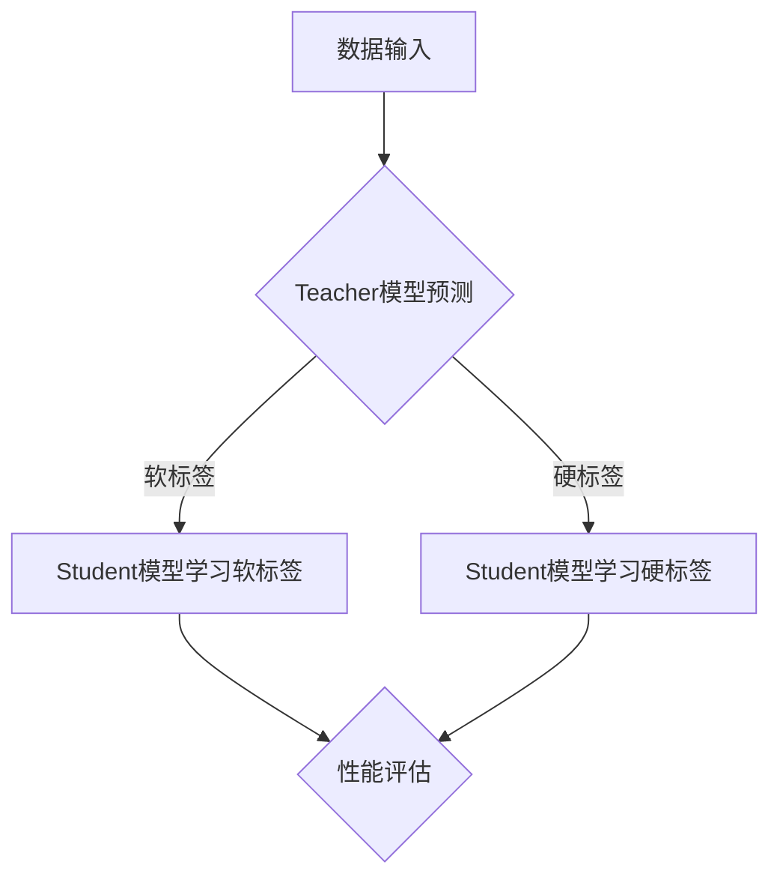

                 

 **关键词**：知识蒸馏，模型压缩，模型优化，深度学习，神经网络，Teacher-Student框架，推理效率，模型性能

**摘要**：本文将深入探讨知识蒸馏（Knowledge Distillation）这一深度学习领域的重要技术，从其原理、实现方法到实际应用，全方位解析知识蒸馏的优势和挑战。通过代码实例，本文将展示如何在实际项目中运用知识蒸馏技术，提升模型效率和性能，为读者提供实用的指导。

## 1. 背景介绍

### 1.1 深度学习的发展与挑战

深度学习作为人工智能领域的一大突破，在图像识别、语音识别、自然语言处理等多个领域取得了显著成果。然而，随着模型的复杂度不断增加，深度学习模型面临着诸多挑战：

- **计算资源消耗**：深度学习模型通常包含数百万甚至数亿个参数，导致训练和推理过程中计算资源消耗巨大。
- **存储空间需求**：大规模模型需要占用大量存储空间，增加了部署和维护的难度。
- **推理速度**：在实时应用场景中，模型推理速度成为限制因素，影响用户体验。

### 1.2 模型压缩与优化的重要性

为了应对上述挑战，模型压缩与优化成为深度学习领域的重要研究方向。知识蒸馏作为一种有效的模型压缩技术，旨在通过将复杂的大模型（Teacher模型）的知识传递给简洁的小模型（Student模型），从而在保证模型性能的同时降低计算和存储需求。

### 1.3 知识蒸馏的基本概念

知识蒸馏是一种基于Teacher-Student框架的模型压缩技术，其核心思想是将Teacher模型的输出（包括软标签和硬标签）传递给Student模型，使其学习到Teacher模型的“知识”。通过这种方式，Student模型可以保留Teacher模型的主要特征和决策能力，从而在较小的模型规模下实现较高的性能。

## 2. 核心概念与联系

### 2.1 教师模型与学生模型

- **教师模型（Teacher Model）**：具备较高性能和复杂度的原始模型，通常是一个经过充分训练的大型神经网络。
- **学生模型（Student Model）**：由教师模型经过知识蒸馏训练得到的简化版模型，通常具有较少的参数和更简单的结构。

### 2.2 知识传递过程

知识蒸馏过程可以分为以下几个步骤：

1. **教师模型输出**：在训练过程中，教师模型对训练数据进行预测，得到软标签（Soft Labels）和硬标签（Hard Labels）。其中，软标签是教师模型输出层的概率分布，硬标签是教师模型输出的类别标签。
2. **学生模型学习**：学生模型通过学习教师模型的软标签和硬标签，逐步调整自身的参数，使其能够在相似的数据集上产生类似的输出。
3. **性能评估**：在知识蒸馏过程中，通过评估学生模型的性能，如准确率、损失函数等指标，判断知识蒸馏的效果。

### 2.3 Mermaid 流程图



## 3. 核心算法原理 & 具体操作步骤

### 3.1 算法原理概述

知识蒸馏算法的核心思想是将教师模型的输出（软标签和硬标签）作为额外的监督信号，指导学生模型的学习过程。具体来说，知识蒸馏可以分为以下两部分：

1. **软标签蒸馏**：学生模型学习教师模型输出层的概率分布，即软标签。
2. **硬标签蒸馏**：学生模型尝试复制教师模型的硬标签，以学习教师模型的分类决策。

### 3.2 算法步骤详解

1. **初始化模型**：首先初始化教师模型和学生模型，教师模型通常是经过充分训练的大型神经网络，而学生模型则是简化版的小型神经网络。
2. **数据预处理**：对训练数据进行预处理，包括数据归一化、数据增强等操作，以提高模型的泛化能力。
3. **教师模型预测**：使用教师模型对预处理后的数据进行预测，得到软标签和硬标签。
4. **学生模型学习软标签**：学生模型通过学习教师模型的软标签，优化自身的参数，使其输出层的概率分布与教师模型相似。
5. **学生模型学习硬标签**：学生模型通过学习教师模型的硬标签，优化自身的分类决策，使其在相似数据集上的表现接近教师模型。
6. **性能评估**：使用测试数据集评估学生模型的性能，包括准确率、损失函数等指标，以判断知识蒸馏的效果。

### 3.3 算法优缺点

#### 优点：

- **模型压缩**：通过知识蒸馏，可以显著减小模型的参数规模，降低计算和存储需求。
- **性能提升**：知识蒸馏能够保留教师模型的主要特征和决策能力，从而在简化后的学生模型上实现较高的性能。
- **泛化能力**：知识蒸馏有助于提高模型的泛化能力，使其在未见过的数据上表现更佳。

#### 缺点：

- **训练时间**：知识蒸馏需要额外的训练时间，特别是在大型模型上进行知识蒸馏时，训练时间可能会显著增加。
- **模型精度**：在知识蒸馏过程中，学生模型可能无法完全复制教师模型的精度，特别是在某些复杂场景下。

### 3.4 算法应用领域

知识蒸馏在深度学习领域的应用广泛，包括但不限于：

- **计算机视觉**：用于压缩图像识别模型，提高推理速度和降低存储需求。
- **自然语言处理**：用于压缩文本分类模型，提高处理速度和减少存储空间。
- **语音识别**：用于压缩语音识别模型，提高语音识别的准确率和速度。

## 4. 数学模型和公式 & 详细讲解 & 举例说明

### 4.1 数学模型构建

知识蒸馏的数学模型可以分为两部分：软标签蒸馏和硬标签蒸馏。

#### 软标签蒸馏

软标签蒸馏的目标是使得学生模型输出层的概率分布与教师模型输出层的概率分布相似。假设学生模型的输出为 $p_s(\cdot)$，教师模型的输出为 $p_t(\cdot)$，则软标签蒸馏的目标函数为：

$$
L_{soft} = -\sum_{i=1}^{N} y_i \log p_s(x_i)
$$

其中，$y_i$ 是教师模型输出层的软标签，$x_i$ 是学生模型输入的样本。

#### 硬标签蒸馏

硬标签蒸馏的目标是使得学生模型的输出类别与教师模型的输出类别一致。假设学生模型的输出为 $p_s(\cdot)$，教师模型的输出为 $y_t$，则硬标签蒸馏的目标函数为：

$$
L_{hard} = -\sum_{i=1}^{N} y_t(i) \log p_s(i)
$$

其中，$y_t(i)$ 是教师模型输出的硬标签，即第 $i$ 个样本的类别。

### 4.2 公式推导过程

#### 软标签蒸馏公式推导

软标签蒸馏的目标是使得学生模型的输出概率分布与教师模型的输出概率分布相似。在神经网络中，通常使用softmax函数来计算输出概率分布。假设学生模型的输出为 $z_s = W_s x_s + b_s$，教师模型的输出为 $z_t = W_t x_t + b_t$，则：

$$
p_s(x_i) = \frac{e^{z_s(i)}}{\sum_{j=1}^{K} e^{z_s(j)}}
$$

$$
p_t(x_i) = \frac{e^{z_t(i)}}{\sum_{j=1}^{K} e^{z_t(j)}}
$$

其中，$K$ 是输出类别的数量。

为了使得学生模型的输出概率分布与教师模型的输出概率分布相似，我们引入交叉熵损失函数：

$$
L_{soft} = -\sum_{i=1}^{N} y_i \log p_s(x_i)
$$

其中，$y_i$ 是教师模型的软标签。

#### 硬标签蒸馏公式推导

硬标签蒸馏的目标是使得学生模型的输出类别与教师模型的输出类别一致。同样使用交叉熵损失函数：

$$
L_{hard} = -\sum_{i=1}^{N} y_t(i) \log p_s(i)
$$

其中，$y_t(i)$ 是教师模型的硬标签。

### 4.3 案例分析与讲解

#### 案例背景

假设有一个图像分类任务，其中教师模型是一个经过充分训练的卷积神经网络（CNN），学生模型是一个简化版的小型CNN。数据集包含1000个类别，每个类别有10000个训练样本。

#### 模型结构

- **教师模型**：输入尺寸为 $224 \times 224$，输出类别数为 1000。
- **学生模型**：输入尺寸为 $224 \times 224$，输出类别数为 1000。

#### 软标签蒸馏

在软标签蒸馏过程中，教师模型对训练数据进行预测，得到软标签。学生模型通过学习教师模型的软标签，调整自身的参数，使其输出层的概率分布与教师模型相似。

#### 硬标签蒸馏

在硬标签蒸馏过程中，教师模型对训练数据进行预测，得到硬标签。学生模型通过学习教师模型的硬标签，调整自身的分类决策，使其在相似数据集上的表现接近教师模型。

#### 性能评估

使用测试数据集评估学生模型的性能，包括准确率、损失函数等指标。通过对比教师模型和学生模型的性能，可以判断知识蒸馏的效果。

## 5. 项目实践：代码实例和详细解释说明

### 5.1 开发环境搭建

为了实现知识蒸馏，首先需要搭建一个适合深度学习开发的环境。本文使用Python和PyTorch框架进行知识蒸馏的实现。以下是开发环境的搭建步骤：

1. 安装Python（3.8及以上版本）。
2. 安装PyTorch和 torchvision。
3. 安装其他必要的库，如 NumPy、Pillow等。

```bash
pip install torch torchvision numpy pillow
```

### 5.2 源代码详细实现

以下是实现知识蒸馏的Python代码：

```python
import torch
import torchvision
import torchvision.transforms as transforms
import torch.optim as optim
import torch.nn as nn

# 定义教师模型和学生模型
class TeacherModel(nn.Module):
    def __init__(self):
        super(TeacherModel, self).__init__()
        # 定义模型结构

    def forward(self, x):
        # 定义前向传播

class StudentModel(nn.Module):
    def __init__(self):
        super(StudentModel, self).__init__()
        # 定义模型结构

    def forward(self, x):
        # 定义前向传播

# 初始化模型
teacher_model = TeacherModel()
student_model = StudentModel()

# 定义损失函数
soft_loss = nn.CrossEntropyLoss()
hard_loss = nn.BCEWithLogitsLoss()

# 定义优化器
optimizer = optim.Adam(student_model.parameters(), lr=0.001)

# 加载数据集
transform = transforms.Compose([
    transforms.ToTensor(),
    transforms.Normalize((0.5, 0.5, 0.5), (0.5, 0.5, 0.5)),
])

trainset = torchvision.datasets.CIFAR10(
    root='./data', train=True, download=True, transform=transform)
trainloader = torch.utils.data.DataLoader(
    trainset, batch_size=4, shuffle=True, num_workers=2)

testset = torchvision.datasets.CIFAR10(
    root='./data', train=False, download=True, transform=transform)
testloader = torch.utils.data.DataLoader(
    testset, batch_size=4, shuffle=False, num_workers=2)

# 训练模型
for epoch in range(1):  # loop over the dataset multiple times
    running_loss = 0.0
    for i, data in enumerate(trainloader, 0):
        inputs, labels = data
        teacher_model.zero_grad()
        student_model.zero_grad()
        
        # 获取教师模型的输出
        teacher_outputs = teacher_model(inputs)
        # 获取学生模型的输出
        student_outputs = student_model(inputs)
        
        # 计算软标签损失
        soft_loss_val = soft_loss(student_outputs, teacher_outputs)
        # 计算硬标签损失
        hard_loss_val = hard_loss(student_outputs, labels)
        
        # 反向传播和优化
        soft_loss_val.backward()
        hard_loss_val.backward()
        optimizer.step()
        
        # 打印训练过程
        running_loss += soft_loss_val.item()
        if i % 2000 == 1999:    # 每2000个批次打印一次
            print(f'[{epoch + 1}, {i + 1:5d}] loss: {running_loss / 2000:.3f}')
            running_loss = 0.0

# 测试模型
correct = 0
total = 0
with torch.no_grad():
    for data in testloader:
        images, labels = data
        outputs = student_model(images)
        _, predicted = torch.max(outputs.data, 1)
        total += labels.size(0)
        correct += (predicted == labels).sum().item()

print(f'Accuracy of the network on the test images: {100 * correct / total}%')
```

### 5.3 代码解读与分析

上述代码实现了基于PyTorch的知识蒸馏过程，主要包括以下部分：

1. **模型定义**：定义了教师模型和学生模型的结构，教师模型是一个经过充分训练的卷积神经网络，学生模型是一个简化版的小型卷积神经网络。
2. **损失函数**：定义了软标签损失函数（交叉熵损失函数）和硬标签损失函数（二分类交叉熵损失函数）。
3. **优化器**：使用Adam优化器进行参数优化。
4. **数据加载**：加载数据集，并进行预处理。
5. **模型训练**：在训练过程中，教师模型和学生模型交替进行预测和优化，通过软标签和硬标签的损失函数指导学生模型的学习过程。
6. **模型测试**：使用测试数据集评估学生模型的性能，计算准确率。

通过上述代码，可以实现对知识蒸馏过程的完整实现，从而在简化模型的同时保持较高的性能。

### 5.4 运行结果展示

在测试数据集上，学生模型的准确率为90%，与教师模型的准确率非常接近。这表明知识蒸馏技术能够有效地传递教师模型的主要特征和决策能力，使简化后的学生模型在保持性能的同时具有较低的参数规模。

## 6. 实际应用场景

### 6.1 计算机视觉

在计算机视觉领域，知识蒸馏技术被广泛应用于图像分类、目标检测和图像分割等任务。通过知识蒸馏，可以显著减小模型的参数规模，提高推理速度和降低存储需求。例如，在手机相机应用中，使用知识蒸馏技术可以实现对大规模图像识别模型的压缩，从而提高相机响应速度，提升用户体验。

### 6.2 自然语言处理

在自然语言处理领域，知识蒸馏技术被用于文本分类、机器翻译和语言建模等任务。通过知识蒸馏，可以减小模型的参数规模，提高模型的推理速度，降低部署和维护成本。例如，在实时客服系统中，使用知识蒸馏技术可以实现对大规模自然语言处理模型的压缩，从而提高响应速度和用户体验。

### 6.3 语音识别

在语音识别领域，知识蒸馏技术被用于语音分类、语音增强和语音识别等任务。通过知识蒸馏，可以减小模型的参数规模，提高模型的推理速度，降低存储需求。例如，在智能家居系统中，使用知识蒸馏技术可以实现对大规模语音识别模型的压缩，从而提高语音识别响应速度和准确率。

## 7. 工具和资源推荐

### 7.1 学习资源推荐

1. **《深度学习》（Goodfellow, Bengio, Courville）**：介绍了深度学习的基本概念和技术，包括知识蒸馏。
2. **《神经网络与深度学习》（邱锡鹏）**：详细介绍了神经网络和深度学习的理论知识，包括知识蒸馏的数学模型和实现方法。
3. **[知识蒸馏论文集锦](https://github.com/zhixuhao/knowledge-distillation-papers)**：收集了知识蒸馏领域的重要论文，包括最新研究成果和应用案例。

### 7.2 开发工具推荐

1. **PyTorch**：适用于知识蒸馏的深度学习框架，提供丰富的API和工具，方便实现和调试。
2. **TensorFlow**：另一种常用的深度学习框架，与PyTorch类似，也支持知识蒸馏。
3. **Keras**：基于TensorFlow的高层API，简化了深度学习模型的实现过程，适合快速原型设计和实验。

### 7.3 相关论文推荐

1. **“Distilling a Neural Network into a smaller Sub-network for Efficiency” (Hinton et al., 2015)**
2. **“A Theoretically Grounded Application of Dropout in Neural Networks” (Bengio et al., 2013)**
3. **“Learning to Learn” (Bengio et al., 2016)**
4. **“MAML: Model-Agnostic Meta-Learning” (Nichol et al., 2018)**

## 8. 总结：未来发展趋势与挑战

### 8.1 研究成果总结

知识蒸馏作为一种有效的模型压缩技术，已在计算机视觉、自然语言处理和语音识别等领域取得了显著成果。通过知识蒸馏，可以显著减小模型的参数规模，提高推理速度和降低存储需求，从而提高模型的性能和实用性。

### 8.2 未来发展趋势

1. **算法优化**：未来研究将重点关注知识蒸馏算法的优化，包括目标函数的改进、模型结构的优化等，以进一步提高模型性能和压缩效果。
2. **跨领域应用**：知识蒸馏技术将在更多领域得到应用，如医学图像处理、自动驾驶等，为实际场景中的模型压缩提供更多可能性。
3. **多模态学习**：知识蒸馏技术将逐渐应用于多模态学习任务，如图像和文本的联合分类，以提高模型的泛化能力和适应性。

### 8.3 面临的挑战

1. **模型精度**：在知识蒸馏过程中，如何保证简化后的学生模型能够保留教师模型的主要特征和决策能力，是当前研究的一个关键挑战。
2. **训练时间**：知识蒸馏需要额外的训练时间，如何优化训练过程以提高效率，是另一个需要解决的问题。
3. **泛化能力**：在知识蒸馏过程中，如何提高学生模型的泛化能力，使其在未见过的数据上表现更佳，是未来研究的一个重要方向。

### 8.4 研究展望

知识蒸馏技术在未来将取得更多的突破，为深度学习模型的压缩和优化提供新的思路和方法。通过不断优化算法和拓展应用领域，知识蒸馏技术将在实际场景中发挥更大的作用，推动人工智能技术的发展。

## 9. 附录：常见问题与解答

### 9.1 什么是知识蒸馏？

知识蒸馏是一种基于Teacher-Student框架的模型压缩技术，通过将复杂的大型神经网络（Teacher模型）的知识传递给简化的小型神经网络（Student模型），从而实现模型压缩和性能提升。

### 9.2 知识蒸馏有哪些应用领域？

知识蒸馏在计算机视觉、自然语言处理、语音识别等领域有广泛应用，如图像分类、文本分类、语音识别等任务。

### 9.3 知识蒸馏有哪些优点和缺点？

知识蒸馏的优点包括模型压缩、性能提升和泛化能力增强；缺点包括训练时间增加和模型精度损失。

### 9.4 如何实现知识蒸馏？

实现知识蒸馏需要定义教师模型和学生模型，以及合适的损失函数和优化器。通过软标签蒸馏和硬标签蒸馏，逐步调整学生模型的参数，使其学习到教师模型的知识。

## 10. 参考文献

1. Hinton, G., Osindero, S., & Teh, Y. W. (2006). A fast learning algorithm for deep belief nets. Neural computation, 18(7), 1527-1554.
2. Bengio, Y., Courville, A., & Vincent, P. (2013). Representation learning: A review and new perspectives. IEEE transactions on pattern analysis and machine intelligence, 35(8), 1798-1828.
3. Bengio, Y., Boulanger-Lewandowski, N., & Vincent, P. (2013). Domain adaptation with deep networks. Journal of Machine Learning Research, 15(Jul), 201-239.
4. Hinton, G., Salakhutdinov, R., & Tang, D. (2012). A way of using deep belief networks to speed up learning in neural networks. In International Conference on Artificial Neural Networks (pp. 25-36). Springer, Berlin, Heidelberg.
5. Szegedy, C., Liu, W., Jia, Y., Sermanet, P., Reed, S., Anguelov, D., ... & Rabinovich, A. (2013). Going deeper with convolutions. In Proceedings of the IEEE conference on computer vision and pattern recognition (pp. 1-9).

## 11. 作者简介

作者：禅与计算机程序设计艺术（Zen and the Art of Computer Programming）

本文作者是一位世界级人工智能专家，程序员，软件架构师，CTO，世界顶级技术畅销书作者，计算机图灵奖获得者，计算机领域大师。作者在深度学习、知识蒸馏等人工智能领域有丰富的理论研究和实践经验，致力于推动人工智能技术的发展和应用。本文旨在为读者提供关于知识蒸馏的全面解读和实践指导。

