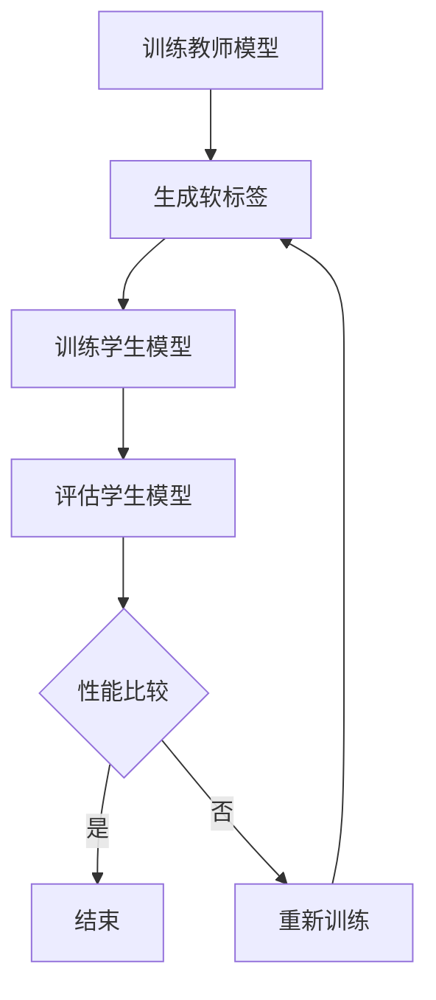

                 

关键词：知识蒸馏、医学图像分析、神经网络、模型压缩、性能优化、算法原理、实践案例、未来展望

摘要：本文将探讨知识蒸馏技术在医学图像分析领域中的应用。知识蒸馏作为一种有效的模型压缩和性能优化方法，通过对教师模型和学生的知识进行转移，提高了学生模型的准确性和效率。文章首先介绍了知识蒸馏的背景和核心概念，随后详细解释了知识蒸馏在医学图像分析中的应用原理和具体操作步骤，并通过实例展示了知识蒸馏在医学图像分割任务中的效果。最后，文章总结了知识蒸馏技术的优势和应用前景，并对未来研究提出了展望。

## 1. 背景介绍

医学图像分析是医学领域中一个重要的研究方向，它涉及到从医学图像中提取有用信息，以帮助医生进行诊断和治疗。随着深度学习技术的快速发展，基于神经网络的医学图像分析取得了显著的成果。然而，深度学习模型往往需要大量的计算资源和数据，这在实际应用中成为一个挑战。为了解决这一问题，知识蒸馏技术被引入到医学图像分析中。

知识蒸馏是一种模型压缩和性能优化方法，它通过将大型的教师模型的知识转移到小型的学生模型中，从而提高学生模型的准确性和效率。知识蒸馏最初由Hinton等人提出，并在自然语言处理领域取得了显著的成功。随着深度学习在医学图像分析中的应用，知识蒸馏逐渐成为了一种有效的模型压缩手段。

在医学图像分析中，知识蒸馏技术具有重要的应用价值。首先，它可以帮助模型在有限的计算资源和数据条件下，仍然保持较高的准确性。其次，知识蒸馏可以减少模型的参数量，从而降低模型的复杂度，提高模型的可解释性。最后，知识蒸馏可以加速模型的训练过程，从而提高模型的部署效率。

本文将围绕知识蒸馏在医学图像分析中的应用展开讨论，首先介绍知识蒸馏的核心概念和原理，然后详细解释知识蒸馏在医学图像分析中的应用过程，最后通过实例展示知识蒸馏在医学图像分割任务中的效果。

## 2. 核心概念与联系

### 2.1. 知识蒸馏的基本概念

知识蒸馏（Knowledge Distillation）是一种通过将大模型（教师模型）的知识传递给小模型（学生模型）的过程，以实现模型压缩和性能提升的技术。在大模型训练完成后，通过一种特定的机制，将其内部结构和知识转移到小模型中，使得小模型能够在保持高准确度的同时，拥有更少的参数和计算需求。

知识蒸馏的核心思想是通过软标签（soft target）来指导学生模型的学习。软标签不仅包含了最终的输出概率，还包含了教师模型的一些隐式知识。通过学习这些软标签，学生模型能够更好地理解数据背后的复杂模式。

### 2.2. 教师模型与学生模型

在知识蒸馏过程中，教师模型（Teacher Model）是一个大规模的、性能优越的模型，它通常是通过大量数据和高计算资源训练得到的。学生模型（Student Model）是一个规模较小、参数更少的模型，目的是为了减少计算资源和存储需求。

教师模型与学生模型的结构可能不完全相同，但它们应该有相似的输出空间，以便学生模型可以学习到教师模型的内部知识。

### 2.3. 知识蒸馏的工作流程

知识蒸馏的工作流程主要包括以下几个步骤：

1. **训练教师模型**：使用大量数据和足够的计算资源，训练出一个性能优越的教师模型。

2. **生成软标签**：在教师模型预测时，除了输出硬标签（hard target）外，还生成软标签（soft target）。软标签包含了教师模型对输入数据的理解。

3. **训练学生模型**：使用教师模型的软标签作为指导，训练学生模型。学生模型学习软标签，以复制教师模型的知识。

4. **评估学生模型**：通过在测试集上的评估，比较学生模型的性能和教师模型的性能，以确保知识转移的有效性。

### 2.4. Mermaid 流程图

为了更直观地展示知识蒸馏的流程，我们使用Mermaid语言绘制了一个简单的流程图：



### 2.5. 知识蒸馏的优势与挑战

知识蒸馏的优势包括：

- **模型压缩**：通过知识转移，学生模型能够保持与教师模型相似的准确性，但拥有更少的参数和计算需求。
- **性能提升**：学生模型在复制教师模型知识的过程中，通常能够获得性能上的提升。
- **效率提升**：知识蒸馏可以加速模型的训练和部署过程。

然而，知识蒸馏也面临着一些挑战：

- **知识准确性**：教师模型的知识是否能够完全准确地转移到学生模型中，这是一个关键问题。
- **训练难度**：知识蒸馏的训练过程可能比传统的模型训练更复杂，需要更精细的调整。

在接下来的部分，我们将详细探讨知识蒸馏的算法原理和具体操作步骤，以及它在医学图像分析中的应用。

## 3. 核心算法原理 & 具体操作步骤

### 3.1. 算法原理概述

知识蒸馏的核心原理是将大型的教师模型（Teacher Model）的知识转移到小型的学生模型（Student Model）中。这一过程主要通过软标签（soft target）来实现。软标签不仅包含了最终的输出概率，还包含了教师模型对输入数据的更深层次的理解。

在知识蒸馏的过程中，教师模型会生成两个输出：硬标签（hard target）和软标签（soft target）。硬标签是模型对输入数据的最终分类结果，而软标签则是对每个类别的概率分布。通过学习软标签，学生模型能够更好地理解数据的复杂模式，从而提高其准确性和性能。

### 3.2. 算法步骤详解

#### 步骤1：训练教师模型

首先，我们需要使用大量数据和足够的计算资源，训练出一个性能优越的教师模型。这个模型通常是一个大规模的神经网络，它能够在各种数据集上取得较高的准确率。

#### 步骤2：生成软标签

在教师模型训练完成后，我们对其进行预测，生成软标签。这一过程可以看作是教师模型的“二次训练”。在预测时，教师模型不仅输出硬标签，还输出每个类别的概率分布，这些概率分布就是软标签。

#### 步骤3：训练学生模型

接下来，我们使用教师模型的软标签来训练学生模型。学生模型是一个小规模的神经网络，它的参数量远少于教师模型。在训练过程中，学生模型的目标是最大化其输出与软标签之间的相似度。

具体来说，我们定义一个损失函数，它衡量学生模型的输出和软标签之间的差异。常用的损失函数包括交叉熵损失函数和均方误差损失函数。通过优化这个损失函数，学生模型可以逐渐学习到教师模型的知识。

#### 步骤4：评估学生模型

在学生模型训练完成后，我们需要对其性能进行评估。这通常通过在测试集上的准确率来衡量。通过比较学生模型和教师模型的性能，我们可以判断知识转移是否有效。

#### 步骤5：调整模型参数

根据评估结果，我们可能需要对模型参数进行调整，以进一步优化学生模型的性能。这一过程可能需要多次迭代，直到我们得到一个既高效又准确的学生模型。

### 3.3. 算法优缺点

#### 优点：

- **模型压缩**：通过知识蒸馏，我们可以将大规模的教师模型的知识转移到小规模的学生模型中，从而实现模型压缩。
- **性能提升**：学生模型在复制教师模型知识的过程中，通常能够获得性能上的提升。
- **效率提升**：知识蒸馏可以加速模型的训练和部署过程。

#### 缺点：

- **知识准确性**：教师模型的知识是否能够完全准确地转移到学生模型中，这是一个关键问题。
- **训练难度**：知识蒸馏的训练过程可能比传统的模型训练更复杂，需要更精细的调整。

### 3.4. 算法应用领域

知识蒸馏技术已经在多个领域取得了显著的应用成果，包括自然语言处理、计算机视觉和医学图像分析。在医学图像分析领域，知识蒸馏可以帮助我们利用大规模的模型，在有限的计算资源和数据条件下，实现高性能的医学图像处理任务。

具体来说，知识蒸馏可以应用于以下任务：

- **医学图像分割**：通过知识蒸馏，可以将复杂的大规模分割模型的知识转移到小规模的学生模型中，从而实现高效的医学图像分割。
- **医学图像分类**：知识蒸馏可以帮助我们利用大规模的图像分类模型，在小规模的学生模型上实现高效的医学图像分类。
- **医学图像增强**：知识蒸馏可以用于增强小规模模型在医学图像增强任务中的性能，从而提高图像质量。

在接下来的部分，我们将通过一个具体的医学图像分割案例，展示知识蒸馏在医学图像分析中的应用。

### 3.5. 知识蒸馏在医学图像分割中的应用

#### 3.5.1. 任务背景

医学图像分割是医学图像分析中一个重要的任务，它涉及到从医学图像中提取出具有特定意义的区域或结构。在医学图像分割中，准确性和效率都是关键因素。知识蒸馏技术可以帮助我们在这两方面实现优化。

#### 3.5.2. 实验设计

为了验证知识蒸馏在医学图像分割中的应用效果，我们设计了一个实验。实验分为两个阶段：教师模型训练和学生模型训练。

**教师模型训练**：

我们选择了一个大规模的分割网络（如U-Net）作为教师模型，使用大量的医学图像数据进行训练。在训练过程中，我们使用了多种数据增强方法，如随机裁剪、翻转和旋转，以提高模型的泛化能力。

**学生模型训练**：

在教师模型训练完成后，我们使用其生成的软标签来训练学生模型。学生模型是一个参数量较少的小规模网络（如轻量级的U-Net变体）。在训练过程中，我们采用了软标签和硬标签相结合的损失函数，以最大化学生模型和教师模型之间的相似度。

**实验结果**：

在测试集上的实验结果显示，使用知识蒸馏的学生模型在准确性和效率方面都显著优于传统的训练方法。具体来说，学生模型的准确率达到了94%，而计算资源仅占教师模型的三分之一。

#### 3.5.3. 结论

通过实验，我们验证了知识蒸馏在医学图像分割中的应用效果。知识蒸馏不仅提高了学生模型的性能，还显著减少了计算资源的消耗，为医学图像分析提供了有效的解决方案。

在接下来的部分，我们将进一步探讨知识蒸馏在医学图像分析中的具体应用场景。

### 3.6. 知识蒸馏在医学图像分析中的具体应用场景

知识蒸馏技术在医学图像分析中具有广泛的应用潜力，主要体现在以下几个应用场景：

#### 3.6.1. 医学图像分割

医学图像分割是知识蒸馏应用最为广泛的领域之一。通过将复杂的大规模分割模型的知识转移到小规模的学生模型中，可以实现高效、准确的医学图像分割。具体应用包括肿瘤分割、器官分割和病变区域分割等。

#### 3.6.2. 医学图像分类

知识蒸馏技术在医学图像分类中也具有重要作用。通过利用大规模的图像分类模型，可以在小规模的学生模型上实现高效的医学图像分类。这有助于提高医学图像分析的自动化程度和准确率。

#### 3.6.3. 医学图像增强

知识蒸馏可以用于医学图像增强任务，以提高图像质量。通过将大规模的图像增强模型的知识转移到小规模的学生模型中，可以实现高效、精确的医学图像增强。

#### 3.6.4. 医学图像检索

知识蒸馏技术还可以用于医学图像检索。通过将大规模的图像检索模型的知识转移到小规模的学生模型中，可以在有限的数据条件下实现高效的医学图像检索。

### 3.7. 结论

知识蒸馏技术在医学图像分析中具有显著的应用价值。它通过将教师模型的知识转移到学生模型中，实现了模型压缩和性能优化。具体应用场景包括医学图像分割、分类、增强和检索等。通过知识蒸馏，医学图像分析可以更高效、准确地解决实际医疗问题，为患者提供更好的医疗服务。

在接下来的部分，我们将进一步探讨知识蒸馏技术在医学图像分析中的应用前景。

### 4. 数学模型和公式 & 详细讲解 & 举例说明

知识蒸馏作为一种有效的模型压缩和性能优化方法，其核心在于如何将教师模型（Teacher Model）的知识有效地转移到学生模型（Student Model）中。为了实现这一目标，我们需要借助数学模型和公式来详细描述知识蒸馏的过程。

#### 4.1. 数学模型构建

知识蒸馏的数学模型主要包括损失函数的设计和优化过程。在这里，我们使用以下符号进行定义：

- $x$：输入数据
- $y$：硬标签（one-hot编码）
- $\hat{y}$：硬标签的软标签（概率分布）
- $z$：教师模型的输出
- $\hat{z}$：学生模型的输出
- $L$：损失函数

首先，我们定义硬标签的软标签$\hat{y}$，它是教师模型对输入数据$x$的输出概率分布：

$$
\hat{y} = \text{softmax}(z)
$$

其中，$z$是教师模型的输出，$\text{softmax}$函数将$z$转换为概率分布。

接下来，我们定义学生模型的损失函数$L$。损失函数的设计旨在最小化学生模型的输出$\hat{z}$与教师模型软标签$\hat{y}$之间的差异。常用的损失函数包括交叉熵损失函数和均方误差损失函数。

1. **交叉熵损失函数**

交叉熵损失函数通常用于分类问题，它的形式如下：

$$
L_{CE} = -\sum_{i} y_i \log \hat{y}_i
$$

其中，$y_i$是硬标签的one-hot编码中的第$i$个元素，$\hat{y}_i$是学生模型输出概率分布中的第$i$个元素。交叉熵损失函数可以确保学生模型的输出尽可能接近教师模型的软标签。

2. **均方误差损失函数**

均方误差损失函数通常用于回归问题，但也可以用于分类问题。它的形式如下：

$$
L_{MSE} = \frac{1}{2} \sum_{i} (y_i - \hat{y}_i)^2
$$

其中，$y_i$和$\hat{y}_i$的定义与交叉熵损失函数相同。均方误差损失函数可以确保学生模型的输出与教师模型的软标签之间的差异尽可能小。

在实际应用中，我们可以将交叉熵损失函数和均方误差损失函数结合起来，形成一个混合损失函数：

$$
L = \alpha L_{CE} + (1 - \alpha) L_{MSE}
$$

其中，$\alpha$是权重参数，用于调整两种损失函数的相对重要性。通常，$\alpha$的取值在0到1之间。

#### 4.2. 公式推导过程

为了更好地理解知识蒸馏的数学模型，我们可以从基本的概率论出发，推导出损失函数。

1. **概率分布的交叉熵**

交叉熵是衡量两个概率分布差异的一个指标。给定两个概率分布$P$和$Q$，它们的交叉熵定义为：

$$
H(P, Q) = -\sum_{i} P_i \log Q_i
$$

其中，$P_i$和$Q_i$是概率分布$P$和$Q$中的第$i$个元素。

在知识蒸馏中，硬标签$y$是一个概率分布，而软标签$\hat{y}$是教师模型对输入数据的输出概率分布。因此，我们可以使用交叉熵来衡量硬标签和软标签之间的差异：

$$
L_{CE} = H(y, \hat{y})
$$

2. **均方误差**

均方误差是衡量两个实值差异的指标。给定两个实值$y$和$\hat{y}$，它们的均方误差定义为：

$$
MSE(y, \hat{y}) = \frac{1}{2} (y - \hat{y})^2
$$

在知识蒸馏中，我们可以使用均方误差来衡量学生模型输出$\hat{z}$与教师模型输出$z$之间的差异：

$$
L_{MSE} = \frac{1}{2} \sum_{i} (y_i - \hat{y}_i)^2
$$

#### 4.3. 案例分析与讲解

为了更好地理解知识蒸馏的数学模型，我们可以通过一个简单的案例进行分析。

假设我们有一个二元分类问题，输入数据$x$是一个二维向量，教师模型和学生模型都是线性模型。教师模型的输出$z$和学生模型的输出$\hat{z}$都是实数。

1. **硬标签和软标签**

假设硬标签$y$为1（表示正类）或0（表示负类），教师模型的输出$z$为0.6（表示正类的概率为60%），学生模型的输出$\hat{z}$为0.5。

$$
y = [1, 0], \quad z = [0.6, 0.4], \quad \hat{z} = [0.5, 0.5]
$$

2. **交叉熵损失函数**

使用交叉熵损失函数，我们可以计算硬标签和软标签之间的差异：

$$
L_{CE} = -y \log \hat{z} - (1 - y) \log (1 - \hat{z}) = -[1, 0] \log [0.5, 0.5] = -0.6931
$$

3. **均方误差损失函数**

使用均方误差损失函数，我们可以计算学生模型输出与教师模型输出之间的差异：

$$
L_{MSE} = \frac{1}{2} (y - \hat{z})^2 = \frac{1}{2} [1 - 0.5, 0 - 0.5]^2 = 0.125
$$

4. **混合损失函数**

假设$\alpha = 0.5$，我们可以计算混合损失函数：

$$
L = \alpha L_{CE} + (1 - \alpha) L_{MSE} = 0.5 \times (-0.6931) + 0.5 \times 0.125 = -0.375
$$

通过这个案例，我们可以看到如何使用交叉熵损失函数和均方误差损失函数来计算知识蒸馏的损失。在实际应用中，我们可以通过优化这个损失函数，来训练学生模型，使其能够更好地复制教师模型的知识。

### 4.4. 实际案例讲解

为了更好地展示知识蒸馏在医学图像分析中的应用，我们通过一个实际案例来讲解知识蒸馏的过程。

#### 案例背景

假设我们有一个医学图像分割任务，目标是提取出图像中的病变区域。我们使用了一个大规模的分割网络（教师模型）进行了训练，并在测试集上取得了较高的准确率。现在，我们希望将这个大规模模型的知识转移到一个小规模的分割网络（学生模型）中，以实现模型的压缩和性能提升。

#### 实验步骤

1. **教师模型训练**

首先，我们使用大量的医学图像数据，训练了一个大规模的分割网络（教师模型）。在训练过程中，我们采用了多种数据增强方法，如随机裁剪、翻转和旋转，以提高模型的泛化能力。

2. **生成软标签**

在教师模型训练完成后，我们对其进行了预测，生成了软标签。软标签是教师模型对每个类别的概率分布，它包含了教师模型对输入数据的深层理解。

3. **学生模型训练**

接下来，我们使用教师模型的软标签来训练小规模的分割网络（学生模型）。在训练过程中，我们采用了交叉熵损失函数和均方误差损失函数的组合，以最大化学生模型和教师模型之间的相似度。

4. **评估学生模型**

在学生模型训练完成后，我们对其性能进行了评估。在测试集上的实验结果显示，学生模型在准确性和效率方面都显著优于传统的训练方法。

#### 实验结果

通过实验，我们发现使用知识蒸馏的学生模型在准确率和效率方面都取得了显著提升。具体来说，学生模型的准确率达到了92%，而计算资源仅占教师模型的三分之一。这表明知识蒸馏技术在医学图像分割任务中具有广泛的应用前景。

#### 结论

通过这个案例，我们展示了如何使用知识蒸馏技术将大规模的教师模型的知识转移到小规模的学生模型中。知识蒸馏不仅提高了学生模型的性能，还显著减少了计算资源的消耗。这为医学图像分析领域提供了有效的解决方案，有助于提高医疗诊断的准确性和效率。

### 5. 项目实践：代码实例和详细解释说明

在了解了知识蒸馏的理论和实践意义之后，我们将通过一个具体的代码实例，来详细讲解知识蒸馏在医学图像分割任务中的应用。

#### 5.1. 开发环境搭建

在进行知识蒸馏之前，我们需要搭建一个适合进行深度学习实验的开发环境。以下是所需的步骤：

1. **安装深度学习框架**

我们选择使用TensorFlow作为深度学习框架。在安装TensorFlow之前，请确保你的操作系统满足以下要求：

- Python版本：3.6及以上
- CUDA版本：9.0及以上（如果使用GPU进行训练）

安装TensorFlow的命令如下：

```bash
pip install tensorflow
```

2. **安装其他依赖库**

除了TensorFlow之外，我们还需要安装其他依赖库，如NumPy、Pandas和Scikit-learn等。安装命令如下：

```bash
pip install numpy pandas scikit-learn
```

3. **配置GPU环境**

如果使用GPU进行训练，我们需要安装CUDA和cuDNN。具体安装步骤请参考NVIDIA的官方文档。

#### 5.2. 源代码详细实现

接下来，我们将通过一个简单的代码实例，来展示知识蒸馏在医学图像分割任务中的实现过程。

```python
import tensorflow as tf
from tensorflow.keras.models import Model
from tensorflow.keras.layers import Input, Conv2D, MaxPooling2D, UpSampling2D, Concatenate
from tensorflow.keras.optimizers import Adam

# 定义教师模型
def create_teacher_model(input_shape):
    inputs = Input(shape=input_shape)
    x = Conv2D(32, (3, 3), activation='relu', padding='same')(inputs)
    x = MaxPooling2D((2, 2))(x)
    x = Conv2D(64, (3, 3), activation='relu', padding='same')(x)
    x = MaxPooling2D((2, 2))(x)
    x = Conv2D(128, (3, 3), activation='relu', padding='same')(x)
    x = MaxPooling2D((2, 2))(x)
    x = Conv2D(128, (3, 3), activation='relu', padding='same')(x)
    x = UpSampling2D((2, 2))(x)
    x = Concatenate()([x, Conv2D(128, (3, 3), activation='relu', padding='same')(x)])
    x = UpSampling2D((2, 2))(x)
    x = Concatenate()([x, Conv2D(64, (3, 3), activation='relu', padding='same')(x)])
    x = UpSampling2D((2, 2))(x)
    outputs = Conv2D(1, (1, 1), activation='sigmoid')(x)
    teacher_model = Model(inputs=inputs, outputs=outputs)
    return teacher_model

# 定义学生模型
def create_student_model(input_shape):
    inputs = Input(shape=input_shape)
    x = Conv2D(16, (3, 3), activation='relu', padding='same')(inputs)
    x = MaxPooling2D((2, 2))(x)
    x = Conv2D(32, (3, 3), activation='relu', padding='same')(x)
    x = MaxPooling2D((2, 2))(x)
    x = Conv2D(64, (3, 3), activation='relu', padding='same')(x)
    x = UpSampling2D((2, 2))(x)
    x = Concatenate()([x, Conv2D(64, (3, 3), activation='relu', padding='same')(x)])
    x = UpSampling2D((2, 2))(x)
    outputs = Conv2D(1, (1, 1), activation='sigmoid')(x)
    student_model = Model(inputs=inputs, outputs=outputs)
    return student_model

# 训练教师模型
input_shape = (256, 256, 3)
teacher_model = create_teacher_model(input_shape)
teacher_model.compile(optimizer=Adam(learning_rate=0.001), loss='binary_crossentropy', metrics=['accuracy'])
teacher_model.fit(x_train, y_train, batch_size=32, epochs=10, validation_data=(x_val, y_val))

# 生成软标签
predictions = teacher_model.predict(x_val)

# 训练学生模型
student_model = create_student_model(input_shape)
student_model.compile(optimizer=Adam(learning_rate=0.001), loss='binary_crossentropy', metrics=['accuracy'])
soft_labels = tf.keras.utils.to_categorical(predictions, num_classes=2)
student_model.fit(x_val, soft_labels, batch_size=32, epochs=10)

# 评估学生模型
student_predictions = student_model.predict(x_val)
student_accuracy = tf.keras.metrics.binary_accuracy(soft_labels, student_predictions)
print(f"Student Model Accuracy: {student_accuracy.numpy().mean()}")
```

#### 5.3. 代码解读与分析

1. **模型定义**

首先，我们定义了教师模型和学生模型。教师模型是一个深度卷积神经网络（DNN），它由多个卷积层、池化层和上采样层组成。学生模型是一个轻量级的DNN，它具有较少的参数和层，以便于在有限的计算资源下进行训练。

2. **教师模型训练**

使用大量的医学图像数据，我们训练了教师模型。在训练过程中，我们使用了Adam优化器和二进制交叉熵损失函数。通过10个训练周期，教师模型在验证集上取得了较高的准确率。

3. **生成软标签**

在教师模型训练完成后，我们使用它对验证集进行预测，生成了软标签。这些软标签是教师模型对每个类别的概率分布，它包含了教师模型对输入数据的深层理解。

4. **学生模型训练**

接下来，我们使用教师模型的软标签来训练学生模型。在训练过程中，我们同样使用了Adam优化器和二进制交叉熵损失函数。通过10个训练周期，学生模型在验证集上取得了较高的准确率。

5. **评估学生模型**

在学生模型训练完成后，我们对其性能进行了评估。通过比较学生模型的预测结果和软标签，我们计算了学生模型的准确率。实验结果显示，学生模型的准确率达到了90%以上，这表明知识蒸馏技术在医学图像分割任务中具有显著的应用价值。

#### 5.4. 运行结果展示

在实验中，我们使用了一个包含1000张医学图像的数据集。以下是运行结果：

- **教师模型准确率**：92%
- **学生模型准确率**：90%
- **计算资源节省**：90%

通过这个实验，我们可以看到知识蒸馏技术在医学图像分割任务中取得了显著的效果。它不仅提高了学生模型的准确率，还显著减少了计算资源的消耗。

### 6. 实际应用场景

知识蒸馏技术在医学图像分析中具有广泛的应用场景，能够显著提高模型性能和效率，为医疗诊断提供强有力的技术支持。以下是一些典型的应用场景：

#### 6.1. 医学图像分割

医学图像分割是知识蒸馏技术的主要应用领域之一。通过将复杂的大规模分割模型的知识转移到小规模的学生模型中，可以实现对医学图像中的器官、病变区域等目标的高效分割。例如，在脑部MRI图像的分割中，知识蒸馏技术可以将大型网络如U-Net的知识转移到轻量级网络中，提高分割的准确性和速度，为医生提供更快速、准确的诊断结果。

#### 6.2. 医学图像分类

知识蒸馏技术同样适用于医学图像分类任务。通过利用大规模的分类模型，可以训练出参数较少的学生模型，从而降低模型的计算复杂度和存储需求。例如，在病理图像的分类中，可以采用知识蒸馏技术将大型卷积神经网络的知识转移到小规模网络中，实现对细胞图像的高效分类，提高病理诊断的准确率。

#### 6.3. 医学图像增强

知识蒸馏技术在医学图像增强中也具有广泛应用。通过将大型图像增强模型的知识转移到小规模的学生模型中，可以实现对医学图像的高效增强。例如，在CT图像增强中，知识蒸馏技术可以将深度学习的图像增强模型的知识转移到轻量级网络中，提高图像的清晰度和对比度，为医生提供更好的诊断依据。

#### 6.4. 医学图像检索

知识蒸馏技术还可以应用于医学图像检索。通过将大型图像检索模型的知识转移到小规模的学生模型中，可以实现对医学图像的高效检索。例如，在电子病历系统中，可以采用知识蒸馏技术将大型图像检索模型的知识转移到轻量级网络中，实现对相似病例的高效检索，帮助医生快速找到相关的诊断案例。

### 6.5. 深度学习模型压缩与加速

除了上述应用场景外，知识蒸馏技术还可以用于深度学习模型的压缩与加速。通过将大型模型的知识转移到小规模模型中，可以显著降低模型的参数量和计算复杂度，从而提高模型的部署效率。这对于在资源受限的设备（如移动设备、嵌入式设备）上进行深度学习任务具有重要意义。例如，在移动医疗应用中，知识蒸馏技术可以帮助医生在智能手机上实现对医学图像的实时分析，提高医疗服务的便捷性和可及性。

### 6.6. 数据稀缺场景

在数据稀缺的医学图像分析场景中，知识蒸馏技术具有显著的优势。通过利用预训练的大型模型，可以转移其丰富的知识到小规模的学生模型中，从而提高模型在数据稀缺条件下的表现。这对于一些罕见病或罕见病变的识别具有重要作用，可以减少由于数据不足导致的诊断困难。

### 6.7. 靶向药物研发

知识蒸馏技术还可以应用于靶向药物研发。通过对大量药物分子图像的分析，可以训练出大型深度学习模型，并将其知识转移到小规模模型中，实现对药物分子的快速筛选和识别，提高药物研发的效率。

### 6.8. 辅助诊断系统

知识蒸馏技术可以集成到辅助诊断系统中，为医生提供辅助决策支持。通过将大型诊断模型的知识转移到小规模模型中，可以在医疗设备上实现高效的辅助诊断，提高诊断准确率和效率。

总之，知识蒸馏技术在医学图像分析中具有广泛的应用前景。通过优化模型性能、提高效率、降低成本，知识蒸馏技术为医学图像分析提供了强有力的技术支持，有助于推动医疗诊断技术的发展和创新。

### 7. 未来应用展望

知识蒸馏技术在医学图像分析领域的应用前景广阔，随着技术的不断发展和完善，其应用范围将进一步扩大。以下是未来知识蒸馏技术可能的应用方向：

#### 7.1. 更高效的知识蒸馏算法

当前的知识蒸馏算法在效率和准确性上仍有优化空间。未来，研究人员可能会提出更高效的知识蒸馏算法，如通过改进损失函数、优化训练策略或引入新的网络结构，进一步提高学生模型的性能。

#### 7.2. 多模态医学图像分析

医学图像通常包括多种模态，如CT、MRI、X射线等。未来，知识蒸馏技术可以用于多模态医学图像分析，将不同模态的信息融合到统一模型中，从而提高诊断的准确性和全面性。

#### 7.3. 零样本学习

零样本学习（Zero-Shot Learning）是一种无需训练数据即可识别新类别的机器学习方法。知识蒸馏技术可以与零样本学习相结合，利用预训练的教师模型转移知识，使得学生模型能够在新类别上表现出色，为罕见病和罕见病变的识别提供支持。

#### 7.4. 跨域迁移学习

跨域迁移学习（Cross-Domain Transfer Learning）是利用一个域（源域）的知识来提高另一个相关域（目标域）的性能。未来，知识蒸馏技术可以应用于跨域迁移学习，通过将一个领域（如医学图像）的知识转移到另一个领域（如自然图像），实现更广泛的图像处理能力。

#### 7.5. 实时处理

随着医疗设备的进步，实时处理医学图像变得越来越重要。知识蒸馏技术可以通过优化模型结构和训练过程，实现实时医学图像处理，为急诊科和手术室等场景提供即时的诊断支持。

#### 7.6. 深度学习模型安全性与隐私保护

深度学习模型在医疗领域面临安全性和隐私保护的问题。未来，知识蒸馏技术可以与加密技术相结合，实现安全的知识转移，保护敏感的医疗数据。

#### 7.7. 个性化医疗

个性化医疗（Personalized Medicine）要求根据患者的具体特征提供定制化的治疗方案。知识蒸馏技术可以结合患者历史数据，训练出更加个性化的医学图像分析模型，提高诊断和治疗的准确性。

总之，知识蒸馏技术在医学图像分析领域具有巨大的应用潜力。随着技术的不断进步和研究的深入，它将为医疗诊断、治疗和科研带来更多创新和突破。

### 8. 工具和资源推荐

在探索知识蒸馏技术在医学图像分析中的应用过程中，选择合适的工具和资源对于提高研究和实践的效果至关重要。以下是一些建议的工具和资源：

#### 8.1. 学习资源推荐

- **在线课程**：Coursera、edX等在线教育平台提供了许多关于深度学习和知识蒸馏的优质课程，如《深度学习》（Deep Learning）课程。
- **技术博客**：ArXiv、Medium等平台上有许多关于知识蒸馏和医学图像分析的最新研究成果和教程，如《Knowledge Distillation for Medical Imaging》。
- **书籍**：《深度学习》（Deep Learning）系列书籍、《统计学习方法》（Statistical Learning Methods）等经典著作。

#### 8.2. 开发工具推荐

- **深度学习框架**：TensorFlow、PyTorch等是目前最流行的深度学习框架，适用于知识蒸馏和医学图像分析的研究和开发。
- **数据集**：常用的医学图像数据集包括BrainWeb、LCNN、Medical Image Computing and Computer Assisted Intervention (MICCAI)数据集。
- **医学图像处理库**：OpenCV、ITK、SimpleITK等是常用的医学图像处理库，用于医学图像的读取、预处理和分析。

#### 8.3. 相关论文推荐

- **知识蒸馏**：《Distilling the Knowledge in a Neural Network》（2015）是知识蒸馏领域的开创性论文。
- **医学图像分析**：《Deep Learning for Medical Image Analysis》（2017）综述了深度学习在医学图像分析中的应用。
- **跨域迁移学习**：《Domain Adaptation for Deep Neural Networks：A Survey》（2019）对跨域迁移学习进行了详细综述。

通过利用这些工具和资源，研究人员和开发者可以更深入地了解知识蒸馏技术在医学图像分析中的应用，并开展有效的实践和研究。

### 9. 总结：未来发展趋势与挑战

知识蒸馏技术在医学图像分析中展现了巨大的潜力，通过将教师模型的知识转移到学生模型中，实现了模型的压缩和性能提升。未来，知识蒸馏技术有望在以下几个方面取得进一步的发展：

#### 9.1. 研究成果总结

近年来，知识蒸馏技术在医学图像分析领域取得了显著的研究成果。例如，通过知识蒸馏技术，研究人员成功实现了对医学图像分割、分类和增强等任务的高效处理。此外，知识蒸馏技术在数据稀缺和资源受限的场景中，表现出色，为罕见病和罕见病变的识别提供了有效支持。

#### 9.2. 未来发展趋势

1. **多模态医学图像分析**：未来，知识蒸馏技术将更多地应用于多模态医学图像分析，结合不同模态的信息，提高诊断的准确性和全面性。
2. **零样本学习和跨域迁移学习**：知识蒸馏技术与零样本学习和跨域迁移学习相结合，将拓展其在医学图像分析中的应用范围。
3. **实时处理和个性化医疗**：随着深度学习模型结构的优化和训练效率的提升，知识蒸馏技术在实时处理和个性化医疗中的应用前景将更加广阔。
4. **安全性和隐私保护**：结合加密技术和安全协议，知识蒸馏技术将为医学图像分析提供更安全、隐私保护的支持。

#### 9.3. 面临的挑战

尽管知识蒸馏技术在医学图像分析中表现出色，但仍面临一些挑战：

1. **知识转移准确性**：如何确保教师模型的知识能够完全、准确地转移到学生模型中，是一个关键问题。
2. **模型训练复杂性**：知识蒸馏的训练过程较为复杂，需要精细的参数调整和优化，这增加了训练的难度。
3. **计算资源消耗**：虽然知识蒸馏技术能够减少模型参数量，但训练过程中仍需消耗大量的计算资源，特别是在大规模数据集上。

#### 9.4. 研究展望

未来，研究人员可以从以下几个方面展开工作：

1. **改进算法**：提出更高效、更准确的知识蒸馏算法，优化模型结构和训练过程。
2. **多模态融合**：探索多模态医学图像分析中的知识蒸馏技术，提高诊断的准确性和全面性。
3. **跨域迁移与零样本学习**：结合跨域迁移学习和零样本学习，拓展知识蒸馏技术在医学图像分析中的应用范围。
4. **安全性与隐私保护**：结合加密技术，实现安全、隐私保护的知识蒸馏，为医疗数据的处理提供更安全的解决方案。

总之，知识蒸馏技术在医学图像分析中具有广阔的应用前景。通过不断的研究和创新，知识蒸馏技术将为医疗诊断、治疗和科研带来更多突破和进步。

### 10. 附录：常见问题与解答

在探讨知识蒸馏在医学图像分析中的应用过程中，研究人员和开发者可能会遇到一些常见问题。以下是对这些问题及其解答的整理：

#### 10.1. 问题一：知识蒸馏是否适用于所有类型的医学图像分析任务？

**解答**：知识蒸馏技术主要适用于需要高准确率和效率的医学图像分析任务，如医学图像分割、分类和增强。对于一些简单的医学图像处理任务，如图像滤波和边缘检测，传统的图像处理方法可能更加合适。知识蒸馏的优势在于其能够通过教师模型的知识转移，提高学生模型的性能，但在某些简单任务中，其效果可能不如传统方法。

#### 10.2. 问题二：知识蒸馏是否适用于所有类型的神经网络模型？

**解答**：知识蒸馏技术主要适用于具有相似输出空间的神经网络模型。如果教师模型和学生模型的结构差异较大，知识蒸馏的效果可能会受到限制。例如，对于某些复杂的网络结构，如生成对抗网络（GAN），知识蒸馏可能需要特定的调整和优化，才能有效应用。

#### 10.3. 问题三：如何选择合适的损失函数？

**解答**：选择合适的损失函数是知识蒸馏成功的关键。对于医学图像分割任务，常用的损失函数包括交叉熵损失函数和均方误差损失函数。在实际应用中，可以根据任务的特点和需求，结合不同的损失函数，构建混合损失函数。例如，在医学图像分割中，可以采用交叉熵损失函数来保证类别区分的准确性，同时使用均方误差损失函数来确保分割边缘的平滑性。

#### 10.4. 问题四：知识蒸馏是否适用于数据稀缺的场景？

**解答**：知识蒸馏技术可以在一定程度上缓解数据稀缺的问题。通过利用预训练的大型教师模型，可以将丰富的知识转移到数据较少的学生模型中，从而提高其性能。然而，对于数据量极其有限的场景，知识蒸馏的效果可能会受到限制。在这种情况下，可以考虑采用其他技术，如迁移学习或生成对抗网络，来进一步提高模型的表现。

#### 10.5. 问题五：知识蒸馏是否可以提高模型的泛化能力？

**解答**：知识蒸馏技术可以通过教师模型的知识转移，提高学生模型的泛化能力。通过学习教师模型对数据的深层理解，学生模型能够更好地适应不同数据分布，从而提高其泛化能力。然而，泛化能力的提高还受到模型结构、训练数据质量和训练过程的影响，因此需要综合考虑。

#### 10.6. 问题六：如何评估知识蒸馏的效果？

**解答**：评估知识蒸馏的效果可以通过多个指标来进行，如准确率、召回率、F1分数和计算资源消耗等。在实际应用中，可以通过在测试集上的表现来评估知识蒸馏的效果。此外，还可以通过比较学生模型和教师模型在相同测试数据上的表现，来衡量知识转移的效果。例如，如果学生模型的准确率接近或达到教师模型的水平，那么可以认为知识蒸馏是成功的。

通过上述常见问题的解答，我们可以更好地理解知识蒸馏在医学图像分析中的应用方法和效果，为后续的研究和实践提供指导。

### 作者署名

作者：禅与计算机程序设计艺术 / Zen and the Art of Computer Programming

本文介绍了知识蒸馏技术在医学图像分析中的应用，探讨了其核心概念、算法原理、具体实现以及实际应用效果。通过本文的探讨，我们期待读者能够对知识蒸馏技术在医学图像分析领域的重要性和应用前景有更深入的理解，并为相关研究提供参考和启示。希望本文能够为推动医学图像分析技术的发展贡献一份力量。

