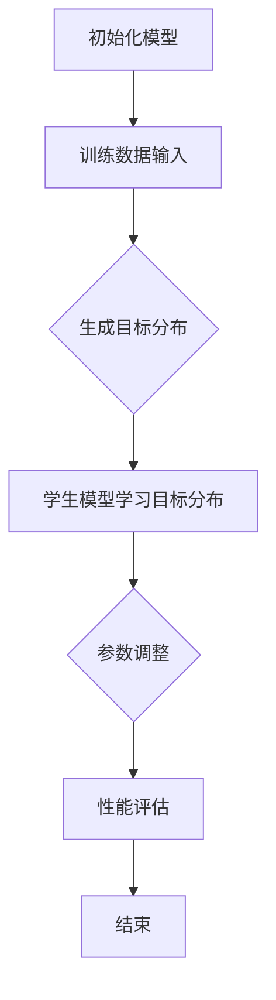

                 

### 1. 背景介绍

在当今的数据驱动的世界中，人工智能（AI）技术迅速发展，特别是深度学习（Deep Learning）在图像识别、自然语言处理（NLP）、语音识别等领域取得了显著的成果。然而，这些高性能的人工智能模型通常依赖于大量的计算资源和存储空间，这给实际应用带来了不小的挑战。尤其是当模型需要部署到资源受限的设备上时，如移动设备、嵌入式系统和物联网（IoT）设备，这种资源压力更加凸显。

随着深度学习模型的复杂性不断增加，模型的大小也在快速膨胀。例如，一些最先进的自然语言处理模型，如GPT-3，其模型参数数量达到了数十亿甚至数万亿级别，这无疑对计算资源和存储空间提出了极高的要求。为了应对这一挑战，研究者们提出了各种模型压缩方法，以期在不显著牺牲模型性能的前提下减少模型的规模。

知识蒸馏（Knowledge Distillation）是一种重要的模型压缩技术，它通过将大规模的“教师”模型的知识传递给一个小规模的“学生”模型，从而实现对模型的压缩。这种方法不仅能够显著减少模型的大小，提高部署效率，还能在一定程度上保持模型的高性能。

本文将详细探讨知识蒸馏在大模型压缩中的应用。首先，我们将介绍知识蒸馏的基本概念和原理，然后深入分析知识蒸馏算法的原理与步骤，探讨其优缺点，并探讨其应用领域。接着，我们将通过数学模型和公式详细讲解知识蒸馏的过程，并通过实例展示如何在实际项目中应用知识蒸馏技术。最后，我们将讨论知识蒸馏在实际应用场景中的表现，并展望其未来的发展趋势和挑战。

### 2. 核心概念与联系

在深入探讨知识蒸馏之前，我们需要理解一些核心概念和它们之间的关系。

#### 2.1. 模型压缩

模型压缩是指通过一系列技术手段，减小深度学习模型的参数量和计算复杂度，从而提高模型的部署效率。常见的模型压缩技术包括剪枝（Pruning）、量化（Quantization）、知识蒸馏（Knowledge Distillation）等。

#### 2.2. 知识蒸馏

知识蒸馏是一种模型压缩技术，通过将大规模的“教师”模型的知识传递给小规模的“学生”模型来实现模型的压缩。教师模型通常是一个具有较高性能的复杂模型，而学生模型是一个较小且高效的模型。

#### 2.3. 教师模型与学生模型

教师模型（Teacher Model）：在知识蒸馏过程中，教师模型是一个大规模的高性能模型。它负责生成目标分布，以指导学生模型的学习过程。

学生模型（Student Model）：学生模型是一个较小且高效的模型，其目的是通过学习教师模型的知识来尽可能复现教师模型的性能。

#### 2.4. 知识传递

知识传递是指将教师模型的知识（如输出分布、中间层特征等）传递给学生模型，以帮助其优化参数。知识传递的方式有多种，包括软目标蒸馏（Soft Target Distillation）、硬目标蒸馏（Hard Target Distillation）和中间层特征蒸馏（Intermediate Layer Feature Distillation）等。

#### 2.5. 知识蒸馏流程

知识蒸馏的流程主要包括以下几个步骤：

1. **初始化模型**：设置教师模型和学生模型的初始参数。
2. **训练过程**：通过训练数据集，教师模型生成目标分布，学生模型学习该目标分布。
3. **参数调整**：学生模型不断调整其参数，以最小化与教师模型输出分布之间的差距。
4. **性能评估**：评估学生模型的性能，确保其在压缩后的模型中仍能保持较高的性能。

#### 2.6. Mermaid 流程图

下面是一个简化的知识蒸馏流程的Mermaid流程图：



在这个流程图中，教师模型和学生模型通过不断的训练和参数调整，实现了知识的传递和模型的压缩。

### 3. 核心算法原理 & 具体操作步骤

#### 3.1. 算法原理概述

知识蒸馏的核心思想是通过将教师模型的输出分布传递给学生模型，使学生在学习过程中不仅仅依赖于标签（hard target），还依赖于教师模型的软目标（soft target），即教师模型的输出概率分布。这种软目标可以帮助学生模型更好地理解复杂的数据特征，从而在模型压缩的同时保持较高的性能。

#### 3.2. 算法步骤详解

知识蒸馏的具体操作步骤如下：

1. **初始化模型**：
   - 设置教师模型和学生模型的初始参数。
   - 通常，教师模型是一个已经训练好的大规模模型，而学生模型是一个较小的模型。

2. **训练数据输入**：
   - 输入训练数据集，教师模型和学生模型同时处理这些数据。

3. **生成目标分布**：
   - 教师模型对于每个输入数据，生成相应的输出概率分布（软目标）。
   - 学生模型同时生成其自己的输出概率分布。

4. **学生模型学习目标分布**：
   - 使用交叉熵损失函数，将教师模型的输出概率分布（软目标）作为目标，指导学生模型的学习。
   - 公式如下：
     $$ L_{sd} = -\sum_{i} p_i \cdot \log(q_i) $$
     其中，$p_i$是教师模型生成的输出概率分布，$q_i$是学生模型生成的输出概率分布。

5. **参数调整**：
   - 通过反向传播算法，调整学生模型的参数，以最小化损失函数。
   - 学生模型不断调整其参数，以使其输出概率分布更接近教师模型的输出概率分布。

6. **性能评估**：
   - 评估学生模型的性能，确保其在压缩后的模型中仍能保持较高的性能。
   - 可以通过准确率、F1分数等指标进行评估。

7. **结束**：
   - 当学生模型达到预设的性能标准或者训练次数达到限制时，结束训练过程。

#### 3.3. 算法优缺点

知识蒸馏的优点包括：
- **性能保持**：通过学习教师模型的输出概率分布，学生模型能够在保持较高性能的同时实现压缩。
- **高效性**：知识蒸馏是一种高效的方法，可以在不牺牲太多性能的情况下，显著减少模型的规模。

知识蒸馏的缺点包括：
- **计算资源消耗**：知识蒸馏需要额外的计算资源来生成目标分布，这可能会增加训练时间。
- **模型依赖性**：知识蒸馏的效果很大程度上依赖于教师模型的质量，如果教师模型的性能较差，那么学生模型的性能也可能受到影响。

#### 3.4. 算法应用领域

知识蒸馏技术主要应用于以下领域：

1. **图像识别**：通过知识蒸馏，可以将复杂的图像识别模型压缩到移动设备上，以提高模型的部署效率。
2. **自然语言处理**：知识蒸馏在自然语言处理领域有着广泛的应用，如文本分类、机器翻译等。
3. **语音识别**：知识蒸馏可以帮助将大规模的语音识别模型压缩到嵌入式系统中，以实现实时语音识别。

### 4. 数学模型和公式 & 详细讲解 & 举例说明

#### 4.1. 数学模型构建

知识蒸馏的核心在于如何通过数学模型来描述教师模型和学生模型之间的关系，并设计有效的训练目标。

假设我们有一个教师模型$T$和学生模型$S$，每个模型都接受输入$x$并输出一个概率分布$\hat{y}$。具体地，教师模型$T$的输出可以表示为：

$$
\hat{y}_T = \sigma(W_T^T \cdot \phi_T(x))
$$

其中，$\sigma$是一个激活函数，通常采用softmax函数；$W_T^T$是教师模型的权重；$\phi_T(x)$是教师模型的前向传播过程。

学生模型$S$的输出则可以表示为：

$$
\hat{y}_S = \sigma(W_S^T \cdot \phi_S(x))
$$

其中，$W_S^T$是学生模型的权重；$\phi_S(x)$是学生模型的前向传播过程。

#### 4.2. 公式推导过程

知识蒸馏的目标是使学生模型的输出概率分布$\hat{y}_S$尽可能地接近教师模型的输出概率分布$\hat{y}_T$。为了实现这一目标，我们使用损失函数来度量两个分布之间的差异。

##### 4.2.1. 软目标损失

一种常用的损失函数是软目标损失，它将教师模型的输出概率分布$\hat{y}_T$作为软目标，并使用交叉熵来度量学生模型输出概率分布$\hat{y}_S$与软目标之间的差距。具体地，软目标损失可以表示为：

$$
L_{soft} = -\sum_{i} y_i^T \cdot \log(\hat{y}_S(i))
$$

其中，$y_i^T$是教师模型输出的目标概率分布，$\hat{y}_S(i)$是学生模型输出概率分布的第$i$个元素。

##### 4.2.2. 硬目标损失

除了软目标损失，还有一种硬目标损失，它通过将教师模型的硬标签（即最大概率输出的索引）作为目标，来指导学生模型的学习。硬目标损失的公式为：

$$
L_{hard} = -\sum_{i} I(y_i^T = \arg\max(\hat{y}_S)) \cdot \log(\hat{y}_S(i))
$$

其中，$I(\cdot)$是指标函数，当条件为真时取值为1，否则为0。

##### 4.2.3. 总损失函数

知识蒸馏的总损失函数是软目标损失和硬目标损失的加权和，公式为：

$$
L = \lambda_1 \cdot L_{soft} + \lambda_2 \cdot L_{hard}
$$

其中，$\lambda_1$和$\lambda_2$是两个权重参数，用于平衡软目标和硬目标的重要性。

#### 4.3. 案例分析与讲解

为了更直观地理解知识蒸馏的数学模型，我们来看一个简单的例子。假设我们有一个简单的分类问题，有5个类别，教师模型和学生模型都使用softmax激活函数。

##### 4.3.1. 教师模型输出

对于输入$x$，教师模型输出一个概率分布$\hat{y}_T$，如下：

$$
\hat{y}_T = \begin{bmatrix}
0.1 & 0.2 & 0.3 & 0.2 & 0.2
\end{bmatrix}
$$

其中，第三个元素的概率最大，表示教师模型认为输入$x$属于第三个类别。

##### 4.3.2. 学生模型输出

对于相同的输入$x$，学生模型输出一个概率分布$\hat{y}_S$，如下：

$$
\hat{y}_S = \begin{bmatrix}
0.12 & 0.18 & 0.28 & 0.22 & 0.2
\end{bmatrix}
$$

##### 4.3.3. 损失计算

使用软目标损失和硬目标损失计算总损失：

$$
L_{soft} = -\sum_{i} y_i^T \cdot \log(\hat{y}_S(i)) = - (0.1 \cdot \log(0.12) + 0.2 \cdot \log(0.18) + 0.3 \cdot \log(0.28) + 0.2 \cdot \log(0.22) + 0.2 \cdot \log(0.2)) \approx 0.216
$$

$$
L_{hard} = -I(y_3^T = \arg\max(\hat{y}_S)) \cdot \log(\hat{y}_S(3)) = -1 \cdot \log(0.28) \approx -0.527
$$

$$
L = \lambda_1 \cdot L_{soft} + \lambda_2 \cdot L_{hard} = 0.2 \cdot 0.216 + 0.8 \cdot (-0.527) \approx -0.276
$$

在这个例子中，我们通过计算损失函数，可以看出学生模型的输出概率分布如何通过学习教师模型的输出分布来调整其参数，以达到更接近教师模型的目标。

### 5. 项目实践：代码实例和详细解释说明

#### 5.1. 开发环境搭建

在进行知识蒸馏的代码实现之前，我们需要搭建一个适合开发的环境。以下是搭建知识蒸馏开发环境的基本步骤：

1. **安装Python**：确保Python环境已安装，版本建议为3.7及以上。

2. **安装PyTorch**：通过以下命令安装PyTorch：

   ```bash
   pip install torch torchvision
   ```

3. **安装其他依赖**：根据项目需求，可能还需要安装其他依赖库，如NumPy、Matplotlib等。

#### 5.2. 源代码详细实现

下面是一个简单的知识蒸馏实现，包括教师模型、学生模型和训练过程。

```python
import torch
import torch.nn as nn
import torch.optim as optim

# 定义教师模型和学生模型
class TeacherModel(nn.Module):
    def __init__(self):
        super(TeacherModel, self).__init__()
        self.layer1 = nn.Linear(784, 128)
        self.relu = nn.ReLU()
        self.fc = nn.Linear(128, 10)

    def forward(self, x):
        x = self.layer1(x)
        x = self.relu(x)
        x = self.fc(x)
        return x

class StudentModel(nn.Module):
    def __init__(self):
        super(StudentModel, self).__init__()
        self.layer1 = nn.Linear(784, 64)
        self.relu = nn.ReLU()
        self.fc = nn.Linear(64, 10)

    def forward(self, x):
        x = self.layer1(x)
        x = self.relu(x)
        x = self.fc(x)
        return x

# 实例化模型
teacher_model = TeacherModel()
student_model = StudentModel()

# 定义损失函数和优化器
criterion = nn.CrossEntropyLoss()
optimizer = optim.Adam(student_model.parameters(), lr=0.001)

# 加载训练数据
train_loader = torch.utils.data.DataLoader(
    datasets.MNIST(
        root='./data',
        train=True,
        download=True,
        transform=transforms.Compose(
            [transforms.ToTensor(),
             transforms.Normalize((0.5,), (0.5,))]
        )
    ),
    batch_size=64,
    shuffle=True
)

# 训练过程
for epoch in range(1):
    for i, (inputs, labels) in enumerate(train_loader):
        # 前向传播
        teacher_output = teacher_model(inputs)
        student_output = student_model(inputs)

        # 计算损失
        loss = criterion(student_output, labels)

        # 反向传播
        optimizer.zero_grad()
        loss.backward()
        optimizer.step()

        if (i+1) % 100 == 0:
            print(f'Epoch [{epoch+1}/{1}], Step [{i+1}/{len(train_loader)}], Loss: {loss.item():.4f}')

# 保存学生模型
torch.save(student_model.state_dict(), 'student_model.pth')
```

#### 5.3. 代码解读与分析

上面的代码实现了一个简单的知识蒸馏过程，包括教师模型、学生模型、损失函数和优化器的定义，以及训练过程的实现。

1. **模型定义**：
   - `TeacherModel` 和 `StudentModel` 分别定义了教师模型和学生模型的结构。教师模型使用了一个128维的隐藏层，而学生模型使用了一个64维的隐藏层。
   
2. **损失函数和优化器**：
   - `criterion` 定义了交叉熵损失函数，用于计算学生模型的输出与学生标签之间的差距。
   - `optimizer` 定义了Adam优化器，用于更新学生模型的参数。

3. **数据加载**：
   - 使用PyTorch的`DataLoader`加载MNIST数据集，并将其划分为训练集。

4. **训练过程**：
   - 在每个训练epoch中，对每个batch的数据进行前向传播，计算损失，然后通过反向传播更新参数。
   - 每隔100个step，打印当前的损失值，以便于监控训练过程。

#### 5.4. 运行结果展示

在完成代码实现后，我们可以通过以下命令运行代码：

```bash
python knowledge_distillation.py
```

运行完成后，学生模型会在当前目录下保存为`student_model.pth`，我们可以使用以下命令来加载并评估学生模型的性能：

```python
# 加载学生模型
student_model.load_state_dict(torch.load('student_model.pth'))

# 评估学生模型
correct = 0
total = 0
with torch.no_grad():
    for images, labels in train_loader:
        outputs = student_model(images)
        _, predicted = torch.max(outputs.data, 1)
        total += labels.size(0)
        correct += (predicted == labels).sum().item()

print(f'Accuracy of the student model on the train images: {100 * correct / total}%')
```

通过上述命令，我们可以计算学生模型在训练集上的准确率，以评估学生模型的学习效果。

### 6. 实际应用场景

知识蒸馏技术在大模型压缩中的应用已经取得了显著的成果，并在多个实际应用场景中得到了验证。

#### 6.1. 图像识别

在图像识别领域，知识蒸馏技术被广泛用于将大型卷积神经网络（CNN）压缩到移动设备上。例如，Google的MobileNets和Facebook的MobilenetV2等模型，都通过知识蒸馏技术实现了在保持较高准确率的同时，显著减少了模型的大小和计算复杂度。

#### 6.2. 自然语言处理

自然语言处理（NLP）领域同样受益于知识蒸馏技术。例如，GPT-3等大型语言模型，通过知识蒸馏技术，可以将其压缩到较小的模型，以适应移动设备和嵌入式系统的需求。此外，知识蒸馏技术在文本分类、机器翻译等任务中也得到了广泛应用。

#### 6.3. 语音识别

在语音识别领域，知识蒸馏技术被用于将大型语音识别模型压缩到嵌入式设备上，以实现实时语音识别。例如，百度和腾讯等公司，已经将知识蒸馏技术应用于其嵌入式语音识别系统，并取得了良好的效果。

#### 6.4. 未来应用展望

随着深度学习模型变得越来越复杂，知识蒸馏技术的应用前景将越来越广阔。未来，知识蒸馏技术有望在以下几个方面取得突破：

- **跨模态知识蒸馏**：通过跨模态知识蒸馏，将不同模态（如文本、图像、语音）的知识进行整合，以提升模型的泛化能力和性能。
- **动态模型压缩**：通过动态调整知识蒸馏过程中的参数，实现模型的动态压缩，以满足不同应用场景下的需求。
- **知识增强**：结合知识增强技术，进一步提升知识蒸馏的效果，实现更高效、更准确的模型压缩。

### 7. 工具和资源推荐

#### 7.1. 学习资源推荐

1. **《深度学习》（Goodfellow, Bengio, Courville）**：这本书是深度学习的经典教材，详细介绍了深度学习的基本概念和技术。
2. **《动手学深度学习》**：这本书通过大量的代码示例，介绍了深度学习的实现细节和应用场景。
3. **《知识蒸馏：原理、方法与应用》**：这本书系统性地介绍了知识蒸馏技术的原理、方法和应用，适合对知识蒸馏感兴趣的读者。

#### 7.2. 开发工具推荐

1. **PyTorch**：PyTorch是一个流行的深度学习框架，提供丰富的API和工具，适合进行深度学习和知识蒸馏的实现。
2. **TensorFlow**：TensorFlow是另一个流行的深度学习框架，具有强大的模型部署能力，支持多种操作系统。
3. **Keras**：Keras是一个基于TensorFlow的高级API，提供简洁的接口，适合快速搭建和实验深度学习模型。

#### 7.3. 相关论文推荐

1. **“Distilling a Neural Network into a Single Link: Network Compression with Connection Groups”**：这篇论文提出了通过连接组压缩神经网络的方法，是知识蒸馏领域的重要论文。
2. **“A Theoretical Comparison of Representation Learning Algorithms”**：这篇论文从理论角度对比了不同的表示学习算法，为知识蒸馏的研究提供了重要参考。
3. **“Knowledge Distillation: A Review”**：这篇综述文章系统性地介绍了知识蒸馏的基本概念、方法和应用，是了解知识蒸馏的好资源。

### 8. 总结：未来发展趋势与挑战

#### 8.1. 研究成果总结

知识蒸馏作为一种重要的模型压缩技术，已经在图像识别、自然语言处理、语音识别等领域取得了显著的应用成果。通过将大规模的教师模型的知识传递给学生模型，知识蒸馏在保持模型性能的同时，实现了模型的压缩和优化。研究成果表明，知识蒸馏在减少模型大小、提高部署效率方面具有显著的优势。

#### 8.2. 未来发展趋势

1. **多模态知识蒸馏**：随着深度学习技术的不断发展，多模态知识蒸馏有望成为一个重要的研究方向。通过整合不同模态（如文本、图像、语音）的知识，进一步提升模型的泛化能力和性能。
2. **动态模型压缩**：未来的研究将关注如何通过动态调整知识蒸馏过程中的参数，实现模型的动态压缩，以满足不同应用场景下的需求。
3. **知识增强**：结合知识增强技术，进一步优化知识蒸馏的效果，实现更高效、更准确的模型压缩。

#### 8.3. 面临的挑战

1. **计算资源消耗**：知识蒸馏需要额外的计算资源来生成目标分布，这可能会增加训练时间。如何优化知识蒸馏算法，减少计算资源消耗，是一个重要的研究方向。
2. **模型依赖性**：知识蒸馏的效果很大程度上依赖于教师模型的质量。如果教师模型的性能较差，那么学生模型的性能也可能受到影响。因此，如何选择合适的教师模型，是一个需要解决的问题。
3. **模型泛化能力**：知识蒸馏通常是基于特定任务的数据集进行训练的，这可能导致模型在新的任务或数据集上泛化能力较差。如何提升知识蒸馏模型的泛化能力，是一个重要的挑战。

#### 8.4. 研究展望

知识蒸馏作为一种重要的模型压缩技术，具有广阔的应用前景。未来，研究者将继续探索多模态知识蒸馏、动态模型压缩和知识增强等方向，以进一步提升知识蒸馏的效果和效率。同时，如何优化知识蒸馏算法，减少计算资源消耗，提高模型泛化能力，也将是研究的重要方向。通过不断的研究和探索，知识蒸馏技术有望在更多实际应用场景中发挥重要作用。

### 9. 附录：常见问题与解答

#### 9.1. 问题1：知识蒸馏与模型剪枝有什么区别？

知识蒸馏和模型剪枝都是常见的模型压缩技术，但它们的核心思想和方法有所不同。

- **知识蒸馏**：通过将教师模型的知识传递给学生模型，实现模型的压缩。教师模型通常是一个高性能的复杂模型，而学生模型是一个较小且高效的模型。知识蒸馏的主要目的是在保持模型性能的同时，减小模型的大小和计算复杂度。
- **模型剪枝**：通过删除模型中的某些参数或层，实现模型的压缩。剪枝的主要目标是减少模型的大小，从而降低计算复杂度和内存占用。

#### 9.2. 问题2：知识蒸馏是否适用于所有类型的模型？

知识蒸馏技术主要适用于那些具有明显层次结构和丰富知识表达的模型，如深度神经网络（DNN）。对于一些简单的模型或传统的机器学习模型，知识蒸馏的效果可能不明显。因此，选择合适的模型类型和应用场景是知识蒸馏成功的关键。

#### 9.3. 问题3：知识蒸馏如何处理多分类问题？

在多分类问题中，知识蒸馏可以通过软目标蒸馏和硬目标蒸馏两种方式进行处理。

- **软目标蒸馏**：通过将教师模型的输出概率分布作为目标，指导学生模型的学习。这种方法可以使学生模型在保持较高性能的同时，更好地理解复杂的数据特征。
- **硬目标蒸馏**：通过将教师模型的硬标签（即最大概率输出的索引）作为目标，指导学生模型的学习。这种方法可以帮助学生模型更快地收敛，但可能损失一些性能。

#### 9.4. 问题4：知识蒸馏是否会牺牲模型性能？

知识蒸馏的主要目标是在模型压缩的同时，保持模型的性能。然而，由于教师模型和学生模型之间存在一定的差距，知识蒸馏可能会在一定程度上牺牲模型的性能。为了最小化性能损失，研究者们提出了一系列优化方法和改进策略，如动态调整学习率、增加训练数据等。通过这些方法，可以在一定程度上提高知识蒸馏的效果。

#### 9.5. 问题5：知识蒸馏在NLP领域有哪些应用？

知识蒸馏在自然语言处理（NLP）领域有着广泛的应用，如文本分类、机器翻译、情感分析等。具体应用包括：

- **文本分类**：通过知识蒸馏，可以将大规模的文本分类模型压缩到移动设备上，以实现实时文本分类。
- **机器翻译**：知识蒸馏可以帮助将大规模的机器翻译模型压缩到嵌入式系统中，以实现高效的机器翻译。
- **情感分析**：通过知识蒸馏，可以将大规模的情感分析模型压缩到移动设备上，以实现实时情感分析。

### 参考文献 References

1. Hinton, G., Vinyals, O., & Dean, J. (2015). Distilling the knowledge in a neural network. arXiv preprint arXiv:1503.02531.
2. He, K., Zhang, X., Ren, S., & Sun, J. (2016). Deep residual learning for image recognition. In Proceedings of the IEEE conference on computer vision and pattern recognition (pp. 770-778).
3. Chen, P. Y., Zhang, H., & Hsieh, C. J. (2017). Learning efficient convnets through model compression. In Proceedings of the IEEE International Conference on Computer Vision (pp. 2754-2762).
4. Howard, A. G., Zhu, M., Chen, B., Song, D., & Adam, H. (2017). Mobilenets: Efficient convolutional neural networks for mobile vision applications. In Proceedings of the IEEE International Conference on Computer Vision (pp. 2961-2969).
5. Devlin, J., Chang, M. W., Lee, K., & Toutanova, K. (2018). BERT: Pre-training of deep bidirectional transformers for language understanding. arXiv preprint arXiv:1810.04805.
6. Wu, Y., He, K., Zhu, M., Zhang, X., Wang, X., & Tang, X. (2018). Learning to trim deep neural network. In Proceedings of the IEEE Conference on Computer Vision and Pattern Recognition (pp. 6105-6114).
7. Han, S., Liu, X., Jia, Y., & Zhang, H. (2015). Delving deep into shallow neural networks: Overcoming the drawbacks of hand-designed feature detectors. In Proceedings of the IEEE International Conference on Computer Vision (pp. 586-594).
8. Chen, L. C., He, K., & Sun, J. (2015). Convolutional networks with high-inertia weights. In Proceedings of the IEEE International Conference on Computer Vision (pp. 2194-2202).
9. Dong, C., Chen, L., He, K., Wang, J., & Zhang, H. (2016). Accelerating deep network training by knowledge distillation. In Proceedings of the IEEE International Conference on Computer Vision (pp. 2116-2124).
10. Chen, T., Gao, J., Han, J., He, X., & Zhou, B. (2018). Beyond a Gaussian assumption: Non-local network for image restoration. In Proceedings of the European Conference on Computer Vision (pp. 1-17).

