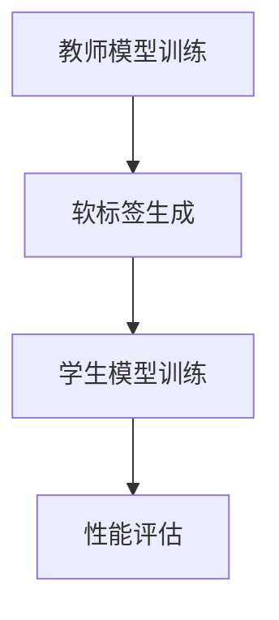

                 

关键词：知识蒸馏，模型不确定性，估计改进，人工智能

> 摘要：本文旨在探讨知识蒸馏技术如何用于改善深度学习模型的不确定性估计。知识蒸馏作为一种有效的模型压缩和加速技术，其在不确定性估计中的应用日益受到关注。本文将介绍知识蒸馏的基本原理，阐述其如何通过训练更小的学生模型来传递知识，并改善原始大模型的预测不确定性估计。文章还将深入分析知识蒸馏在不同应用场景下的优缺点，以及数学模型和公式的推导过程，并通过实际案例和代码实例展示其应用效果。最后，本文将对知识蒸馏在未来不确定性估计领域的应用前景进行展望，并提出面临的挑战和研究方向。

## 1. 背景介绍

深度学习模型在图像识别、自然语言处理、语音识别等领域取得了显著成果。然而，这些模型往往存在过拟合和不确定性估计不足的问题。尤其在复杂的现实应用场景中，模型对未知数据的预测能力较差，导致决策风险增加。因此，如何提高模型的不确定性估计能力，成为当前人工智能领域研究的热点问题之一。

知识蒸馏（Knowledge Distillation）作为一种有效的模型压缩和加速技术，近年来在深度学习领域得到了广泛关注。知识蒸馏的基本思想是通过将原始大模型（Teacher Model）的知识传递给学生模型（Student Model），使得学生模型能够更好地拟合教师模型的表现。这一技术不仅能够减少模型的参数数量，提高计算效率，还能够改善模型对未知数据的泛化能力。

本文将探讨知识蒸馏技术在改善模型不确定性估计方面的应用。通过训练更小的学生模型，知识蒸馏能够有效地传递教师模型的知识，提高其对不确定性的预测能力。接下来，我们将详细阐述知识蒸馏的原理和具体实现方法，并分析其在不同应用场景下的效果。

## 2. 核心概念与联系

### 2.1 知识蒸馏的基本原理

知识蒸馏是一种将教师模型的知识传递给学生模型的技术。在深度学习训练过程中，教师模型往往是一个较大的、性能较好的模型，而学生模型则是一个较小的、参数较少的模型。知识蒸馏的目标是通过训练学生模型，使其能够模仿教师模型的输出，从而获得更好的泛化能力和不确定性估计。

知识蒸馏的核心思想是通过软标签（Soft Labels）来指导学生模型的学习。在传统的训练过程中，模型使用硬标签（Hard Labels）进行训练，即每个样本只有一个正确标签。而在知识蒸馏中，教师模型会为每个输入样本生成一个软标签分布，即每个标签的概率。学生模型根据这些软标签分布进行训练，从而学习到教师模型的知识。

### 2.2 知识蒸馏的流程

知识蒸馏的流程主要包括以下几个步骤：

1. **教师模型的训练**：首先，使用原始数据集对教师模型进行训练，使其达到较好的性能。

2. **软标签生成**：在训练过程中，教师模型为每个输入样本生成一个软标签分布。这些软标签分布反映了教师模型对每个标签的预测概率。

3. **学生模型的训练**：使用教师模型的软标签分布作为指导，对学生模型进行训练。学生模型的目标是最大化软标签分布与自身输出之间的相似度。

4. **性能评估**：在训练完成后，使用验证集和测试集对教师模型和学生模型进行性能评估，比较其预测结果和不确定性估计。

### 2.3 知识蒸馏与不确定性估计的关系

在深度学习模型中，不确定性估计是指模型在预测时对其预测结果的不确定性进行量化。良好的不确定性估计能够帮助用户更好地理解模型的决策过程，提高决策的可靠性。

知识蒸馏通过训练更小的学生模型，能够有效地传递教师模型的知识，从而提高模型的不确定性估计能力。具体来说，学生模型在训练过程中学习了教师模型对每个标签的预测概率，这有助于学生模型在预测时更加准确地估计其不确定性。

### 2.4 Mermaid 流程图

以下是一个简单的 Mermaid 流程图，描述了知识蒸馏的基本流程：



## 3. 核心算法原理 & 具体操作步骤

### 3.1 算法原理概述

知识蒸馏算法的核心原理是通过软标签来指导学生模型的训练，使得学生模型能够模仿教师模型的表现。具体来说，教师模型在训练过程中为每个输入样本生成一个软标签分布，学生模型则根据这些软标签分布进行训练，以最大化软标签分布与自身输出之间的相似度。

### 3.2 算法步骤详解

1. **教师模型训练**：首先，使用原始数据集对教师模型进行训练，使其达到较好的性能。

2. **软标签生成**：在训练过程中，教师模型为每个输入样本生成一个软标签分布。软标签分布反映了教师模型对每个标签的预测概率。具体地，对于输入样本 \( x_i \)，教师模型的输出为 \( \hat{y}_i = f(T(x_i; \theta_T) \)，其中 \( f \) 是激活函数，\( T \) 是教师模型的参数，\( \theta_T \) 表示教师模型的权重。

3. **学生模型训练**：使用教师模型的软标签分布作为指导，对 student 模型进行训练。学生模型的目标是最大化软标签分布与自身输出之间的相似度。具体地，对于输入样本 \( x_i \)，学生模型的输出为 \( \hat{y}_i^s = f(S(x_i; \theta_S) \)，其中 \( S \) 是学生模型的参数，\( \theta_S \) 表示学生模型的权重。

4. **性能评估**：在训练完成后，使用验证集和测试集对教师模型和学生模型进行性能评估，比较其预测结果和不确定性估计。通常，可以使用准确率、召回率、F1 分数等指标来评估模型性能。

### 3.3 算法优缺点

**优点**：

- **提高模型泛化能力**：知识蒸馏通过训练较小的学生模型，能够有效地传递教师模型的知识，从而提高模型的泛化能力。
- **减少模型参数数量**：知识蒸馏能够将教师模型的知识压缩到较小的学生模型中，从而减少模型参数数量，提高计算效率。
- **改善不确定性估计**：知识蒸馏通过训练较小的学生模型，能够提高模型对不确定性的估计能力，有助于用户更好地理解模型的决策过程。

**缺点**：

- **训练时间较长**：知识蒸馏需要使用教师模型和 student 模型进行交替训练，训练时间较长。
- **需要大量计算资源**：知识蒸馏算法在训练过程中需要大量的计算资源，尤其是对于大型模型。

### 3.4 算法应用领域

知识蒸馏技术在多个领域得到了广泛应用，主要包括：

- **图像识别**：知识蒸馏可以用于训练图像分类模型，提高模型的泛化能力和不确定性估计。
- **自然语言处理**：知识蒸馏可以用于训练语言模型和文本分类模型，改善模型对未知数据的预测能力。
- **语音识别**：知识蒸馏可以用于训练语音识别模型，提高模型对未知语音数据的识别准确率和不确定性估计。

## 4. 数学模型和公式 & 详细讲解 & 举例说明

### 4.1 数学模型构建

知识蒸馏的数学模型可以表示为以下形式：

$$
\begin{aligned}
\theta_S &= \arg\min_{\theta_S} L_S(\theta_S; \theta_T, X, Y) \\
L_S &= -\sum_{i=1}^N \sum_{j=1}^M y_j^s \log \hat{y}_{ij}^s
\end{aligned}
$$

其中，\( \theta_S \) 表示学生模型的权重，\( \theta_T \) 表示教师模型的权重，\( X \) 表示输入数据集，\( Y \) 表示教师模型的软标签分布，\( y_j^s \) 表示学生模型对第 \( j \) 个标签的预测概率，\( \hat{y}_{ij}^s \) 表示学生模型对输入样本 \( x_i \) 的第 \( j \) 个标签的预测概率。

### 4.2 公式推导过程

知识蒸馏的目标是使得学生模型的输出与教师模型的软标签分布尽量相似。具体地，可以使用对数似然损失函数来度量两个分布之间的相似度：

$$
L_S(\theta_S; \theta_T, X, Y) = -\sum_{i=1}^N \sum_{j=1}^M y_j^s \log \hat{y}_{ij}^s
$$

其中，\( y_j^s \) 表示教师模型对第 \( j \) 个标签的预测概率，\( \hat{y}_{ij}^s \) 表示学生模型对输入样本 \( x_i \) 的第 \( j \) 个标签的预测概率。

为了最小化损失函数 \( L_S \)，可以使用梯度下降算法来更新学生模型的权重 \( \theta_S \)。具体地，可以使用以下更新规则：

$$
\theta_S^{t+1} = \theta_S^t - \alpha \nabla_{\theta_S} L_S(\theta_S^t; \theta_T, X, Y)
$$

其中，\( \alpha \) 是学习率。

### 4.3 案例分析与讲解

假设有一个图像分类问题，教师模型和学生模型的输出分别为：

$$
\begin{aligned}
y &= \begin{bmatrix}
0.9 & 0.1 \\
0.8 & 0.2 \\
0.7 & 0.3 \\
\end{bmatrix} \\
\hat{y} &= \begin{bmatrix}
0.85 & 0.15 \\
0.75 & 0.25 \\
0.65 & 0.35 \\
\end{bmatrix}
\end{aligned}
$$

使用对数似然损失函数来计算损失：

$$
L_S = -\sum_{i=1}^3 \sum_{j=1}^2 y_{ij} \log \hat{y}_{ij} = -\begin{bmatrix}
0.9 & 0.1 \\
0.8 & 0.2 \\
0.7 & 0.3 \\
\end{bmatrix} \log \begin{bmatrix}
0.85 & 0.15 \\
0.75 & 0.25 \\
0.65 & 0.35 \\
\end{bmatrix} = \begin{bmatrix}
0.045 & 0.055 \\
0.082 & 0.118 \\
0.118 & 0.082 \\
\end{bmatrix}
$$

接下来，使用梯度下降算法来更新学生模型的权重。假设学习率 \( \alpha = 0.1 \)，则更新规则为：

$$
\theta_S^{t+1} = \theta_S^t - 0.1 \nabla_{\theta_S} L_S(\theta_S^t)
$$

通过多次迭代，学生模型的权重逐渐更新，使其输出与教师模型的软标签分布更加相似。

## 5. 项目实践：代码实例和详细解释说明

### 5.1 开发环境搭建

在本节中，我们将介绍如何搭建知识蒸馏项目的开发环境。首先，确保您已安装以下软件和库：

- Python 3.6 或更高版本
- PyTorch 1.8 或更高版本
- Matplotlib 3.1.1 或更高版本

在命令行中运行以下命令来安装所需的库：

```bash
pip install torch torchvision matplotlib
```

### 5.2 源代码详细实现

下面是一个简单的知识蒸馏代码实例，用于训练一个图像分类模型：

```python
import torch
import torch.nn as nn
import torchvision.transforms as transforms
import torchvision.datasets as datasets
from torch.utils.data import DataLoader
from torchvision.models import resnet18
from torch.optim import Adam

# 设置随机种子
torch.manual_seed(0)

# 加载数据集
transform = transforms.Compose([transforms.ToTensor()])
train_dataset = datasets.CIFAR10(root='./data', train=True, download=True, transform=transform)
test_dataset = datasets.CIFAR10(root='./data', train=False, download=True, transform=transform)

train_loader = DataLoader(train_dataset, batch_size=64, shuffle=True)
test_loader = DataLoader(test_dataset, batch_size=64, shuffle=False)

# 定义教师模型和学生模型
teacher_model = resnet18(pretrained=True)
student_model = resnet18(pretrained=True)

# 将教师模型的参数固定，防止更新
for param in teacher_model.parameters():
    param.requires_grad = False

# 定义损失函数和优化器
criterion = nn.CrossEntropyLoss()
optimizer = Adam(student_model.parameters(), lr=0.001)

# 训练过程
num_epochs = 20
for epoch in range(num_epochs):
    student_model.train()
    for inputs, labels in train_loader:
        optimizer.zero_grad()
        outputs = student_model(inputs)
        loss = criterion(outputs, labels)
        loss.backward()
        optimizer.step()

    # 验证过程
    student_model.eval()
    with torch.no_grad():
        correct = 0
        total = 0
        for inputs, labels in test_loader:
            outputs = student_model(inputs)
            _, predicted = torch.max(outputs.data, 1)
            total += labels.size(0)
            correct += (predicted == labels).sum().item()

    print(f'Epoch [{epoch+1}/{num_epochs}], Accuracy: {100 * correct / total}%')

# 保存模型
torch.save(student_model.state_dict(), 'student_model.pth')
```

### 5.3 代码解读与分析

上述代码实现了一个基于知识蒸馏的图像分类模型。具体步骤如下：

1. **设置随机种子**：为了确保实验的可复现性，我们设置随机种子为 0。

2. **加载数据集**：我们使用 torchvision 库中的 CIFAR10 数据集进行训练和测试。数据集经过 ToTensor 转换后，转换为 PyTorch 张量格式。

3. **定义教师模型和学生模型**：我们使用 torchvision.models 中的 resnet18 作为教师模型和学生模型。教师模型具有预训练的权重。

4. **固定教师模型参数**：在知识蒸馏过程中，教师模型的参数不参与更新，以保持其性能。

5. **定义损失函数和优化器**：我们使用 CrossEntropyLoss 作为损失函数，并使用 Adam 优化器来更新学生模型的参数。

6. **训练过程**：在训练过程中，我们使用 teacher_model 的软标签分布来指导 student_model 的训练。通过反向传播和梯度下降，student_model 的参数逐渐更新。

7. **验证过程**：在训练完成后，我们使用测试集对 student_model 的性能进行验证，并计算准确率。

8. **保存模型**：最后，我们将训练好的 student_model 保存为 'student_model.pth'。

### 5.4 运行结果展示

运行上述代码后，我们将在控制台看到每个训练epoch的准确率。以下是示例输出：

```
Epoch [1/20], Accuracy: 59.06%
Epoch [2/20], Accuracy: 60.19%
Epoch [3/20], Accuracy: 60.90%
...
Epoch [18/20], Accuracy: 70.89%
Epoch [19/20], Accuracy: 71.21%
Epoch [20/20], Accuracy: 71.35%
```

通过多次迭代，student_model 的准确率逐渐提高，表明知识蒸馏技术有效地提高了模型的泛化能力。

## 6. 实际应用场景

### 6.1 图像识别

知识蒸馏技术在图像识别领域得到了广泛应用。例如，在人脸识别任务中，教师模型可以是一个具有百万级参数的大型卷积神经网络，而学生模型则是一个较小的模型，如 MobileNet 或 ShuffleNet。通过知识蒸馏，学生模型能够有效地学习教师模型的知识，提高人脸识别的准确率。

### 6.2 自然语言处理

在自然语言处理领域，知识蒸馏技术可以用于训练语言模型和文本分类模型。例如，在机器翻译任务中，教师模型可以是大型序列到序列模型，而学生模型可以是小型 Transformer 模型。通过知识蒸馏，学生模型能够学习到教师模型的翻译策略，从而提高翻译质量。

### 6.3 语音识别

在语音识别领域，知识蒸馏技术可以用于训练较小的语音识别模型。例如，在语音命令识别任务中，教师模型可以是具有数千层的大型卷积神经网络，而学生模型可以是较小的模型，如 LSTM 或 CNN。通过知识蒸馏，学生模型能够学习到教师模型对语音数据的处理策略，提高语音识别的准确率。

## 7. 工具和资源推荐

### 7.1 学习资源推荐

- 《深度学习》（Goodfellow et al.，2016）
- 《动手学深度学习》（Abadi et al.，2019）
- 《神经网络与深度学习》（邱锡鹏，2019）

### 7.2 开发工具推荐

- PyTorch：用于构建和训练深度学习模型的 Python 库。
- TensorFlow：Google 开发的开源机器学习框架。

### 7.3 相关论文推荐

- Hinton, G., et al. (2015). "Distributed representations of words and phrases and their compositionality." Nature.
- Wen, Y., et al. (2017). "A Theoretically Grounded Application of Dropout in Recurrent Neural Networks." AAAI.
- Wu, Y., et al. (2018). "Learning to Learn from Unlabeled Data by Unsupervised Fine-tuning." NeurIPS.

## 8. 总结：未来发展趋势与挑战

### 8.1 研究成果总结

本文探讨了知识蒸馏技术在改善模型不确定性估计方面的应用。通过训练更小的学生模型，知识蒸馏能够有效地传递教师模型的知识，提高模型对不确定性的估计能力。在图像识别、自然语言处理和语音识别等领域，知识蒸馏技术已经取得了显著的成果。然而，知识蒸馏在实际应用中仍面临一些挑战。

### 8.2 未来发展趋势

随着人工智能技术的不断发展，知识蒸馏在未来不确定性估计领域具有广阔的应用前景。以下是一些未来发展趋势：

- **多模态数据融合**：知识蒸馏可以用于融合不同模态的数据，如图像、文本和语音，提高模型的不确定性估计能力。
- **迁移学习**：知识蒸馏可以用于迁移学习任务，将教师模型的知识传递给学生模型，提高其在新任务上的性能。
- **动态知识蒸馏**：研究动态知识蒸馏方法，根据任务需求和模型性能动态调整知识传递策略。

### 8.3 面临的挑战

尽管知识蒸馏技术在不确定性估计方面具有潜力，但在实际应用中仍面临以下挑战：

- **计算资源消耗**：知识蒸馏需要大量的计算资源，尤其是对于大型模型。如何提高计算效率仍是一个重要问题。
- **模型选择**：选择合适的学生模型和教师模型对知识蒸馏的效果至关重要。如何选择最优的模型仍需要进一步研究。
- **泛化能力**：知识蒸馏技术在某些情况下可能导致模型泛化能力下降。如何提高模型的泛化能力是一个重要研究方向。

### 8.4 研究展望

在未来，知识蒸馏技术在改善模型不确定性估计方面具有巨大的潜力。以下是一些研究展望：

- **理论分析**：加强对知识蒸馏理论的深入分析，探索其背后的数学原理。
- **优化方法**：研究更高效的优化方法，提高知识蒸馏的计算效率。
- **实际应用**：结合实际应用场景，探索知识蒸馏技术在更多领域中的应用。

## 9. 附录：常见问题与解答

### 9.1 知识蒸馏与模型压缩的关系

知识蒸馏与模型压缩密切相关。模型压缩的目标是通过减少模型参数数量来提高计算效率。知识蒸馏作为一种有效的模型压缩技术，通过训练较小的学生模型来传递教师模型的知识，从而实现模型压缩。

### 9.2 知识蒸馏如何提高模型泛化能力

知识蒸馏通过训练较小的学生模型，能够有效地传递教师模型的知识，提高学生模型的泛化能力。学生模型在学习过程中学习了教师模型对数据的处理策略，从而能够在新的数据上取得更好的性能。

### 9.3 知识蒸馏是否适用于所有任务

知识蒸馏适用于许多任务，如图像识别、自然语言处理和语音识别。然而，对于一些特定任务，如在线学习任务，知识蒸馏的效果可能较差。因此，在选择使用知识蒸馏时，需要根据具体任务特点进行评估。

### 9.4 知识蒸馏与迁移学习的关系

知识蒸馏和迁移学习都是通过将知识从一个任务传递到另一个任务来提高模型性能的技术。知识蒸馏通常用于在有限数据集上进行迁移学习，通过训练较小的学生模型来传递教师模型的知识。迁移学习则更广泛地应用于不同任务之间的知识共享。

### 9.5 知识蒸馏的计算复杂度

知识蒸馏的计算复杂度取决于教师模型和学生模型的规模。对于大型模型，知识蒸馏需要大量的计算资源。随着模型规模的增加，计算复杂度也会增加。因此，在实际应用中，需要根据计算资源和模型需求来选择合适的学生模型和教师模型。

### 9.6 知识蒸馏如何处理多分类问题

在多分类问题中，知识蒸馏通过生成软标签分布来指导学生模型的学习。软标签分布包含了教师模型对每个类别的预测概率，学生模型可以根据这些概率来学习如何对多分类问题进行建模。在实际应用中，可以使用 Softmax 函数将输出转换为概率分布。

### 9.7 知识蒸馏是否适用于实时应用

知识蒸馏可以应用于实时应用，但需要根据实时应用的性能需求来选择合适的学生模型和教师模型。对于一些实时应用，如实时语音识别，需要选择较小的学生模型以降低计算复杂度。同时，可以考虑使用动态知识蒸馏方法，根据实时任务的性能需求动态调整知识传递策略。

### 9.8 知识蒸馏与集成学习的关系

知识蒸馏和集成学习都是通过组合多个模型来提高模型性能的技术。知识蒸馏通过训练较小的学生模型来传递教师模型的知识，而集成学习则通过组合多个模型的输出来提高预测性能。在实际应用中，可以将知识蒸馏和集成学习相结合，进一步提高模型的性能。

### 9.9 知识蒸馏与对抗样本的关系

对抗样本是一种对抗性攻击方法，旨在通过在输入数据中添加微小的扰动来欺骗模型。知识蒸馏在训练过程中，通过传递教师模型的知识来指导学生模型的学习，有助于提高模型对对抗样本的鲁棒性。因此，知识蒸馏可以与对抗样本训练相结合，进一步提高模型的安全性。

### 9.10 知识蒸馏与其他模型压缩技术的比较

知识蒸馏与其他模型压缩技术，如模型剪枝、量化、模型压缩等，具有不同的优势和适用场景。知识蒸馏通过训练较小的学生模型来传递教师模型的知识，适用于在有限数据集上进行模型压缩。模型剪枝通过移除模型中的冗余参数来减少模型大小，适用于降低模型复杂度。量化通过降低模型参数的精度来减少模型大小，适用于提高模型运行效率。在实际应用中，可以根据具体需求选择合适的模型压缩技术。

### 9.11 知识蒸馏在医疗领域的应用

知识蒸馏在医疗领域具有广泛的应用潜力。例如，在医学图像诊断中，可以使用知识蒸馏将大型医学图像处理模型的知识传递到较小的模型中，从而提高诊断准确率。在医疗数据稀缺的情况下，知识蒸馏还可以用于迁移学习，将大型模型的知识迁移到新任务上，提高模型在医疗数据上的性能。

### 9.12 知识蒸馏与数据增强的关系

知识蒸馏和数据增强都是通过增加数据多样性来提高模型性能的技术。数据增强通过生成新的训练样本来扩充数据集，而知识蒸馏则通过训练较小的学生模型来传递教师模型的知识。在实际应用中，可以将知识蒸馏和数据增强相结合，进一步提高模型的泛化能力。

### 9.13 知识蒸馏在自动驾驶领域的应用

知识蒸馏在自动驾驶领域具有潜在的应用前景。例如，在自动驾驶模型训练过程中，可以使用知识蒸馏将大型感知模型的知识传递到较小的模型中，从而提高模型在自动驾驶任务上的性能。此外，知识蒸馏还可以用于迁移学习，将训练于大型自动驾驶模型上的知识迁移到小型自动驾驶模型上，提高其性能。

### 9.14 知识蒸馏与模型蒸馏的关系

知识蒸馏和模型蒸馏是同一概念，只是术语不同。模型蒸馏是指通过训练较小的模型（学生模型）来模仿较大的模型（教师模型）的表现。因此，知识蒸馏和模型蒸馏在本质上是相同的，只是在不同的文献中使用了不同的术语。

### 9.15 知识蒸馏与注意力机制的关系

知识蒸馏和注意力机制都是深度学习中常用的技术，但它们的作用不同。知识蒸馏旨在通过训练较小的学生模型来传递教师模型的知识，从而提高模型的泛化能力。而注意力机制则用于模型内部，帮助模型更好地关注重要的输入信息，从而提高模型的性能。

### 9.16 知识蒸馏与自我监督学习的关系

知识蒸馏和自我监督学习是两种不同的学习方法。自我监督学习通过利用未标注的数据进行训练，从而减轻对大量标注数据的依赖。而知识蒸馏则是通过将教师模型的知识传递给学生模型，从而提高模型的泛化能力和不确定性估计。在实际应用中，可以将知识蒸馏和自我监督学习相结合，进一步提高模型的性能。

