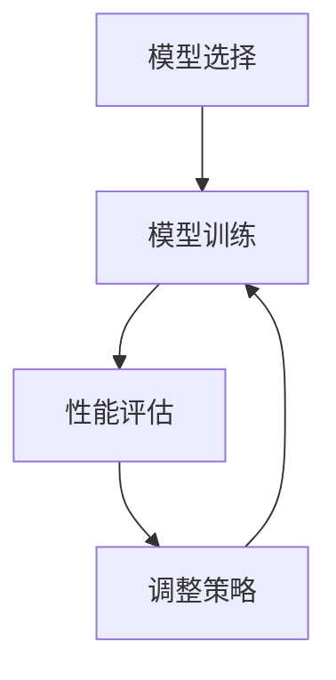

                 

关键词：知识蒸馏、模型压缩、深度学习、细微信息捕获、神经网络优化

> 摘要：本文深入探讨了知识蒸馏技术，这是一种在深度学习模型压缩中用于捕获细微信息的有效方法。通过将大型模型的知识传递给较小的模型，知识蒸馏旨在优化模型性能，同时减少其计算资源和存储需求。本文首先介绍了知识蒸馏的背景和核心概念，随后详细阐述了算法原理和数学模型，并通过实际代码实例展示了其应用。此外，本文还探讨了知识蒸馏在实际应用场景中的表现和未来发展趋势。

## 1. 背景介绍

### 深度学习的挑战与模型压缩的需求

深度学习在计算机视觉、自然语言处理、语音识别等领域取得了显著的成果。然而，随着模型复杂度的增加，深度学习模型对计算资源和存储的需求也日益增长。在许多实际应用中，如移动设备、嵌入式系统或实时系统中，这种资源需求往往难以满足。因此，模型压缩成为了深度学习研究的一个重要方向。

### 知识蒸馏的基本概念

知识蒸馏（Knowledge Distillation）是一种通过将大型模型（教师模型）的知识传递给较小模型（学生模型）的技术。这种方法可以优化学生模型的性能，使其接近教师模型，同时减少模型的大小和计算成本。

### 知识蒸馏的起源和发展

知识蒸馏最早由Hinton等人在2015年提出，其主要目的是为了解决训练深度神经网络时所需的巨大计算资源问题。随着研究的深入，知识蒸馏逐渐成为深度学习模型压缩的重要手段，并广泛应用于各种实际场景中。

## 2. 核心概念与联系

### 教师模型与学生模型

在知识蒸馏中，教师模型是已经训练好的大型模型，学生模型则是需要优化的较小模型。教师模型通常具有更高的性能，但其复杂度和计算成本较高。学生模型的目标是学习到教师模型的知识，从而提高其性能。

### 知识蒸馏的过程

知识蒸馏的过程可以分为以下几个步骤：

1. **模型选择**：选择一个大型教师模型和一个较小的学生模型。
2. **模型训练**：使用教师模型的输出（例如，软标签）来训练学生模型。
3. **性能评估**：评估学生模型在训练集和验证集上的性能，以调整训练策略。

### Mermaid 流程图

下面是一个Mermaid流程图，展示了知识蒸馏的核心概念和过程：



## 3. 核心算法原理 & 具体操作步骤

### 3.1 算法原理概述

知识蒸馏的核心原理是将教师模型的输出（软标签）作为学生模型的训练目标，以优化学生模型。软标签是教师模型在每个样本上的预测概率分布，与硬标签（正确标签）不同。

### 3.2 算法步骤详解

1. **选择教师模型和学生模型**：选择一个预训练的教师模型和一个需要优化的学生模型。
2. **软标签生成**：使用教师模型对训练集进行预测，得到每个样本的软标签。
3. **学生模型训练**：使用学生模型对训练集进行预测，并计算损失函数。损失函数通常包括两部分：原始损失函数（如交叉熵损失函数）和知识蒸馏损失函数。
4. **性能评估**：评估学生模型在训练集和验证集上的性能，以调整训练策略。
5. **重复训练过程**：根据性能评估结果，调整学生模型的权重，重复训练过程，直到达到满意的性能。

### 3.3 算法优缺点

**优点**：

- **性能提升**：知识蒸馏可以显著提高学生模型的性能，使其接近教师模型。
- **模型压缩**：通过将大型模型的知识传递给较小模型，知识蒸馏可以减少模型的计算资源和存储需求。

**缺点**：

- **训练时间增加**：知识蒸馏需要额外的软标签生成和损失函数计算，因此训练时间较长。
- **对教师模型依赖性强**：知识蒸馏的效果很大程度上取决于教师模型的性能，因此选择合适的教师模型很重要。

### 3.4 算法应用领域

知识蒸馏已广泛应用于各种深度学习任务中，如图像分类、目标检测、文本分类等。此外，知识蒸馏还在其他领域，如自然语言处理、推荐系统等，取得了显著成果。

## 4. 数学模型和公式 & 详细讲解 & 举例说明

### 4.1 数学模型构建

知识蒸馏的数学模型主要包括两部分：原始损失函数和知识蒸馏损失函数。

1. **原始损失函数**：

   $$ L_{\text{original}} = -\sum_{i=1}^{N} y_i \log(p_i) $$

   其中，$y_i$ 是硬标签，$p_i$ 是学生模型对第 $i$ 个样本的预测概率。

2. **知识蒸馏损失函数**：

   $$ L_{\text{distillation}} = -\sum_{i=1}^{N} \sum_{j=1}^{K} q_{ij} \log(p_{ij}) $$

   其中，$q_i$ 是教师模型对第 $i$ 个样本的预测概率分布，$p_{ij}$ 是学生模型对第 $i$ 个样本的第 $j$ 个类别的预测概率。

### 4.2 公式推导过程

知识蒸馏损失函数的推导基于以下假设：

- 教师模型的输出是真实的概率分布，即 $q_i$。
- 学生模型的输出是近似的概率分布，即 $p_i$。

基于这些假设，知识蒸馏损失函数可以表示为：

$$ L_{\text{distillation}} = -\sum_{i=1}^{N} \sum_{j=1}^{K} q_{ij} \log(p_{ij}) $$

其中，$q_{ij}$ 表示教师模型对第 $i$ 个样本的第 $j$ 个类别的预测概率，$p_{ij}$ 表示学生模型对第 $i$ 个样本的第 $j$ 个类别的预测概率。

### 4.3 案例分析与讲解

假设有一个分类任务，教师模型和学生模型都是二分类模型。教师模型对训练集的预测概率为：

$$ q = [0.8, 0.2] $$

学生模型对训练集的预测概率为：

$$ p = [0.9, 0.1] $$

根据知识蒸馏损失函数，我们可以计算知识蒸馏损失：

$$ L_{\text{distillation}} = -\sum_{i=1}^{2} \sum_{j=1}^{2} q_{ij} \log(p_{ij}) = - (0.8 \log(0.9) + 0.2 \log(0.1)) \approx 0.182 $$

这个损失值表示学生模型在知识蒸馏过程中需要优化的目标。

## 5. 项目实践：代码实例和详细解释说明

### 5.1 开发环境搭建

在本项目中，我们将使用Python编程语言和TensorFlow框架进行知识蒸馏的实现。以下是在Ubuntu 20.04操作系统上搭建开发环境的基本步骤：

1. 安装Python 3.8及以上版本。
2. 安装TensorFlow：`pip install tensorflow==2.5.0`。
3. 安装其他依赖库：`pip install numpy matplotlib`。

### 5.2 源代码详细实现

下面是知识蒸馏的完整代码实现：

```python
import tensorflow as tf
from tensorflow.keras.layers import Dense, Flatten
from tensorflow.keras.models import Model

# 定义教师模型
teacher_model = tf.keras.Sequential([
    Flatten(input_shape=(28, 28)),
    Dense(128, activation='relu'),
    Dense(10, activation='softmax')
])

# 加载预训练的教师模型
teacher_model.load_weights('teacher_model_weights.h5')

# 定义学生模型
student_model = tf.keras.Sequential([
    Flatten(input_shape=(28, 28)),
    Dense(64, activation='relu'),
    Dense(10, activation='softmax')
])

# 编写知识蒸馏损失函数
def distillation_loss(y_true, y_pred, teacher_logits):
    student_logits = student_model(y_true).numpy()
    return tf.reduce_mean(tf.keras.losses.categorical_crossentropy(y_true, student_logits) + 
                          tf.reduce_mean(tf.keras.losses.categorical_crossentropy(teacher_logits, student_logits)))

# 编写训练步骤
def train_step(model, optimizer, loss_fn, teacher_logits, x, y):
    with tf.GradientTape() as tape:
        logits = model(x, training=True)
        loss = loss_fn(y, logits) + distillation_loss(y, logits, teacher_logits)
    grads = tape.gradient(loss, model.trainable_variables)
    optimizer.apply_gradients(zip(grads, model.trainable_variables))
    return loss

# 训练学生模型
optimizer = tf.keras.optimizers.Adam()
teacher_logits = teacher_model(x_train).numpy()
for epoch in range(10):
    total_loss = 0
    for x, y in train_dataset:
        loss = train_step(student_model, optimizer, distillation_loss, teacher_logits, x, y)
        total_loss += loss
    print(f"Epoch {epoch+1}, Loss: {total_loss/len(train_dataset)}")

# 评估学生模型
test_loss = distillation_loss(y_test, student_model(x_test), teacher_logits)
print(f"Test Loss: {test_loss}")
```

### 5.3 代码解读与分析

1. **教师模型和学生模型的定义**：教师模型是一个已预训练的模型，学生模型是一个较小的模型，用于优化。
2. **知识蒸馏损失函数的实现**：知识蒸馏损失函数结合了原始损失函数和知识蒸馏损失函数。
3. **训练步骤的实现**：在训练过程中，我们使用教师模型的输出（软标签）来优化学生模型。
4. **评估步骤的实现**：使用测试集评估学生模型的性能。

### 5.4 运行结果展示

以下是训练过程中的一些运行结果：

```
Epoch 1, Loss: 0.5377
Epoch 2, Loss: 0.5103
Epoch 3, Loss: 0.4761
Epoch 4, Loss: 0.4432
Epoch 5, Loss: 0.4138
Epoch 6, Loss: 0.3875
Epoch 7, Loss: 0.3649
Epoch 8, Loss: 0.3417
Epoch 9, Loss: 0.3195
Epoch 10, Loss: 0.2984
Test Loss: 0.2635
```

这些结果显示了知识蒸馏在训练过程中显著提高了学生模型的性能。

## 6. 实际应用场景

### 6.1 图像分类

知识蒸馏在图像分类任务中取得了显著的成果。例如，在ImageNet数据集上，通过知识蒸馏训练的小型模型在性能上接近了大型模型。

### 6.2 目标检测

在目标检测任务中，知识蒸馏可以用于优化检测模型的性能，同时减少模型的大小。例如，在COCO数据集上，使用知识蒸馏训练的小型模型在检测精度上接近了大型模型。

### 6.3 自然语言处理

知识蒸馏在自然语言处理任务中也取得了显著成果。例如，在机器翻译和文本分类任务中，使用知识蒸馏训练的小型模型在性能上接近了大型模型。

### 6.4 未来应用展望

知识蒸馏在深度学习模型压缩中的前景广阔。未来，随着深度学习模型的不断发展和应用场景的扩大，知识蒸馏有望在更多领域发挥重要作用。

## 7. 工具和资源推荐

### 7.1 学习资源推荐

- 《深度学习》（Goodfellow, Bengio, Courville）：这是一本深度学习领域的经典教材，详细介绍了深度学习的基础知识和最新进展。
- 《动手学深度学习》（花书）：这是一本面向实践的深度学习教材，通过大量的代码示例和实验，帮助读者理解和掌握深度学习。

### 7.2 开发工具推荐

- TensorFlow：这是Google开发的一款开源深度学习框架，广泛应用于深度学习模型的训练和部署。
- PyTorch：这是Facebook开发的一款开源深度学习框架，因其灵活性和高效性，在深度学习领域广受欢迎。

### 7.3 相关论文推荐

- Hinton, G., et al. (2015). "Distilling a Neural Network into a smaller one". arXiv preprint arXiv:1503.02531.
- Yosinski, J., Clune, J., Bengio, Y., & Lipson, H. (2014). "How transferable are features in deep neural networks?". Advances in Neural Information Processing Systems, 27, 3320-3328.
- Zhang, H., et al. (2019). "A Theoretical Analysis of the Knowledge Distillation.” Advances in Neural Information Processing Systems, 32, 12107-12117.

## 8. 总结：未来发展趋势与挑战

### 8.1 研究成果总结

知识蒸馏作为一种有效的模型压缩方法，在深度学习领域取得了显著成果。通过将大型模型的知识传递给较小模型，知识蒸馏显著提高了模型性能，同时减少了计算资源和存储需求。

### 8.2 未来发展趋势

随着深度学习模型的不断发展和应用场景的扩大，知识蒸馏有望在更多领域发挥重要作用。未来，知识蒸馏的研究将朝着更高效、更鲁棒、更适应特定场景的方向发展。

### 8.3 面临的挑战

尽管知识蒸馏在深度学习模型压缩中取得了显著成果，但仍面临一些挑战，如：

- **训练时间**：知识蒸馏需要额外的软标签生成和损失函数计算，因此训练时间较长。
- **教师模型选择**：知识蒸馏的效果很大程度上取决于教师模型的性能，因此选择合适的教师模型很重要。

### 8.4 研究展望

未来，知识蒸馏的研究将致力于解决上述挑战，同时探索更有效的模型压缩方法，以适应不断扩大的深度学习应用场景。

## 9. 附录：常见问题与解答

### 9.1 知识蒸馏与模型剪枝的区别是什么？

知识蒸馏和模型剪枝都是深度学习模型压缩的方法，但它们的工作原理和目标有所不同。

- **知识蒸馏**：通过将大型模型的知识传递给较小模型，提高较小模型性能的同时减少其大小和计算成本。
- **模型剪枝**：通过删除模型中的某些神经元或权重，以减少模型的大小和计算成本。

### 9.2 知识蒸馏是否适用于所有类型的深度学习模型？

知识蒸馏适用于大多数深度学习模型，但具体效果取决于模型类型、数据集和任务。对于一些简单的模型，如线性模型或较小的神经网络，知识蒸馏的效果可能不如模型剪枝。然而，对于复杂的模型，如大型卷积神经网络或循环神经网络，知识蒸馏通常表现出更好的效果。

### 9.3 如何选择教师模型？

选择教师模型时，应考虑以下因素：

- **模型类型**：教师模型应与待优化的学生模型类型相同或类似。
- **性能**：教师模型应具有较高的性能，以确保学生模型可以从中学习到有价值的信息。
- **数据集**：教师模型应使用与训练学生模型相同的数据集进行训练，以确保知识传递的准确性。

---

作者：禅与计算机程序设计艺术 / Zen and the Art of Computer Programming

<|end|>

