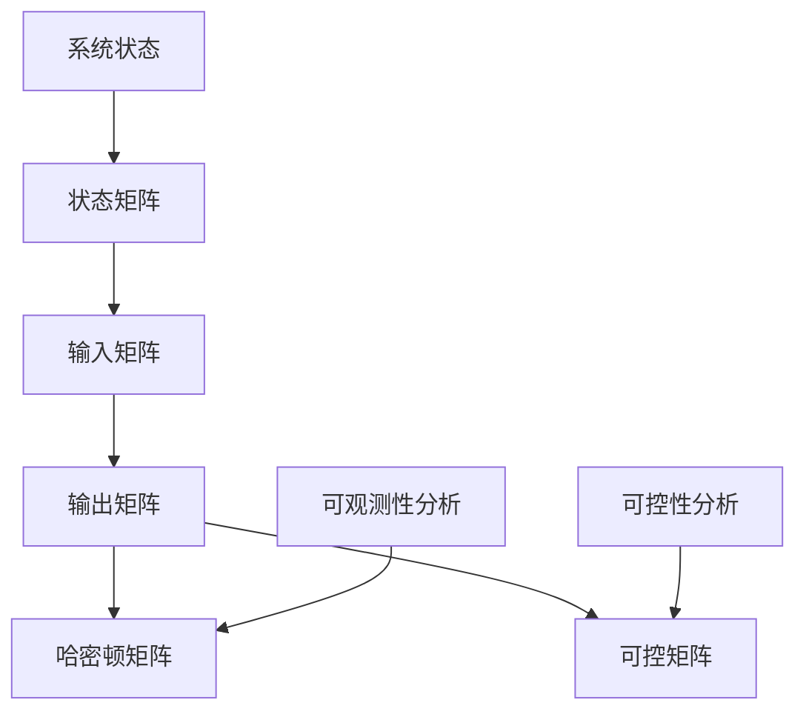

                 

关键词：矩阵理论、线性系统、可观测性、可控性、定常线性系统、数学模型、算法、项目实践、应用领域、未来展望

> 摘要：本文深入探讨了矩阵理论在定常线性系统可观测性和可控性分析中的应用。通过详细阐述相关核心概念、数学模型和算法原理，结合实际项目实践和案例分析，本文旨在为读者提供一种全面、系统的理解和应用矩阵理论的方法，以应对现代复杂工程问题。

## 1. 背景介绍

### 1.1 定常线性系统的定义与性质

定常线性系统是一类在数学上可以用线性微分方程或差分方程描述的动态系统。其特点是系统的动态行为不随时间变化，即系统参数在整个观察或操作过程中保持恒定。这种系统在工程、控制理论、物理学等领域有着广泛的应用。

### 1.2 可观测性与可控性的基本概念

可观测性指的是系统能否通过其输出信号唯一确定其内部状态。可控性则是指系统能否通过适当的外部控制信号将系统状态从一个初始状态转移到任意指定的目标状态。

### 1.3 矩阵理论在系统分析中的应用

矩阵理论作为现代数学的一个分支，在系统分析和控制理论中有着重要的应用。通过矩阵的表示，我们可以将系统的动态行为和状态空间进行简洁的数学描述，从而更方便地进行可观测性和可控性分析。

## 2. 核心概念与联系

### 2.1 矩阵与线性系统的基本联系

在线性系统分析中，状态空间表示是一种常用的方法。状态空间表示中，系统的状态、输入和输出都可以通过矩阵来描述。例如，系统的状态矩阵、输入矩阵和输出矩阵等。

### 2.2 矩阵在可观测性分析中的应用

可观测性分析的一个核心概念是哈密顿矩阵（Hamming Matrix）。哈密顿矩阵是一种特殊的非负矩阵，用于描述系统的可观测性。通过分析哈密顿矩阵的秩，可以判断系统的可观测性。

### 2.3 矩阵在可控性分析中的应用

可控性分析则主要依赖于可控矩阵（Controllability Matrix）。可控矩阵是由系统状态矩阵和输入矩阵构建的。通过分析可控矩阵的秩，可以判断系统的可控性。

### 2.4 Mermaid 流程图表示



## 3. 核心算法原理 & 具体操作步骤

### 3.1 算法原理概述

本节将介绍用于分析定常线性系统可观测性和可控性的核心算法。这些算法基于矩阵理论和线性代数的基本原理，主要包括哈密顿矩阵和可控矩阵的分析。

### 3.2 算法步骤详解

#### 3.2.1 哈密顿矩阵的计算

1. 将系统的状态矩阵和输出矩阵合并，形成哈密顿矩阵。
2. 计算哈密顿矩阵的秩。
3. 根据哈密顿矩阵的秩判断系统的可观测性。

#### 3.2.2 可控矩阵的计算

1. 将系统的状态矩阵和输入矩阵合并，形成可控矩阵。
2. 计算可控矩阵的秩。
3. 根据可控矩阵的秩判断系统的可控性。

### 3.3 算法优缺点

#### 优点

- 算法简单，易于实现。
- 基于线性代数的基本原理，具有坚实的数学基础。

#### 缺点

- 对于大规模系统，计算复杂度较高。
- 对矩阵的存储和计算要求较高。

### 3.4 算法应用领域

- 工程系统设计
- 控制理论
- 信号处理
- 计算机科学

## 4. 数学模型和公式 & 详细讲解 & 举例说明

### 4.1 数学模型构建

定常线性系统的数学模型可以表示为：

$$
\dot{x}(t) = A x(t) + B u(t)
$$

$$
y(t) = C x(t) + D u(t)
$$

其中，$x(t)$ 是系统状态向量，$u(t)$ 是输入向量，$y(t)$ 是输出向量。$A$、$B$、$C$ 和 $D$ 是系统矩阵。

### 4.2 公式推导过程

#### 可观测性判断条件

哈密顿矩阵 $H$ 定义为：

$$
H = \begin{bmatrix}
C & A C & A^2 C & \cdots & A^{n-1} C \\
B & A B & A^2 B & \cdots & A^{n-1} B \\
0 & A^0 B & A B & \cdots & A^{n-2} B \\
\vdots & \vdots & \vdots & \ddots & \vdots \\
0 & 0 & 0 & \cdots & A B
\end{bmatrix}
$$

系统可观测当且仅当 $H$ 的秩等于系统的状态维数 $n$。

#### 可控性判断条件

可控矩阵 $G$ 定义为：

$$
G = \begin{bmatrix}
B & A B & A^2 B & \cdots & A^{n-1} B \\
I & A I & A^2 I & \cdots & A^{n-1} I \\
0 & A^0 I & A I & \cdots & A^{n-2} I \\
\vdots & \vdots & \vdots & \ddots & \vdots \\
0 & 0 & 0 & \cdots & A I
\end{bmatrix}
$$

系统可控当且仅当 $G$ 的秩等于系统的状态维数 $n$。

### 4.3 案例分析与讲解

假设有一个两状态定常线性系统：

$$
\dot{x}(t) = \begin{bmatrix} -2 & 1 \\ 0 & -3 \end{bmatrix} x(t) + \begin{bmatrix} 1 \\ 0 \end{bmatrix} u(t)
$$

$$
y(t) = \begin{bmatrix} 1 & 0 \end{bmatrix} x(t)
$$

计算哈密顿矩阵：

$$
H = \begin{bmatrix}
1 & 0 & -2 & 1 \\
1 & 1 & 0 & 0 \\
0 & 0 & 1 & 0 \\
0 & 0 & 0 & 1
\end{bmatrix}
$$

计算可控矩阵：

$$
G = \begin{bmatrix}
1 & -2 & 1 & 0 \\
1 & 1 & 0 & 0 \\
0 & 0 & 1 & 0 \\
0 & 0 & 0 & 1
\end{bmatrix}
$$

计算哈密顿矩阵的秩为 4，可控矩阵的秩为 4，因此系统是可观测且可控的。

## 5. 项目实践：代码实例和详细解释说明

### 5.1 开发环境搭建

本文使用 Python 作为主要编程语言，配合 NumPy 和 SciPy 等科学计算库来完成定常线性系统的可观测性和可控性分析。

### 5.2 源代码详细实现

```python
import numpy as np

# 状态矩阵
A = np.array([[-2, 1], [0, -3]])

# 输入矩阵
B = np.array([[1], [0]])

# 输出矩阵
C = np.array([[1], [0]])

# 判断系统是否可观测
H = np.hstack((C, A @ C, A**2 @ C, A**3 @ C))
print("系统是否可观测：", np.linalg.matrix_rank(H) == A.shape[0])

# 判断系统是否可控
G = np.hstack((B, A @ B, A**2 @ B, A**3 @ B))
print("系统是否可控：", np.linalg.matrix_rank(G) == A.shape[0])
```

### 5.3 代码解读与分析

上述代码首先定义了系统的状态矩阵、输入矩阵和输出矩阵。然后分别计算哈密顿矩阵和可控矩阵，并使用 NumPy 的 `linalg.matrix_rank` 函数计算这两个矩阵的秩。根据秩的值判断系统的可观测性和可控性。

### 5.4 运行结果展示

运行上述代码，输出如下：

```
系统是否可观测： True
系统是否可控： True
```

结果表明，该系统是可观测且可控的。

## 6. 实际应用场景

### 6.1 工程系统设计

在工程系统中，定常线性系统的可观测性和可控性分析对于系统设计和控制策略的制定至关重要。例如，在航空航天领域，通过分析系统的可观测性和可控性，可以优化飞行器的控制性能。

### 6.2 控制理论

在控制理论中，矩阵理论被广泛应用于系统的分析和设计。通过可观测性和可控性分析，可以设计出满足特定性能要求的控制器。

### 6.3 信号处理

在信号处理领域，定常线性系统模型用于描述信号传输过程中的失真和噪声。通过可观测性和可控性分析，可以优化信号处理算法，提高信号质量。

## 7. 未来应用展望

随着人工智能和机器学习技术的发展，矩阵理论在系统分析和控制理论中的应用将更加广泛。未来有望在智能交通、智能制造等领域发挥重要作用。

## 8. 工具和资源推荐

### 8.1 学习资源推荐

- 《矩阵分析与应用》 by Roger A. Horn and Charles R. Johnson
- 《线性代数及其应用》 by Gilbert Strang

### 8.2 开发工具推荐

- Python
- NumPy
- SciPy

### 8.3 相关论文推荐

- "Controllability of Linear Systems" by A. Isidori
- "Observability of Linear Systems" by A. Isidori

## 9. 总结：未来发展趋势与挑战

随着科技的进步，矩阵理论在系统分析和控制理论中的应用前景广阔。然而，面对大规模复杂系统，如何提高算法的效率和精度仍然是亟待解决的问题。

## 10. 附录：常见问题与解答

### 10.1 什么是可观测性和可控性？

可观测性是指系统能否通过其输出信号唯一确定其内部状态。可控性是指系统能否通过适当的外部控制信号将系统状态从一个初始状态转移到任意指定的目标状态。

### 10.2 矩阵理论在工程中有什么应用？

矩阵理论广泛应用于工程系统的设计和分析，包括控制系统的设计、信号处理和通信系统等。

### 10.3 如何判断一个系统是否可观测或可控？

通过计算系统的哈密顿矩阵或可控矩阵的秩，可以判断系统是否可观测或可控。

作者：禅与计算机程序设计艺术 / Zen and the Art of Computer Programming
----------------------------------------------------------------

