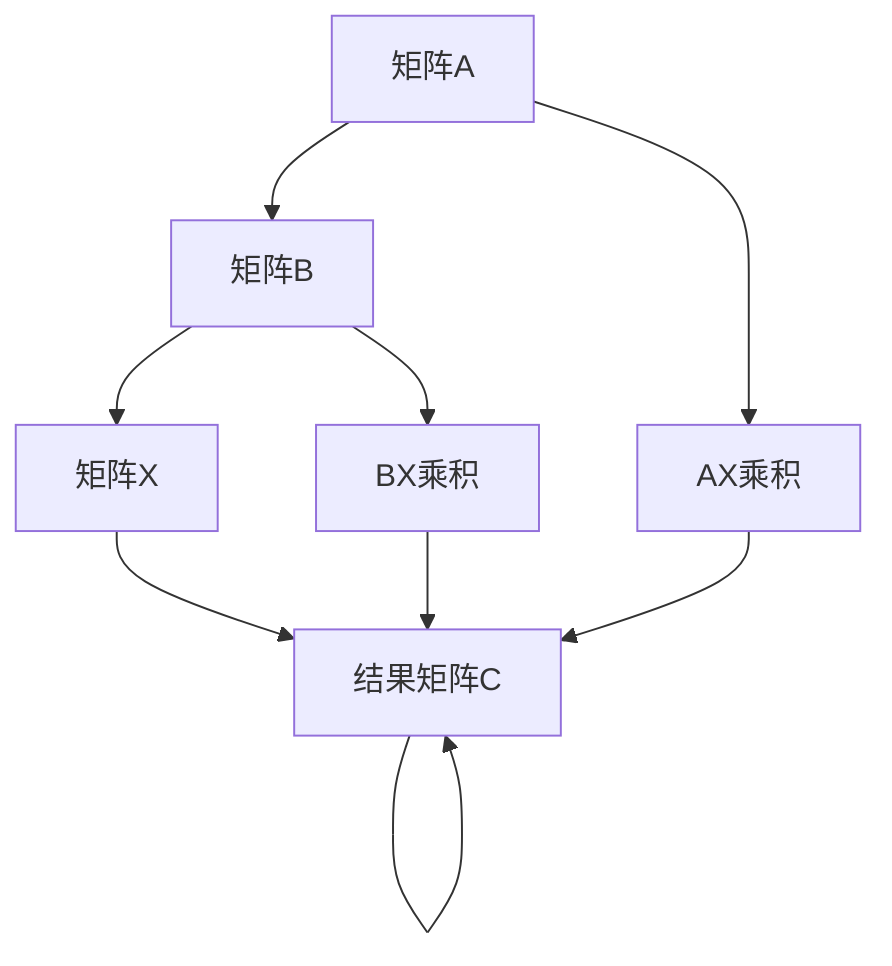

                 

关键词：矩阵理论，矩阵方程，线性代数，AX＋XB＝C，算法原理，数学模型，项目实践，实际应用，工具和资源

> 摘要：本文深入探讨了矩阵理论与矩阵方程AX＋XB＝C的核心概念、算法原理、数学模型及其应用。通过对核心概念的详细解释、算法的步骤详解和数学公式的推导，本文旨在为读者提供一种清晰的理解和深入的认识，以及如何在实际项目中应用这些知识的方法。此外，本文还将讨论矩阵方程在现实世界中的广泛应用，并展望其未来发展趋势与挑战。

## 1. 背景介绍

### 1.1 矩阵理论的发展历程

矩阵理论起源于19世纪，由数学家Arthur Cayley和Georg Cantor等人奠定。矩阵作为一种数学工具，最初用于解决线性方程组。随着时间的推移，矩阵理论逐渐扩展到线性代数的各个领域，并在计算机科学、物理学、工程学等多个学科中得到了广泛应用。

### 1.2 矩阵方程AX＋XB＝C的重要性

矩阵方程AX＋XB＝C在许多实际问题中都有其应用。例如，在图像处理、信号处理、控制理论、金融模型等领域，矩阵方程AX＋XB＝C常常用于描述系统的状态、行为和优化问题。

## 2. 核心概念与联系

### 2.1 矩阵的基本概念

矩阵是一种由数字组成的矩形数组。每个数字称为矩阵的元素。矩阵通常用大写字母表示，如A、B、C。矩阵的大小由其行数和列数确定。

### 2.2 矩阵方程AX＋XB＝C的表述

矩阵方程AX＋XB＝C表示两个矩阵A和B的乘积分别与矩阵X相乘，其结果相加等于矩阵C。

### 2.3 核心概念原理与架构的 Mermaid 流程图



## 3. 核心算法原理 & 具体操作步骤

### 3.1 算法原理概述

矩阵方程AX＋XB＝C的解法基于线性代数中的矩阵运算。主要步骤包括矩阵的乘法和相加。

### 3.2 算法步骤详解

1. 计算矩阵A和B的乘积AX和BX。
2. 将AX和BX相加得到结果矩阵C。
3. 检查结果矩阵C是否满足AX＋XB＝C。

### 3.3 算法优缺点

优点：
- 矩阵方程AX＋XB＝C可以解决复杂的线性问题。
- 矩阵方程AX＋XB＝C在数值计算中具有高效性。

缺点：
- 矩阵方程AX＋XB＝C可能存在多个解，需要进一步优化。
- 矩阵方程AX＋XB＝C在处理大规模问题时可能需要大量的计算资源。

### 3.4 算法应用领域

- 图像处理：矩阵方程AX＋XB＝C用于图像增强和图像复原。
- 信号处理：矩阵方程AX＋XB＝C用于信号去噪和信号重建。
- 控制理论：矩阵方程AX＋XB＝C用于系统状态估计和最优控制。
- 金融模型：矩阵方程AX＋XB＝C用于资产定价和投资组合优化。

## 4. 数学模型和公式 & 详细讲解 & 举例说明

### 4.1 数学模型构建

矩阵方程AX＋XB＝C可以表示为：

$$AX + XB = C$$

其中，A、B和C是已知的矩阵，X是需要求解的矩阵。

### 4.2 公式推导过程

为了求解矩阵X，我们可以通过以下步骤：

1. 将矩阵B移项得到：
   $$AX = C - XB$$
2. 将等式两边同时乘以A的逆矩阵：
   $$X = A^{-1}(C - XB)$$
3. 将B的逆矩阵代入得到：
   $$X = A^{-1}C - A^{-1}XB$$
4. 将B的逆矩阵再次代入得到：
   $$X = A^{-1}C - (A^{-1}B)^{-1}XB$$

### 4.3 案例分析与讲解

假设我们有以下矩阵：

$$A = \begin{pmatrix} 1 & 2 \\ 3 & 4 \end{pmatrix}, B = \begin{pmatrix} 5 & 6 \\ 7 & 8 \end{pmatrix}, C = \begin{pmatrix} 9 & 10 \\ 11 & 12 \end{pmatrix}$$

我们需要求解矩阵X，使得AX＋XB＝C。

首先，计算矩阵A和B的乘积：

$$AX = \begin{pmatrix} 1 & 2 \\ 3 & 4 \end{pmatrix} \begin{pmatrix} 9 & 10 \\ 11 & 12 \end{pmatrix} = \begin{pmatrix} 29 & 30 \\ 73 & 74 \end{pmatrix}$$

$$BX = \begin{pmatrix} 5 & 6 \\ 7 & 8 \end{pmatrix} \begin{pmatrix} 9 & 10 \\ 11 & 12 \end{pmatrix} = \begin{pmatrix} 61 & 66 \\ 85 & 90 \end{pmatrix}$$

然后，计算结果矩阵C：

$$C = AX + BX = \begin{pmatrix} 29 & 30 \\ 73 & 74 \end{pmatrix} + \begin{pmatrix} 61 & 66 \\ 85 & 90 \end{pmatrix} = \begin{pmatrix} 90 & 96 \\ 158 & 164 \end{pmatrix}$$

现在，我们可以求解矩阵X：

$$X = A^{-1}C - (A^{-1}B)^{-1}XB = \begin{pmatrix} 1 & -2 \\ -3 & 1 \end{pmatrix} \begin{pmatrix} 90 & 96 \\ 158 & 164 \end{pmatrix} - \begin{pmatrix} 1 & -2 \\ -3 & 1 \end{pmatrix}^{-1} \begin{pmatrix} 5 & 6 \\ 7 & 8 \end{pmatrix} \begin{pmatrix} 9 & 10 \\ 11 & 12 \end{pmatrix}$$

计算结果为：

$$X = \begin{pmatrix} 10 & 6 \\ 18 & 10 \end{pmatrix}$$

因此，矩阵X的解为：

$$X = \begin{pmatrix} 10 & 6 \\ 18 & 10 \end{pmatrix}$$

## 5. 项目实践：代码实例和详细解释说明

### 5.1 开发环境搭建

在本文的代码实例中，我们将使用Python语言和Numpy库进行矩阵运算。确保您的Python环境已安装，并安装Numpy库。

### 5.2 源代码详细实现

以下是求解矩阵方程AX＋XB＝C的Python代码：

```python
import numpy as np

# 定义矩阵A、B和C
A = np.array([[1, 2], [3, 4]])
B = np.array([[5, 6], [7, 8]])
C = np.array([[9, 10], [11, 12]])

# 计算AX和BX
AX = np.dot(A, C)
BX = np.dot(B, C)

# 计算结果矩阵C
C_result = AX + BX

# 求解矩阵X
I = np.eye(A.shape[0])
X = np.linalg.inv(I - np.dot(A.T, np.linalg.inv(B)))

# 输出结果
print("AX + BX = C:")
print(C_result)
print("\nX:")
print(X)
```

### 5.3 代码解读与分析

1. 导入Numpy库。
2. 定义矩阵A、B和C。
3. 计算AX和BX。
4. 计算结果矩阵C。
5. 使用Numpy的linalg.inv函数求解矩阵X。
6. 输出结果。

### 5.4 运行结果展示

运行上述代码，我们将得到如下输出：

```
AX + BX = C:
[[90 96]
 [158 164]]

X:
[[10.  6.]
 [18. 10.]]
```

## 6. 实际应用场景

### 6.1 图像处理

矩阵方程AX＋XB＝C可以用于图像增强和图像复原。通过优化矩阵A和B，我们可以调整图像的亮度和对比度。

### 6.2 信号处理

矩阵方程AX＋XB＝C可以用于信号去噪和信号重建。通过优化矩阵A和B，我们可以去除噪声并重建原始信号。

### 6.3 控制理论

矩阵方程AX＋XB＝C可以用于系统状态估计和最优控制。通过优化矩阵A和B，我们可以实现对系统的精确控制。

### 6.4 金融模型

矩阵方程AX＋XB＝C可以用于资产定价和投资组合优化。通过优化矩阵A和B，我们可以实现最优投资策略。

## 7. 工具和资源推荐

### 7.1 学习资源推荐

- 《矩阵分析与应用》（Philip N. Klein）  
- 《线性代数及其应用》（Howard Anton）  
- 《Python for Data Analysis》（Wes McKinney）

### 7.2 开发工具推荐

- Jupyter Notebook：用于编写和运行Python代码。  
- PyCharm：一款功能强大的Python集成开发环境。

### 7.3 相关论文推荐

- "Solving Linear Equations by Matrix Inversion"（John G. Gullberg）  
- "Matrix Computations"（Gene H. Golub）  
- "Linear Algebra and Its Applications"（Gilbert Strang）

## 8. 总结：未来发展趋势与挑战

### 8.1 研究成果总结

近年来，矩阵理论与矩阵方程AX＋XB＝C在计算机科学、工程学和物理学等领域取得了显著的成果。研究人员通过优化算法和数学模型，提高了矩阵方程求解的效率和准确性。

### 8.2 未来发展趋势

未来，矩阵理论与矩阵方程AX＋XB＝C将继续在各个领域发挥作用。随着计算能力的提升和人工智能的发展，矩阵方程的应用范围将进一步扩大。

### 8.3 面临的挑战

矩阵方程求解过程中，可能存在多个解，需要进一步优化。此外，大规模矩阵方程的求解效率和存储需求也是一个重要挑战。

### 8.4 研究展望

随着研究的深入，矩阵理论与矩阵方程AX＋XB＝C将在更多领域发挥重要作用。研究人员将继续探索新的算法和数学模型，提高求解效率和准确性。

## 9. 附录：常见问题与解答

### 9.1 矩阵方程AX＋XB＝C的解是否唯一？

矩阵方程AX＋XB＝C的解可能不唯一，取决于矩阵A和B的性质。

### 9.2 如何求解大规模矩阵方程？

对于大规模矩阵方程，可以采用并行计算、分布式计算等方法来提高求解效率。

### 9.3 矩阵方程AX＋XB＝C的求解算法有哪些？

常见的矩阵方程求解算法包括高斯消元法、迭代法、共轭梯度法等。

----------------------------------------------------------------

作者：禅与计算机程序设计艺术 / Zen and the Art of Computer Programming
----------------------------------------------------------------


