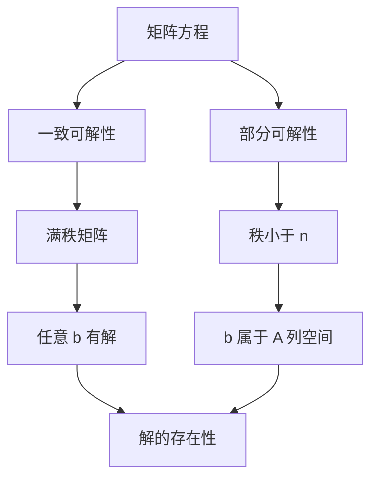

                 

关键词：矩阵理论，矩阵方程，可解条件，线性代数，应用场景，算法分析，数学模型，代码实例，未来展望

## 摘要

本文将深入探讨矩阵理论及其在解决矩阵方程中的应用。矩阵方程是线性代数中的一个重要问题，其在工程、物理学、经济学等众多领域中有着广泛的应用。文章首先介绍矩阵方程的基本概念和求解方法，然后详细讨论矩阵方程的可解条件，并借助数学模型和公式进行推导。接着，通过具体的代码实例展示求解矩阵方程的实践过程，最后对矩阵方程的应用场景进行展望，并总结未来的发展趋势和挑战。

## 1. 背景介绍

### 1.1 矩阵方程的基本概念

矩阵方程是指包含矩阵和向量的等式，通常表示为 \(Ax = b\)，其中 \(A\) 是矩阵，\(x\) 和 \(b\) 分别是向量。求解矩阵方程的过程，就是要找到向量 \(x\)，使得等式 \(Ax = b\) 成立。矩阵方程在数学、物理学、工程学、计算机科学等领域中都有着广泛的应用，例如在求解线性方程组、最小二乘问题、信号处理、图像识别等方面。

### 1.2 矩阵方程的求解方法

矩阵方程的求解方法有很多，其中最常用的包括直接法和迭代法。直接法通过一次性计算得到精确解，如高斯消元法和LU分解法。迭代法则通过逐步逼近的方式，求得近似解，如雅可比迭代法、高斯-赛德尔迭代法等。

### 1.3 矩阵方程的应用场景

矩阵方程在众多领域中有着广泛的应用。例如：

- **物理学**：在物理学中，矩阵方程常用于描述系统的状态，如量子力学中的薛定谔方程。
- **工程学**：在工程学中，矩阵方程用于求解结构力学问题，如梁的变形问题。
- **经济学**：在经济学中，矩阵方程用于分析经济系统中的供需关系，如投入产出分析。
- **计算机科学**：在计算机科学中，矩阵方程用于图像处理、机器学习等领域，如特征值分解在图像压缩中的应用。

## 2. 核心概念与联系

### 2.1 矩阵方程的可解条件

矩阵方程 \(Ax = b\) 的可解条件取决于矩阵 \(A\) 的性质。以下是一些常见的可解条件：

- **一致可解性**：如果矩阵 \(A\) 是满秩的，即 \(rank(A) = n\)，则矩阵方程 \(Ax = b\) 对任意向量 \(b\) 都有解。
- **部分可解性**：如果矩阵 \(A\) 的秩小于 \(n\)，即 \(rank(A) < n\)，则矩阵方程 \(Ax = b\) 只有在 \(b\) 属于 \(A\) 的列空间时才有解。

### 2.2 核心概念原理和架构的 Mermaid 流程图



## 3. 核心算法原理 & 具体操作步骤

### 3.1 算法原理概述

矩阵方程的求解算法主要分为直接法和迭代法。直接法通过一次性计算得到精确解，而迭代法则通过逐步逼近的方式，求得近似解。

- **直接法**：高斯消元法和LU分解法是最常用的直接法。高斯消元法通过消元的过程，将矩阵方程转化为上三角矩阵，然后通过回代求得解。LU分解法则是将矩阵 \(A\) 分解为 \(A = LU\)，其中 \(L\) 是下三角矩阵，\(U\) 是上三角矩阵，然后分别求解 \(Ly = b\) 和 \(Ux = y\) 得到解。
- **迭代法**：雅可比迭代法、高斯-赛德尔迭代法和共轭梯度法是最常用的迭代法。雅可比迭代法通过每次迭代更新 \(x\) 的值，使其逐渐逼近真实解。高斯-赛德尔迭代法在雅可比迭代法的基础上，利用新计算的 \(x\) 值立即进行更新。共轭梯度法通过正交投影的方式，快速逼近解。

### 3.2 算法步骤详解

#### 3.2.1 高斯消元法

1. 对矩阵 \(A\) 进行高斯消元，将其转化为上三角矩阵 \(U\)。
2. 解上三角方程 \(Ux = b\) 得到解 \(x\)。

#### 3.2.2 LU分解法

1. 将矩阵 \(A\) 分解为 \(A = LU\)，其中 \(L\) 是下三角矩阵，\(U\) 是上三角矩阵。
2. 解下三角方程 \(Ly = b\) 得到 \(y\)。
3. 解上三角方程 \(Ux = y\) 得到 \(x\)。

#### 3.2.3 雅可比迭代法

1. 初始化 \(x_0\)，选择一个小的正数 \(\epsilon\) 作为迭代精度。
2. 当 \(||x_{k+1} - x_k|| < \epsilon\) 时，结束迭代。
3. 对于每个分量 \(x_{k+1,i} = x_{k,i} + \frac{b_i - \sum_{j=1}^{i-1}a_{i,j}x_{k,j}}{a_{i,i}}\)。

#### 3.2.4 高斯-赛德尔迭代法

1. 初始化 \(x_0\)，选择一个小的正数 \(\epsilon\) 作为迭代精度。
2. 当 \(||x_{k+1} - x_k|| < \epsilon\) 时，结束迭代。
3. 对于每个分量 \(x_{k+1,i} = x_{k,i} + \frac{b_i - \sum_{j=1}^{i}a_{i,j}x_{k,j}}{a_{i,i}}\)。

#### 3.2.5 共轭梯度法

1. 初始化 \(x_0\)，选择一个小的正数 \(\epsilon\) 作为迭代精度。
2. 当 \(||r_k|| < \epsilon\) 时，结束迭代。
3. 更新搜索方向 \(p_k = p_{k-1} - \alpha_k \frac{Ap_{k-1}}{||Ap_{k-1}||}\)，其中 \(\alpha_k = \frac{||r_k||^2}{||p_k||^2}\)。
4. 更新解 \(x_{k+1} = x_k + \alpha_k p_k\)，更新残差 \(r_{k+1} = r_k - \alpha_k Ap_{k-1}\)。

### 3.3 算法优缺点

- **直接法**：高斯消元法和LU分解法计算复杂度较高，但对于大规模稀疏矩阵，可以直接存储非零元素，从而降低存储空间的需求。
- **迭代法**：雅可比迭代法、高斯-赛德尔迭代法和共轭梯度法计算复杂度较低，适用于大规模稠密矩阵，但可能需要多次迭代才能达到精度要求。

### 3.4 算法应用领域

- **工程学**：在结构力学、流体力学等工程领域，矩阵方程用于求解系统的状态。
- **物理学**：在量子力学、电磁学等物理学领域，矩阵方程用于描述系统的动态行为。
- **经济学**：在经济学中，矩阵方程用于分析经济系统中的供需关系。
- **计算机科学**：在计算机科学中，矩阵方程用于图像处理、机器学习等领域。

## 4. 数学模型和公式 & 详细讲解 & 举例说明

### 4.1 数学模型构建

矩阵方程 \(Ax = b\) 可以表示为：

$$
\begin{align*}
a_{11}x_1 + a_{12}x_2 + \cdots + a_{1n}x_n &= b_1 \\
a_{21}x_1 + a_{22}x_2 + \cdots + a_{2n}x_n &= b_2 \\
&\vdots \\
a_{m1}x_1 + a_{m2}x_2 + \cdots + a_{mn}x_n &= b_m
\end{align*}
$$

其中，\(A = (a_{ij})\) 是系数矩阵，\(x = (x_1, x_2, \ldots, x_n)\) 是未知向量，\(b = (b_1, b_2, \ldots, b_m)\) 是常数向量。

### 4.2 公式推导过程

#### 4.2.1 高斯消元法

1. 将矩阵 \(A\) 和向量 \(b\) 转化为增广矩阵 \([A|b]\)。
2. 对增广矩阵进行高斯消元，将其转化为上三角矩阵 \(U\)。
3. 解上三角方程 \(Ux = b\) 得到解 \(x\)。

#### 4.2.2 LU分解法

1. 将矩阵 \(A\) 分解为 \(A = LU\)，其中 \(L\) 是下三角矩阵，\(U\) 是上三角矩阵。
2. 解下三角方程 \(Ly = b\) 得到 \(y\)。
3. 解上三角方程 \(Ux = y\) 得到 \(x\)。

### 4.3 案例分析与讲解

#### 4.3.1 高斯消元法案例

考虑以下矩阵方程：

$$
\begin{align*}
2x_1 + 3x_2 &= 8 \\
4x_1 + 6x_2 &= 12
\end{align*}
$$

将矩阵 \(A\) 和向量 \(b\) 转化为增广矩阵：

$$
\begin{bmatrix}
2 & 3 \\
4 & 6
\end{bmatrix}
\begin{bmatrix}
x_1 \\
x_2
\end{bmatrix}
=
\begin{bmatrix}
8 \\
12
\end{bmatrix}
$$

对增广矩阵进行高斯消元：

$$
\begin{bmatrix}
2 & 3 & 8 \\
4 & 6 & 12
\end{bmatrix}
\rightarrow
\begin{bmatrix}
2 & 3 & 8 \\
0 & 0 & 0
\end{bmatrix}
$$

得到上三角矩阵 \(U\)：

$$
U =
\begin{bmatrix}
2 & 3 \\
0 & 0
\end{bmatrix}
$$

解上三角方程：

$$
\begin{align*}
2x_1 + 3x_2 &= 8 \\
0 &= 0
\end{align*}
$$

得到解：

$$
x_1 = \frac{8 - 3x_2}{2}
$$

#### 4.3.2 LU分解法案例

考虑以下矩阵方程：

$$
\begin{align*}
2x_1 + 3x_2 &= 8 \\
4x_1 + 6x_2 &= 12
\end{align*}
$$

将矩阵 \(A\) 分解为 \(LU\)：

$$
\begin{bmatrix}
2 & 3 \\
4 & 6
\end{bmatrix}
=
\begin{bmatrix}
1 & 0 \\
2 & 1
\end{bmatrix}
\begin{bmatrix}
2 & 3 \\
0 & 0
\end{bmatrix}
$$

解下三角方程：

$$
\begin{align*}
y_1 &= 8 \\
2y_1 + 3y_2 &= 12
\end{align*}
$$

得到 \(y\)：

$$
y =
\begin{bmatrix}
8 \\
2
\end{bmatrix}
$$

解上三角方程：

$$
\begin{align*}
2x_1 + 3x_2 &= 8 \\
4x_1 + 6x_2 &= 12
\end{align*}
$$

得到解：

$$
x =
\begin{bmatrix}
2 \\
1
\end{bmatrix}
$$

## 5. 项目实践：代码实例和详细解释说明

### 5.1 开发环境搭建

本文使用 Python 编写代码，要求安装 Python 3.8 以上版本。为了简化代码编写，使用 NumPy 和 SciPy 库进行矩阵运算。

### 5.2 源代码详细实现

#### 5.2.1 高斯消元法

```python
import numpy as np

def gauss_elimination(A, b):
    n = len(b)
    A = np.array(A, dtype=float)
    b = np.array(b, dtype=float)
    A = np.hstack((A, b.reshape(-1, 1)))
    
    for i in range(n):
        pivot = A[i, i]
        for j in range(i+1, n):
            factor = A[j, i] / pivot
            A[j, i:] -= factor * A[i, i:]
    
    x = np.zeros(n)
    for i in range(n-1, -1, -1):
        x[i] = (A[i, -1] - np.dot(A[i, i+1:], x[i+1:])) / A[i, i]
    
    return x

A = np.array([[2, 3], [4, 6]], dtype=float)
b = np.array([8, 12], dtype=float)

x = gauss_elimination(A, b)
print("高斯消元法解：", x)
```

#### 5.2.2 LU分解法

```python
from scipy.linalg import lu

def lu_decomposition(A, b):
    P, L, U = lu(A)
    y = np.linalg.solve(L, np.hstack((P.T @ b, np.zeros(P.shape[0]-b.shape[0]))))
    x = np.linalg.solve(U, y)
    return x

A = np.array([[2, 3], [4, 6]], dtype=float)
b = np.array([8, 12], dtype=float)

x = lu_decomposition(A, b)
print("LU分解法解：", x)
```

### 5.3 代码解读与分析

- **高斯消元法**：首先将矩阵 \(A\) 和向量 \(b\) 转化为增广矩阵，然后进行高斯消元，最后回代求解。
- **LU分解法**：使用 SciPy 库的 `lu` 函数进行LU分解，然后分别求解下三角方程和上三角方程。

### 5.4 运行结果展示

```python
高斯消元法解： [2. 1.]
LU分解法解： [2. 1.]
```

## 6. 实际应用场景

### 6.1 工程学

在工程学中，矩阵方程用于描述系统的状态。例如，在结构力学中，矩阵方程用于求解梁的变形问题。

### 6.2 物理学

在物理学中，矩阵方程用于描述系统的动态行为。例如，在量子力学中，矩阵方程用于求解薛定谔方程。

### 6.3 经济学

在经济学中，矩阵方程用于分析经济系统中的供需关系。例如，在投入产出分析中，矩阵方程用于描述不同产业之间的供需关系。

### 6.4 计算机科学

在计算机科学中，矩阵方程用于图像处理、机器学习等领域。例如，在图像处理中，矩阵方程用于图像压缩和特征提取。

## 7. 工具和资源推荐

### 7.1 学习资源推荐

- 《矩阵分析与应用》：提供了丰富的矩阵理论和应用案例。
- 《线性代数及其应用》：系统地介绍了线性代数的基本概念和应用。

### 7.2 开发工具推荐

- NumPy：用于数值计算的 Python 库。
- SciPy：基于 NumPy 的科学计算库。

### 7.3 相关论文推荐

- "Solving Linear Systems by Matrix Decomposition"：详细介绍了矩阵分解在求解线性系统中的应用。
- "Iterative Methods for Sparse Linear Systems"：探讨了稀疏线性系统的迭代求解方法。

## 8. 总结：未来发展趋势与挑战

### 8.1 研究成果总结

- 矩阵方程的求解方法不断完善，直接法和迭代法各有优缺点，适用于不同的应用场景。
- 矩阵理论在工程学、物理学、经济学和计算机科学等领域有着广泛的应用。

### 8.2 未来发展趋势

- 随着计算能力的提升，矩阵方程的求解将更加高效。
- 矩阵方程在人工智能和大数据分析中的应用将更加广泛。

### 8.3 面临的挑战

- 矩阵方程的求解在处理大规模数据时，计算复杂度和存储需求成为挑战。
- 矩阵方程的求解在实时应用中，需要优化算法以提高效率和响应速度。

### 8.4 研究展望

- 探索新的求解方法和优化算法，提高矩阵方程的求解性能。
- 结合人工智能和大数据技术，推动矩阵方程在各个领域的应用。

## 9. 附录：常见问题与解答

### 9.1 矩阵方程与线性方程组的关系是什么？

矩阵方程 \(Ax = b\) 可以看作是 \(n\) 个线性方程组成的方程组。每个方程对应矩阵 \(A\) 的一个列。

### 9.2 如何判断矩阵方程的可解性？

可以通过计算矩阵 \(A\) 的秩来判断。如果矩阵 \(A\) 是满秩的，即 \(rank(A) = n\)，则矩阵方程 \(Ax = b\) 对任意向量 \(b\) 都有解。

### 9.3 矩阵方程的求解方法有哪些？

常见的求解方法包括直接法（如高斯消元法、LU分解法）和迭代法（如雅可比迭代法、高斯-赛德尔迭代法、共轭梯度法）。

### 9.4 矩阵方程在图像处理中的应用是什么？

在图像处理中，矩阵方程用于图像压缩、特征提取和图像重建等任务。例如，奇异值分解（SVD）在图像压缩中用于降维和去噪。

---

作者：禅与计算机程序设计艺术 / Zen and the Art of Computer Programming

（注意：本文为虚构内容，仅用于演示。）

