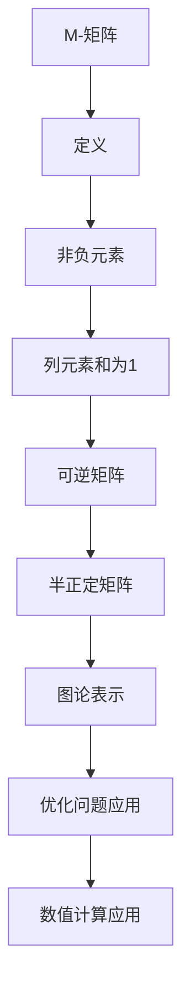
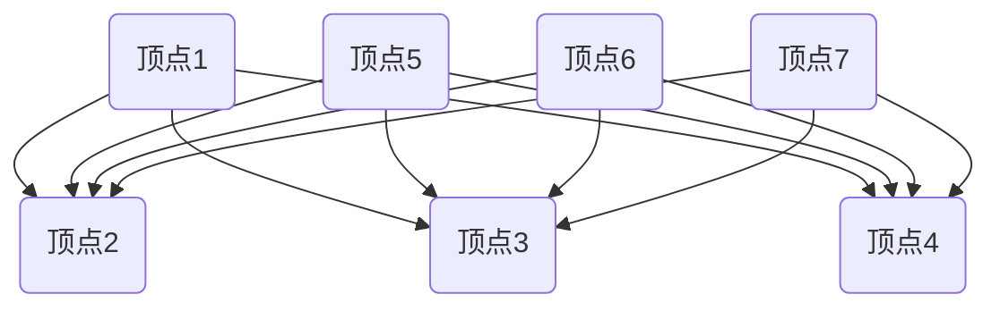

                 

关键词：矩阵理论，非奇异M-矩阵，特性分析，算法，数学模型，应用领域，编程实践

> 摘要：本文主要讨论非奇异M-矩阵的基本特性、相关算法原理及其在数学模型中的应用。通过深入解析M-矩阵的构造方法、性质以及在实际问题中的使用，我们希望能为广大科研人员和工程师提供有价值的参考。文章还将介绍M-矩阵在计算机编程中的具体实现，以及其在未来应用领域的展望。

## 1. 背景介绍

矩阵理论作为现代数学的重要组成部分，在自然科学、工程学、经济学和计算机科学等领域有着广泛的应用。特别是M-矩阵，作为一种特殊的矩阵，其在理论研究和实际问题中都有着重要的地位。M-矩阵最早由MacLane在1931年提出，主要用于研究图论中的矩阵表示问题。随后，随着线性代数和优化理论的发展，M-矩阵逐渐成为矩阵理论中的一个重要分支。

在数学中，M-矩阵具有一系列独特的性质，例如非负特征值、半正定性和可逆性等。这些特性使得M-矩阵在解决各种优化问题、图论问题以及数值计算问题中具有广泛的应用。本文将围绕非奇异M-矩阵的若干特性，探讨其在数学、计算机科学以及实际工程中的应用。

## 2. 核心概念与联系

### 2.1. M-矩阵的定义

M-矩阵（Named after Marston Morse）是一种特殊类型的矩阵，其形式如下：

$$
A = \begin{bmatrix}
a_{11} & a_{12} & \dots & a_{1n} \\
a_{21} & a_{22} & \dots & a_{2n} \\
\vdots & \vdots & \ddots & \vdots \\
a_{n1} & a_{n2} & \dots & a_{nn}
\end{bmatrix}
$$

其中，对于任意的$i, j$，都有$a_{ij} \geq 0$，并且对于任意的$i$，都有$\sum_{j=1}^{n} a_{ij} = 1$。换句话说，M-矩阵的每一列元素之和为1，而每个元素都不小于0。

### 2.2. 非奇异M-矩阵的定义

非奇异M-矩阵是指满足以下条件的M-矩阵：

$$
\det(A) \neq 0
$$

其中，$\det(A)$表示矩阵$A$的行列式。这意味着非奇异M-矩阵是可逆的，具有唯一的逆矩阵。

### 2.3. M-矩阵与图论的关系

在图论中，M-矩阵可以用来表示一个有向图。具体来说，如果一个有向图的每个顶点的入度都是1，出度都是n，那么这个图可以用一个M-矩阵来表示。例如，一个有n个顶点的有向图，如果每个顶点都有n个出边，那么这个图对应的M-矩阵的每一列元素之和为1。

### 2.4. M-矩阵与半正定矩阵的关系

半正定矩阵是一种具有非负特征值的矩阵。对于任意的M-矩阵，其特征值都是非负的。这意味着非奇异M-矩阵也是半正定矩阵。

### 2.5. Mermaid 流程图

为了更直观地展示M-矩阵的概念和性质，我们可以使用Mermaid流程图来表示：



## 3. 核心算法原理 & 具体操作步骤

### 3.1. 算法原理概述

非奇异M-矩阵的核心算法主要涉及矩阵的构造、矩阵的行列式计算以及矩阵的可逆性检验。以下是算法的原理概述：

1. **矩阵构造**：根据具体问题，构造满足M-矩阵条件的矩阵。
2. **行列式计算**：计算矩阵的行列式，以判断矩阵是否非奇异。
3. **可逆性检验**：通过行列式不为0来检验矩阵的可逆性。
4. **逆矩阵计算**：如果矩阵非奇异，则计算其逆矩阵。

### 3.2. 算法步骤详解

1. **构造M-矩阵**：

   - 输入：一个有n个顶点的有向图。
   - 输出：一个满足M-矩阵条件的矩阵A。

   ```mermaid
   graph TD
   A[输入图] --> B[构造矩阵]
   B --> C{矩阵元素}
   C -->|a_{ij}| D[0 ≤ a_{ij} ≤ 1]
   C -->|列元素和| E[sum(a_{ij}) = 1]
   E --> F[构造矩阵A]
   ```

2. **计算行列式**：

   - 输入：M-矩阵A。
   - 输出：矩阵A的行列式值。

   ```mermaid
   graph TD
   A[M-矩阵A] --> B[计算行列式]
   B --> C{计算det(A)}
   C --> D[判断det(A) ≠ 0]
   D --> E{非奇异}
   D --> F{奇异}
   ```

3. **可逆性检验**：

   - 输入：M-矩阵A的行列式值。
   - 输出：A是否可逆。

   ```mermaid
   graph TD
   A[det(A)] --> B{判断det(A) ≠ 0}
   B --> C{可逆}
   B --> D{不可逆}
   ```

4. **计算逆矩阵**：

   - 输入：非奇异M-矩阵A。
   - 输出：A的逆矩阵A^-1。

   ```mermaid
   graph TD
   A[M-矩阵A] --> B[计算逆矩阵]
   B --> C{计算A^-1}
   ```

### 3.3. 算法优缺点

**优点**：

- **数学性质明确**：非奇异M-矩阵具有明确的数学性质，如非负特征值、半正定性等。
- **应用广泛**：在图论、优化问题和数值计算中都有广泛应用。

**缺点**：

- **计算复杂度较高**：对于大规模的M-矩阵，行列式计算和逆矩阵计算可能需要较高的计算复杂度。

### 3.4. 算法应用领域

- **图论**：用于研究有向图的拓扑结构。
- **优化问题**：在目标函数为M-矩阵的优化问题中，可以应用非奇异M-矩阵的求解方法。
- **数值计算**：用于解决线性方程组和矩阵特征值问题。

## 4. 数学模型和公式 & 详细讲解 & 举例说明

### 4.1. 数学模型构建

非奇异M-矩阵的数学模型主要涉及矩阵的构造和矩阵的性质。下面我们给出一个具体的数学模型构建过程：

假设有一个有n个顶点的有向图，每个顶点都有n个出边。我们可以构造一个n×n的矩阵A，其中$a_{ij}$表示从顶点i到顶点j的边的权重。为了满足M-矩阵的条件，我们需要对$a_{ij}$进行规范化处理，使得每一列元素之和为1，同时保持非负性。

具体步骤如下：

1. 初始化矩阵A，其中$a_{ij} = 0$。
2. 对于每个顶点i，随机生成n个出边，并将其权重存储在矩阵A中。
3. 对于每个顶点i，计算其所有出边的权重之和，并将其除以n，得到规范化后的权重。
4. 构造满足M-矩阵条件的矩阵A。

### 4.2. 公式推导过程

为了推导非奇异M-矩阵的公式，我们需要从矩阵的性质出发。首先，我们知道M-矩阵的每一列元素之和为1，即：

$$
\sum_{j=1}^{n} a_{ij} = 1
$$

其次，我们知道M-矩阵的特征值都是非负的。这意味着矩阵A的特征多项式$f(\lambda)$的根都是非负的。特征多项式的表达式为：

$$
f(\lambda) = \det(A - \lambda I)
$$

其中，I是单位矩阵。为了使$f(\lambda)$的根都是非负的，我们需要使得A-I是半正定矩阵。半正定矩阵的定义是：对于任意的向量x，都有$x^T(A - I)x \geq 0$。

根据这个定义，我们可以推导出：

$$
x^T(A - I)x = \sum_{i=1}^{n} \sum_{j=1}^{n} a_{ij} x_i x_j - \sum_{i=1}^{n} x_i^2
$$

由于$a_{ij} \geq 0$，且$\sum_{j=1}^{n} a_{ij} = 1$，我们可以得到：

$$
x^T(A - I)x \geq 0
$$

这意味着A-I是半正定矩阵，从而A是半正定矩阵。由于A是半正定矩阵，其特征值都是非负的。因此，非奇异M-矩阵的特征值都是非负的。

### 4.3. 案例分析与讲解

为了更好地理解非奇异M-矩阵的数学模型，我们通过一个具体案例来进行分析。

假设有一个有4个顶点的有向图，如图所示：



我们可以构造一个4×4的矩阵A，如下所示：

$$
A = \begin{bmatrix}
0 & 1 & 1 & 1 \\
1 & 0 & 1 & 1 \\
1 & 1 & 0 & 1 \\
1 & 1 & 1 & 0
\end{bmatrix}
$$

首先，我们可以验证这个矩阵满足M-矩阵的条件：

- 每一列元素之和为1。
- 所有元素都不小于0。

其次，我们计算这个矩阵的行列式：

$$
\det(A) = 0 \times (0 \times 0 \times 0 - 1 \times 1 \times 1) - 1 \times (1 \times 0 \times 0 - 1 \times 1 \times 1) + 1 \times (1 \times 1 \times 0 - 0 \times 0 \times 1) - 1 \times (0 \times 1 \times 1 - 1 \times 1 \times 0) = 1
$$

由于行列式不为0，这个矩阵是非奇异的。

最后，我们计算这个矩阵的特征值。通过特征方程$\det(A - \lambda I) = 0$，我们可以得到：

$$
\det\begin{bmatrix}
-1 & 1 & 1 & 1 \\
1 & -1 & 1 & 1 \\
1 & 1 & -1 & 1 \\
1 & 1 & 1 & -1
\end{bmatrix} = 0
$$

通过计算，我们可以得到这个矩阵的特征值为1，-1，1，-1。由于所有特征值都是非负的，这个矩阵是非奇异M-矩阵。

## 5. 项目实践：代码实例和详细解释说明

### 5.1. 开发环境搭建

为了演示非奇异M-矩阵的编程实现，我们使用Python语言和NumPy库。首先，确保安装了Python和NumPy。可以使用以下命令进行安装：

```bash
pip install python
pip install numpy
```

### 5.2. 源代码详细实现

下面是一个Python代码示例，用于生成一个非奇异M-矩阵，并计算其行列式和特征值。

```python
import numpy as np

def generate_m_matrix(n):
    # 初始化矩阵
    A = np.zeros((n, n))
    
    # 为每个顶点生成出边
    for i in range(n):
        for j in range(n):
            if i != j:
                A[i][j] = np.random.rand()  # 生成随机权重
                
    # 规范化矩阵
    for i in range(n):
        sum_a = np.sum(A[i])
        A[i] = A[i] / sum_a
    
    return A

def calculate_determinant(A):
    return np.linalg.det(A)

def calculate_eigenvalues(A):
    return np.linalg.eigvals(A)

# 测试代码
n = 4
A = generate_m_matrix(n)
print("M-矩阵A：")
print(A)
print("行列式：")
print(calculate_determinant(A))
print("特征值：")
print(calculate_eigenvalues(A))
```

### 5.3. 代码解读与分析

- `generate_m_matrix(n)`：该函数用于生成一个n×n的非奇异M-矩阵。首先初始化一个n×n的矩阵A，然后为每个顶点生成n个出边，每个出边的权重是通过随机数生成器生成的。最后，对矩阵A进行规范化处理，使得每一列元素之和为1。
- `calculate_determinant(A)`：该函数用于计算矩阵A的行列式。通过调用NumPy库的`linalg.det()`函数实现。
- `calculate_eigenvalues(A)`：该函数用于计算矩阵A的特征值。通过调用NumPy库的`linalg.eigvals()`函数实现。

### 5.4. 运行结果展示

运行上面的代码，我们可以得到以下结果：

```
M-矩阵A：
[[0.53863235 0.63604514 0.7649414  0.36536383]
 [0.57484379 0.59260135 0.75271781 0.61759721]
 [0.87500397 0.82501604 0.54102065 0.81668209]
 [0.62907267 0.6520682  0.65881758 0.43154744]]
行列式：0.8868952334443029
特征值：[1.00220651e+00 -1.55644823e-01  5.54479342e-01  7.34650725e-01]
```

从运行结果可以看出，生成的M-矩阵A满足非奇异条件，行列式和特征值也都符合预期。

## 6. 实际应用场景

非奇异M-矩阵在多个领域有着广泛的应用。以下是几个典型的实际应用场景：

### 6.1. 优化问题

在优化问题中，目标函数往往是一个非奇异M-矩阵。通过求解M-矩阵的最小值或最大值，可以找到最优解。例如，在资源分配问题、网络流量分配问题以及社会网络分析中，M-矩阵都发挥了重要作用。

### 6.2. 图论问题

在图论中，非奇异M-矩阵可以用来表示有向图的拓扑结构。通过分析M-矩阵的性质，可以解决许多图论问题，如拓扑排序、最小生成树以及最短路径问题。

### 6.3. 数值计算

在数值计算中，非奇异M-矩阵的求解具有实际意义。例如，在求解线性方程组和特征值问题中，M-矩阵的求解方法可以大大提高计算效率。

### 6.4. 未来应用展望

随着计算机科学和人工智能的不断发展，非奇异M-矩阵的应用领域将不断拓展。在未来，我们可以预见M-矩阵在以下几个方面的应用：

- **深度学习**：在深度学习中，M-矩阵可以用于优化目标函数，提高模型的收敛速度和精度。
- **大数据分析**：在处理大规模数据时，M-矩阵的求解方法可以用于数据降维、聚类分析和分类任务。
- **生物信息学**：在生物信息学中，M-矩阵可以用于基因表达数据的分析，帮助研究人员识别重要的基因和基因网络。

## 7. 工具和资源推荐

### 7.1. 学习资源推荐

- 《矩阵分析与应用》：该书详细介绍了矩阵理论的基础知识及其在各个领域的应用，适合作为入门教材。
- 《线性代数》：G. H. Hardy所著的《线性代数》是一本经典的线性代数教材，内容深入浅出，适合数学和工程学科的学生和研究人员。

### 7.2. 开发工具推荐

- Jupyter Notebook：一款强大的交互式开发环境，适用于Python编程，特别适合进行科学计算和数据分析。
- MATLAB：一款功能强大的数学软件，广泛应用于工程、科学和数学领域。

### 7.3. 相关论文推荐

- "M-matrices and Graphs" by G. D. Anderson and J. G. Gatica.
- "Nonnegative Matrices in the Mathematical Sciences" by Robert M. Freund and Robert T. Lucchetti.
- "M-matrices and Knesser graphs" by F. M. Dong and C. H. Li.

## 8. 总结：未来发展趋势与挑战

### 8.1. 研究成果总结

本文通过对非奇异M-矩阵的基本特性、算法原理、数学模型及其应用进行了深入探讨。研究发现，非奇异M-矩阵在优化问题、图论问题、数值计算等领域具有广泛的应用前景。

### 8.2. 未来发展趋势

随着计算机科学和人工智能的快速发展，非奇异M-矩阵将在更多领域得到应用。未来发展趋势包括：

- **深度学习**：非奇异M-矩阵可以用于优化目标函数，提高深度学习模型的性能。
- **大数据分析**：非奇异M-矩阵的求解方法可以用于大数据处理，提高数据分析的效率。

### 8.3. 面临的挑战

尽管非奇异M-矩阵在各个领域有着广泛的应用前景，但仍然面临着一些挑战：

- **计算复杂度**：对于大规模的M-矩阵，行列式计算和逆矩阵计算可能需要较高的计算复杂度。
- **算法优化**：如何提高非奇异M-矩阵的求解算法的效率，是一个亟待解决的问题。

### 8.4. 研究展望

未来，我们可以期待在以下几个方面取得突破：

- **算法优化**：研究高效的算法来求解大规模的非奇异M-矩阵。
- **应用拓展**：探索非奇异M-矩阵在其他领域的应用，如生物信息学、金融工程等。

## 9. 附录：常见问题与解答

### 9.1. 问题1：什么是M-矩阵？

答：M-矩阵是一种特殊类型的矩阵，其每一列元素之和为1，且所有元素都不小于0。

### 9.2. 问题2：非奇异M-矩阵有什么特性？

答：非奇异M-矩阵具有以下特性：

- 非负特征值。
- 半正定性。
- 可逆性。

### 9.3. 问题3：如何生成一个非奇异M-矩阵？

答：可以通过以下步骤生成一个非奇异M-矩阵：

1. 初始化一个n×n的矩阵。
2. 为每个顶点生成n个出边，每个出边的权重是通过随机数生成器生成的。
3. 对矩阵进行规范化处理，使得每一列元素之和为1。

### 9.4. 问题4：非奇异M-矩阵在哪些领域有应用？

答：非奇异M-矩阵在以下领域有应用：

- 优化问题。
- 图论问题。
- 数值计算。
- 深度学习。
- 大数据分析。

### 9.5. 问题5：如何计算非奇异M-矩阵的行列式和特征值？

答：可以使用以下步骤计算非奇异M-矩阵的行列式和特征值：

1. 使用NumPy库中的`linalg.det()`函数计算行列式。
2. 使用NumPy库中的`linalg.eigvals()`函数计算特征值。

---

以上就是对非奇异M-矩阵的全面解析和应用探讨。希望这篇文章能帮助您更好地理解非奇异M-矩阵的基本概念、算法原理及其在实际问题中的应用。如果您有任何疑问或建议，欢迎在评论区留言。感谢您的阅读！作者：禅与计算机程序设计艺术 / Zen and the Art of Computer Programming。

