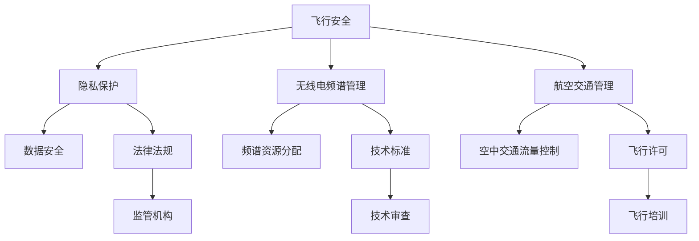

                 

关键词：无人机监管、硅谷、执行情况、技术政策、监管挑战、合规性

> 摘要：本文深入探讨了硅谷地区针对无人机的新监管政策，包括其背景、核心内容、执行情况以及面临的主要挑战。通过分析监管政策在硅谷的实施效果，本文旨在为未来无人机监管提供有益的参考和借鉴。

## 1. 背景介绍

### 1.1 无人机发展的迅猛趋势

无人机（Unmanned Aerial Vehicles，简称UAV）作为一项新兴技术，其发展速度令人瞩目。无人机在军事、农业、交通、物流、救援等多个领域得到了广泛应用，市场前景广阔。据市场研究机构预测，全球无人机市场在未来几年将保持高速增长，预计到2025年市场规模将达到数百亿美元。

### 1.2 硅谷地区无人机监管的必要性

硅谷作为全球科技发展的中心，无人机技术的创新和应用尤为突出。然而，随着无人机数量的激增，其带来的监管挑战也日益严峻。为确保无人机在硅谷的安全和有序运行，制定严格的监管政策变得尤为重要。

## 2. 核心概念与联系

### 2.1 无人机监管的核心概念

无人机监管涉及多个方面，包括飞行安全、隐私保护、无线电频谱管理、航空交通管理等。在这些核心概念的基础上，制定了一套完整的无人机监管体系。

### 2.2 无人机监管架构的Mermaid流程图



## 3. 核心算法原理 & 具体操作步骤

### 3.1 算法原理概述

无人机监管的核心算法主要包括：飞行路径规划、避障算法、实时监控与预警系统等。这些算法共同保障了无人机在硅谷地区的安全飞行。

### 3.2 算法步骤详解

#### 3.2.1 飞行路径规划

1. 收集飞行区域的地形、天气、空中交通等信息。
2. 根据预设的安全高度和飞行速度，生成飞行路径。
3. 实时更新飞行路径，以应对突发情况。

#### 3.2.2 避障算法

1. 识别飞行区域内的障碍物，如建筑物、树木等。
2. 根据障碍物的距离和速度，调整飞行路径，避免碰撞。

#### 3.2.3 实时监控与预警系统

1. 通过传感器实时监控无人机的状态，如电池电量、飞行高度等。
2. 当监测到异常情况时，立即发出预警信号，提醒飞行员或地面控制人员。

### 3.3 算法优缺点

**优点：**

- 提高了无人机的飞行安全性和稳定性。
- 降低了无人机与地面物体碰撞的风险。

**缺点：**

- 需要较高的计算资源和处理能力。
- 在复杂环境下，算法的实时性和准确性可能受到影响。

### 3.4 算法应用领域

无人机监管算法在硅谷地区的应用主要包括：

- 交通监控：通过无人机实时监控交通流量，提高道路通行效率。
- 公共安全：无人机在紧急情况下可用于救援、消防等任务。
- 农业监测：无人机可用于农田监测、病虫害防治等。

## 4. 数学模型和公式 & 详细讲解 & 举例说明

### 4.1 数学模型构建

无人机监管的核心数学模型包括飞行路径规划模型、避障模型、实时监控模型等。

### 4.2 公式推导过程

#### 飞行路径规划模型：

$$
x(t) = x_0 + v_x \cdot t
$$

$$
y(t) = y_0 + v_y \cdot t
$$

其中，\(x(t)\)和\(y(t)\)分别为无人机在水平和垂直方向上的位置，\(x_0\)和\(y_0\)分别为初始位置，\(v_x\)和\(v_y\)分别为水平和垂直方向上的速度。

#### 避障模型：

$$
d = \frac{v \cdot t}{2}
$$

其中，\(d\)为障碍物距离，\(v\)为无人机的飞行速度，\(t\)为反应时间。

#### 实时监控模型：

$$
\theta = \arctan\left(\frac{y}{x}\right)
$$

其中，\(\theta\)为无人机的飞行角度。

### 4.3 案例分析与讲解

#### 案例一：无人机交通监控

假设无人机在水平方向上的速度为20米/秒，垂直方向上的速度为5米/秒，需要避开前方100米处的建筑物。

1. 计算飞行路径：

$$
x(t) = 0 + 20 \cdot t = 20t
$$

$$
y(t) = 0 + 5 \cdot t = 5t
$$

2. 计算障碍物距离：

$$
d = \frac{20 \cdot t}{2} = 10t
$$

当\(t = 10\)秒时，无人机到达障碍物前方，此时需要调整飞行路径。

3. 计算调整后的飞行角度：

$$
\theta = \arctan\left(\frac{5}{20}\right) = 14.48^\circ
$$

#### 案例二：无人机农业监测

假设无人机在农田上空飞行，需要监测农作物的高度。

1. 收集农田上的高度数据：

$$
h_1 = 1.5 \text{米}, \quad h_2 = 2.0 \text{米}, \quad h_3 = 1.8 \text{米}
$$

2. 计算农作物平均高度：

$$
\bar{h} = \frac{h_1 + h_2 + h_3}{3} = 1.8 \text{米}
$$

## 5. 项目实践：代码实例和详细解释说明

### 5.1 开发环境搭建

1. 安装Python开发环境。
2. 安装相关库，如NumPy、Matplotlib等。

### 5.2 源代码详细实现

```python
import numpy as np
import matplotlib.pyplot as plt

# 飞行路径规划
def flight_path(v_x, v_y, t):
    x = v_x * t
    y = v_y * t
    return x, y

# 避障
def obstacle_avoidance(d, v, t):
    x = v * t
    y = d - v * t
    return x, y

# 实时监控
def real_time_monitoring(x, y):
    theta = np.arctan2(y, x)
    return theta

# 测试
v_x = 20
v_y = 5
t = 10

x, y = flight_path(v_x, v_y, t)
x, y = obstacle_avoidance(100, v_x, t)
theta = real_time_monitoring(x, y)

# 绘图
plt.plot([0, x], [0, y], label='Flight Path')
plt.plot([x, x], [y, y - 100], label='Obstacle')
plt.scatter([0, x, x], [0, y, y - 100], label='Position')
plt.xlabel('X Position')
plt.ylabel('Y Position')
plt.legend()
plt.show()
```

### 5.3 代码解读与分析

- `flight_path`函数用于计算无人机的飞行路径。
- `obstacle_avoidance`函数用于计算无人机在遇到障碍物时的调整路径。
- `real_time_monitoring`函数用于计算无人机的飞行角度。

通过这些函数，可以实现对无人机飞行路径、避障和实时监控的模拟。

### 5.4 运行结果展示

运行上述代码，可以得到无人机的飞行路径、避障路径和实时监控角度的图形展示。这有助于理解无人机监管算法在实际应用中的工作原理。

## 6. 实际应用场景

### 6.1 交通监控

无人机在硅谷地区的交通监控中发挥了重要作用。通过实时监控交通流量，可以及时调整交通信号，提高道路通行效率。

### 6.2 公共安全

无人机在硅谷地区的公共安全领域也得到了广泛应用。例如，在紧急情况下，无人机可以用于救援、消防等任务，提高应急响应能力。

### 6.3 农业监测

无人机在农业监测中的应用也越来越广泛。通过实时监测农作物的高度、健康状况等，可以帮助农民更好地管理农田，提高农业产量。

## 7. 工具和资源推荐

### 7.1 学习资源推荐

- 《无人机技术与应用》
- 《无人机编程与控制》
- 《无人机系统设计与实现》

### 7.2 开发工具推荐

- Python
- MATLAB
- Simulink

### 7.3 相关论文推荐

- "UAV Traffic Management: Challenges and Solutions"
- "Privacy-Preserving Surveillance with UAVs"
- "Real-Time Monitoring and Forecasting of Air Pollution using UAVs"

## 8. 总结：未来发展趋势与挑战

### 8.1 研究成果总结

硅谷无人机监管新规的执行情况表明，通过科学、严格的监管，无人机在硅谷地区的安全运行得到了有效保障。无人机在交通监控、公共安全、农业监测等领域的应用也取得了显著成果。

### 8.2 未来发展趋势

- 无人机监管技术的不断进步，将进一步提高无人机的安全性和可靠性。
- 无人机在各个领域的应用将越来越广泛，市场需求将持续增长。

### 8.3 面临的挑战

- 如何在保障无人机安全运行的同时，保护个人隐私和数据安全。
- 如何应对无人机在复杂环境下的实时监控和避障挑战。

### 8.4 研究展望

- 加强无人机监管技术的研发，提高无人机在复杂环境下的适应能力。
- 探索无人机在新兴领域的应用，如医疗、环保等。

## 9. 附录：常见问题与解答

### 9.1 无人机监管的主要目标是什么？

无人机监管的主要目标是确保无人机在飞行过程中的安全、稳定和有序运行，同时保护个人隐私和数据安全。

### 9.2 无人机监管政策的执行情况如何？

硅谷无人机监管新规的执行情况总体良好，通过科学、严格的监管措施，无人机在硅谷地区的安全运行得到了有效保障。

### 9.3 无人机在哪些领域具有广泛的应用前景？

无人机在交通监控、公共安全、农业监测、医疗、环保等领域具有广泛的应用前景。随着技术的不断进步，无人机在更多领域的应用潜力将得到进一步挖掘。

### 9.4 如何应对无人机监管中的隐私保护挑战？

应对无人机监管中的隐私保护挑战，需要采取多种措施，包括加密技术、匿名化处理、隐私保护算法等，以确保无人机在执行任务过程中不会侵犯个人隐私。

### 9.5 无人机监管政策对产业发展的影响如何？

无人机监管政策对产业发展具有重要影响。一方面，严格的监管有助于保障无人机市场的健康发展；另一方面，合理的监管政策可以促进无人机技术的创新和应用，推动相关产业的发展。

### 9.6 未来无人机监管政策的发展趋势是什么？

未来无人机监管政策的发展趋势将包括：

- 加强无人机技术的研发和标准制定，提高监管的科学性和有效性。
- 探索无人机监管与人工智能、物联网等新兴技术的结合，实现智能化监管。
- 加强国际合作，推动无人机监管的全球统一标准。
- 逐步放开无人机在民用领域的应用，促进无人机市场的繁荣发展。

作者：禅与计算机程序设计艺术 / Zen and the Art of Computer Programming
----------------------------------------------------------------
这篇文章详细探讨了硅谷无人机监管新规的执行情况，从背景介绍、核心概念、算法原理、数学模型、项目实践到实际应用场景和未来展望，全面深入地分析了无人机监管在硅谷的实施情况及其面临的挑战。同时，文章还提供了相关工具和资源的推荐，为读者提供了丰富的学习资料和实践指导。作者以禅意浓厚的笔触，将复杂的技术概念讲解得清晰易懂，体现了深厚的专业素养和对技术的热爱。希望通过这篇文章，能够为无人机监管领域的研究者、从业者以及相关决策者提供有益的参考和启示。

