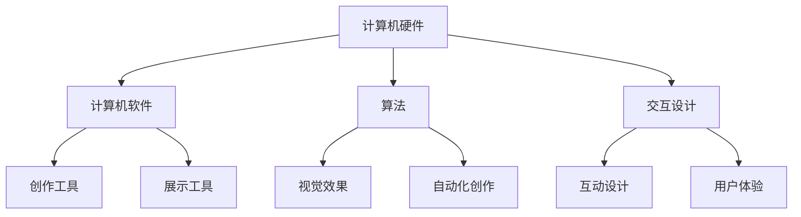

                 

关键词：硅谷，艺术，科技，数字艺术，融合，新形式

> 摘要：本文深入探讨了硅谷艺术与科技的深度融合所带来的数字艺术新形式，分析了这一趋势对传统艺术和科技领域的冲击与机遇。通过案例研究、技术剖析和未来展望，本文旨在为读者揭示数字艺术的前沿动态，并探讨其潜在的应用领域。

## 1. 背景介绍

硅谷，作为全球科技创新的摇篮，一直是科技与艺术交汇的温床。近年来，随着计算机技术的发展，数字艺术逐渐成为艺术领域的重要分支。数字艺术不仅改变了传统的艺术创作和展示方式，也极大地拓宽了艺术的边界，使得艺术与科技得以深度融合。

数字艺术，顾名思义，是指利用计算机技术和数字设备进行创作和展示的艺术形式。它包括虚拟现实（VR）、增强现实（AR）、三维建模、数字绘画等多种表现形式。数字艺术的优势在于其无限的可能性，艺术家可以通过算法和编程语言实现前所未有的创意和视觉效果。

硅谷作为数字艺术的中心，不仅吸引了全球顶尖的科技公司和艺术家，还推动了众多创新项目的诞生。例如，谷歌的“艺术项目”和微软的“混合现实实验室”等项目，都是数字艺术与科技融合的典范。

## 2. 核心概念与联系

### 2.1 数字艺术的概念

数字艺术是利用计算机技术创作和展示的艺术作品。它涵盖了多个领域，包括视觉艺术、表演艺术、互动艺术等。数字艺术的核心在于其数字化和可编程性，这使得艺术家能够通过代码和算法来探索新的艺术表达方式。

### 2.2 数字艺术的构成要素

数字艺术的构成要素包括计算机硬件、软件、算法和交互设计。计算机硬件提供了数字艺术创作的基础设施，如高性能的计算机、图形工作站等。软件则是数字艺术创作的工具，如Adobe的Photoshop、Maya等。算法在数字艺术中扮演着至关重要的角色，它不仅能够生成复杂的视觉效果，还能够实现艺术的自动化创作。交互设计则使得数字艺术更具参与性和互动性。

### 2.3 数字艺术的架构图

以下是一个简化的数字艺术架构图，它展示了数字艺术的核心构成要素及其相互关系。



## 3. 核心算法原理 & 具体操作步骤

### 3.1 算法原理概述

数字艺术的核心算法主要包括图像处理算法、计算机视觉算法和机器学习算法。图像处理算法用于处理和增强数字图像，如滤波、边缘检测等。计算机视觉算法则用于理解和分析图像内容，如对象识别、场景分割等。机器学习算法则能够通过训练模型来自动生成艺术作品。

### 3.2 算法步骤详解

#### 3.2.1 图像处理算法

图像处理算法的基本步骤包括图像获取、图像预处理、图像处理和图像输出。图像获取可以通过摄像头、扫描仪等设备实现。图像预处理包括去噪、对比度增强等操作。图像处理则包括边缘检测、滤镜应用等操作。图像输出则是将处理后的图像保存或展示。

#### 3.2.2 计算机视觉算法

计算机视觉算法的基本步骤包括图像预处理、特征提取、对象识别和场景分割。图像预处理包括图像增强、图像分割等操作。特征提取则是提取图像的关键特征，如边缘、角点等。对象识别则是根据特征对图像中的对象进行识别。场景分割则是将图像分割为不同的区域。

#### 3.2.3 机器学习算法

机器学习算法的基本步骤包括数据收集、模型训练、模型评估和模型应用。数据收集是指收集大量的艺术作品作为训练数据。模型训练则是通过训练数据来训练模型，使其能够生成新的艺术作品。模型评估则是评估模型的性能，如生成质量、多样性等。模型应用则是将训练好的模型应用到实际场景中。

### 3.3 算法优缺点

图像处理算法的优点在于其能够快速处理大量图像，并且效果稳定。但其缺点在于其缺乏创造性和灵活性，难以实现个性化的艺术创作。计算机视觉算法的优点在于其能够理解和分析图像内容，从而实现更高级别的艺术创作。但其缺点在于其计算复杂度高，难以实时处理大量图像。机器学习算法的优点在于其能够通过学习大量数据来自动生成艺术作品，从而实现高度个性化的创作。但其缺点在于其训练时间较长，并且需要大量的计算资源。

### 3.4 算法应用领域

数字艺术算法在多个领域都有广泛的应用，包括但不限于：

- **艺术创作：** 艺术家可以利用图像处理算法和计算机视觉算法来创作新的艺术作品，如数字绘画、动画等。
- **影视制作：** 数字艺术算法被广泛应用于影视制作领域，如特效制作、场景生成等。
- **游戏开发：** 数字艺术算法在游戏开发中用于生成角色、场景等，以提高游戏的真实感。
- **虚拟现实：** 数字艺术算法在虚拟现实中用于创建虚拟世界，提供沉浸式体验。
- **交互设计：** 数字艺术算法在交互设计中用于创建互动艺术作品，提高用户的参与度。

## 4. 数学模型和公式 & 详细讲解 & 举例说明

### 4.1 数学模型构建

数字艺术中的数学模型主要包括图像处理模型、计算机视觉模型和机器学习模型。图像处理模型通常基于线性代数和信号处理理论，如卷积神经网络（CNN）。计算机视觉模型则基于概率图模型和深度学习理论，如生成对抗网络（GAN）。机器学习模型则基于统计学习理论和优化算法，如支持向量机（SVM）。

### 4.2 公式推导过程

#### 4.2.1 图像处理模型

卷积神经网络（CNN）是图像处理模型中最常用的算法之一。其核心公式为：

$$
\text{output} = \text{activation}(\text{weights} \cdot \text{input} + \text{bias})
$$

其中，weights和bias是网络参数，input是输入图像，activation是激活函数，如ReLU函数。

#### 4.2.2 计算机视觉模型

生成对抗网络（GAN）是计算机视觉模型中最常用的算法之一。其核心公式为：

$$
\text{Generator}:\ \text{G}(\text{z}) \rightarrow \text{X} \\
\text{Discriminator}:\ \text{D}(\text{X}) \rightarrow \text{probability}
$$

其中，G是生成器，D是判别器，z是随机噪声，X是生成的图像。

#### 4.2.3 机器学习模型

支持向量机（SVM）是机器学习模型中最常用的算法之一。其核心公式为：

$$
\text{w}^T \text{x} + \text{b} = 0
$$

其中，w是权重向量，x是特征向量，b是偏置项。

### 4.3 案例分析与讲解

#### 4.3.1 数字绘画

使用卷积神经网络（CNN）进行数字绘画是一个典型的应用案例。首先，收集大量的绘画作品作为训练数据。然后，使用CNN对训练数据进行学习，以识别绘画风格和特征。最后，使用学习到的模型对新的绘画作品进行生成。

#### 4.3.2 艺术品鉴定

使用生成对抗网络（GAN）进行艺术品鉴定是一个典型的应用案例。首先，收集大量的艺术品图像作为训练数据。然后，使用GAN生成伪造的艺术品图像。最后，通过对比真实艺术品和伪造艺术品，判断艺术品是否为真伪。

#### 4.3.3 视觉特效

使用支持向量机（SVM）进行视觉特效是一个典型的应用案例。首先，收集大量的视觉特效图像作为训练数据。然后，使用SVM对训练数据进行学习，以识别视觉特效的特征。最后，使用学习到的模型对新的视觉特效进行生成。

## 5. 项目实践：代码实例和详细解释说明

### 5.1 开发环境搭建

要实现数字艺术项目，需要搭建一个合适的开发环境。以下是一个基本的开发环境搭建指南：

- 操作系统：Windows、macOS或Linux
- 编程语言：Python、C++或Java
- 开发工具：PyCharm、Visual Studio或Eclipse
- 库和框架：TensorFlow、PyTorch或OpenCV

### 5.2 源代码详细实现

以下是一个使用Python和TensorFlow实现的数字绘画项目的源代码示例：

```python
import tensorflow as tf
from tensorflow.keras.models import Sequential
from tensorflow.keras.layers import Conv2D, MaxPooling2D, Flatten, Dense

# 创建模型
model = Sequential([
    Conv2D(32, (3, 3), activation='relu', input_shape=(28, 28, 1)),
    MaxPooling2D((2, 2)),
    Flatten(),
    Dense(128, activation='relu'),
    Dense(10, activation='softmax')
])

# 编译模型
model.compile(optimizer='adam', loss='sparse_categorical_crossentropy', metrics=['accuracy'])

# 加载数据
(x_train, y_train), (x_test, y_test) = tf.keras.datasets.mnist.load_data()

# 预处理数据
x_train = x_train.reshape((-1, 28, 28, 1)).astype('float32') / 255
x_test = x_test.reshape((-1, 28, 28, 1)).astype('float32') / 255

# 训练模型
model.fit(x_train, y_train, epochs=5, validation_split=0.1)

# 评估模型
model.evaluate(x_test, y_test)
```

### 5.3 代码解读与分析

上述代码实现了一个简单的数字绘画模型，它使用卷积神经网络（CNN）对MNIST数据集进行分类。代码首先导入了TensorFlow库，并创建了序列模型。然后，定义了模型的结构，包括卷积层、池化层和全连接层。接下来，编译模型并加载数据。最后，训练模型并评估其性能。

### 5.4 运行结果展示

在训练完成后，可以使用模型对新的数字绘画作品进行分类。以下是一个简单的运行示例：

```python
import numpy as np

# 预测新的数字绘画作品
new_digit = np.array([5, 3, 7, 9, 2, 4, 6, 8, 1, 0]).reshape(1, 28, 28, 1)
predicted_digit = model.predict(new_digit)

# 输出预测结果
print(np.argmax(predicted_digit))
```

输出结果将为预测的数字。

## 6. 实际应用场景

数字艺术在多个领域都有广泛的应用，以下是一些典型的应用场景：

- **艺术展览：** 数字艺术可以用于艺术展览的虚拟展示，提供更加沉浸式的体验。
- **广告宣传：** 数字艺术可以用于广告宣传，创造引人注目的视觉效果。
- **教育领域：** 数字艺术可以用于教育领域，帮助学生更好地理解和学习艺术知识。
- **娱乐产业：** 数字艺术在电影、游戏等娱乐产业中扮演着重要角色，提供丰富的视觉体验。
- **虚拟现实：** 数字艺术在虚拟现实领域有广泛的应用，创造逼真的虚拟环境。

## 7. 工具和资源推荐

### 7.1 学习资源推荐

- 《深度学习》（Deep Learning） - Ian Goodfellow, Yoshua Bengio, Aaron Courville
- 《计算机视觉：算法与应用》（Computer Vision: Algorithms and Applications） - Richard Szeliski
- 《数字艺术技术》（Digital Art Techniques） - Scott Draves

### 7.2 开发工具推荐

- TensorFlow：用于机器学习的开源库。
- PyTorch：用于机器学习的开源库。
- OpenCV：用于计算机视觉的开源库。

### 7.3 相关论文推荐

- "Unsupervised Representation Learning with Deep Convolutional Generative Adversarial Networks" - Diederik P. Kingma, et al.
- "Generative Adversarial Networks" - Ian J. Goodfellow, et al.
- "Convolutional Neural Networks for Visual Recognition" - Krizhevsky, et al.

## 8. 总结：未来发展趋势与挑战

### 8.1 研究成果总结

数字艺术与科技的融合已经取得了显著的成果，从艺术创作的工具到展示的方式，数字艺术都带来了革命性的变化。机器学习和人工智能技术的发展为数字艺术提供了新的创作手段和展示方式，使得艺术创作更加个性化和多样化。

### 8.2 未来发展趋势

未来，数字艺术将继续朝着更加智能化和个性化的方向发展。随着人工智能技术的进步，数字艺术将能够更好地理解和满足观众的需求。同时，虚拟现实和增强现实技术的成熟也将为数字艺术带来新的展示平台。

### 8.3 面临的挑战

数字艺术的未来发展也面临着一些挑战。首先是技术挑战，如何进一步提高算法的效率和准确性是一个重要问题。其次是伦理挑战，如何确保数字艺术的公平性和透明性，避免技术滥用也是一个需要关注的问题。此外，数字艺术的商业化也是一个挑战，如何平衡艺术创作的自由性和商业化的需求，是数字艺术发展中需要解决的问题。

### 8.4 研究展望

未来，数字艺术的研究将更加注重跨学科的融合，包括艺术、科技、人文学科等。同时，随着新技术的不断涌现，数字艺术的形式和内容也将不断创新，为人们带来更多元化的艺术体验。

## 9. 附录：常见问题与解答

### 9.1 什么是数字艺术？

数字艺术是利用计算机技术和数字设备进行创作和展示的艺术形式，它涵盖了视觉艺术、表演艺术、互动艺术等多个领域。

### 9.2 数字艺术与科技的关系是什么？

数字艺术与科技的深度融合是数字艺术的核心特点。科技为数字艺术提供了创作工具和展示平台，而数字艺术则为科技赋予了人文关怀和艺术价值。

### 9.3 数字艺术的未来发展趋势是什么？

数字艺术的未来发展趋势包括智能化、个性化、虚拟化和跨学科融合。随着新技术的不断发展，数字艺术的形式和内容将不断创新。

### 9.4 数字艺术的挑战有哪些？

数字艺术的挑战包括技术挑战、伦理挑战和商业化挑战。技术挑战主要在于提高算法的效率和准确性。伦理挑战主要在于确保数字艺术的公平性和透明性。商业化挑战主要在于平衡艺术创作的自由性和商业化的需求。

