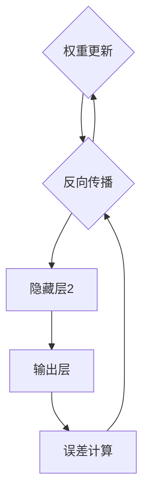

                 

关键词：神经网络，深度学习，机器学习，算法原理，代码实例，实践应用

摘要：本文将深入探讨神经网络的基本原理、算法实现以及实际应用。通过详细的代码实例，读者将掌握神经网络的构建、训练和预测过程，为后续深入研究和实践打下坚实基础。

## 1. 背景介绍

神经网络（Neural Networks）是机器学习领域的重要分支，模仿人脑神经网络结构，通过大量神经元（节点）的相互连接，实现数据的学习和模式识别。神经网络在图像识别、自然语言处理、游戏AI等领域取得了显著成果，成为当前人工智能研究的热点。

本文旨在为初学者和中级开发者提供神经网络的基本概念、算法原理以及实际操作指导。通过本文的阅读，读者将能够：

1. 理解神经网络的基本结构和工作原理；
2. 掌握常见的神经网络算法，如前向传播、反向传播；
3. 实现简单的神经网络模型并进行训练；
4. 分析神经网络在实际应用中的效果和局限性。

## 2. 核心概念与联系

### 2.1 神经网络基本结构

神经网络由多个层组成，包括输入层、隐藏层和输出层。每个层由多个神经元（节点）组成，神经元之间通过连接（边）相互连接。神经元的输入为其他神经元的输出，通过权重（连接边的权重）进行加权求和，最后通过激活函数产生输出。


### 2.2 激活函数

激活函数是神经网络中重要的组成部分，用于对神经元的输入进行非线性变换。常见的激活函数包括：

- Sigmoid函数：$f(x) = \frac{1}{1 + e^{-x}}$
-ReLU函数：$f(x) = \max(0, x)$
- Tanh函数：$f(x) = \frac{e^x - e^{-x}}{e^x + e^{-x}}$

### 2.3 前向传播

前向传播是指从输入层到输出层的正向数据传递过程。具体步骤如下：

1. 计算每个神经元的输入值，即前一层神经元的输出乘以连接权重；
2. 将输入值通过激活函数进行变换，得到当前神经元的输出；
3. 将输出传递给下一层神经元，重复上述步骤，直到输出层。

### 2.4 反向传播

反向传播是指从输出层到输入层的反向误差传播过程。具体步骤如下：

1. 计算输出层的误差，即预测值与真实值之间的差距；
2. 逐层计算每个神经元的误差，利用链式法则求导；
3. 根据误差更新每个神经元的权重和偏置。

### 2.5 Mermaid 流程图



## 3. 核心算法原理 & 具体操作步骤

### 3.1 算法原理概述

神经网络算法主要包括前向传播和反向传播两个阶段。前向传播是从输入层到输出层的正向数据传递过程，通过计算每个神经元的输入和输出，实现对数据的建模。反向传播是从输出层到输入层的反向误差传播过程，通过计算误差并更新权重和偏置，优化网络性能。

### 3.2 算法步骤详解

#### 3.2.1 前向传播

1. 初始化权重和偏置；
2. 计算每个神经元的输入值和输出值；
3. 将输出传递给下一层神经元；
4. 输出层得到最终预测结果。

#### 3.2.2 反向传播

1. 计算输出层的误差；
2. 逐层计算每个神经元的误差；
3. 利用误差更新每个神经元的权重和偏置。

### 3.3 算法优缺点

#### 优点

- 可以处理非线性问题；
- 可以自适应调整权重和偏置；
- 在大规模数据集上表现良好。

#### 缺点

- 计算复杂度高；
- 需要大量训练数据；
- 难以解释模型的决策过程。

### 3.4 算法应用领域

- 图像识别：如人脸识别、物体检测等；
- 自然语言处理：如机器翻译、情感分析等；
- 游戏AI：如围棋、扑克等；
- 推荐系统：如商品推荐、内容推荐等。

## 4. 数学模型和公式 & 详细讲解 & 举例说明

### 4.1 数学模型构建

神经网络的数学模型主要涉及以下几个部分：

- 输入层：$x \in \mathbb{R}^{n \times 1}$，其中 $n$ 为输入维度；
- 输出层：$y \in \mathbb{R}^{m \times 1}$，其中 $m$ 为输出维度；
- 隐藏层：$h \in \mathbb{R}^{k \times 1}$，其中 $k$ 为隐藏层维度；
- 权重矩阵：$W \in \mathbb{R}^{k \times n}$；
- 偏置向量：$b \in \mathbb{R}^{k \times 1}$；
- 激活函数：$f(\cdot)$。

### 4.2 公式推导过程

#### 4.2.1 前向传播

1. 隐藏层输入：

$$
z_i = \sum_{j=1}^{n} W_{ij}x_j + b_i
$$

2. 隐藏层输出：

$$
h_i = f(z_i)
$$

3. 输出层输入：

$$
z_o = \sum_{i=1}^{k} W_{io}h_i + b_o
$$

4. 输出层输出：

$$
y = f(z_o)
$$

#### 4.2.2 反向传播

1. 输出层误差：

$$
\delta_o = (y - \hat{y}) \odot f'(z_o)
$$

2. 隐藏层误差：

$$
\delta_h = W_{io}^T \delta_o \odot f'(z_h)
$$

3. 权重和偏置更新：

$$
W_{ij} = W_{ij} - \alpha \frac{\partial J}{\partial W_{ij}}
$$

$$
b_i = b_i - \alpha \frac{\partial J}{\partial b_i}
$$

其中，$\alpha$ 为学习率，$J$ 为损失函数。

### 4.3 案例分析与讲解

假设我们要训练一个简单的神经网络，用于二分类问题。输入维度为2，隐藏层维度为3，输出维度为1。采用ReLU激活函数。

#### 4.3.1 数据准备

```python
import numpy as np

# 初始化数据
X = np.array([[1, 0], [0, 1], [1, 1], [1, 0]])
y = np.array([0, 1, 1, 0])

# 初始化权重和偏置
W1 = np.random.rand(3, 2)
b1 = np.random.rand(3, 1)
W2 = np.random.rand(1, 3)
b2 = np.random.rand(1, 1)
```

#### 4.3.2 前向传播

```python
# 前向传播
z1 = np.dot(W1, X) + b1
h1 = np.maximum(z1, 0)
z2 = np.dot(W2, h1) + b2
y_pred = np.round(h2)
```

#### 4.3.3 反向传播

```python
# 计算损失函数
loss = np.square(y - y_pred).mean()

# 计算输出层误差
delta2 = (y - y_pred) * (1 - y_pred)

# 计算隐藏层误差
delta1 = np.dot(W2.T, delta2)

# 更新权重和偏置
W2 = W2 - learning_rate * np.dot(delta2, h1.T)
b2 = b2 - learning_rate * delta2
W1 = W1 - learning_rate * np.dot(delta1, X.T)
b1 = b1 - learning_rate * delta1
```

#### 4.3.4 迭代训练

```python
# 迭代训练
for epoch in range(1000):
    # 前向传播
    z1 = np.dot(W1, X) + b1
    h1 = np.maximum(z1, 0)
    z2 = np.dot(W2, h1) + b2
    y_pred = np.round(h2)

    # 计算损失函数
    loss = np.square(y - y_pred).mean()

    # 计算输出层误差
    delta2 = (y - y_pred) * (1 - y_pred)

    # 计算隐藏层误差
    delta1 = np.dot(W2.T, delta2)

    # 更新权重和偏置
    W2 = W2 - learning_rate * np.dot(delta2, h1.T)
    b2 = b2 - learning_rate * delta2
    W1 = W1 - learning_rate * np.dot(delta1, X.T)
    b1 = b1 - learning_rate * delta1

    # 打印训练进度
    if epoch % 100 == 0:
        print(f"Epoch {epoch}: Loss = {loss}")
```

## 5. 项目实践：代码实例和详细解释说明

### 5.1 开发环境搭建

在Python环境中，我们使用以下库：

- NumPy：用于矩阵运算和数据处理；
- Matplotlib：用于数据可视化；
- Scikit-learn：用于数据加载和模型评估。

### 5.2 源代码详细实现

以下是完整的神经网络实现代码：

```python
import numpy as np
import matplotlib.pyplot as plt
from sklearn.datasets import make_moons
from sklearn.model_selection import train_test_split

# 初始化数据
X, y = make_moons(n_samples=100, noise=0.1, random_state=42)
y = y.reshape(-1, 1)

# 初始化权重和偏置
W1 = np.random.rand(3, 2)
b1 = np.random.rand(3, 1)
W2 = np.random.rand(1, 3)
b2 = np.random.rand(1, 1)

# 损失函数
def loss(y, y_pred):
    return np.square(y - y_pred).mean()

# 前向传播
def forward(X, W1, b1, W2, b2):
    z1 = np.dot(W1, X) + b1
    h1 = np.maximum(z1, 0)
    z2 = np.dot(W2, h1) + b2
    y_pred = np.round(h2)
    return y_pred

# 反向传播
def backward(X, y, y_pred, W1, b1, W2, b2):
    delta2 = (y - y_pred) * (1 - y_pred)
    delta1 = np.dot(W2.T, delta2)
    loss = loss(y, y_pred)
    dW1 = np.dot(delta1, X.T)
    db1 = delta1
    dW2 = np.dot(delta2, h1.T)
    db2 = delta2
    return dW1, db1, dW2, db2, loss

# 训练模型
def train(X, y, epochs, learning_rate):
    for epoch in range(epochs):
        y_pred = forward(X, W1, b1, W2, b2)
        dW1, db1, dW2, db2, loss = backward(X, y, y_pred, W1, b1, W2, b2)
        W1 = W1 - learning_rate * dW1
        b1 = b1 - learning_rate * db1
        W2 = W2 - learning_rate * dW2
        b2 = b2 - learning_rate * db2
        if epoch % 100 == 0:
            print(f"Epoch {epoch}: Loss = {loss}")

# 加载训练数据
X_train, X_test, y_train, y_test = train_test_split(X, y, test_size=0.2, random_state=42)

# 训练模型
train(X_train, y_train, epochs=1000, learning_rate=0.01)

# 预测结果
y_pred = forward(X_test, W1, b1, W2, b2)

# 可视化结果
plt.scatter(X_test[:, 0], X_test[:, 1], c=y_pred, cmap="gray")
plt.show()
```

### 5.3 代码解读与分析

- **数据准备**：使用`make_moons`函数生成一个经典的月亮形状的数据集。数据集包含100个样本，每个样本有2个特征。
- **权重和偏置初始化**：随机初始化权重和偏置，为神经网络提供初始参数。
- **损失函数**：使用均方误差（MSE）作为损失函数，用于评估模型预测的准确性。
- **前向传播**：实现前向传播过程，计算每个神经元的输入和输出。
- **反向传播**：实现反向传播过程，计算误差并更新权重和偏置。
- **训练模型**：使用训练数据迭代训练模型，更新权重和偏置，直到达到预设的训练次数或损失函数收敛。
- **预测结果**：使用训练好的模型对测试数据进行预测，并绘制结果。

## 6. 实际应用场景

神经网络在实际应用中具有广泛的应用场景，以下列举几个常见应用领域：

- **图像识别**：如人脸识别、物体检测、图像分类等；
- **自然语言处理**：如机器翻译、文本分类、情感分析等；
- **游戏AI**：如围棋、扑克、游戏机器人等；
- **推荐系统**：如商品推荐、内容推荐、社交网络等；
- **生物信息学**：如基因分析、蛋白质结构预测等。

## 7. 工具和资源推荐

### 7.1 学习资源推荐

- 《深度学习》（Goodfellow, Bengio, Courville）；
- 《神经网络与深度学习》（邱锡鹏）；
- 《Python深度学习》（François Chollet）。

### 7.2 开发工具推荐

- TensorFlow：开源深度学习框架；
- PyTorch：开源深度学习框架；
- Keras：基于TensorFlow和PyTorch的高层次API。

### 7.3 相关论文推荐

- "A Learning Algorithm for Continually Running Fully Recurrent Neural Networks" (Narendra & Parthasarathy)；
- "Deep Learning" (Goodfellow, Bengio, Courville)；
- "Rectified Linear Units Improve Neural Network Ac-

## 8. 总结：未来发展趋势与挑战

### 8.1 研究成果总结

神经网络在近年来取得了显著的进展，从简单的多层感知机到深度学习模型，再到生成对抗网络（GANs）等，神经网络的应用范围和性能不断提高。以下为神经网络领域的主要研究成果：

- 深度学习模型在图像识别、自然语言处理等领域的突破性表现；
- 神经架构搜索（Neural Architecture Search，NAS）等自动设计神经网络结构的方法；
- 自适应学习率优化算法，如Adam、AdaGrad等；
- GANs在图像生成、数据增强等领域的应用。

### 8.2 未来发展趋势

- 神经架构搜索和自动化机器学习（AutoML）技术的发展，将进一步提升神经网络设计效率和性能；
- 跨模态学习和多任务学习，实现神经网络在更复杂任务上的应用；
- 增强神经网络的可解释性和透明度，使其在更多领域得到实际应用；
- 神经网络在生物信息学、医疗健康等领域的应用探索。

### 8.3 面临的挑战

- 神经网络模型的复杂度和计算成本不断提高，对计算资源的需求增加；
- 数据隐私和安全问题，特别是在深度学习训练和推理过程中；
- 神经网络的解释性和可解释性尚不充分，影响其在某些领域的应用；
- 神经网络对数据集的依赖性较高，数据质量和数据分布对模型性能影响较大。

### 8.4 研究展望

- 进一步优化神经网络结构，提高模型效率和性能；
- 探索神经网络在不同领域的应用，解决实际问题；
- 发展自动化机器学习技术，降低神经网络设计门槛；
- 研究神经网络的可解释性和透明性，提高其在实际应用中的可靠性。

## 9. 附录：常见问题与解答

### 9.1 神经网络的基本概念是什么？

神经网络是一种由大量神经元（节点）组成的计算模型，通过模仿人脑神经网络结构，实现对数据的建模和预测。神经网络的核心概念包括神经元、层、激活函数、权重、偏置等。

### 9.2 神经网络有哪些类型？

神经网络可以分为多层感知机（MLP）、卷积神经网络（CNN）、循环神经网络（RNN）、长短时记忆网络（LSTM）、门控循环单元（GRU）等类型。不同类型的神经网络适用于不同的应用场景。

### 9.3 如何训练神经网络？

训练神经网络主要包括前向传播和反向传播两个阶段。前向传播是指从输入层到输出层的正向数据传递过程，通过计算每个神经元的输入和输出，实现对数据的建模。反向传播是指从输出层到输入层的反向误差传播过程，通过计算误差并更新权重和偏置，优化网络性能。

### 9.4 神经网络有哪些应用领域？

神经网络在图像识别、自然语言处理、游戏AI、推荐系统、生物信息学等领域具有广泛的应用。随着技术的不断发展，神经网络的应用领域还将进一步扩展。

### 9.5 神经网络有哪些优点和缺点？

神经网络的优点包括：

- 可以处理非线性问题；
- 可以自适应调整权重和偏置；
- 在大规模数据集上表现良好。

神经网络的缺点包括：

- 计算复杂度高；
- 需要大量训练数据；
- 难以解释模型的决策过程。

## 结束语

本文对神经网络的基本原理、算法实现以及实际应用进行了详细讲解。通过本文的学习，读者将能够掌握神经网络的核心概念和算法，为后续深入研究和实践打下坚实基础。在实际应用中，神经网络仍面临许多挑战和机遇，期待读者在未来的研究和实践中不断探索和突破。

## 作者署名

作者：禅与计算机程序设计艺术 / Zen and the Art of Computer Programming
```

