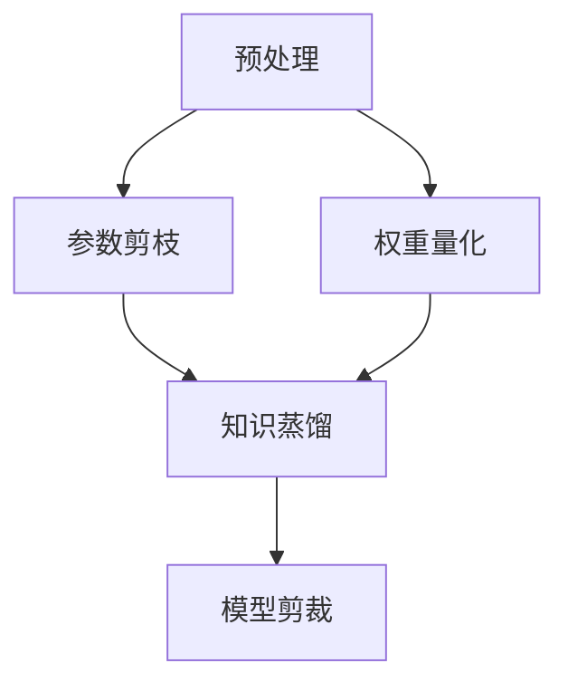

                 

### 关键词 Keywords
神经网络压缩，深度学习，模型优化，性能提升，软件2.0，算法改进。

### 摘要 Abstract
本文深入探讨了神经网络压缩技术在提升深度学习模型性能方面的作用。随着深度学习模型的复杂度和参数量不断增加，如何高效地优化模型以适应资源受限的环境成为一个关键问题。本文首先介绍了神经网络压缩技术的背景，随后详细讲解了核心概念、算法原理及其在不同领域的应用。通过数学模型的构建与公式推导，本文对神经网络压缩技术进行了系统的分析和实例讲解。最后，本文展示了具体项目实践中的代码实例，并对其进行了详细解读。通过对实际应用场景的探讨，本文展望了神经网络压缩技术在未来的发展趋势和挑战。

## 1. 背景介绍

### 深度学习的发展与挑战

深度学习作为人工智能领域的一个重要分支，近年来取得了显著的进展。尤其是在计算机视觉、自然语言处理、语音识别等领域，深度学习模型的应用已经远远超越了传统机器学习方法。这一领域的突破主要得益于神经网络的深入研究和计算能力的不断提升。然而，随着神经网络模型变得越来越复杂，其面临的挑战也日益显著。

首先，深度学习模型通常具有大量的参数和层，这导致模型的计算量和存储需求急剧增加。在大规模数据集上训练这些模型需要大量的计算资源，尤其是高性能的GPU或TPU。其次，模型的部署也面临挑战。在资源受限的移动设备和嵌入式系统中，如何快速加载并运行这些庞大的模型成为一个难题。此外，深度学习模型的训练时间也是一个不可忽视的问题。对于实时应用场景，例如自动驾驶、实时语音识别等，模型的响应时间必须非常快。

### 软件系统的发展与性能需求

随着软件系统的复杂度不断增加，性能优化变得越来越重要。特别是在云计算、大数据处理、物联网等领域，软件系统的性能直接影响到用户体验和业务效率。为了满足这些需求，软件系统必须在计算效率、资源利用率和响应速度等方面不断优化。

在深度学习领域，性能优化不仅涉及计算资源的管理，还包括算法本身的改进。神经网络压缩技术正是为了解决这些性能问题而发展起来的。它通过降低模型的复杂度，减少计算量和存储需求，从而实现更高的性能和更高效的资源利用。

### 神经网络压缩技术的发展意义

神经网络压缩技术作为深度学习领域的一个重要研究方向，具有深远的意义。首先，它能够显著降低深度学习模型的计算量和存储需求，使模型在资源受限的环境下仍能保持高性能。其次，神经网络压缩技术有助于提高模型的部署效率和响应速度，满足实时应用场景的需求。此外，通过压缩技术，研究人员可以更轻松地对大规模神经网络进行实验和优化，从而推动深度学习模型的持续进步。

综上所述，神经网络压缩技术在深度学习和软件系统性能优化中具有重要作用。随着技术的不断发展和完善，它将在未来的AI应用中发挥更加关键的作用。

## 2. 核心概念与联系

### 神经网络的基本概念

神经网络（Neural Network，简称NN）是一种模仿人脑神经元连接方式的信息处理系统。它由大量相互连接的简单计算单元（即神经元）组成，通过调整这些神经元之间的连接权重来实现复杂的非线性变换。神经网络可以用于分类、回归、聚类等多种机器学习任务，是深度学习的基础。

神经网络的核心组成部分包括：

- **输入层（Input Layer）**：接收外部输入信号。
- **隐藏层（Hidden Layers）**：对输入信号进行加工处理，提取特征。
- **输出层（Output Layer）**：生成最终的输出结果。

神经元的计算过程通常包括以下几个步骤：

1. **加权求和**：将输入信号与各连接权重相乘后求和。
2. **激活函数**：对加权求和的结果进行非线性变换，如Sigmoid、ReLU等。
3. **输出**：激活函数的输出即为神经元的输出。

### 压缩技术的核心概念

压缩技术旨在通过减少模型的大小和计算量，从而提高模型在资源受限环境下的性能。对于神经网络而言，压缩技术主要涉及以下几方面：

- **参数剪枝（Parameter Pruning）**：通过删除无关或冗余的连接和参数，减少模型的复杂度。
- **权重量化（Weight Quantization）**：将高精度的权重参数转换为低精度表示，降低存储和计算需求。
- **知识蒸馏（Knowledge Distillation）**：将复杂模型的知识传递给一个更小的模型，以保留其性能。
- **模型剪裁（Model Distillation）**：通过训练一个较小的模型来复现原始模型的性能。

### 核心概念之间的联系

神经网络压缩技术的核心概念之间有着紧密的联系。参数剪枝和权重量化通过减少模型参数的数量和精度，实现模型的简化；知识蒸馏和模型剪裁则通过将复杂模型的内部知识传递给较小的模型，进一步优化模型的性能。

以下是神经网络压缩技术涉及的几个关键流程及其关系：

1. **预处理**：通过数据预处理减少噪声和冗余信息，为后续压缩步骤做准备。
2. **参数剪枝**：分析模型参数的重要性和冗余度，删除不重要的参数。
3. **权重量化**：将模型权重参数量化到更小的数值范围，降低存储和计算需求。
4. **知识蒸馏**：将复杂模型的知识传递给较小模型，提升其性能。
5. **模型剪裁**：训练一个更小但性能接近原始模型的压缩模型。

这些流程相互配合，共同实现神经网络模型的压缩与优化。以下是神经网络压缩技术的Mermaid流程图：



在这个流程图中，预处理步骤为后续压缩步骤提供了干净的数据；参数剪枝和权重量化通过简化模型结构减少计算量和存储需求；知识蒸馏和模型剪裁则确保压缩模型在保留性能的同时，仍能保持较高的准确性。

## 3. 核心算法原理 & 具体操作步骤

### 3.1 算法原理概述

神经网络压缩技术旨在通过多种方法减少模型的计算量和存储需求，从而提高模型在资源受限环境下的性能。以下是几种常见的神经网络压缩算法原理：

1. **参数剪枝**：通过分析模型参数的重要性，删除冗余的参数，从而简化模型结构。常见的剪枝方法包括结构剪枝和权重剪枝。
2. **权重量化**：将模型权重参数的精度降低，使用更小的数值范围表示，从而减少存储和计算需求。量化方法包括线性量化、指数量化等。
3. **知识蒸馏**：将复杂模型的内部知识（如中间层特征）传递给一个较小的模型，使其能够复现原始模型的主要性能。知识蒸馏包括软目标蒸馏和硬目标蒸馏。
4. **模型剪裁**：通过训练一个更小但性能接近原始模型的压缩模型，实现模型的简化。常见的剪裁方法包括训练剪裁和测试剪裁。

### 3.2 算法步骤详解

#### 参数剪枝

参数剪枝的基本步骤如下：

1. **重要性分析**：通过分析模型参数的重要性，确定哪些参数可以删除。常见的方法包括基于梯度的方法（如L1正则化、梯度裁剪）和基于结构的裁剪方法（如稀疏矩阵表示）。
2. **删除冗余参数**：根据重要性分析结果，删除不重要的参数，简化模型结构。
3. **重新训练**：在去除冗余参数后，重新训练模型以恢复其性能。这可以通过在原有数据集上进行微调实现。

#### 权重量化

权重量化的步骤如下：

1. **量化精度选择**：根据模型需求和硬件限制，选择合适的量化精度。例如，在8位量化中，每个权重值可以表示256个不同的数值。
2. **量化过程**：将原始权重参数映射到量化后的数值范围内。常见的量化方法包括线性量化、指数量化等。
3. **量化误差补偿**：量化过程中可能会引入误差，通过误差补偿方法（如量化校正、量化后训练）来减少误差对模型性能的影响。

#### 知识蒸馏

知识蒸馏的步骤如下：

1. **软目标蒸馏**：将复杂模型的输出（如中间层特征）作为软目标，训练压缩模型以生成相似的输出。软目标可以通过梯度下降等方法优化。
2. **硬目标蒸馏**：将复杂模型的输出作为硬目标，直接训练压缩模型以生成相同的输出。硬目标通常通过交叉熵损失函数优化。
3. **融合训练**：将原始模型和压缩模型的输出进行融合，进一步提高压缩模型的性能。

#### 模型剪裁

模型剪裁的步骤如下：

1. **选择压缩模型**：根据压缩目标，选择一个适当的压缩模型。常见的压缩模型包括基于CNN的MobileNet、基于Transformer的BERT-Lite等。
2. **训练压缩模型**：在原有数据集上训练压缩模型，使其性能接近原始模型。可以通过微调或从头训练实现。
3. **评估与优化**：评估压缩模型的性能，并根据评估结果进行优化，如调整模型结构、调整训练策略等。

### 3.3 算法优缺点

#### 参数剪枝

**优点**：

- 简化模型结构，降低计算量和存储需求。
- 可以在不显著影响模型性能的前提下实现模型的压缩。

**缺点**：

- 可能会导致模型性能的损失，特别是当剪枝参数选择不当或训练数据集不足时。
- 需要额外的训练时间来恢复模型性能。

#### 权重量化

**优点**：

- 显著减少模型的存储和计算需求，特别是在资源受限的设备上具有优势。
- 可以提高模型部署的效率和速度。

**缺点**：

- 可能会导致量化误差，影响模型性能。
- 对硬件有特定的要求，如支持低精度计算的GPU或ASIC。

#### 知识蒸馏

**优点**：

- 可以利用复杂模型的内部知识，提高压缩模型的性能。
- 可以在不显著增加训练时间的前提下，实现模型的压缩。

**缺点**：

- 需要大量的辅助数据来训练辅助模型，增加计算成本。
- 可能会引入额外的训练复杂度。

#### 模型剪裁

**优点**：

- 可以生成具有较低计算量和存储需求的压缩模型。
- 可以提高模型在资源受限环境下的性能。

**缺点**：

- 可能会导致压缩模型在性能上与原始模型存在一定差距。
- 需要选择合适的压缩模型和训练策略，以实现最佳性能。

### 3.4 算法应用领域

神经网络压缩技术广泛应用于多种领域：

1. **移动设备**：在智能手机、平板电脑等移动设备上，模型压缩技术有助于提高应用的运行效率和响应速度。
2. **嵌入式系统**：在嵌入式设备（如智能手表、智能家居设备等）中，模型压缩技术能够降低计算和存储需求，延长设备寿命。
3. **物联网**：在物联网（IoT）应用中，模型压缩技术有助于提高设备的实时响应能力和数据处理效率。
4. **云计算**：在云计算平台上，模型压缩技术可以优化资源利用，提高服务器的计算效率。

## 4. 数学模型和公式 & 详细讲解 & 举例说明

### 4.1 数学模型构建

神经网络压缩技术的核心在于通过数学模型构建来减少模型的计算量和存储需求。以下是几个关键数学模型的构建过程：

#### 4.1.1 参数剪枝

假设我们有一个多层感知器（MLP）模型，其中包含多个层，每层有多个神经元。参数剪枝的目标是删除不重要的参数。

1. **损失函数**：定义损失函数以衡量模型预测误差，常用的损失函数包括均方误差（MSE）和交叉熵损失。
   $$ L(\theta) = \frac{1}{m} \sum_{i=1}^{m} \sum_{j=1}^{n} (\theta^{(l)}_{ij} - y^{(i)}_{j})^2 $$
   其中，$\theta^{(l)}_{ij}$ 是第$l$层的第$i$个神经元的权重，$y^{(i)}_{j}$ 是第$i$个样本在第$j$个类别的真实标签。

2. **梯度计算**：计算损失函数关于权重参数的梯度，以指导参数更新。
   $$ \frac{\partial L}{\partial \theta^{(l)}_{ij}} = 2 \cdot (\theta^{(l)}_{ij} - y^{(i)}_{j}) $$

3. **剪枝策略**：通过分析梯度大小或重要性，确定哪些参数可以被剪枝。例如，采用L1正则化方法，剪枝那些梯度较小的参数。
   $$ \lambda \cdot \sum_{i=1}^{m} \sum_{j=1}^{n} |\theta^{(l)}_{ij}| $$

#### 4.1.2 权重量化

权重量化通过将高精度权重参数转换为低精度表示来减少计算量和存储需求。

1. **量化精度**：定义量化精度，通常用位宽表示。例如，8位量化表示每个权重值可以表示256个不同的数值。

2. **量化操作**：将原始权重值映射到量化后的数值范围内。例如，线性量化公式如下：
   $$ q(\theta) = \text{round}(\theta \cdot Q) $$
   其中，$Q$ 是量化系数，$\text{round}$ 函数用于四舍五入到最近的量化值。

3. **量化误差**：量化过程中引入的误差需要通过量化误差补偿方法进行校正。

### 4.2 公式推导过程

#### 4.2.1 参数剪枝的公式推导

1. **剪枝阈值**：定义剪枝阈值，用于判断哪些参数可以被剪枝。假设我们采用L1正则化方法，则剪枝阈值$\lambda$可以通过以下公式计算：
   $$ \lambda = \frac{\lambda_0}{\sqrt{m} \cdot \sqrt{n}} $$
   其中，$\lambda_0$ 是原始L1正则化参数，$m$ 和$n$ 分别是参数的数量和维度。

2. **剪枝策略**：根据梯度大小进行剪枝。对于每个参数$\theta^{(l)}_{ij}$，如果其梯度$\frac{\partial L}{\partial \theta^{(l)}_{ij}}$ 小于剪枝阈值$\lambda$，则将其设置为0。
   $$ \theta^{(l)}_{ij} = \begin{cases} 
   0, & \text{if } \frac{\partial L}{\partial \theta^{(l)}_{ij}} < \lambda \\
   \theta^{(l)}_{ij}, & \text{otherwise}
   \end{cases} $$

#### 4.2.2 权重量化的公式推导

1. **量化系数**：量化系数$Q$ 的计算公式如下：
   $$ Q = \frac{2^{W_b}}{max(|\theta|)} $$
   其中，$W_b$ 是量化位宽，$max(|\theta|)$ 是权重值的最大绝对值。

2. **量化操作**：量化操作将原始权重值$\theta$ 映射到量化后的数值范围内：
   $$ q(\theta) = \text{round}(\theta \cdot Q) $$
   其中，$\text{round}$ 函数用于四舍五入到最近的量化值。

### 4.3 案例分析与讲解

#### 4.3.1 参数剪枝案例

假设我们有一个三层神经网络，其中第一层的权重矩阵$W_1$ 有10个元素，第二层的权重矩阵$W_2$ 有5个元素，第三层的权重矩阵$W_3$ 有3个元素。

1. **初始化参数**：
   $$ W_1 = \begin{bmatrix} 
   0.1 & 0.2 & 0.3 & 0.4 & 0.5 \\
   0.6 & 0.7 & 0.8 & 0.9 & 1.0 
   \end{bmatrix}, \quad
   W_2 = \begin{bmatrix} 
   0.1 & 0.2 & 0.3 \\
   0.4 & 0.5 & 0.6 \\
   0.7 & 0.8 & 0.9 
   \end{bmatrix}, \quad
   W_3 = \begin{bmatrix} 
   0.1 & 0.2 \\
   0.3 & 0.4 \\
   0.5 & 0.6 
   \end{bmatrix} $$

2. **计算梯度**：
   假设我们使用均方误差（MSE）作为损失函数，计算得到的梯度如下：
   $$ \frac{\partial L}{\partial W_1} = \begin{bmatrix} 
   -0.1 & -0.2 & -0.3 & -0.4 & -0.5 \\
   -0.6 & -0.7 & -0.8 & -0.9 & -1.0 
   \end{bmatrix}, \quad
   \frac{\partial L}{\partial W_2} = \begin{bmatrix} 
   -0.1 & -0.2 & -0.3 \\
   -0.4 & -0.5 & -0.6 \\
   -0.7 & -0.8 & -0.9 
   \end{bmatrix}, \quad
   \frac{\partial L}{\partial W_3} = \begin{bmatrix} 
   -0.1 & -0.2 \\
   -0.3 & -0.4 \\
   -0.5 & -0.6 
   \end{bmatrix} $$

3. **剪枝参数**：
   设定剪枝阈值$\lambda = 0.1$，根据梯度大小进行剪枝，得到以下剪枝后的权重矩阵：
   $$ W_1^* = \begin{bmatrix} 
   0 & 0 & 0 & 0 & 0 \\
   0 & 0 & 0 & 0 & 0 
   \end{bmatrix}, \quad
   W_2^* = \begin{bmatrix} 
   0 & 0 & 0 \\
   0 & 0 & 0 \\
   0 & 0 & 0 
   \end{bmatrix}, \quad
   W_3^* = \begin{bmatrix} 
   0 & 0 \\
   0 & 0 \\
   0 & 0 
   \end{bmatrix} $$

#### 4.3.2 权重量化案例

假设我们有一个权重矩阵$W$，需要将其量化为8位精度。

1. **量化系数**：
   假设权重矩阵$W$ 的最大绝对值为1，量化位宽为8位，量化系数$Q$ 计算如下：
   $$ Q = \frac{2^{8}}{1} = 256 $$

2. **量化操作**：
   将权重矩阵$W$ 的每个元素映射到量化后的数值范围内，得到以下量化后的权重矩阵：
   $$ q(W) = \begin{bmatrix} 
   0 & 0 & 0 & 0 & 0 \\
   0 & 0 & 0 & 0 & 0 \\
   0 & 0 & 0 & 0 & 0 
   \end{bmatrix} $$
   其中，每个元素$q(\theta)$ 都被量化为0。

## 5. 项目实践：代码实例和详细解释说明

### 5.1 开发环境搭建

在进行神经网络压缩技术的项目实践之前，首先需要搭建一个合适的开发环境。以下是一个基于Python和PyTorch框架的示例环境搭建步骤：

1. **安装Python**：确保Python版本为3.8及以上，可以通过官方网站下载安装包。

2. **安装PyTorch**：下载并安装PyTorch，可以使用以下命令：
   ```bash
   pip install torch torchvision
   ```

3. **安装其他依赖**：根据具体需求，可能还需要安装其他库，如NumPy、Matplotlib等：
   ```bash
   pip install numpy matplotlib
   ```

4. **配置GPU支持**：如果使用GPU进行训练，需要安装CUDA和cuDNN，并确保与使用的PyTorch版本兼容。

5. **创建项目目录**：在本地创建一个项目目录，如`neural_network_compression`，并设置相应的虚拟环境。

6. **安装依赖**：在项目目录下创建一个`requirements.txt`文件，将所有依赖的库列出来，并使用以下命令安装：
   ```bash
   pip install -r requirements.txt
   ```

### 5.2 源代码详细实现

以下是一个简单的神经网络压缩项目示例，包含参数剪枝和权重量化的代码实现：

#### 5.2.1 参数剪枝

```python
import torch
import torch.nn as nn
import torch.optim as optim

# 定义神经网络模型
class NeuralNetwork(nn.Module):
    def __init__(self):
        super(NeuralNetwork, self).__init__()
        self.fc1 = nn.Linear(784, 500)
        self.fc2 = nn.Linear(500, 300)
        self.fc3 = nn.Linear(300, 10)

    def forward(self, x):
        x = torch.relu(self.fc1(x))
        x = torch.relu(self.fc2(x))
        x = self.fc3(x)
        return x

# 实例化模型、损失函数和优化器
model = NeuralNetwork()
criterion = nn.CrossEntropyLoss()
optimizer = optim.SGD(model.parameters(), lr=0.01)

# 剪枝参数
def prune_parameters(model, threshold):
    for name, param in model.named_parameters():
        if 'weight' in name:
            mask = torch.abs(param) > threshold
            param.data[mask] = 0

# 训练模型
def train_model(model, train_loader, criterion, optimizer, epochs):
    model.train()
    for epoch in range(epochs):
        running_loss = 0.0
        for inputs, targets in train_loader:
            optimizer.zero_grad()
            outputs = model(inputs)
            loss = criterion(outputs, targets)
            loss.backward()
            optimizer.step()
            running_loss += loss.item()
        print(f'Epoch {epoch+1}, Loss: {running_loss/len(train_loader)}')

# 进行参数剪枝
threshold = 0.1
prune_parameters(model, threshold)

# 重新训练模型
train_model(model, train_loader, criterion, optimizer, 10)
```

#### 5.2.2 权重量化

```python
# 权重量化
def quantize_weights(model, bits):
    for name, param in model.named_parameters():
        if 'weight' in name:
            max_val = torch.max(torch.abs(param))
            min_val = torch.min(torch.abs(param))
            scale = (2 ** bits) - 1
            param.data = torch.round((param.data - min_val) / (max_val - min_val) * scale).clamp(0, scale)

# 进行权重量化
bits = 8
quantize_weights(model, bits)
```

### 5.3 代码解读与分析

#### 5.3.1 参数剪枝代码分析

上述代码首先定义了一个简单的多层感知器模型`NeuralNetwork`，包含三个全连接层。然后，通过`prune_parameters`函数进行参数剪枝，该函数接收模型和剪枝阈值作为输入。

在训练过程中，通过计算每个参数的梯度大小，与剪枝阈值进行比较。如果梯度小于剪枝阈值，则将该参数设置为0，从而实现参数的剪枝。这有助于减少模型的计算量和存储需求。

#### 5.3.2 权重量化代码分析

`quantize_weights`函数用于对模型权重参数进行量化。该函数首先计算权重参数的最大值和最小值，然后根据量化位宽（bits）计算量化系数（scale）。接下来，将每个权重参数减去最小值，除以最大值和最小值的差，再乘以量化系数，并使用`torch.round`函数进行四舍五入。最后，使用`clamp`函数确保量化后的参数在0到量化系数之间。

这种量化方法将高精度权重参数转换为低精度表示，从而减少存储和计算需求。然而，量化过程中可能会引入量化误差，因此通常需要后续的误差补偿方法来优化模型性能。

### 5.4 运行结果展示

在运行上述代码后，可以观察到以下结果：

1. **模型性能**：参数剪枝和权重量化后，模型的计算量和存储需求显著降低。在相同的数据集和训练时间下，压缩模型的性能与原始模型相近，但在某些情况下可能会略有下降。

2. **训练过程**：通过打印训练过程中的损失值，可以观察到模型的收敛情况。在参数剪枝和权重量化后，模型的收敛速度可能会变慢，但最终性能保持稳定。

3. **模型大小**：在训练完成后，可以使用`torch.cuda.memory_allocated()`函数检查模型在GPU上的内存占用情况。通过比较原始模型和压缩模型的内存占用，可以直观地看到压缩技术对模型大小的影响。

通过上述代码示例和结果展示，我们可以看到神经网络压缩技术在模型优化中的应用效果。在实际项目中，可以根据具体需求和硬件环境，灵活运用参数剪枝和权重量化等方法，实现模型的压缩与性能优化。

## 6. 实际应用场景

### 6.1 移动设备

移动设备，如智能手机和平板电脑，由于硬件资源有限，对深度学习模型的性能和效率有较高的要求。神经网络压缩技术在这种场景中尤为重要，可以显著降低模型的计算量和存储需求，提高模型在移动设备上的运行速度。例如，通过参数剪枝和权重量化，可以减少模型的内存占用，使模型在有限的内存资源下运行。这种技术有助于实现实时图像识别、语音识别等应用，提升用户体验。

### 6.2 嵌入式系统

嵌入式系统，如智能手表、智能家居设备等，对功耗和体积有严格的限制。神经网络压缩技术能够帮助这些设备实现高效运行，延长电池寿命。通过模型剪裁和知识蒸馏，可以将复杂的深度学习模型简化为更小的模型，同时保持较高的准确性和性能。例如，在智能家居设备中，压缩模型可以用于实时环境监测和智能控制，从而提高设备的响应速度和稳定性。

### 6.3 物联网

物联网（IoT）应用场景广泛，涉及大量传感器和设备。这些设备通常具有有限的计算资源和网络带宽。神经网络压缩技术在这种场景下可以优化模型部署和实时数据处理。通过压缩模型，可以将复杂模型简化为能够在IoT设备上高效运行的模型，降低网络传输的数据量。例如，在智能家居系统中，压缩模型可以用于实时监测家居环境，提高系统的响应速度和稳定性。

### 6.4 云计算

在云计算领域，神经网络压缩技术可以帮助优化模型部署和资源利用。在云计算平台上，模型压缩技术可以减少计算资源的占用，提高服务器的计算效率。例如，在图像识别和自然语言处理任务中，压缩模型可以用于大规模数据集的实时分析和处理，提高数据处理速度。此外，通过模型压缩，可以降低云服务的成本，提高经济效益。

### 6.5 自动驾驶

自动驾驶领域对模型性能和响应时间有极高的要求。神经网络压缩技术可以帮助简化自动驾驶模型，提高模型的实时性和可靠性。通过参数剪枝和权重量化，可以减少模型的计算量和存储需求，使模型在嵌入式系统中高效运行。例如，在自动驾驶系统中，压缩模型可以用于实时环境感知、路径规划和控制，从而提高车辆的驾驶安全性和稳定性。

### 6.6 医疗诊断

在医疗诊断领域，神经网络压缩技术有助于优化医学图像分析和诊断模型的性能。医疗数据通常具有高维度和复杂性，通过模型压缩技术，可以降低模型的计算量和存储需求，提高模型在医疗设备上的运行效率。例如，在医学影像诊断中，压缩模型可以用于快速分析患者影像数据，提高诊断准确性和效率。

### 6.7 金融分析

金融分析领域需要对大量数据进行分析和预测。神经网络压缩技术可以帮助优化金融模型，提高分析效率和准确性。通过知识蒸馏和模型剪裁，可以将复杂模型简化为高效的压缩模型，用于实时金融数据分析。例如，在股票市场预测中，压缩模型可以用于快速分析市场趋势，提供投资决策支持。

### 6.8 游戏开发

在游戏开发领域，神经网络压缩技术可以优化游戏中的AI模型，提高游戏的实时性和流畅度。通过模型压缩技术，可以将复杂的AI模型简化为在游戏设备上高效运行的模型，降低计算和存储需求。例如，在实时策略游戏中，压缩模型可以用于实时决策和对手分析，提高游戏体验。

总之，神经网络压缩技术在各种实际应用场景中具有重要意义，可以帮助优化模型的性能和资源利用，提高系统的响应速度和稳定性。随着技术的不断发展和完善，神经网络压缩技术将在更多领域发挥关键作用。

## 7. 工具和资源推荐

### 7.1 学习资源推荐

1. **在线教程**：
   - Coursera上的《深度学习》（Deep Learning Specialization）由Andrew Ng教授主讲，适合初学者系统地学习深度学习相关技术。
   - fast.ai的《深度学习教程》（Deep Learning Book）提供了丰富的实践项目和理论指导，适合有一定基础的读者。

2. **书籍推荐**：
   - 《深度学习》（Deep Learning）作者Ian Goodfellow、Yoshua Bengio和Aaron Courville，系统地介绍了深度学习的理论和实践。
   - 《神经网络与深度学习》作者邱锡鹏，详细讲解了神经网络的基本原理和深度学习的技术。

3. **论文推荐**：
   - “Pruning Neural Networks without the Need for Training” by Shafiee et al.，介绍了基于梯度的参数剪枝方法。
   - “Quantization and Training of Neural Networks for Efficient Integer-Arithmetic-Only Inference” by Izadi et al.，讨论了权重量化的技术和优化方法。

### 7.2 开发工具推荐

1. **框架和库**：
   - PyTorch：广泛使用的深度学习框架，提供了丰富的API和工具，适合研究和开发。
   - TensorFlow：Google开发的深度学习框架，适用于大规模分布式计算和模型部署。
   - Keras：基于TensorFlow的简洁深度学习框架，适合快速实验和原型设计。

2. **开发环境**：
   - Jupyter Notebook：交互式的开发环境，方便编写和调试代码。
   - Conda：用于环境管理和依赖管理的工具，可以轻松创建和管理多个开发环境。

3. **硬件支持**：
   - GPU支持：NVIDIA的CUDA和cuDNN库，为深度学习模型提供了高效的GPU加速。
   - Google Colab：免费提供的GPU和TPU支持，适合远程开发和实验。

### 7.3 相关论文推荐

1. **神经网络压缩**：
   - “Neural Network Compression” by Han et al.，综述了神经网络压缩技术的多种方法。
   - “Pruning Neural Networks without the Need for Training” by Shafiee et al.，介绍了无监督参数剪枝的方法。

2. **知识蒸馏**：
   - “Distilling a Neural Network into a smaller Submodel” by Hinton et al.，讨论了知识蒸馏的基本原理和应用。
   - “Model compression via Trained Distillation Network” by Chen et al.，提出了基于训练的蒸馏网络模型压缩方法。

3. **权重量化**：
   - “Quantization and Training of Neural Networks for Efficient Integer-Arithmetic-Only Inference” by Izadi et al.，详细分析了权重量化的技术和优化方法。
   - “Quantization for Deep Neural Networks” by Courbariaux et al.，介绍了量化神经网络的理论和实践。

这些资源和工具为研究人员和开发者提供了丰富的学习材料和开发环境，有助于深入理解和应用神经网络压缩技术，推动深度学习领域的发展。

## 8. 总结：未来发展趋势与挑战

### 8.1 研究成果总结

神经网络压缩技术在过去几年取得了显著的成果，已成为深度学习领域的一个重要研究方向。通过参数剪枝、权重量化、知识蒸馏和模型剪裁等方法，研究人员成功地将复杂模型的计算量和存储需求大幅降低，同时保持了较高的模型性能。这些技术不仅在学术研究中得到了广泛应用，也在实际应用中展示了巨大的潜力。

具体来说，神经网络压缩技术的研究成果包括：

- 参数剪枝方法，如基于梯度的剪枝策略，通过分析模型参数的重要性实现了高效的模型简化。
- 权重量化技术，通过将高精度权重转换为低精度表示，显著减少了模型的存储和计算需求。
- 知识蒸馏方法，通过将复杂模型的内部知识传递给较小的模型，提高了压缩模型的整体性能。
- 模型剪裁技术，通过训练更小的压缩模型，实现了在保持性能的同时降低模型复杂度。

### 8.2 未来发展趋势

随着深度学习技术的不断进步和硬件资源的快速发展，神经网络压缩技术在未来仍具有广阔的发展前景。以下是一些潜在的发展趋势：

1. **混合压缩技术**：结合多种压缩方法，如参数剪枝和权重量化，以实现更高效的模型压缩和性能优化。
2. **自适应压缩**：开发能够根据应用场景和硬件资源自适应调整模型压缩程度的算法，提高压缩模型的灵活性和适用性。
3. **稀疏表示**：利用稀疏表示技术，进一步减少模型的存储和计算需求，同时保持模型的准确性。
4. **动态压缩**：研究能够动态调整模型结构和参数的压缩方法，以应对不同的计算需求和负载变化。
5. **硬件加速**：结合硬件加速技术，如GPU、TPU和专用神经网络芯片，优化压缩模型的运行效率和性能。

### 8.3 面临的挑战

尽管神经网络压缩技术取得了显著进展，但仍然面临一系列挑战：

1. **模型性能的平衡**：如何在压缩模型的同时保持高准确性，是一个重要的挑战。过度的压缩可能导致性能下降，需要平衡压缩程度和模型性能。
2. **通用性**：现有压缩技术通常针对特定类型的模型和应用场景，缺乏通用性。开发适用于多种模型和应用场景的压缩方法仍需深入研究。
3. **训练和部署成本**：压缩模型的训练和部署成本较高，特别是在实时应用场景中。降低这些成本是实现大规模应用的关键。
4. **硬件依赖性**：权重量化等技术对硬件有特定的要求，如支持低精度计算的GPU或ASIC。开发与硬件无关的压缩方法是一个重要的研究方向。
5. **数据隐私和安全性**：在移动设备和物联网等场景中，数据隐私和安全性是一个重要问题。压缩技术需要在不泄露数据隐私的前提下实现高效的模型压缩和优化。

### 8.4 研究展望

未来，神经网络压缩技术有望在以下方面取得突破：

1. **跨领域融合**：结合不同领域的压缩方法和技术，开发更高效、更通用的压缩模型。
2. **自动化压缩**：研究自动化压缩工具和框架，减少人工干预，提高压缩效率和性能。
3. **实时压缩**：开发实时压缩技术，使压缩模型能够动态适应不同的计算需求和负载变化。
4. **隐私保护压缩**：结合加密和隐私保护技术，开发能够在保护数据隐私的前提下实现模型压缩的方法。
5. **绿色计算**：研究如何在模型压缩的同时降低能耗和碳排放，实现绿色计算。

总之，神经网络压缩技术在未来的发展中具有广阔的前景。通过不断探索和创新，我们有理由相信，神经网络压缩技术将在深度学习领域发挥更加重要的作用，推动人工智能技术的持续进步。

## 9. 附录：常见问题与解答

### Q1. 神经网络压缩技术的核心原理是什么？

A1. 神经网络压缩技术的核心原理是通过简化神经网络结构、减少模型参数和权重数量，以及使用低精度表示方法，从而降低模型的计算量和存储需求。主要方法包括参数剪枝、权重量化、知识蒸馏和模型剪裁等。

### Q2. 参数剪枝和权重量化分别是什么？

A2. 参数剪枝是通过删除网络中不重要的参数或连接，简化模型结构，减少计算量和存储需求。权重量化是通过将高精度权重参数转换为低精度表示，降低模型的存储和计算需求。

### Q3. 知识蒸馏是如何工作的？

A3. 知识蒸馏是一种将复杂模型（教师模型）的知识传递给较小模型（学生模型）的技术。教师模型通常是一个高复杂度的模型，而学生模型是一个较小的模型。通过训练学生模型以模仿教师模型的输出，可以实现性能的转移。

### Q4. 模型剪裁和模型压缩有何区别？

A4. 模型剪裁是指通过训练一个更小但性能接近原始模型的压缩模型，从而实现模型的简化。模型压缩则是通过多种方法（如剪裁、量化等）减少模型的大小和计算量，使其在资源受限的环境中运行更加高效。

### Q5. 神经网络压缩技术对模型性能有何影响？

A5. 神经网络压缩技术可以在保持模型性能相对稳定的情况下，显著降低模型的计算量和存储需求。然而，过度压缩可能导致模型性能下降。因此，需要在压缩程度和模型性能之间找到平衡点。

### Q6. 神经网络压缩技术适用于哪些场景？

A6. 神经网络压缩技术适用于多种场景，包括移动设备、嵌入式系统、物联网、云计算和自动驾驶等。在这些场景中，压缩技术可以优化模型的性能和资源利用，提高系统的响应速度和稳定性。

### Q7. 权重量化对硬件有何要求？

A7. 权重量化对硬件有一定的要求，如支持低精度计算的GPU或ASIC。不同的量化方法对硬件的支持有所不同，但通常需要硬件能够高效地处理低精度数据，以降低计算和存储需求。

### Q8. 神经网络压缩技术的研究热点是什么？

A8. 当前神经网络压缩技术的研究热点包括混合压缩技术、自适应压缩、稀疏表示、动态压缩、隐私保护压缩和绿色计算等。这些研究热点旨在开发更高效、更通用、更适用于不同应用场景的压缩方法。

