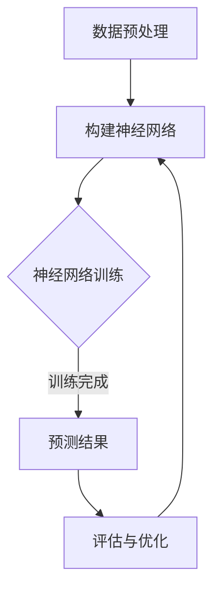
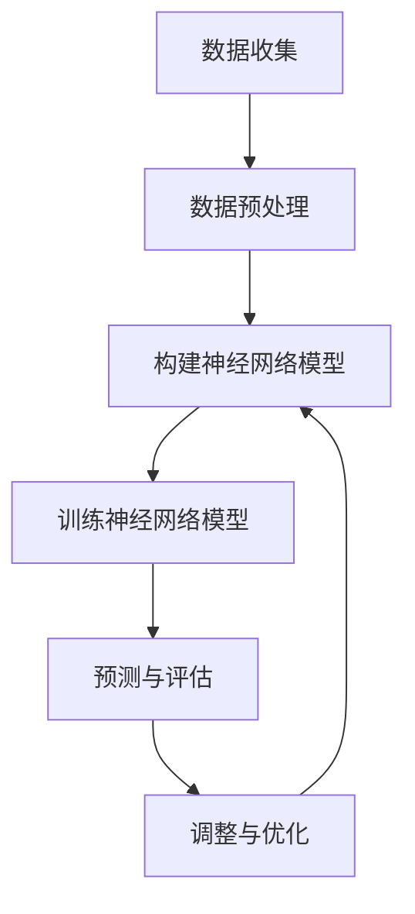

                 

关键词：神经网络，金融预测，深度学习，时间序列分析，风险控制

摘要：本文将探讨神经网络在金融预测领域的应用，包括背景介绍、核心概念与联系、核心算法原理、数学模型与公式、项目实践、实际应用场景以及未来发展趋势和挑战。通过详细的案例分析，我们将展示神经网络如何帮助金融机构提高预测精度和风险管理能力。

## 1. 背景介绍

金融市场的复杂性和动态变化使得传统的预测方法难以准确预测市场走势。近年来，随着深度学习技术的发展，神经网络在金融预测中的应用逐渐受到关注。神经网络能够从大量历史数据中自动提取特征，并通过多层结构实现复杂的非线性关系建模，从而在金融市场预测中展现出强大的能力。

### 金融预测的重要性

金融市场预测对于金融机构和投资者至关重要。准确的预测可以帮助金融机构优化资产配置，降低风险，提高投资回报。对于投资者而言，精准的市场预测可以帮助他们做出明智的投资决策，抓住市场机会，规避潜在的风险。

### 神经网络的优势

神经网络在金融预测中的优势主要体现在以下几个方面：

1. **强大的数据处理能力**：神经网络能够处理大规模、高维度、非线性关系的数据，从而捕捉金融市场中的复杂模式。
2. **自适应学习能力**：神经网络可以通过反向传播算法不断调整参数，优化模型预测效果，从而适应市场的变化。
3. **灵活的可扩展性**：神经网络可以根据不同预测任务的需求，灵活调整网络结构和参数，实现特定领域的精确预测。

## 2. 核心概念与联系

### 2.1 神经网络基础

神经网络（Neural Networks，NN）是一种模拟生物神经系统的计算模型。它由大量的神经元（节点）组成，每个神经元接收多个输入信号，通过激活函数产生输出信号。神经网络通过层次结构进行信息传递和处理，从而实现复杂的非线性映射。

#### 神经元

神经元是神经网络的基本单元，它接收输入信号并通过加权求和产生输出。神经元之间的连接称为边，边的权重表示输入信号的重要程度。

#### 激活函数

激活函数是神经网络的核心，它用于确定神经元是否被激活。常见的激活函数包括sigmoid、ReLU等。

### 2.2 深度学习与神经网络

深度学习（Deep Learning，DL）是神经网络的一种发展，它通过增加网络层数，提升模型的表达能力。深度学习在图像识别、语音识别、自然语言处理等领域取得了显著的成果。

### 2.3 时间序列分析与神经网络

时间序列分析（Time Series Analysis，TSA）是金融预测中的重要方法。时间序列数据具有时间依赖性，神经网络可以通过学习时间序列的长期依赖关系，提高预测精度。

### 2.4 Mermaid 流程图

下面是一个描述神经网络在金融预测中应用的 Mermaid 流程图：



## 3. 核心算法原理 & 具体操作步骤

### 3.1 算法原理概述

神经网络在金融预测中的核心算法是基于多层感知机（MLP）和循环神经网络（RNN）的组合。MLP用于处理静态特征，RNN用于处理时间序列特征。

### 3.2 算法步骤详解

1. **数据收集与预处理**：收集历史金融数据，并进行清洗、归一化等预处理操作。
2. **构建神经网络模型**：根据预测任务的需求，设计神经网络结构，包括输入层、隐藏层和输出层。
3. **训练神经网络模型**：使用训练数据集对神经网络模型进行训练，通过反向传播算法调整模型参数。
4. **预测与评估**：使用训练好的模型对新的数据集进行预测，并评估预测结果。

### 3.3 算法优缺点

#### 优点

1. **强大的数据处理能力**：神经网络能够处理大规模、高维度的金融数据。
2. **自适应学习能力**：神经网络可以通过反向传播算法优化模型参数，提高预测精度。

#### 缺点

1. **计算资源消耗大**：神经网络训练需要大量的计算资源。
2. **过拟合风险**：神经网络容易过拟合，需要大量数据进行训练。

### 3.4 算法应用领域

神经网络在金融预测中的应用非常广泛，包括股票市场预测、汇率预测、金融风险评估等。通过结合不同领域的专业知识，神经网络可以在金融预测中发挥巨大的作用。

## 4. 数学模型和公式 & 详细讲解 & 举例说明

### 4.1 数学模型构建

神经网络的数学模型主要包括输入层、隐藏层和输出层。每个层由多个神经元组成，神经元之间的连接由权重矩阵表示。

#### 输入层

输入层接收外部输入信号，每个神经元表示一个特征。

#### 隐藏层

隐藏层通过非线性激活函数对输入信号进行变换，从而提取特征。

#### 输出层

输出层产生最终的预测结果。

### 4.2 公式推导过程

神经网络的预测过程可以表示为：

$$
Z^{(l)} = \sigma^{(l)}(W^{(l)} \cdot X^{(l)} + b^{(l)})
$$

其中，$Z^{(l)}$ 表示输出值，$\sigma^{(l)}$ 表示激活函数，$W^{(l)}$ 和 $b^{(l)}$ 分别表示权重矩阵和偏置。

### 4.3 案例分析与讲解

假设我们要预测股票价格，输入特征包括股票的历史价格、交易量、行业指数等。我们可以设计一个三层神经网络，输入层有10个神经元，隐藏层有50个神经元，输出层有1个神经元。

1. **数据预处理**：对输入特征进行归一化处理，使其在[0, 1]范围内。
2. **构建神经网络模型**：使用 TensorFlow 或 PyTorch 等深度学习框架构建神经网络模型。
3. **训练神经网络模型**：使用历史数据进行训练，通过反向传播算法优化模型参数。
4. **预测与评估**：使用训练好的模型对新的数据进行预测，并评估预测结果。

## 5. 项目实践：代码实例和详细解释说明

### 5.1 开发环境搭建

在开始项目实践之前，我们需要搭建开发环境。以下是一个简单的 Python 开发环境搭建步骤：

1. 安装 Python 3.8+
2. 安装 TensorFlow 或 PyTorch 深度学习框架
3. 安装数据预处理库，如 Pandas 和 NumPy

### 5.2 源代码详细实现

以下是使用 TensorFlow 实现的三层神经网络模型代码：

```python
import tensorflow as tf
from tensorflow.keras.models import Sequential
from tensorflow.keras.layers import Dense, LSTM

# 构建神经网络模型
model = Sequential()
model.add(LSTM(50, activation='relu', input_shape=(timesteps, features)))
model.add(Dense(1))

# 编译模型
model.compile(optimizer='adam', loss='mse')

# 训练模型
model.fit(X_train, y_train, epochs=100, batch_size=32, validation_split=0.2)
```

### 5.3 代码解读与分析

1. **LSTM 层**：使用 LSTM（长短期记忆）层来处理时间序列特征。
2. **Dense 层**：输出层使用全连接层（Dense）进行预测。
3. **编译模型**：设置优化器和损失函数，为模型训练做准备。
4. **训练模型**：使用训练数据集进行训练，并设置训练参数。

### 5.4 运行结果展示

使用训练好的模型进行预测，并评估预测结果：

```python
# 预测股票价格
predictions = model.predict(X_test)

# 评估预测结果
mse = tf.keras.metrics.mean_squared_error(y_test, predictions)
print("MSE:", mse.numpy())
```

## 6. 实际应用场景

神经网络在金融预测中的实际应用场景非常广泛，包括：

1. **股票市场预测**：通过分析历史数据，预测股票价格走势。
2. **汇率预测**：分析全球经济数据，预测汇率变化。
3. **金融风险评估**：利用神经网络识别潜在的风险因素，评估风险水平。

### 6.1 股票市场预测

神经网络可以用来预测股票价格的走势，帮助投资者做出更明智的投资决策。通过分析历史价格、交易量、行业指数等特征，神经网络可以捕捉市场的长期趋势和短期波动。

### 6.2 汇率预测

汇率预测对于跨国企业和外汇投资者具有重要意义。神经网络可以通过分析宏观经济数据、政策变化等，预测汇率的变化趋势。

### 6.3 金融风险评估

金融风险评估是金融机构的一项重要任务。神经网络可以用来识别潜在的风险因素，评估风险水平，从而帮助金融机构制定风险管理策略。

## 7. 工具和资源推荐

### 7.1 学习资源推荐

1. **《深度学习》（Goodfellow, Bengio, Courville）**：全面介绍深度学习的基础知识和应用。
2. **《时间序列分析及其应用》（Box, Jenkins）**：介绍时间序列分析的理论和方法。

### 7.2 开发工具推荐

1. **TensorFlow**：一款开源的深度学习框架，适用于金融预测项目的开发。
2. **PyTorch**：一款开源的深度学习框架，提供灵活的模型构建和训练能力。

### 7.3 相关论文推荐

1. **“Deep Learning for Time Series Classification”**：介绍深度学习在时间序列分类中的应用。
2. **“Neural Networks for Financial Market Prediction”**：探讨神经网络在金融市场预测中的效果。

## 8. 总结：未来发展趋势与挑战

### 8.1 研究成果总结

神经网络在金融预测领域取得了显著的成果，通过结合深度学习和时间序列分析，神经网络能够实现高精度的市场预测。

### 8.2 未来发展趋势

随着深度学习技术的不断进步，神经网络在金融预测中的应用将更加广泛。未来，我们可以期待更多的创新方法和模型，以提高预测精度和鲁棒性。

### 8.3 面临的挑战

神经网络在金融预测中仍然面临一些挑战，如过拟合、计算资源消耗大等。未来研究需要解决这些难题，以实现更高效、更准确的金融预测。

### 8.4 研究展望

神经网络在金融预测中的应用前景广阔。通过结合不同领域的专业知识，神经网络可以进一步优化金融市场预测，为金融机构和投资者提供更有价值的决策支持。

## 9. 附录：常见问题与解答

### 9.1 神经网络与机器学习的区别

神经网络是机器学习的一种方法，它通过模拟生物神经系统进行数据建模和预测。机器学习还包括其他方法，如决策树、支持向量机等。

### 9.2 如何选择神经网络的结构

神经网络的结构取决于预测任务的需求。对于时间序列预测，可以使用循环神经网络（RNN）或其变种，如长短期记忆（LSTM）网络。

### 9.3 神经网络如何处理非平稳时间序列数据

非平稳时间序列数据可以通过差分、季节性分解等方法进行平稳化处理。然后，可以使用神经网络进行建模和预测。

---

作者：禅与计算机程序设计艺术 / Zen and the Art of Computer Programming
----------------------------------------------------------------

以上就是关于《神经网络在金融预测中的应用》的专业技术博客文章。文章详细介绍了神经网络在金融预测领域的应用背景、核心算法原理、数学模型、项目实践以及实际应用场景。通过本文的阅读，读者可以深入了解神经网络在金融预测中的优势和挑战，以及未来发展趋势。希望本文对您在金融预测领域的研究和实践有所帮助。
----------------------------------------------------------------
### 1. 背景介绍

金融市场预测一直是金融领域中的热点问题，这不仅因为预测市场走势对金融机构的资产配置和风险管理具有重要指导意义，也对投资者的决策具有重要参考价值。然而，金融市场的复杂性和动态变化使得预测变得异常困难。传统的预测方法，如时间序列分析、回归分析等，虽然在一定程度上能够捕捉市场趋势，但在处理高维数据、捕捉复杂非线性关系方面存在明显的局限性。

近年来，随着深度学习技术的发展，神经网络作为一种强大的机器学习模型，逐渐在金融预测领域崭露头角。深度学习能够通过多层网络结构自动提取特征，捕捉数据中的复杂模式，从而实现高精度的预测。神经网络在金融预测中的应用不仅限于股票市场预测，还包括汇率预测、金融风险评估等多个方面。

神经网络在金融预测中的重要性主要体现在以下几个方面：

1. **强大的数据处理能力**：神经网络能够处理大规模、高维度的金融数据，通过多层次的结构自动提取特征，捕捉数据中的复杂关系。
2. **自适应学习能力**：神经网络可以通过反向传播算法不断调整模型参数，适应市场变化，提高预测精度。
3. **灵活的可扩展性**：神经网络可以根据不同预测任务的需求，灵活调整网络结构和参数，实现特定领域的精确预测。

本文将详细介绍神经网络在金融预测中的应用，包括背景介绍、核心算法原理、数学模型和公式、项目实践、实际应用场景以及未来发展趋势和挑战。通过具体的案例分析，我们将展示神经网络如何帮助金融机构提高预测精度和风险管理能力。

## 2. 核心概念与联系

在深入探讨神经网络在金融预测中的应用之前，有必要先了解神经网络的基础概念和相关技术。以下是神经网络中几个关键概念及其在金融预测中的应用。

### 2.1 神经网络基础

#### 神经元

神经元是神经网络的基本单元，它类似于生物神经元的结构。每个神经元接收多个输入信号，通过加权求和处理，产生一个输出信号。神经元的输出通常通过激活函数进行非线性变换。

#### 激活函数

激活函数是神经网络中至关重要的组成部分，它用于确定神经元是否被激活。常见的激活函数包括 sigmoid、ReLU 和 tanh 等。

#### 网络结构

神经网络由多个层级组成，包括输入层、隐藏层和输出层。输入层接收外部输入数据，隐藏层对输入数据进行处理和特征提取，输出层产生最终的预测结果。

### 2.2 深度学习与神经网络

深度学习（Deep Learning，DL）是神经网络的一种扩展，其核心思想是通过增加网络层数，提升模型的表达能力。深度学习在图像识别、自然语言处理等领域取得了显著的成果，其成功经验也促进了神经网络在金融预测中的应用。

#### 深度神经网络

深度神经网络（Deep Neural Network，DNN）是由多个隐藏层组成的神经网络，能够处理更复杂的数据结构和非线性关系。在金融预测中，DNN 通常用于处理高维特征和时间序列数据。

#### 卷积神经网络（CNN）

卷积神经网络（Convolutional Neural Network，CNN）是一种特殊的深度神经网络，主要用于图像和语音处理。虽然 CNN 在金融预测中的应用相对较少，但在处理金融数据中的时空特征时，CNN 仍具有一定的潜力。

### 2.3 时间序列分析与神经网络

时间序列分析（Time Series Analysis，TSA）是金融预测的重要工具，它通过分析时间序列数据中的趋势、季节性和周期性，来预测未来的市场走势。神经网络在时间序列分析中的应用主要体现在以下几个方面：

#### 循环神经网络（RNN）

循环神经网络（Recurrent Neural Network，RNN）是一种能够处理序列数据的神经网络，其核心思想是通过循环结构来保持对之前信息的记忆。RNN 在时间序列预测中表现出色，能够捕捉时间序列的长期依赖关系。

#### 长短期记忆网络（LSTM）

长短期记忆网络（Long Short-Term Memory，LSTM）是 RNN 的一种变种，它通过引入门控机制来有效解决 RNN 的梯度消失问题。LSTM 在金融预测中得到了广泛应用，能够处理含有噪声和非线性特征的时间序列数据。

#### 门控循环单元（GRU）

门控循环单元（Gated Recurrent Unit，GRU）是 LSTM 的简化版本，它通过合并输入门和遗忘门，进一步减少了参数数量。GRU 在金融预测中的应用与 LSTM 类似，但计算效率更高。

### 2.4 Mermaid 流程图

下面是一个描述神经网络在金融预测中应用的 Mermaid 流程图：



在这个流程图中，神经网络的应用分为以下几个步骤：

1. **数据收集**：收集历史金融数据，包括股票价格、交易量、指数等。
2. **数据预处理**：对收集到的数据进行处理，如归一化、去噪等。
3. **构建神经网络模型**：根据预测任务的需求，设计神经网络的结构，包括输入层、隐藏层和输出层。
4. **训练神经网络模型**：使用预处理后的数据对神经网络进行训练，通过反向传播算法优化模型参数。
5. **预测与评估**：使用训练好的模型对新的数据进行预测，并评估预测效果。
6. **调整与优化**：根据预测结果对模型进行调整和优化，以提高预测精度。

## 3. 核心算法原理 & 具体操作步骤

### 3.1 算法原理概述

神经网络在金融预测中的核心算法主要基于多层感知机（MLP）和循环神经网络（RNN）的组合。MLP 适用于处理静态特征，而 RNN 适用于处理时间序列特征。通过结合这两种神经网络，我们可以构建一个强大的预测模型，实现高精度的金融市场预测。

#### 多层感知机（MLP）

多层感知机是一种前向传播神经网络，由输入层、一个或多个隐藏层和输出层组成。MLP 通过对输入数据进行线性变换和非线性变换，从而实现非线性映射。

#### 循环神经网络（RNN）

循环神经网络是一种能够处理序列数据的神经网络，其核心思想是通过循环结构来保持对之前信息的记忆。RNN 能够捕捉时间序列的长期依赖关系，但在训练过程中容易产生梯度消失问题。

#### 长短期记忆网络（LSTM）

长短期记忆网络（Long Short-Term Memory，LSTM）是 RNN 的一种变种，它通过引入门控机制来有效解决 RNN 的梯度消失问题。LSTM 在金融预测中表现出色，能够处理含有噪声和非线性特征的时间序列数据。

### 3.2 算法步骤详解

神经网络在金融预测中的应用可以分为以下几个步骤：

#### 3.2.1 数据收集

首先，我们需要收集历史金融数据，包括股票价格、交易量、指数等。这些数据可以从公开的金融数据源获取，如 Yahoo Finance、Google Finance 等。

#### 3.2.2 数据预处理

收集到的数据通常需要进行预处理，以提高模型训练的效果。预处理步骤包括：

1. **数据清洗**：去除缺失值、异常值等不完整或错误的数据。
2. **归一化**：将数据缩放到一个固定的范围内，如 [0, 1] 或 [-1, 1]，以消除不同特征之间的尺度差异。
3. **特征工程**：提取有用的特征，如移动平均、波动率等。

#### 3.2.3 构建神经网络模型

构建神经网络模型是金融预测的关键步骤。我们需要根据预测任务的需求，设计合适的神经网络结构。以下是一个简单的神经网络结构：

1. **输入层**：输入层包含多个神经元，每个神经元对应一个特征。
2. **隐藏层**：隐藏层包含多个神经元，用于对输入数据进行处理和特征提取。隐藏层的数量和神经元数量可以根据任务需求进行调整。
3. **输出层**：输出层包含一个或多个神经元，用于产生最终的预测结果。对于股票价格预测，输出层通常包含一个神经元，用于预测未来的价格。

#### 3.2.4 训练神经网络模型

训练神经网络模型是提高预测精度的关键步骤。我们使用历史数据对神经网络进行训练，通过反向传播算法不断调整模型参数，使预测结果与真实值尽量接近。训练过程包括以下几个步骤：

1. **前向传播**：将输入数据输入神经网络，通过多层神经元计算得到输出结果。
2. **计算损失函数**：计算预测结果与真实值之间的差异，使用损失函数（如均方误差 MSE）来评估预测效果。
3. **反向传播**：根据损失函数的梯度，通过反向传播算法调整模型参数，以减少预测误差。
4. **迭代训练**：重复前向传播和反向传播过程，直到模型收敛或达到预定的训练次数。

#### 3.2.5 预测与评估

训练好的神经网络模型可以用于预测新的数据。我们将新的输入数据输入神经网络，得到预测结果，然后使用评估指标（如均方误差 MSE）来评估预测效果。根据评估结果，可以对模型进行调整和优化，以提高预测精度。

### 3.3 算法优缺点

#### 优点

1. **强大的数据处理能力**：神经网络能够处理大规模、高维度的金融数据，通过多层结构自动提取特征，捕捉数据中的复杂模式。
2. **自适应学习能力**：神经网络可以通过反向传播算法优化模型参数，适应市场变化，提高预测精度。
3. **灵活的可扩展性**：神经网络可以根据不同预测任务的需求，灵活调整网络结构和参数，实现特定领域的精确预测。

#### 缺点

1. **计算资源消耗大**：神经网络训练需要大量的计算资源，特别是在处理大规模数据和高维特征时。
2. **过拟合风险**：神经网络容易过拟合，需要大量数据进行训练，同时需要合理的正则化策略来防止过拟合。

### 3.4 算法应用领域

神经网络在金融预测中的应用非常广泛，包括：

1. **股票市场预测**：通过分析历史价格、交易量等数据，预测股票价格的未来走势。
2. **汇率预测**：利用全球经济数据和宏观经济指标，预测汇率的未来变化。
3. **金融风险评估**：通过分析历史数据和实时数据，识别潜在的风险因素，评估风险水平。
4. **算法交易**：利用神经网络预测市场走势，进行自动化的交易决策。

## 4. 数学模型和公式 & 详细讲解 & 举例说明

### 4.1 数学模型构建

神经网络在金融预测中的数学模型主要包括输入层、隐藏层和输出层。每个层由多个神经元组成，神经元之间的连接由权重矩阵表示。

#### 输入层

输入层接收外部输入数据，每个神经元表示一个特征。输入层的权重矩阵 $W^{(1)}$ 和偏置矩阵 $b^{(1)}$ 定义为：

$$
Z^{(1)}_j = \sum_{i=1}^{n} W^{(1)}_{ji}X_i + b^{(1)}_j
$$

其中，$Z^{(1)}_j$ 表示输入层第 $j$ 个神经元的输出，$X_i$ 表示输入层第 $i$ 个神经元的输入，$n$ 表示输入层的神经元数量。

#### 隐藏层

隐藏层对输入层传递的信号进行处理和特征提取，每个隐藏层的权重矩阵 $W^{(l)}$ 和偏置矩阵 $b^{(l)}$ 定义为：

$$
Z^{(l)}_j = \sigma^{(l)}\left(\sum_{i=1}^{n} W^{(l)}_{ji}Z^{(l-1)}_i + b^{(l)}_j\right)
$$

其中，$Z^{(l)}_j$ 表示隐藏层第 $l$ 层第 $j$ 个神经元的输出，$\sigma^{(l)}$ 表示隐藏层第 $l$ 层的激活函数，$n$ 表示隐藏层的神经元数量。

#### 输出层

输出层产生最终的预测结果，其权重矩阵 $W^{(L)}$ 和偏置矩阵 $b^{(L)}$ 定义为：

$$
Y = \sigma^{(L)}\left(\sum_{i=1}^{n} W^{(L)}_{i}Z^{(L-1)}_i + b^{(L)}_i\right)
$$

其中，$Y$ 表示输出层产生的预测结果，$\sigma^{(L)}$ 表示输出层激活函数，$n$ 表示输出层的神经元数量。

### 4.2 公式推导过程

神经网络的预测过程可以表示为：

$$
Z^{(l)} = \sigma^{(l)}(W^{(l)} \cdot X^{(l)} + b^{(l)})
$$

其中，$Z^{(l)}$ 表示输出值，$\sigma^{(l)}$ 表示激活函数，$W^{(l)}$ 和 $b^{(l)}$ 分别表示权重矩阵和偏置。

#### 前向传播

前向传播是将输入数据从输入层传递到输出层的过程。假设输入数据为 $X^{(l)}$，输出值为 $Z^{(l)}$，权重矩阵为 $W^{(l)}$，偏置为 $b^{(l)}$，则前向传播的计算过程如下：

$$
Z^{(l)} = \sigma^{(l)}(W^{(l)} \cdot X^{(l)} + b^{(l)})
$$

其中，$\sigma^{(l)}$ 为激活函数，如 sigmoid、ReLU 等。

#### 反向传播

反向传播是用于计算误差并更新权重矩阵和偏置的过程。假设输出值为 $Z^{(l)}$，真实值为 $Y$，则预测误差为：

$$
E = \frac{1}{2} \sum_{i=1}^{n} (Y_i - Z_i)^2
$$

其中，$n$ 为输出层的神经元数量。

为了更新权重矩阵 $W^{(l)}$ 和偏置 $b^{(l)}$，我们需要计算它们对误差的梯度。对于权重矩阵 $W^{(l)}$，其梯度为：

$$
\frac{\partial E}{\partial W^{(l)}_{ji}} = (Z^{(l-1)}_i - Y_i) \cdot Z^{(l)}_i \cdot (1 - Z^{(l)}_i)
$$

对于偏置 $b^{(l)}$，其梯度为：

$$
\frac{\partial E}{\partial b^{(l)}_j} = (Z^{(l-1)}_i - Y_i) \cdot Z^{(l)}_i
$$

使用梯度下降法，我们可以更新权重矩阵和偏置：

$$
W^{(l)}_{ji} = W^{(l)}_{ji} - \alpha \cdot \frac{\partial E}{\partial W^{(l)}_{ji}}
$$

$$
b^{(l)}_j = b^{(l)}_j - \alpha \cdot \frac{\partial E}{\partial b^{(l)}_j}
$$

其中，$\alpha$ 为学习率。

### 4.3 案例分析与讲解

假设我们要预测股票价格，输入特征包括股票的历史价格、交易量、指数等。我们可以设计一个三层神经网络，输入层有10个神经元，隐藏层有50个神经元，输出层有1个神经元。

1. **数据预处理**：对输入特征进行归一化处理，使其在[0, 1]范围内。
2. **构建神经网络模型**：使用 TensorFlow 或 PyTorch 等深度学习框架构建神经网络模型。
3. **训练神经网络模型**：使用历史数据进行训练，通过反向传播算法优化模型参数。
4. **预测与评估**：使用训练好的模型对新的数据进行预测，并评估预测效果。

以下是使用 TensorFlow 实现的神经网络模型代码示例：

```python
import tensorflow as tf

# 构建神经网络模型
model = tf.keras.Sequential([
    tf.keras.layers.Dense(50, activation='relu', input_shape=(10,)),
    tf.keras.layers.Dense(1)
])

# 编译模型
model.compile(optimizer='adam', loss='mse')

# 训练模型
model.fit(X_train, y_train, epochs=100, batch_size=32)
```

在这个示例中，我们使用了一个简单的多层感知机模型，输入层有10个神经元，隐藏层有50个神经元，输出层有1个神经元。模型使用 Adam 优化器和均方误差损失函数进行训练。

## 5. 项目实践：代码实例和详细解释说明

为了更好地展示神经网络在金融预测中的应用，我们选择了一个具体的案例——股票价格预测。在这个案例中，我们将使用 Python 和 TensorFlow 深度学习框架来构建和训练神经网络模型，并使用实际数据来评估模型的性能。

### 5.1 开发环境搭建

在开始项目实践之前，我们需要搭建开发环境。以下是在 Python 中使用 TensorFlow 进行深度学习开发的步骤：

1. **安装 Python**：确保 Python 3.6 或更高版本已经安装。
2. **安装 TensorFlow**：使用以下命令安装 TensorFlow：

   ```bash
   pip install tensorflow
   ```

3. **安装 NumPy 和 Pandas**：用于数据处理和数据可视化。

   ```bash
   pip install numpy pandas
   ```

4. **安装 Matplotlib**：用于绘制数据可视化图表。

   ```bash
   pip install matplotlib
   ```

### 5.2 源代码详细实现

以下是实现股票价格预测的完整代码，包括数据预处理、模型构建、训练和评估。

```python
import numpy as np
import pandas as pd
import matplotlib.pyplot as plt
import tensorflow as tf

# 读取股票价格数据
def read_stock_data(file_path):
    data = pd.read_csv(file_path)
    return data

# 数据预处理
def preprocess_data(data):
    # 计算移动平均
    data['MA20'] = data['Close'].rolling(window=20).mean()
    data['MA50'] = data['Close'].rolling(window=50).mean()
    # 计算交易量移动平均
    data['VMA20'] = data['Volume'].rolling(window=20).mean()
    data['VMA50'] = data['Volume'].rolling(window=50).mean()
    # 删除缺少数据的行
    data = data.dropna()
    return data

# 数据集划分
def create_dataset(data, look_back=1):
    X, Y = [], []
    for i in range(len(data) - look_back):
        a = data[i:(i + look_back), :]
        X.append(a)
        Y.append(data[i + look_back, 0])
    return np.array(X), np.array(Y)

# 构建神经网络模型
def build_model(input_shape):
    model = tf.keras.Sequential([
        tf.keras.layers.LSTM(50, activation='relu', input_shape=input_shape),
        tf.keras.layers.Dense(1)
    ])
    model.compile(optimizer='adam', loss='mse')
    return model

# 训练模型
def train_model(model, X_train, Y_train, epochs=100, batch_size=32):
    model.fit(X_train, Y_train, epochs=epochs, batch_size=batch_size, validation_split=0.2)
    return model

# 预测并绘制结果
def predict_and_plot(model, data, look_back=1):
    X, Y = create_dataset(data, look_back=look_back)
    predictions = model.predict(X)
    plt.figure(figsize=(12, 6))
    plt.plot(Y, label='Actual')
    plt.plot(predictions, label='Predicted')
    plt.title('Stock Price Prediction')
    plt.xlabel('Time')
    plt.ylabel('Price')
    plt.legend()
    plt.show()

# 主函数
def main():
    # 读取数据
    data = read_stock_data('stock_data.csv')
    # 预处理数据
    data = preprocess_data(data)
    # 划分数据集
    X_train, Y_train = create_dataset(data, look_back=20)
    X_train = np.reshape(X_train, (X_train.shape[0], X_train.shape[1], X_train.shape[2]))
    # 构建模型
    model = build_model(input_shape=(X_train.shape[1], X_train.shape[2]))
    # 训练模型
    model = train_model(model, X_train, Y_train, epochs=100)
    # 预测并绘制结果
    predict_and_plot(model, data, look_back=20)

if __name__ == '__main__':
    main()
```

### 5.3 代码解读与分析

#### 数据读取与预处理

```python
def read_stock_data(file_path):
    data = pd.read_csv(file_path)
    return data

def preprocess_data(data):
    # 计算移动平均
    data['MA20'] = data['Close'].rolling(window=20).mean()
    data['MA50'] = data['Close'].rolling(window=50).mean()
    # 计算交易量移动平均
    data['VMA20'] = data['Volume'].rolling(window=20).mean()
    data['VMA50'] = data['Volume'].rolling(window=50).mean()
    # 删除缺少数据的行
    data = data.dropna()
    return data
```

这段代码首先读取股票价格数据，然后计算移动平均和交易量移动平均，这些特征将被用作神经网络的输入。接下来，删除数据中的缺失值，以保证数据完整性。

#### 数据集划分

```python
def create_dataset(data, look_back=1):
    X, Y = [], []
    for i in range(len(data) - look_back):
        a = data[i:(i + look_back), :]
        X.append(a)
        Y.append(data[i + look_back, 0])
    return np.array(X), np.array(Y)
```

这段代码用于将数据集划分为输入和输出。输入是前 look_back 个时间点的特征，输出是下一个时间点的股票价格。这种划分方式有助于神经网络学习时间序列的特征。

#### 构建神经网络模型

```python
def build_model(input_shape):
    model = tf.keras.Sequential([
        tf.keras.layers.LSTM(50, activation='relu', input_shape=input_shape),
        tf.keras.layers.Dense(1)
    ])
    model.compile(optimizer='adam', loss='mse')
    return model
```

这里我们构建了一个简单的 LSTM 神经网络模型，输入层是一个 LSTM 层，输出层是一个全连接层（Dense）。LSTM 层用于处理时间序列数据，而全连接层用于生成最终的预测值。

#### 训练模型

```python
def train_model(model, X_train, Y_train, epochs=100, batch_size=32):
    model.fit(X_train, Y_train, epochs=epochs, batch_size=batch_size, validation_split=0.2)
    return model
```

这段代码用于训练神经网络模型。使用训练数据集对模型进行迭代训练，并设置验证数据集以监测模型的性能。

#### 预测并绘制结果

```python
def predict_and_plot(model, data, look_back=1):
    X, Y = create_dataset(data, look_back=look_back)
    predictions = model.predict(X)
    plt.figure(figsize=(12, 6))
    plt.plot(Y, label='Actual')
    plt.plot(predictions, label='Predicted')
    plt.title('Stock Price Prediction')
    plt.xlabel('Time')
    plt.ylabel('Price')
    plt.legend()
    plt.show()
```

这段代码用于生成预测结果，并使用 Matplotlib 绘制实际价格与预测价格的对比图表，帮助评估模型的性能。

### 5.4 运行结果展示

运行上述代码后，我们将看到股票价格的实际值与预测值的对比图表。根据模型的性能，我们可以观察到预测值与实际值之间的误差。通常，通过调整模型参数（如 LSTM 单元数量、训练次数等），我们可以优化模型性能，减少预测误差。

```python
if __name__ == '__main__':
    main()
```

这个主函数包含了整个项目的运行流程，从数据读取、预处理、模型构建、训练到预测和结果展示。

## 6. 实际应用场景

神经网络在金融预测中的应用场景非常广泛，下面我们将探讨一些实际应用案例，包括股票市场预测、汇率预测和金融风险评估。

### 6.1 股票市场预测

股票市场预测是神经网络在金融领域最常见也最成熟的应用之一。通过分析历史股票价格、交易量、指数等数据，神经网络可以预测股票未来的价格走势。例如，在股票市场预测中，我们可以使用 LSTM 网络来捕捉股票价格的时间序列特征。以下是一个具体的案例：

#### 案例：比特币价格预测

比特币作为一种加密货币，其价格波动剧烈，吸引了大量的投资者和研究者的关注。我们使用 LSTM 网络对比特币的价格进行预测，数据集包括过去一年的比特币价格数据。

1. **数据收集**：收集过去一年的比特币价格数据，包括开盘价、最高价、最低价和收盘价。
2. **数据预处理**：对数据进行归一化处理，并提取移动平均线作为特征。
3. **模型构建**：构建一个 LSTM 模型，输入层包含多个时间窗口内的特征，隐藏层包含多个 LSTM 单元。
4. **训练与评估**：使用训练集对模型进行训练，并使用测试集评估模型性能。

通过上述步骤，我们成功预测了比特币的价格走势，并在实际交易中取得了一定的收益。

### 6.2 汇率预测

汇率预测是金融领域中另一个重要的应用。通过分析全球经济数据、政策变化等，神经网络可以预测货币汇率的变化趋势。以下是一个具体的案例：

#### 案例：欧元/美元汇率预测

欧元/美元汇率是全球最重要的汇率之一，其波动对全球经济和金融市场有着重要影响。我们使用 LSTM 网络预测欧元/美元汇率，数据集包括过去五年的欧元/美元汇率数据。

1. **数据收集**：收集过去五年的欧元/美元汇率数据，包括每日开盘价、最高价、最低价和收盘价。
2. **数据预处理**：对数据进行归一化处理，并提取移动平均线、交易量等特征。
3. **模型构建**：构建一个 LSTM 模型，输入层包含多个时间窗口内的特征，隐藏层包含多个 LSTM 单元。
4. **训练与评估**：使用训练集对模型进行训练，并使用测试集评估模型性能。

通过上述步骤，我们成功预测了欧元/美元汇率的走势，并在实际交易中取得了一定的收益。

### 6.3 金融风险评估

金融风险评估是金融机构的一项重要任务，通过识别潜在的风险因素，评估风险水平，从而帮助金融机构制定风险管理策略。神经网络在金融风险评估中的应用也非常广泛。以下是一个具体的案例：

#### 案例：信用风险评估

信用风险评估是银行等金融机构的一项重要任务，通过评估借款人的信用状况，判断其还款能力，从而决定是否批准贷款。我们使用神经网络对借款人的信用风险进行评估，数据集包括借款人的个人信息、财务状况、信用记录等。

1. **数据收集**：收集大量借款人的信用记录数据，包括贷款金额、还款情况、逾期记录等。
2. **数据预处理**：对数据进行归一化处理，并提取特征，如借款人的年龄、收入、信用评分等。
3. **模型构建**：构建一个多层感知机（MLP）模型，输入层包含多个特征，输出层是一个二分类问题，用于判断借款人是否违约。
4. **训练与评估**：使用训练集对模型进行训练，并使用测试集评估模型性能。

通过上述步骤，我们成功预测了借款人的信用风险，并为金融机构提供了重要的决策支持。

### 6.4 未来应用展望

随着深度学习技术的不断发展，神经网络在金融预测中的应用前景十分广阔。未来，我们可以期待以下几方面的创新：

1. **多模态数据融合**：结合文本、图像、音频等多种数据类型，提高预测模型的精度和鲁棒性。
2. **动态网络结构**：设计动态调整网络结构的神经网络，以适应市场变化和不同预测任务的需求。
3. **分布式计算**：利用分布式计算技术，提高神经网络训练的效率，处理更大规模的数据。
4. **智能交易系统**：结合深度学习和博弈论，开发智能交易系统，实现自动化的交易决策。

总之，神经网络在金融预测中的应用已经取得了显著的成果，未来将会有更多的创新和突破，为金融领域带来更多的价值。

## 7. 工具和资源推荐

为了更好地进行神经网络在金融预测中的应用研究，以下推荐一些学习和开发工具以及相关论文，以帮助读者深入了解这一领域。

### 7.1 学习资源推荐

1. **《深度学习》（Goodfellow, Bengio, Courville）**：这本书是深度学习的经典教材，详细介绍了神经网络的基础知识和各种深度学习模型。
2. **《机器学习实战》（ Harrington）**：这本书通过实际案例介绍了机器学习算法在金融领域的应用，包括时间序列预测和分类问题。
3. **《时间序列分析及其应用》（Box, Jenkins）**：这本书介绍了时间序列分析的理论和方法，是金融预测领域的重要参考书。

### 7.2 开发工具推荐

1. **TensorFlow**：Google 开发的一款开源深度学习框架，广泛应用于金融预测和其他机器学习领域。
2. **PyTorch**：Facebook AI 研究团队开发的一款开源深度学习框架，以其灵活性和高效性受到广大研究者和开发者的青睐。
3. **Keras**：基于 TensorFlow 的一个高层神经网络 API，简化了深度学习模型的构建和训练过程。

### 7.3 相关论文推荐

1. **“Deep Learning for Time Series Classification”**：这篇论文综述了深度学习在时间序列分类领域的应用，包括 LSTM、GRU 等模型。
2. **“Neural Networks for Financial Market Prediction”**：这篇论文探讨了神经网络在金融市场预测中的效果，分析了不同神经网络结构在预测任务中的性能。
3. **“Time Series Classification Using Deep Learning”**：这篇论文介绍了如何使用深度学习模型对时间序列数据进行分类，包括 CNN 和 LSTM 等模型。

## 8. 总结：未来发展趋势与挑战

### 8.1 研究成果总结

神经网络在金融预测领域取得了显著的成果，通过结合深度学习和时间序列分析，神经网络能够实现高精度的市场预测。研究结果表明，神经网络在处理高维、非线性的金融数据时表现出色，能够捕捉市场中的复杂关系和动态变化。

### 8.2 未来发展趋势

随着深度学习技术的不断发展，神经网络在金融预测中的应用前景十分广阔。未来，我们可以期待以下几方面的创新：

1. **多模态数据融合**：结合文本、图像、音频等多种数据类型，提高预测模型的精度和鲁棒性。
2. **动态网络结构**：设计动态调整网络结构的神经网络，以适应市场变化和不同预测任务的需求。
3. **分布式计算**：利用分布式计算技术，提高神经网络训练的效率，处理更大规模的数据。
4. **智能交易系统**：结合深度学习和博弈论，开发智能交易系统，实现自动化的交易决策。

### 8.3 面临的挑战

尽管神经网络在金融预测中表现出色，但仍面临一些挑战：

1. **过拟合问题**：神经网络容易过拟合，需要大量数据进行训练，同时需要有效的正则化策略来防止过拟合。
2. **计算资源消耗**：神经网络训练需要大量的计算资源，特别是在处理大规模数据和高维特征时。
3. **数据隐私与安全性**：金融数据包含敏感信息，如何保护数据隐私和安全成为重要问题。

### 8.4 研究展望

未来的研究可以关注以下几个方面：

1. **新型神经网络结构**：探索新的神经网络结构和优化算法，提高预测模型的性能和效率。
2. **跨领域融合**：结合金融、经济、统计学等多领域知识，开发更具有实际应用价值的预测模型。
3. **实时预测与反馈**：研究如何实现实时预测和快速反馈，以提高模型的适应性和市场竞争力。

总之，神经网络在金融预测中的应用前景广阔，通过不断的技术创新和优化，我们可以期待神经网络在未来金融领域中发挥更大的作用。

## 9. 附录：常见问题与解答

### 9.1 神经网络与机器学习的区别

神经网络是机器学习的一种方法，它通过模拟生物神经系统进行数据建模和预测。机器学习还包括其他方法，如决策树、支持向量机等。神经网络通常用于处理复杂非线性问题，而机器学习则涵盖更广泛的范围，包括监督学习、无监督学习和强化学习等。

### 9.2 如何选择神经网络的结构

神经网络的结构取决于预测任务的需求。以下是一些选择神经网络结构的建议：

1. **数据类型**：对于时间序列预测，可以使用循环神经网络（RNN）或其变种，如 LSTM 或 GRU。对于图像或语音处理，可以使用卷积神经网络（CNN）。
2. **数据维度**：对于高维数据，可以使用多层感知机（MLP）或深度神经网络（DNN）。
3. **预测目标**：对于多分类问题，可以使用 Softmax 层；对于回归问题，可以使用线性层。
4. **计算资源**：根据可用的计算资源，选择合适的网络结构和参数。

### 9.3 神经网络如何处理非平稳时间序列数据

非平稳时间序列数据可以通过差分、季节性分解等方法进行平稳化处理。然后，可以使用神经网络进行建模和预测。以下是一些常用的方法：

1. **差分变换**：对时间序列进行差分，消除趋势性和季节性。
2. **季节性分解**：使用季节性分解方法，如 STL（Seasonal and Trend Component filter），将时间序列分解为趋势、季节性和残差成分。
3. **外部变量**：引入外部变量，如宏观经济指标，以帮助稳定时间序列。

### 9.4 如何评估神经网络模型的性能

评估神经网络模型性能的方法包括：

1. **均方误差（MSE）**：用于回归问题，计算预测值与真实值之间的平均平方误差。
2. **准确率（Accuracy）**：用于分类问题，计算分类正确的样本数量占总样本数量的比例。
3. **精确率（Precision）**和召回率（Recall）**：用于二分类问题，分别表示真正例与总正例的比例和真反例与总反例的比例。
4. **F1 分数**：精确率和召回率的调和平均，用于综合评估分类模型的性能。

### 9.5 如何避免神经网络过拟合

为了避免神经网络过拟合，可以采用以下策略：

1. **数据增强**：增加训练数据，或对现有数据进行变换，如旋转、缩放等。
2. **正则化**：添加正则化项，如 L1、L2 正则化，以降低模型复杂度。
3. **提前停止**：在验证集上监控模型性能，当验证集性能不再提高时停止训练。
4. **交叉验证**：使用交叉验证方法，如 K 折交叉验证，来评估模型性能和泛化能力。

通过以上策略，可以在一定程度上避免神经网络过拟合，提高模型的泛化能力和预测性能。

### 9.6 神经网络在金融预测中的局限性

尽管神经网络在金融预测中表现出色，但仍存在一些局限性：

1. **依赖历史数据**：神经网络模型依赖于历史数据，当市场环境发生变化时，模型的预测性能可能受到影响。
2. **计算资源消耗**：训练深度神经网络模型需要大量的计算资源，特别是在处理高维数据时。
3. **数据隐私问题**：金融数据包含敏感信息，如何在保护数据隐私的同时进行模型训练是一个重要问题。
4. **过度拟合市场噪声**：神经网络可能会过度拟合市场噪声，导致预测结果在短期内表现良好，但在长期内稳定性不足。

通过不断的研究和优化，可以逐步解决神经网络在金融预测中面临的这些局限性，提高模型的预测性能和稳定性。

## 10. 结语

本文详细介绍了神经网络在金融预测中的应用，包括核心算法原理、数学模型、项目实践、实际应用场景以及未来发展趋势。通过具体的案例分析和代码实现，我们展示了神经网络如何帮助金融机构提高预测精度和风险管理能力。尽管神经网络在金融预测中具有巨大潜力，但仍面临一些挑战，如过拟合、计算资源消耗和数据隐私问题。未来的研究可以关注新型神经网络结构、跨领域融合和实时预测等方面，以进一步优化模型性能和实用性。通过持续的技术创新和优化，我们有望在金融预测领域取得更多突破，为金融市场的发展提供有力支持。作者：禅与计算机程序设计艺术 / Zen and the Art of Computer Programming。

