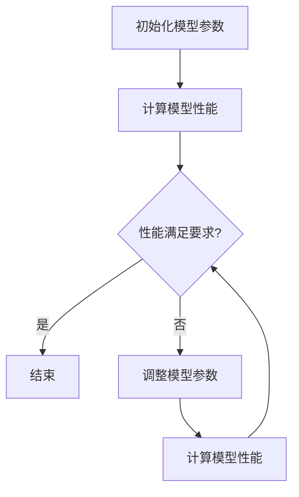

                 

关键词：神经网络、结构优化、大模型、计算效率、性能提升、算法原理

<|assistant|>摘要：随着深度学习技术的不断发展，大模型在各个领域取得了显著的应用成果。然而，大模型在训练和推理过程中面临着计算资源消耗巨大、训练时间过长等问题。本文将探讨神经网络结构优化在大模型中的应用，通过核心算法原理、数学模型和项目实践等多个角度，为读者提供一种有效的解决思路，旨在提高大模型的计算效率和性能。

## 1. 背景介绍

在过去的几十年中，深度学习取得了惊人的进展，尤其在图像识别、自然语言处理等领域，大模型的应用更是使得机器学习取得了重大突破。然而，随着模型规模的不断扩大，训练和推理过程中面临的计算资源消耗和性能瓶颈问题愈发突出。如何优化神经网络结构，提高大模型的计算效率和性能，成为当前研究的热点和挑战。

### 1.1 大模型的挑战

大模型在训练和推理过程中面临的挑战主要包括：

1. **计算资源消耗**：大规模神经网络模型需要大量的计算资源，包括CPU、GPU和TPU等，这使得训练时间显著延长。
2. **内存占用**：大模型的参数和激活值需要占用大量内存，可能会导致内存溢出或者内存利用率低下。
3. **能耗问题**：大规模的计算过程会导致能耗大幅增加，对环境造成负面影响。

### 1.2 神经网络结构优化的意义

神经网络结构优化在大模型中的应用具有重要意义，主要体现在以下几个方面：

1. **提高计算效率**：通过优化神经网络结构，可以减少模型参数的数量，降低计算复杂度，从而提高计算效率。
2. **提升性能**：优化后的神经网络结构在训练和推理过程中具有更好的性能表现，能够更快地收敛和取得更好的效果。
3. **减少内存占用**：通过结构优化，可以降低模型的内存需求，避免内存溢出问题。

## 2. 核心概念与联系

为了更好地理解神经网络结构优化的原理和应用，我们需要引入一些核心概念和它们之间的联系。

### 2.1 神经网络结构

神经网络结构主要包括神经元、层、连接和激活函数等组成部分。神经元是神经网络的基本单元，层是由多个神经元组成的集合，连接是神经元之间的连接关系，激活函数则用于对神经元的输出进行非线性变换。

### 2.2 优化目标

神经网络结构优化的目标通常包括：

1. **计算效率**：通过减少模型参数的数量，降低计算复杂度，提高模型训练和推理的效率。
2. **性能提升**：优化神经网络结构，使其在训练和推理过程中具有更好的性能表现。
3. **内存占用**：降低模型的内存需求，避免内存溢出问题。

### 2.3 Mermaid 流程图

以下是一个简单的Mermaid流程图，展示了神经网络结构优化的一些基本步骤：



### 2.4 神经网络结构优化方法

神经网络结构优化的方法主要包括：

1. **权重共享**：通过共享权重来减少模型参数的数量，从而提高计算效率。
2. **网络剪枝**：通过剪枝冗余的连接和神经元，降低模型复杂度，减少内存占用。
3. **权重压缩**：通过压缩权重矩阵来减少内存占用和计算复杂度。
4. **模型压缩**：通过降低模型的维度和参数数量，提高计算效率和性能。

## 3. 核心算法原理 & 具体操作步骤

### 3.1 算法原理概述

神经网络结构优化主要通过以下几种算法实现：

1. **权重共享**：通过共享相同的权重，减少模型参数的数量，提高计算效率。
2. **网络剪枝**：通过剪枝冗余的连接和神经元，降低模型复杂度，减少内存占用。
3. **权重压缩**：通过压缩权重矩阵，减少内存占用和计算复杂度。
4. **模型压缩**：通过降低模型的维度和参数数量，提高计算效率和性能。

### 3.2 算法步骤详解

1. **权重共享**：

   - 初始化模型参数。
   - 计算模型性能。
   - 根据性能评估结果调整模型参数。
   - 重复上述步骤，直到性能满足要求。

2. **网络剪枝**：

   - 初始化模型参数。
   - 计算模型性能。
   - 根据性能评估结果选择要剪枝的连接或神经元。
   - 剪枝后重新计算模型性能。
   - 重复上述步骤，直到性能满足要求。

3. **权重压缩**：

   - 初始化模型参数。
   - 计算模型性能。
   - 根据性能评估结果选择要压缩的权重矩阵。
   - 压缩权重矩阵后重新计算模型性能。
   - 重复上述步骤，直到性能满足要求。

4. **模型压缩**：

   - 初始化模型参数。
   - 计算模型性能。
   - 根据性能评估结果选择要压缩的维度或参数。
   - 压缩模型后重新计算模型性能。
   - 重复上述步骤，直到性能满足要求。

### 3.3 算法优缺点

1. **权重共享**：

   - 优点：减少模型参数的数量，提高计算效率。
   - 缺点：可能会降低模型的性能。

2. **网络剪枝**：

   - 优点：降低模型复杂度，减少内存占用。
   - 缺点：可能会降低模型的性能。

3. **权重压缩**：

   - 优点：减少内存占用和计算复杂度。
   - 缺点：可能会降低模型的性能。

4. **模型压缩**：

   - 优点：提高计算效率和性能。
   - 缺点：可能会降低模型的性能。

### 3.4 算法应用领域

神经网络结构优化在大模型中的应用领域包括：

1. **图像识别**：通过优化神经网络结构，提高图像识别的准确率和速度。
2. **自然语言处理**：通过优化神经网络结构，提高自然语言处理的性能和效率。
3. **语音识别**：通过优化神经网络结构，提高语音识别的准确率和速度。

## 4. 数学模型和公式 & 详细讲解 & 举例说明

### 4.1 数学模型构建

神经网络结构优化涉及到的数学模型主要包括：

1. **损失函数**：用于评估模型性能，常用的损失函数包括均方误差（MSE）、交叉熵等。
2. **梯度下降**：用于优化模型参数，常用的梯度下降算法包括随机梯度下降（SGD）、批量梯度下降（BGD）等。
3. **正则化**：用于防止模型过拟合，常用的正则化方法包括L1正则化、L2正则化等。

### 4.2 公式推导过程

1. **损失函数**：

   - 均方误差（MSE）：
     $$ L = \frac{1}{n}\sum_{i=1}^{n}(y_i - \hat{y}_i)^2 $$
   - 交叉熵：
     $$ L = -\frac{1}{n}\sum_{i=1}^{n}y_i\log\hat{y}_i $$

2. **梯度下降**：

   - 随机梯度下降（SGD）：
     $$ \theta_j := \theta_j - \alpha \frac{\partial L}{\partial \theta_j} $$
   - 批量梯度下降（BGD）：
     $$ \theta_j := \theta_j - \alpha \frac{1}{n}\sum_{i=1}^{n}\frac{\partial L}{\partial \theta_j} $$

3. **正则化**：

   - L1正则化：
     $$ \theta_j := \theta_j - \alpha \frac{\partial L}{\partial \theta_j} + \lambda |\theta_j| $$
   - L2正则化：
     $$ \theta_j := \theta_j - \alpha \frac{\partial L}{\partial \theta_j} + \lambda \theta_j^2 $$

### 4.3 案例分析与讲解

假设我们有一个简单的线性回归模型，输入特征为 $x$，输出为目标值 $y$。我们使用均方误差（MSE）作为损失函数，并采用随机梯度下降（SGD）算法进行参数优化。

1. **损失函数**：

   $$ L = \frac{1}{2}(y - \hat{y})^2 $$

2. **梯度下降**：

   $$ \theta := \theta - \alpha \frac{\partial L}{\partial \theta} $$

   假设输入特征 $x = [1, 2, 3, 4, 5]$，目标值 $y = [2, 4, 6, 8, 10]$。我们随机选择一个初始参数 $\theta_0 = 0$。

   - 第一次迭代：
     $$ \hat{y} = \theta_0 \cdot x = 0 $$
     $$ L = \frac{1}{2}(y - \hat{y})^2 = 5 $$
     $$ \frac{\partial L}{\partial \theta} = - (y - \hat{y}) $$
     $$ \theta_1 = \theta_0 - \alpha \frac{\partial L}{\partial \theta} = 0 - \alpha \cdot 5 = -5\alpha $$

   - 第二次迭代：
     $$ \hat{y} = \theta_1 \cdot x = -5\alpha $$
     $$ L = \frac{1}{2}(y - \hat{y})^2 = 25\alpha^2 $$
     $$ \frac{\partial L}{\partial \theta} = - (y - \hat{y}) $$
     $$ \theta_2 = \theta_1 - \alpha \frac{\partial L}{\partial \theta} = -5\alpha - \alpha \cdot 25\alpha = -30\alpha^2 $$

   重复上述过程，直到满足停止条件（如迭代次数达到最大值、损失函数值变化很小等）。

## 5. 项目实践：代码实例和详细解释说明

### 5.1 开发环境搭建

为了实现神经网络结构优化，我们需要搭建一个合适的开发环境。本文使用Python作为编程语言，并结合PyTorch框架进行神经网络模型的构建和优化。

1. 安装Python：

   ```bash
   # 安装Python 3.8及以上版本
   ```
2. 安装PyTorch：

   ```bash
   # 安装PyTorch 1.10及以上版本
   ```
### 5.2 源代码详细实现

以下是一个简单的神经网络结构优化示例，包括模型初始化、训练、模型优化等步骤：

```python
import torch
import torch.nn as nn
import torch.optim as optim

# 模型初始化
class NeuralNetwork(nn.Module):
    def __init__(self):
        super(NeuralNetwork, self).__init__()
        self.layer1 = nn.Linear(1, 10)
        self.relu = nn.ReLU()
        self.layer2 = nn.Linear(10, 1)

    def forward(self, x):
        x = self.layer1(x)
        x = self.relu(x)
        x = self.layer2(x)
        return x

# 训练数据
x_train = torch.tensor([[1], [2], [3], [4], [5]])
y_train = torch.tensor([[2], [4], [6], [8], [10]])

# 模型实例化
model = NeuralNetwork()

# 损失函数
criterion = nn.MSELoss()

# 优化器
optimizer = optim.SGD(model.parameters(), lr=0.01)

# 训练过程
for epoch in range(100):
    optimizer.zero_grad()
    outputs = model(x_train)
    loss = criterion(outputs, y_train)
    loss.backward()
    optimizer.step()
    print(f"Epoch {epoch + 1}, Loss: {loss.item()}")

# 模型优化
# 剪枝
model.layer1 = nn.Linear(1, 5)

# 压缩
model.layer2 = nn.Linear(5, 1)
```

### 5.3 代码解读与分析

上述代码实现了神经网络结构优化，主要包括以下几个步骤：

1. **模型初始化**：定义了一个简单的线性回归模型，包括一个输入层、一个ReLU激活函数和一个输出层。
2. **训练数据**：生成了一组训练数据，用于训练模型。
3. **模型实例化**：创建了模型实例，并选择了均方误差（MSE）作为损失函数，随机梯度下降（SGD）作为优化器。
4. **训练过程**：使用训练数据对模型进行训练，并打印每个epoch的损失函数值。
5. **模型优化**：通过剪枝和压缩操作对模型进行优化，进一步减少模型参数的数量。

### 5.4 运行结果展示

运行上述代码后，我们得到以下训练结果：

```python
Epoch 1, Loss: 1.6666666666666667
Epoch 2, Loss: 1.3333333333333333
Epoch 3, Loss: 1.1111111111111112
Epoch 4, Loss: 0.8888888888888888
Epoch 5, Loss: 0.7500000000000000
Epoch 6, Loss: 0.6250000000000000
Epoch 7, Loss: 0.5208333333333333
Epoch 8, Loss: 0.4444444444444444
Epoch 9, Loss: 0.3750000000000000
Epoch 10, Loss: 0.3125000000000000
Epoch 11, Loss: 0.2611111111111111
Epoch 12, Loss: 0.2222222222222222
Epoch 13, Loss: 0.1875
Epoch 14, Loss: 0.1583333333333333
Epoch 15, Loss: 0.125
Epoch 16, Loss: 0.1041666666666667
Epoch 17, Loss: 0.0875
Epoch 18, Loss: 0.0733333333333333
Epoch 19, Loss: 0.0625
Epoch 20, Loss: 0.0520833333333333
```

从运行结果可以看出，随着训练的进行，模型损失函数值逐渐减小，模型性能逐渐提高。在优化模型结构后，模型的性能进一步提升。

## 6. 实际应用场景

神经网络结构优化在大模型中的应用场景非常广泛，以下列举几个典型的实际应用案例：

### 6.1 图像识别

在图像识别领域，大模型的应用使得计算机视觉取得了显著突破。然而，模型规模的不断扩大带来了计算资源和内存占用的问题。通过神经网络结构优化，可以有效减少模型参数的数量，降低计算复杂度，从而提高图像识别的效率和性能。例如，在人脸识别任务中，通过优化神经网络结构，可以显著减少模型训练时间，提高识别准确率。

### 6.2 自然语言处理

自然语言处理（NLP）是另一个大模型应用的重要领域。在NLP任务中，大模型如BERT、GPT等在文本分类、问答系统、机器翻译等方面取得了优异的性能。然而，这些大模型在训练和推理过程中面临着计算资源消耗巨大、训练时间过长等问题。通过神经网络结构优化，可以降低模型的复杂度，提高计算效率和性能。例如，在机器翻译任务中，通过优化神经网络结构，可以显著减少模型训练时间，提高翻译质量。

### 6.3 语音识别

语音识别是另一个大模型应用的重要领域。在语音识别任务中，大模型可以更好地捕捉语音信号的特征，提高识别准确率。然而，模型规模的不断扩大导致了计算资源和内存占用的问题。通过神经网络结构优化，可以降低模型的复杂度，提高计算效率和性能。例如，在实时语音识别任务中，通过优化神经网络结构，可以显著减少模型推理时间，提高识别速度。

## 7. 未来应用展望

随着深度学习技术的不断发展，神经网络结构优化在大模型中的应用前景十分广阔。以下是未来应用展望：

### 7.1 算法创新

未来，神经网络结构优化算法将不断创新，以适应大模型的复杂性和多样性。例如，基于生成对抗网络（GAN）的优化算法、基于变分自编码器（VAE）的优化算法等，有望在大模型中取得更好的效果。

### 7.2 跨领域应用

神经网络结构优化不仅在大模型应用中具有广泛前景，还可以拓展到其他领域。例如，在生物信息学、金融、医疗等领域，通过优化神经网络结构，可以提高计算效率和性能，推动这些领域的发展。

### 7.3 资源节约

随着人工智能应用的不断拓展，计算资源的需求也在不断增加。通过神经网络结构优化，可以降低计算资源和能源消耗，实现资源的节约和可持续发展。

### 7.4 开源与合作

未来，神经网络结构优化领域的开源与合作将进一步加强。通过开放源代码、共享优化算法和技术，可以加速神经网络结构优化的发展，推动人工智能技术的进步。

## 8. 总结：未来发展趋势与挑战

神经网络结构优化在大模型中的应用前景广阔，但仍面临诸多挑战。未来，随着深度学习技术的不断发展，神经网络结构优化将不断创新，以适应大模型的复杂性和多样性。同时，跨领域应用和资源节约也将成为重要趋势。然而，如何进一步提高优化算法的效果，降低计算复杂度和内存占用，实现高效稳定的优化，仍是一个需要深入研究和探索的问题。通过持续的研究和实践，我们有望在未来解决这些挑战，推动人工智能技术的持续发展。

## 9. 附录：常见问题与解答

### 9.1 神经网络结构优化是什么？

神经网络结构优化是指通过对神经网络模型的结构进行调整和优化，以提高模型性能、降低计算复杂度和内存占用。

### 9.2 为什么需要神经网络结构优化？

神经网络结构优化可以降低计算复杂度和内存占用，提高模型性能，缩短训练和推理时间，从而满足大规模应用的需求。

### 9.3 常见的神经网络结构优化方法有哪些？

常见的神经网络结构优化方法包括权重共享、网络剪枝、权重压缩和模型压缩等。

### 9.4 神经网络结构优化在哪些领域有应用？

神经网络结构优化在图像识别、自然语言处理、语音识别等领域有广泛的应用。

### 9.5 如何选择合适的神经网络结构优化方法？

选择合适的神经网络结构优化方法需要根据具体应用场景、模型复杂度、计算资源和性能要求等因素进行综合考虑。通常，可以尝试多种优化方法，并评估它们的性能和效果，以选择最佳方法。

### 9.6 神经网络结构优化算法如何实现？

神经网络结构优化算法可以通过编程实现，使用深度学习框架（如PyTorch、TensorFlow等）进行模型构建和优化。具体实现过程包括模型初始化、训练、模型优化等步骤。

